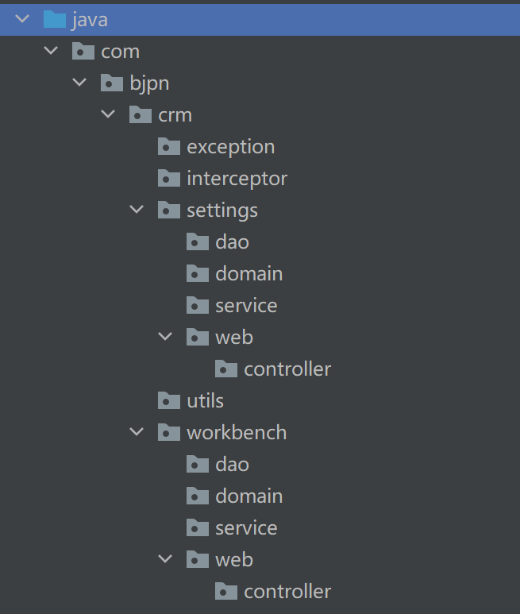
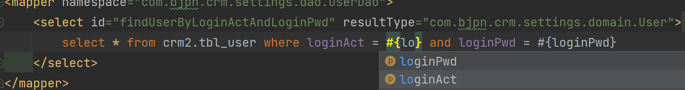
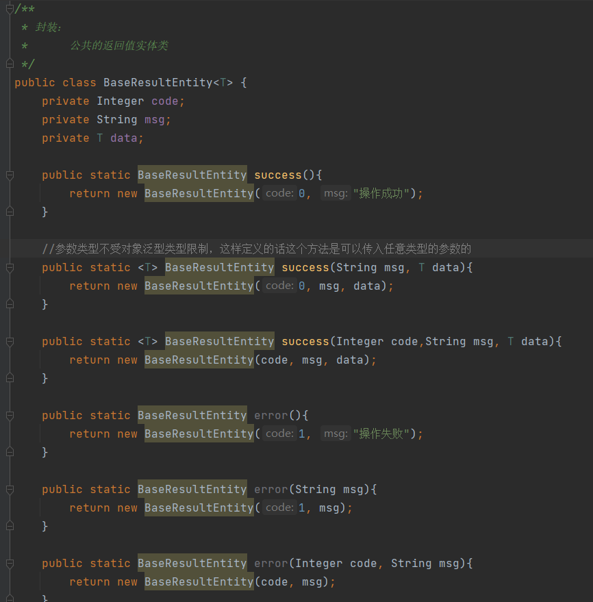
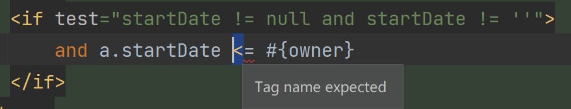
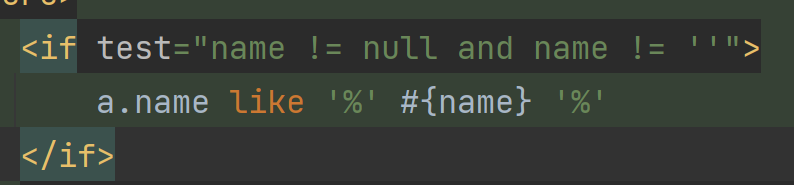

# CRM客户关系管理系统项目笔记


# CRM：客户关系管理系统

> 大连交通大学 信息学院 刘嘉宁 2021-10-19 -- 2022-01
>
> 笔记摘自：bjpowernode 李宁


项目使用手册：

- 修改 pom.xml 中 MySQL 驱动等依赖版本
- 创建 crm2 库并导入 crm2.sql 
- 在 crm/utils/RedisUtil.java 中配置 Jedis 连接信息


项目演示：

- [演示地址](http://49.232.2.175:8080/crm)


## JSP的base标签

- basePath为拼接的url连接
- base标签href引入了basePath变量
- 在页面使用相对路径的地方可以使用basePath前缀
- 自动拼接出：http://localhost:8080/crm/

```jsp
<%@ page contentType="text/html;charset=UTF-8" language="java" isELIgnored="false" %>
<%
String basePath = request.getScheme() + "://" + request.getServerName() + ":" + request.getServerPort() + request.getContextPath() + "/";
%>
<html>
<head>
   <base href="<%=basePath%>">
```


## 1. applicationContext-web.xml

- 注解扫描, 扫描 ontroller 包下的注解

- 注解驱动, 加载处理器适配器和处理器映射器

- 视图解析器, 前缀和后缀加载视图 ( Jsp )

  - 前缀 : `/WEB-INF/jsp`

  - 后缀 : `.jsp`

  - 控制器返回的资源 : `return "/index";`

    `/WEB-INF/jsp/index.jsp`

- 拦截器配置
  - 权限校验: 除了访问登录页面和登录操作外, 其余必须要求当前用户登录才可以访问
- 文件上传解析器
  - 文件上传操作


## 2. applicationContext-service .xml

- 注解扫描, 扫描 service 包下的注解
- 加载 spring 的声明式事务控制
  - aop = 切面 + 切入点
  - 声明式事务控制 = 切入点 + 切面 + 事务管理器
  - save, update , delete开头的方法需要开启事务
  - 其他方法只读事务
- 加载 applicationContext-dao.xml 配置文件


## 3. applicationContext-dao.xml
- 数据库连接池配置
  - driver, url, username, password

* mybatis 的整合
  - sqlSessionFactoryBean 
    - 生成sqlSessionFactory
    - 加载 mybatis 的配置文件
  - mapperScanner
    - 生成sqlSession
    - 扫描 mybatis 的 dao 接口, 将接口创建对应的代理对象, 交给 spring 容器进行管理


## 项目搭建流图



- exception包：异常包
- interceptor包：拦截器包
- setting包：代表setting业务模块，以后还有workbench等
  - dao包：处理持久层的接口和mapper文件
  - domain包：存放实体类，也有命名为entity、pojo
  - service包：处理业务逻辑层事务业务等
  - web包：web项目
    - controller包：存放Servlet文件
- utils包：工具包，其中放的工具也会被其他业务使用


## UUID

- 什么是UUID：共36位由字母和数字和 ' - ' 生成的随机串，全世界唯一。
- UUID组成：随机数 + 时间戳 + 硬件编码

```java
UUID uuid = UUID.randomUUID();
String id = uuid.toString();
id = id.replaceAll("-", "");
```


## Ajax路径URL

- 相对路径：settings/user/login.do
  - 相对路径会自动拼接项目名称
  - http://localhost:8080/crm/settings/user/login.do
- 绝对路径：/settings/user/login.do
  - 绝对路径不会自动拼接项目名称
  - http://localhost:8080/settings/user/login.do


## Ajax返回值resp约定定义

- code：返回值的编码
  - 0：操作成功
  - 1：操作失败
  - 2：用户名或密码错误
  - ...
- msg：日志信息
- data：具体数据

```json
resp{
    code: "0/1/...",
    msg: "respInfo",
    data: {
        null,
        ["abcd", "efgh", "jklm"],
        [
	    	{name: "admin", pswd: "123"},
	    	{name: "admin1", pswd: "1234"},
    	]
    }
}
```


## 实体类序列化与反序列化

- 实现 `Serializable` 接口


## IDEA 的 Free mybatis plugins 插件

- 可以根据 DAO 类方法名自动生成 Mapper映射文件的对应标签
  - find => `<select>`
  - delete  => `<delete>`
  - update => `<update>`
  - insert => `<insert>`





## Cookie的设置

```java
//将Cookie设置为根路径下，让所有模块都能访问到这个Cookie
cookie.setPath("/");
//设置Cookie存放在硬盘中，60*60*24为一天
cookie.setMaxAge(60*60*24*10);
```


## 清除Session中的数据

- session.removeAttribute("数据名");

```java
//2. 清除Session中的数据
HttpSession session = request.getSession();
session.removeAttribute("user");
```


## 灵活运用JSTL

```java
<c:forEach items="${typeList}" var="t" varStatus="i">
   <%--
      varStatus: 相当于index
         i.index从0开始
         i.count从1开始
   --%>
   <%--灵活运用三目表达式--%>
   <tr class="${i.count%2 == 0? "": "active"}">
      <td><input type="checkbox" /></td>
      <td>${i.count}</td>
      <td>${t.code}</td>
      <td>${t.name}</td>
      <td>${t.description}</td>
   </tr>
</c:forEach>
```


## 全选与反选

- jsp传统实现方式

```js
//全选
function SelectAllAndUnSelectAll(){
   var select = $("#checkAll").prop("checked");
   for (var i = 0; i < $("input[name=ck]").length; i++) {
      $("input[name=ck]")[i].checked = select;
   }
}

//反选
function reSelectAll(){
   if($("input[name=ck]").length == $("input[name=ck]:checked").length){
      $("#checkAll").prop("checked", true);
   }else{
      $("#checkAll").prop("checked", false);
   }
}
```

- ajax异步刷新的方式
- 使用异步刷新加载出来的代码**不能**使用 `$("input[name=ck]")` jQuery 方式绑定DOM对象

```js
//  不是由 ajax 异步出来的 html 标签  事件名     子容器对象         回调方法
$("#dictionaryValueListBody").on("click", "input[name=ck]", function (){
	$("#checkAll").prop("checked", $("input[name=ck]:checked").length == $("input[name=ck]").length)
})
```


## 封装返回值类型实体类

- 每次 ajax 请求都要返回一些固定格式的 MAP
- 将使用频率高相似度高的 MAP 内容包装成实体类
- 返回时就可以返回这个类
- ajax 在前端也可以向解析 MAP 一样解析这个类中的内容、

1. 通过实体类进行封装



2. 通过 MAP 集合基础上进行封装


3. 对分页查询进行封装

   略


## 当前方法已过时标记

- `@Deprecated`


## 在mybatis动态查询的if标签中

- `<` `>` 会被解析成标签的开始和结束
- 应使用 `&lt;` `&gt;`转义



- 模糊查询 '%' 左右都要加上空格




## HTML：设置select标签默认option

- 设置 select 标签 value 属性即可


## POI: Office 文档的 Java 处理包

- POI 对 Excel 文件的坐标
  - HSSFWorkbook : Excel工作簿对象
  - HSSFSheet: Excel页码对象
  - HSSFRow : Excel行对象
  - HSSFCell: Excel列/单元格对象
- 使用 MultipartFile 获取到前端传入的对象，然后通过 HSSFWorkbook 等对象转换提取后，存入数据库


## 文件 input 框的使用

- 为文件 input 框添加 Form 表单
- 为 Form 表单添加 enctype 属性为 `multipart/form-data`
  - application/x-www-form-urlencoded【默认】只能上传文本格式的文件
  - multipart/form-data 以二进制形式上传，可以上传所有类型文件


- 再后端使用 MultipartFile 类型接收文件
  - `String originalFilename = activityFile.getOriginalFilename();` 获取文件名
  - `activityFile.transferTo(new File(url+"/"+fileName));` 将文件写入到指定文件中


## 调用浏览器的文件下载功能

- 利用 response 对象创建输出流，POI 就可以通过这个输出流输出文件

```java
//声明返回类型
response.setContentType("octets/stream");
response.setHeader("Content-Disposition","attachment;filename=Activity-"+DateTimeUtil.getSysTime()+".xls");

//创建输出流
OutputStream out = response.getOutputStream();

//通过输出流输出workbook的内容
workbook.write(out);
```


## 为异步加载出的标签绑定事件

- 使用异步刷新加载出来的代码**不能**使用 `$("...")` jQuery 方式绑定DOM对象

解决方式：

```js
//  不是由 ajax 异步出来的 html 标签  事件名     子容器对象         回调方法
$("#dictionaryValueListBody").on("click", "input[name=ck]", function (){
	$("#checkAll").prop("checked", $("input[name=ck]:checked").length == $("input[name=ck]").length)
})
```


## 服务器缓存

- 使用全局作用域 ServletContext 作为缓存区域，将常用字典值存在全局作用域中，需要时直接从缓存中取
- 需要注意：
    - 当持久化数据库的值增删改时，缓存数据应及时更新
    - 需要处理缓存穿透、缓存击穿、缓存雪崩的问题


## 如何将对象存至Redis中？

- Redis 中只支持 String 类型，但是 String 类型是二进制安全的，这意味着 String 类型可以存储任意类型数据。
- 任何图片、视频等等格式文件，只要可以**序列化**与**反序列化**，那么它都可以保存至 Redis 中。
- Redis 的 String 类型最大可以存储 512MB 内容。
- 在 Java 中，一个类实现了 Serializable 接口，那么这个类就是可以序列化的。

序列化工具类：

```java
import java.io.*;

public class SerializableUtil {
    //序列化
    public static byte [] serialize(Object obj){
        ObjectOutputStream obi=null;
        ByteArrayOutputStream bai=null;
        try {
            bai=new ByteArrayOutputStream();
            obi=new ObjectOutputStream(bai);
            obi.writeObject(obj);
            byte[] byt=bai.toByteArray();
            return byt;
        } catch (IOException e) {
            e.printStackTrace();
        }
        return null;
    }

    //反序列化
    public static Object unserizlize(byte[] byt){
        ObjectInputStream oii=null;
        ByteArrayInputStream bis=null;
        bis=new ByteArrayInputStream(byt);
        try {
            oii=new ObjectInputStream(bis);
            Object obj=oii.readObject();
            return obj;
        } catch (Exception e) {

            e.printStackTrace();
        }
        return null;
    }
}
```


## JQuery中，获取键盘事件

- 在相应的事件回调方法上加 event 形参，JQuery 会自动将事件对象传入

```js
$("#searchActivity").keydown(function (event){
    console.log(event.keyCode);
    
    if (event.keyCode == 13){
        alert("敲击了回车");
        return false;
    }   
});
```


## 关闭输入框自动提示

- 为输入框添加属性 autocomplete 值为 off

```html
<input type="text" autocomplete="off">
```


## Bootstrap 自动补全插件

- typeahead 插件

```js
//source: 输入框内容变化时,自动回调的方法
//	query: 输入的关键字
//	process: 解析数据的方法(需按规则对内容解析)
//delay: 等待多久发送一次请求(毫秒)
$("#create-customerName").typeahead({
    source: function (query, process) {
        $.post(
            "workbench/transaction/getCustomerName.do",
            { "name" : query },
            function (data) {
                //data格式: data["张三有限责任公司", "法外狂徒张三", "思阁张三"]
                process(data);
            },
            "json"
        );
    },
    delay: 500
});
```


## echarts 图表插件

1. 导入插件

```html
<script type="text/javascript" src="jquery/ECharts/echarts.min.js"></script>
```

2. 为插件提供显示区域

```html
<!-- 为 ECharts 准备一个定义了宽高的 DOM -->
<div id="main" style="width: 600px;height:400px;"></div>
```

3. 初始化插件，指定显示区域、指定配置和数据、显示

    - option：图表的配置和数据

        - legend：图表的数据种类

        - xAxis：图表 x 轴坐标显示内容

        - yAxis：图表 y 轴坐标显示内容（默认自动）

        - series：显示内容列表
            - name：对应的数据种类
            - type：显示的图的类型
            - data：图的数据

```js
// 基于准备好的dom，初始化echarts实例
    var myChart = echarts.init(document.getElementById('main'));

    // 指定图表的配置项和数据
    var option = {
        title: {
            text: 'ECharts 入门示例'
        },
        tooltip: {},
        legend: {
            data: ['销量']
        },
        xAxis: {
            data: ['衬衫', '羊毛衫', '雪纺衫', '裤子', '高跟鞋', '袜子']
        },
        yAxis: {},
        series: [
            {
                name: '销量',
                // type: 'bar',//柱状图
                // type: 'pie',//饼状图
                type: 'line',//折线图
                data: [5, 20, 36, 10, 10, 20]
            }
        ]
    };

    // 使用刚指定的配置项和数据显示图表。
    myChart.setOption(option);
```

效果：


交易历史图表效果：


