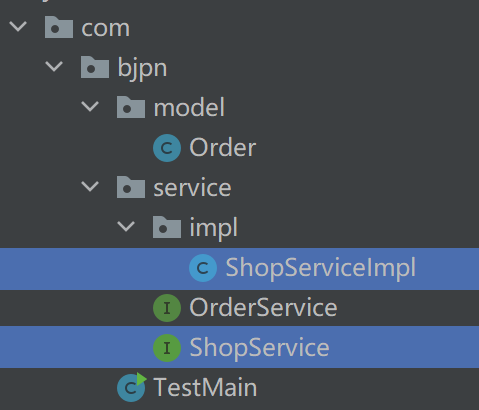
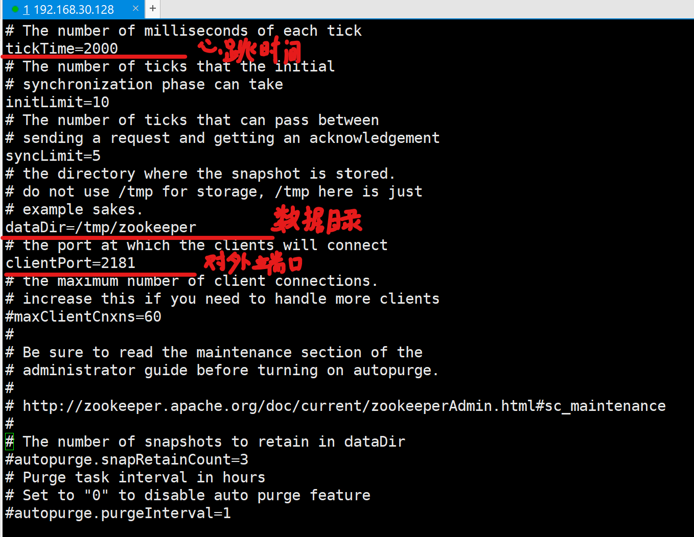
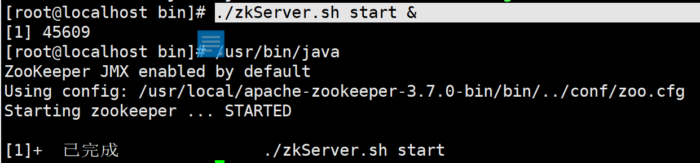

# Dubbo自学笔记md版

# Dubbo

> 大连交通大学 信息学院 刘嘉宁 2021-11-12
>
> 笔记摘自 bjpwernode 秦世国

## 什么是Dubbo

- **高性能**的 RPC 框架, 解决了分布式中的调用问题
- 不同于HTTP需要进行7步走(三次握手和四次挥手)，Dubbo采用Socket（TCP）通信机制，一步到位
- 可直接将实例化（实现 Serializable 接口）的数据以二进制流形式传输

## 什么是分布式

- 分布式系统是若干独立系统的集合, 但是用户使用起来像是在使用一套系统

- 解决高并发问题

## 应用架构的发展

1. 单一架构：将所有业务放到一台服务器中
   - 性能差
2. 垂直应用架构：将大应用拆分成为小应用(一般按业务纬度拆分), 根据访问频率决定部署的服务器数量
   - 页面更改难
   - 应用间不能相互调用
3. 分布式架构：将业务拆分后, 用某种（RPC（Dubbo））方式实现各个业务模块的远程调用和复用
   - RPC模式（远程过程调用模式）
   - 应用间客户相互调用

## Dubbo的三大核心能力

- 面向接口的远程方法调用：A项目中的接口可让B项目实现（由Dubbo实现）
- 智能容错负载均衡
- 服务自动注册和发现

## Dubbo的基本架构

- ==服务提供者（Provider）==：暴露服务的服务提供方，服务提供者在启动时向注册中心注册自己提供的服务。
- ==服务消费者（Consumer）==: 调用远程服务的服务消费方，在启动时向注册中心订阅自己所需的服务，从提供者地址列表中基于**软负载均衡算法**选一台提供者进行调用，如果调用失败再选另一台调用。
- ==注册中心（Registry）==：注册中心返回服务提供者地址列表给消费者，如果有变更将基于**长连接**推送变更数据给消费者
- ==监控中心（Monitor）==：监控服务消费者和提供者，在内存中累计调用次数和调用时间，定时每分钟发送一次统计数据到监控中心

## 协议

- Dubbo支持多种协议：dubbo, hessian , rmi , http, webservice , thrift , memcached , redis

- Dubbo官方推荐使用 dubbo 协议，默认端口 20880
- 在 Spring 配置文件加入

~~~xml
<dubbo:protocol name="dubbo" port="20880" />
~~~

## 使用Dubbo

##### 一、创建服务提供者

1. 在 pom.xml 中添加依赖

~~~xml
<!--Spring -->
<dependency>
    <groupId>org.springframework</groupId>
    <artifactId>spring-context</artifactId>
    <version>4.3.16.RELEASE</version>
</dependency>

<!--Dubbo依赖-->
<dependency>
    <groupId>com.alibaba</groupId>
    <artifactId>dubbo</artifactId>
    <version>2.6.2</version>
</dependency>
~~~

2. 在 pom.xml 中添加编译插件

~~~xml
<!--JDK1.8编译插件-->
<plugin>
    <artifactId>maven-compiler-plugin</artifactId>
    <version>3.1</version>
    <configuration>
        <source>1.8</source>
        <target>1.8</target>
    </configuration>
</plugin>
~~~

3. 创建实体类实现 Serializable 接口

4. 创建接口及实现类

   

5. 在 实现类名-privider.xml（ spring 配置文件） 中添加

~~~xml
    <!--服务提供者的唯一标识-->
    <dubbo:application name="01-link-orderservice-provider"/>
    <!--指定dubbo使用的协议及端口号-->
    <dubbo:protocol name="dubbo" port="20880"/>
    <!--暴露服务接口
        interface:暴露的接口的全限定名
        ref:暴露的接口的实现类
        registry:不使用注册中心 N/A
    -->
    <dubbo:service interface="com.bjpn.service.OrderService" ref="orderService" registry="N/A"/>

    <!--将接口实现类创建在Spring容器中-->
    <bean name="orderService" class="com.bjpn.service.impl.OrderServiceImpl"/>
~~~

6. 测试运行

~~~java
    public static void main(String[] args) throws IOException {
        ClassPathXmlApplicationContext context = new ClassPathXmlApplicationContext("orderservce-provider.xml");
        //启动 Spring 容器
        context.start();

        //阻塞运行
        System.in.read();
    }
~~~

##### 二、创建服务消费者

1. 创建新项目，添加依赖、插件

2. 创建接口及实现类，编写组合接口的实现类，并创建 set 方法（由 Spring 容器注入）

3. 在 实现类名-consume.xml （ spring 配置文件） 中添加

~~~xml
    <!--服务消费者的唯一标识-->
    <dubbo:application name="link-main-web" />

    <!--引用远程接口服务: 类似于Bean标签，用于创建来自另一台服务器中的对象
        Dubbo为其接口创建动态代理对象，通过获取到的这个代理对象调用远程服务器中的具体方法
        
        id 远程服务代理对象名
        interface 远程接口全限定名
        url 服务提供者地址
        registry N/A不使用注册中心
    -->
    <dubbo:reference id="remoteShopService"
                     interface="com.bjpn.service.OrderService"
                     url="dubbo://localhost:20880"
                     registry="N/A"/>

    <!--为组合了远程接口实现类的类实例化-->
    <bean name="shopService" class="com.bjpn.service.impl.ShopServiceImpl">
        <property name="orderService" ref="remoteShopService"/>
    </bean>
~~~

4. 测试运行

~~~java
    public static void main(String[] args) throws IOException {
        ClassPathXmlApplicationContext context = new ClassPathXmlApplicationContext("shop-consume.xml");
        ShopService shopService = (ShopService) context.getBean("shopService");

        Order order = shopService.buyGoods(10001, "零食", 20.0, 2);
        System.out.println(order);
    }
~~~

## Dubbo服务化最近实践

1. 分包
   - 将服务接口、服务模型、服务异常等均放在公共包中
   - 将需要重复编写的接口、类等 install 在 maven 仓库中

2. 粒度
   - 服务接口尽可能大粒度（高内聚）
   - 接口以业务场景划分，而不是某功能的某一步骤
3. 版本
   - 为接口定义版本号，区分同一接口的不同实现
   - 可为`<dubbo:service ` `<dubbo:reference ` 标签指定相同 version 属性，绑定暴露的接口实现类和引用远程的 “ 接口实现类 ”

## Dubbo常用标签

- 公用标签
  1. `<dubbo:application name=”服务的名称”/>` 配置应用信息，唯一标识服务
  2. `<dubbo:registry address=”ip:port” protocol=”协议”/>` 配置注册中心
      - `check="false"` 启动时是否检查注册中心是否可用
- 服务提供者标签
  1. `<dubbo:service interface=”服务接口名” ref=”服务实现对象bean”>` 配置暴露的服务
      - `retries="2"` 自动重试次数
      - `timeout="2000"` 超时时间，2000毫秒内没有响应则不再重试
      - `version="1.0.0"` /  `version="1.0.1"`定义版本号，在提供相同接口的实现类时 用版本号区分
- 服务消费者标签
  1.  `<dubbo:reference id=”服务引用bean的id” interface=”服务接口名”/>` 引用远程服务
      - `check="false"` 启动时是否检查注册中心是否可用
      - `retries="2"` 自动重试次数
      - `timeout="2000"` 超时时间，2000毫秒内没有响应则不再重试
      - `version="1.0.0"` 定义版本号，在提供相同接口的实现类时 用版本号区分

## 注册中心

- 服务提供者将服务的唯一标识（接口的全限定名）和基本信息（IP、端口、版本号...）登记到注册中心
- 服务消费者向注册中心查找服务的唯一标识，返回服务的清单列表，然后拿到服务的基本信息向服务提供者索要服务
- 注册中心用于将服务统一管理

注册中心的类型

- Multicast注册中心：组播方式

- Redis注册中心：使用Redis作为注册中心

- Simple注册中心：就是一个dubbo服务。作为注册中心。提供查找服务的功能。

- Zookeeper注册中心：使用Zookeeper作为注册中心【推荐使用】

### Zookeeper

- Zookeeper是一个高性能的，分布式的，开放源码的分布式应用程序协调服务

Zookeeper 使用：

1. 配置安装目录 conf 下的 zoo.cfg

2. 在安装目录 bin 目录下启动 Zookeeper

3. 为项目添加 Zookeeper 依赖

~~~xml
    <!-- zookeeper客户端依赖 -->
    <dependency>
      <groupId>org.apache.curator</groupId>
      <artifactId>curator-framework</artifactId>
      <version>4.1.0</version>
    </dependency>
~~~

4. 在项目 spring.xml 配置文件中添加, 并删除 `registry="N/A"` 、`url="dubbo://localhost:20880"`

~~~xml
	<!--指定注册中心-->
    <dubbo:registry address="zookeeper://192.168.30.128:2181"/>
~~~

### Dubbo 中 Zookeeper 的高可用

- 高可用：通常来描述一个系统经过专门的设计，从而减少不能提供服务的时间，而保持其服务的高度可用性。
- 健壮性：Dubbo 会将 Zookeeper 中服务信息存储在内存中，即使宕机也可以保证注册中心提供服务列表查询，但不能注册新服务

## 监控中心

- Dubbo 提供的简陋的管理控制台
- 监控服务提供者和消费者的运行状态

