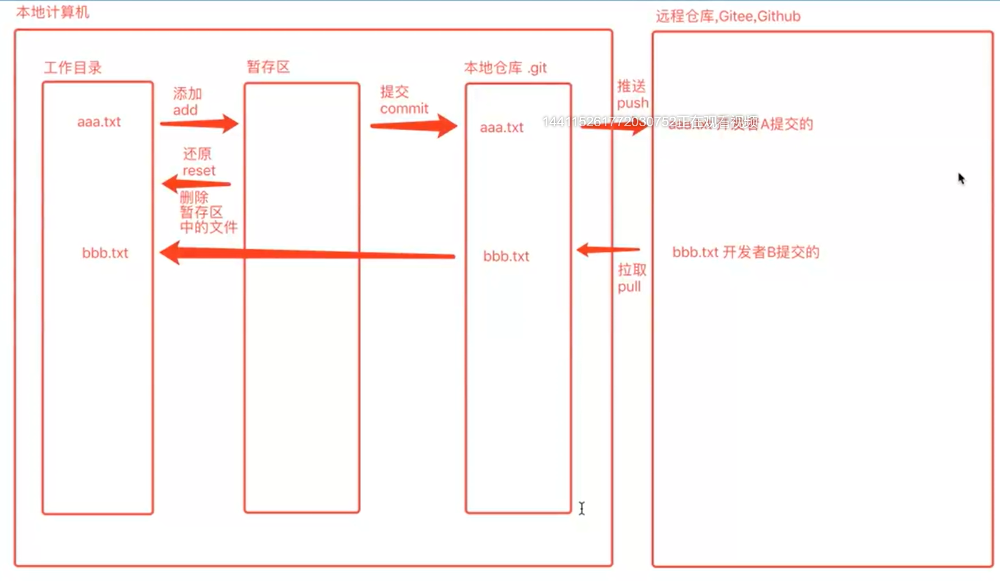
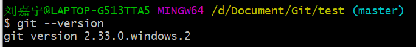

# GIT自学笔记md版mini版

# GIT

> 大连交通大学 信息学院 刘嘉宁 2021-10-17
>
> 笔记摘自链接：bjpowernode 李宁

## GIT：版本控制工具

- 一个开源的分布式版本控制系统，可以有效，高速的管理项目版本。

- 用于存储，追踪目录和文件的修改历史

## GIT的作用

- 协同开发
- 版本控制
- 数据备份
- 权限控制
- 分支管理

## GIT的优点

- 适合分布式，强调个体。
- 公共服务器压力和数据量都不大。
- 速度快，灵活。
- 相对容易的解决冲突。
- 大部分操作在本地完成，不需要联网。

- 以快照流的方式工作。

## GIT的目录

- 工作目录
  - 保存代码的文件夹
- 暂存区
  - 类似于回收站，暂时保存代码用
- 本地仓库
  - git init 创建出来的 .git 隐藏目录
- 远程仓库
  - 代码的托管平台 Github / Gitee

## GIT常用命令

移动到Git中test文件夹：`cd D:/Document/Git/test`

==git是不会管理空文件夹的==

#### 查看版本号 `git --version`

#### 创建本地仓库 `git init`

- 本地仓库创建后会出现一个隐藏的 .git 文件夹

#### 工作目录**添加**到暂存区 `add`

- `git add 文件`
- `git add .` 提交当前目录所有文件

#### 暂存区**还原**到工作目录  `reset`

- `git reset 文件` 删除暂存区中的该文件

#### 暂存区**提交**到本地仓库 `commit`

- `git commit`
- `git commit -m "日志信息"`
- `git commit --amend -m "日志信息"` 重新提交日志信息

#### 查看暂存区文件状态 `git status`

- 已跟踪文件：绿色，已经添加到暂存区【以跟踪】
- 未跟踪文件：红色，未添加到暂存区【未跟踪】
  - `git restore HEAD 文件名` 让文件变为【未跟踪】状态

#### 设置签名`config`

- 设置签名（用户名，邮箱）

  ​	`git config user.name "LiuJN"`

  ​	`git config user.email "LiuJaNing@163.com"`

- 设置全局签名（用户名，邮箱）

  ​	`git config --global user.name "LiuJN"`

  ​	`git config --global user.email "LiuJaNing@163.com"`

- `git config --list` 查看当前所有 config 信息

#### 查看日志信息 `log`

- `git log`  查看当前日志信息，当前时间节点的日志信息

- `git reflog`  查看本地仓库更新历史记录

#### 版本切换 `reset`

- `git reset --hard 版本的Hash值`

#### 文件删除 `rm`

- 文件被删除之后，还需要 添加、提交 操作让本地仓库知道文件已经被删除

- 通过 git 命令删除文件  `rm`

  - `git rm 文件名` 删除工作目录、缓存区中的文件，直接提交即可

#### 文件找回 `restore`

- ==删除的文件如果已经提交则无法找回==

  - `git restore 文件名` 找回添加到暂存区后被删除的文件

  - `git restore --staged 文件名` 找回使用 git rm 命令删除的文件到暂存区，然后 `git restore 文件名` 找回文件到工作目录

## 分支管理

#### 创建分支`branch`

- `git branch 分支名`

  - 创建出来的分支基于当前分支的代码，创建之后分支的操作互不影响

#### 查看分支`branch`

- `git branch`

#### 切换分支`checkout`

- `git checkout 分支名`

#### 创建并切换分支`checkout -b`

- `git checkout -b 分支名称`

#### 删除分支`branch -d`

- 无法删除当前所处的分支
- `git branch -d 分支名`

#### 强制删除分支`branch -D`

- 如果分支已经被修改过，必须使用强制删除
- `git branch -D 分支名`

#### 分支合并`merge`

- `git merge 目标分支的名称` 将目标分支的内容合并到当前分支

## 远程仓库

#### 本地仓库关联远程仓库`remote add` 

- `git remote add 远程仓库名 远程仓库地址`

#### 查看关联的远程仓库信息`remote -v`

- `git remote -v`

#### 删除与远程仓库的关联关系`remote remove`

- `git remote remove 远程仓库名`

#### 将本地仓库推送到远程仓库`push`

- `git push 远程仓库名 本地分支名`
- 第一支推送的分支就是远程仓库的默认分支，无法删除

#### 删除远程仓库分支`push -d`

- `git push -d 远程仓库名 远程仓库分支名`

#### 克隆代码到本地仓库`clone`

- `git clone 远程仓库地址` 克隆到当前文件夹下，默认放在远程仓库名称

- `git clone 远程仓库地址 本地文件夹名称` 自己指定本地文件夹名称

- `git clone -b 远程仓库分支 远程仓库地址 本地文件夹名称` 克隆远程仓库的分支到本地

#### 拉取分支到本地仓库`pull`

- 拉取本地仓库不存在的分支
  - `git pull 远程仓库名 远程仓库分支名:本地仓库分支名`
- 拉取本地仓库已经存在的分支【本地已有同名分支】
  - `git pull 远程仓库名称 远程仓库分支名`

> 强制拉取远程仓库的内容到不同版本的本地仓库中 `git pull origin master --allow-unrelated-histories` 

