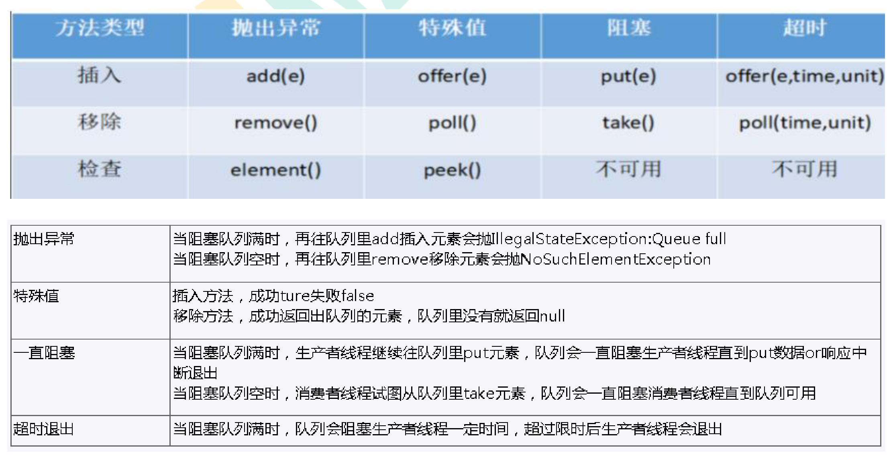
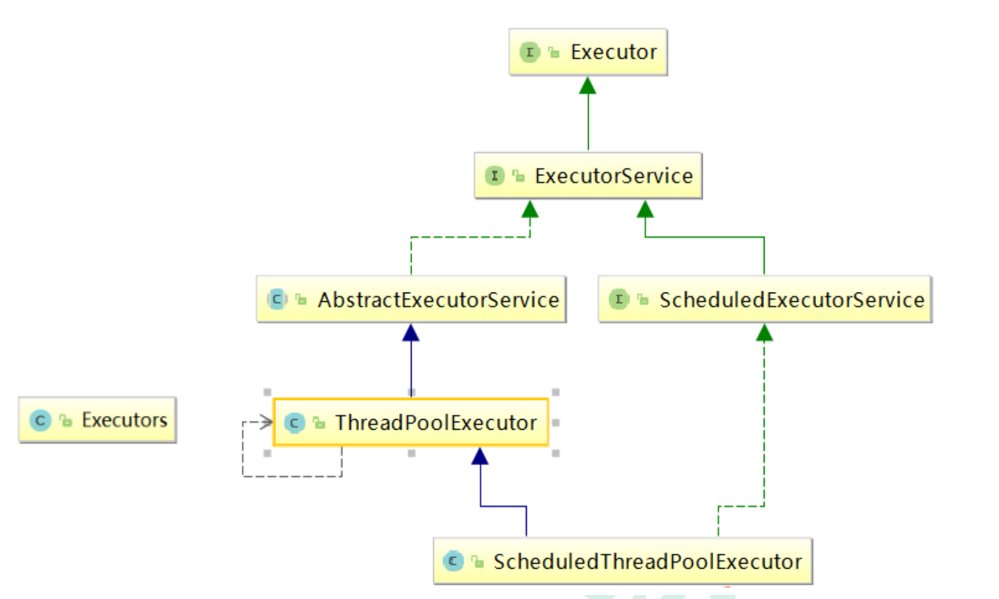
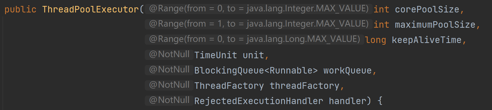
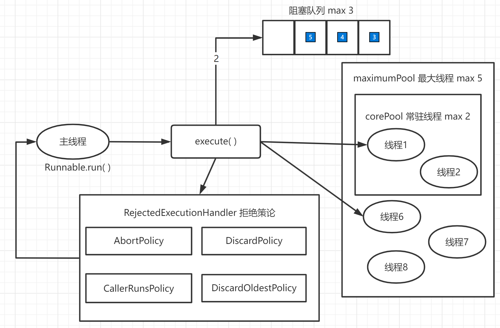

# JUC自学笔记md版


# JUC

> 大连交通大学 信息学院 刘嘉宁
>
> 笔记摘自 尚硅谷 


## 什么是 JUC

- 是 java.util.concurrent 工具包的简称
- 是一个线程处理工具包，从 JDK 1.5 开始出现


### 进程与线程

- 进程（Process）：指系统中正在运行的一个应用程序，程序一旦运行就是进程【资源分配的最小单位】
- 线程（Thread）：系统分配处理器时间资源的基本单元，是进程之内独立执行的一个单元执行流【程序执行的最小单位】


### 进程的状态

- 线程中的枚举类：`Thread.state`
    - NEW 新建
    - RUNNABLE 准备就绪
    - BLOCKED 阻塞
    - WAITING 不见不散（`wait()` / `join()` 没有指定超时值时）
    - TIMED_WAITING 过时不候 （`wait()` / `join()` 指定了超时值时）
    - TERMINATED 终结


### wait 与 sleep 区别

不同点：

- 声明的位置不同：Thread  类中声明 sleep , Object 类中声明 wait
- 需求不同：sleep 可以在任何需要的场景下调用，wait 必须使用在同步代码块或同步方法中
- 是否释放同步锁：wait 会释放锁，sleep 不会

- 结束阻塞的方式：wait 需要 notify / notifyAll 结束阻塞，sleep 等自身结束就好

相同点：

- 都会被 interrupted 方法中断
- 都是在哪里睡就在哪里醒


### 并发与并行

1. 串行：多个任务排队执行，一次只能取一个执行一个
2. 并行：同一时间点，可以同时取多个任务，同时执行多个任务，多个 CPU 核心独立同时执行
3. 并发：同一时间段内，同一时间只能执行一个任务，但是这段时间内看起来像是同时执行的


### 其他概念

- 管程：Monitor 监视器，就是锁，锁住的对象（每个对象都有一个管程对象）
    - 锁的进入、退出就是使用管程对象实现的
- 守护线程：`t.setDaemon(true)` 将一个线程设为守护线程，守护线程的生命周期和一个程序的生命周期相同


## Lock 接口

- 什么是**可重入**？

    - 可重入性表现在同一个线程可以多次获得锁，而不同线程依然不可多次获得锁，借助 AQS 同步器来实现

- Lock 与 synchronized 的区别

    - Lock 不是 java 语言内置的
    - Lock 需要手动上锁和释放锁
        - synchronized 发生异常时会自动释放锁，Lock 在发生异常时不会释放锁，需要在 finally 中释放锁
    - Lock 可以让等待锁的线程响应中断，synchronized 不行
    - Lock 可以知道有没有成功获取锁，synchronized 不行
    - Lock 在锁竞争激烈时效率较高

- Lock 接口的实现类 ReentrantLock 可重入锁

    ```java
    class MyThread{
        Lock lock = new ReentrantLock();
        void fun(){
            lock.lock();
            try{
                //业务代码
            }finally{
                lock.unlock();
            }
        }
    }
    ```


## 线程间通信

- 即 生产者与消费者 的问题

- 用到的 `Object` 方法

    - `wait()` 在其他线程调用此对象的 notify() 方法前，导致当前线程等待【会释放锁】
    - `notify()` 唤醒在此对象监视器上等待的一个线程
    - `notifyAll()` 唤醒在此对象监视器上等待的所有线程

- 用到的 `Condition` 方法

    > 用法：使用 Lock 锁时，用下面方法进行等待和唤醒
    >
    > ```java
    >     Lock lock = new ReentrantLock();
    >     Condition condition = lock.newCondition();
    >     condition.await(); condition.signal(); condition.signalAll();
    > ```

    - `await()` 同 `wait()` 
    - `signal()` 同 `notify()` 
    - `signalAll()` 同 `notifyAll()` 

- 生产者和消费者例子之 synchronized

```java
public class ShareIncrDecr {
    
    public static void main(String[] args) {
        Share share = new Share();
        new Thread(()->{
            for (int i = 0; i < 10; i++) {
                try {
                    //这是生产者线程，负责 +1
                    share.incr();
                } catch (InterruptedException e) {
                    e.printStackTrace();
                }
            }
        }).start();
        new Thread(()->{
            for (int i = 0; i < 10; i++) {
                try {
                    //这是消费者线程，负责 -1
                    share.decr();
                } catch (InterruptedException e) {
                    e.printStackTrace();
                }
            }
        }).start();
    }
    
}

/**
 * Share 类就是一个带控制的共享对象
 * 仓库空时，就允许生产者生产，不允许消费者消费
 * 仓库满时，就允许消费者消费，不允许生产者生产
 */
class Share{
    private int number = 0;

    void incr() throws InterruptedException {
        synchronized(this){
             if (number != 0){
                 //非空就等待
                 this.wait();
             }
             //生产
             number++;
             System.out.println(Thread.currentThread().getName()+" 目前 "+number);
             //唤醒等待着的所有线程
             this.notifyAll();
         }
    }

    void decr() throws InterruptedException {
        synchronized(this){
            if (number != 1){
                //不满就等待
                this.wait();
            }
            //消费
            number--;
            System.out.println(Thread.currentThread().getName()+" 目前 "+number);
            //唤醒等待着的所有线程
            this.notifyAll();
        }
    }

}
```

- 遇到的问题：

    1. 虚假唤醒

        - 就是当有多个生产者多个消费者时，一个生产者在等待的时候，另一个生产者改变了标记值，但是第一个生产者结束等待之后没有再次判断标记值。因为 wait 方法会释放锁，第一个生产者释放了锁，第二个生产者就有可能改变其标记值
        - 解决：if 变 while

        ```java
            synchronized(this){
                while (number != 1){
                    //wait 的特点：在哪里睡，就在哪里醒
                    this.wait();
                }
                number++ / --;
                this.notifyAll();
            }
        ```

    2. 为什么推荐使用 notifyAll 而不是 notify , notifyAll 岂不是会唤醒所有线程导致 资源竞争 降低性能?
        - 正因为notify只随机唤醒一个阻塞线程，如果一个线程执行完+1之后执行notify，而唤醒的线程不满足执行条件的线程，此时线程就都阻塞了。而使用notifyAll，会唤醒所有阻塞线程，只要有一个线程符合条件就可以继续执行，就不会出现这种情况了。

    3. 线程的定制化通信


```java
public class ShareDiy {
    public static void main(String[] args) {
        ShareResource shareResource = new ShareResource();
        new Thread(()->{
            for (int i = 0; i < 10; i++) {
                try {
                    shareResource.print5(i);
                } catch (InterruptedException e) {
                    e.printStackTrace();
                }
            }
        }, "AA").start();
        new Thread(()->{
            for (int i = 0; i < 10; i++) {
                try {
                    shareResource.print10(i);
                } catch (InterruptedException e) {
                    e.printStackTrace();
                }
            }
        }, "BB").start();
        new Thread(()->{
            for (int i = 0; i < 10; i++) {
                try {
                    shareResource.print15(i);
                } catch (InterruptedException e) {
                    e.printStackTrace();
                }
            }
        }, "CC").start();
    }
}

class ShareResource{
    private int flag = 1;

    Lock lock = new ReentrantLock();
    //每一个 condition 对应了一个线程，让线程依次执行也就是让 condition 依次执行
    Condition c1 = lock.newCondition();
    Condition c2 = lock.newCondition();
    Condition c3 = lock.newCondition();

    public void print5(int loop) throws InterruptedException {
        lock.lock();

        try {
            while (flag != 1){
                //如果当前抢到执行的线程不是指定的线程：等待
                c1.await();
            }

            for (int i = 0; i < 10; i++) {
                System.out.println(Thread.currentThread().getName()+" :: "+i+"在轮数"+loop);
            }
            //指定下次执行的线程
            flag = 2;

            //唤醒下一线程
            c2.signal();
        } finally {
            lock.unlock();
        }
    }

    public void print10(int loop) throws InterruptedException {
        lock.lock();

        try {
            while (flag != 2){
                //如果当前抢到执行的线程不是指定的线程：等待
                c2.await();
            }

            for (int i = 0; i < 10; i++) {
                System.out.println(Thread.currentThread().getName()+" :: "+i+"在轮数"+loop);
            }
            //指定下次执行的线程
            flag = 3;

            //唤醒下一线程
            c3.signal();
        } finally {
            lock.unlock();
        }
    }

    public void print15(int loop) throws InterruptedException {
        lock.lock();

        try {
            while (flag != 3){
                //如果当前抢到执行的线程不是指定的线程：等待
                c3.await();
            }

            for (int i = 0; i < 10; i++) {
                System.out.println(Thread.currentThread().getName()+" :: "+i+"在轮数"+loop);
            }
            //指定下次执行的线程
            flag = 1;

            //唤醒下一线程
            c1.signal();
        } finally {
            lock.unlock();
        }
    }

}
```


## 集合的线程安全

1. ArrayList：当多个线程同时添加、获取元素时，会发生并发修改异常

```java
    List list = new ArrayList();

    for (int i = 0; i < 10000; i++) {
        new Thread(()->{
            list.add(1);
            System.out.println(list);
        }).start();
    }

    //Exception in thread "Thread-xx" java.util.ConcurrentModificationException
```

- 解决方案

    - Vector：是 List 接口的实现类，通过 synchronized 修饰方法实现线程安全，效率较低（JDK 1.0）

    ```java
    List list = new Vector();
    ```

    - Collections：通过 Collections 工具类的 synchronizedList 方法返回一个线程安全的 list，效率较低较古老

    ```java
    List list = Collections.synchronizedList(new ArrayList<>());
    ```

    - CopyOnWriteArrayList：是 JUC 包中线程安全 list
        - 使用**写时复制技术**，就是在并发读的时候处理写的安全 **独立写** 
        - 先复制出一份新集合，向新的集合中写入数据，写完再覆盖合并原有内容，读取新的集合空间中的内容

    ```java
    List list = new CopyOnWriteArrayList();
    ```

2. HashSet：当多个线程同时添加、获取元素时，会发生并发修改异常

```java
    Set set = new HashSet();

    for (int i = 0; i < 100; i++) {
        new Thread(()->{
            set.add(UUID.randomUUID().toString().substring(0, 4));
            System.out.println(set);
        }).start();
    }

    //Exception in thread "Thread-xx" java.util.ConcurrentModificationException
```

- 解决方案

    - CopyOnWriteArraySet：是 JUC 包中线程安全 set
        - 使用**写时复制技术**，就是在并发读的时候处理写的安全 **独立写** 
        - 先复制出一份新集合，向新的集合中写入数据，写完再覆盖合并原有内容，读取新的集合空间中的内容

    ```java
    Set set = new CopyOnWriteArraySet();
    ```

3. HashMap：当多个线程同时添加、获取元素时，会发生并发修改异常

```java
    Map<String, String> map = new HashMap<>();

    for (int i = 0; i < 100; i++) {
        new Thread(()->{
            map.put(UUID.randomUUID().toString().substring(0, 4), "1");
            System.out.println(map);
        }).start();
    }

    //Exception in thread "Thread-xx" java.util.ConcurrentModificationException
```

- 解决方案

    - ConcurrentHashMap：是 JUC 包中线程安全 map

    ```java
    	Map<String, String> map = new ConcurrentHashMap<>();
    ```


## 多线程锁

### synchronized 锁的八种情况

```java
class Test{
    public static void main(String[] args) throws InterruptedException  {
        Phone phone1 = new Phone();
        Phone phone2 = new Phone();
        new Thread(()->{
//          phone.sayHello();
            phone1.sendSMS();
        }).start();

        Thread.sleep(100);

        new Thread(()->{
            phone1.sendEmail();
        }).start();
    }
}

class Phone {
    synchronized void sendSMS() throws InterruptedException {
        TimeUnit.SECONDS.sleep(4);
        System.out.println("发送短信");
    }

    synchronized void sendEmail(){
        System.out.println("发送邮件");
    }

    void sayHello(){
        System.out.println("你好");
    }
}
```

> 1. 标准访问,先短信还是先邮件：是同一把锁，锁的范围是 this
>
> ```
> 发送短信
> 发送邮件
> ```
>
> 2. 在短信方法内停四秒,先短信还是先邮件：是同一把锁，锁的范围是 this
>
> ```
> 发送短信
> 发送邮件
> ```
>
> 3. 普通的 hello 方法,先短信还是先邮件：hello 方法与锁无关，先执行 hello
>
> ```
> 你好
> 发送邮件
> ```
>
> 4. 有两部手机,先短信还是先邮件：不是同一把锁，锁的范围是各自的 this
>
> ```
> 发送邮件
> 发送短信
> ```
>
> 5. 同一部手机,都是静态同步方法,先短信还是先邮件：是同一把锁，锁的范围是 Class
>
> ```
> 发送短信
> 发送邮件
> ```
>
> 6. 有两部手机,都是静态同步方法,先短信还是先邮件：是同一把锁，锁的范围是 Class
>
> ```
> 发送短信
> 发送邮件
> ```
>
> 7. 同一部手机,短信静态同步、邮件同步：不是同一把锁，锁的范围不同
>
> ```
> 发送邮件
> 发送短信
> ```
>
> 8. 有两部手机,短信静态同步、邮件同步：不是同一把锁，锁的范围不同
>
> ```
> 发送邮件
> 发送短信
> ```

- 锁的三种表现形式：
    1. 对于普通同步方法，锁是当前实例对象
    2. 对于静态同步方法，锁是当前类的 Class 对象
    3. 对于同步方法块，锁是 Synchronized 括号里的配置的对象

### 公平锁与非公平锁

- 非公平锁
    - synchronized、无参的 ReentrantLock
    - 容易有线程饿死，效率高
    - 不需要排队，直接抢
- 公平锁
    - `ReentrantLock(true)` 
    - 阳光普照，效率低
    - 会先判断是否有排队队列，如果有则排队，如果没有则执行

### 可重入锁

- 可重入锁也称递归锁，即进入了第一层之后内层的都可以随意进入
- synchronized 是隐式的可重入锁，ReentrantLock 是显式的可重入锁
- lock 锁在嵌套 lock 锁时会记录锁的 state 数量，在嵌套中不解锁不会影响运行，但会影响嵌套外的锁上锁


## Callable & Future 接口

- Callable 
    - 实现有返回值的 call 方法
    - call 方法可以引发异常
    - 不能直接替换 Runnable，因为 Thread 的构造方法不支持 Callable 类型

- FutureTask 

    - 是 Runnable 接口的实现类，构造器中可以传递 Callable ，实现让 Thread 代理 FutureTask 代理 Callable 实现类
    - 未来任务 FutureTask 原理
        - 单独开辟一个线程，等线程运行结束总结返回其返回值

    - 由于 Callable 是函数式接口，可以用 lambda 表达式简写

    ```java
        FutureTask<Integer> futureTask1 = new FutureTask<>(()->{
            return 1024;
        });
    
        new Thread(futureTask1).start();
    
    	//isDone() 方法，返回线程是否运行结束有返回值
        while (!futureTask1.isDone()){
            System.out.println("等待线程运行");
        }
    
        try {
            //get() 会阻塞线程直到运行完毕
            System.out.println(futureTask1.get());
            //此时多次 get() 不需要多次执行线程, FutureTask 会记录结果
        } catch (InterruptedException e) {
            e.printStackTrace();
        } catch (ExecutionException e) {
            e.printStackTrace();
        }
    	//线程执行完毕后 main 线程才会结束
    ```

    

## JUC 三大辅助类

### 减少计数 CountDownlatch

- CountDownlatch 类可以设置一个计数器，通过 countDown 方法来进行 -1 操作，当计数器值为 0 时唤醒 await 继续执行

    - `await()` 阻塞当前线程
    - `countDown()` 将计数器 -1

    ```java
        //创建计数器同时设置值
        CountDownLatch countDownLatch = new CountDownLatch(6);
    
        for (int i = 0; i < 6; i++) {
            new Thread(()-> {
                System.out.println(Thread.currentThread().getName()+"离开了教室");
                //每次执行 countDown 方法计数器的值都 -1
                countDownLatch.countDown();
            }, String.valueOf(i)).start();
        }
    
        //阻塞当前线程直到计数器值为 0
        countDownLatch.await();
    
        System.out.println("班长关门了");
    ```

### 循环栅栏 CyclicBarrier

- CyclicBarrier 类允许一组线程互相等待，直到达到某个公共屏障点，这些线程必须不时地等待

    - `CyclicBarrier(int n, Runnable act)` n: 到达屏障点的数，act: 执行的功能
    - `await()` 让参与者在所有线程执行结束之前，一直等待

    ```java
        //创建循环栅栏, 指定线程数量, 执行成功后的操作
        CyclicBarrier cyclicBarrier = new CyclicBarrier(NUMBER, ()->{
            System.out.println("七颗龙珠已经集齐, 神龙来喽");
        });
    
        for (int i = 0; i < 7; i++) {
            new Thread(()->{
                System.out.println(Thread.currentThread().getName()+"龙珠收集了");
                try {
                    //让参与者等待，直至所有线程运行结束
                    cyclicBarrier.await();
                } catch (InterruptedException | BrokenBarrierException e) {
                    e.printStackTrace();
                }
            }, String.valueOf(i)).start();
        }
    ```

### 信号灯 Semaphore

- Semaphore 类相当一个信号灯，控制同一时间阻塞的线程的数量

    - `acquire()` 获取一个许可，其他线程阻塞
    - `release()` 释放一个许可，其他阻塞的线程被唤醒

    ```java
        //设置许可数量
        Semaphore semaphore = new Semaphore(3);
    
        for (int i = 0; i < 6; i++) {
            new Thread(()->{
                try {
                    //获得一个许可, 阻塞其他线程
                    semaphore.acquire();
                    System.out.println(Thread.currentThread().getName()+"抢到了车位");
                    TimeUnit.SECONDS.sleep(new Random().nextInt(5));
                    System.out.println(Thread.currentThread().getName()+"------离开了车位");
                } catch (InterruptedException e) {
                    e.printStackTrace();
                }finally {
                    //释放这个许可, 唤醒其他线程
                    semaphore.release();
                }
            }).start();
        }
    ```


## ReentrantReadWriteLock 读写锁

### 悲观锁与乐观锁

- 悲观锁：总是假设最坏的情况，每次在拿数据的时候都会上锁，这样别人想拿这个数据就会阻塞直到它拿到锁，**共享资源每次只给一个线程使用，其它线程阻塞，用完后再把资源转让给其它线程**
- 乐观锁：总是假设最好的情况，每次去拿数据的时候不会上锁，但是在更新的时候会判断一下在此期间有没有人去更新这个数据，可以使用**版本号机制**和**CAS算法**实现。**乐观锁适用于多读的应用类型，这样可以提高吞吐量**


### 表锁与行锁

- 是数据库中的概念
- 表锁：对表中数据操作时，对整个表进行上锁，同一时间别人不能操作这个表
- 行锁：对表中数据操作时，只对这一行进行上锁，同一时间别人还可以操作表中其他字段（会引发死锁）


### 共享锁与独占锁

- 共享锁与排它锁都是通过 AQS 实现的

- 共享锁：共享锁是指该锁可被多个线程所持有。如果线程T对数据A加上共享锁后，则其他线程只能对A再加共享锁，不能加排它锁。获得共享锁的线程只能读数据，不能修改数据
- 独占锁：也叫排他锁，是指该锁一次只能被一个线程所持有。如果线程T对数据A加上排他锁后，则其他线程不能再对A加任何类型的锁。获得排它锁的线程即能读数据又能修改数据


### 读锁与写锁

> 为何要使用读写锁？
>
> - 如果未加锁，多个线程可能同时读写，导致写还没结束就开始读
>
> ```java
>     //读写锁的实质是 Lock 锁
>     ReadWriteLock rwLock = new ReentrantReadWriteLock();
>     //为代码加写锁
>     rwLock.writeLock().lock();
>     rwLock.writeLock().unlock();
>     //为代码加读锁
>     rwLock.readLock().lock();
>     rwLock.readLock().unlock();
> 
>     /**
>      * 得到的效果就是在写的时候，写锁独占写完这个写下一个，读也不能抢占锁
>      * 读的时候可以让别的读线程同时读，但是此时不能写
>      */
> ```

- 读锁：是共享锁，一个线程读的时候别的线程也可以读，但是不能写
    - ReentrantReadWriteLock 类的 ReadLock 方法
- 写锁：是独占锁，一个线程写的时候别的线程不能对其进行任何操作
    - ReentrantReadWriteLock 类的 WriteLock 方法

> 读锁写锁都有可能造成死锁，当一线程改的时候要等二线程读，而线程改的时候要等一线程读，发生死锁

- 锁降级：

    - 将写锁降级为读锁
    - 先获取写锁，再获取读锁，释放写锁，释放读锁

    

    > 当线程获取读锁的时候，可能有其他线程同时也在持有读锁，因此不能把获取读锁的线程“升级”为写锁
    >
    > 而对于获得写锁的线程，它一定独占了读写锁，因此可以继续让它获取读锁
    >
    > 当它同时获取了写锁和读锁后，还可以先释放写锁继续持有读锁，这样一个写锁就“降级”为了读锁

- 读写锁的缺点：
    1. 造成饥饿锁：一直写没法读，一直读没法写
    2. 读的同时不可以写，要等待读完，写的同时可以读


### volatile 修饰符

> - 确保其修饰的变量在多线程间的可见性
>
> ```java
>     //设置线程停止的标志
>     private volatile boolean stop = false;
> 
>     //......
> 
>     public void stop(){
>         flag = true;
>         //这里推荐使用 interrupt 否则不会立即停止线程，会等待此次线程完成才会停止
>         monitorThread.interrupt();
>     }
> ```


## BlockingQueue 阻塞队列

- 阻塞：当队列中元素满的时候 Thread 1 处于阻塞状态，当队列空的时候 Thread 2 处于阻塞状态。就是在某些情况下会挂起线程，一旦满足某些条件，被挂起线程又会自动被唤起


- BlockingQueue 阻塞队列一手包办了合适线程的阻塞与唤醒操作，实现类：
    - ArrayBlockingQueue 是基于数组的定长的（有界的）阻塞队列
    - LinkedblockingQueue 是由链表结构组成的有界阻塞队列，默认大小：Integer.MAX_VALUE
    - DelayQueue 是由优先级队列实现的延迟无界阻塞队列（指定的延迟到了才能从中获取数据）
    - PrionrityBlockingQueue 是支持优先级排序的无界阻塞队列
    - SynchronousQueue 是单个元素的阻塞队列
    - LinkedTransferQueue 是链表组成的无界的阻塞队列
    - LinkedBlockingQueue 是由链表组成的双向阻塞队列
- 核心方法
    - 通过几组不同的方法实现不同的阻塞处理



- 抛出异常（ArrayBlockingQueue 为例）：
    - add：当队列满时，继续添加则抛出异常：java.lang.IllegalStateException: Queue full
    - remove：当队列空时，继续移出则抛出异常：java.util.NoSuchElementException
    - elememt：抛出异常：java.util.NoSuchElementException
- 特殊值（ArrayBlockingQueue 为例）：
    - offer：当队列满时，false
    - poll：当队列空时，null
    - peek：null
- 阻塞（ArrayBlockingQueue 为例）：
    - put：当队列满时，阻塞队列，直至队列不为满
    - take：当队列空时，阻塞队列，直至队列不为空
- 超时（ArrayBlockingQueue 为例）：
    - offer：当队列满时，阻塞队列，直至队列不为满或达到超时时间
    - pool：当队列空时，阻塞队列，直至队列不为空或达到超时时间


## ==ThreadPool 线程池==

- 创建线程的方式：

    1. 继承 Thread 类
    2. 实现 Runnable 接口
    3. 实现 Callable 接口
    4. 使用线程池

- 什么是线程池

    - 一种线程使用模式。线程过多会带来调度开销， 进而影响缓存局部性和整体性能。
    - 而线程池维护着多个线程，等待着监督管理者分配可并发执行的任务。
    - 避免了在处理短时间任务时创建与销毁线程的代价。
    - 线程池不仅能够保证内核的充分利用，还能防止过分调度。

- 线程池的特点

    - **降低资源消耗**：通过重复利用已创建好的线程降低线程创建和销毁造成的销毁
    - **提高响应速度**：任务到达时，可以不需要等待就能立即执行
    - **提高线程的可管理性**：可以对线程统一分配，调优和监控

- 线程池的架构

    - Java 中的线程池通过 Executor 框架实现

    

- 线程池的使用方式

    - 三大常用线程池
    
        - 底层都是通过实例 ThreadPoolExecutor 不同的构造方法实现的线程池
    
        1. `Executors.newFixedThreadPool(int 池大小);` 一池多线程
    
            - 线程定量，方便控制线程的并发量
            - 线程可以重复利用，在显式关闭之前一直都在
            - 超出的线程被提交时需在队列中等待
    
            ```java
                //创建线程池 池的大小为 5
                ExecutorService threadPool1 = Executors.newFixedThreadPool(5);
                try {
                    //循环 10 次，让每个线程运行两次
                    for (int i = 0; i < 10; i++) {
                        threadPool1.execute(()->{
                            System.out.println(Thread.currentThread().getName()+"来了啊 ");
                        });
                    }
                } finally {
                    //关闭线程池
                    threadPool1.shutdown();
                }
            
            /*
                pool-1-thread-3来了啊 
                pool-1-thread-4来了啊 
                pool-1-thread-5来了啊 
                pool-1-thread-2来了啊 
                pool-1-thread-1来了啊 
                pool-1-thread-2来了啊 
                pool-1-thread-5来了啊 
                pool-1-thread-4来了啊 
                pool-1-thread-3来了啊 
                pool-1-thread-1来了啊
            ```
    
        2. `Executors.newSingleThreadExecutor();` 一池一线程，一个任务一个任务执行
    
            - 线程池中最多执行 1 个线程，之后提交的线程活动将会排在队列中以此执行
    
            ```java
                //创建一池一线程的线程池
                ExecutorService threadPool2 = Executors.newSingleThreadExecutor();
                try {
                    //循环 10 次，让这个线程运行 10 次
                    for (int i = 0; i < 10; i++) {
                        threadPool2.execute(()->{
                            System.out.println(Thread.currentThread().getName()+"来了啊 ");
                        });
                    }
                } finally {
                    //关闭线程池
                    threadPool2.shutdown();
                }
            /* 
                pool-1-thread-1来了啊 
                pool-1-thread-1来了啊 
                pool-1-thread-1来了啊 
                pool-1-thread-1来了啊 
                pool-1-thread-1来了啊 
                pool-1-thread-1来了啊 
                pool-1-thread-1来了啊 
                pool-1-thread-1来了啊 
                pool-1-thread-1来了啊 
                pool-1-thread-1来了啊
            ```
    
        3. `Executors.newCachedThreadPool();` 遇强则强，根据需求创建线程，可扩容
    
            - 线程池中数量没有固定，可达到最大值（Interger. MAX_VALUE） 
            - 线程池中的线程可进行缓存重复利用和回收（回收默认时间为 1 分钟） 
            - 当线程池中，没有可用线程，会重新创建一个线程
    
            ```java
                //创建一池可扩容的线程池
            	ExecutorService threadPool3 = Executors.newCachedThreadPool();
                try {
                    //循环 20 次，线程池自动判断需要的线程数
                    for (int i = 0; i < 20; i++) {
                        threadPool3.execute(()->{
                            System.out.println(Thread.currentThread().getName()+"来了啊 ");
                        });
                    }
                } finally {
                    //关闭线程池
                    threadPool3.shutdown();
                }
            /*
            	pool-1-thread-2来了啊 
                pool-1-thread-6来了啊 
                pool-1-thread-7来了啊 
                pool-1-thread-3来了啊 
                pool-1-thread-9来了啊 
                pool-1-thread-5来了啊 
                pool-1-thread-10来了啊 
                pool-1-thread-1来了啊 
                pool-1-thread-8来了啊 
                pool-1-thread-12来了啊 
                pool-1-thread-4来了啊 
                pool-1-thread-13来了啊 
                pool-1-thread-11来了啊 
                pool-1-thread-5来了啊 
                pool-1-thread-1来了啊 
                pool-1-thread-12来了啊 
                pool-1-thread-8来了啊 
                pool-1-thread-4来了啊 
                pool-1-thread-11来了啊 
                pool-1-thread-13来了啊 
            ```


- 线程池的七个参数

    - 以上线程池实现类的底层都是调用了 ThreadPoolExecutor 类的实例，ThreadPoolExecutor 类的构造参数有七个
        1. `int corePoolSize` 常驻线程数量
        2. `int maximumPoolSize` 最大线程数量
        3. `long keepAliveTime` 线程存活时间
        4. `TimeUnit unit` 存活时间的单位
        5. `BlockingQueue<Runnable> workQueue` 阻塞队列，用于存储超出最大线程数量的线程 
        6. `ThreadFactory threadFactory` 线程工程，用于创建线程
        7. `RejectedExecutionHandler handler` 拒绝策论




- 线程池的底层工作流程

    1. 在线程池被创建后，线程池中无线程
    2. 在调用线程池 execute 方法后：
        - 如果 corePool 常驻池未满，则进入常驻池
        - 如果 corePool 常驻池满了，则进入阻塞队列等待
        - 如果阻塞队列满了，在最大线程数范围内，则为其开辟新的线程优先处理
        - 如果当前线程进入后最大线程数，则执行拒绝策略
    3. 当一个线程完成任务后，会从阻塞队列中取任务执行
    4. 当一个线程无事可做超过 keepAliveTime 时，如果当前运行的线程数大于 corePoolSize，那么这个线程就被停掉

    > 线程池的所有任务完成后，它最终会收缩到 corePoolSize 的大小



- 线程池的拒绝策略

    - AbortPolicy：直接抛出异常，爱咋咋地【默认】
    - CallerRunsPolicy：将任务退回至调用者，哪来的回哪去
    - DiscardOldestPolicy：抛弃当代队列中等待最久的任务，撵走老头
    - DiscardPolicy：不错任何处理，无视它

    

- 自定义线程池

    > 阿里巴巴开发手册中不允许使用 Executors 创建线程池
    >
    > - 因为这些默认线程池的最大线程数为 Interger. MAX_VALUE：2147483647 ，非常大
    >
    > - 可能会堆积大量的请求，导致 OOM

```java
    ExecutorService myThreadPool = new ThreadPoolExecutor(
        2,//常驻线程数量
        5,//最大线程数量
        2L,//线程存活时间
        TimeUnit.SECONDS,//存活时间单位
        new ArrayBlockingQueue<>(3),//阻塞队列
        Executors.defaultThreadFactory(),//线程工厂
        new ThreadPoolExecutor.AbortPolicy()//拒绝策略
    );

    try {
        //循环创建执行线程 8 次
        for (int i = 0; i < 8; i++) {
            myThreadPool.execute(()->{
                System.out.println(Thread.currentThread().getName()+"来了啊 ");
            });
        }
    } finally {
        //关闭线程池
        myThreadPool.shutdown();
    }
```


## Fork / Join 分支合并框架

将一个大任务拆分成多个小任务进行并行处理最终将子任务结果合并成最后处理结果，Fork：拆分，Join：合并

- 任务分割：Fork/Join 框架会把大的任务分为足够小的小任务，如果子任务比较大还会继续分割
- 执行任务：分割的子任务放到双端队列中，几个启动线程分别从双端队列中获取执行任务
- 合并结果：子任务执行完的结果都放在一个队列里，启动一个线程读取队列中的数据并合并

```java
/**
 * 计算 1+2+3+ ... +100, 先将 1-100 拆分为 1-50 51-100
 * 再向下拆分 1-25 26-50 51-75 76-100 直至拆分插值小于 10
 * 计算后依次向上合并最后合并出 1-100 的值
 */
public class MyTask extends RecursiveTask<Integer> {

    private static final int VALUE = 10;
    private int begin;
    private int end;
    private int result;

    public MyTask(int begin, int end) {
        this.begin = begin;
        this.end = end;
    }

    @Override
    protected Integer compute() {
        if ((end - begin) <= VALUE){
            for (int i = begin; i <= end; i++) {
                result += i;
            }
        }else{
            //获取中间值
            int middle = (begin + end) / 2;
            //拆分左边
            MyTask myTask1 = new MyTask(begin, middle);
            myTask1.fork();
            //拆分右边
            MyTask myTask2 = new MyTask(middle+1, end);
            myTask2.fork();
            //合并结果
            result = myTask1.join() + myTask2.join();
        }

        return result;
    }

    public static void main(String[] args) throws ExecutionException, InterruptedException {
        //创建 MyTask 对象
        MyTask myTask = new MyTask(0, 100);
        //创建分支合并池对象
        ForkJoinPool forkJoinPool = new ForkJoinPool();
        ForkJoinTask<Integer> forkJoinTask = forkJoinPool.submit(myTask);
        //获取最终合并结果
        System.out.println(forkJoinTask.get());
        //关闭池对象
        forkJoinPool.shutdown();
    }
}
```


## CompletableFuture 异步回调

CompletableFuture 类实现 Future 接口

- 异步：异步通常意味着非阻塞， 可以使得我们的任务单独运行在与主线程分离的其他线程中，并且通过回调可 以在主线程中得到异步任务的执行状态，是否完成，和是否异常等信息

1. 没有返回值的异步调用

    > `CompletableFuture<Void>`  当泛型无返回值时，可以写 Void 标识

    1. `runAsync()` 实现 Runnable 设置线程执行的内容
    2. `get()` 获得线程执行结果

```java
//没有返回值的异步调用                                               //实现一个Runnable接口
CompletableFuture<Void> completableFuture = CompletableFuture.runAsync(()->{
    System.out.println(Thread.currentThread().getName()+"是没有返回值的异步通信");
});
try {
    //获取其执行结果
    completableFuture.get();
} catch (InterruptedException | ExecutionException e) {
    e.printStackTrace();
}
```

2. 有返回值的异步调用
    - `supplyAsync()` 实现 Supplier 设置线程执行的内容
    - `whenComplete()` 实现 BiConsumer 可通过方法形参获取线程执行完毕的返回值及错误信息
    - `get()` 获得线程执行结果

```java
//有返回值的异步调用                                                          实现一个Supplier接口的get方法
CompletableFuture<Integer> integerCompletableFuture = CompletableFuture.supplyAsync(()->{
    System.out.println(Thread.currentThread().getName()+"是有返回值的异步通信");
    //int i = 1/0;
    return 1024;
});
//                                   实现一个BiConsumer接口的accept方法
integerCompletableFuture.whenComplete((t, u)->{
    System.out.println("t = "+t); //返回值
    System.out.println("u = "+u); //异常信息
});
try {
    //获得线程执行结果
    integerCompletableFuture.get();
} catch (InterruptedException | ExecutionException e) {
    e.printStackTrace();
}
```


