# JVM自学笔记md版


# JVM 

> 大连交通大学 信息学院 刘嘉宁 2022-01-21
>
> 笔记摘自：尚硅谷 宋红康


## JVM Java虚拟机基础

- JVM : Java **HotSpot** Virtual Machine 是程序虚拟机，就是二进制字节码的运行环境
- JVM 是 Java 语言的基石，负责硬件和操作系统的独立性，编译文件的小尺寸
- 如果将 Java API 比作数学公式的话，那么 JVM 就是好比公式的推导过程
- 基础知识才是 **重点**


### JVM 的特点

- 一次编译到处运行
- 自动内存管理
- 自动垃圾回收功能


### JVM 的位置

JVM 是运行在操作系统之上，它与硬件没有直接的交互

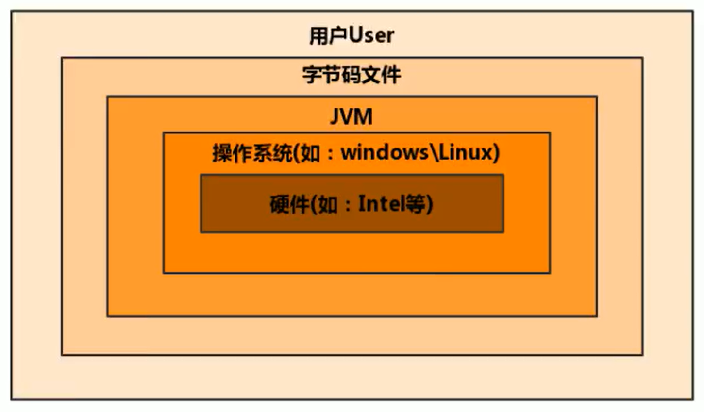


### JVM 的整体结构

HotSpot 虚拟机的整体结构：三层

1. 类装载器(类加载器)子系统

    - 将字节码文件加载至内存中生成 class 对象

    - 加载、链接、初始化

2. 运行时数据区

    - 方法区、堆：==多个线程共享的==

    - 虚拟机栈、本都方法栈、程序计数器：==每个线程独有的==

3. 执行引擎
    - 解释器、JIT编译器(后端编译器(即时编译器))、垃圾回收器

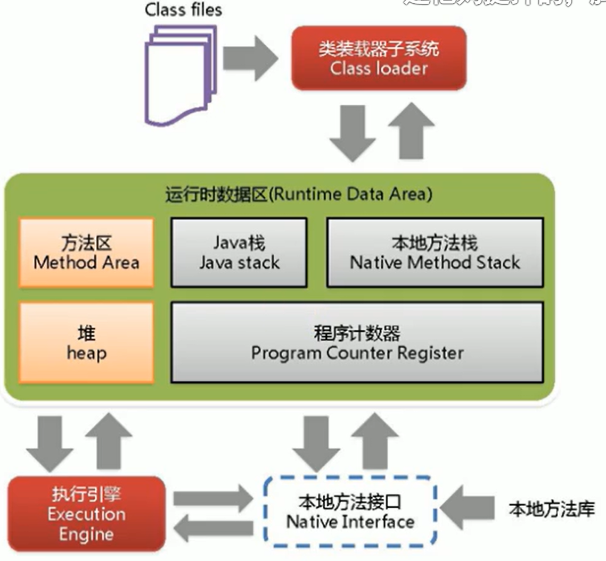


### 指令集架构

- 栈式指令集架构：**Java**...

    - 入栈出栈实现简单，适用资源受限的系统

    - 零地址指令

    - 指令集小，指令多

    - 不需要硬件支持，跨平台性

- 寄存器式指令集架构：Android...

    - 性能优秀，高效

    - 一地址、二地址、三地址指令

    - 指令集多，指令少

    - 完全依赖硬件，可移植性差


### JVM 的生命周期

1. 启动
    - 通过引导类加载器(bootstrap class loader)创建一个初始类(initial class)来完成的，这个类是由虚拟机的具体实现指定的
2. 执行
    - 在执行 Java 程序的时候虚拟机运行，程序结束后停止
    - 执行 Java 程序的时候，真正在执行的是一个叫做 Java 虚拟机的进程

3. 销毁

    - 程序正常执行结束

    - 异常或错误而终止

    - 操作系统出现错误

    - 调用了 exit \ halt 方法


### JVM 与 JDK 的区别

- JVM 目的是在不同平台上使用相同的字节码，它们能给出相同的结果
- JVM 不止一种，只要满足 JVM 规范即可，如 HotSpot VM 等
- 在 [Java SE Specifications (opens new window)](https://docs.oracle.com/javase/specs/index.html) 上可以找到各个版本的 JDK 对应的 JVM 规范


### Java 语言 编译与解释共存

Java 语言一次编写到处运行，编写的 .java 文件由编译器**编译**为 JVM 可以理解的字节码文件 .class 后再由解释器 & JIT 解释执行

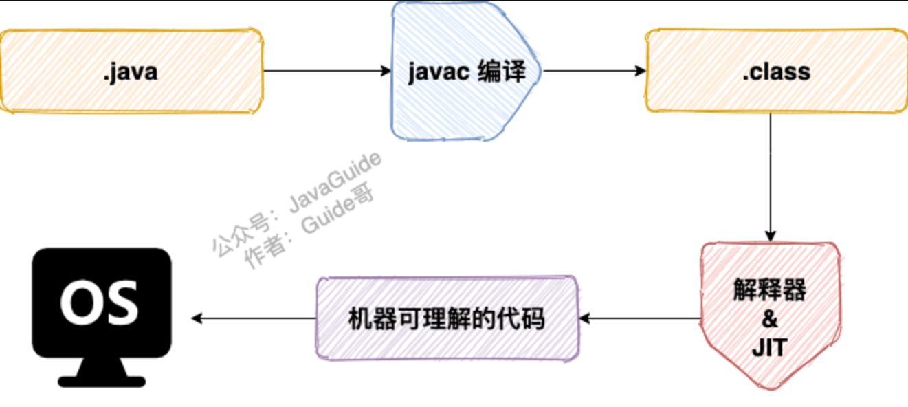


### Oracle JDK vs OpenJDK

- Oriacle JDK 为长期维护版本，不是开源的，更为稳定，商用需要付费
- OpenJDK  大概每三个月发布一次，开源，与 Oracle JDK 的代码几乎相同


### JVM 发展历程

冷知识: java 之父 `詹姆斯高斯林` 目前就职于谷歌

#### SUN Classic VM

- 世界上第一款商用的虚拟机
- HptSpot内置此虚拟机
- 虚拟机内部只有解释器
- 可以外挂 JIT 即时编译器，但会接管解释器工作 (启动暂停时间变长)

#### Exact VM

- 准确式内存管理
- 虚拟机知道内存中某个数据的类型
- 支持解释器和 JIT 编译器同时工作
- 热点探测功能(雏形)

#### HotSpot VM

- JDK 1.3 至今一直默认使用
- 加入方法区概念
- 热点探测功能: 通过计数器找到最具编译价值的代码，触发即时编译或栈上替换
- 支持解释器和 JIT 编译器同时工作

#### EBA JRockit VM

- BEA 团队开发，后被 Oracle 收购
- 是世界上最快的 JVM
- 内部不包含解释器，全靠 JIT
- 拥有全面的 Java 运行时解决方案组合 (主要用于服务器端)

#### IBM J9 VM

- IBM 公司开发，也简称 IT4J 
- IBM 公司常用

#### KVM、CDC、CLDC

- 针对于 Java ME 产品
- KVM 简单、轻量、高度可移植，老人机等低端设备还在使用

#### Azul VM & BEA Liquid VM

- Azul 虚拟机被称为高性能虚拟机中的战斗机，可以管理至少数十个 CPU 和数百 G 内存...
- Liquid 虚拟机可以越过操作系统直接控制硬件，高性能...

#### Apache Harmony

- 是 IBM 和 Intel 联合开发的开源 JVM
- 由于受到 SUN 公司 OpenJDK 的压制，被放弃

#### Microsoft JVM & Taobao JVM

- Microsoft JVM 在 WindowsXP SP3 之前存在于 Windows 系统中，后被 SUN 公司指控 GG...
- Taobao JVM 由阿里发布的一个深度定制且开源的高性能服务器，淘宝、天猫在用

#### Daivik VM

- 采用寄存器架构，执行的是 dex 文件(可由 class 文件转换来)
- 应用于 Android 5.0 前

#### Graal VM

- 增强 HotSpot 虚拟机，可以作为 "任何语言" 的运行平台
- 支持不同语言间混用接口和对象，支持这些语言的本地库文件
- 原理是将不同语言通过解释器转换为能接受的中间格式，还可以即时编译


## 内存与垃圾回收

HotSpot 虚拟机的整体结构分为三层：类加载子系统、运行时数据区、执行引擎

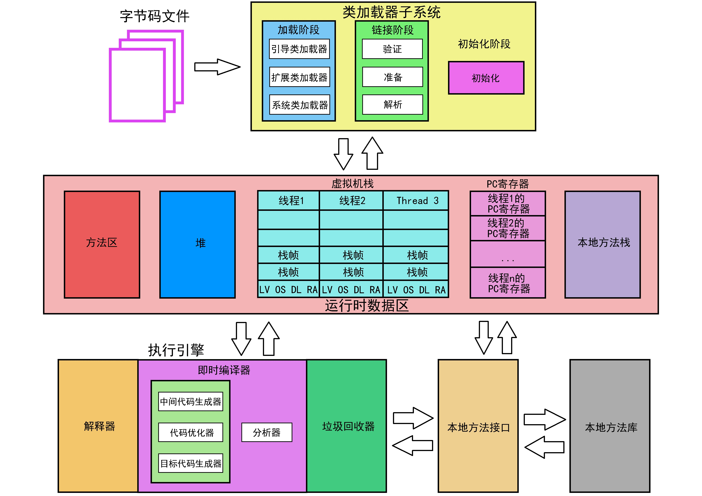

### 1. 类加载器子系统

类加载器子系统负责: **加载Class文件**

类加载子系统分为三个阶段：加载阶段、链接阶段、初始化阶段

#### 1. 加载阶段 Loading

- 获取类的二进制字节流

- 将其代表的静态存储结构 (元数据: 类的方法代码，变量名，方法名，访问权限，返回值等) 转化为方法区的运行时数据结构
- 在内存中生成此类的 java.lang.Class 实例，作为方法区这个类的访问入口

#### 2. 链接阶段 Linking

1. 验证
    - 确保 class 文件的字节流中包含信息符合当前虚拟机要求，正确性、无危险性
    - java 虚拟机中 class 文件必须以 CA FE BA BE 开头
2. 准备
    - 为类变量分配内存，并赋初始值: 零值
    - **常量（final 修饰）在编译阶段就已经被赋值了，准备阶段只会显式的初始化**
    - 不会为实例变量初始化，因为这里是类的加载过程，类在实例化时才会初始化实例变量
3. 解析
    - 将常量池内的符号引用转换为直接引用的过程

#### 3. 初始化阶段 Initialization

- 执行类构造器`<clinit>()`的过程
- clinit: 是类中的所有类变量的赋值和静态代码块的语句合并而来
    - 虚拟机会保证子类的 clinit 执行前，父类的 clinit 执行完毕
    - clinit 在多线程下会被同步加锁 (保证只加载一次)

#### 类加载器的分类

从上到下 为 **包含关系**

1. 引导类加载器 Bootstrap ClassLoader
    - 使用 C / C++ 实现的
    - 用来加载 Java 的核心类库
    - 只加载包名为 java、javax、sun 等开头的类
2. 扩展类加载器 Extension ClassLoader
    - Java 语言编写，派生于 ClassLoader 类，**属于用户自定义类加载器**
    - 从 ext 子目录 (扩展目录) 加载类库
3. 系统类加载器 (应用程序类加载器) ApplicationClassLoader
    - Java 语言编写，派生于 ClassLoader 类，**属于用户自定义类加载器**
    - 从 path 路径下加载类库
    - 是程序中默认的类加载器，Java 应用的类都由它加载

#### ==双亲委派机制==

Java 虚拟机对 class 文件采用的是 **按需加载** 方式，采用 **双亲委派模式** 

- 双亲委派模式：把请求交给父类处理，是一种任务委派模式
    1. 一个类加载器收到请求，会先把这个请求委托给父类执行
    2. 如果父类加载器还存在父类，则进一步向上委托 直至引导类加载器
    3. 如果父类加载器可以完成类的加载，就成功返回，否则才自己尝试
- 双亲委派机制的优点：
    - 避免类的重复加载
    - 确保程序安全，防止核心 API 被随意篡改 (沙箱安全机制)
- 打破双亲委派机制：
    - <a href="#打破双亲委派机制">打破双亲委派机制</a>


### 2. 运行时数据区

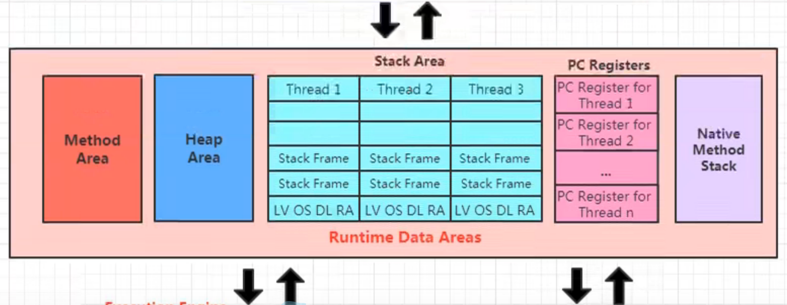

- 方法区 Method Area 、堆空间 Heap Area ：进程私有
- 虚拟机栈 Stack Area 、PC寄存器 PC Register 、本地方法栈 Native Method Stack：每个线程私有

#### 程序计数器(PC寄存器)

- 程序计数器是线程私有的
- 是对物理 PC 寄存器的一种抽象模拟
- 用于存储指向下一条指令的地址
- 是 JVM 规范中唯一没有规定任何 GC / OOM 的区域

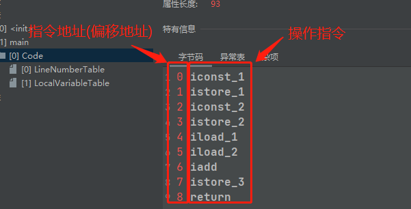

#### 虚拟机栈( Java 栈)

- 虚拟机栈是线程私有的

- 栈中存储着**栈帧**，栈帧对应着**方法**

- 用于存储方法的局部变量、部分结果，参与方法的调用和返回

- Java 指令都是根据栈来设计的，栈的优点...，栈存在 OOM

- 栈帧：

    - 局部变量表

        - 是一个数字数组，用于存储方法参数和定义在方法体内的局部变量
    
        - 不存在数据安全问题
    
        - 在编译期就确定了大小
    
        - slot：变量槽。32位数据占一个 slot，64位数据占两个 slot ( long、double )
    
            > 在命令行界面使用反编译指令：`javap -v -p HeapTest.class > HeapTestClass.txt` 
            >
            > 将详细的 class 文件反编译结果转存在文件中
    
        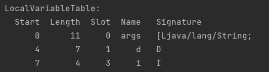

    - 操作数栈(表达式栈)

        - 用于保存计算过程的中间结果、计算过程中的变量、返回值
        - 执行引擎根据字节码指令出入栈
        - 在编译期就确定了大小
        - 32位数据占一个栈单位深度，64位数据占两个栈单位深度( long、double )
    
    - 动态链接(指向运行时常量池的方法引用)
    
        - 将 Class 文件常量池符号引用转换为在运行时常量池中调用方法的直接引用
    
    - 方法返回地址(方法正常退出或异常退出的定义)
    
        - 存储该方法 PC 寄存器的值 作为返回地址
    
    - 一些附加消息
    
        - 对程序调试提供支持的信息

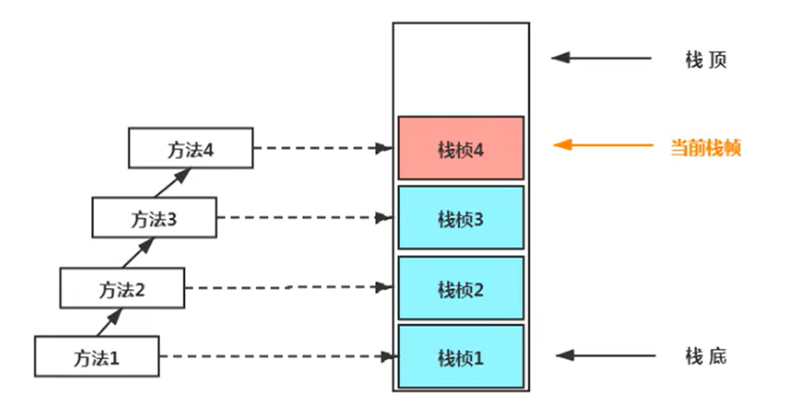

##### 栈顶缓存区

- 由于 JVM 虚拟机使用的是栈式虚拟机，指令集小意味着需要使用更多的指令，对内存的读写也更频繁
- HotSpot 将栈顶的元素全部缓存在物理 CPU 的寄存器中，以此降低对内存的读写次数，提升执行引擎的执行效率

##### 方法的调用

1. 静态链接
    - 在编译期间就可以确定其符号引用和直接引用的绑定关系的
    - 【早期绑定】目标方法结构在编译器就确定了，运行期保持不变
    - C++ 中的【非虚方法】: 静态方法、私有方法、final 方法、实例构造器、父类方法
2. 动态链接
    - 在程序运行期间才能确定其符号引用和直接引用的绑定关系的
    - 【晚期绑定】目标方法结构在编译器无法被确定，只能在程序运行期根据实际的 *传入类型*  绑定相关的方法 (多态) 
    - C++ 中的【虚方法】: 不是非虚方法的方法
    - 虚方法表：存储在方法区中，为避免每次都去寻找对应引用，提高性能

> ##### 多态性的前提
>
> 1. 类的继承关系
> 2. 方法的重写
>
> - 非虚方法：不能被重写的方法，不能实现多态的方法

##### 栈的相关面试题

- 调整栈的大小，就能保证不出现溢出吗？
    - 不能保证，可以通过 `-Xss` 设置栈的大小，也可以设置栈的自动扩展，但当数据量足够多时依旧无法避免 StackOverflow 甚至 OOM
- 垃圾回收会涉及到虚拟机栈吗？
    - 不会
- 方法中定义的局部变量是否线程安全？
    - 何为线程安全
        - 如果只有一个线程操作此数据，则是线程安全的
        - 如果多个线程同时操作此数据，则此数据为共享数据。如果不考略同步机制，则会存在线程安全问题

    - 分具体情况
        - 如果局部变量只在自己方法内创建使用并销毁，则不存在线程安全问题
        - 如果局部变量是被传进来的或会当作返回值返回，则存在线程安全问题

|            | Error（错误） | GC（垃圾回收器） |
| ---------- | ------------- | ---------------- |
| 程序计数器 | F             | F                |
| 本地方法栈 | T             | F                |
| 虚拟机栈   | T             | F                |
| 方法区     | T             | T                |
| 堆         | T             | T                |

#### 本地方法栈

##### 本地方法接口

- Java 调用非 Java 代码的接口，为融合不同的编程语言为 Java 所用
- 使用本地方法实现 jre 与底层系统的交互

##### 本地方法栈

- Java 虚拟机栈用于管理 Java 方法的调用，本地方法栈用于管理本地方法的调用
- 本地方法栈是线程私有的
- 本地方法通常是由 C / C++ 编写
- 本地方法直接使用本地的寄存器，堆内存，脱离虚拟机内部的运行时数据区。其不受 JVM 虚拟机控制，有同虚拟机相同的权限
- **在 HotSpot JVM 中：本地方法栈与虚拟机栈合二为一**

#### 堆

- 堆区在 JVM 启动时被创建，是  JVM 中最大的一块区域
- JVM 中，堆在物理上不连续，逻辑上连续
- ==几乎所有==的对象实例和数组都分配在堆空间中
- 栈中存放着对堆中的引用，方法运行结束后，堆中的内存并不会立即被回收，而是等待垃圾回收器

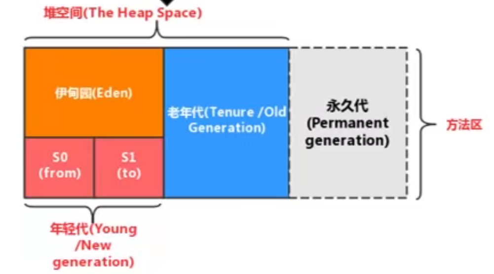

JDK 8 之后的对空间逻辑上分为：新生区、养老区、元空间

> 默认新生代和老年代的比例为 1 : 2 （可以通过 -XX:NewRatio=2 调节）
>
> 默认新生代中伊甸园区和幸存者0区1区的比例为 8 : 1 : 1（可以通过 -XX:SurvivorRatio=8 调节, 默认有自适应内存分配策略）

##### 新生区

存储生命周期较短的对象

- 伊甸园区 Eden
    - 几乎所有的 Java 对象，都是在伊甸园区中被 new 出来的
    - 绝大部分的 Java 对象，都是在新生代销毁的
    - 当伊甸园区满时，程序又需要创建对象，此时垃圾回收 GC 开始工作，将不再被引用的对象销毁（包括幸存者区），将未被销毁的幸存对象放至幸存者 0 / 1 区（此时为空的幸存者区）
- 幸存者0区 Survivor0
    - 存放伊甸园区未被垃圾回收器回收的对象
    - 每次 GC 工作，都会将未达到限制的对象存放在另一幸存者区
    - 当循环次数到达限制（15次）时，将对象放至养老区
- 幸存者1区 Survivor1
    - 存放伊甸园区未被垃圾回收器回收的对象
    - 每次 GC 工作，都会将未达到限制的对象存放在另一幸存者区
    - 当循环次数到达限制（15次）时，将对象放至养老区

##### 养老区

存储生命周期较长的对象、新生代（伊甸园区 / 幸存者区）放不下的超大对象

##### 元空间

存储不会被垃圾回收的对象（元空间旧称永久代，永久代在 JDK 1.8 之后是 HotSpot 虚拟机特有的）

##### 关于 OOM

- OutOfMemoryError 堆空间溢出
- 常见于对象创建次数过多且都不会被回收的情况

##### 关于 GC

- 频繁在新生代收集，很少在老年代收集，几乎不再元空间收集
- Minor GC ≈ Young GC 新生代（伊甸园区）的垃圾回收【STW：会暂停用户线程，等垃圾回收结束，用户线程恢复】
- Major GC ≈ Old GC老年代的垃圾回收【速度慢 Minor GC 10倍以上，STW 时间更长】
- Full GC 整个 Java 堆和方法区的垃圾回收（老年代 / 方法区空间不足时触发，调用 System.gc( ) 时可能触发）【开发时尽量避免】

##### 关于 TLAB 

- TLAB：Thread Local Allocation Buffer 线程私有分配缓冲区
- 在伊甸园区中，每个线程都有一块私有的缓冲区名为 TLAB，**与 Java API 中 Thread Local 没有关系**
- TLAB 默认占伊甸园区的 1% 内存
- JVM 会优先向 TLAB 空间中分配对象，一旦对象在 TLAB 空间中分配失败，JVM 会尝试使用加锁机制保证数据原子性（为创建对象时的地址加锁）

> TLAB只是让每个线程有私有的分配指针，但底下存对象的内存空间还是给所有线程访问的，只是其它线程无法在这个区域分配而已。从这一点看，它被翻译为 线程私有分配区 更为合理一点
>  当一个TLAB用满（分配指针top撞上分配极限end了），就新申请一个TLAB，而在老TLAB里的对象还留在原地什么都不用管——它们无法感知自己是否是曾经从TLAB分配出来的，而只关心自己是在eden里分配的。

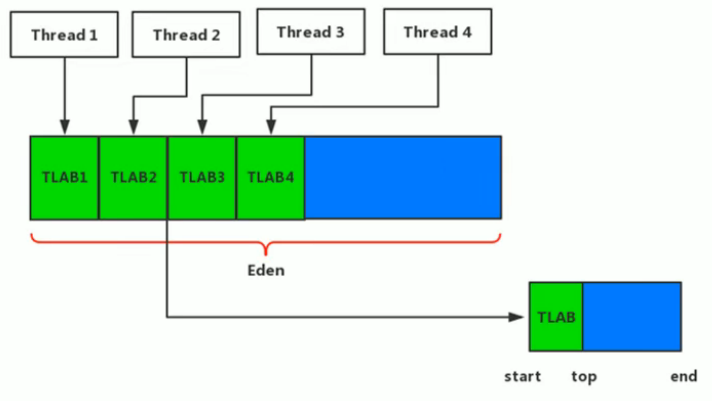

> 堆空间常用调节参数
>
> - -XX:+PrintFlagsInitial 查看所有的参数的默认初始值
> - -XX:+PrintFlagsFinal 查看所有参数的最终值（修改过的不会和初始值一致）
>     - 具体查看某个参数的指令：
>         - jps 查看当前运行中的进程
>         - jinfo -flag SurvivorRatio 进程id
>
> - -Xmn 用来设置新生代的内存大小
> - -Xms 用来设置新生代和老年代的**初始**大小（默认为物理内存的 1/64）
> - -Xmx 用来设置新生代和老年代的**最大**大小（默认为物理内存的 1/4）
> - 在开发时推荐将初始大小和最大大小设置相同的数值，避免自动扩容时处理器资源浪费
> - -XX:NewRatio 设置新生代和老年代的在堆结构中的占比
> - -XX:SurvivorRatio 设置新生代中 Eden 和 s0 / s1 区的占比， 默认有自适应内存分配策略
> - -XX:MaxTenuringThreshold 设置新生代垃圾的最大年龄
> - -XX:+PrintGCDetails 输出详细的 GC 处理日志

##### 堆空间相关面试题

- 为什么需要有两块幸存者区来回倒腾？

    - 因为要解决**内存碎片**问题，在 Minor GC 之后幸存者区会出现内存占用不连续的情况，有大对象进来时会出现有空间但无处安放的问题，此时如果向另一幸存者区转移压缩一次即可解决。这是一种空间换时间的思路【复制算法】。

    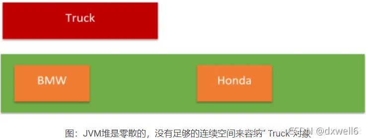

- 堆是分配对象的唯一选择嘛？

    - 不是，==几乎所有==的对象实例和数组都分配在堆空间中。**发生逃逸的对象存在堆中，没有发生逃逸的对象存在栈中。**
    - 逃逸分析：方法内创建的对象如果有可能在方法外被调用，则发生了逃逸（ JDK 8 中使用标量替换优化而来）。
    - 逃逸方法为代码做的优化：

    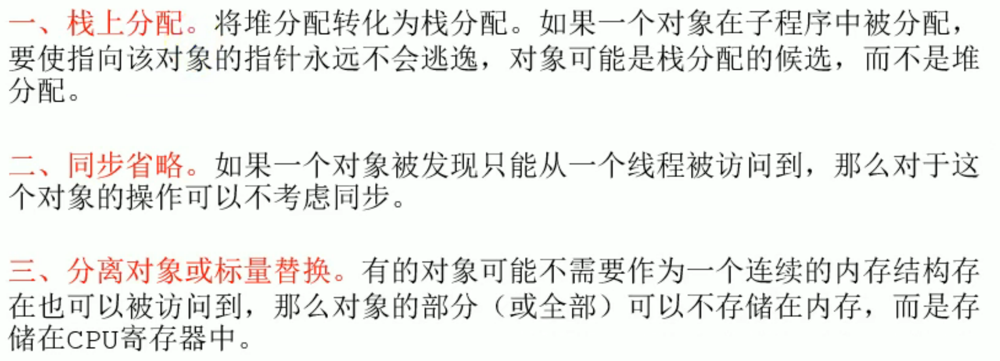

#### 方法区

- 是各个线程共享的一块区域
- 用于存储 类的信息、运行时常量池、即时编译器编译后的代码缓存（字符串常量池、静态变量**存储、引用**在**堆**）
- 和堆一样，在物理内存中可以不连续，逻辑上连续
- 在 JDK 7 方法区称作为永久代，在 JDK 8 方法区称作为元空间
- 元空间和永久代的区别：元空间不在虚拟机设置的内存中，而是直接使用本地内存

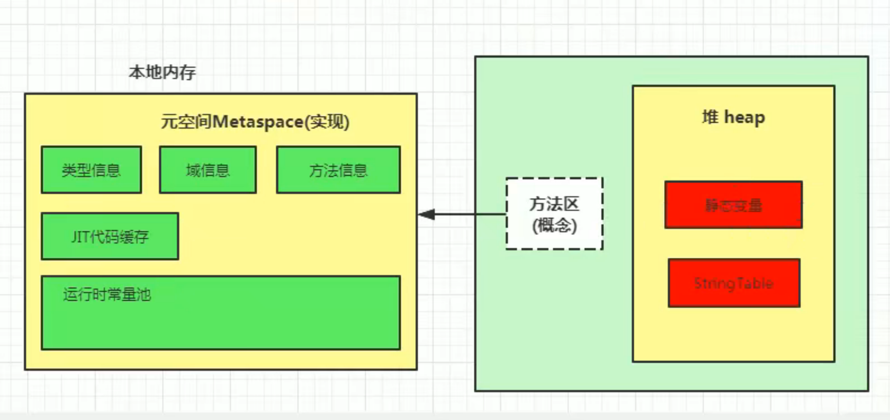

##### 存储的内容：

- **类型信息**（类、接口、枚举、注解）
    - 类的全限定名、直接父类的全限定名、类的修饰符列表、类实现的接口列表、
- 域信息（属性 / 成员变量）
    - 信息、域名称、域类型、域修饰符
- 方法的信息（包括 `<init>` `<clinit>` ）
    - 方法的名称、方法的返回值类型、方法的参数数量和类型、方法的修饰符、方法的字节码、局部变量表、操作数栈、大小、异常表
- **运行时常量池**（来自字节码中常量池内容）
    - 数字值、字符串值、类引用、字段引用、方法引用
- JIT 代码缓存
    - 即时编译器编译后的代码缓存

> 元空间常用调节参数
>
> - -XX:MetaspaceSize 设置初始元空间大小（Windows下默认21M）
> - -XX:MaxMetaspaceSize 设置最大元空间大小（Windows下默认无限制 -1）

> 内存泄露与内存溢出 <a name="OOM"> </a>
>
> - 内存泄漏指一些无用的对象长期占用着内存空间，垃圾回收器无法回收它们，例如流对象没有关闭等（Memory Leak）
>     - 单例模式中，单例的生存周期和应用程序一样长，如果存在对外部对象的引用，那么这个对象是不能被回收的
> - 内存溢出指有用的对象太多，导致新对象无处开辟空间，发生OOM（Memory Overflow）
>     - 垃圾回收器也无法提供更多的内存

##### 方法区的垃圾回收

- 在触发 Full GC 的时候触发方法区的垃圾回收
- 主要回收对象为废弃的常量和不再使用的类型
    - 对于废弃的常量：只要常量不再被任何地方所引用
    - 对于废弃的类：
        - 该类及其子类的所有实例都已经被回收
        - 加载该类的类加载器已经被回收
        - 类的 java.lang.Class 对象再无任何引用，无任何反射该类的方法

##### 方法区的常见面试题

- 为什么在 JDK 8 中用元空间替代了永久代？

    1. 因为虚拟机中的永久代空间大小很难确定，元空间仅受本地空间大小的限制
    1. 因为永久代的调优是很困难的，使用本地内存可以有效减少 Full GC 的频率

- 为什么 StringTable 要放在堆空间中而不是方法区？

    - 因为方法区只有在 Full GC 时才会进行内存回收，回收效率很低，容易导致永久代内存不足，放在堆中可以及时回收内存

#### 补充：对象的创建详情

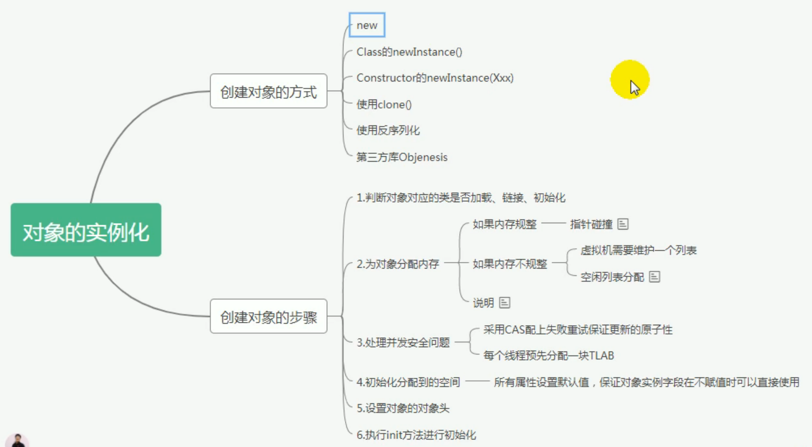

对象创建的步骤：

1. 加载类元信息
2. 为对象分配内存
    - 指针碰撞:<a name="指针碰撞"> </a> 堆中内存分配规整时，内存空闲分界线（指针）向下一个变量大小的位置移动的过程
    - 空闲列表:<a name="空闲列表"> </a> 堆中内存分配不规整时。维护一个空闲列表记录可用的内存空间，每次分配内存后都要动态的维护这个列表
3. 处理并发问题
4. 属性的默认初始化（零值初始化）
5. 设置对象头的信息
6. 属性的显式初始化、代码中的初始化、构造器中初始化

对象在堆中的内存布局：

- 对象头
    - 运行时元数据
        - 哈希值
        - GC 分代年龄
        - 锁状态标志
        - 线程持有的锁
        - 偏向线程 ID
        - 偏向时间戳
    - 类型指针
        - 确定该对象所属的类
- 实例数据
    - 存储着对象真正有效的信息
- 对齐填充
    - 就是占位符

> 栈、堆、方法区在 HotSpot 的引用关系【不再使用句柄池维护 堆 与 方法区 的引用】

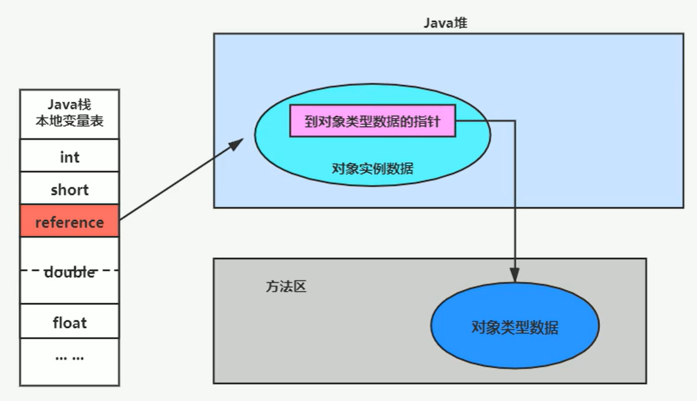

### 3. 执行引擎

- 区别于物理机的概念，虚拟机的执行引擎是由软件自行实现的，可以执行那些不被硬件支持的指令集
- 主要任务是将字节码解释/编译为对应平台上的本地机器能够识别的指令【后端编译】
- 执行引擎根据 PC 寄存器 的指令地址运行，通过局部变量表对应堆中的对象实例，通过对象头中的元数据对应到方法区的类型信息

前端编译原理图：

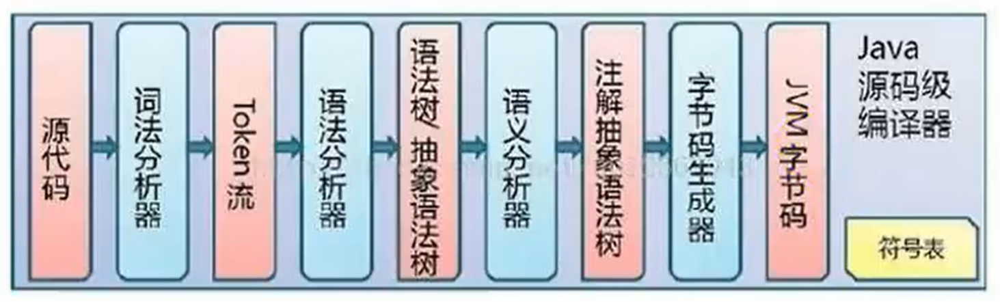

后端编译原理图：

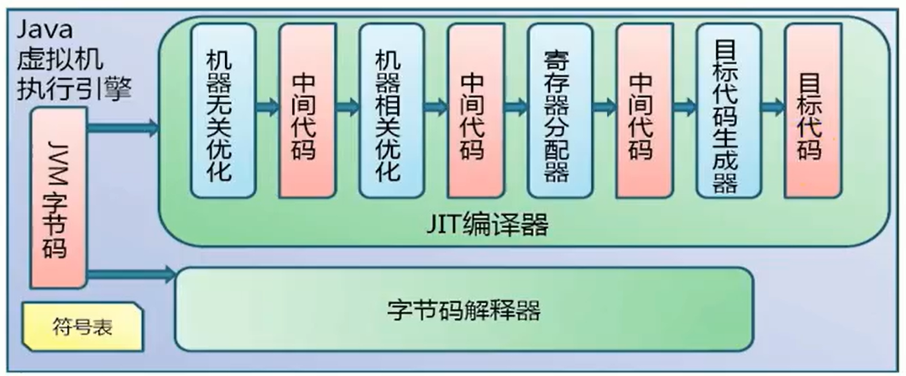

#### 解释器

- 对字节码 逐行解释 逐条执行
- 优点：上来可以直接解释执行，响应速度快
- 缺点：较为低效

#### JIT 即时编译器

- 将源代码直接全部编译为机器语言
- 缺点：响应时间较长
- 优点：使用热点探测功能 缓存热点代码不必重复编译，效率高速度快
- HotSpot 的 C1 C2 编译器

##### 热点代码

- 一段时间内被调用次数较多的方法，方法中循环次数较多的循环体【栈上替换 （OSR编译）】
- 热点探测功能：基于计数器热点探测
    - 方法调用计数器：统计方法调用的次数
    - 回边计数器：统计循环体循环次数
- 热度衰减：每经历一个 **半衰周期** 调用的计数器中的值都会 **衰减** 一半

> 编译器常用调节参数
>
> -XX:CompileThreshold 设置热点代码的方法调用次数
>
> -XX:-UseCounterDecay 关闭热度衰减
>
> -XX:CounterHalfLifeTime 调整半衰期时间（秒）

### StringTable

- String 在 JDK 8 中是由 char 数组构成，在 JDK 9 及之后是由 byte 数组加标记构成，节约了一些空间
- String 具有不可变性【引用类型】
- 字符串常量池中是不会存储相同的字符串的
- String 去重（G1垃圾回收器操作）
    - 可通过 `UserStringDeduplication (bool)` 开启 String 去重（默认关闭）
    - 可通过 `PrintStringDeduplicationStatistics (bool)` 打印详细的去重信息
    - 可通过 `StringDeduplicationAgeThreshold (uintx)` 指定去重候选的年龄  


##### StringTableSize

- StringTableSize 即 String 常量池大小，过小时容易发生 hash 碰撞，需要补齐链表 增加搜索难度，导致性能降低

- 在 JDK 6 中 StringTableSize 的值为 1009，JDK 7 及之后 StringTableSize 的值为 60013
- 可通过 `-XX:StringTableSize` 修改 StringTableSize 的值（JDK 8 只能修改为 1009 以上的值）

##### intern( ) 方法

- **当字符串==常量==与字符串==常量==拼接时，结果直接存储在字符串常量池中**，【编译期优化】（包括 final 修饰的常量）
- **当字符串拼接时，其中有一个为==变量==，结果就存储在堆中**，底层为 new StringBuilder 后 append( ) 进去后返回 toString( )
    - JDK 5 之前为 StringBuffer ，线程安全但效率较低
    - 补充：
        - 使用 ”+” 拼接字符串时底层会调用 StringBuilder 和 String 对象，当大量拼接字符串时效率低，占用高
        - 如果确定经常拼接的字符串长度不会高于某个值时，可以将此值在 StringBuilder 的有参构造器中指定

- 拼接的结果对象调用 intern( ) 方法后，如果字符串常量池中没有当前字符串的话，则在常量池中生成

##### String 常量池常见面试题

- `new String("ab")` 会创建几个对象？

    - 两个，一个是 new 出来的 String 对象，一个是常量池中的 “ab”

- `new String("a") + new String("b")` 会创建几个对象？

    - 六个对象

        1. 使用 ` + ` 连接字符串 new StringBuilder()

        2. new String("a")
        3. 常量池中的 "a"
        4. new String("b")
        5. 常量池中的 "b"
        6. Stringbuilder 的返回值为其 toString 方法的返回值 String 对象【此时常量池中并没有 "ab" 】

- 如图，为何在 JDK 7/8 中 `s3 == s4` 的值为 true ?

    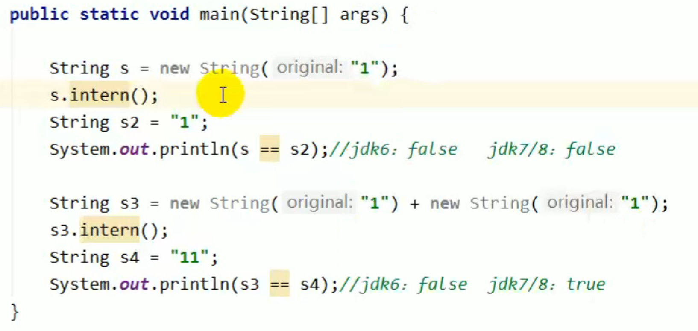

    - 因为在 JDK 7 之后，字符串常量池存储在堆空间中。s3 在定义时字符串常量池中并没有 "11" , 所以在执行 intern 方法时**将 s3 的引用地址放置在了字符串常量池中**，定义 s4 时将字符串常量池中 s3 的地址赋给 s4 , 所以 `s3 == s4` 

### 垃圾回收（Garbage Collection）

- 什么是垃圾：运行程序中再没有任何指针指向的对象
- 为什么要进行垃圾回收：
    - 需要释放没用的对象，整理内存碎片以便于分配给新的对象。
    - 如果没有 GC 那么内存总有一天会用完，无法保证程序的正常进行。
    - 降低内存泄露和溢出的风险，程序员可以更专注于业务处理

##### 垃圾回收相关算法

###### 标记算法

标记出已经死亡的对象（不再被任何存活对象引用的对象）

- 引用计数算法【 python 使用】
    - 记录对象被引用的情况，引用就 +1，引用失效就 -1，如果计数器为 0，则可回收
    - 优点：实现简单，效率高
    - 缺点：存储空间的开销，计数时间的开销，无法处理**循环引用**（造成内存泄漏）
- 可达性分析算法【 Java 使用】
    - 根对象：一组必须活跃的引用
        - （栈中引用的，本地方法栈中的，方法区中静态属性引用的，常量池中的，同步锁持有的，虚拟机内部的对象）
        - 一个指针里面保存了堆中的对象，但自己又不存储在堆中，它就是一个 Root 对象
    - 以一组**根对象**集合为起始点，从上到下搜索根对象集合所连接的对象是否可达，**引用链**上的对象都不是垃圾回收对象

> 虚拟机中对象可能的三种状态：
>
> 1. 可触及的：从根节点能够直接或间接的访问这个对象（就不是垃圾）
> 2. 可复活的：从根节点不可达，但是有可能在 fnalize 方法中复活（刀下留人）
> 3. 不可触及的：对象的 finalize 方法被调用过并且没有被复活（死定了）

###### finalization 机制

- 可由程序员提供对象被销毁前的处理逻辑
- 在 GC 回收一个对象前，总是要调用 `finalize( )` 方法（Object 类自带的方法）
- 判定一个对象是否可回收，会经过==两次标记==：
    - 如果这个对象是根节点不可达的，第一次标记
    - 这个对象有必要执行 finalize 方法，进行二次标记
        - 如果在 finalize 方法中与引用链上的对象建立了联系，则移出即将回收集合，直到再次出现没有引用存在的情况，此时这个对象就是 不可触及的 （finalize 方法只会被执行一次）

###### 清除算法

- 标记 - 清除算法（Mark - Sweep）

    - 标记：Collector 从引用根节点开始**遍历**，标记所有被引用的对象。一般是在对象的 Header 中记录为可达对象
    - 清除：Collector 对堆内存从头到尾进行现行的**遍历**，如果发现某个对象 Header 中没有标记为可达对象，则 '清除'
    - 优点：易于理解
    - 缺点：效率不算高、GC 时会发生 STW、清除后内存不连续，会产生内存碎片，需要维护一个**空闲列表**（并不会真正的把对象置空，而是把 '清除' 的对象地址记录在空闲列表中，下次分配对象优先在空闲列表中记录的内存分配）

    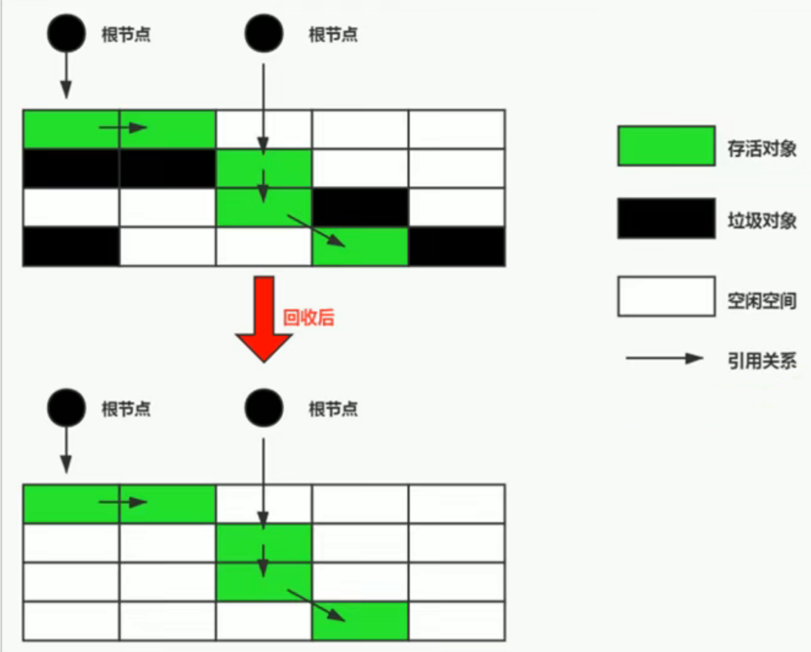

- 复制算法（Copying）

    - 复制：将内存分为 A B 两区，每次垃圾回收都将存活对象复制到另一未被使用的内存块中，交换两个内存块角色
    - 优点：没有标记和清除过程，简单高效、不会出现内存碎片
    - 缺点：需要两倍的内存空间、内存中存活对象较少时才行（新生代中大多数对象朝生夕死，适合复制算法）、在 G1 垃圾回收器中需要维护 region 引用，因为每次复制都会导致内存地址变化，栈中对堆内存的的引用发生变化

    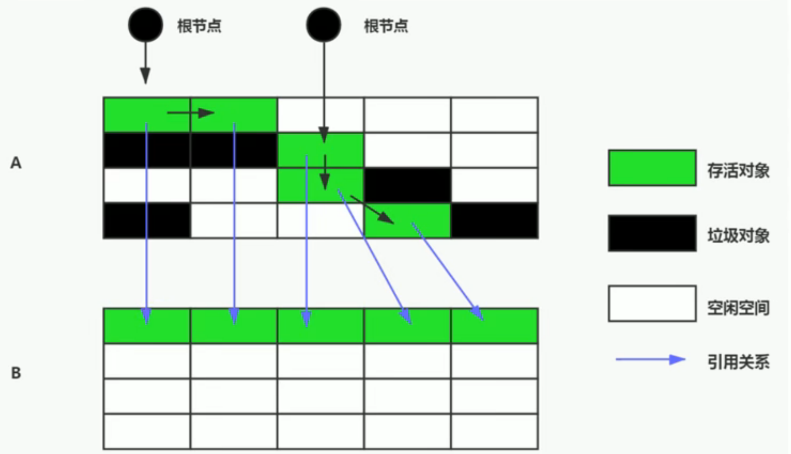

- 标记 - 压缩算法（Mark - Compact）

    - 是对 `标记 - 清除` 算法的一种优化，相当于 `标记 - 清除 - 压缩` 算法
    - 标记：从引用根节点开始**遍历**，标记所有被引用的对象
    - 压缩：将所有存活的对象压缩到内存的一端，之后清除此外的空间
    - 优点：解决了 `标记 - 清除` 算法中内存碎片的问题、解决了 `复制算法` 占用两倍内存的高额代价
    - 缺点：效率低于复制算法、也需要调整引用的地址、移动过程中也需要 STW

    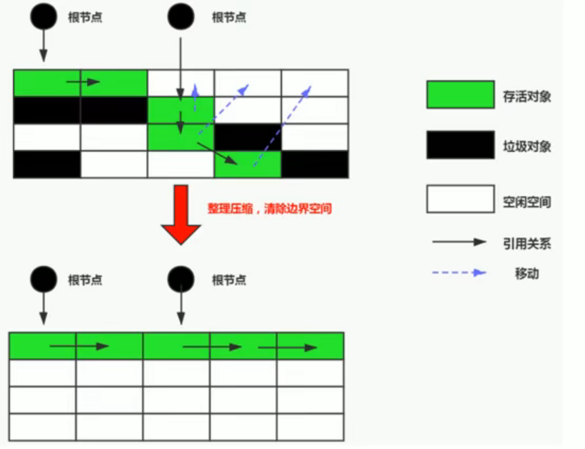

三种算法比较

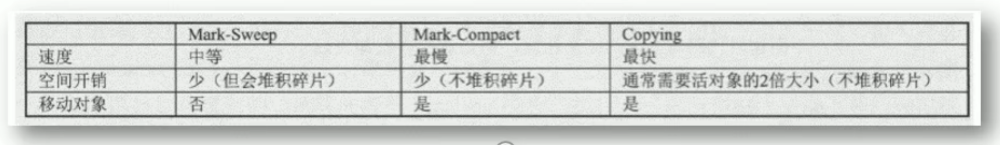

- 分代收集算法

    - 针对不同的代采用不同的垃圾回收算法

    1. 新生代：复制算法，新生代区域较老年代小，对象生命周期短，存活率低，回收频繁
    2. 老年代：`标记 - 清除` + `标记 - 压缩`，老年代区域较大，对象生命周期长，存活率高，回收不及新生代频繁
        - HotSpot 中使用 CMS 回收器，CMS 回收器是基于 `标记 - 清除` 实现的，效率较高，对于碎片问题，使用 `标记 - 压缩` 的 Serial Old 回收器做补偿

- 增量收集算法

    - 每次垃圾收集线程都只收集一小块区域，与用户线程交替执行，直到垃圾收集完成。
    - 优点：有效减少单次 STW 延迟，提高用户体验、系统稳定
    - 缺点：造成系统吞吐量的下降

- 分区算法

    - 将堆空间划分为连续的小空间 region，每个小区间独立使用独立回收，好处是可以控制每次回收多少小空间

##### 垃圾回收相关概念补充

- System.gc( );
    - 显示的调用 full gc ，对堆空间及元空间进行垃圾回收
    - 实际上调用的是 Runtime.getRuntime().gc(); 是一个本地方法
    - 无法保证对垃圾收集器的调用（需等待安全点）
    - 可以使用 System.runFinalization(); 确保 finalze 方法的执行

- **Slot 槽的复用**：为什么声明了一个 bytes 变量，局部变量表的槽数也是 2 ，但是局部变量表中只有一条 args 呢？
    - 因为 bytes 实际存储在序号 1 的位置，栈中有引用 GC 不会回收 bytes
    - 但是当下方声明 `byte b = 127` 之后局部变量表序号 1 的位置被复用，此时 bytes 将会被 GC 回收

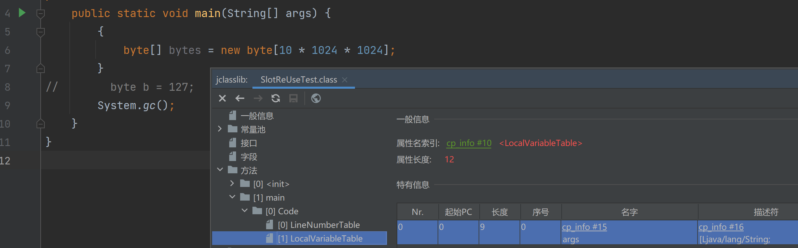

- 内存溢出与内存泄漏
    - <a href="#OOM">跳转至方法区内存泄漏相关内容</a>
    
- STW：Stop The World
    - 为确保标记时以及清除时的数据一致性，发生的停顿，停止整个程序
    - 如果分析过程中引用关系不断变化，则分析结果准确性无法保证
    - 因为 STW 的存在，Thread 的 sleep 时间不一定十分准确
    
- 垃圾回收的并行与并发
    - 并发：单个处理器在同一时间段中，几个程序快速的交替执行，会互相抢占资源【某一时间段内同时发生】
    - 并行：多个处理器同时执行多个程序时，一个处理器执行一个程序，不会互相抢占资源【某一时间点同时发生】
    - 垃圾回收的并发、并行、串行
        - 并发：同一段时间内，用户线程与垃圾回收线程同时执行，有效减少单次 STW 时长
        - 并行：用户线程 STW 的时候，多条垃圾回收线程并行工作
        - 串行：用户线程 STW 的时候，同一时间点只有一条垃圾回收线程工作
    
- 垃圾回收的安全点与安全区域

    - 安全点（SafePoint）
        - 多线程环境下 GC 能够安全、可控的回收对象的时间点，安全点的选择以 `是否具有让程序长时间执行的特征` 为标准
        - 安全点的选择方式
            1. 抢先式中断：中断所有线程，如果有线程不在安全点，则恢复线程跑到安全点（没有 JVM 用这种）
            2. 主动式中断：各线程在安全点时轮询一个中断标记，当这个标记为真时，主动将自己中断挂起
        - 例如（执行较慢的指令：方法调用、循环跳转、异常跳转等）

    - 安全区域（Safe Region）
        - 当线程处于 Sleep 或者 Blocked 状态，JVM 无法中断时
        - 代码在一段片段中，对象的引用关系不会发生变化，这个区域中任意 GC 都是安全的
        - 当线程处于安全区时，需等待 GC 完成才能退出安全区

- 关于引用

    - 强引用（StrongReference）

        - 最传统的引用 `Object obj = new Object();` 
        - 是可达的，可触及的
        - 只要强引用关系还在，对象就不会被垃圾回收器回收

    - 软引用（SoftReference）

        - 被置空的强引用、传参时 new 出来的对象 
        - 构造软引用 `SoftReference<User> usr = new SoftReference<>(new User());` 
        - 是可达的，可触及的
        - 高速缓存会使用到软引用，软引用在内存溢出前回收

    - 弱引用（WeakReference）

        - 被置空的强引用、传参时 new 出来的对象 
        - 构造弱引用 

        ```java
            User user = new User();
            WeakReference<User> uwr = new WeakReference<>(new User());
            user = null;
        ```

        - 是可达的，可触及的
        - 只要垃圾回收器工作，弱引用就被回收

    - 虚引用（PhantomReference）

        - 构造虚引用

        ```java
            User user = new User();
            ReferenceQueue<User> rq = new ReferenceQueue<>(); //引用队列
            PhantomReference<User> pr = new PhantomReference<>(user,rq);
            user = null;
        ```

        - 使用虚引用为了在这个对象被回收时收到一个系统通知，对象回收跟踪

    - 终结器引用

        - 在 GC 时，终结器引用入队，finalizer线程通过终结器引用来找到被引用对象并调用 finalze 方法，在第二次 GC 时回收对象


##### 垃圾回收器（Garbage Collector）

###### 垃圾回收器分类

- 按照线程数分类
    - 串行垃圾回收器：单 cpu 平台、硬件资源受限平台【Serial、Serial Old】
    - 并行垃圾回收器：并发能力比较强的 cpu 【ParNew、Parallel、Scavenge、Parallel Old】
- 按照工作模式分类
    - 并发式垃圾回收：用户线程与垃圾回收线程快速交替执行，延迟时间段【CMS、G1】
    - 独占式垃圾回收：垃圾回收时独占一整段时间，用户线程等待垃圾回收线程执行
- 按照碎片处理分类
    - 压缩式垃圾回收器：采用了带有压缩算法的垃圾回收器
    - 非压缩式垃圾回收器：不进行内存空间压缩的垃圾回收器
- 按照工作的内存区间分类
    - 年轻代的垃圾回收
    - 老年代的垃圾回收

###### 垃圾回收器的性能指标

- **吞吐量**：运行用户代码的时间占用总运行时间的比例【a/a+b】
- 垃圾收集开销：吞吐量的补数，垃圾收集所用时间与总运行时间的比例【b/a+b】
- **暂停时间**：执行垃圾收集时，程序的工作线程被暂停的时间
- 收集频率：相对于应用程序的执行，收集操作发生的频率
- **内存占用**：Java 堆区所占的内存大小
- 快速：一个对象从诞生到被回收所经历的时间

**吞吐量** 与 **暂停时间** 互相矛盾，所以标准为：在最大吞吐量优先的情况下，降低停顿时间

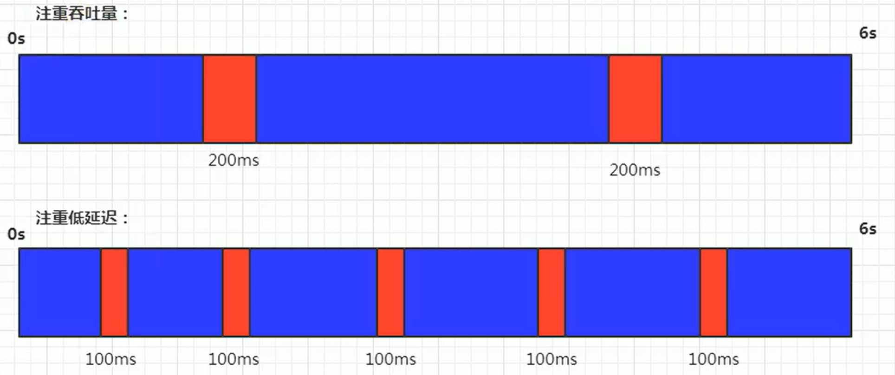

###### 垃圾回收器的发展史

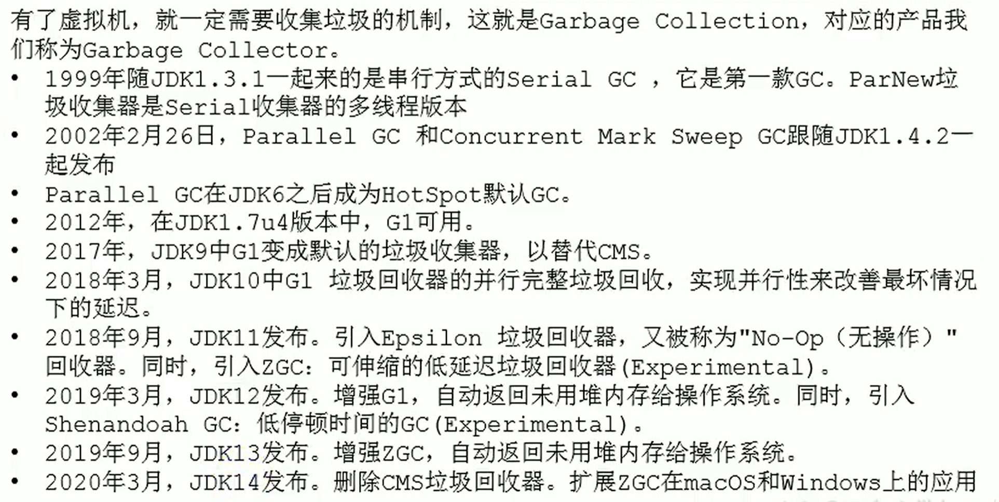

###### 垃圾回收器与分代的关系

- JDK 8：使用黑色实线组合，取消了红色虚线组合
- JDK 14：弃用了绿色虚线的组合，删除了青色虚线的垃圾回收器

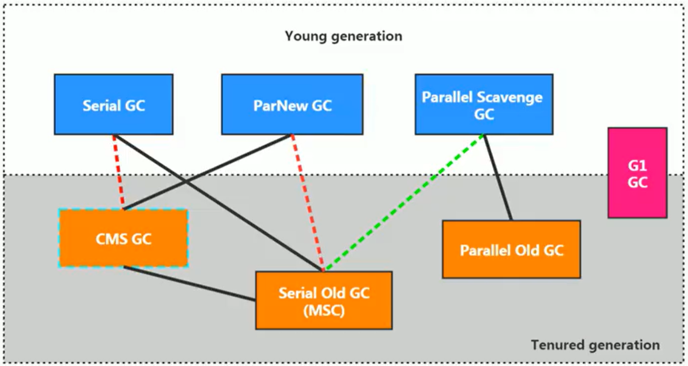

> 查看垃圾回收器相关参数
>
> `-XX:+PrintCommandLineFlags` 在命令行输出当前程序相关参数
>
> `jinfo -flag Use回收器名GC 进程ID` 查看该进程是否使用此垃圾回收器
>
> ------
>
> `-XX:+UseSerialGC` 使用 Serial 回收器，同时老年代使用 Serial Old 回收器
>
> ------
>
> `-XX:+UseParNewGC` 使用 ParNew 作为年轻代回收器，不影响老年代
>
> ------
>
> `-XX:+UseParallelGC` 使用 Parallel 作为年轻代回收器，老年代使用 Parallel Old【互相激活】
>
> `-XX:ParallelGCThreads` 限制（年轻代 并行）线程数量，默认与当前计算机线程数量相同
>
> - 当 CPU 数量大于 8 个时，默认线程数量为：3 + ( 5 * CPU数量 ) / 8
>
> `-XX:MaxGCPauseMillis` 设置垃圾回收器最大 STW 时长【谨慎设置：会改变堆空间大小等参数】
>
> `-XX:GCTimeRatio` 设置垃圾收集时间占总时间的比例（默认99，即：垃圾回收时间不会超过1%）
>
> `-XX:+UseAdaptiveSizePolicy` 设置是否开始自适应调节策略（默认开启）
>
> ------
>
> `-XX:+UseConcMarkSweepGC` 使用 CMS 作为老年代回收器，同时年轻代使用 ParNew 回收器
>
> `-XX:CMSlnitiatingOccupanyFraction` 设置 CMS 垃圾回收开启阈值，JDK 5 之前默认 68，JDK 6 之后默认 92
>
> `-XX:+UseCMSCompactAtFullCollection` 设置 CMS 执行 Full GC 时对内存进行压缩整理
>
> `-XX:CMSFullGCsBeforeCompaction` 设置 CMS 执行多少次 Full GC 时对内存进行压缩整理
>
> `-XX:ParallelCMSThreads` 设置 CMS 线程的数量，默认：( CPU 数量 + 3 ) / 4 
>
> ------
>
> `-XX:+UseG1GC` 使用 G1 回收器作为堆空间垃圾回收器
>
> `-XX:G1HeapRegionSize` 设置每个 region 区域的大小（1 / 2 / 4 / 8 / 16 / 32 MB）通常共 2048 个区域
>
> `-XX:MaxGCPauseMillis` 设置期望的最大 GC 停顿时间指标 （默认 200 ms）
>
> `-XX:ParallelGCThreads` 限制 STW 时 GC 线程数量，最多为 8
>
> `-XX:ConcGCThreads` 设置并发的线程数
>
> `-XX:InitiatingHeapOccupancyPercent` 设置触发并发 GC 的堆占用阈值
>
> ------
>
> `-XX:+PrintGC` / `-verbose:gc` 输出 GC 日志
>
> `-XX:+PrintGCDetails` 输出 GC 的详细日志
>
> `-XX:+PrintGCTimeStamps`  输出 GC 的时间戳（基准时间的形式）
>
> `-XX:+PrintGCDateStamps` 输出 GC 的时间戳（日期的形式）
>
> `-XX:+PrintHeapAtGC` 在进行 GC 的前后打印出堆的信息
>
> `-Xloggc:../logs/gc.log` 日志文件的输出路径

###### Serial 回收器

最小化的使用内存和并行开销时选择

- 串行回收、采用 **复制算法**
- 对于老年代使用 Serial Old，采用 **标记 - 压缩** 算法，HotSpot 虚拟机 Client 模式默认使用
    - Serial Old 在 Server 模式下的用途：与新生代 Parallel Scavenge 配合使用、作为老年代 CMS 的后备垃圾收集方案

- 是 JDK 1.3 前使用的垃圾回收器，HotSpot 虚拟机 Client 模式默认使用
- 优点：单线程情况下相对简单高效
- 缺点：只有单核场景下 Serial 回收器适合、串行的垃圾回收器会导致 STW 时间变长

###### ParNew 回收器

- 并行回收、采用 **复制算法**
- 是年轻代的垃圾回收器，是多线程版本的 Serial 回收器，相对于 Serial 回收器 STW 时间短一些
- 对于老年代可使用 Serial Old 或 CMS 回收器
- 优点：在多线程情况下使用相较 Serial 回收器效率高
- 缺点：在单线程情况下效率不及 Serial 回收器

###### Parallel Scavenge回收器【JDK 8 默认】

> 最大化应用程序的吞吐量时选择

- 吞吐量优先、采用 **复制算法**、目标是达到可控的吞吐量、具有自适应调节策略
- **高吞吐量** : 适合在后台运算不需要太多交互的任务
- 对于老年代使用 Parallel Old 回收器，采用 `标记 - 压缩` 算法，也是基于 并行回收 和 STW
- 特点：在 Server 模式下性能不错

###### Concurrent Mark Sweep 回收器

> 最小化 GC 的 STW 时间时选择

- 低延迟，**标记 - 清除** 算法

- **并发收集器**：实现类垃圾回收线程与用户线程 “ 同时 ” 工作

- 优点：使用并发机制，避免了 标记 和 清理 阶段的长时间 STW

- 缺点：
    - CMS 采用 `标记 - 清除` 算法，不可避免产生**内存碎片**（无法使用 <a href="#指针碰撞">指针碰撞</a> 技术，只能使用 <a href="#空闲列表">空闲列表</a> 执行内存分配），当大对象要分配时空间不足，不得已会触发 Full GC
    
    - CMS **对 CPU 资源非常敏感**，虽然是并发的垃圾回收不会导致用户停顿，不过也占用了一部分线程，会使应用程序变慢，吞吐量降低
    
    - CMS **无法处理浮动垃圾**
        - 当并发标记时用户产生的新垃圾无法及时标记（明确：重新标记）
        - 不能等内存满时再执行，需要指定一个开始垃圾回收的阈值，当预留的内存不足以满足程序需要，会触发 "Concurrent Mode Failure" 错误导致 Full GC 的发生，此时会临时启用 Serial Old 回收器，会产生长 STW 
        
        > 对于并发标记产生的浮动垃圾 CMS 使用三色标记算法，在重新标记中进行回收
        >
        > - 黑色：表示对象已经被垃圾收集器访问过， 且这个对象的所有引用都已经扫描过。 黑色的对象代表已经扫描过， 它是安全存活的，对于黑色对象， gc线程不会重新扫描。 黑色对象不可能直接（不经过灰色对象） 指向某个白色对象。
        > - 灰色：表示对象已经被垃圾收集器访问过， 但这个对象上至少存在一个引用还没有被扫描过。灰色对象在重新标记中会再次扫描。
        > - 白色：表示对象尚未被垃圾收集器访问过。 显然在可达性分析刚刚开始的阶段， 所有的对象都是白色的， 若在分析结束的阶段， 仍然是白色的对象， 即代表不可达。


> CMS 回收器执行原理：初始标记 -> 并发标记 -> 重新标记 -> 并发清理
>
> - 初始标记：标记出 GC Root **直接连接**的对象【短暂 STW 】
> - 并发标记：从 GC Root 直接连接的对象开始遍历，标记出所有可达的对象
> - 重新标记：修正并发标记期间，并发 导致的标记变动 的标记记录（取消标记并发标记时重新引用对象）【短 STW 】
> - 并发清理：清理 标记阶段 判断已经死亡的 对象

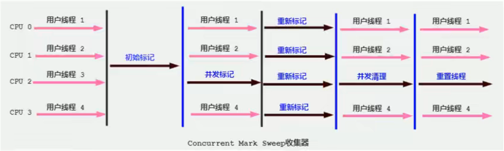

###### Garbage First 回收器【JDK 9 默认】

> 配备多核 CPU 及大容量内存（6 - 8 GB）时选择
>
> 

- 区域化分代式、目标是在延迟可控的情况下获得更高的吞吐量

- 根据各个 region 里面垃圾堆积的价值大小，维护一个**优先列表**，每次根据允许的回收收集优先回收价值最大的 region【垃圾优先】

- 在各个 region 中使用 指针碰撞 分配内存空间，region 中也可以存在 TLAB 空间：线程私有分配缓冲区

- 特点：

    - 并行与并发

        - 并行性：回收期间可以有多个 GC 同时工作，有效利用多核计算能力
        - 并发性：拥有与用户线程交替执行的能力，不会发生完全阻塞用户线程的情况

    - 分代收集

        - 不再要求伊甸园区、幸存者区、老年代.. 在内存中连续，也不再坚持固定大小与数量
        - 将堆空间分为若干个 region 这些区域包含了逻辑上的年轻代和老年代

        > 大对象存放在 Humongous 空间中，如果一个对象超过 0.5 个 region 达到 1.5 个 region 时，就存到 Humongous 中
        >
        > - 一个对象是一个短暂存在的大对象，如果存在老年代容易导致内存溢出。
        > - 如果一个 H 区存不下对象，则会寻找连续的 H 区存储，如果找不到则会启动 Full GC

        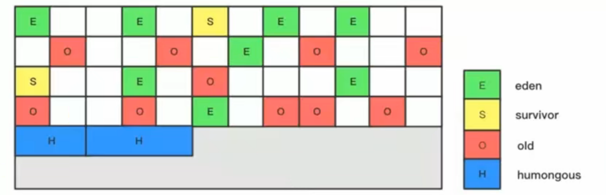

    - 空间整合

        - region 之间使用**复制算法**，将一个 region 中的垃圾复制整理到另一 region 中
        - 整体上使用**标记 - 压缩**算法整理各个 region 的内存碎片问题

    - 可预测的停顿时间模型

        - 后台维护**优先列表**，每次根据允许的时间，回收价值最大的 region（垃圾占比高的，默认 65%），尽可能的保证时间范围内高的收集效率【软实时】

- 缺点：垃圾收集产生的内存占用（FootPrint）和 程序运行时的额外负担（Overload）都比 CMS 高

> G1 回收器执行原理
>
> - 记忆集：一个 region 中的对象有可能被其他 region 中的对象引用，为避免每次都扫描整个堆，为每个 region 生成一个记忆集，记忆集中存储指向当前 region 中对象的引用，在 GC 根节点的枚举范围内加上 Remembered Set，保证不会全局扫描也不会有遗漏
>
> - 写屏障：引用类型数据在 region 中写入时，会产生一个 写屏障 的中断操作，在中断时检查要写入的引用指向的是否为当前 region，如果不是则通过 CarTable 将引用信息记录到当前 region 的记忆集中
>
> 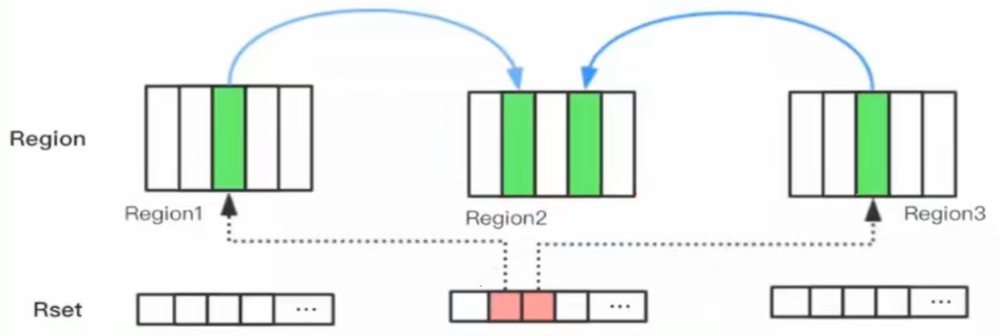
>
> 1. 年轻代回收：
>
>     - 当 Eden 区用尽开始垃圾回收，G1 开始**并行**且**独占式**的垃圾回收，移动年轻代存活的对象到 Survivor区间或老年代
>     - 扫描根 -> 更新 RSet -> 处理 RSet -> 复制对象 -> 处理引用
>
> 2. 老年代并发标记：
>
>     - 当带着内存达到一定值时（默认 45%），开始老年代并发标记
>
>     - 初始标记阶段 -> 根区域扫描 -> 并发标记 -> 再次标记 -> 独占清理 -> 并发清理阶段
>
> 3. 混合回收：
>
>     - 从老年代移动存活对象至空闲区间，扫描 / 回收 一小部分 **优先列表** 中的老年代 region
>
> 4. Full GC：
>
>     - 空间不足时、并发处理过程中空间耗尽时 触发
>
> 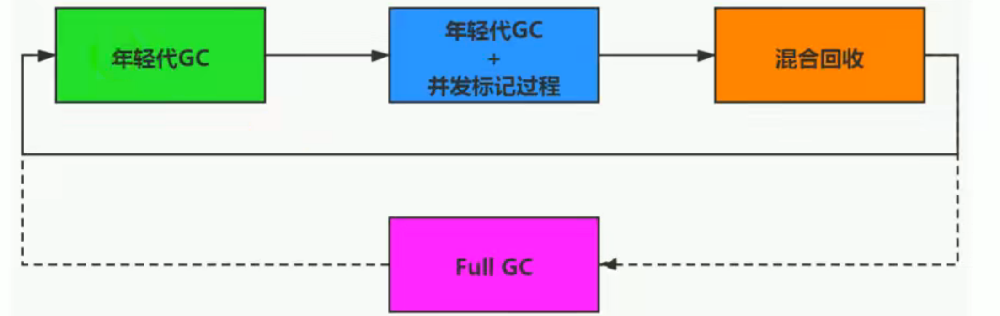

- 注意点：
    - 避免显示的设置年轻代的大小，会覆盖 G1 中暂停时间目标
    - 不要太苛刻的控制暂停时间，G1 的吞吐量目标是 90% 的应用程序时间 10% 的垃圾回收时间，如果设置过小的暂停时间容易导致过于频繁的垃圾回收、更多的开销，影响吞吐量

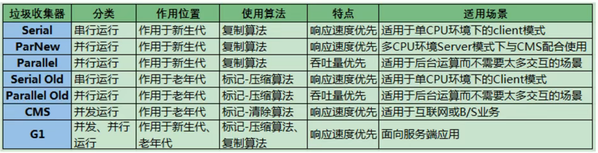

###### GC 日志分析

`-XX:+PrintGC` GC 日志分析

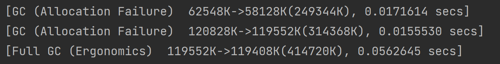

- GC、Full GC：GC的类型，GC只在新生代 上进行，Full GC包括永生代，新生代，老年代。
- Allocation Failure：GC发生的原因。
- 80832K -> 19298K：堆在GC前的大小和GC后的大小。
- 228840k：现在的堆大小。
- 0.0084018 secs：GC持续的时间。

`-XX:+PrintGCDetails` `-Xloggc:../logs/gc.log` GC 详细日志输出分析

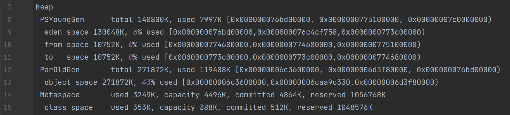

- 堆空间
    - 年轻代：总空间、占用大小
        - 伊甸园区：总空间、占用量
        - 幸存者0区：总空间、占用量
        - 幸存者1区：总空间、占用量
    - 老年代：总空间、占用大小
        - 对象空间：总空间、占用量
    - 元空间：占用大小、容量、已使用的、保留的
        - 类空间：占用大小、容量、已使用的、保留的

日志分析工具：

- GCViewer、GCEasy、GCHisto、GCLogViewer、Hpjmeter、garbagecat 等

###### 垃圾回收器的未来

- Epsilon（ JDK 11 引入）
    - No-Op（无操作）回收器
    - 只做分配，不做回收，程序结束

- ==ZGC==（ JDK 11 引入）
    - 低延迟的垃圾回收器，暂停时间控制在十毫秒内
    - 是基于 region 内存布局的，使用 读屏障、染色指针、内存多重映射 技术的可并发的 标记 - 压缩 算法
    - 工作过程：并发标记 -> 并发预备重分配 -> 并发重分配 -> 并发重映射
- Shenandoah GC（ Open JDK 12 引入）
    - 低延迟的垃圾回收器，暂停时间控制在十毫秒内
    - 高运行负担下的吞吐量下降

###### 垃圾回收器相关面试题

- 为何 CMS 回收器采用 `标记 - 清除` 算法，而不是 `标记 - 压缩` 算法呢？
    - 因为 标记 - 压缩 算法的缺点：在 清除、压缩 结束后，大部分对象的地址发生移动，需要 Compact 整理内存调整引用的地址，会产生 STW，这与 低延迟 的设计理念不符

## 字节码与类的加载

### 关于字节码内容

略

### 类的加载

#### 过程1：Loading 加载阶段

> - 获取类的二进制字节流
> - 将其代表的静态存储结构 (元数据: 类的方法代码，变量名，方法名，访问权限，返回值等) 转化为方法区的运行时数据结构
> - 在内存中生成此类的 java.lang.Class 实例，作为方法区这个类的访问入口

- ==类加载器的工作就只在加载阶段，链接、初始化都是由 JVM 完成的== 

- 就是将 Java 类的字节码文件加载到机器内存中，并在内存中构建出 Java 类的原型 -- 类模板对象

    1. 通过类的全限定名，获取类的二进制数据流

    2. 解析类的二进制数据流生成方法区内的 Java 类模板

    3. 堆中创建 java.lang.Class 类的实例，表示该类型，指向方法区这个类的各种数据（模板）
        - 数组类型本身并不是由类加载器负责创建，而是在运行时创建，但数组的元素类型需要由类加载器创建。
            - 基础数据类型：由虚拟机预先定义，权限为 Public
            - 引用数据类型：需要类加载器加载，权限看具体类的访问权限

    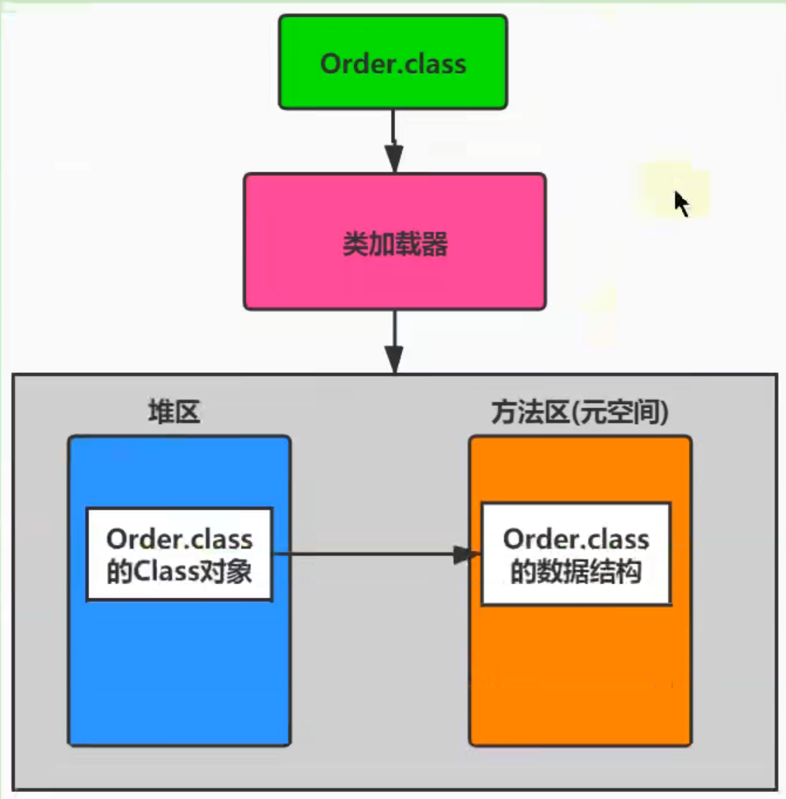

- 获取类二进制数据流的方式

    - 读入 class 文件
    - 读入 jar、zip 等数据包，提取类文件
    - 存在数据库中的类的二进制数据
    - 类似于 HTTP 之类的协议通过网络加载
    - 在运行时生成的 Class 的二进制信息

    > 如果数据不是 ClassFile 的结构，抛出 ClassFormatError

#### 过程2：Linking 链接阶段

- Verification 验证阶段

    > - 确保 class 文件的字节流中包含信息符合当前虚拟机要求，正确性、无危险性
    > - java 虚拟机中 class 文件必须以 CA FE BA BE 开头

    - 保证加载的字节码是合法、合理并符合规范的

        1. 格式验证：

            - **会与加载阶段一起执行**，验证之后才会加载相关二进制数据。
            - 验证是否 CAFEBABE 开头（魔数）
            - 验证主版本与副版本是否在当前虚拟机的支持范围内
            - 验证数据中每一项的长度是否正确

        2. 语义检查：

            - 验证是否所有类都有父类存在
            - 验证 final 的方法或者类是否被重写或重载了
            - 验证非抽象类是否实现了所有抽象方法或接口方法
            - 验证是否存在不兼容的方法（重复方法，final / static 的抽象方法）

        3. 字节码验证：

            - 验证字节码执行过程中是否会跳转到一个不存在的指令
            - 验证函数的调用是否传递了正确的类型参数
            - 验证变量的赋值类型是否正确

            > **栈映射帧**：尽可能的检测在特定字节码处，其局部变量表和操作数栈是否有着正确的数据类型（无法做到 100% 准确）

        4. 符号引用验证：

            - **在解析阶段才会执行**
            - 验证常量池中符号引用的这些类或者方法是否确实存在

    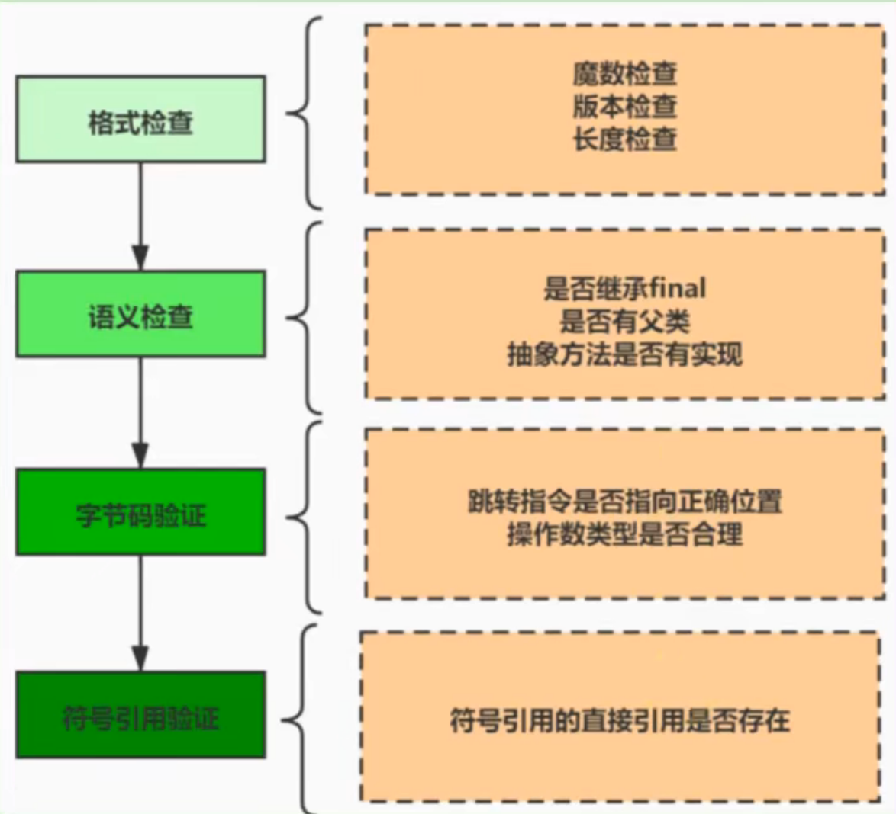

- Preparation 准备阶段

    > - 为类变量分配内存，并赋初始值: 零值
    > - **常量（final 修饰）在编译阶段就已经被赋值了，准备阶段只会显式的初始化**
    > - 不会为实例变量初始化，因为这里是类的加载过程，类在实例化时才会初始化实例变量
    
    - 为类的静态变量分配内存，并将其初始化为默认值。没有代码执行
    
    - **会为 final 修饰的基本数据类型类变量赋其字面量值**
    
    - 不会为常量赋值，因为 final 在编译期就已经被赋值了

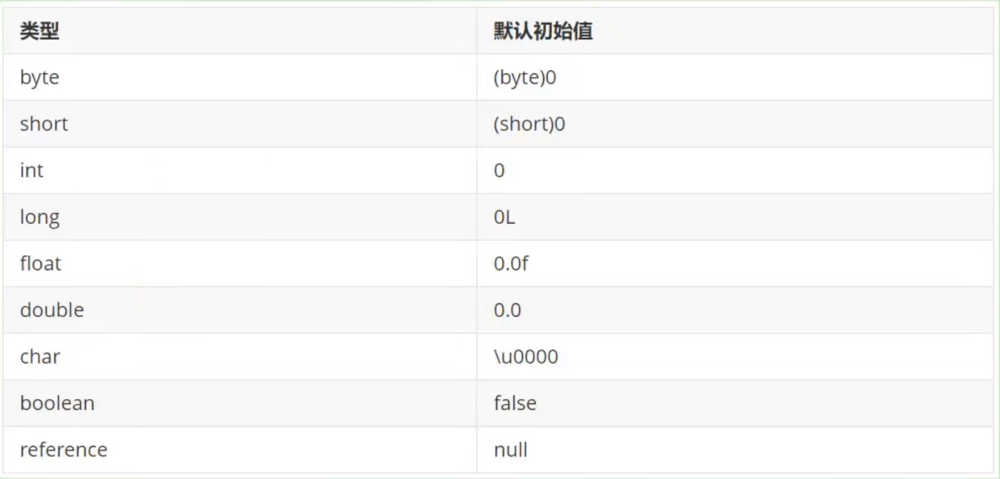

- Resolution 解析阶段

    > - 将常量池内的符号引用转换为直接引用的过程

    - 将类、接口、字段、方法的符号引用转为直接引用，直接引用到方法区真实的地址

#### 过程3：initialization 初始化阶段

> - 执行类构造器`<clinit>()`的过程
> - clinit: 是类中的所有类变量的赋值和静态代码块的语句合并而来
>     - 虚拟机会保证子类的 clinit 执行前，父类的 clinit 执行完毕
>     - clinit 在多线程下会被同步加锁 (保证只加载一次)

- 为类的静态变量赋予正确的初始值，**包括 final 修饰的有方法调用 / 实例化 赋值的类变量**
- 执行静态代码块中的代码
- **由父及子，静态先行** 

##### 哪些场景下，不需要生成 `<clinit>` 方法

- 没有类变量的类
- 类变量不用显式的赋值的类
- 类变量都是有 final 修饰的不需要方法调用 / 实例化的类

##### `<clinit>` 的多线程安全性问题

- `clinit` 方法是加锁线程安全的，保证一个类只有一次初始化，其他线程阻塞后直接返回已经准备好的信息
- 死锁：如果加载类 A 需要加载类 B ，加载类 B 需要加载类 A ，那么在多线程同时加载时，就会造成死锁

##### 类的主动使用与被动使用的问题

- 主动使用时**会**调用 `clinit` 方法，被动使用时**不会**调用 `clinit` 方法

- 主动使用：<a name="主动使用"> </a> 

    1. 创建一个类的实例时，new、反射、克隆、反序列化

        ```java
        /*反序列化例子*/
        ObjectInputStream ois = new ObjectInputStream(new FileInputStream("序列化后的类文件"));
        类名 类 = (类名)ois.readObject(); //此时会执行<clinit>方法进行初始化
        ```

    2. 调用类的静态方法时

        ```java
        类名.方法名(); //此时会执行<clinit>方法进行初始化
        ```

    3. 当使用类、接口的静态字段时（ final 特殊）

        - 如果是 static 加 final 修饰时，具体要看显式赋值有没有方法的调用或者类的实例化

        ```java
        System.out.print(类名.静态字段名); //此时会执行<clinit>方法进行初始化
        ```

    4. 当使用 java.lang.reflect 包中的方法反射类的方法时，比如：Class.forName("com.Test")

        ```java
        Class.forName("com.mysql.cj.jdbc.Driver"); //此时会执行<clinit>方法进行初始化
        ```

    5. 当初始化子类时，如果发现父类还没初始化，会先初始化父类

        - 在一个类初始化时，并**不会**先初始化它实现的接口
        - 在一个接口初始化时，也**不会**先初始化它的父接口
        - 只有在首次使用接口的静态字段时，才**会**导致接口的初始化

    6. 如果一个接口定义了 default 方法，那么直接或间接的实现接口的类的初始化，都要先初始化接口

        - JDK 8 新特性：可以在接口中定义方法体，但必须是 default 修饰的

        ```java
        class Father implements InterfClass{
            public static void main(String[] args) {
        		//运行时会先加载初始化 main 主类，此时会执行接口InterfClass的<clinit>方法进行初始化
            }
        }
        
        interface InterfClass{
        	public default void fun (){
                sout...
        	}
        }
        ```

    7. 当虚拟机启动时，用户需要指定一个要执行的主类，（main 方法）

        - 如 6 所示

    8. 当依次调用 MethodHandle 实例时，初始化该 MethodHandle 指向的放方法所在的类

        - JDK 7 中 Java 语言对动态性的支持加入的...

    > 测试类加载的相关参数
    >
    > `-XX:+TraceClassLoading` 显示类加载详情

- 被动使用：<a name="被动使用"> </a> 

    1. 当访问一个静态字段时，只有真正声明这个字段的类才会被初始化
    
        - 例子：访问父类的静态字段时，子类不会初始化
    
    2. 通过数组定义类引用，不会触发类的初始化
    
        ```java
        Father[] father = new Father[10]; //这个时候 Father 类不会被初始化
        ```
    
    3. 调用常量不会触发此类或接口的初始化。因为常量在连接阶段已经被显式赋值了
    
        ```java
        static final int a = 1; //这样定义的不会
        static final int b = Integer.valueOf(2); //这样定义的会
        ```
    
    4. 调用 ClassLoader 类的 loadClass( ) 方法加载一个类，并不是对类的主动使用，不会导致类的初始化
    
        - 自定义类加载器时，可能会用到这个方法
    
        ```java
        ClassLoader.getSystemClassLoader().loadClass("com.mysql.cj.jdbc.Driver"); //不会导致类的初始化
        ```

#### 过程4：Using 使用阶段

- 访问类的静态变量，new 出实例对象...

#### 过程5：Unloading 卸载阶段

- 一个类在被类加载器加载【加载阶段】时，会创建其对应的 Class 实例，由类加载器实例对象根据这个实例在方法区中创建类的信息
- ==一个类何时结束生命周期，取决于它的 Class 对象合适结束生命周期== 
    - 需要其所有实例对象都被回收
    - 需要其 Class 引用变量被回收
    - 需要其类加载器的引用变量及对象被回收
    - 当这个类 Class 对象被回收之后，方法区内容才可以被回收


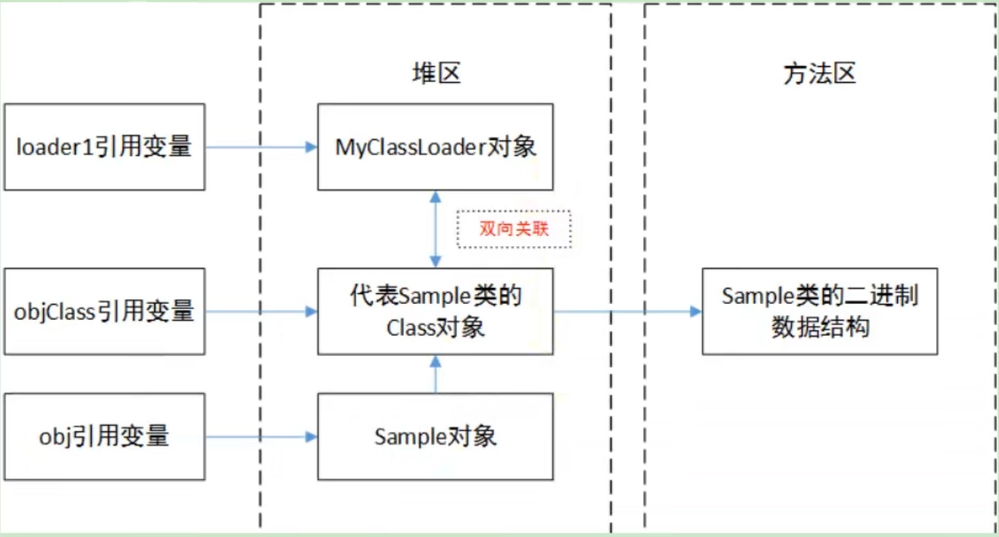

##### 类的卸载

1. **启动类加载器**加载的类型在整个运行期间是不可能被卸载的（ JVM 规范，jls 规范）
2. **扩展类加载器**和**系统类加载器**在运行期间不太可能被卸载，因为系统类加载器实例或扩展类的实例基本上弄能被直接或间接的加载到
3. **自定义类加载器**只有在简单的上下文环境中才能被卸载，调用 System.gc( ) 强制垃圾回收时才会被卸载

#### 再谈类加载器

> 1. 引导类加载器 Bootstrap ClassLoader
>     - 使用 C / C++ 实现的
>     - 用来加载 Java 的核心类库
>     - 只加载包名为 java、javax、sun 等开头的类
> 2. 扩展类加载器 Extension ClassLoader
>     - Java 语言编写，派生于 ClassLoader 类，**属于用户自定义类加载器**
>     - 从 ext 子目录 (扩展目录) 加载类库
> 3. 系统类加载器 (应用程序类加载器) ApplicationClassLoader
>     - Java 语言编写，派生于 ClassLoader 类，**属于用户自定义类加载器**
>     - 从 path 路径下加载类库
>     - 是程序中默认的类加载器，Java 应用的类都由它加载

  4. 用户自定义类加载器

     - 需要继承于 ClassLoader

     - 实现绝妙的插件机制：OSGI 组件框架、Eclipse 的插件机制

     - 实现应用隔离：Tomcat、Spring等中间件采用自定义类加载器隔离不同组件模块

##### 类的显式加载与隐式加载

- 显式加载：值在代码中调用 ClassLoader 加载 class 对象：`Class.forName( )` 或 `this.getClass( ).getClassLoader( ).loadClass( )`
- 隐式加载：不直接调用类加载器的方法加载 class 对象，通过虚拟机自动加载到内存的：加载其他类时 class 文件引用了另一个类的对象，new 对象等

##### 命名空间

> 判断两个类是否相等，只有在这两个类是同一类加载器加载的前提下才有意义。
>
> 类加载器 + 类 = 确定类的唯一性

- 每个类加载器都有自己的命名空间，由该类加载器及所有的父类加载器所加载组成
- 同一命名空间（同一类加载器）中，不会出现类的全限定类名相同的两个类
- 在不同的命名空间中，有可能会出现类的全限定类名相同的两个类

##### 类加载器的三大特征

1. 双亲委派模型
2. 可见性：子类加载器可以访问父类加载器，反过来不行
3. 单一性：父类加载器对子类加载器是可见的，所以父类加载过的类型不会再在子类中加载（邻居加载器的话是可以破坏单一性的）

##### ClassLoader 类加载器

- `final ClassLoader getParent()`获取该类的超类加载器

- `Class<?> loadClass(String name)` 加载名称为 name 的类，返回 Class 实例【双亲委派机制】

    1. 在缓存中判断是否已经加载同名的类

    2. 判断是否存在 parent

        - 如果存在则调用父类的 loadClass 方法

        - 如果不存在则调用引导类加载器

    3. 如果当前类加载器的父类未完成加载则调用当前类 findClass 方法 放回 Class 实例

    ```java
    protected Class<?> loadClass(String name, boolean resolve)
            throws ClassNotFoundException
        {
            synchronized (getClassLoadingLock(name)) {
                // First, check if the class has already been loaded
                Class<?> c = findLoadedClass(name);
                if (c == null) {
                    long t0 = System.nanoTime();
                    try {
                        if (parent != null) {
                            c = parent.loadClass(name, false);
                        } else {
                            c = findBootstrapClassOrNull(name);
                        }
                    } catch (ClassNotFoundException e) {
                        // ClassNotFoundException thrown if class not found
                        // from the non-null parent class loader
                    }
    
                    if (c == null) {
                        // If still not found, then invoke findClass in order
                        // to find the class.
                        long t1 = System.nanoTime();
                        c = findClass(name);
    
                        // this is the defining class loader; record the stats
                        sun.misc.PerfCounter.getParentDelegationTime().addTime(t1 - t0);
                        sun.misc.PerfCounter.getFindClassTime().addElapsedTimeFrom(t1);
                        sun.misc.PerfCounter.getFindClasses().increment();
                    }
                }
                if (resolve) {
                    resolveClass(c);
                }
                return c;
            }
        }
    ```

- `Class<?> findClass(String name)` 查找二进制名称为 name 的类，返回结果为 java.lang.Class 类的实例
    - 过去 name 的二进制比特流
    - 调用 defineClass 方法
- `Class<?> defineClass(String name)` 根据二进制比特流，及 Class 信息在 byte 数组中的位置和长度，转换为 Class 实例
- `final Class<?> resolveClass(Class<?> c)` 需要时 创建对象完成的同时会调用此方法解析
- `final Class<?> findLoadedClass(String name)` 判断 name 类是否在缓存中，被加载过就返回其 Class 实例

##### ClassLoader 与现有类加载器的关系

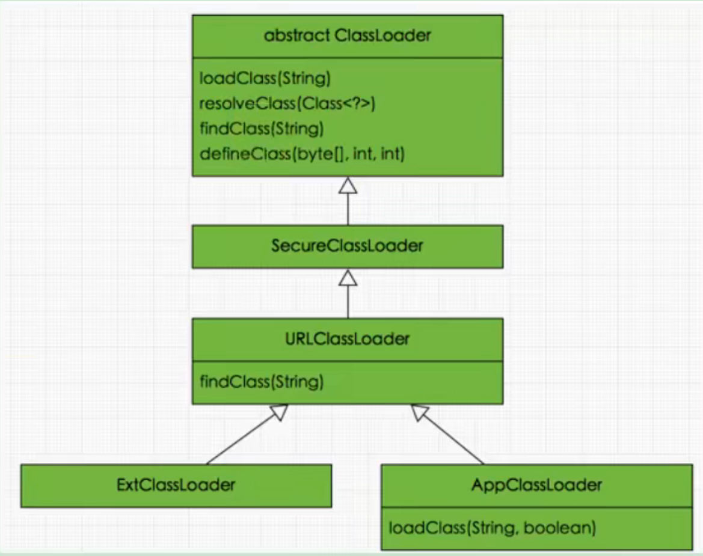

Class.forName( ) 与 ClassLoader.loadClass( ) 的区别

- Class.forName( )：是静态方法，属于 <a href="#主动使用">主动使用</a> 在加载到内存的同时会执行类的初始化
- ClassLoader.loadClass( )：是实例方法，需要 ClassLoader 对象调用，属于 <a href="#被动使用">被动使用</a> 在加载到内存的同时不会初始化，等到这个类第一次使用时才进行初始化

> 获取类加载器的方式
>
> `clazz.getClassLoader()` 获取当前类的 ClassLoader
>
> `Thread.currentThread().getContextClassLoader()` 获取当前线程上下文的 ClassLoader
>
> `ClassLoader.getSystemClassLoader` 获得系统的 ClassLoader

##### 双亲委派机制

> JDK 1.2 开始，类的加载过程采用双亲委派机制

- 如果一个类的加载器在接收到加载类的请求时，它首先不会自己尝试加载这个类，而是把这个请求任务委托给父类加载器去完成，一次递归，如果父类加载器可以完成类加载任务，就返回成功。只有父类加载器无法完成此加载任务时，才会自己去加载。
- 引导类加载器不行 -> 扩展类加载器不行 -> 系统类加载器[ -> 自定义类加载器]
- 优势：
    - 避免重复加载，确保一个类的全局唯一性
    - 保护程序安全，防止核心 API 被随意篡改
        - 强制调用的 java.lang.ClassLoader.defineClass(...) 方法会执行 preDefineClass( ) 接口提供对 JDK 核心类库的保护
- 劣势：
    - 上层的 ClassLoader 加载的实例无法访问下层的 ClassLoader 所加载的类
    - 那么如果有基础类型又要调用回用户的代码，该怎么办呢？打破双亲委派

##### 打破双亲委派机制 <a name="打破双亲委派机制"> </a> 

- JDK 1.2 前没有双亲委派机制的时候写的代码

- 线程上下文类加载器：作为中介，允许引导类加载器的类通过线程上下文加载器调用下层类加载器的对象

    > SPI：核心类 rt.jar 中提供对外服务、可由应用层自行实现的接口

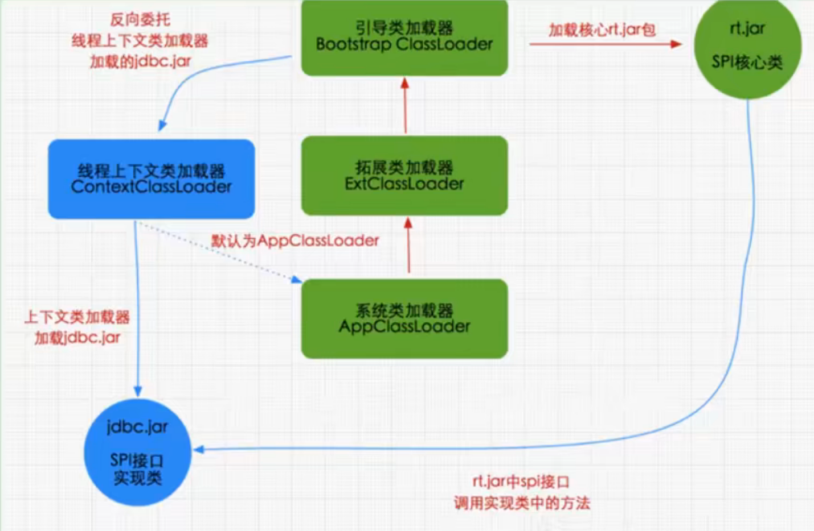

- IBM 主导的 OSGI 项目，目的是实现**模块化热部署( Hot Deployment )**，将类加载从树状结构变为了网状结构，从而破坏了双亲委派机制
- **代码热替换( Hot Swap )** 指程序运行中不停止服务通过替换程序文件来修改程序的行为（PHP就默认支持热替换）

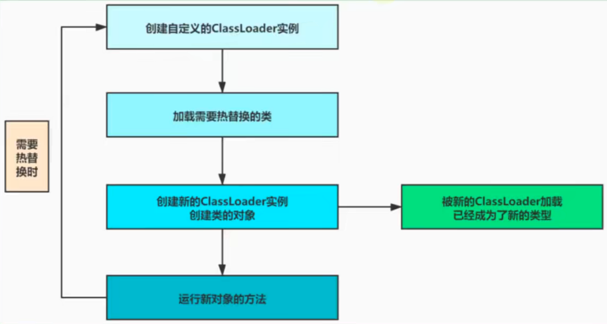

> 大致代码就是每次循环都创建一个新的类加载器，重新创建指定类实例，调用其方法

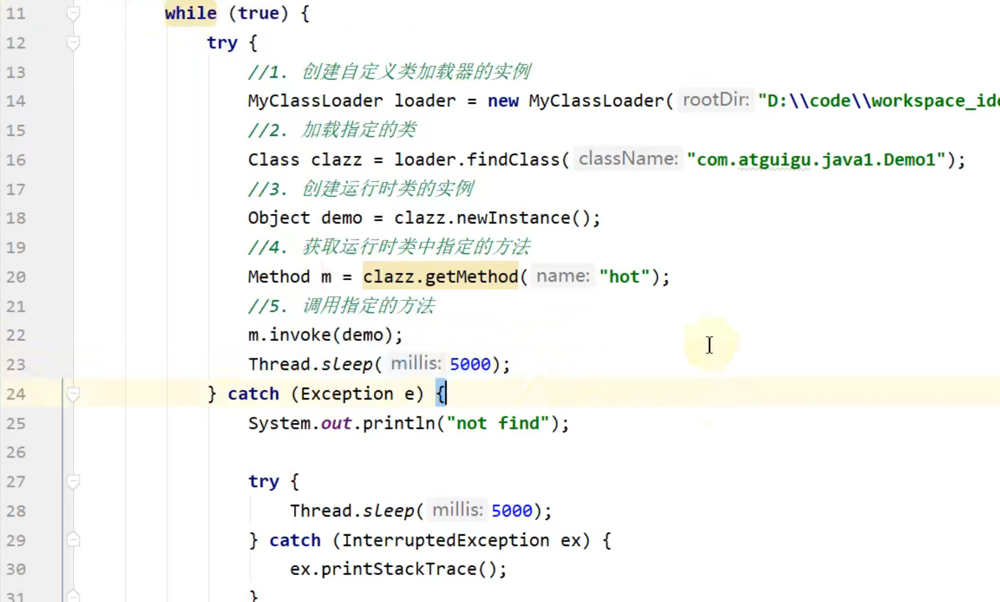

##### 沙箱安全机制

- 限制程序运行的环境：限定代码在 JVM 特定的运行范围中，并且严格限制代码对本地系统资源访问
- 保证程序安全
- 保护 Java 原生 JDK 代码

##### 自定义类加载器

- 为什么要自定义类加载器

    - **隔离加载类**：主要是要将应用类加载器和中间件隔离开，Tomcat 就以此隔离同一个 Web 应用服务器上的不同应用程序
    - **修改类加载的方式**：实现按需进行动态加载
    - **扩展加载源**：从数据库、网络等取得数据加载类
    - **防止源码泄漏**：对加密的字节码进行解密

- 实现方式

    - 创建 ClassLoader 类的子类

        1. 重写 loadClass 方法
            - 可以修改双亲委派机制的内部逻辑，但容易造成问题，破坏原有稳定结构

        2. 重写 findClass 方法
            - 推荐

        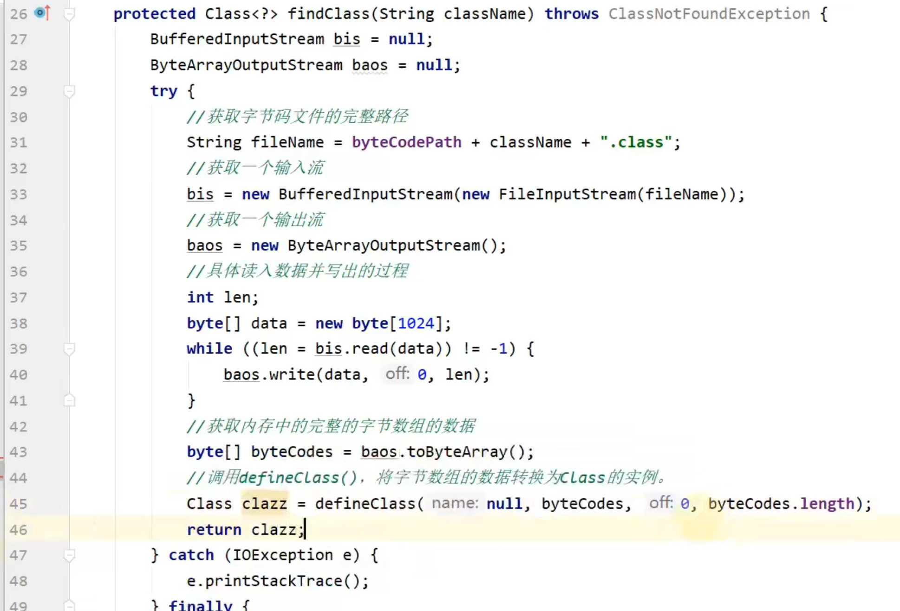

        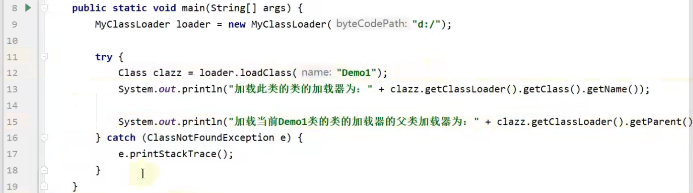


## 性能监控与调优

### 关于性能监控与调优

略

