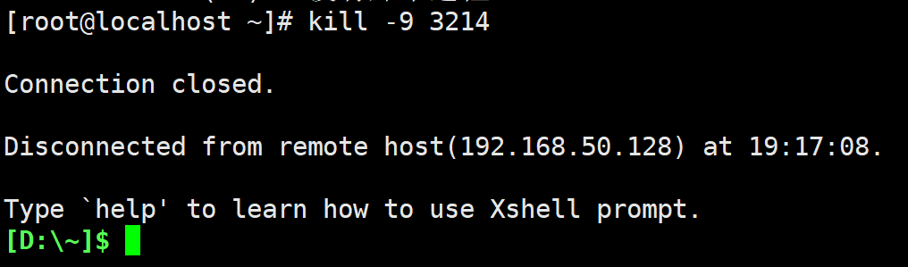
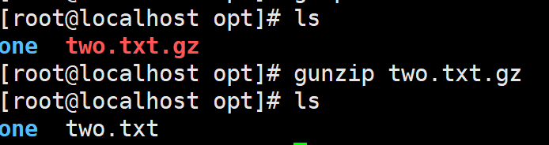
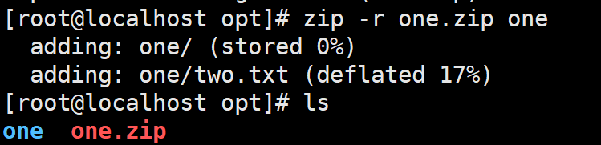
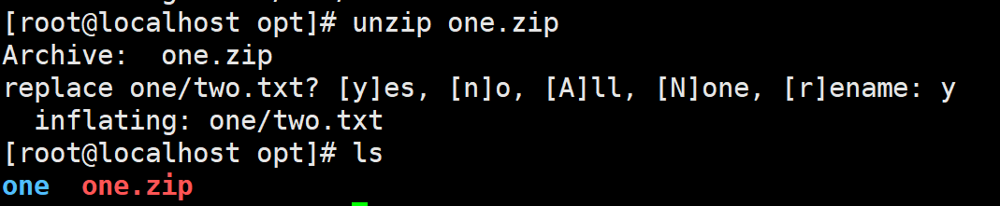
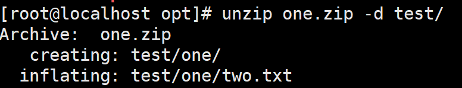
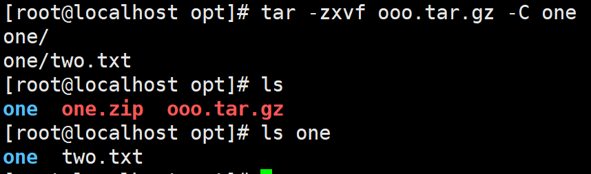

# Linux自学笔记md版

# Linux自学笔记

> 大连交通大学 信息学院 刘嘉宁 2021-10-10
>
> 笔记摘自：bjpowernode 杨震

## Linux文件目录

1. ==root== : 系统管理员 root用户（拥有超级权限）的目录。
2. ==bin 或 usr/bin== : 存放系统预装的可执行程序，相当于windows中的环境变量。
3. usr : 系统资源目录，一些系统可执行文件或者系统的一些文件库。
4. usr/local/bin : 用户自己的可执行文件，相当于windows中的用户环境变量。
5. lib 或 usr/lib : 存放着系统最基本的动态连接共享库，相当于windows里的DLL文件，几乎所有的应用程序都需要用到这些共享库。
6. boot : 存放启动Linux时使用的一些核心文件，包括一些连接文件以及镜像文件。
7. dev : (Device)存放Linux的外部设备，Linux中的设备也是以文件的形式存在。

8) ==etc== : 存放所有的系统管理所需要的配置文件。

9) ==home== : 普通用户的主目录，每个用户都有一个以用户的账号命名的根目录，用户登录后默认打开自己的根目录。

10) var : 存放着在不断扩充着的东西，我们习惯将那些经常被修改的文件存放在该目录下，比如运行的各种日志文件。

11) mnt : 让用户临时挂载别的文件系统，可以将光驱挂载在/mnt/上，进入该目录就可以查看光驱里的内容。

12) opt : 额外安装软件所存放的目录。相当于windows中Programe files目录。

13) tmp : 存放一些临时文件。

## 远程操作Linux

- XShell工具：用于推送Linux命令
- XFTP工具：用于文件数据传输

1. 使用XShell链接Linux系统

   - 使用`ifconfig`获取Linux的IP地址

   

   - 在XShell中建立连接：填写名称、主机

   

   - 填写用户名：Linux的用户名root

   

   - 填写密码：Linux中root账户的密码129807

   

- XFTP同理

## Linux常用命令

### 一、文件相关操作

1. `pwd`：查看当前所在的文件夹目录

2. `ls`：列出当前目录下的所有文件和目录

- `ls -a`：同时列出**隐藏与非隐藏**的文件和目录

- `ls -l`：以列表的方式列出当前目录下的所有文件和目录

3. `cd`：切换到指定目录
   - cd 文件夹的uri路径

- `cd..` ：返回上一级目录

4. `mkdir`：创建单个目录
   - mkdir 路径

- `mkdir -p`：创建多级目录
  - mkdir -p 路径

5. `touch`：创建 一个/多个 文件

   - touch 文件名.后缀

   - touch 路径/文件名.后缀

6. `cp`：复制文件
   - cp 来源文件 目标目录

- `cp -r`：递归复制目录及目录中所有内容

7. `rm`：删除文件或目录
   - rm 目录路径/文件

- `rm -r`：递归删除目录及目录中的所有内容

  - rm -r 目录路径

  

- `rm -f`：强制删除不提示

  - rm -rf 目录路径

8. `mv`：移动文件或目录
   - mv 来源文件/目录 目标目录

- `mv 来源文件 同级目标文件`：重命名文件

- `mv 来源文件/目录 .` ：移动到上一级目录中

9. `cat`：查看文件内容
   - cat 文件

- `cat -n`：带行号 查看文件内容

10. `more`：使用VI编辑器显示文本内容
    - more 文件

### 二、VI及VIM文本编辑器

1. `vi 文件`：使用VI文本编辑器打开文件

- 一般模式：只能看

  - 按 i 或 a(光标在下一个字符处) 进入编辑模式
  - 按 / 或 : 进入命令行模式

- 编辑模式：能修改

  - 按 esc 退回一般模式

- 命令行模式：
  - `:wq`：保存并退出
  - `:q!`：不保存并退出

  - `:q`：未改动时退出

### 三、用户管理

1. `id`：查看用户信息
   - `id 用户名`

2. `useradd`：添加用户

   - useradd 用户名

   

   - useradd -d /home/用户的文件夹名 用户名

- `passwd用户名` ：为用户设置密码

  

3. `userdel`：删除用户

   - userdel 用户名：删除用户但不删除用户在 /home中的文件夹

   

   - userdel -r 用户名：删除用户及其文件夹

   

### 四、进程管理

###### 什么是Linux的进程：

- Linux进程的概念和windows一样
- Linux中每个进程都有一个ID编号
- Linux中每个进程都会对应一个父进程（调用这个进程的进程）

###### 进程的分类：

1. 前台进程，在前台可见
2. 后台进程，前台不可见

###### 进程相关常用命令：

1. `ps`显示当前进程的状态

- `ps –a`：显示当前终端下的所有进程信息
- `ps –u`：以用户的格式显示进程信息
- `ps –x`：显示后台进程运行的参数
- `ps –e`：显示所有进程信息
- `ps –f`：以全格式显示进程信息

> USER：用户名称
>
> PID：进程号
>
> %CPU：进程占用**CPU**的百分比
>
> %MEM：进程占用物理内存的百分比
>
> VSZ：进程占用的虚拟内存大小（单位：**KB**）
>
> RSS：进程占用的物理内存大小（单位：**KB**）
>
> TT：终端名称,缩写.
>
> STAT：进程状态，其中S-睡眠，s-表示该进程是会话的先导进程，N-表示进程拥有比普通优先级更低的优先级，R-正在运行，D-短期等待，Z-僵死进程，T-被跟踪或者被停止等等
>
> STARTED：进程的启动时间
>
> TIME：CPU时间，即进程使用CPU的总时间
>
> COMMAND：启动进程所用的命令和参数，如果过长会被截断显示
>
> PPID 父进程的ID
>
> C CPU使用的资源百分比
>
> PRI指进程的执行优先权(Priority的简写)，其值越小越早被执行
>
> SZ 使用掉的内存大小

2. `kill`终止进程
   - kill 进程ID：终止进程
   - kill -9 进程ID：强迫进程立即停止

### 压缩与解压缩

1. `gzip`：压缩文件 

   - gzip 文件

   - 压缩格式为.gz
   - 会自动删除原文件

   

2. `gunzip`：解压缩.gz格式文件

   - gunzip 文件

   - 解压为原本格式
   - 会自动删除.gz文件

3. `zip`：压缩文件
   - zip 压缩后的目录和文件名 要压缩的目录

- `zip -r`：递归压缩目录及目录下的所有文件
  - zip -r 压缩后的目录和文件名 要压缩的目录或文件

4. `unzip`：解压缩.zip格式文件
   - unzip 要解压的目录和文件名（小心覆盖原文件）

- `unzip -d 解压后文件的存放位置`：指定解压位置

5. `tar`：压缩/解压缩文件

   > -c：产生.tar.gz打包文件
   > -v：显示详细信息
   > -f：指定压缩后的文件名
   > -z：打包同时压缩
   > -x：解压.tar.gz文件
   > -C: 指定解压到哪个目录

- `tar -zcvf 压缩包文件名.tar.gz 目录名`

- `tar -zxvf 压缩包文件名 -C 存放的目录`

