# MySQL自学笔记进阶md版


# 基础篇补充

## 数据类型

### 数值类型

| **类型**     | **大小**                                       | **范围（有符号）**                                           | **范围（无符号）**                                           | **用途**        |
| :----------- | ---------------------------------------------- | :----------------------------------------------------------- | :----------------------------------------------------------- | :-------------- |
| TINYINT      | 1 字节                                         | (-128，127)                                                  | (0，255)                                                     | 小整数值        |
| SMALLINT     | 2 字节                                         | (-32 768，32 767)                                            | (0，65 535)                                                  | 大整数值        |
| MEDIUMINT    | 3 字节                                         | (-8 388 608，8 388 607)                                      | (0，16 777 215)                                              | 大整数值        |
| INT或INTEGER | 4 字节                                         | (-2 147 483 648，2 147 483 647)                              | (0，4 294 967 295)                                           | 大整数值        |
| BIGINT       | 8 字节                                         | (-9 233 372 036 854 775 808，<br />9 223 372 036 854 775 807) | (0，18 446 744 073 709 551 615)                              | 极大整数值      |
| FLOAT        | 4 字节                                         | (-3.402 823 466 E+38，<br />-1.175 494 351 E-38)，<br />0，<br />(1.175 494 351 E-38，<br />3.402 823 466 351 E+38) | 0，<br />(1.175 494 351 E-38，<br />3.402 823 466 E+38)      | 单精度 浮点数值 |
| DOUBLE       | 8 字节                                         | (-1.797 693 134 862 315 7 E+308，<br />-2.225 073 858 507 201 4 E-308)，<br />0，<br />(2.225 073 858 507 201 4 E-308，<br />1.797 693 134 862 315 7 E+308) | 0，<br />(2.225 073 858 507 201 4 E-308，<br />1.797 693 134 862 315 7 E+308) | 双精度 浮点数值 |
| DECIMAL      | 对DECIMAL(M,D) ，<br />如果M>D，为M+2否则为D+2 | 依赖于M和D的值                                               | 依赖于M和D的值                                               | 小数值          |

### 日期和时间类型

| 类型      | 大小 (字节) | 范围                                                         | 格式                | 用途                     |
| :-------- | :---------- | :----------------------------------------------------------- | :------------------ | :----------------------- |
| DATE      | 3           | 1000-01-01/9999-12-31                                        | YYYY-MM-DD          | 日期值                   |
| TIME      | 3           | '-838:59:59'/'838:59:59'                                     | HH:MM:SS            | 时间值或持续时间         |
| YEAR      | 1           | 1901/2155                                                    | YYYY                | 年份值                   |
| DATETIME  | 8           | 1000-01-01 00:00:00/9999-12-31 23:59:59                      | YYYY-MM-DD HH:MM:SS | 混合日期和时间值         |
| TIMESTAMP | 4           | 1970-01-01 00:00:00/2038 结束时间是第 2147483647 秒 ( INT类型最大值 )，<br />北京时间 2038-1-19 11:14:07，<br />格林尼治时间 2038-1-19 03:14:07 | YYYYMMDD HHMMSS     | 混合日期和时间值，时间戳 |

### 字符串类型

| 类型       | 大小                | 用途                            |
| :--------- | :------------------ | :------------------------------ |
| CHAR       | 0-255字节           | 定长字符串                      |
| VARCHAR    | 0-65535 字节        | 变长字符串                      |
| TINYBLOB   | 0-255字节           | 不超过 255 个字符的二进制字符串 |
| TINYTEXT   | 0-255字节           | 短文本字符串                    |
| BLOB       | 0-65 535字节        | 二进制形式的长文本数据          |
| TEXT       | 0-65 535字节        | 长文本数据                      |
| MEDIUMBLOB | 0-16 777 215字节    | 二进制形式的中等长度文本数据    |
| MEDIUMTEXT | 0-16 777 215字节    | 中等长度文本数据                |
| LONGBLOB   | 0-4 294 967 295字节 | 二进制形式的极大文本数据        |
| LONGTEXT   | 0-4 294 967 295字节 | 极大文本数据                    |

> VARCHAR 的大小可以达到 65535 ？
>
> - 在定义表结构时 `VARCHAR(M)` 中的 M 指的是字符长度并非字节长度，在 `utf8mb4` 中每个字符占 4 字节
> - 所以在定义 varchar 字段时，最高可以定义 65535 / 4 = 16383.75
> - 但是由于 `行格式` 和 <a href='#行溢出'>行溢出</a> 的限制实测最多可以存储 48545 字节 ≈ 12136 字符


## 存储过程、存储函数

### 存储过程 Stored Procedure

> 阿里开发规范 【强制】禁止使用存储过程，存储过程难以调试和扩展，更没有移植性。

- MySQL 从 5.0 开始支持存储过程和函数
- 将复杂的 SQL 逻辑封装在一起，应用程序无须关注内部逻辑，简单的调用存储过程和函数即可

**原理**：

- 就是将一组经过 **预先编译** 好的 SQL 语句封装在 MySQL 服务器上
- 需要执行的时候只需要发起调用命令，服务端即可执行这组 SQL 语句

**好处**：

- 简化操作，提高 SQL 语句重用性
- 减少网络传输量
- 避免失误、提高效率
- 减少了 SQL 在网络中暴露的风险，提高安全性

#### 用法

```sql
create procedure 存储过程名 (in|out|inout 参数名 参数类型...)
[characteristics特征...]
begin
	存储过程体
	
end
```

**参数**（分类）：

1. 没有参数【无参数无返回】
2. IN【有参数无返回】`默认`
3. OUT【无参数有返回】
4. IN OUT / INOUT【有参数有返回】

**特征**：

- `LANGUAGE SQL`：说明存储过程执行体是由SQL语句组成的，当前系统支持的语言为SQL。
- `[NOT] DETERMINISTIC`：指明存储过程执行的结果是否确定。DETERMINISTIC表示结果是确定的。每次执行存储过程时，相同的输入会得到相同的输出。NOT DETERMINISTIC表示结果是不确定的，相同的输入可能得到不同的输出。如果没有指定任意一个值，默认为NOT DETERMINISTIC。
- `{ CONTAINS SQL | NO SQL | READS SQL DATA | MODIFIES SQL DATA }`：指明子程序使用SQL语句的限制。
    - CONTAINS SQL表示当前存储过程的子程序包含SQL语句，但是并不包含读写数据的SQL语句；
    - NO SQL表示当前存储过程的子程序中不包含任何SQL语句；
    - READS SQL DATA表示当前存储过程的子程序中包含读数据的SQL语句；
    - MODIFIES SQL DATA表示当前存储过程的子程序中包含写数据的SQL语句。
    - 默认情况下，系统会指定为CONTAINS SQL。
- `SQL SECURITY { DEFINER | INVOKER }`：执行当前存储过程的权限，即指明哪些用户能够执行当前存储过程。
    - `DEFINER`表示只有当前存储过程的创建者或者定义者才能执行当前存储过程；
    - `INVOKER`表示拥有当前存储过程的访问权限的用户能够执行当前存储过程。
    - 如果没有设置相关的值，则MySQL默认指定值为DEFINER。
- `COMMENT 'string'`：注释信息，可以用来描述存储过程。

**创建存储过程例**：

```sql
delimiter //

CREATE PROCEDURE select_all_data()
	BEGIN
		SELECT * FROM emps;
	END //
	
delimiter ;
```

**调用存储过程例**：

```sql
CALL 存储过程名(实参列表)
```

```sql
CALL select_all_data()
```


### 存储函数 Stored Function

> MySQL 自带的 `count(); 计数`、`sum(); 求和`、`avg(); 平均值`、`max(); 最大值`、`min(); 最小值` 都是函数
>
> 存储函数就是我们自定义的函数

- 存储函数是带有返回值的，存储过程可以不带返回值

#### 用法

```sql
CREATE FUNCTION 函数名(参数名 参数类型,...)
RETURNS 返回值类型
[characteristics约束 ...]
BEGIN
	函数体 #函数体中肯定有 RETURN 语句
END
```

- 约束/特征 同 存储过程

**创建存储函数例**：

```sql
delimiter //

CREATE FUNCTION email_by_name()
RETURNS VARCHAR( 25 )
DETERMINISTIC
CONTAINS SQL
    BEGIN
        RETURN (SELECT email FROM employees WHERE last_name = 'Abel');
    END //

delimiter ;
```

**调用存储函数例**：

```sql
SELECT 函数名(实参列表)
```


### 存储函数和存储过程对比

|          | 关键字    | 调用语法        | 返回值              | 应用场景                         |
| -------- | --------- | --------------- | ------------------- | -------------------------------- |
| 存储过程 | PROCEDURE | CALL 存储过程() | 理解为有 0 个或多个 | 一般用于更新                     |
| 存储函数 | FUNCTION  | SELECT 函数()   | 只能是一个          | 一般用于查询结果为一个值并返回时 |

- **存储函数可以放在查询语句中使用，存储过程不行** 。
- 存储过程的功能更加强大，包括能够执行对表的操作（比如创建表，删除表等）和事务操作，这些功能是存储函数不具备的。


### 查看、修改、删除

略


## 变量、流程控制、游标

- 这块是为便于和 存储过程 / 存储函数 配合使用的
- 需要时可以查看链接学习使用 [wzblog](https://new-wangz.github.io/)

略


## 触发器

> 触发器和存储过程类似，都是存储在 MySQL 服务器中的一段程序
>
> 不过存储过程是手动触发的，触发器是在执行一些事件的时候自动触发的

- 当一个业务需要向 `商品表` `库存表` 中添加数据时，通常我们会使用事务实现数据的完整性，但一旦遇到特殊情况忘记了其中一步，会导致数据缺失
- 这时就可以使用触发器，实现当 `商品表` 有数据插入时 `库存表` 自动触发插入

**优点**：

- 可以确保数据完整性
- 可以记录操作日志
- 在操作数据前，进行数据合法性校验

**缺点**：

- 可读性差
- 表结构或数据变更，容易导致触发器出错

### 用法：

```sql
CREATE TRIGGER 触发器名称
{BEFORE|AFTER} {INSERT|UPDATE|DELETE} ON 表名
FOR EACH ROW
	BEGIN
		触发器执行的语句块;
	END
```

 **说明**：

- `表名`：表示触发器监控的对象。
- `BEFORE|AFTER`：表示触发的时间。BEFORE 表示在事件之前触发；AFTER 表示在事件之后触发。
- `INSERT|UPDATE|DELETE`：表示触发的事件。
    - INSERT 表示插入记录时触发；
    - UPDATE 表示更新记录时触发；
    - DELETE 表示删除记录时触发。
- `触发器执行的语句块`：可以是单条SQL语句，也可以是由BEGIN…END结构组成的复合语句块。

**创建触发器例1**：

```sql
DELIMITER //

create trigger before_insert_test_tri
before insert on test_trigger
for each row
	begin
		insert into test_trigger_log(t_log) value('insert_trigger');
	end //
	
DELIMITER ;
```


**创建触发器例2**：定义触发器“salary_check_trigger”，基于员工表“employees”的INSERT事件，在INSERT之前检查将要添加的新员工薪资是否大于他领导的薪资，如果大于领导薪资，则报sqlstate_value为’HY000’的错误，从而使得添加失败。

```sql
DELIMITER //

CREATE TRIGGER salary_check_trigger
BEFORE INSERT ON employees FOR EACH ROW
BEGIN
    DECLARE mgrsalary DOUBLE; # 创建 double 类型变量 mgrsalary 用于存储当前员工领导的薪资
    SELECT salary INTO mgrsalary FROM employees WHERE employee_id = NEW.manager_id;

    IF NEW.salary > mgrsalary THEN
    	SIGNAL SQLSTATE 'HY000' SET MESSAGE_TEXT = '薪资高于领导薪资错误'; # 抛出错误，不会继续执行插入操作
    END IF;
END //

DELIMITER ;
```

- NEW 关键字代表 INSERT 添加语句的新记录，同理 OLD 为 DELETE 中要删除的已有的记录
- SIGNAL 抛出错误，代码为 SQLSTATE 后字符错误信息为 MESSAGE_TEXT

**查看触发器**：

查看触发器是查看数据库中已经存在的触发器的定义、状态和语法信息等。

方式 1 ：查看当前数据库的所有触发器的定义

```sql
SHOW TRIGGERS\G
```

方式 2 ：查看当前数据库中某个触发器的定义

```sql
SHOW CREATE TRIGGER 触发器名
```

方式 3 ：从系统库information_schema的TRIGGERS表中查询“salary_check_trigger”触发器的信息。

```sql
SELECT * FROM information_schema.TRIGGERS;
```

**删除触发器**：

触发器也是数据库对象，删除触发器也用DROP语句，语法格式如下：

```sql
DROP TRIGGER IF EXISTS 触发器名称;
```


### DELIMITER

> 在存储过程、存储函数、触发器例子中都用到了 delimiter
>
> 作用为 修改程序执行结束的标识，避免语句块中出现分号时程序就结束执行了


## MySQL8 新特性

### 新增的内容

**字符集支持**：

- MySQL 5 中默认字符集为 latin1，通常需要手动设置为 utf8 即 utf8mb3 避免乱码问题
- MySQL 8 中默认字符集为 utf8md4 

**加密规则**：

- MySQL 5 中默认密码加密方式为 mysql_native_password
- MySQL 8 中默认加密方式改为了 caching_sha2_password 授权插件、角色、密码历史记录和 FIPS 模式支持，这些特性提高了数据库的安全性和性能，使数据库管理员能够更灵活地进行账户管理工作
- 导致在使用一些旧版的图形界面工具连接时报异常，更新图形界面工具 或 修改密码加密方式即可解决

```sql
use mysql;
ALTER USER 'root'@'%' IDENTIFIED WITH mysql_native_password BY 'ThePassword'; # 修改密码加密方式
flush privileges; # 刷新权限
```

**更简便的 NoSQL 支持**：

- MySQL 5.6 开始就支持 NoSQL 在 MySQL 8 对这一功能进行了优化，不再使用依赖模块 (schema)， 更灵活

**更好的索引**：

- MySQL 8 中新增了 `隐藏索引` `降序索引` 
    - 隐藏索引可以用来测试去掉索引对查询性能的影响
    - 在查询中混合存在多列索引时，使用降序索引可以提高查询的性能

**更完善的 JSON 支持**：

- MySQL 5.7 开始支持原生 JSON 数据的存储，有一些聚合函数实现 字符串 和 JSON 数据的解析和转换等
- MySQL 8 对这一功能做了优化，增加了聚合函数 `JSON_ARRAYAGG()` 和 `JSON_OBJECTAGG()` ，将参数聚合为 JSON 数组或对象，新增了行内操作符 ->>，是列路径运算符 -> 的增强，对 JSON 排序做了提升，并优化了 JSON 的更新操作。

**改进、优化 InnoDB 存储引擎**：

-  `InnoDB 是 MySQL 默认的 存储引擎`，是事务型数据库的首选引擎，支持事务安全表（ACID），支持行锁定和外键。在 MySQL 8 版本中，InnoDB 在自增、索引、加密、死锁、共享锁等方面做了大量的 `改进和优化`，并且支持原子数据定义语言（DDL），提高了数据安全性，对事务提供更好的支持。

**数据字典**：

- 在之前的MySQL版本中，字典数据都存储在元数据文件和非事务表中。

- 从MySQL 8开始新增了事务数据字典，在这个字典里存储着数据库对象信息，这些数据字典存储在内部事务表中

**原子数据定义语句**：

- MySQL 8开始支持原子数据定义语句（Automic DDL），即 `原子DDL`。目前，只有 InnoDB 存储引擎支持原子 DDL。
- 在使用支持原子数据定义的存储引擎中，即事务要么完全操作成功，要么失败后回滚，不再进行部分提交。

**资源管理**：

- MySQL 8 开始支持创建和管理资源组...
- 资源管理更高效、合理

**优化器增强**：

- MySQL 优化器开始支持隐藏索引和降序索引。
- 隐藏索引不会被优化器使用，验证索引的必要性时不需要删除索引，先将索引隐藏，如果优化器性能无影响就可以真正地删除索引。
- 降序索引允许优化器对多个列进行排序，并且允许排序顺序不一致。

**共用表表达式**：

- <a href='#gybbds'>共用表表达式详情</a>

**窗口函数**：

- <a href='#ckhs'>窗口函数详情</a>

**正则表达式支持**：

- MySQL 在 8.0.4 以后的版本中采用支持 Unicode 的国际化组件库实现正则表达式操作，这种方式不仅能提供完全的 Unicode 支持，而且是多字节安全编码。

**内部临时表** ：

- TempTable 存储引擎取代 MEMORY 存储引擎成为内部临时表的默认存储引擎

**日志记录**：

- 在 MySQL 8 中错误日志子系统由一系列 MySQL 组件构成。这些组件的构成由系统变量 log_error_services 来配置，能够实现日志事件的过滤和写入。

**备份锁**：

- 新的备份锁允许在线备份期间执行数据操作语句，同时阻止可能造成快照不一致的操作。
- 新备份锁由 LOCK INSTANCE FOR BACKUP 和 UNLOCK INSTANCE 语法提供支持，执行这些操作需要备份管理员特权。

**增强的MySQL复制**：

- MySQL 8 复制支持对 `JSON文档` 进行部分更新的 `二进制日志记录`，该记录 `使用紧凑的二进制格式`，从而节省记录完整 JSON 文档的空间。
- 当使用基于语句的日志记录时，这种紧凑的日志记录会自动完成，并且可以通过将新的 binlog_row_value_options 系统变量值设置为 PARTIAL_JSON 来启用。

### 移除的内容

**查询缓存**：

- 查询缓存命中率太小，很鸡肋
- 包括：语句... 、系统变量... 、状态变量... 、线程状态...

**加密相关**：

- 删除的加密相关的内容有：ENCODE()、DECODE()、ENCRYPT()、DES_ENCRYPT() 和 DES_DECRYPT() 函数
- 配置项 des-key-file，系统变量 have_crypt，FLUSH 语句的 DES_KEY_FILE 选项，HAVE_CRYPT CMake 选项。 对于移除的ENCRYPT() 函数，考虑使用 SHA2() 替代，对于其他移除的函数，使用 AES_ENCRYPT() 和 AES_DECRYPT() 替代。

**空间函数相关**：

- 在 MySQL 5.7 版本中，多个空间函数已被标记为过时。这些过时函数在 MySQL 8 中都已被移除，只保留了对应的 ST_ 和 MBR 函数。

**\N和NULL**：

- 在 SQL 语句中，解析器不再将 \N 视为 NULL，所以在 SQL 语句中应使用 NULL 代替 \N。
- 这项变化不会影响使用 LOAD DATA INFILE 或者 SELECT…INTO OUTFILE操作文件的导入和导出。在这类操作中，NULL 仍等同于 \N。

**mysql_install_db**：

- 在 MySQL 分布中，已移除了 mysql_install_db 程序，数据字典初始化需要调用带着 –initialize 或者 –initialize-insecure 选项的mysqld 来代替实现。另外，–bootstrap 和 INSTALL_SCRIPTDIR CMake 也已被删除。

**通用分区处理程序**：

- 通用分区处理程序已从 MySQL 服务中被移除。为了实现给定表分区，表所使用的存储引擎需要自有的分区处理程序。
- 提供本地分区支持的 MySQL 存储引擎有两个，即 InnoDB 和 NDB，而在 MySQL 8 中只支持 InnoDB。

**系统和状态变量信息**：

-  在 INFORMATION_SCHEMA 数据库中，对系统和状态变量信息不再进行维护。
- GLOBAL_VARIABLES、SESSION_VARIABLES、GLOBAL_STATUS、SESSION_STATUS表都已被删除。
- 另外，系统变量 show_compatibility_56 也已被删除。被删除的状态变量有 Slave_heartbeat_period、Slave_last_heartbeat , Slave_received_heartbeats、Slave_retried_transactions、Slave_running 。
- 以上被删除的内容都可使用性能模式中对应的内容进行替代。

**mysql_plugin工具**：

-  mysql_plugin 工具用来配置 MySQL 服务器插件，现已被删除，可使用 –plugin-load 或 –plugin-load-add 选项在服务器启动时加载插件或者在运行时使用 INSTALL PLUGIN 语句加载插件来替代该工具。


### 共用表表达式 <a id='gybbds'> </a> 

**概念：**

- 公用表表达式（或通用表表达式）简称为 CTE（Common Table Expressions）
- CTE 是一个命了名的临时结果集，作用范围是当前语句
- 我理解 CTE 是一个可复用的子查询，但是 CTE 可以引用其它 CTE ，子查询不行

#### 用法

```sql
WITH CTE名称
AS （子查询）
SELECT|DELETE|UPDATE 语句;
```

#### 普通公用表表达式

```sql
# 查询员工所在的部门的详细信息
SELECT * FROM departments
WHERE department_id IN (
	SELECT DISTINCT department_id
	FROM employees
);
```

- 共用表表达式写法
    - 我理解为讲一个查询中可能会重复用到的子查询表保存起来，在用的时候直接当作一个表来使用

```sql
WITH emp_dept_id
AS (SELECT DISTINCT department_id FROM employees)
SELECT *
FROM departments d JOIN emp_dept_id e
ON d.department_id = e.department_id;
```

```sql
+---------------+------------------+------------+-------------+
| department_id | department_name  | manager_id | location_id |
+---------------+------------------+------------+-------------+
| 10            | Administration   | 200        | 1700        |
| 20            | Marketing        | 201        | 1800        |
| 30            | Purchasing       | 114        | 1700        |
| 40            | Human Resources  | 203        | 2400        |
| 50            | Shipping         | 121        | 1500        |
| 60            | IT               | 103        | 1400        |
| 70            | Public Relations | 204        | 2700        |
| 80            | Sales            | 145        | 2500        |
| 90            | Executive        | 100        | 1700        |
| 100           | Finance          | 108        | 1700        |
| 110           | Accounting       | 205        | 1700        |
+---------------+------------------+------------+-------------+
11 rows in set (0.00 sec)
```

#### 递归公用表表达式

- CTE 可以调用自身 和自身连接，可以达到一个共同根节点的树形结构数据上非常高效

```sql
# 找到员工表中下下属的员工信息，三代下属以下
WITH RECURSIVE cte
AS
(
    SELECT employee_id, last_name, manager_id, 1 AS n FROM employees WHERE employee_id = 100 -- 种子查询，找到第一代领导
    UNION ALL
    SELECT a.employee_id, a.last_name, a.manager_id, n + 1 FROM employees AS a JOIN cte
    ON (a.manager_id = cte.employee_id) -- 递归查询，找出以递归公用表表达式的人为领导的人
)
SELECT employee_id, last_name FROM cte WHERE n >= 3;
```


### 窗口函数 <a id='ckhs'> </a> 

**案例**：

- 现有表：sales

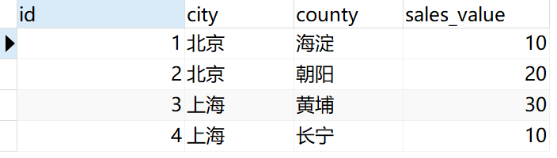

- 计算这个网站在 每个城市的销售总额、在全国的销售总额、每个区的销售额占所在城市销售额中的比率，以及占总销售额中的比率。

```sql
# 1.创建全国总销售额临时表
CREATE TEMPORARY TABLE a -- 创建临时表
SELECT SUM(sales_value) AS sales_value -- 计算总计金额
FROM sales;

# 2.创建每个城市的总销售额临时表
CREATE TEMPORARY TABLE b  -- 创建临时表
SELECT city,SUM(sales_value) AS sales_value  -- 计算城市销售合计
FROM sales
GROUP BY city;

# 3.查询
SELECT s.city AS 城市,s.county AS 区,
s.sales_value AS 区销售额,
b.sales_value AS 市销售额,
s.sales_value/b.sales_value AS 市比率,
a.sales_value AS 总销售额,
s.sales_value/a.sales_value AS 总比率
FROM sales s
JOIN b ON (s.city=b.city) -- 连接市统计结果临时表
JOIN a -- 连接总计金额临时表
ORDER BY s.city,s.county;
```

- 使用窗口函数实现

```sql
SELECT city AS 城市,county AS 区,
sales_value AS 区销售额,
SUM(sales_value) OVER(PARTITION BY city) AS 市销售额,  -- 计算市销售额
sales_value/SUM(sales_value) OVER(PARTITION BY city) AS 市比率,
SUM(sales_value) OVER() AS 总销售额, -- 计算总销售额
sales_value/SUM(sales_value) OVER() AS 总比率
FROM sales
ORDER BY city,county;
```

> 由于没有用到临时表，执行的效率也更高了。
>
> **在这种需要用到分组统计的结果对每一条记录进行计算的场景下，使用窗口函数更好** 。

**概念**：

- 窗口函数是介于单行和分组函数之间的：
    - 分组函数是将数据分组并合并
    - 窗口函数是将数据分组但不合并，将结果置于每一条数据记录中
- 窗口函数的分类：
    1. 静态窗口函数
        - 静态窗口函数的窗口大小是固定的，不会因为记录的不同而不同
    2. 动态窗口函数
        - 动态窗口函数的窗口大小会随着记录的不同而变化
- 窗口函数总体上可以分为序号函数、分布函数、前后函数、首尾函数和其他函数，如下表：

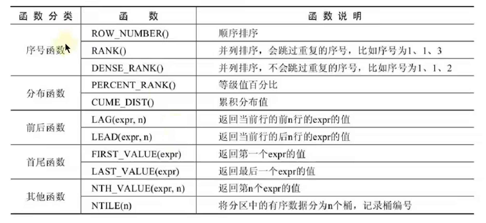

#### 用法

> PARTITION BY ：分片、分区

```sql
函数 OVER（[PARTITION BY 字段名 ][ ORDER BY 字段名 ASC|DESC]）
```

或者是：

```sql
# 相当于给 over 后内容统一定义，在 over 后只需写窗口名即可
函数 OVER 窗口名 ... WINDOW 窗口名 AS （[PARTITION BY 字段名 ORDER BY 字段名 ASC|DESC]）
```

1. 序号函数：

    1. `row_number( )` 顺序排序

    - 现有表 goods

    

    - **需求**：查询 goods 数据表中每个商品分类下价格降序排列的各个商品信息。

    ```sql
    # 根据 category_id 分组并按照 price 降序排序
    select row_number() over(partition by category_id order by price desc) as row_num,
    id, category_id, category, NAME, price, stock
    from goods;
    ```

    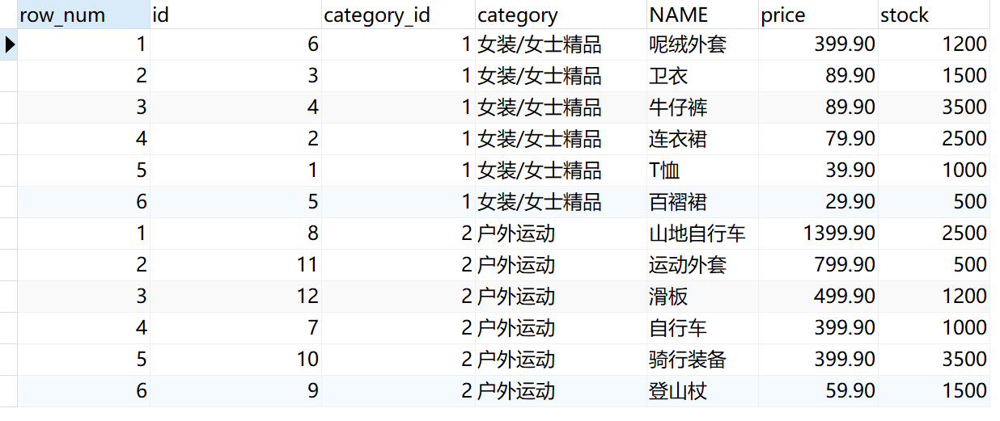

    - **需求**：查询 goods 数据表中每个商品分类下价格最高的 3 种商品信息。

    ```sql
    select * from (
        select row_number() over(partition by category_id order by price desc) as row_num,
        id, category_id, category, NAME, price, stock
        from goods
    ) as t
    where row_num <= 3;
    ```

    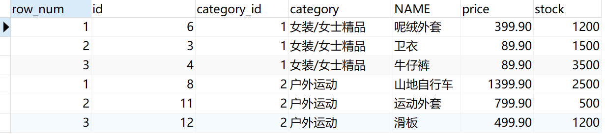

    2. `rank( )` 并列排序

    - 对序号进行并列排序，并且会跳过重复的序号，比如序号为 1 、 1 、 3 【2 被覆盖了】

    ```sql
    select rank() over(partition by category_id order by price desc) as row_num,
    id, category_id, category, NAME, price, stock
    from goods
    ```

    

    3. `dense_rank( )` 并列排序

    - 对序号进行并列排序，并且不会跳过重复的序号，比如序号为1 、1 、2【2 还在继续排序】

    ```sql
    select dense_rank() over(partition by category_id order by price desc) as row_num,
    id, category_id, category, NAME, price, stock
    from goods
    ```

    

2. 分布函数：

    1. `percent_rank( )` 等级值百分比

    - 按照 `(rank - 1 ) / (rows - 1 )` 计算等级值百分比，值为 0 - 1 
    - 相当于计算概率分布，我理解为百分比的排序、进度条

    ```sql
    # 计算 goods 数据表中的商品的PERCENT_RANK值。
    SELECT RANK() OVER w AS r,
    PERCENT_RANK() OVER w AS pr,
    id, category_id, category, NAME, price, stock
    FROM goods
    WINDOW w AS (PARTITION BY category_id ORDER BY price DESC);
    ```

    

    2. `cume_dist()` 累计分布值

    - 主要用于查询小于或等于某个值的比例。

    ```sql
    # 计算小于等于当前价格的比例
    SELECT CUME_DIST() OVER(PARTITION BY category_id ORDER BY price ASC) AS cd,
    id, category, NAME, price
    FROM goods;
    ```

    

3. 前后函数：

    1. `lag(expr, n)` 返回当前行的前 n 行的 expr 的值

    ```sql
    # 查询 goods 表中当前商品的价格和前一个商品的价格
    SELECT id, category, NAME, price,LAG(price, 1 ) OVER (PARTITION BY category_id ORDER BY price) AS pre_price
    FROM goods
    ```

    

    ```sql
    # 查询 goods 数据表中前一个商品价格与当前商品价格的差值。
    SELECT id, category, NAME, price, pre_price, price - pre_price AS diff_price
    FROM (
    	SELECT id, category, NAME, price,LAG(price, 1 ) OVER w AS pre_price
    	FROM goods
    	WINDOW w AS (PARTITION BY category_id ORDER BY price)
    ) t;
    ```

    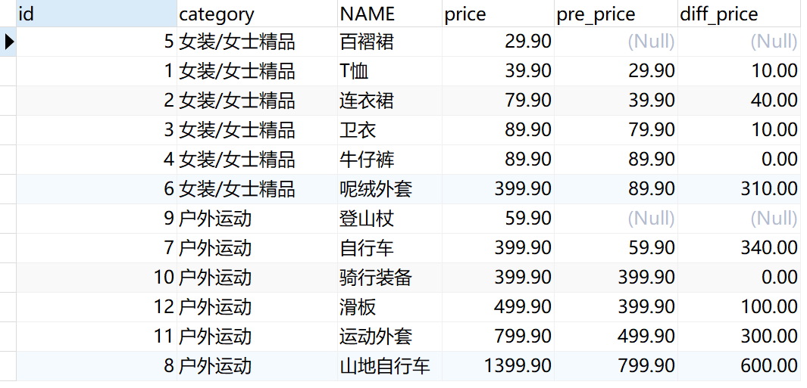

    2. `lead()` 返回当前行的后 n 行的 expr 的值

    ```sql
    # 查询 goods 表中当前商品的价格和后第二个商品的价格
    SELECT id, category, NAME, price, LEAD(price, 2 ) OVER (PARTITION BY category_id ORDER BY price) AS pre_price
    FROM goods
    ```

    

4. 首尾函数：

    1. `first_value(expr)` 返回第一个 expr 的值

    ```sql
    # 查询 category_id 分组后的商品价格信息和每组第一个商品的价格
    SELECT id, category, NAME, price, first_value(price) OVER (PARTITION BY category_id ORDER BY price) AS first_price
    FROM goods
    ```

    

    2. `last_value(expr)` 返回最后一个 expr 的值

    ```sql
    # 查询 category_id 分组后的商品价格信息和每组最后一个商品的价格
    SELECT id, category, NAME, price, last_value(price) OVER (PARTITION BY category_id ORDER BY price range between unbounded preceding and unbounded following) AS last_price
    FROM goods
    ```

    > order by 后面的 `range between unbounded preceding and unbounded following` 为设置取值区间为分组的前后无界限

    

5. 其它函数：

    1. `NTH_VALUE(expr,n)` 返回第 n 个 expr 的值

    ```sql
    # 查询 goods 数据表中排名第 2 和第 3 的价格信息
    SELECT id, category, NAME, price,NTH_VALUE(price, 2 ) OVER w AS second_price,
    NTH_VALUE(price, 3 ) OVER w AS third_price
    FROM goods 
    where category_id = 1
    WINDOW w AS (PARTITION BY category_id ORDER BY price);
    ```

    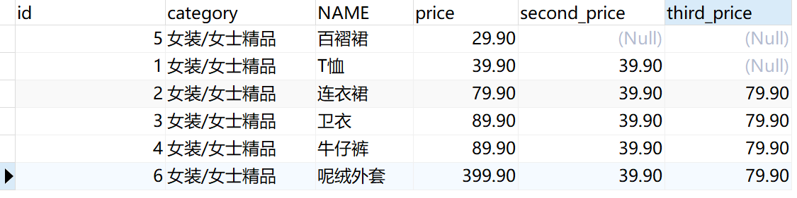

    2. `NTILE(n)` 将分区中的有序数据分为 n 个桶，记录桶编号

    ```sql
    # 将 goods 表中的商品按照价格分为 3 组 (尽可能平均的分)
    SELECT NTILE( 3 ) OVER w AS nt,id, category, NAME, price
    FROM goods WINDOW w AS (PARTITION BY category_id ORDER BY price);
    ```

    


# 高级篇

## 字符集

> - `utf8mb3` 阉割过的 utf8 字符集，用 1 - 3 个字节表示字符，MySQL 中 `utf8` 默认指的就是 `utf8mb3` 
> - `utf8mb4` 正宗的 utf8 字符集，用 1 - 4 个字节表示字符，如需存储 emoji 表情，就需要用到 `utf8mb4` 

- MySQL 8 之前版本默认字符集为 latin1，如果想存储中文字符，需

    - 在 my.cnf 中设置数据库默认字符集

        - `vim /etc/my.cnf` 添加 `character_set_server=utf8` 
        - 重启 MySQL 服务  `systemctl restart mysqld`
    
    - 在创建数据库或表时指定字符集
    
        - 数据库
    
            ```sql
            CREATE DATABASE 数据库名 
            [[DEFAULT] CHARACTER SET 字符集名称] 
            [[DEFAULT] COLLATE 比较规则名称];
            ```
    
        - 表
    
            ```sql
            CREATE TABLE 表名 (
                列名 字符串类型 [CHARACTER SET 字符集名称] [COLLATE 比较规则名称],
                列的信息...
            ) 
            [[DEFAULT] CHARACTER SET 字符集名称] 
            [COLLATE 比较规则名称]]
            ```
    
    - 修改已创建数据库的字符集 
    
        - `alter database dbtest1 character set 'utf8';`
    
    - 修改已创建数据表的字符集 
    
        - `alter table t_emp convert to character set 'utf8';` 
    
    
    
    
    
    **字符串比较规则：**
    
    
    
    - 其中 Default collation 字段为默认比较规则
    
    | 后缀 | 英文释义           | 描述             |
    | ---- | ------------------ | ---------------- |
    | _ai  | accent insensitive | 不区分重音       |
    | _as  | accent sensitive   | 区分重音         |
    | _ci  | case insensitive   | 不区分大小写     |
    | _cs  | case sensitive     | 区分大小写       |
    | _bin | binary             | 以二进制方式比较 |
    
    - 查看、修改字符串比较规则
    
    ```sql
    #查看服务器的字符集和比较规则 
    SHOW VARIABLES LIKE '%_server';
    #查看数据库的字符集和比较规则 
    SHOW VARIABLES LIKE '%_database';
    #查看具体数据库的字符集 
    SHOW CREATE DATABASE dbtest1;
    #修改具体数据库的字符集 
    ALTER DATABASE dbtest1 DEFAULT CHARACTER SET 'utf8' COLLATE 'utf8_general_ci';
    ```
    
    ```sql
    #查看表的字符集 
    show create table employees;
    #查看表的比较规则 
    show table status from atguigudb like 'employees';
    #修改表的字符集和比较规则 
    ALTER TABLE emp1 DEFAULT CHARACTER SET 'utf8' COLLATE 'utf8_general_ci';
    ```
    
    - 在数据库设置中就需要保证 character_set_client 和 character_set_connection 和 character_set_results 设置一致，以避免数据库服务器处理中出现乱码问题
    - 使用 `SET NAMES utf8;` 或 设置my.cnf 中内容 或 单独设置这三个值 效果一致
    
    

### SQL 大小写规范

- 在 windows 系统中 `SHOW VARIABLES LIKE '%lower_case_table_names%'` 的 value 值为 `0` 即: **大小写不敏感**
- 在 linux 系统中 `SHOW VARIABLES LIKE '%lower_case_table_names%'` 的 value 值为 `1` ，**部分情况下大小写敏感**

> 这个值也可以设置为 `2` 即: 无论大小写字符，凡是查找就都是按照小写进行
>
> - 在 MySQL 5 设置 my.cnf 中加入 `lower_case_table_names=1` 【需要提前将表明全部改为小写，重启生效】
>
> - 在 MySQL 8 设置【不建议改】
>
>     ```
>     1、停止MySQL服务 
>     2、删除数据目录，即删除 /var/lib/mysql 目录 
>     3、在MySQL配置文件 (/etc/my.cnf) 中添加 lower_case_table_names=1 
>     4、启动MySQL服务
>     ```

- MySQL 在 Linux 下数据库名、表名、列名、别名大小写规则是这样的： 
    1. 数据库名、表名、表的别名、变量名是严格区分大小写的：`dbtest99;`
    2. 关键字、函数名称在 SQL 中不区分大小写：`COUNT()` `sum()`
    3. 列名（或字段名）与列的别名（或字段别名）在所有的情况下均是忽略大小写的：`Id, NaME, PassWORD`

**建议**：

1. 关键字和函数名称全部大写
2. 数据库名、表名、表别名、字段名、字段别名等全部小写
3. SQL 语句必须以分号结尾


### sql_mode

- sql_mode 是**一组语法校验规则**，会影响 MySQL 的**数据验证检查**
    - 通过设置 sql_mode 实现不同严格程度的数据校验，有效保证数据准确性
- 【**宽松模式**】MySQL 5.6 默认为宽松模式 `NO_ENGINE_SUBSTITUTION`，是一个空值，允许一些非法数据的插入
    - 宽松模式在插入数据时，即使给了一个错误的数据，仍然可能被接受不报错。
    - 举例：在给一个 `char(10)` 的字段插入 `1234567890abc` 这样一个长度超过 10 的数据时，MySQL 会自行处理并接受，并不会报错，是将前十位数据插入后面的舍弃。
    - 应用场景：在做数据迁移时可以打开宽松模式，生产环境中即便使用的是 MySQL 5.6 也应设置为严格模式
- 【**严格模式**】MySQL 5.7 默认为严格模式 `STRICT_TRANS_TABLES`，对数据进行严格的校验，错误时报 ERROR 并回滚
    - 严格模式则严格按照数据的约束进行校验，当遇到的是错误的数据时立即报 ERROR
    - 问题：使用严格模式时若设置模式中包含了 `NO_ZERO_DATE` 不允许插入零日期。当一个字段使用的是 TIMESTAMP 时间戳类型时，未声明为 NULL 或 default 值时，将自动分配 DEFAULT '0000-00-00 00:00:00' ( 零时间戳 )，此时会报错误 ERROR

| sql_mode 值                    | 描述                                                         |
| ------------------------------ | ------------------------------------------------------------ |
| **ONLY_FULL_GROUP_BY**         | 对于 GROUP BY 聚合操作，如果在SELECT中的列，没有在 GROUP BY 中出现，那么这个 SQL 是不合法的，因为列不在 GROUP BY 从句中 |
| NO_AUTO_VALUE_ON_ZERO          | 该值影响自增长列的插入。默认设置下，插入 0 或 NULL 代表生成下一个自增长值。如果用户 希望插入的值为 0，而该列又是自增长的，那么这个选项就有用了 |
| ==**STRICT_TRANS_TABLES**==    | 在该模式下，如果一个值不能插入到一个事务表中，则中断当前的操作，对非事务表不做限制 |
| NO_ZERO_IN_DATE                | 在严格模式下，不允许日期和月份为零                           |
| NO_ZERO_DATE                   | MySQL 数据库不允许插入零日期，插入零日期会抛出错误而不是警告 |
| ERROR_FOR_DIVISION_BY_ZERO     | 在 INSERT 或 UPDATE 过程中,如果数据被零除，则产生错误而非警告。如果未给出该模式，那么数据被零除时 MySQL 返回 NULL |
| NO_AUTO_CREATE_USER            | 禁止 GRANT 创建密码为空的用户                                |
| ==**NO_ENGINE_SUBSTITUTION**== | 如果需要的存储引擎被禁用或未编译，那么抛出错误。不设置此值时，用默认的存储引擎替代，并抛出一个异常 |
| PIPES_AS_CONCAT                | 将 "\|\|" 视为字符串的连接操作符而非或运算符，这和 Oracle 数据库是一样，也和字符串的拼接函数 Concat 相类似 |
| ANSI_QUOTES                    | 启用 ANSI_QUOTES 后，不能用双引号来引用字符串，因为它被解释为识别符 |

**查看当前的 sql_mode** 

```sql
select @@session.sql_mode 
select @@global.sql_mode 
#或者
show variables like 'sql_mode';
```

**临时设置 sql_mode**

```sql
SET GLOBAL sql_mode = 'modes...'; #全局 
SET SESSION sql_mode = 'modes...'; #当前会话

#改为严格模式。此方法在当前服务中生效，重启MySQL服务后失效。 
set GLOBAL sql_mode='STRICT_TRANS_TABLES';
#改为严格模式。此方法只在当前会话中生效，关闭当前会话就不生效了。 
set SESSION sql_mode='STRICT_TRANS_TABLES';
```

**永久设置 sql_mode**

- 在 my.cnf 中添加

```ini
[mysqld] 
sql_mode=ONLY_FULL_GROUP_BY,STRICT_TRANS_TABLES,NO_ZERO_IN_DATE,NO_ZERO_DATE,ERROR_FOR_DIVISION_BY_ZERO,NO_ENGINE_SUBSTITUTION
```

- 重启 MySQL 服务【生产场景推荐使用临时 + 永久设置配合】


## MySQL 的数据目录

### 主要目录结构

**Windows 中的 MySQL 数据存放目录** `C:\ProgramData\MySQL\MySQL Server 8.0`

```
│  installer_config.xml
│  my.ini
│
├─Data
│  ├─#innodb_temp
│  ├─数据库名
│  │      表名.ibd
│  │      表名.ibd
│  ├─mysql
│  ├─performance_schema
│  └─sys
└─Uploads
```

**Linux 中的 MySQL 数据存放目录** `/var/lib/mysql`


- 相关命令目录 `/usr/bin(mysqladmin、mysqlbinlog、mysqldump 等命令)` 和 ` /usr/sbin`
- 配置文件目录 `/usr/share/mysql-8.0 (命令及配置文件)` `/etc/mysql (如 my.cnf)` 

> 查看 MySQL 相关的目录 `find / -name mysql` 


### 数据库文件系统

> 【存储引擎】：InnoDB / MyISAM 的作用就是 `把表存储在文件系统上` 。
>
> - 在写入数据的时候，存储引擎将数据写入到文件系统
> - 在读取数据的时候，存储引擎从文件系统中读取数据并返回

**==MySQL 自带的数据库==**

- **mysql**：MySQL 的核心数据库，用于存储用户账户、权限信息，存储过程、事件的定义信息，日志，帮助信息、时区信息等
- **information_schema**：存储所有其他数据库的 `描述性信息` / `元数据` ，比如表、视图、存储过程/函数、触发器、列、索引等
- **performance_schema**：存储 MySQL 数据库在运行时期的状态信息，性能指标。统计执行的语句、花费的时间、内存使用等
- **sys**：通过 `视图` 将 information_schema、performance_schema 结合起来。帮助开发人员监控 MySQL 的技术性能

#### MySQL 5.7 文件结构

- 进入 Linux 版本 MySQL 的数据存放目录  `/var/lib/mysql` ，可以看到 MySQL 自带的数据库目录，以及我创建的数据库目录：dbtest1、dbtest2

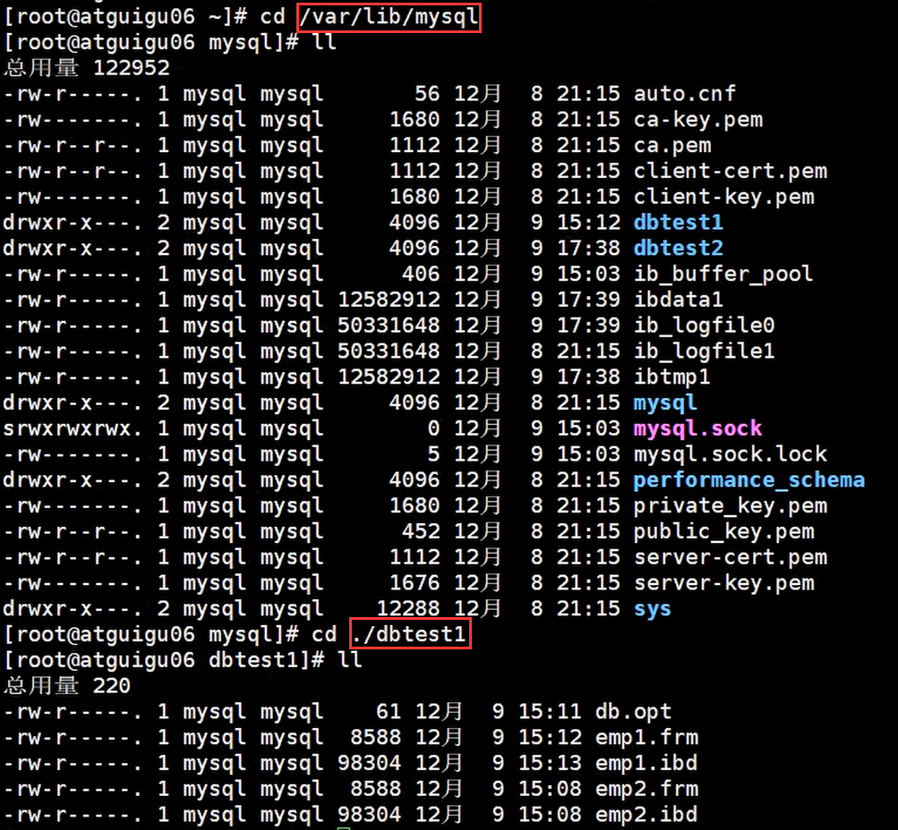

- 进入 dbtest1 目录
    - db.opt：存储当前数据库下的信息 ( 字符集、比较规则等 )
    - emp1.frm：存储表结构信息 ( 字段名、字段类型、约束等 )
    - emp1.idb：存储表数据【默认】( MySQL 5.5 前表数据存放在上级目录 `ibdata1` 中 )

> **ibdata1**：【系统表空间】system tablespace
>
> - MySQL 5.5 前，表数据默认都存储在此文件中
> - 是一个 `自扩展文件` 默认大小 12M
> - 可以修改 my.cnf 配置系统表空间默认路径及大小
>
> ```ini
> [server] 
> innodb_data_file_path=data1:512M;data2:512M:autoextend
> ```
>
> **表名.ibd**：【独立表空间】file-per-table tablespace
>
> - 在 MySQL 5.6.6 以及之后的版本中，默认为每一个表建立一个独立的表空间
>
> **设置使用系统表空间还是独立表空间**：
>
> - 可以修改 my.cnf 配置
>
> ```ini
> [server] 
> innodb_file_per_table=0 # 0：代表使用系统表空间； 1：代表使用独立表空间
> ```

#### MySQL 8 文件结构

- 进入 Linux 版本 MySQL 的数据存放目录  `/var/lib/mysql` ，可以看到 MySQL 自带的数据库目录，以及我创建的数据库目录：dbtest1

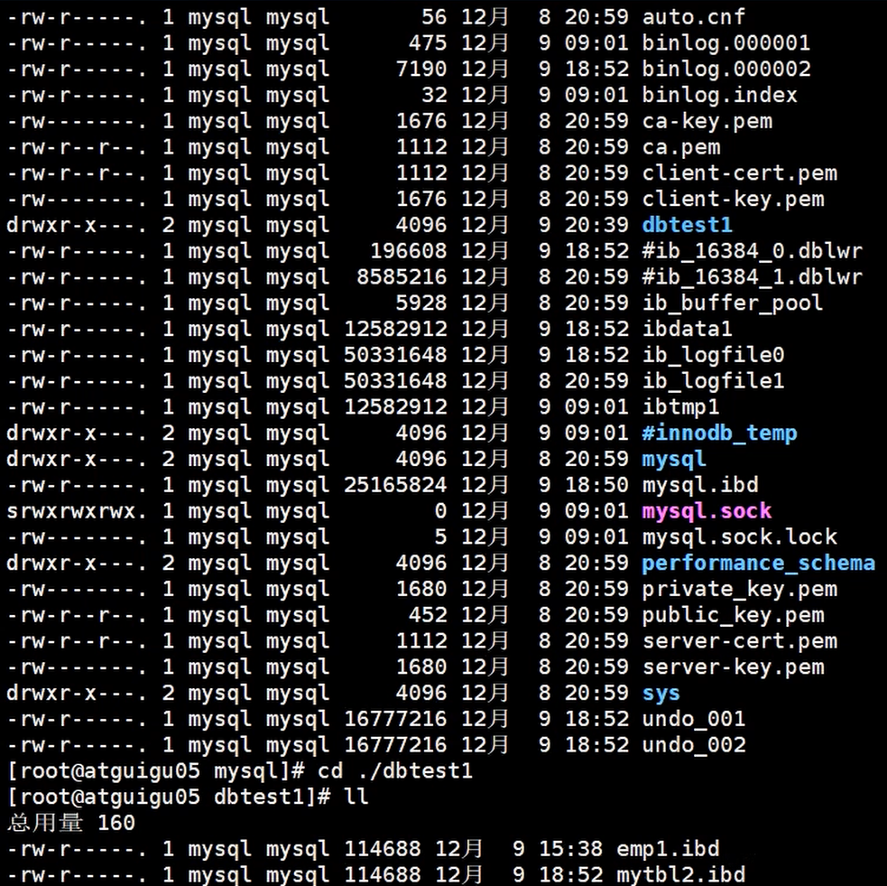

- 进入 dbtest1 目录
    - emp1.ibd：集成了 表结构信息 和 表数据 的文件

> **解析 ibd 文件**：
>
> - 使用 Oracle 提供集成的 ibd2sdi 工具
>
> ```bash
> ibd2sdi --dump-file=tbl_dic_type.txt tbl_dic_type.ibd
> ```
>
> - 生成 tbl_dic_type.txt 文件，可以看到里面有对表结构信息的描述

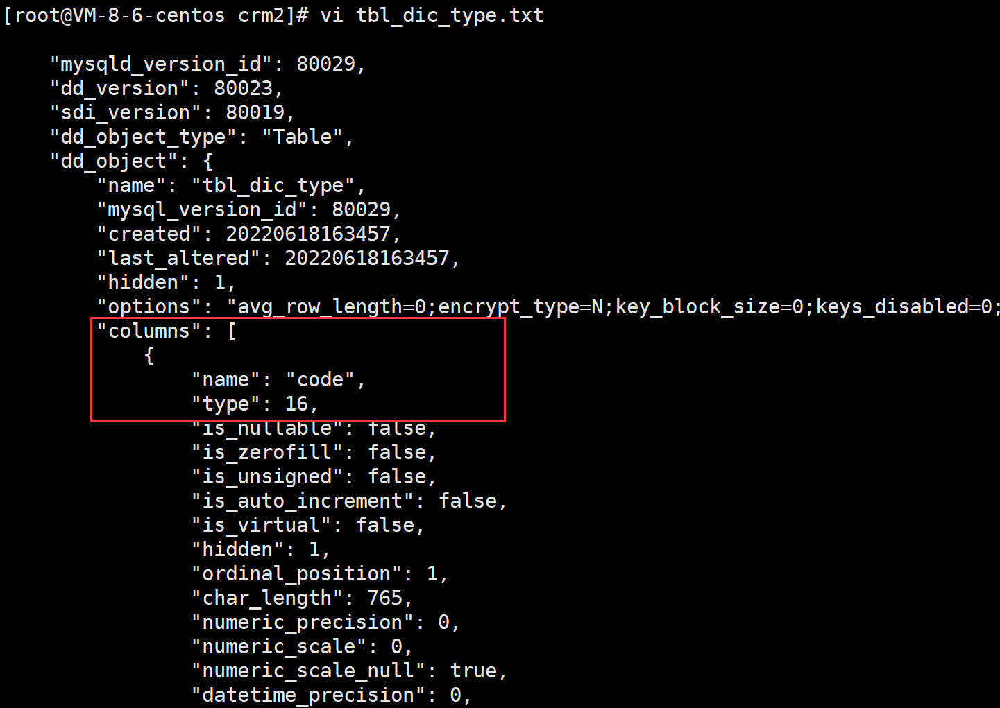

#### MyISAM 存储引擎的文件结构

- MyISAM 存储引擎的表由三个文件构成
    - **表名.frm**：等同于 InnoDB 中的 frm 文件，用于存储表结构信息 ( 字段名、字段类型、约束等 )【MySQL 8 中为 `表名_xxx.sdi`】
    - **表名.MYD**：MYData 存储表数据 ( MyISAM 存储引擎中的表数据和索引信息是分开存储的 )
    - **表名.MYI**：MYIndex 存储索引 ( MyISAM 存储引擎中的索引都是二级索引 )


## 用户与权限管理

### 用户管理

**登录 MySQL 服务器命令**： 

```bash
mysql –h hostname|hostIP –P port –u username –p 数据库名 –e "SQL语句"
```

- `-h` 指定主机名或主机 IP，省略时为 localhost
- `-P` 指定连接的端口，省略时为 3306
- `-u` 用户名
- `-p` 密码
- `数据库名` 指定登录的数据库，省略时需要登录后 use 数据库
- `-e` 指定登录后执行的 SQL 语句，执行结束自动退出

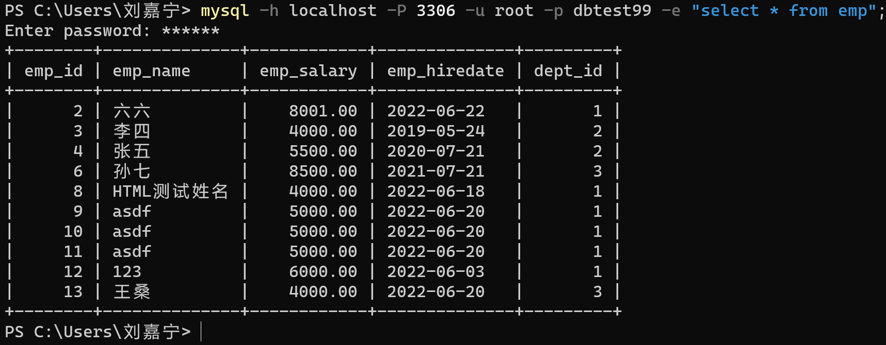

**创建用户**：

```sql
CREATE USER 用户名 [IDENTIFIED BY '密码'][,用户名 [IDENTIFIED BY '密码']];
```

- 创建用户基础写法 `create user zhangsan identified by '123456'`

    - 此时默认 host 为 '%'

- 创建用户写法举例 `create user 'kangshifu'@'localhost' identified by '123456';`

    - 指定用户 kangshifu 可使用的 host 为 localhost，在 mysql 数据库的 user 表中，由 host 和 user 共同组成复合主键

    

**修改用户**：

```sql
UPDATE mysql.user SET USER='lisi' WHERE USER='zhangsan'; 
FLUSH PRIVILEGES;
```

- 修改用户名是对 user 表进行修改，开发中很少这么做
    - 修改数据 `update user set user = 'lisi' where user = 'zhangsan';` 
    - 刷新权限 `flush privileges;`


**删除用户**：

1. 使用 DROP 方式删除【推荐】

```sql
DROP USER user[,user]…;
```


2. 使用 DELETE 方式删除

- 使用 delete 方式删除会有残留信息保留

**修改自身密码**：

- 在 MySQL 8 中移除了 PASSWORD( ) 函数，因此无法使用 update 语句对密码进行修改

```sql
# 修改当前用户的密码：（MySQL5.7测试有效） 
SET PASSWORD = PASSWORD('新密码');
```

1. 使用 alter user 命令修改自身密码

```sql
ALTER USER USER() IDENTIFIED BY '新密码';
```

2. 使用 set 命令修改自身密码

```sql
SET PASSWORD = '新密码';
```


**修改其它用户密码**：

- 使用 update 修改其它用户密码【不推荐】

```sql
# 在 MySQL 5.7 及之前可用
UPDATE MySQL.user SET authentication_string=PASSWORD("123456") 
WHERE User = "username" AND Host = "hostname";
```

1. 使用 ALTER 语句来修改普通用户的密码 可以使用 ALTER USER 语句来修改普通用户的密码

```sql
ALTER USER user [IDENTIFIED BY '新密码'] [,user[IDENTIFIED BY '新密码']]…;
```

2. 使用 SET 命令来修改普通用户的密码 使用 root 用户登录到 MySQL 服务器后，可以使用 SET 语句来修改普通用户的密码

```sql
SET PASSWORD FOR 'username'@'hostname' = '新密码';
```

**密码过期策略、密码重用策略**：

- 设置全局密码过期策略

    - 方式①：使用SQL语句更改该变量的值并持久化 

    ```sql
    SET PERSIST default_password_lifetime = 180; # 建立全局策略，设置密码每隔180天过期 
    ```

    - 方式②：配置文件my.cnf中进行维护

    ```ini
    [mysqld] 
    default_password_lifetime=180 #建立全局策略，设置密码每隔180天过期
    ```

- 单独设置密码过去策略

    - 通过 PASSWORD EXPIRE 实现单独设置密码过期策略

    ```sql
    #设置kangshifu账号密码每90天过期： 
    CREATE USER 'kangshifu'@'localhost' PASSWORD EXPIRE INTERVAL 90 DAY; 
    ALTER USER 'kangshifu'@'localhost' PASSWORD EXPIRE INTERVAL 90 DAY;
    
    #设置密码永不过期： 
    CREATE USER 'kangshifu'@'localhost' PASSWORD EXPIRE NEVER; 
    ALTER USER 'kangshifu'@'localhost' PASSWORD EXPIRE NEVER;
    
    #延用全局密码过期策略： 
    CREATE USER 'kangshifu'@'localhost' PASSWORD EXPIRE DEFAULT; 
    ALTER USER 'kangshifu'@'localhost' PASSWORD EXPIRE DEFAULT;
    ```

- 设置全局密码重用策略

    - 方式①：使用SQL

    ```sql
    SET PERSIST password_history = 6; #设置不能选择最近使用过的6个密码 
    SET PERSIST password_reuse_interval = 365; #设置不能选择最近一年内的密码
    ```

    - 方式②：my.cnf配置文件

    ```ini
    [mysqld] 
    password_history=6 
    password_reuse_interval=365
    ```

- 单独设置密码重用策略

    ```sql
    #不能使用最近5个密码： 
    CREATE USER 'kangshifu'@'localhost' PASSWORD HISTORY 5; 
    ALTER USER 'kangshifu'@'localhost' PASSWORD HISTORY 5;
    
    #不能使用最近365天内的密码： 
    CREATE USER 'kangshifu'@'localhost' PASSWORD REUSE INTERVAL 365 DAY; 
    ALTER USER 'kangshifu'@'localhost' PASSWORD REUSE INTERVAL 365 DAY;
    
    #既不能使用最近5个密码，也不能使用365天内的密码 
    CREATE USER 'kangshifu'@'localhost' 
    PASSWORD HISTORY 5 
    PASSWORD REUSE INTERVAL 365 DAY;
    
    ALTER USER 'kangshifu'@'localhost'
    PASSWORD HISTORY 5 
    PASSWORD REUSE INTERVAL 365 DAY;
    ```


### 权限管理

```sql
# 查看 MySQL 都有哪些权限
show privileges;
```

- 权限分类及常用的权限


1. `CREATE` 和 `DROP` 权限，允许创建新的数据库和表，或删除（移掉）已有的数据库和表

2. `SELECT` 、 `INSERT` 、 `UPDATE` 和 `DELETE` 权限，允许在一个数据库现有的表上实施操作

3. `SELECT` 权限，只有在它们真正从一个表中检索行时才被用到

4. `INDEX` 权限，允许创建或删除索引，适用于已有的表。如果具有某个表的 CREATE 权限，就可以在 CREATE TABLE 语句中包括索引定义

5. `ALTER` 权限，允许使用 ALTER TABLE 来更改表的结构和重新命名表

6. `CREATE ROUTINE` 权限，允许创建保存的程序（函数和程序），更改和删除保存的程序， `EXECUTE` 权限允许执行保存的程序

7. `GRANT` 权限，允许授权给其他用户，可用于数据库、表和保存的程序

8. `FILE` 权限，允许使用 LOAD DATA INFILE 和 SELECT ... INTO OUTFILE 语句读或写服务器上的文件，任何被授予 FILE 权限的用户都能读或写 MySQL 服务器上的任何文件（说明用户可以读任何数据库目录下的文件，因为服务器可以访问这些文件）

#### 权限的查看、赋予和撤销

**授予权限**：

- 可以 `赋予角色权限后将角色赋予给用户`，也可以 `直接赋予用户权限`
- 直接赋予权限命令：

```sql
GRANT 权限1,权限2,…权限n ON 数据库名称.表名称 TO 用户名@用户地址 [IDENTIFIED BY ‘密码口令’];
```

- 举例：授予 zhangsan 查询 dbtest99 数据库中 emp 表的权限 `grant select on dbtest99.emp to 'zhangsan'@'%';`

    

    - 当 zhangsan 要 update 数据时，会提示权限不足

    

    - **再次赋予权限** 时，相当于添加权限【并集】

    

    - **赋予所有权限** `grant all privileges on *.* to zhangsan;`

    

> 授予权限的 **横向分组** 与 **纵向分组**
>
> - 所谓横向的分组，就是指用户可以接触到的数据的范围，比如可以看到哪些表的数据； 
> - 所谓纵向的分组，就是指用户对接触到的数据能访问到什么程度，比如能看、能改，甚至是 删除。

**查看权限**：

- 查看当前用户权限

```sql
SHOW GRANTS; 
# 或 
SHOW GRANTS FOR CURRENT_USER; 
# 或 
SHOW GRANTS FOR CURRENT_USER();
```

- 查看某用户的全局权限 

```sql
SHOW GRANTS FOR 'user'@'主机地址';
```

**收回权限**：

- 回收权限命令

```sql
REVOKE 权限1,权限2,…权限n ON 数据库名称.表名称 FROM 用户名@用户地址;
```

- 举例：回收 zhangsan 用户的所有权限 `REVOKE ALL PRIVILEGES ON *.* FROM zhangsan@'%';`

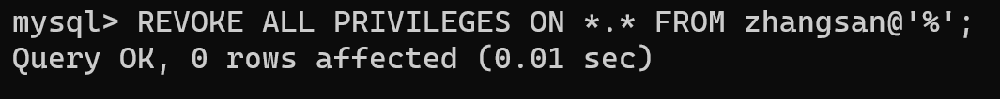

- 【注意】在将用户账户从user表删除之前，**应该收回相应用户的所有权限**

> 开发中尽可能不要使用 root 超级用户来访问数据库，因为 root 的密码放在代码中不安全，一旦泄漏，数据库将完全失去保护


#### 权限表

- MySQL 通过权限表来**控制用户对数据库的访问**，在 `mysql` 数据库中由 user、db 表和 table_priv、column_priv、proc_priv 表来记录权限信息
- user 表字段解释


- db 表字段解释
    - 通过 host、db、user 组成复合主键，体现用户对某一数据库的相关操作权限
    - `Create_routine_priv` 和 `Alter_routine_priv` 字段决定用户是否具有创建和修改存储过程的权限


- tables_priv 表和 columns_priv 表

    - tables_priv 表用来 `对表设置操作权限`
    - columns_priv 表用来对表的 `某一列设置权限`

    

- procs_priv表

    - procs_priv 表可以对 `存储过程和存储函数设置操作权限` 

    

> **连接核实阶段**：
>
> - 通过 user 表中的 host、user 和 authentication_string 这 3 个字段匹配客户端提供信息
>
> **请求核实阶段**：
>
> - 根据用户的操作，按照 user - db - tables_priv - columns_priv 检查确认权限

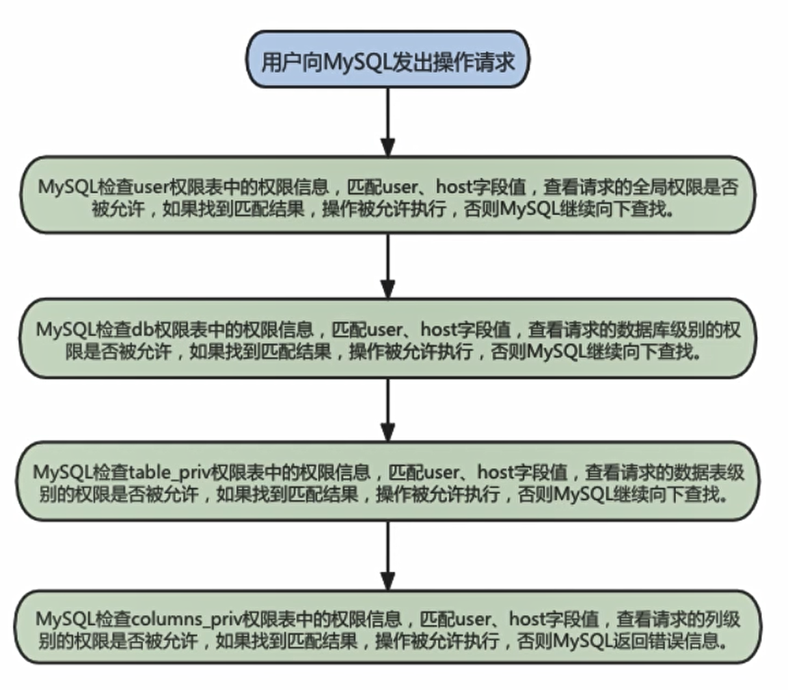

#### 角色

- 角色，就相当于权限的集合

**创建角色**：

- 创建角色命令

```sql
CREATE ROLE 'role_name'[@'host_name'] [,'role_name'[@'host_name']]...
```


**给角色赋予权限**：

- 给角色赋予权限命令

```sql
GRANT 权限1,权限2,…权限n ON 数据库名称.表名称 TO '角色名'[@'host_name'];
```


**查看角色的权限**：

- 查看指定角色权限命令

```sql
SHOW GRANTS FOR '角色名';
```

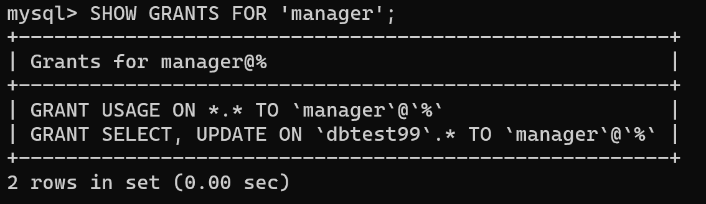

**回收角色的权限**：

- 回收角色的权限命令

```sql
REVOKE privileges ON tablename FROM 'rolename';
```


**删除角色**：

- 删除角色命令

```sql
DROP ROLE '角色名';
```

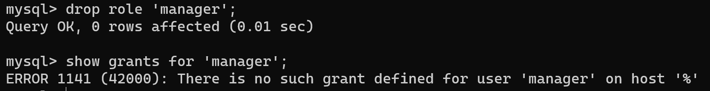

**为用户赋予角色**：

- 为用户赋予角色命令

```sql
GRANT role [,role2,...] TO user [,user2,...];
```


**激活角色**：

- 为用户赋予角色后需要激活角色，用户重新登录才真正拥有角色
- 激活角色命令【方式一】

```sql
SET DEFAULT ROLE ALL TO '用户名'@'host';
```


- 激活角色命令【方式二】

```sql
# 对所有角色永久激活
SET GLOBAL activate_all_roles_on_login = ON;
```

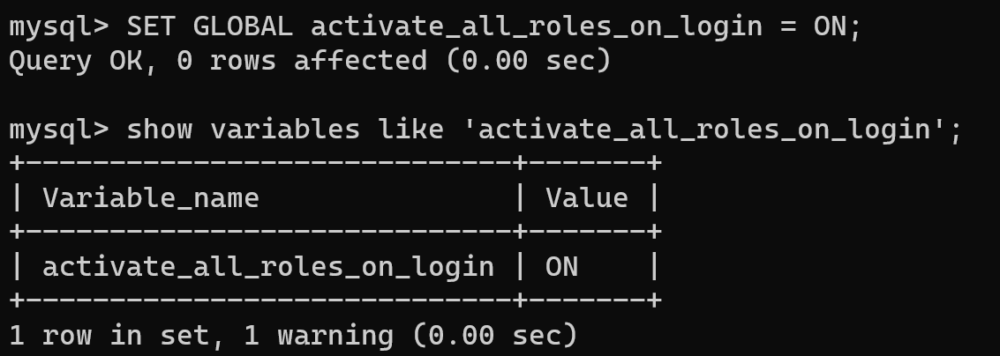

> **查看当前用户的角色**
>
> ```sql
> SELECT CURRENT_ROLE();
> ```


**撤销用户的角色**：

- 赊销用户角色命令

```sql
REVOKE 角色名 FROM 用户;
```

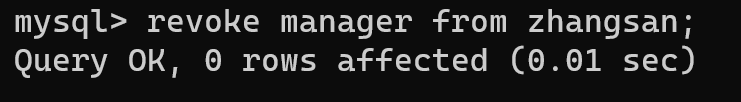

**设置强制角色**：

- 强制角色相当于为所有用户设置默认角色
- 服务启动前设置 my.cnf【方式一】

```ini
[mysqld]
mandatory_roles='role1,role2@localhost,r3@%.atguigu.com'
```

- 运行时设置【方式二】

```sql
SET PERSIST mandatory_roles = 'role1,role2@localhost,r3@%.example.com'; #系统重启后仍然 有效 
SET GLOBAL mandatory_roles = 'role1,role2@localhost,r3@%.example.com'; #系统重启后失效
```


## 配置文件与系统变量

### 配置文件

- 配置文件的启动选项被分为很多个组，每个组都是由 [ ] 括起来的组名开头
- MySQL 8 默认的 my.cnf 配置文件


- 类似的组名可以有很多
    - `[server]` 组名下边的启动选项将作用于**所有的服务器程序**
    - `[client]` 组名下边的启动选项将作用于**所有的客户端程序**

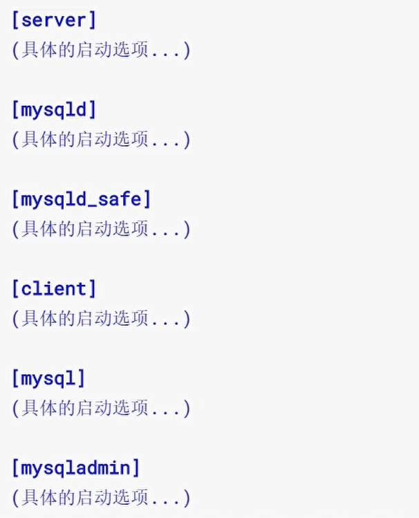

- 在指定对应的指令时会启用对应的标签组
    - 例如：在服务器中设置的启动选项就需要写在 `[mysqld]` 或 `[server]` 标签组下

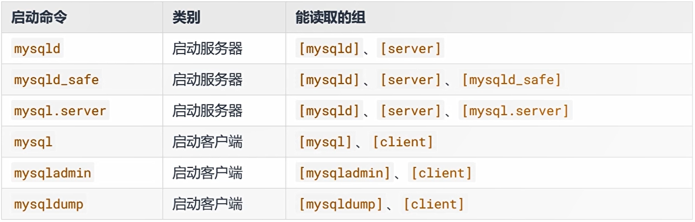

- 可以指定标签组执行的 MySQL 版本
    - 例如：`[mysqld-5.7]` 的标签组中的内容就只能在 MySQL 5.7 的服务器版本中被执行

- 当配置出现矛盾时，以下方的配置为准

    ```ini
    [server]
    default-storage-engine = InnoDB
    
    [mysqld]
    # 当配置出现矛盾时，以下行为准
    default-storage-engine = MyISAM 
    ```

- 当启动命令与 my.cnf 中内容出现矛盾时，以启动命令后方的配置为准

    ```ini
    [server]
    default-storage-engine = InnoDB
    ```

    ```bash
    # 启动命令比配置文件的优先级高
    mysql.server start --default-storage-engine=MyISAM
    ```


### 系统变量

- **在 my.cnf 中的配置和在启动命令中写的都是系统变量**
- 设置系统变量

```sql
set [global|session] 系统变量名 = 系统变量值;
```

- 查看系统变量

```sql
show [global|session] variables [like 匹配的模式];
```

> 这里的内容仅需了解 **在 my.cnf 中的配置 和 在启动命令后方写的 都是系统变量** 即可
>
> 如果需要使用可以查看：[wzblog](https://new-wangz.github.io/2022/04/22/%E7%AC%AC16%E7%AB%A0-%E5%8F%98%E9%87%8F%E3%80%81%E6%B5%81%E7%A8%8B%E6%8E%A7%E5%88%B6%E4%B8%8E%E6%B8%B8%E6%A0%87/)


## 逻辑架构

- MySQL 是典型的 `Client/Server` 架构，客户端进程向服务端进程发送一段文本 ( SQL 语句 ) ，服务端进程处理后再向客户端进程返回一段文本 ( 处理结果 )


- 逻辑架构展开说明


### 连接层

- 客户端在访问 MySQL 服务器前，会先经过三次握手建立 `TCP` 连接，后 MySQL 服务器对 TCP 传输过来的账号密码进行验证，身份验证、权限获取
    1. 验证用户名密码，错误提示 Access denied for user 结束客户端程序
    2. 查询出账号拥有的权限并与连接关联，之后的权限判断都依照此时读到的权限

- 在连接池中创建一个 TCP 的长连接，后会在线程池中创建线程处理具体操作


### 服务层

- 服务器在该层会解析查询并创建对应的解析树，完成相应的优化

**SQL Interface：SQL 接口**

- 接受用户的 SQL 命令，并返回用户需要查询的结果
- 例如：SELECT ... FROM 就是调用的 SQL Interface

**Parser：解析器**

- 对 SQL 语句进行语法分析、语义分析，并生成 `语法树` 
- 如果 SQL 语句的关键字拼写错误或语义不合理，在此时就会报错

**Optimizer：查询优化器**

- 确定 SQL 语句的执行路径，生成 `执行计划` 
- 指定使用的索引，选取 `选取-投影-连接` 策略进行查询
    - `选取` 根据 where 语句进行选取，而不是将表全部查询出来再过滤
    - `投影` 根据 select 后的字段进行属性投影，而不是将全部字段都查询出来再过滤
    - `连接` 将这两个查询条件连接起来生成最终的查询结果

**Caches & Buffers：查询缓存组件**

- 内部维持着一些 Cache 和 Buffer，比如 Query Cache 用来缓存一条 SELECT 语句的执行结果
- 这个缓存机制是由一系列小缓存组成的。比如表缓存，记录缓存，key 缓存，权限缓存等
- 查询缓存可以在不同客户端之间共享，由于命中率较低在 MySQL 8 中被删除


### 引擎层

- 是插件式的存储引擎，负责 MySQL 中数据存储和提取，对物理服务器级别的底层数据执行操作

- 查看 MySQL 默认支持的引擎命令 `show engines;` 


### 存储层

- 实打实的在文件系统上存储文件


### MySQL 的三层架构

> 1. 连接层：客户端和服务器端建立连接，客户端发送 SQL 至服务器端
>2. SQL 层（服务层）：对 SQL 语句进行查询处理；与数据库文件的存储方式无关
> 3. 存储引擎层：与数据库文件打交道，负责数据的存储和读取
> 
> 


## SQL 的执行流程


### **1.查询缓存**

- 查询 SQL 与查询结果可能是以键值对的形式存储在内存中的。如果 SQL 语句命中了 key 那么直接返回 value，如果没有命中则继续执行并将执行结果存储在查询缓存中
- 由于两个查询请求在任何字符上的不同（例如：空格、注释、 大小写），都会导致缓存不会命中。因此 MySQL 的 查询缓存命中率不高
- 在使用到一些特殊的函数如 `now()` 时，查询缓存就不应该开启。在执行 INSERT、UPDATE、 DELETE、TRUNCATE TABLE、 ALTER TABLE、DROPTABLE 或 DROP DATABASE 语句时缓存失效。对于更新压力大的数据库来说，查询缓存的命中率较低
- 一般推荐在静态表中开启查询缓存，即常常查询但不常更新的表。在 MySQL 5.7 中开启查询缓存配置 my.cnf 文件：

```ini
# query_cache_type 有 3 个值 0 代表关闭查询缓存 OFF, 1 代表开启 ON , 2 (DEMAND) 按需使用
query_cache_type = 2
```

```sql
# 在使用 SQL_CACHE 关键字的查询中，才会开启查询缓存
select SQL_CACHE * from test where ID = 5;

# 查看是否开启了查询缓存
show global variables like "%query_cache_type%";
# 查看查询缓存的命中率
show status like '%Qcache%';
```


### **2.解析器**

- 对 SQL 进行语法分析、语义分析
- 首先对 SQL 进行 **`词法分析` **识别关键词和一些字符串所对应的是什么
- 然后对 SQL 进行 **`语法分析`** 根据语法规则判断语句是否满足 MySQL 语法
- 如果词法分析和语法分析均通过，会生成一个语法树

```sql
SELECT username, ismale FROM userinfo WHERE age > 20 AND level > 5 AND 1 = 1;
```

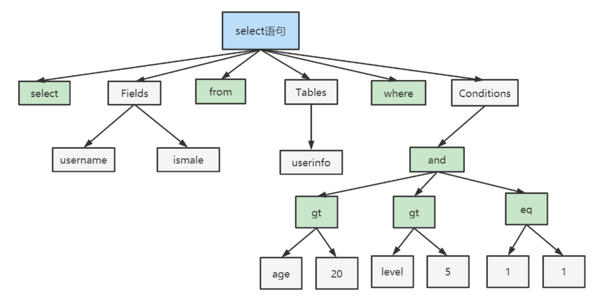


### **3.优化器**

- 确定 SQL 的执行计划并**交出执行计划**，比如是根据全表检索还是根据索引检索等

- 在查询优化中主要分为 `逻辑优化阶段` 和 `物理优化阶段 ` 。在索引章节有补充
- 例如在查询语句中 where 后方有两个条件，那么先后执行哪个条件的顺序是优化器所做的事


### **4.执行器**

- 先判断是否具有执行的权限，再调用存储引擎 API 进行执行

> 例如在执行 `select SQL_CACHE * from test where ID = 1;` 语句：
>
> - 调用 InnoDB 引擎接口取这个表的第一行，判断 ID 值是不是 1，如果不是则跳过，如果是则将这行存在结果集中
>
> - **调用引擎接口**取 “下一行”，重复相同的判断逻辑，直到取到这个表的最后一行。
> - 执行器将上述遍历过程中所有满足条件的行组成的记录集作为结果集返回给客户端。


**MySQL 执行顺序**：


### MySQL 8 执行流程 <a id='profile'> </a>

1. ==开启 Profiling==：让 MySQL 收集 SQL 在执行过程中所使用的资源情况

```sql
# 查看是否开启了 Profiling, 0 为未开启
select @@profiling; 
# 或
show variables like 'profiling';
```


```sql
# 开启 Profiling
set profiling = 1;
```

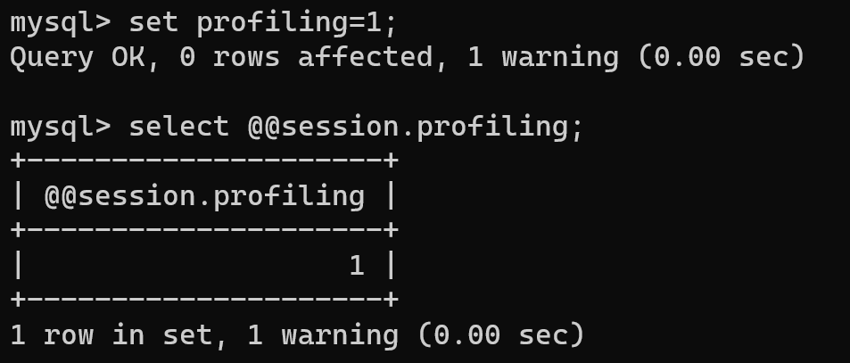

2. 查看当前会话最近几次的查询 Profiles

```sql
show profiles;
```

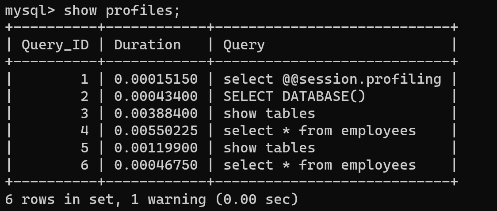

3. 查看指定的查询语句的执行计划

```sql
# 查看最近一次查询的查询计划
show profile;
# 查看指定 Query_ID 的查询计划
show profile for query 6;
```

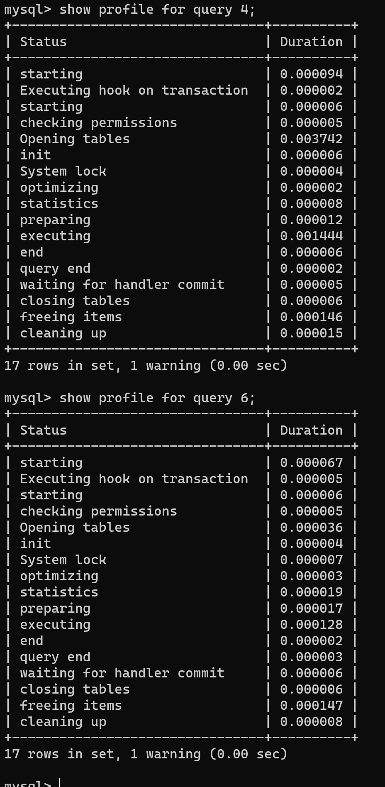


### MySQL 5.7 执行流程

1. 开启查询缓存 query_cache 在 /etc/my.cnf 中新增一行

```ini
query_cache_type = 1
```

2. 重启 MySQL 服务

```bash
systemctl restart mysqld
```

3. 开启执行计划，查看执行计划：同 MySQL 8

4. 查看 Profiles

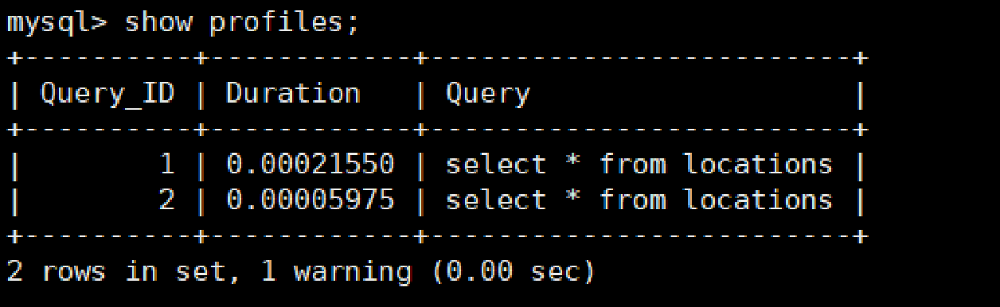

5. 查看 Profile

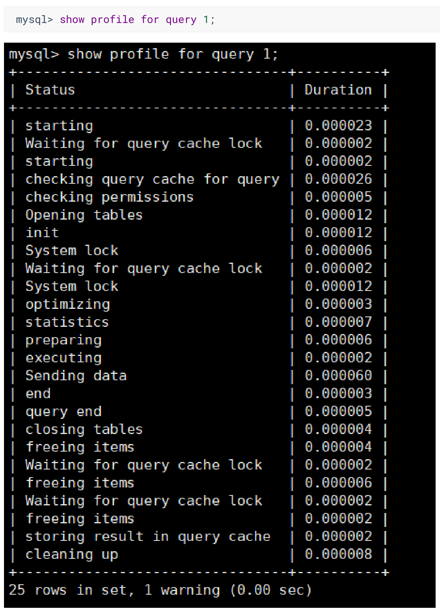


> 可以查看指定 type 的执行计划

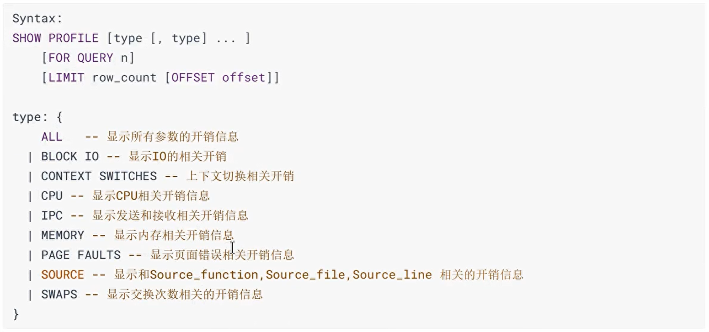

例如：查看 cpu 和 io 有关的执行情况

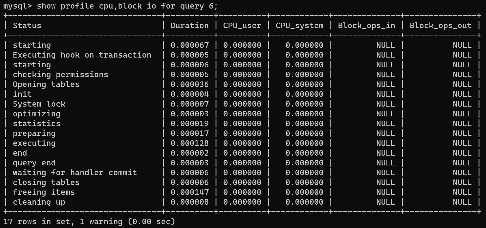

> 


### Oracle 中的执行流程

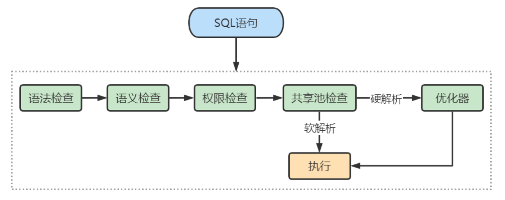

- 语法检查：检查 SQL 拼写，错误报语法错误
- 语义检查：检查访问的对象是否存在
- 权限检查：检查用户是否具有相应的权限
- 共享池检查：缓存 SQL 语句和该语句的执行计划
    - 对 SQL 语句进行 hash 运算，如果在 `库缓存(Library Cache)` 中找到则直接进入 `执行器`【软解析】
    - 如果没有 hash 到，则创建解析树进行解析，进入优化器生成执行计划执行【硬解析】

**Oracle 数据库架构图简图**


### 数据库缓冲池

- InnoDB 将 `数据页` 作为单位存储数据，每个数据页占 16KB
- DBMS 会占用内存作为缓冲池，需要把在磁盘上的页缓存到内存中的 Buffer Pool 之后才可以访问，从而减少与磁盘直接进行 I/O 的时间


#### 缓冲原则

- 根据 “ `位置 * 频次` ” 这个原则，优先对使用频次高的热数据进行加载 
- 在缓存空间允许的前提下，会提将把查询结果或将查询结果周围的数据放到缓冲池中【预读特性】

**缓冲池在 MySQL 中的结构和作用**：

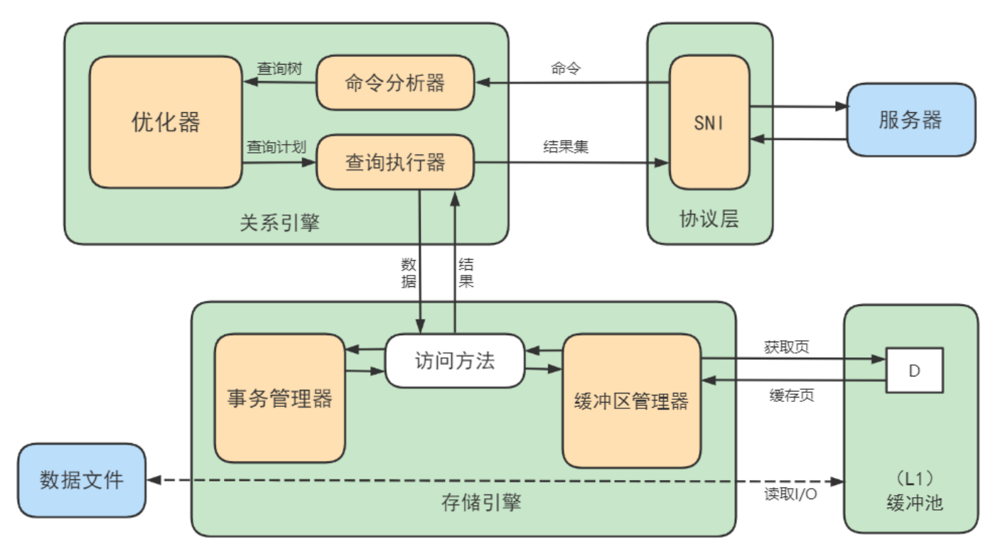

- 在数据更新后不会立即更新磁盘数据，会按照一定的时间策略对本地磁盘进行更新
    - 当 Buffer Pool 未对磁盘更新数据时宕机怎么办？
    - 答：Redo Log & Undo Log（在事务章节会补充）

**查看缓冲池的大小**：

```sql
# 查看 InnoDB 缓冲池大小
show variables like 'innodb_buffer_pool_size';

# 查看 MyISAM 缓冲池大小
show variables like 'key_buffer_size';
```


**设置缓冲池大小**：

- 通过变量设置缓冲池大小为 256MB : 256 * 1024 * 1024 = `268435456` 

```sql
set global innodb_buffer_pool_size = 268435456;
```

- 通过配置 my.cnf 设置缓冲池大小

```ini
[server] 
innodb_buffer_pool_size = 268435456
```

#### Buffer Pool 实例个数

- 将缓冲池 `拆分` 成若干个小 Buffer Pool ，若 Buffer Pool 大小设置为 1GB 实例个数设置为 2，则每个实例占 512 MB
- 当多个线程同时连接数据库时，让其分别访问各自的 Buffer Pool 避免为 Buffer Pool 加锁影响性能
- 通过配置 my.cnf 设置 Buffer Pool 实例个数

```ini
[server] 
innodb_buffer_pool_instances = 2
```

> - Buffer Pool 实例个数并不是越多越好，管理各个 Buffer Pool 也是需要性能开销的，在缓冲池内存大小 > 1GB 时才有效


## 存储引擎

- 存储引擎实际上就是指表的类型，之前叫表处理器
- 用于接受上层传下来的指令，对表中的数据进行读取和写入的操作


### 存储引擎的查看与修改

**查看支持的存储引擎**：

```sql
show engines;
```


**查看系统默认的存储引擎**：

```sql
show variables like '%storage_engine%'; 
#或 
SELECT @@default_storage_engine;
```


**修改默认的存储引擎**：

- 通过设置变量设置默认存储引擎

```sql
SET DEFAULT_STORAGE_ENGINE = MyISAM;
```

- 通过修改 my.cnf 设置默认存储引擎

```ini
default-storage-engine = MyISAM

# 重启服务 
systemctl restart mysqld.service
```

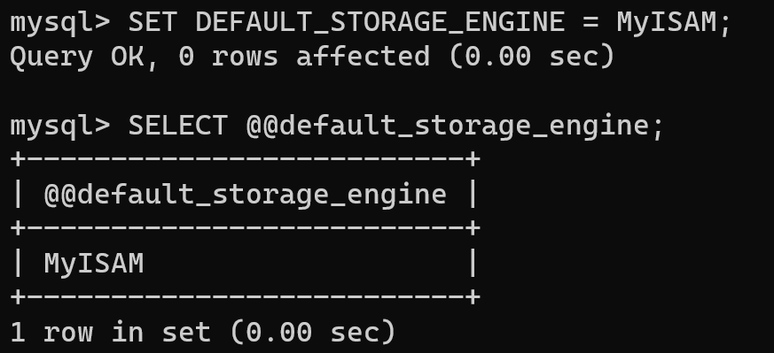

**在创建表时指明存储引擎**：

```sql
CREATE TABLE 表名( 
    建表语句;
) ENGINE = 存储引擎名称;
```

**修改表的存储引擎**：

```sql
ALTER TABLE 表名 ENGINE = 存储引擎名称;
```


### 存储引擎介绍

#### InnoDB 引擎

- 具备 `外键` 支持功能的 `事务` 存储引擎，是为处理巨大数据量的最大性能设计
- 从 3.23.34a 版本开始包含 InnoDB 引擎，5.5 即之后的版本默认采用 InnoDB
- 优点：
    - 支持外键
    - 支持事务：事务的提交与回滚。若服务器崩溃，可以自动的恢复已提交的事务，撤销未提交的事务不需要额外的操作
    - 频繁的增加或查询操作推荐 MyISAM，频繁的更新或删除操作推荐 InnoDB
    - 相比 MyISAM 只支持表级锁，InnoDB 还支持行级锁
- 缺点：
    - 相比 MyISAM，InnoDB 写的处理效率差一点
    - MyISAM 只缓存索引，InnoDB 还会缓存数据，所以对内存要求比较高

#### MyISAM 引擎

- 提供了大量的特性，包括全文索引、压缩、空间函数(GIS)等
- 是 MySQL 5.5 之前的默认存储引擎
- 优点：
    - 针对于增加和查询操作，MyISAM 的速度更快
    - 有常量存储数据统计信息，`count(*)` 的效率高
- 缺点：
    - 不支持事务、外键、行级锁
    - 适合数据量小的场景使用，崩溃后无法安全恢复

#### Archive 引擎

- archive (归档) 主要设计用于数据存档，仅支持插入和查询两种功能
- 在 MySQL 5.5 版本后支持索引
- 支持 zlib 压缩库，相同数据量文件体积比 MyISAM 小 75%
- 数据文件后缀名为 .ARZ ，支持行级锁

#### Blackhole 引擎

- 丢弃写操作，读操作会返回空内容
- 会记录日志，不推荐使用

#### CSV 引擎

- 存储数据时，以逗号分隔各个数据项。不支持 null 数据
- 数据文件后缀名为 .CSM .CSV 可以使用 Excel 打开编辑

#### Memory 引擎

- 置于内存的表，表数据存在内存中，表结构存在 .frm 文件中
- 要求数据是长度不变的格式，BLOB、TEXT类型的数据不可用
- 查询速度比 MyISAM 快一个数量级，需要设置限制表的大小
- 同时支持 hash 索引【默认】和 B+ 树索引
- 通常在数据量小访问频繁时使用，存储临时数据即时使用时使用

#### Federated 引擎

- 是一个访问其它 MySQL 数据库的代理，提供跨服务器的灵活性
- 问题较多，默认被禁用

#### Merge引擎

- 管理多个 MyISAM 表构成的表集合

#### NDB引擎

- MySQL 集群专用存储引擎
- 也叫做 NDB Cluster 存储引擎，主要用于 MySQL Cluster 分布式集群环境


### 常见存储引擎对比

| 特点             | MyISAM                                                   | InnoDB                                                       | MEMORY | MERGE | NDB  |
| ---------------- | -------------------------------------------------------- | ------------------------------------------------------------ | ------ | ----- | ---- |
| 存储限制         | 有                                                       | 64TB                                                         | 有     | 没有  | 有   |
| 事务安全         |                                                          | 支持                                                         |        |       |      |
| 锁机制           | 表锁，即使操作一条记录也会锁住整个表，不适合高并发的操作 | 表锁，行锁：操作时只锁某一行，不对其它行有影响，适合高并发的操作 | 表锁   | 表锁  | 行锁 |
| B树索引          | 支持                                                     | 支持                                                         | 支持   | 支持  | 支持 |
| 哈希索引         |                                                          |                                                              | 支持   |       | 支持 |
| 全文索引         | 支持                                                     |                                                              |        |       |      |
| 集群索引         |                                                          | 支持                                                         |        |       |      |
| 数据缓存         |                                                          | 支持                                                         | 支持   |       | 支持 |
| 索引缓存         | 只缓存索引，不缓存真实数据                               | 不仅缓存索引还要缓存真实数据，对内存要求较高，而且内存大小对性能有决定性的影响 | 支持   | 支持  | 支持 |
| 数据可压缩       | 支持                                                     |                                                              |        |       |      |
| 空间使用         | 低                                                       | 高                                                           | N/A    | 低    | 低   |
| 内存使用         | 低                                                       | 高                                                           | 中等   | 低    | 高   |
| 批量 插入 的速度 | 高                                                       | 低                                                           | 高     | 高    | 高   |
| 支持外键         |                                                          | 支持                                                         |        |       |      |


### MyISAM 与 InnoDB对比

| 对比项         | MyISAM                                                   | InnoDB                                                       |
| -------------- | -------------------------------------------------------- | ------------------------------------------------------------ |
| 外键           | 不支持                                                   | 支持                                                         |
| 事务           | 不支持                                                   | 支持                                                         |
| 行表锁         | 表锁，即使操作一条记录也会锁住整个表，不适合高并发的操作 | 行锁，操作时只锁某一行，不对其它行有影响，适合高并发的操作   |
| 缓存           | 只缓存索引，不缓存真实数据                               | 不仅缓存索引还要缓存真实数据，对内存要求较高，而且内存大小对性能有决定性的影响 |
| 自带系统表使用 | Y                                                        | N                                                            |
| 关注点         | 性能：节省资源、消耗少、简单业务                         | 事务：并发写、事务、更大资源                                 |
| 默认安装       | Y                                                        | Y                                                            |
| 默认使用       | N                                                        | Y                                                            |


### 课外补充

**1、InnoDB 表的优势** 

InnoDB 存储引擎在实际应用中拥有诸多优势，比如操作便利、提高了数据库的性能、维护成本低等。如果由于硬件或软件的原因导致服务器崩溃，那么在重启服务器之后不需要进行额外的操作。InnoDB 崩溃恢复功能自动将之前提交的内容定型，然后撤销没有提交的进程，重启之后继续从崩溃点开始执行。 

InnoDB 存储引擎在主内存中维护缓冲池，高频率使用的数据将在内存中直接被处理。这种缓存方式应用于多种信息，加速了处理进程。

在专用服务器上，物理内存中高达80%的部分被应用于缓冲池。如果需要将数据插入不同的表中，可以设置外键加强数据的完整性。更新或者删除数据，关联数据将会被自动更新或删除。如果试图将数据插入从表，但在主表中没有对应的数据，插入的数据将被自动移除。如果磁盘或内存中的数据出现崩溃，在使用脏数据之前，校验和机制会发出警告。当每个表的主键都设置合理时，与这些列有关的操作会被自动优化。插入、更新和删除操作通过做改变缓冲自动机制进行优化。 `InnoDB 不仅支持当前读写，也会缓冲改变的数据到数据流磁盘` 。

InnoDB 的性能优势不只存在于长时运行查询的大型表。在同一列多次被查询时，自适应哈希索引会提高查询的速度。使用 InnoDB 可以压缩表和相关的索引，可以 `在不影响性能和可用性的情况下创建或删除索引` 。对于大型文本和 BLOB 数据，使用动态行形式，这种存储布局更高效。通过查询 INFORMATION_SCHEMA 库中的表可以监控存储引擎的内部工作。在同一个语句中，InnoDB 表可以与其他存储引擎表混用。即使有些操作系统限制文件大小为 2GB，InnoDB 仍然可以处理。 `当处理大数据量时,InnoDB 兼顾 CPU,以达到最大性能` 。

**2、InnoDB 和 ACID 模型**
ACID 模型是一系列数据库设计规则，这些规则着重强调可靠性，而可靠性对于商业数据和任务关键型应用非常重要。MySQL 包含类似InnoDB 存储引擎的组件，与 ACID 模型紧密相连，这样出现意外时，数据不会崩溃，结果不会失真。如果依赖 ACID 模型，可以不使用一致性检查和崩溃恢复机制。如果拥有额外的软件保护，极可靠的硬件或者应用可以容忍一小部分的数据丢失和不一致，可以将 MySQL 设置调整为只依赖部分 ACID 特性，以达到更高的性能。下面讲解 InnoDB 存储引擎与 ACID 模型相同作用的四个方面。

1. `原子方面` ACID 的原子方面主要涉及 InnoDB 事务，与 MySQL 相关的特性主要包括：
  - 自动提交设置。
  - COMMIT 语句。
  - ROLLBACK 语句。
  - 操作 INFORMATION_SCHEMA 库中的表数据。
2. `一致性方面` ACID 模型的一致性主要涉及保护数据不崩溃的内部 InnoDB 处理过程，与 MySQL 相关的特性主要包括：
  - InnoDB 双写缓存。
  - InnoDB 崩溃恢复。
3. `隔离方面` 隔离是应用于事务的级别，与 MySQL 相关的特性主要包括：
  - 自动提交设置。
  - SET ISOLATION LEVEL 语句。
  - InnoDB 锁的低级别信息。
4. `耐久性方面` ACID 模型的耐久性主要涉及与硬件配置相互影响的 MySQL 软件特性。由于硬件复杂多样化，耐久性方面没有具体的规则可循。与 MySQL 相关的特性有：
  - InnoDB 双写缓存，通过 innodb_doublewrite 配置项配置。
  - 配置项 innodb_flush_log_at_trx_commit。
  - 配置项 sync_binlog。
  - 配置项 innodb_file_per_table。
  - 存储设备的写入缓存。
  - 存储设备的备用电池缓存。
  - 运行 MySQL 的操作系统。
  - 持续的电力供应。
  - 备份策略。
  - 对分布式或托管的应用，最主要的在于硬件设备的地点以及网络情况。

**3、InnoDB 架构** 

1. `缓冲池` 缓冲池是主内存中的一部分空间，用来缓存已使用的表和索引数据。缓冲池使得经常被使用的数据能够直接在内存中获得，从而提高速度。 
2. `更改缓存` 更改缓存是一个特殊的数据结构，当受影响的索引页不在缓存中时，更改缓存会缓存辅助索引页的更改。索引页被其他读取操作时会加载到缓存池，缓存的更改内容就会被合并。不同于集群索引，辅助索引并非独一无二的。当系统大部分闲置时，清除操作会定期运行，将更新的索引页刷入磁盘。更新缓存合并期间，可能会大大降低查询的性能。在内存中，更新缓存占用一部分 InnoDB 缓冲池。在磁盘中，更新缓存是系统表空间的一部分。更新缓存的数据类型由 innodb_change_buffering 配置项管理。 
3. `自适应哈希索引` 自适应哈希索引将负载和足够的内存结合起来，使得 InnoDB 像内存数据库一样运行， 不需要降低事务上的性能或可靠性。这个特性通过 innodb_adaptive_hash_index 选项配置，或者通过 -skip-innodb_adaptive_hash_index 命令行在服务启动时关闭。 
4. `重做日志缓存` 重做日志缓存存放要放入重做日志的数据。重做日志缓存大小通过 innodb_log_buffer_size 配置项配置。重做日志缓存会定期地将日志文件刷入磁盘。大型的重做日志缓存使得大型事务能够正常运行而不需要写入磁盘。

5. `系统表空间` 系统表空间包括 InnoDB 数据字典、双写缓存、更新缓存和撤销日志，同时也包括表和索引 数据。多表共享，系统表空间被视为共享表空间。 
6. `双写缓存` 双写缓存位于系统表空间中，用于写入从缓存池刷新的数据页。只有在刷新并写入双写缓存后，InnoDB 才会将数据页写入合适的位置。 
7. `撤销日志` 撤销日志是一系列与事务相关的撤销记录的集合，包含如何撤销事务最近的更改。如果其他事务要查询原始数据，可以从撤销日志记录中追溯未更改的数据。撤销日志存在于撤销日志片段中，这些片段包含于回滚片段中。 
8. `每个表一个文件的表空间` 每个表一个文件的表空间是指每个单独的表空间创建在自身的数据文件中， 而不是系统表空间中。这个功能通过 innodb_file_per_table 配置项开启。每个表空间由一个单独的 .ibd 数据文件代表，该文件默认被创建在数据库目录中。
9. `通用表空间` 使用 CREATE TABLESPACE 语法创建共享的 InnoDB 表空间。通用表空间可以创建在 MySQL 数据目录之外能够管理多个表并支持所有行格式的表。 
10. `撤销表空间` 撤销表空间由一个或多个包含撤销日志的文件组成。撤销表空间的数量由 innodb_undo_tablespaces 配置项配置。 
11. `临时表空间` 用户创建的临时表空间和基于磁盘的内部临时表都创建于临时表空间。innodb_temp_data_file_path 配置项定义了相关的路径、名称、大小和属性。如果该值为空，默认会在 innodb_data_home_dir 变量指定的目录下创建一个自动扩展的数据文件。

12. `重做日志` 重做日志是基于磁盘的数据结构，在崩溃恢复期间使用，用来纠正数据。正常操作期间， 重做日志会将请求数据进行编码，这些请求会改变 InnoDB 表数据。遇到意外崩溃后，未完成的更改会自动在初始化期间重新进行。


## 索引的数据结构

- 索引是存储引擎用于快速找到数据记录的一种数据结构
- 索引是在存储引擎中实现的
- 索引的优点：
    - 用于减少磁盘的 I/O 次数，避免全表扫描
    - 创建唯一索引，保证每一行数据的唯一性
    - 对于有依赖关系的表之间可以提高查询速度
    - 减少查询中分组和排序时间，降低 CPU 消耗
- 索引的缺点：
    - 创建和维护索引都要消耗时间
    - 索引需要占用磁盘空间（每个数据页默认占用 16KB 空间）
    - 索引会降低更新表的速度，因为当数据更改时索引也要动态的维护

 **使用索引之前**：

- 查找一条数据，需要先确认数据存在的数据页，需要从第一个数据页沿着 `双向链表` 一直往下找
- 找到数据对应的数据页后
    - 如果已主键作为搜索条件：使用 `二分法` 快速查找
    - 如果已其他列作为搜索条件：从最小记录开始依次遍历 `单链表` 

### 索引设计的迭代过程

**一个简单的索引设计案例**：

- 创建一个 ` 行格式` 为 Compact 的以 c1 为主键的表 index_demo

```sql
CREATE TABLE index_demo(
	c1 INT,
	c2 INT, 
	c3 CHAR(1), 
	PRIMARY KEY(c1)
) ROW_FORMAT = Compact;
```

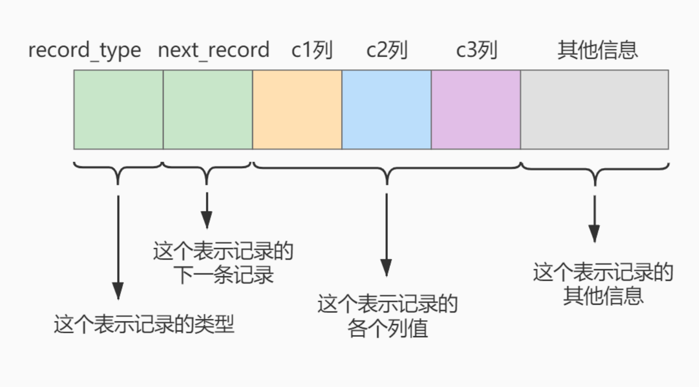

- Compact 行格式存储的一行记录
    - record_type ：记录头信息的一项属性，表示记录的类型， 0 表示普通记录、 2 表示最小记 录、 3 表示最大记录、 1 下面讲
    - next_record ：记录头信息的一项属性，表示下一条地址相对于本条记录的地址偏移量，我们用箭头来表明下一条记录是谁
    - 各个列的值 ：这里只记录在 index_demo 表中的三个列，分别是 c1 、 c2 和 c3 
    - 其他信息 ：除了上述 3 种信息以外的所有信息，包括其他隐藏列的值以及记录的额外信息

- 此时向表中插入三条数据，数据被插入到数据页 10 中

```sql
insert into index_demo values(1, 4, 'u'), (3, 9, 'd'), (5, 3, 'y');
```

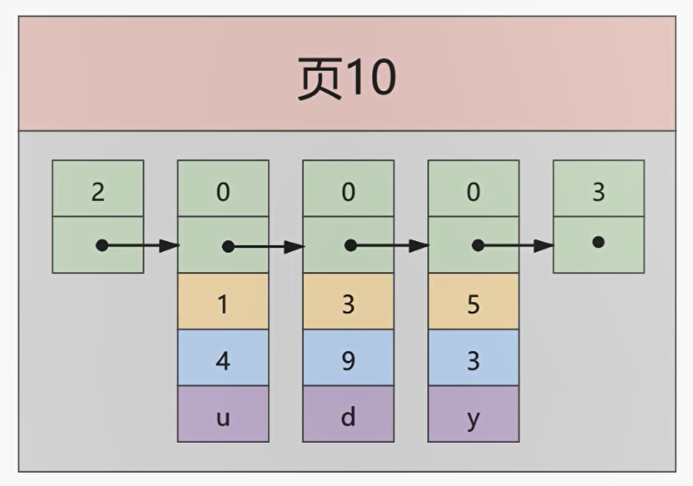

- 假设页 10 最多只能存放 3 条数据，那么新插入的数据就被存放到了一个新的数据页中

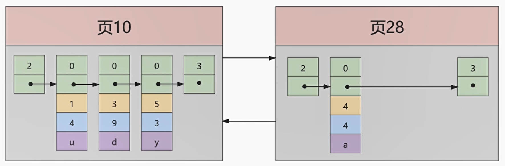

- 由于插入的新数据使得 c1 列不符合主键值得要求，需要进行记录移动【页分裂】

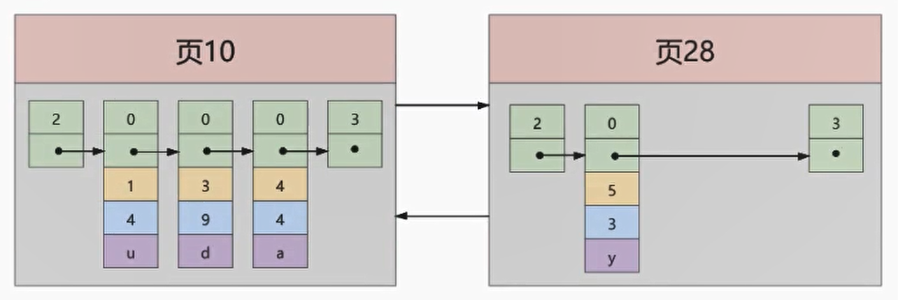

- 由于这些 16KB 数据页是不连续的，当数据量大时无法快速定位数据所在的数据页

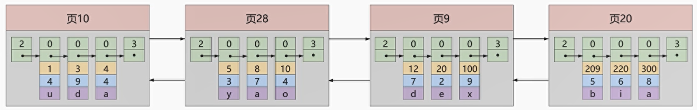

- 此时我们使用每页中主键最小的值作为 key 建立一个目录，当查询一个数据时可以快速定位数据页，之后可以再使用二分法查找数据

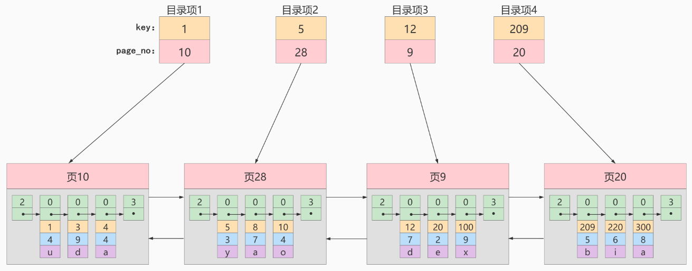

**索引设计第一次迭代**：

- 当数据页不断增加对应的目录项也在不断增加，此时将目录项放到目录页中
    - 此时如果向查找一个数据，就可以先对 `页目录` 使用二分法快速查找到对应的目录页，即可在目录页对应的数据页中查找
    - 此时仅需要向硬盘读取目录页和数据页两次 I/O 即可找到想要的数据


**索引设计第二次迭代**：

- 使用多个目录页连接数据页


**索引设计第三次迭代**：

- 当目录页大于 1 时生成更高一级的目录页，这个结构就是 B+ 树


**B+ 树**：

- 如果每个数据页可以存放 100 条数据，每个目录页可以存放 1000 条数据
    - 当 B+ 树有一层，可以存放 100 条数据
    - 当 B+ 树有两层，可以存放 1000 * 100 条数据
    - 当 B+ 树有三层，可以存放 1000 * 1000 * 100 一亿条数据
    - 当 B+ 树有 N 层，可以存放 1000<sup>n-1</sup> * 100 条数据
- 一般情况 B+ 树的层数不会超过 4 层


### 索引的常见概念

- 聚簇索引
    - 【聚簇】表示数据行和相邻的键值聚簇是存储在一起的。索引即数据，数据即索引
    - InnoDB 支持，MyISAM 不支持 聚簇索引
    - 如果没有显式的定义主键，InnoDB 会隐式的定义一个主键作为聚簇索引
    - 数据页内使用单向链表，数据页间使用双向链表
    - 目录页分为不同层，每一层内的目录页间使用双向链表
    - 优点：
        - 访问速度快，聚簇索引将数据和索引存储在一个 B+ 树，在查询时不需要回表
        - 对于主键的 `排序查找` 和 `范围查找` 的速度很快
        - 节省大量 I/O 操作
    - 缺点：
        - 插入的速度严重依赖于插入顺序，推荐使用自增长主键
        - 更新主键的代价很高
        - 二级索引需要两次索引查找，需要先找到主键值再根据主键值查找数据

- 二级索引 (辅助索引，非聚簇索引)
    - 当我们为非主键字段添加索引时，这个索引就是二级索引，会根据这个非主键的字段再构建一个 B+ 树
    - 【回表】在以非主键字段查询到了数据之后，还需要根据对应的主键字段在主键 B+ 树聚簇索引再次查询

- 联合索引
    - 联合索引也属于非聚簇索引，一个联合索引最多包括 16 个字段
    - 联合索引只会创建一颗 B+ 树，在查询时会根据第一个字段查询，找到后再根据第二个字段查询...


### InnoDB 的 B+ 树索引

- 根页面位置万年不动
    - 数据库在生成 B+ 树时实际上是先生成根目录页
    - 当目录页的层数不足会先将数据页复制走，然后将原数据页变成目录页
- 内节点中目录项记录的唯一性
    - 在二级索引的目录页中也会保存主键的值，为了保证指向的唯一性
- 一个页面最少存储2条记录
    - 每个节点至少有两个分支才复合树的数据结构


### MyISAM 的 B+ 树索引

- MyISAM 引擎中索引和数据是分开存放的 .MYD .MYI
- MyISAM 不支持聚簇索引只支持二级索引，叶子节点中存储 `主键值 + 数据记录地址` 


### InnoDB 和 MyISAM 索引的区别

1. 在 InnoDB 存储引擎中，仅需根据主键值对 `聚簇索引` 进行一次查找就能找到对应的记录，而在 MyISAM 中却需要进行一次 `回表` 操作，意味着 MyISAM 中建立的索引相当于全部都是 `二级索引` 。
2. InnoDB 的数据文件本身就是索引文件，而 MyISAM 索引文件和数据文件是 `分离的` ，索引文件仅保存数据记录的地址。
3. InnoDB 的非聚簇索引 data 域存储相应记录 `主键的值` ，而 MyISAM 索引记录的是 `地址` 。换句话说，InnoDB 的所有非聚簇索引都引用主键作为 data 域。
4. MyISAM 的回表操作是十分 `快速` 的，因为是拿着地址偏移量直接到文件中取数据的，反观 InnoDB 是通过获取主键之后再去聚簇索引里找记录，虽然说也不慢，但还是比不上直接用地址去访问。
5. InnoDB 要求表必须有主键（ MyISAM 可以没有 ）。如果没有显式指定，则 MySQL 系统会自动选择一个可以非空且唯一标识数据记录的列作为主键。如果不存在这种列，则 MySQL 自动为 InnoDB 表生成一个隐含字段作为主键，这个字段长度为 `6 字节`，类型为 `长整型` 。

> - 不要为主键设置过长的字段
> - 推荐使用自增长主键而不是 UUID

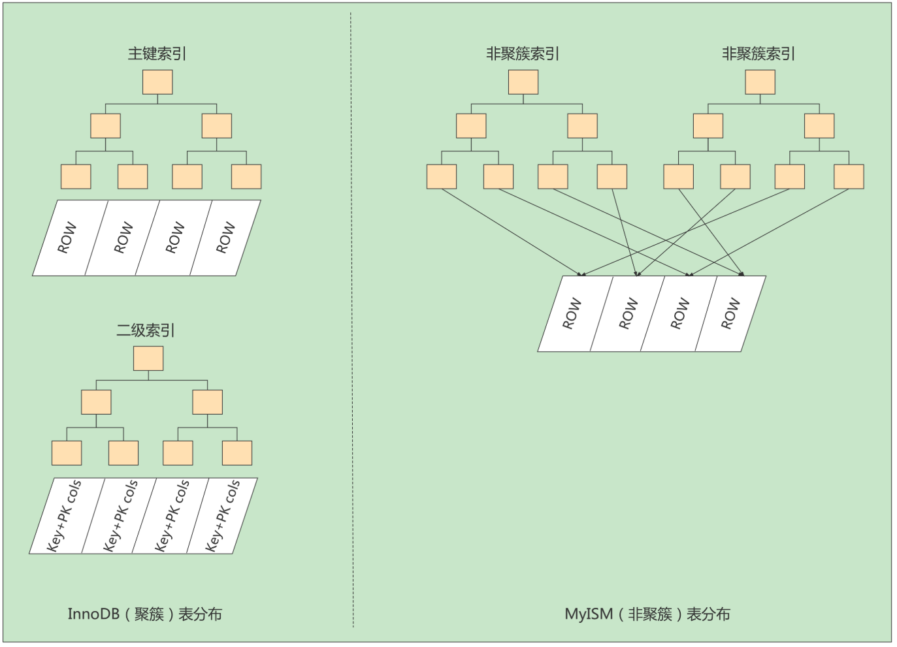


### 数据结构选择

- 索引的数据结构选择的原则是 `对硬盘的 I/O 次数` 
- 不可能每次都加载全部数据到内存中，只能 `逐一加载` 

**全表遍历**：

- 磁盘 I/O 次数多，速度极慢

**Hash 结构**：

- Hash 函数也称散列函数，相同的输入永远可以得到相同的输出
- Hash 算法的复杂度为 O(1) ，速度较 B+ 快很多
- 为什么没有采用 Hash 而是 B+ ?
    - Hash 仅能满足 ==、<>、in 查询，如果进行范围查询时间复杂度为 O(n)，而 B+ 树的时间复杂度为 O(log<sub>2</sub>N)
    - Hash 的存储是没有顺序的，使用 order by 时还需要重新排序
    - 对于联合索引，Hash 会将索引键合并后再计算，无法对单独的键计算
    - 如果索引列的重复值比较多，效率会降低


> 开启 `自适应 Hash 索引` 
>
> - 方便根据 SQL 的查询条件加速定位到叶子节点
>
> ```sql
> # 查看是否开启了自适应 Hash 索引，默认为 on
> show variables like '%adaptive_hash_index';
> ```
>
> 

**二叉搜索树**：


- 左节点 < 本节点，又节点 >= 本节点
- 使用二叉搜索树应尽可能的降低树的高度，让树变得矮胖，由此降低对磁盘的 I/O 次数

**AVL 树**：

- 平衡二叉搜索树，它是一棵空树或左右两个子树的高度差不能超过 1，并且左右两个子树都是一颗平衡二叉树


- 采用 M 叉树 (M > 2)，降低树的层数减少 I/O 次数

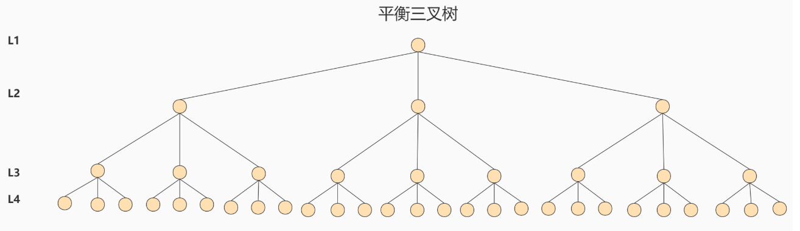

**B-Tree** B 树：

- 多路平衡查找树
- 每个节点存储两个值，通过比对值的 `<` `<= >=` `>` 来找到对应的指针


**B+Tree** B+ 树：

- 改进的 B-Tree 更适合文件检索系统


- B+Tree 与 B-Tree 的区别：
    - 关键字数 = 子节点数，B 树中关键字数 = 子节点数  - 1
    - 非叶子节点中也会存在叶子节点中的值，B 树不会
    - 只有叶子节点存储数据，B 树所有节点都存储数据
    - 由叶子节点可以直接构成一个有序列表，B 树的叶子节点数据不全

**R 树**：

- 解决了高纬度空间的搜索问题


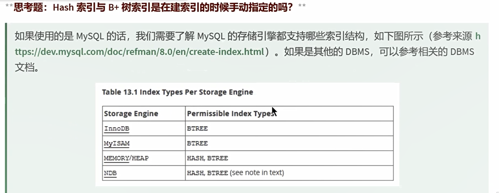


### 算法的时间复杂度


## InnoDB 数据存储结构

#### 数据页内部结构

- InnoDB 将数据以 `页` 为基本单位作为磁盘与内存的交互单位（默认16KB）

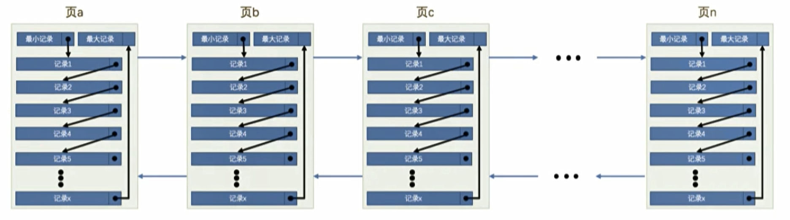

- 每页之间用 `双向链表` 逻辑连接，数据页中的记录使用 `单链表` 连接
- 每个数据页中都会生成一个 `页目录` ，页目录以 `数组` 的数据结构存储，方便使用二分法查找对应记录

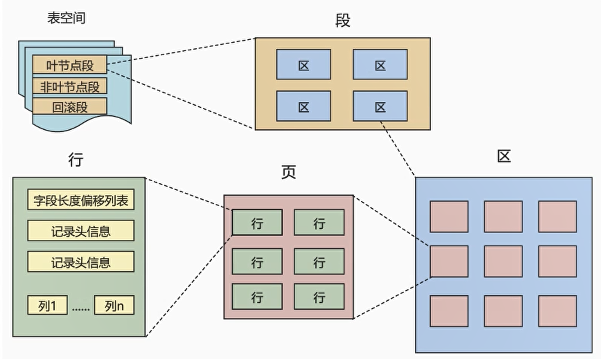

- 页的上层为 `区` ：每个区分配 64 个连续的页，64 * 16KB = 1MB 
- 区的上层为 `段` ：段是数据库的分配单位，按照数据库对象来分（表段、索引段）
- 段的上层为 `表空间` ：分为 系统表空间 和 独立表空间 


- 页按照类型划分分为 `数据页` 、`系统页`、`undo页`、`事务数据页` 等
- 每个数据页占 16KB 大小，被划分为七个部分 `File Header (文件头部)`、`Page Header (页面头部)`、`Infimum + Supremum (最小最大记录)`、`User Records (用户记录)`、`Free Space (空闲空间)`、`Page Directory (页目录)`、`File Trailer (文件尾部)`

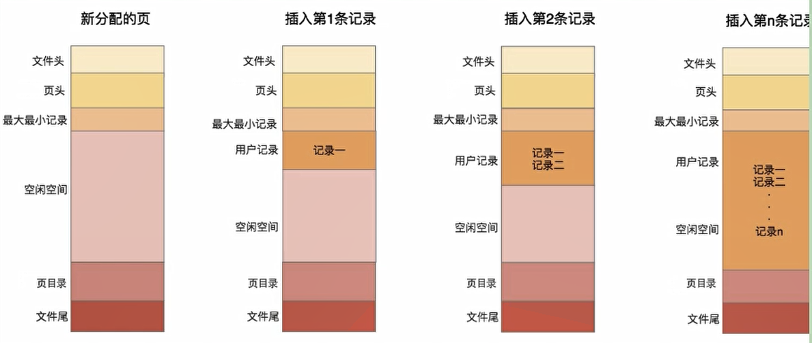

##### 一、文件头部和文件尾部

**文件头**：38字节，描述页的信息

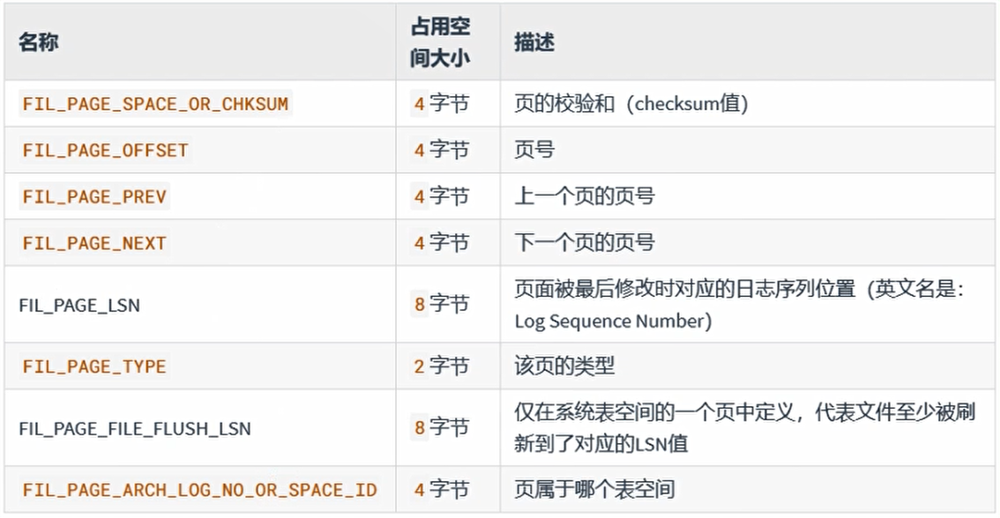

- FIL_PAGE_OFFSET（4字节）：记录一个页号，InnoDB 通过页号唯一定位一个页
- FIL_PAGE_TYPE（2字节）：表示当前页的类型


- FIL_PAGE_PREV（4字节）和FIL_PAGE_NEXT（4字节）：记录上一页和下一页的页号，形成双向链表使页之间逻辑连续
- FIL_PAGE_SPACE_OR_CHKSUM（4字节）：当前页面的 `校验和`（checksum）。 
    - 【校验和】通过某种算法生成的较短的值，避免对比 长字符串 或 两个页 时的时间消耗
    - 在 `刷盘前在文件头` 记录一个校验和，刷盘 `完成后在文件尾` 记录一个校验和，根据两个校验和是否相同来验证数据页在 `磁盘和内存在同步时` 是否出现异常。这里，校验方式就是采用 Hash 算法进行校验。
- FIL_PAGE_LSN（8字节）：页面被最后修改时对应的日志序列位置

**文件尾**：8字节，校验页是否完整

- 前 4 个字节代表 `页的校验和` ：这个部分是和 File Header 中的校验和相对应的。
- 后 4 个字节代表 `页面被最后修改时对应的日志序列位置(LSN)` ：这个部分也是为了校验页的完整性的，验证同步过程是否出现了问题。


##### 二、空闲空间 用户记录 最大最小记录

**空闲空间**：不确定大小，页中还没被使用的空间

- 没有用户记录的空间就是空闲空间

**用户记录**：不确定大小，存储行记录内容

- 按照指定的行格式一条一条的存储在用户记录中，构成 `单链表` 

**最大最小记录**：26字节，是两个虚拟行记录

- 最小记录和最大记录分别占 13 字节


- 这两个是作为数据行在数据页内存储的，最小记录的 heap_no 为 0 , 最大记录的 heap_no 为 1，2 开始就是用户记录


##### 三、页目录 页面头部

**页目录**：不确定大小，存储用户记录的相对位置（使用数组存储每组数据的偏移量，方便使用二分法快速查找）

- 将当前目录页指向的记录分为多个组，每组中包括最大最小记录但不包括标记为已删除的记录
- 第一组只有一条记录为最小记录，其余会按照 4-8 条记录尽量平分
- 页目录存储每组最后一条记录的地址偏移量（每个**槽**中记录的是每组最大的一个记录）

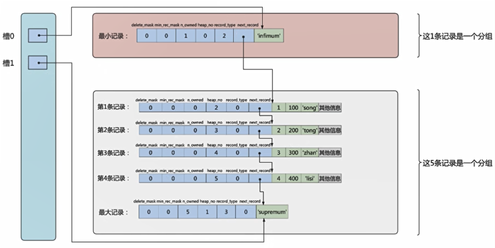

**页头**：56字节，页的状态信息

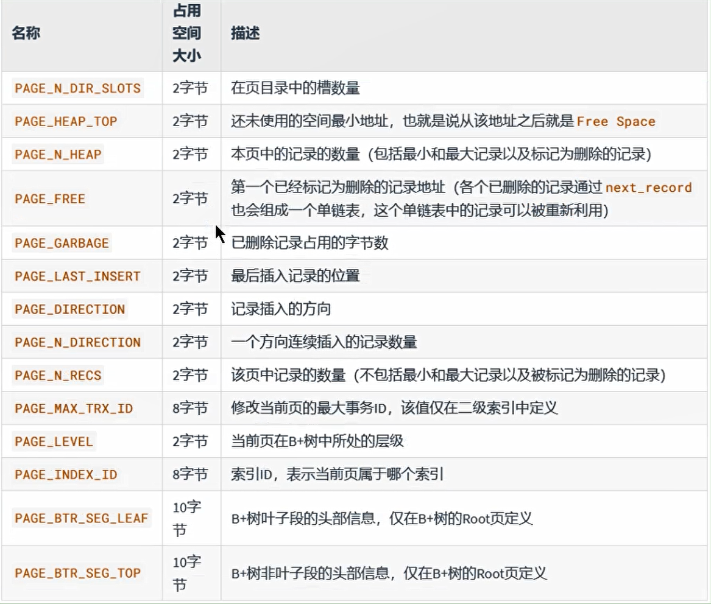

- PAGE_DIRECTION：插入的方向，假如新插入的主键值比上一条记录的主键值大，那么这条记录的插入方向是向右，反之则是向左，便于下次插入。
- PAGE_N_DIRECTION：假设连续几次插入的方向都是一致的，InnoDB 会把沿着同一个方向插入记录的条数用 PAGE_N_DIRECTION 记下来。当然，如果最后一条记录的插入方向改变了的话，这个状态的值会被清零重新统计。


#### InnoDB 行格式

- 查看默认行格式

```sql
SELECT @@innodb_default_row_format;
```

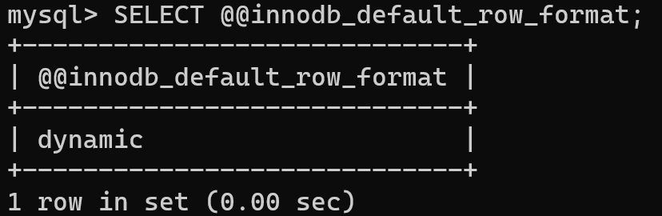

- 创建指定行格式的表

```sql
CREATE TABLE record_test_table (
    col1 VARCHAR(8),
    col2 VARCHAR(8) NOT NULL,
    col3 CHAR(8),
    col4 VARCHAR(8)
) CHARSET = ascii ROW_FORMAT = COMPACT;
```

##### Compact 行格式


- 变长字段长度列表

    - 存储可变长度字段的长度：varchar、varbinary、text、blob

    

    - 按照变长字段的顺序已 16 进制的格式逆序存储：060408

- NULL 值列表

    - 由于数据在存储时是需要对齐的，需要存储行中 NULL 的位置
    - 按照可为 NULL 的字段的顺序已 0 / 1 的格式逆序存储：110

- 记录头信息

    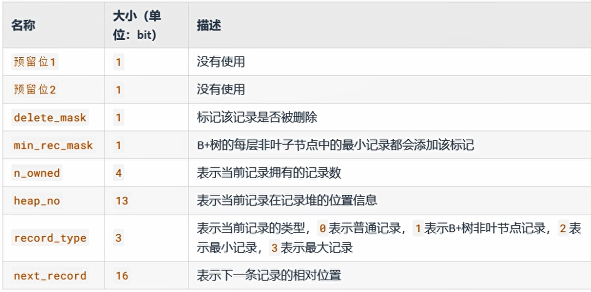

    - delete_mask：记录该记录是否被删除 0 / 1，避免真实删除需要重新排列，维护一个垃圾链表
    - min_rec_mask：记录该记录是否是非叶子节点的最小记录，也就是目录页的最小记录标记为 1
    - record_type：记录该记录的记录类型，0：普通记录，1：非叶子节点的记录，2：最小记录，3：最大记录
    - heap_no：记录该记录在本页中的位置，0 表示最小记录，1表示最大记录，2 3 4 5 ...
    - n_owned：记录该（页目录）组中有多少条记录
    - next_record：记录到下一记录的地址偏移量
        - 删除时：将上一记录的 next_record 指向下一记录，将当前记录的 next_record 设为 0（同时调整 delete_mask、n_owned 的值）
        - 添加时：如果添加的主键和之前删除的主键相同，则**复用**之前的存储空间

    

- 真实数据

    - 存储真实的数据以及三个隐藏列

    

##### Dynamic 行格式 <a id='行溢出'> </a>

- 行溢出
    - 由于 `变长字段长度列表` 需要占用 2 字节， `NULL 值列表` 需要占用 1 字节
    - 在定义 varchar 类型时需要考虑最大字符长度：ascii 中 `varchar(65533) ` 是可以的
    - 由于数据页最大 16KB 也就是 16384 字节，当设置字段长度为 65533 时就发生了【行溢出】
    - 此时会使用 20 字节作为指针指向剩余数据所在的页面...
- 在处理 BLOB 行溢出时，单独存储该字段的溢出页，然后在原数据页只存储溢出页的地址不存数据

##### Compressed 行格式

- 在处理 BLOB 行溢出时，单独存储该字段的溢出页，然后在原数据页只存储溢出页的地址不存数据
- Compressed 行格式在 Dynamic 行格式的基础上添加了 zlib 压缩算法，对于 **富文本** 字段数据可以更有效的存储

##### Redundant 行格式

- 是 MySQL 5.0 之前的默认行格式，保留的目的是为了向下兼容
    - 使用 `字段长度便宜列表` 将**所有字段**的长度都逆序存储，比较冗余
    - 记录头列表 Redundant 行格式多了 n_field 和 1byte_offs_flag 这两个属性。没有 record_type 这个属性

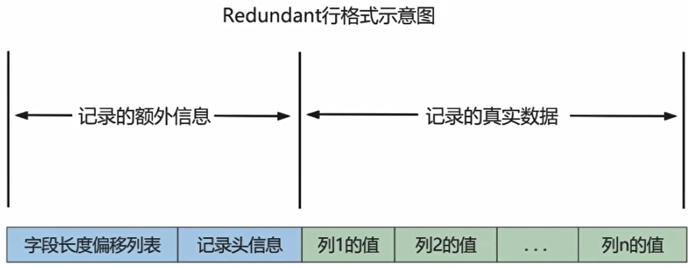


#### 区、段、碎片区、表空间

**区**：

- 一个区可以连续 64 个页，每个区 1MB 空间
- 为了减少 `随机读取` 的**磁盘寻道**和**半圈旋转**时间，将页和页做到顺序存储，提升效率

**段**：

- 将存放叶子节点的区和存放非叶子节点的区分开在不同的段中存储
- 段是逻辑上的概念，由**零散的页面**和**完整的区**组成。常见的段有 `数据段`、`索引段`、`回滚段` 

**碎片区**：

- 每个表都要拥有一个索引段一个数据段，当一个表只有很少的数据却也要占用 2MB 空间
- 于是引入碎片区的概念，在碎片区中存储着一些零散的数据页和目录页。**碎片区直属于表**
- 当某个段已经占用了 32 个碎片区，则会申请 `完整的区` 为单位的存储空间

> 此时区就可以分为：
>
> - `空闲的区(free)` 
>
> - `有剩余空间的碎片区(free_frag)` 
>
> - `没有剩余空间的碎片区(full_frag)` 
>
> - `附属于某个段的区(fseg)` 

**表空间**：

- 是 InnoDB 存储引擎的最高层，分为 `系统表空间`、`独立表空间`、`撤销表空间`、`临时表空间` 
- 独立表空间：便于表迁移，默认 .ibd 占 6 个页大小**自扩展** 
- 系统表空间：还会记录系统的信息，数据字典


## 索引的创建与设计原则

- 按照 **功能逻辑** 划分为 `普通索引`、`唯一索引`、`主键索引`、`全文索引` 
- 按照 **物理实现** 划分为 `聚簇索引`、`非聚簇索引` 
- 按照 **作用字段个数** 划分为 `单列索引`、`联合索引` 

**普通索引**：

- 没有任何约束的索引，可以创建在任何数据类型上

**唯一索引**：

- 使用 unique 参数声明的字段自动创建唯一索引，数据不能重复、可以为空、可以有多个唯一索引

**主键索引**：

- 在创建主键字段时会自动创建主键索引，主键索引是 `not null` + `unique`，一张表中最多只能有一个主键索引

**单列索引**：

- 作用在一个字段上的索引，一个表可以有多个单列索引

**多列索引**（联合索引、组合索引）：

- 为多个字段组合创建一个索引，遵循 `最左前缀集合` 

**全文索引**：

- 是 **搜索引擎** 使用的一种关键技术，用到了 分词技术。分为 自然语言的全文检索 和 布尔全文检索
- 在 3.23.23 版本支持，在 5.6.4 后 InnoDB 支持。现使用 solr、ElasticSearch 专用的搜索引擎替代

**空间索引**：

- 略


### 索引的创建

- 在创建表的时候创建索引

    - 隐式的创建索引：在创建主键、外键、唯一性约束时，自动创建对应索引

    - 显式的创建索引：

        ```sql
        CREATE TABLE table_name [col_name data_type] 
        [UNIQUE | FULLTEXT | SPATIAL] [INDEX | KEY] [index_name] (col_name [length]) [ASC | DESC]
        ```

        - `UNIQUE` 、 `FULLTEXT` 和 `SPATIAL` 为可选参数，分别表示唯一索引、全文索引和空间索引
        - `INDEX` 与 `KEY` 为同义词，两者的作用相同，用来指定创建索引
        - `index_name` 指定索引的名称，为可选参数，默认 col_name 为索引名
        - `col_name` 为需要创建索引的字段列，该列必须从数据表中定义的多个列中选择
        - `length` 为可选参数，表示索引的长度，只有字符串类型的字段才能指定索引长度
        - `ASC` 或 `DESC` 指定升序或者降序的索引值存储

    - 案例：

    ```sql
    CREATE TABLE book(
        book_id INT ,
        book_name VARCHAR(100),
        AUTHORS VARCHAR(100),
        info VARCHAR(100) ,
        COMMENT VARCHAR(100),
        year_publication YEAR,
        # 声明普通索引（单例索引）
        INDEX idx_bname(book_name)
        # 声明唯一索引
        # UNIQUE INDEX idx_bname(book_name)
        # 声明主键索引
        # PRIMARY KEY(book_id)
        # 声明联合索引
        # INDEX multi_idx(book_id,book_name,info)
        # 声明全文索引
        # FULLTEXT INDEX futxt_idx_info(info)
        	# 需要使用 match + against 查询
        	# SELECT * FROM papers WHERE MATCH(title,content) AGAINST (‘查询字符串’);
        # 声明空间索引（要求字段为 GEOMETRY 类型且非空）
        # SPATIAL INDEX spa_idx_geo(geo)
    );
    ```

    - ==查看创建的索引==

    ```sql
    show create table 表名 \G
    # 或
    SHOW INDEX FROM 表名 \G
    ```

    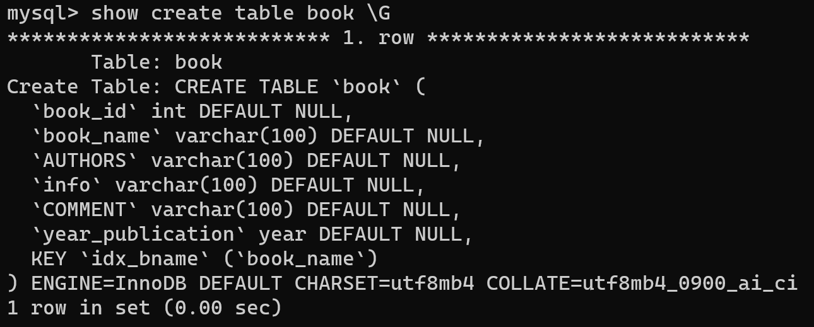

    

    - ==使用 explain 性能分析工具==，可以看到是否用到了索引等信息

    ```sql
    explain sql语句
    ```

    

- 单独创建索引

    - 使用 ALTER TABLE ... ADD 语句创建索引

    ```sql
    ALTER TABLE 表名 ADD [UNIQUE | FULLTEXT | SPATIAL] [INDEX | KEY] [索引名] (字段名[length],...) [ASC | DESC]
    ```

    - 使用 CREATE INDEX ... ON  创建索引

    ```sql
    CREATE [UNIQUE | FULLTEXT | SPATIAL] INDEX 索引名 ON 表名 (字段名[length],...) [ASC | DESC]
    ```

    

### 索引的删除

- 删除主键索引（修改主键索引要先删除原主键再创建新主键）

```sql
# 非自增长主键才可删除
ALTER TABLE 表名 drop PRIMARY KEY;
```

- 使用 ALTER TABLE ... DROP INDEX 删除索引

```sql
ALTER TABLE 表名 DROP INDEX 索引名;
```

- 使用 DROP INDEX ... ON 语句删除索引

```sql
DROP INDEX 索引名 ON 表名;
```


### MySQL 8 降序索引、隐藏索引

- 降序索引

    - 举例：在创建索引时指定字段的排序方式

    ```sql
    CREATE TABLE ts1(a int,b int,index idx_a_b(a,b desc));
    # 可以看到在执行计划中扫描数仅为 5, 而不是整表的数据量
    EXPLAIN SELECT * FROM ts1 ORDER BY a,b DESC LIMIT 5;
    ```

- 隐藏索引

    - 设置为隐藏的索引就不会被使用。设为隐藏索引之后再删除【软删除】
    - 当索引被隐藏时其内容还会跟着内部同步更新，不要长期使用隐藏索引降低 DML 操作速度
        - 可以使隐藏的索引有效：`set session optimizer_switch="use_invisible_indexes=on";` 
    - 在创建表时隐藏索引

    ```sql
    CREATE TABLE book7(
        book_id INT ,
        book_name VARCHAR(100),
        AUTHORS VARCHAR(100),
        info VARCHAR(100) ,
        COMMENT VARCHAR(100),
        year_publication YEAR,
        #创建不可见的索引
        INDEX idx_cmt(COMMENT) invisible
    );
    ```

    - 修改表中索引是否可见

    ```sql
    ALTER TABLE 表名 ALTER INDEX 索引名 (INVISIBLE | VISIBLE); #切换成隐藏索引
    ```

    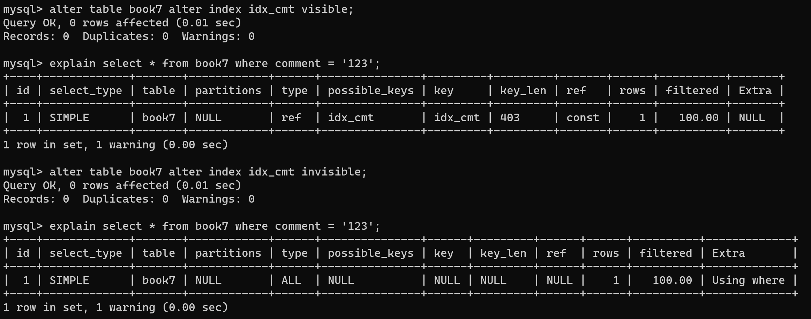


### 适合创建索引的 11 种情况

1. **字段有唯一性限制**

    - 阿里巴巴规定业务上有唯一特性的字段，就算字段是组合字段，也必须添加唯一性索引

2. **频繁作为 where 查询条件的字段**

    

3. **经常 group by  和 order by 的列**

    - 由于创建索引之后就会为索引列排序，在进行 order by 及 group by 时不必再次排序节省时间

    

    - 在同时使用 group by 和 order by 时，若 `分别建立索引` ：按照执行顺序，只会使用到 group by 后的索引

    

    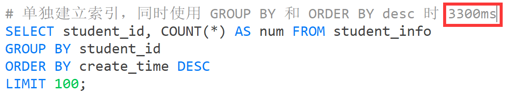

    - 在同时使用 group by 和 order by 时，若 `建立联合索引` ：**建立 order by 字段在前，group by 字段在后** 的联合索引

    

    

    - 在同时使用 group by 和 order by 时，若 `建立联合索引` ：**建立 group by 字段在前，order by 字段（降序）在后** 的联合索引

    

    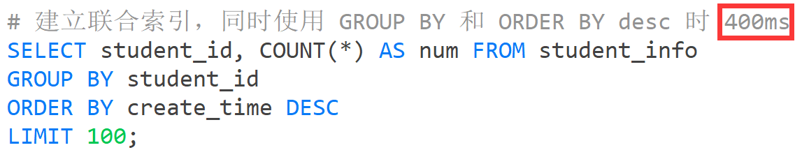

4. **update 和 delete 种的 where 字段**

    - 在更新时为非索引字段更新的效果更明显，因为省去了维护索引的时间

    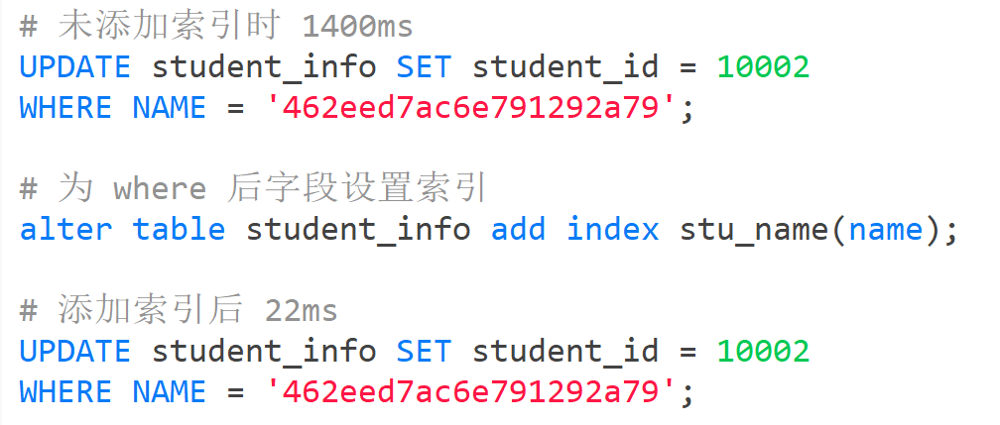

5. **经常 distinct 去重的字段**

    - 字段按照顺序排序之后对去重的速度也有提升

6.  **join on 连接条件上的字段**

    - 注意 on 条件连接的字段类型需要一致，否则索引失效

7. **为类型小的列添加索引**

    - 在创建表的时候就应注意在满足存储条件下使用尽可能小的类型
    - 数据类型约小那么每个数据页中存储的内容就越多，使得 B+ 树变得扁平加快索引效率

8. **使用字符串的前缀创建索引**

    - 避免过长的字符全部存储至索引内存浪费空间，只将字符串的前 n 个字符建立索引

    ```sql
    # 前缀索引
    create index 索引名 on 表名(字段名(n))
    ```

    - 阿里规范强制为 varchar 类型创建索引时使用前缀索引

    ```sql
    # 前缀长度公式，值越接近于 1 越好
    count(distinct left(列名, 索引长度))/count(*)
    ```

    > 使用前缀索引会导致索引排序时无法排序出真正的顺序

9. **区分度（散列度）高的列适合做索引**

10. **使用最频繁的列放到联合索引的左侧**

    - 最左前缀原则

11. **在多个字段都要创建索引的情况下，联合索引优于单值索引**

    - 联合索引中的每个索引列都可以被单独使用

> 建议单表索引不要超过 6 个
>
> - 索引会占用空间
> - 索引会影响增删改的速度
> - 会为优化器选择索引时添加负担


### 不适合创建索引的 7 种情况

1. **where 使用不到的字段**
    - 包括 group by 、 order by 
2. **数据量小的表**
    - 不要杀鸡用牛刀，在数据量低于 1000 条的时候不需要创建索引
3. **有大量重复数据的列**
4. **频繁更新的字段**
5. **不建议用无序的值作为索引**
    - 比如 身份证号、UUID ，在比较时需要转为 ascii ，在插入时容易产生页分裂

6. **删除不再使用或不常使用的索引**
7. **不要定义冗余或重复的索引**
    - 定义了联合索引中包含的列就不要再单独创建索引了


## 性能分析工具的使用

- 数据库的优化思路：S (Show Status) 代表观察，A (Action) 代表行动

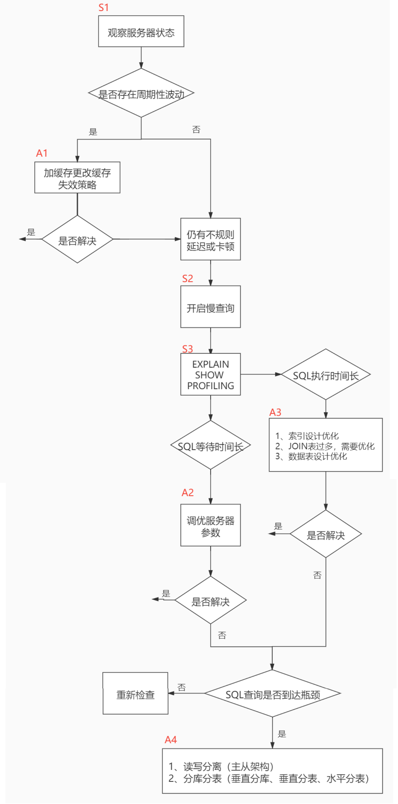


### 查看系统性能参数

```sql
SHOW [GLOBAL|SESSION] STATUS LIKE '参数';
```

- `Connections`：连接 MySQL 服务器的次数
- `Uptime`：MySQL 服务器的上线时间
- `Slow_queries`：慢查询的次数
- `Innodb_rows_read`：Select 查询返回的行数
- `Innodb_rows_inserted`：执行 INSERT 操作插入的行数
- `Innodb_rows_updated`：执行 UPDATE 操作更新的行数
- `Innodb_rows_deleted`：执行 DELETE 操作删除的行数
- `Com_select`：查询操作的次数
- `Com_insert`：插入操作的次数。对于批量插入的 INSERT 操作，只累加一次
-  `Com_update`：更新操作 的次数
-  `Com_delete`：删除操作的次数


### 查看末次查询成本

- 查看最后一次查询用到的页数
    - 但是这个值并和查询时间并不成正比，因为采用顺序读取（顺序 I/O）的方式已经将页面一次性存储只缓冲池中了

```sql
show status like 'last_query_cost';
```


### 查看慢查询日志 slow_query_log

- 是日志的一种，用于记录 `响应时间超过阈值` 的 SQL 

#### 慢查询日志参数

- 查看慢查询是否开启（默认不启用）

```sql
show variables like '%slow_query_log%';
```

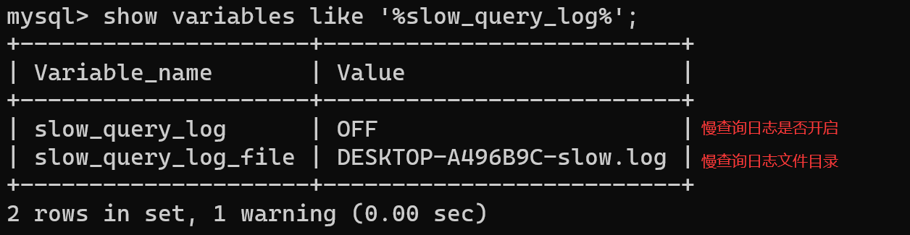

- 开启慢查询日志

```sql
set global slow_query_log = 'ON';
```


- 查看响应时间阈值

```sql
show variables like '%long_query_time%';
```

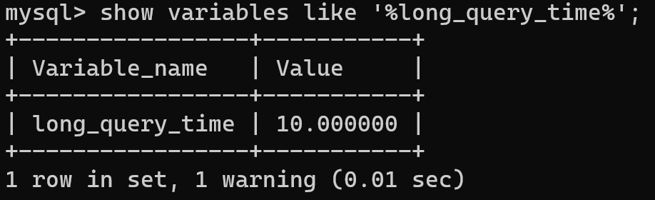

- 设置响应时间阈值

```sql
set global long_query_time = 1;
# 设置 global 对当前 session 连接无效, 应继续设置
set long_query_time = 1;
```


> 也可以通过编辑配置文件永久设置响应时间阈值（编辑 my.cnf 后重启 MySQL）
>
> ```ini
> [mysqld]
> # 开启慢查询日志的开关
> slow_query_log = ON 
> # 慢查询日志的目录和文件名信息
> slow_query_log_file = /var/lib/mysql/atguigu-slow.1og
> # 设置慢查询的阀值为3秒, 超出此设定值的 SQL 即被记录到慢查询日志
> long_query_time = 3
> log_output = FILE
> ```


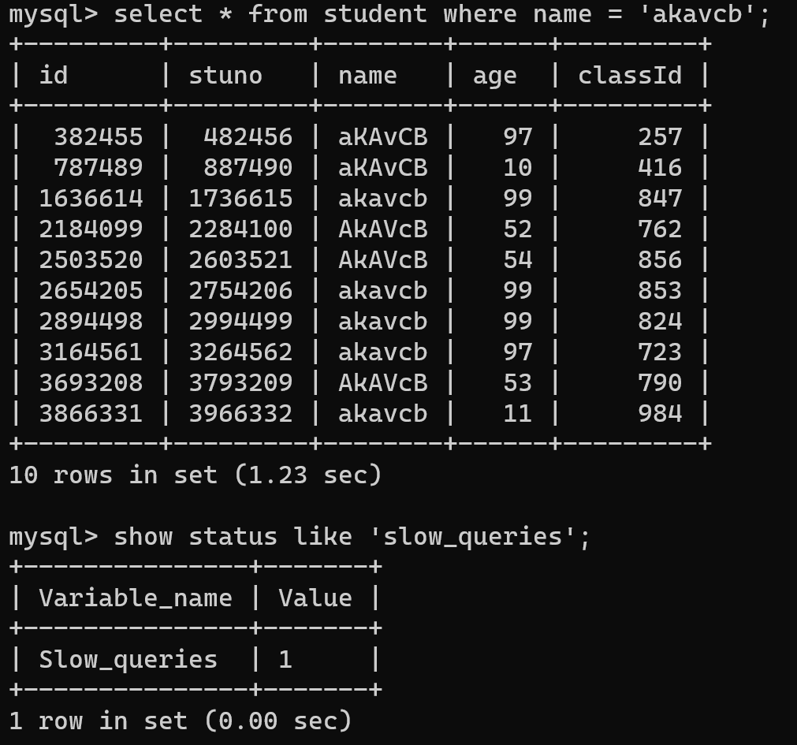

> - `慢查询阈值`（long_query_time）和 `扫描过的最少记录量`（min_examined_row_limit）共同组成判别是否慢查询的条件
>
> - 默认的 min_examined_row_limit 值为 0，即：就算一条记录都没被扫描过，也会被判别为慢查询
>
> 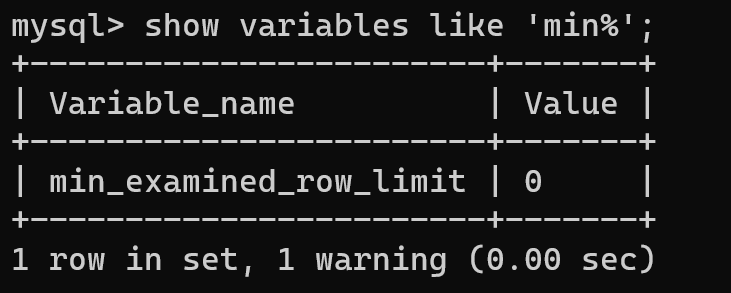

#### 慢查询日志分析工具 mysqldumpslow

- MySQL 提供的日志分析工具 mysqldumpslow

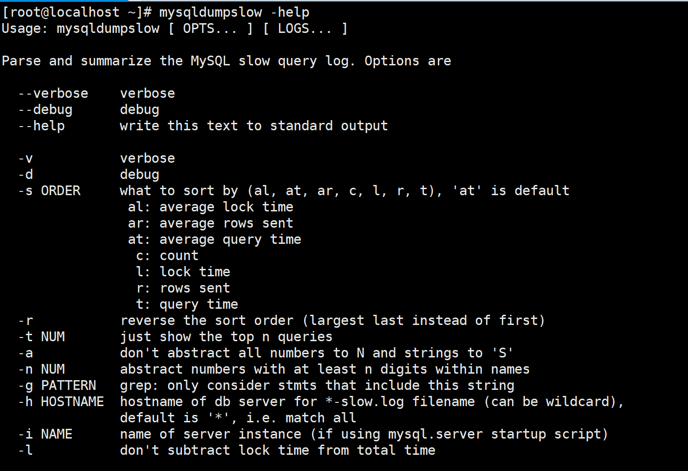

- 具体参数如下：
    - -a: 不将数字抽象成N，字符串抽象成S 
    - -s: 是表示按照何种方式排序
        - c: 访问次数 
        - l: 锁定时间 
        - r: 返回记录 
        - t: 查询时间 
        - al:平均锁定时间 
        - ar:平均返回记录数 
        - at:平均查询时间 （默认方式） 
        - ac:平均查询次数
    - -t: 即为返回前面多少条的数据
    - -g: 后边搭配一个正则匹配模式，大小写不敏感的

- 当开启了慢查询日志并存在复合条件的慢查询时，在 `/var/lib/mysql` 目录中出现 `用户名-slow.log` 的日志文件
- 使用 `mysqldumpslow -s t -t 5` 按照**查询时间**排序，返回**前 5 条**慢查询数据


#### 关闭慢查询日志

- 临时关闭慢查询日志

```sql
SET GLOBAL slow_query_log=off;
```

```bash
systemctl restart mysqld.service
```

- 修改 my.cnf 配置文件关闭慢查询日志

```ini
[mysqld]
# slow_query_log = off
```


### 查看 SQL 执行成本 profile

- 见 MySQL 8 执行流程 <a href='#profile'>profile 的使用</a>


### 查看分析查询语句 explain

- explain 同 descibe 是分析查询的语句，查看优化器的执行计划
- 可以看到：表的读取顺序、数据读取操作的操作类型、哪些索引可以被使用、哪些索引实际被使用、表之间的使用、每张表有多少行被优化器查询

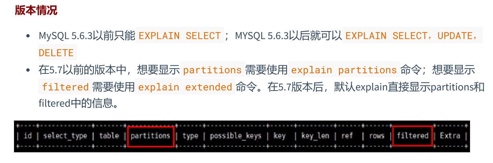

- 查询分析语句的使用

```sql
EXPLAIN SELECT 'SQL语句'
#或者 
DESCRIBE SELECT 'SQL语句'
```


- explain 输出的各个列说明

| 列名            | 描述                                                         |
| --------------- | ------------------------------------------------------------ |
| `id`            | 在一个大的查询语句中每个 SELECT 关键字都对应一个 `唯一的 id` |
| `select_type`   | SELECT 关键字对应的那个查询的类型                            |
| `table`         | 表名                                                         |
| `partitions`    | 匹配的分区信息                                               |
| `type`          | 针对单表的访问方法                                           |
| `possible_keys` | 可能用到的索引                                               |
| `key`           | 实际上使用的索引                                             |
| `key_len`       | 实际使用到的索引长度                                         |
| `ref`           | 当使用索引列等值查询时，与索引列进行等值匹配的对象信息       |
| `rows`          | 预估的需要读取的记录条数                                     |
| `filtered`      | 某个表经过搜索条件过滤后剩余记录条数的百分比                 |
| `Extra`         | 一些额外的信息                                               |

- `table` 列

    - 表名，查询的每一行记录都对应着一个单表

    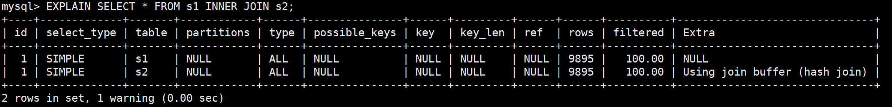

- `id` 列

    - 每一个 `select` 关键字对应着一个 id，第一个的为驱动表，第二个的为被驱动表

    

    - 优化器将两次查询优化为一个多表连接的查询，此时两个 `select` 关键字只会有一个 id

    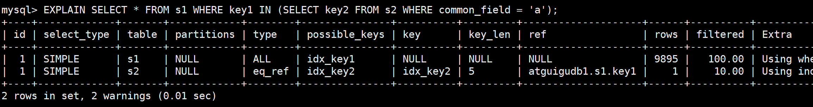

    - 在使用 `union` 关键字连接两次查询时，会进行**去重**操作，此时会出现临时表（但是 `union all` 没有去重，还是两条记录）

    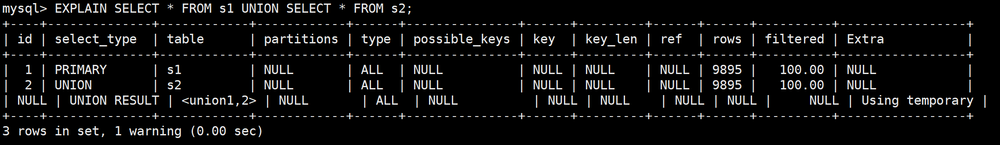

> 

- `select` 列

    - 当前查询在整个查询中扮演的角色

    | 名称                   | 描述                                                         |
    | ---------------------- | ------------------------------------------------------------ |
    | `SIMPLE`               | 不包含子查询和 union 关键字的都是 simple 简单的查询          |
    | `PRIMARY`              | 对于包含子查询或 union 关键字的最外层的查询                  |
    | `UNION`                | 使用 union 关键字时被连接的查询                              |
    | `UNION RESULT`         | 使用 union 关键字生成的临时表                                |
    | `SUBQUERY`             | 当查询即不能被优化为 `semi-join` 又不是相关子查询，此时的子查询 |
    | `DEPENDENT SUBQUERY`   | 当查询不能被优化为 `semi-join` 且是相关子查询（子查询中用到外部表），此时的子查询 |
    | `DEPENDENT UNION`      | 当查询不能被优化为 `semi-join` 且使用到了 union（子查询中用到外部表），此时的 union 子查询 |
    | `DERIVED`              | 派生表，在用到 from 子查询时使用到的由子查询中表派生出的查询结果 |
    | `MATERIALIZED`         | 物化表，在用到 in 子查询时只需要取几个常量的查询结果         |
    | `UNCACHEABLE SUBQUERY` | 不常用                                                       |
    | `UNCACHEABLE UNION`    | 不常用                                                       |

- `partitions` 列

    - 分区信息，略
    - 当查询的表为分区表时显示分区信息

    

- `type` 列

    - 执行查询时的访问方法

    

    - `system` 当表中只有一条记录并使用的存储引擎的 **统计数据** 是精确的如 MyISAM、Memory 
    - `const` 当对唯一索引或主键索这种常数进行 **等值匹配** 时
    - `eq_ref` 当被驱动表通过主键或唯一二级索引进行 **等值匹配** 时，被驱动表的访问方法是 eq_ref 
    - `ref` 当使用的是普通的二级索引与 **常量** 直接进行 **等值匹配** 时
    - `fulltext` 全文检索时
    - `ref_or_null` 当使用的是普通的二级索引与 **常量** 直接进行匹配，条件中有 `OR xx IS NULL` 时
    - `index_merge` 当使用多个索引合并查询时
    - `unique_subquery` 当查询优化器将 in 的子查询优化成 exits 查询时（子查询的连接条件可以使语句转换为连接查询时）
    - `index_subquery` 类似于 unique_subquery
    - `range` 当语句的条件中用到 in 或有明确的 **范围区间** 时
    - `index` 当使用到 **索引覆盖** 但需要扫描全部索引记录时（不符合联合索引 **最左前缀原则**，此时需要扫描整个索引但不需要回表）
    - `ALL` 全表扫描

- `possible_keys` 列

    - 可能使用到的索引

- `key` 列

    - 实际用到的索引

- `key_len` 列

    - 实际使用到的索引长度字节数。针对于 **联合索引**，值越大证明越充分利用到索引
    - key2 为 int 类型占 4 个字节，但 key2 并不是非空字段，所以 4 + 1 = 5

    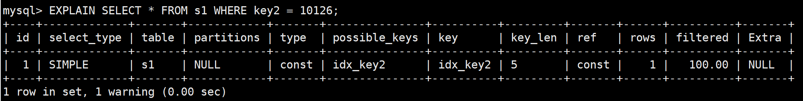

    - key1 为 varchar(100) 类型，但 key1 有可能为空，还需要两个字节记录变长类型的实际长度，所以 3 * 100 + 1 + 2 = 303

    

- `ref` 列

    - 当索引列为等值连接时，与索引列进行等值匹配的对象信息

- `rows` 列

    - 预估的需要读取的条目数，越少越好

- `filtered` 列

    - 经过搜索条件过滤后剩余记录条数的百分比，越大越好
    - 在连接查询中驱动表 `需要读取的条目 * 过滤后剩余记录的百分比` 就是被驱动表的执行次数：9895 * 10% ≈ 989 次

    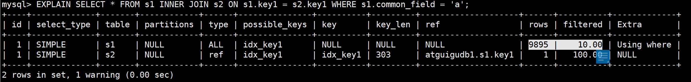

- `Extra` 列

    - 通过这些额外的信息可以 **更准确的理解 MySQL 到底将如何执行给定的查询语句** 
    - `No tables used` 没有 from 条件时

    

    - `Impossible WHERE` 不可能的过滤条件

    

    - `Using where` 当使用全表扫描并指定了 where 条件时

    

    - `No matching min/max row` 没有匹配的数据

    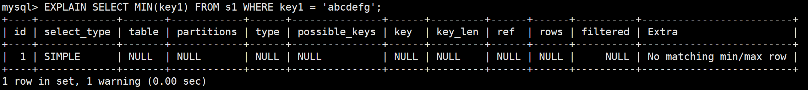

    - `Using index` 使用到了 **覆盖索引**

    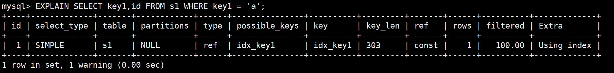

    - `Using index condition` 索引条件下推，有索引列但是不能使用索引，此时会根据 '%a' 的条件进行回表

    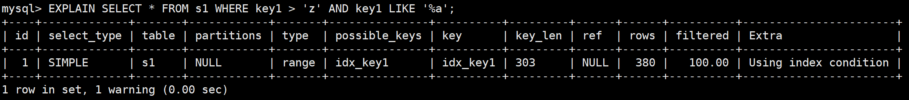

    - `Using join buffer (hash join)` 驱动表不能利用索引时，MySQL 一般会分配一个名叫 `join buffer` 的内存块来加快查询速度，也就是 `基于块的嵌套循环算法` 

    

    - `Not exists` 不存在的，当使用左外连接时，右表的 s2 主键不可能为 NULL

    

    - `Using union(idx_key1,idx_key3); Using where` 用到了合并

    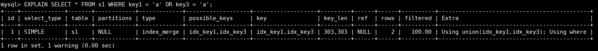

    - `Zero limit` 当 limit 值为 0 时

    

    - `Using filesort` 🙂对结果集 order by 时使用到了索引 或 ☹没有使用到索引，需要在内存中或磁盘中进行排序

    

    - `Using temporary` 用到了内部临时表，应尽量规避

    

> - EXPLAIN 不考虑各种 Cache 
>
> - EXPLAIN 不能显示 MySQL 在执行查询时所作的优化工作 
>
> - EXPLAIN 不会告诉你关于触发器、存储过程的信息或用户自定义函数对查询的影响情况 
>
> - 部分统计信息是估算的，并非精确值

> - 更改 explain 的输出格式
>
> ```sql
> EXPLAIN FORMAT=xxx SELECT ....
> # JSON 格式, TREE 格式, 可视化输出：使用 MySQL 提供的 workbench 工具
> ```
>
> - 查看查询优化器优化后的语句
>
> ```sql
> # 在执行 explain 语句后
> SHOW WARNINGS\G
> ```
>
> 


### 查看优化器执行计划 trace

- 开启跟踪功能

```sql
# 设置开启跟踪功能，配置格式为 json
SET optimizer_trace="enabled=on",end_markers_in_json=on;
# 设置 trace 能够使用的最大内存
set optimizer_trace_max_mem_size=1000000;
```

- 查看追踪的相关信息

```sql
select * from information_schema.optimizer_trace \G
```


### 查看监控分析视图 sys schema

- 索引相关

```sql
#1. 查询冗余索引 
select * from sys.schema_redundant_indexes; 
#2. 查询未使用过的索引 
select * from sys.schema_unused_indexes; 
#3. 查询索引的使用情况 
select index_name,rows_selected,rows_inserted,rows_updated,rows_deleted 
from sys.schema_index_statistics where table_schema='dbname';
```

- 表相关

```sql
# 1. 查询表的访问量 
select table_schema,table_name,sum(io_read_requests+io_write_requests) as io 
from sys.schema_table_statistics group by table_schema,table_name order by io desc; 
# 2. 查询占用bufferpool较多的表 
select object_schema,object_name,allocated,data 
from sys.innodb_buffer_stats_by_table order by allocated limit 10; 
# 3. 查看表的全表扫描情况 
select * from sys.statements_with_full_table_scans where db='dbname';
```

- 语句相关

```sql
#1. 监控SQL执行的频率 
select db,exec_count,query from sys.statement_analysis order by exec_count desc;
#2. 监控使用了排序的SQL 
select db,exec_count,first_seen,last_seen,query from sys.statements_with_sorting limit 1;
#3. 监控使用了临时表或者磁盘临时表的SQL 
select db,exec_count,tmp_tables,tmp_disk_tables,query 
from sys.statement_analysis where tmp_tables>0 or tmp_disk_tables >0 
order by (tmp_tables+tmp_disk_tables) desc;
```

- IO 相关

```sql
#1. 查看消耗磁盘IO的文件 
select file,avg_read,avg_write,avg_read+avg_write as avg_io 
from sys.io_global_by_file_by_bytes order by avg_read limit 10;
```

- Innodb 相关

```sql
#1. 行锁阻塞情况 
select * from sys.innodb_lock_waits;
```


## 索引优化与查询优化

- SQL 优化大致分为 **物理查询优化** 和 **逻辑查询优化** 两大块
    - 物理查询优化：
        - 数据太多 —— 分库分表
        - 服务器调节缓存、线程数等 —— 调整 my.cnf
    - 逻辑查询优化：
        - 索引实现、没有充分利用到索引 —— 索引建立
        - 设计缺陷、JOIN 太多 —— SQL 优化

### 索引失效的案例

1. **全值匹配**：针对没有索引的列进行条件查询

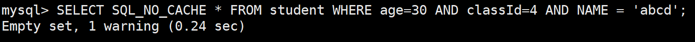

2. **最佳左前缀法则**：当使用联合索引等值条件时最左侧的字段优先，可以不按顺序，但 **不能跨字段**
    - 现有联合索引 age, classId, name 字段，查询为按照 age, name 的条件，此时只有 age 索引生效，name 索引未生效

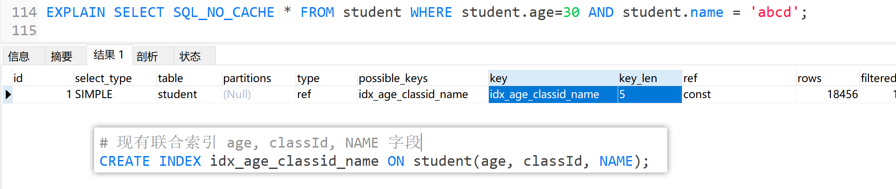

3. **主键插入顺序**： 插入的主键不是依次增大的话，主键索引需要重新维护甚至页面分裂，造成性能损耗

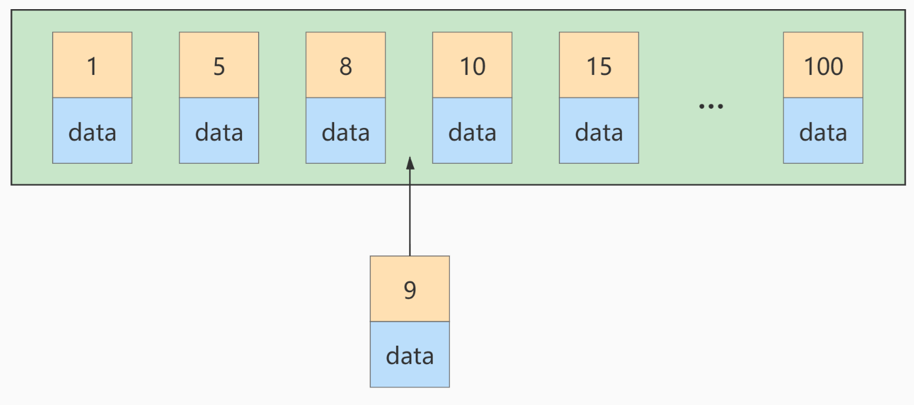

4. **计算、函数、类型转换 (自动或手动)**：当 where 条件中使用到 **函数** \ **计算** \ **类型转换** 则不会使用索引

    - 用到函数时

    

    - 用到计算时

    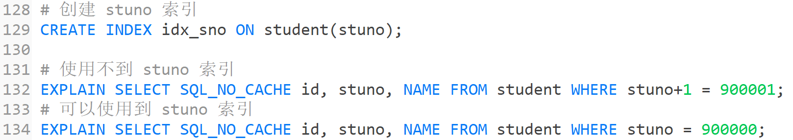

    - 用到类型转换时


5. **范围条件右边的列索引失效**：当使用联合索引查询时，其中一项使用的是范围条件，其右侧的索引失效


6. **不等于 ( != 或 <> ) 索引失效**：B+ 树无法根据不等于来快速定位


7. **is null ✔，is not null ❌** ：is null 可以使用索引，is not null 无法使用索引

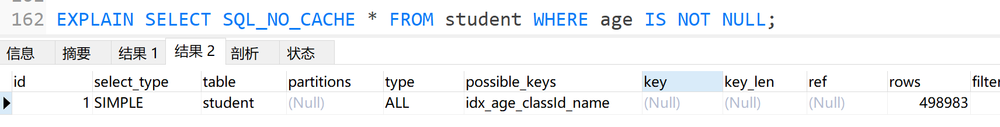

8. **like 以通配符 % 开头**：like '%xxx' 索引失效


9. **OR 前后存在非索引的列**：OR 的前后存在非索引的列就会导致全表扫描，**就算** 使用了一个索引另一侧还需要全表扫描

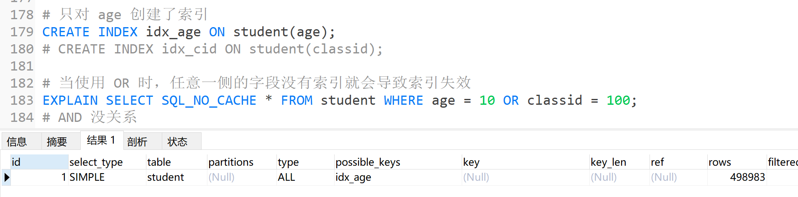

10. **字符集不统一**：当不同的字符集进行比较时，索引失效


### 关联查询的优化

- 外连接：查询出驱动表以及对应的被驱动表的所有数据，被驱动表不存在数据时自动补充 null

    - 针对于左外连接，为右表（**被驱动表**）添加索引即可避免全表扫描

    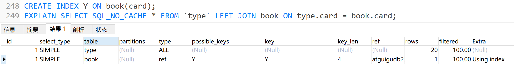

- 内连接：查询出两个表同复合条件的字段

    - 查询优化器会自动选择驱动表和被驱动表，将拥有索引的表作为 **被驱动表**

    

#### JOIN 语句原理

- 使用 JOIN 连接多个表，实际上就是各个表之间的数据循环匹配，就是【**嵌套循环**】算法
- 驱动表与被驱动表
    - 在 EXPLAIN 的结果中，上方的是驱动表，下方的是被驱动表
    - 对于外连接和内连接来说，驱动表和被驱动表 **都由查询优化器决定** 
    - 当两个表都有索引或都没有索引时，**小表驱动大表** 
- 嵌套循环索引（Index Nested-Loop Join）
    - 驱动表根据索引向被驱动表匹配数据，不需要扫描 t1 表（内表）
    - 根据索引读取匹配的 t2 表数据，不需要全表扫描
    - 如果 t2 表为二级索引则需要回表，回 t2 表的索引匹配次数即可

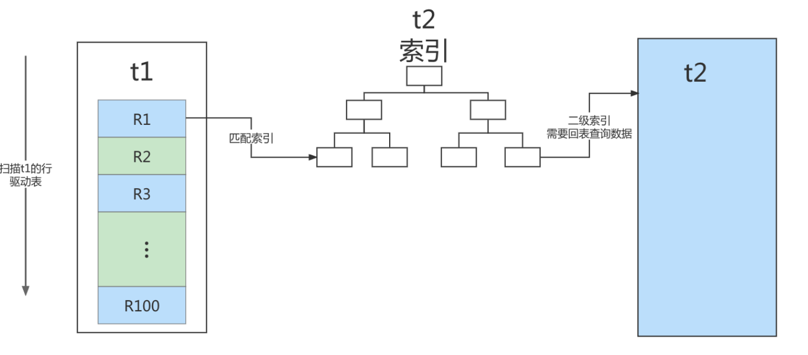

- 块嵌套循环索引（Block Nested-Loop Join）

    - 将驱动表数据分为几块，多次向被驱动表匹配
    - 根据缓冲区（join_buffer ）的大小将 t1 表分为多块

    > 不要将过多的驱动表无用字段，这样会占用 JOIN_BUFFER 导致每次缓冲区的条目数变少

    

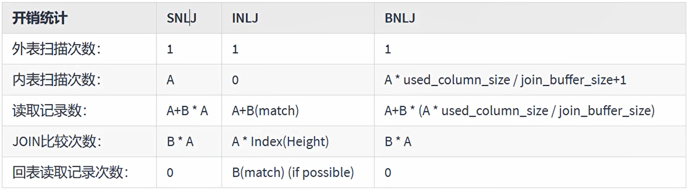

- **调节 join_buffer 大小**：

```sql
# 查看缓冲区大小 默认开启 256k
show variables like '%join_buffer%';
# 32 位系统最多可以设置为 4G 、64 位系统可以设置 4G 以上
```

> - 整体效率：INLJ > BNLJ > SNLJ
> - 永远使用 小的结果集 驱动 大的结果集（结果集 = 表行数 * 每行大小）
>
> 
>
> - 为被驱动表添加索引
> - 增大 join_buffer 大小
>
> - 减少驱动表的不必要字段参与查询

#### MySQL 8 的 Hash join

- MySQL 8 将 Hash join 替代了 BNLJ
- Hash join 是 **大数据散列集** 的常用方式，优化器将相对较小的表利用 join key 在内存中建立 `散列表` 
- 依据散列表直接进行连接，效率高。但第一次查询需要建立哈希表占用大量内存，第一次的结果返回慢


### 子查询优化

- 子查询是 MySQL 4.1 开始支持的功能，其 **效率不高**
    - 执行子查询时需要为内部查询 **建立一个临时表**，在查询结束后还要 **撤销这个临时表**，造成 CPU 和 IO 的消耗
    - 子查询结果集存储的临时表 **不会存在索引**，查询性能低
    - 子查询的 **结果集越大** 对查询效率的影响越大


> 结论：尽量不要使用 NOT IN 或者 NOT EXISTS，用 LEFT JOIN xxx ON xx WHERE xx IS NULL 替代


### 排序优化

- 在 SQL 语句中推荐为 WHERE 和 ORDER BY 子句中使用索引
    - 在 WHERE 中使用索引可以避免全表扫描
    - 在 ORDER BY 中使用索引可以避免 File Sort 排序
- 如果 WHERE 和 ORDER BY 后面的列不相同，推荐使用联合索引（先 WHERE 后 ORDER BY 字段）

- 【索引失效】在 ORDER BY 后面不 LIMIT 时（查询优化器觉得 **数据量小** 时不使用索引效率更高）


- 【索引失效】复合最左前缀原则但有字段降序时（查询优化器觉得 **数据量小** 时不使用索引效率更高）

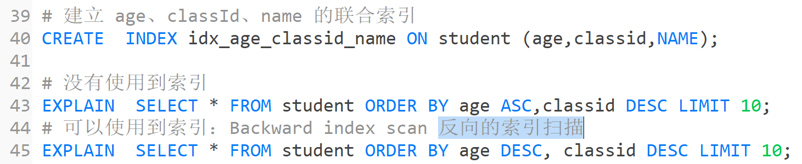

- 【索引生效】WHERE 条件不复合最左前缀原则但 ORDER BY 条件具有 LIMIT 时（查询优化器觉得 **数据量小** 时先使用 ORDER BY 索引排序后 WHERE 效率更高）


#### FileSort 算法

- 出现 FileSort 并不意味着效率比使用索引的效率低
    - 如果 WHERE 条件就可以过滤掉大部分数据，即使 ORDER BY 条件拥有索引，查询优化器也未必会使用【反之亦然】

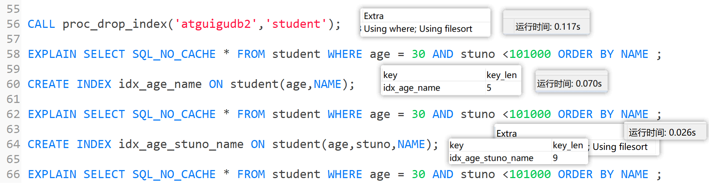

- 【双路排序】：在 MySQL 4.1 前使用，对于 ORDER BY 的列先进行排序，再二次根据 ORDER BY 的顺序查找表中其它字段的完整数据（两次 IO）
- 【单路排序】：先读取所有列，根据 ORDER BY 条件在 buffer 进行排序，然后扫描排序后的列表进行输出（只需要依次顺序 IO）

> - 由于使用的是 **单路排序** 应尝试提高 sort_buffer_size
> - 尝试提高 max_length_for_sort_data，如果字段的长度大于这个变量的值，会采用双路排序
> - Order by 时select * 是一个大忌，有可能使字段长度超过 max_length_for_sort_data，最好只 Query 需要的字段。


### GROUP BY 优化

- GROUP BY 的索引使用原理同 ORDER BY ，GROUP BY 会先排序后分组
- 无法使用索引列时也尝试提高 `sort_buffer_size` `max_length_for_sort_data`
- WHERE 的效率高于 HAVING 能使用 WHERE 就不要使用 HAVING 
- 使用了 ORDER BY、GROUP BY、DISTINCT 的语句，WHERE 条件过滤出来的条数不要超过 1000 条，否则 SQL 会很慢


### 优化分页查询

- 当出现 `limit 2000000, 10` 这种情况时

```sql
explain select * from student limit 2000000, 10;
# 可以使用其它索引列将 limit 转换成某个位置的查询
EXPLAIN SELECT * FROM student WHERE id > 2000000 LIMIT 10;
# 在索引上实现 limit 查询，然后根据主键连接回表查询其他列【推荐】
EXPLAIN SELECT * 
FROM student t,(SELECT id FROM student ORDER BY id LIMIT 2000000,10) a 
WHERE t.id = a.id;
```


### 优先考虑覆盖索引

- 覆盖：指查询使用到的索引字段以及主键字段覆盖了要查询的字段
- 就是说可以直接在一个 B+ 树中查询到想要的字段，而不用回表查询其它 **索引中没有** 的字段
- **一个索引包含了满足查询结果的数据就叫做覆盖索引** 

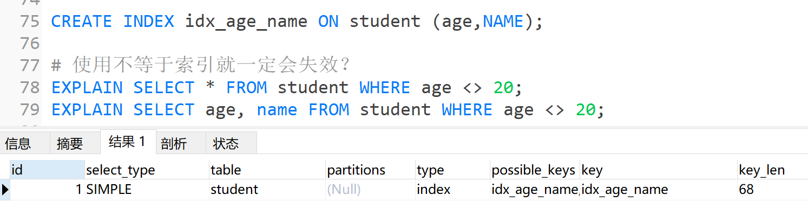

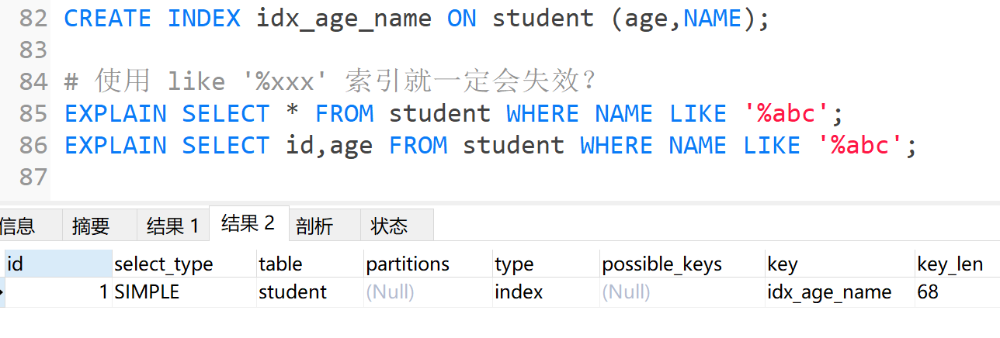

- 在一些索引失效的案例中，使用覆盖索引并不一定会导致索引失效

> 覆盖索引的优点：
>
> 1. 避免Innodb表进行索引的二次查询（回表） 
> 2. 可以把随机IO变成顺序IO加快查询效率 
>
> 覆盖索引的缺点：
>
> 1.  **索引字段的维护** 总是有代价的。因此，在建立冗余索引来支持覆盖索引时就需要权衡考虑了。这是业务 DBA，或者称为业务数据架构师的工作。


### 字符串的索引

- 对字符串的索引优化主要是使用 **前缀索引** 
- 例如对邮箱号进行检索，使用前缀索引，定义好长度，就可以做到既节省空间，又不用额外增加太多的查询成本

> 结论：
>
> - 使用前缀索引就用不上覆盖索引对查询性能的优化了，这也是你在选择是否使用前缀索引时需要考虑的一个因素。


### 索引下推


### 普通索引 vs 唯一索引


### 其它优化策略


## 数据库的设计规范


## 数据库其它调优策略


## 事务基础知识


## MySQL 事务日志


## 锁


## 多版本并发控制


## 其它数据库日志


## 主从复制


## 数据库备份与恢复


