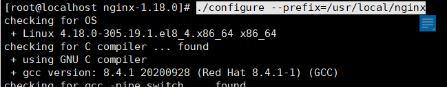
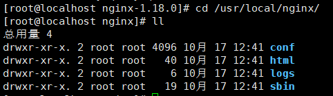
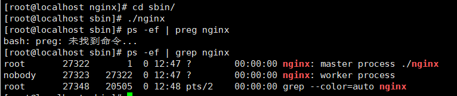
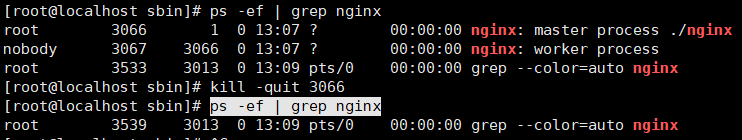
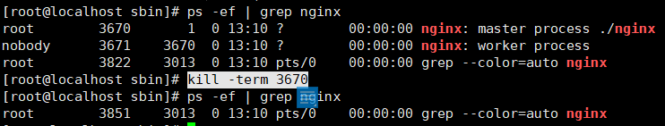
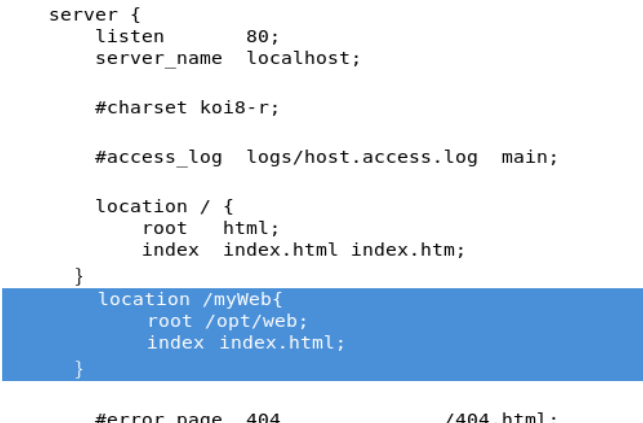
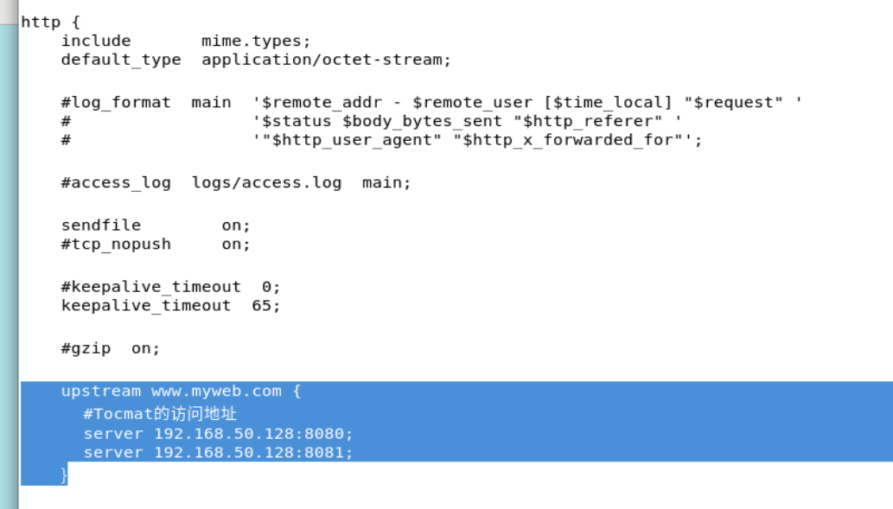
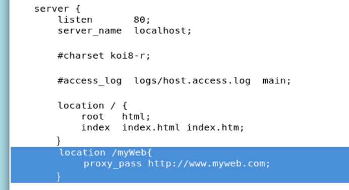
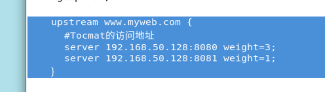

# Nginx自学笔记md版


## Nginx自学笔记

> 大连交通大学 信息学院 刘嘉宁 2021-10-17
>
> 笔记摘自：bjpowernode 杨震


## Nginx服务器

- 静态网站部署
- **负载均衡**
- 虚拟主机
- **反向代理**，正向代理 代理对象是客户端，反向代理 代理对象是服务端。
- **动静分离**


## Nginx服务器特点

- 占用内存少
- 并发处理能力强
- 高性能
- 低系统资源消耗


## 在Linux中的部署配置Nginx

1. 安装依赖编译器与依赖的类库：gcc编译器、openssl库、pcre库、zlib库

```
yum install gcc openssl openssl-devel pcre pcre-devel zlib zlib-devel -y
```

2. 上传安装包并解压
3. 在nginx解压路径下执行 `./configure --prefix=/usr/local/nginx`



4. 编译 make
5. 安装 make install




## Nginx常用命令

1. 启动Nginx：在Nginx安装目录/sbin 下执行命令 `./nginx`



- master 进程读取配置文件，并维护 worker 进程

- worker 进程则对请求进行实际处理

2. 关闭Nginx

   1. 优雅关闭：处理完请求后再关闭 `kill -quit 主pid`

   

   2. 暴力关闭：不管请求是否处理完成，直接关闭 `kill -term 主pid`

   

3. 重启Nginx：`./nginx -s reload`


## 一、在Nginx中部署静态网站

1. 在 nginx安装目录/conf/nginx.conf 中修改配置
   - server：虚拟主机
     - location：处理的网站，/开头
       - root：网站根目录
       - index：首页文件名



2. 重启服务器，访问 [127.0.0.1/myWeb]()


## 二、Nginx常用负载均衡策略

##### 1. 轮询

- 为每个访问的url生成hash值，**按照访问url的hash结果来分配请求**到哪台服务器

1. 在 nginx安装目录/conf/nginx.conf 中修改配置，在http 中添加 upstream 并对应每个服务器的地址



2. 在 server 中添加 location 并让proxy_pass 对应到 upstream名



##### 2. 权重

- 请求按照一定的权重分发到不同的服务器。**weight值越大访问的比例越大，用于后端服务器性能不均的情况**

1. 在 nginx安装目录/conf/nginx.conf 中修改配置，在http 中添加 upstream 并对应每个服务器的地址，并声明对应的 weight 权重值



##### 3. ip绑定

- ip绑定也叫ip_hash，**按照ip的hash值对应服务器，可以解决session丢失问题**


##### 4. 最少连接

- 哪台服务器最空闲就分配到哪台服务器


## 三、在Nginx中部署动静分离网站

略


