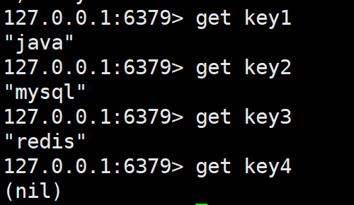
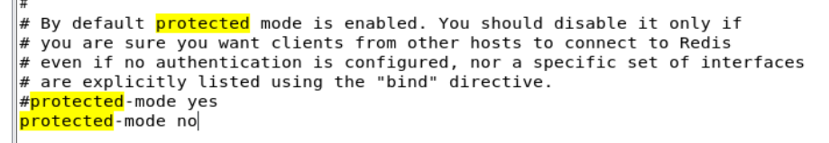

# Redis自学笔记


# Redis自学笔记

> 大连交通大学 信息学院 刘嘉宁 2021-10-11
>
> 笔记摘自：bjpowernode 杨震


## NoSQL（Not Only SQL）

- 解决大规模数据集合多重数据种类带来的挑战，特别是超大规模数据的存储。
- **非关系型数据库**，数据之间一旦没有关系，扩展性、读写性能都大大提高。


## Redis和MySQL数据库的区别

1. MySQL
   - 关系型数据库
   - 易于维护
   - 易于向用户展示具有隶属关系的信息
   - 查询时需要从硬盘读取数据，查询效率相对低
2. Redis：Remote Dictionary Server(远程字典服务器)
   - 非关系型数据库
   - 数据以MAP集合形式存储在内存中
   - 不适于长期存储，适于频繁快速的查询


## Redis的特点

1. 支持数据持久化：可以将内存中的数据保持在磁盘中，重启的时候可以再次加载进行使用。
2. 支持多种数据结构：key-value类型、list、set、zset、hash 等数据结构的存储。
3. 支持数据备份：Redis支持数据的备份，即master-slave模式的数据备份。


## Redis基础知识

1. Redis默认使用16个数据库
   - 可以在安装目录/redis.conf文件中修改 port值
2. 启动Redis数据库
   - Redis默认端口：6379
     - 在安装目录下执行命令：`redis-server`
     - 后台启动Redis服务：`redis-server &`
     - 根据配置文件启动Redis：`redis-server 配置文件 &`
   - **如果修改了redis的配置文件redis.conf，必须在启动时指定配置文件，否则修改无效！**

3. 关闭Redis数据库
   - 执行命令：`redis-cli shutdown`
   - 执行命令：
     1. `ps -ef | grep redis` 查询出redis进程的PID
     2. `kill pid` 或者 `kill -9 pid` 杀掉进程

4. 连接redis

   - 在任意位置执行命令：`redis-cli`

     - 使用`ping`命令测试是否连通

     


## Redis常用命令

1. 切换数据库：
   - select 数据库编号
2. 查看当前数据库有哪些key：
   - keys *

3. 删除当前数据库中的数据：
   - flushdb
4. 删除所有库中的所有数据：
   - flushall
5. 查看库中有多少条数据：
   - dbsize

#### String字符串类型

- 最大值512MB


1. 向MAP中存放键值对：`set key值 value值`

   

2. 获取key值对应的value值：`get key值`
   - 空为：nil



3. 为原value值后追加字符：`append key值 value值`
   - 返回追加后的字符串 类型 长度


4. 返回对应的字符串字符个数：`strlen key值`
   - 不存在返回 0


5. 截取字符串：`getrange key值 开始下标 结束下标`
   - 正负下标同pathon
   - ==左右都同时包含==


6. 临时向MAP中存放键值对：setex key值 秒数 value值


#### List列表类型


1. 在列表左边压入键值对：`lpush key值 值...`
   - 返回追加后的列表 长度


2. 在指定下标区间中取值：`lrange key值 开始下标 结束下标`
   - ==左右同时包含==


3. 在列表右边压入键值对：`rpush key值 值...`
   - 返回追加后的列表 长度


4. 移除左侧第一个元素：`lpop key值`
   - 返回删除掉的value值


5. 移除右侧第一个元素：`rpop key值`
   - 返回删除掉的value值


6. 取指定下标上的值：`lindex key值 下标`


7. 返回列表中有多少个数据：`llen key值`


8. 更换列表中指定下标位的值：`lset key值 下标 value值`


#### Hash哈希类型


1. 在哈希列表key中添加 field域和value值 对：`hset key值 field值 value值  [field value …]`
   - 返回当前哈希列表中域值对的数量


2. 获取哈希列表中指定field域的value值：`hget key值 field值`


3. 获取哈希列表中所有 域和值 ：`getall key值`


4. 获取哈希列表中所有field域列表：`hkeys key值`


5. 删除哈希列表中的一个 域值对 ：`hdel key值 field值`


6. 获取哈希列表中所有value值列表：`hvals key值`


7. 查看哈希列表中 是否存在对应的field域：`hexists key值 field值`


#### Set集合类型


1. 向集合中添加元素：`sadd key值 元素值 [元素值...]`
   - 返回追加后的集合 长度


2. 显示集合中所有元素：`smembers key值`


3. 判断集合中是否存在对应的member值：`sismember key值 member值`


4. 获取集合中元素的个数：`scard key值`


5. 移除一个或多个元素：`srem key值 member值 [member值...]`
   - 返回移除的集合 长度


6. 返回指定集合的差集，第一个集合有，其他集合没有的值：`sdiff key值 [key值...]`


7. 返回指定集合的交集，第一个集合有，其他集合也有的值：`sinter key值 [key值...]`


8. 返回指定集合的并集，所有集合中的元素并在一起：`sunion key值 [key值...]`


#### Zset有序集合类型

- 通过每个元素的分数来确定元素


1. 向有序集合中添加元素：`zadd key值 score值 value值`
   - 返回追加后的有序集合 长度


2. 查询有序集合指定空间内的元素：`zrange key值 开始下标 结束下标`
   - 其值按照score分数升序排序，最小为下标0


3. 按分数查询有序集合指定空间内的元素：`zrangebyscore key值 min分数 max分数`


4. 移除一个或多个元素：`zrem key值 member值 [member值...]`
   - 返回移除的有序集合 长度


5. 获取有序集合中元素的个数：`zcard key值`


6. 获取有序集合中成员的排名：`zrank key值 member值`


7. 获取有序集合中元素的分数：`zscore key值 member值`


## Redis持久化

将Redis数据库中的数据以二进制形式存储在硬盘中

#### 一、RDB持久化

- 根据数据更新频率决定是否持久化
- Redis服务器默认开启RDB持久化方式
- 持久化文件存储在数据库 安装目录 / dump.rdb

1. 配置规则

   - 可以在安装目录/redis.conf文件中修改 save值**是否开启RDB持久化**
     - 单位之间内达到被修改次数就会被持久化

   ```sql
   save 900 1 #900秒内被修改1次就会被持久化
   save 300 10 #300秒内被修改10次就会被持久化
   save 60 10000 #60秒内被修改10000次就会被持久化
   ```

   - 可以在安装目录/redis.conf文件中修改 dbfilename值修改**持久化文件存放位置**

   

   - 可以在安装目录/redis.conf文件中修改 rdbcompression值修改**持久化文件是否需要压缩**
     - 【yes】开启压缩，默认开启

   

   - 可以在安装目录/redis.conf文件中修改 stop-writes-on-bgsave-error值修改**持久化时发生错误是否阻止其他命令执行**
     - 【yes】之后的所有数据都不再持久化
     - 【no】之后数据更改不受影响

   

2. 手动将数据持久化

   - 使用`bgsave`命令：直接将当前数据库中所有数据存储在dump.rdb中

- RDB的缺点：无法保证dump.rdb中存储的数据与数据库中的数据保持一致


#### 二、ROF持久化

- 根据指定的时间间隔持久化数据库数据
- Append Only File（AOF）
- 持久化文件存储在数据库 安装目录 / appendonly.aof

1. 配置规则

   - 可以在安
   - 装目录/redis.conf文件中修改 appendonly值**是否开启AOF持久化**

   

   - 可以在安装目录/redis.conf文件中修改 appendfilename值修改**持久化文件存放位置**

   

   - 可以在安装目录/redis.conf文件中修改 appendfsync值修改**持久化方式**
     - 【always】每次数据修改都进行持久化，会增大服务器压力
     - 【everysec】每隔一秒对数据进行持久化一次

   


## Redis事务管理

- 在MySQL中事务是通过临时备份表来实现的，开启事务时生成备份表，如果rollback就用备份表覆盖原表
- 在Redis中事务是通过将命令存入一个栈来实现的，如果exec提交就执行栈中所有命令

触发事务的错误：

1. 语法错误:Redis事务管理对象销毁栈，所有的命令都无效

   > set key1 100
   >
   > sets key2 200  # 语法错误，就是命令书写错误

2. 执行错误: 不会影响事务中其他命令的执行

   > set key1 100
   > set key2 200       # key2关联的数据是string
   > lpush key2 300  # 语法没有错误/命令没有拼写错误，但是将key2的类型错误理解为列表

   - 这个错误只有在Redis执行这个命令时才会爆发，所以并不会影响其他命令

事务相关命令：

1. `multi` 要求Redis服务器提供一个事务管理对象, 相当于 start transaction
2. `exec` 要求事务管理对象执行栈中所有的命令, 相当于commit
3. `discard` 要求事务管理对象销毁栈, 相当于rollback
4. `watch` 通过watch监控某一个数据，如果在事务执行过程中这个被监控的数据被修改了则取消本次事务中所有的操作


## Redis消息订阅

“ 消息订阅 “ ：一种数据共享的服务，便于redis客户端之间数据共享。

1. 通    道：redis信息订阅提供的存放共享数据的平台
2. 发布者：写入共享数据的redis客户端
3. 订阅者：读取共享数据的redis客户端

消息订阅相关命令：

 	1. `subscribe 通道名1 [通道名2]`：订阅（自动接收）通道信息
 	2. `publish 通道名 信息`：向通道发布信息


## Redis的主从复制和哨兵模式

略


## 使用Jedis操作Redis

Jedis：Redis作者使用 Java 写的工具类，用于连接Redis数据库

- 需要关闭linux防火墙，让非本地客户端可以连接到redis。否则可能会抛出连接超时异常

1. 导入依赖

```xml
<!-- jedis依赖 -->
<dependency>
  <groupId>redis.clients</groupId>
  <artifactId>jedis</artifactId>
  <version>3.7.0</version>
</dependency>
```

2. 在redis.conf中 关闭Redis的保护模式



3. 在redis.conf中 取消服务器与客户端IP的绑定


4. 在redis.conf中 设置访问Redis服务器的密码


5. 按照redis.conf 的配置文件启动Redis数据库


6. 测试ping数据库

```java
@Test
public void testJedis() {
    //1. 创建Jedis对象, 打开连接通道
    Jedis jedis = new Jedis("192.168.50.128", 6379);
    //2. 提供登录密码，验证
    jedis.auth("123");
    //3. 发送ping命令, 测试通道否建立成功
    String result = jedis.ping();
    System.out.println("result = " + result);
}
```


操作String字符串

```java
@Test
public void testJedisString() {
    //1. 创建Jedis对象, 打开连接通道
    Jedis jedis = new Jedis("192.168.50.128", 6379);
    //2. 提供登录密码，验证
    jedis.auth("123");

    //操作String字符串
    jedis.select(0);
    jedis.set("key1", "Hello");
    jedis.set("key2", "World");
    String key1 = jedis.get("key1");
    System.out.println(key1);
    String key2 = jedis.get("key2");
    System.out.println(key2);
    
    jedis.flushDB();
    Long aLong = jedis.dbSize();
    System.out.println(aLong);
}
```

操作list列表

```java
@Test
public void testJedisList() {
    //1. 创建Jedis对象, 打开连接通道
    Jedis jedis = new Jedis("192.168.50.128", 6379);
    //2. 提供登录密码，验证
    jedis.auth("123");

    //操作list列表
    jedis.lpush("key1", "Hello", "World");
    List<String> key1 = jedis.lrange("key1", 0, 2);
    System.out.println(key1);
    
    jedis.flushDB();
}
```

操作Set集合

```java
@Test
public void testJedisSet() {
    //1. 创建Jedis对象, 打开连接通道
    Jedis jedis = new Jedis("192.168.50.128", 6379);
    //2. 提供登录密码，验证
    jedis.auth("123");

    //操作Set集合
    Long num = jedis.sadd("key1", "10", "20", "10");
    System.out.println("当前key1中数据数量" + num);
    Boolean is10 = jedis.sismember("key1", "10");
    System.out.println("key1中是否有10" + is10);
    Set<String> key1 = jedis.smembers("key1");
    System.out.println(key1);

    jedis.flushDB();
}
```

操作hash哈希

```java
@Test
public void testJedisHash() {
    //1. 创建Jedis对象, 打开连接通道
    Jedis jedis = new Jedis("192.168.50.128", 6379);
    //2. 提供登录密码，验证
    jedis.auth("123");

    //操作hash哈希
    jedis.hset("key1", "deptNo", "10");
    jedis.hset("key1", "dName", "sales");
    jedis.hset("key1", "loc", "beijing");

    String hget = jedis.hget("key1", "deptNo");
    System.out.println(hget);
    hget = jedis.hget("key1", "dName");
    System.out.println(hget);
    hget = jedis.hget("key1", "loc");
    System.out.println(hget);

    jedis.flushDB();
}
```

操作ZSet有序集合

```java
@Test
public void testJedisZSet() {
    //1. 创建Jedis对象, 打开连接通道
    Jedis jedis = new Jedis("192.168.50.128", 6379);
    //2. 提供登录密码，验证
    jedis.auth("123");

    //操作ZSet有序集合
    jedis.zadd("key1", 80, "mike");
    jedis.zadd("key1", 60, "smith");
    jedis.zadd("key1", 40, "tom");

    Set<String> key1 = jedis.zrange("key1", 0, -1);
    System.out.println(key1);

    jedis.flushDB();
}
```


## 在 SpringMVC 中使用 Redis

- 在 pom.xml 中添加依赖

```xml
    <!-- spring-data-redis -->
    <dependency>
        <groupId>org.springframework.data</groupId>
        <artifactId>spring-data-redis</artifactId>
        <version>2.6.4</version>
    </dependency>
    <!-- jedis -->
    <dependency>
        <groupId>redis.clients</groupId>
        <artifactId>jedis</artifactId>
        <version>4.2.2</version>
    </dependency>
```

- 在 resources 路径下创建 redis.properties 文件

```properties
redis.host=Redis的host
redis.port=Redis的端口号
redis.password="Redis的密码"
redis.maxIdle=400
redis.maxTotal=6000
redis.maxWaitMillis=1000
redis.blockWhenExhausted=true
redis.testOnBorrow=true
redis.db=1
```

- 创建 RedisService 类

```java
import org.springframework.beans.factory.annotation.Autowired;
import org.springframework.data.redis.core.*;

import java.io.Serializable;
import java.util.List;
import java.util.Set;
import java.util.concurrent.TimeUnit;

public class RedisService {

    @Autowired
    private RedisTemplate redisTemplate;

    public void setRedisTemplate(RedisTemplate redisTemplate) {
        this.redisTemplate = redisTemplate;
    }

    /**
     * 写入缓存
     * @param key
     * @param value
     * @return
     */
    public boolean set(final String key, Object value) {
        boolean result = false;
        try {
            ValueOperations<Serializable, Object> operations = redisTemplate.opsForValue();
            operations.set(key, value);
            result = true;
        } catch (Exception e) {
            e.printStackTrace();
        }
        return result;
    }
    /**
     * 写入缓存设置时效时间
     * @param key
     * @param value
     * @return
     */
    public boolean set(final String key, Object value, Long expireTime) {
        boolean result = false;
        try {
            ValueOperations<Serializable, Object> operations = redisTemplate.opsForValue();
            operations.set(key, value);
            redisTemplate.expire(key, expireTime, TimeUnit.SECONDS);
            result = true;
        } catch (Exception e) {
            e.printStackTrace();
        }
        return result;
    }
    /**
     * 批量删除对应的value
     * @param keys
     */
    public void remove(final String... keys) {
        for (String key : keys) {
            remove(key);
        }
    }

    /**
     * 批量删除key
     * @param pattern
     */
    public void removePattern(final String pattern) {
        Set<Serializable> keys = redisTemplate.keys(pattern);
        if (keys.size() > 0)
            redisTemplate.delete(keys);
    }
    /**
     * 删除对应的value
     * @param key
     */
    public void remove(final String key) {
        if (exists(key)) {
            redisTemplate.delete(key);
        }
    }
    /**
     * 判断缓存中是否有对应的value
     * @param key
     * @return
     */
    public boolean exists(final String key) {
        return redisTemplate.hasKey(key);
    }
    /**
     * 读取缓存
     * @param key
     * @return
     */
    public Object get(final String key) {
        Object result = null;
        ValueOperations<Serializable, Object> operations = redisTemplate.opsForValue();
        result = operations.get(key);
        return result;
    }


    /**
     * 哈希 添加
     * @param key
     * @param hashKey
     * @param value
     */
    public void hmSet(String key, Object hashKey, Object value){
        HashOperations<String, Object, Object> hash = redisTemplate.opsForHash();
        hash.put(key,hashKey,value);
    }

    /**
     * 哈希 删除
     * @param key
     * @param hashKey
     */
    public void hmDel(String key, Object hashKey){
        HashOperations<String, Object, Object> hash = redisTemplate.opsForHash();
        hash.delete(key,hashKey);
    }

    /**
     * 哈希获取数据
     * @param key
     * @param hashKey
     * @return
     */
    public Object hmGet(String key, Object hashKey){
        HashOperations<String, Object, Object>  hash = redisTemplate.opsForHash();
        return hash.get(key,hashKey);
    }

    /**
     * 列表添加
     * @param k
     * @param v
     */
    public void lPush(String k,Object v){
        ListOperations<String, Object> list = redisTemplate.opsForList();
        list.rightPush(k,v);
    }

    /**
     * 列表获取
     * @param k
     * @param l
     * @param l1
     * @return
     */
    public List<Object> lRange(String k, long l, long l1){
        ListOperations<String, Object> list = redisTemplate.opsForList();
        return list.range(k,l,l1);
    }

    /**
     * 集合添加
     * @param key
     * @param value
     */
    public void add(String key,Object value){
        SetOperations<String, Object> set = redisTemplate.opsForSet();
        set.add(key,value);
    }

    /**
     * 集合获取
     * @param key
     * @return
     */
    public Set<Object> setMembers(String key){
        SetOperations<String, Object> set = redisTemplate.opsForSet();
        return set.members(key);
    }

    /**
     * 有序集合添加
     * @param key
     * @param value
     * @param scoure
     */
    public void zAdd(String key,Object value,double scoure){
        ZSetOperations<String, Object> zset = redisTemplate.opsForZSet();
        zset.add(key,value,scoure);
    }

    /**
     * 有序集合获取
     * @param key
     * @param scoure
     * @param scoure1
     * @return
     */
    public Set<Object> rangeByScore(String key, double scoure, double scoure1){
        ZSetOperations<String, Object> zset = redisTemplate.opsForZSet();
        return zset.rangeByScore(key, scoure, scoure1);
    }
}
```

- 创建配置类 RedisConfig 

```java
import com.djtu.redis.RedisService;
import org.springframework.beans.factory.annotation.Value;
import org.springframework.context.annotation.Bean;
import org.springframework.context.annotation.Configuration;
import org.springframework.data.redis.connection.RedisStandaloneConfiguration;
import org.springframework.data.redis.connection.jedis.JedisConnectionFactory;
import org.springframework.data.redis.core.RedisTemplate;
import org.springframework.data.redis.serializer.StringRedisSerializer;
import redis.clients.jedis.JedisPoolConfig;

@Configuration
public class RedisConfig {

    @Value("${redis.host}")
    private String hostName;

    @Value("${redis.port}")
    private int port;

    @Value("${redis.password}")
    private String password;

    @Value("${redis.db}")
    private int database;


    /**
     * redis链接池配置
     *
     * @return JedisPoolConfig
     */
    @Bean
    public JedisPoolConfig jedisPoolConfig() {
        JedisPoolConfig jedisPoolConfig = new JedisPoolConfig();

        jedisPoolConfig.setMaxTotal(100);

        jedisPoolConfig.setMinIdle(20);

        jedisPoolConfig.setMaxWaitMillis(10000);

        return jedisPoolConfig;
    }

    /**
     * redis工厂方法
     *
     * @return JedisConnectionFactory
     */
    @Bean
    public JedisConnectionFactory jedisConnectionFactory() {
        System.out.println(hostName);

        RedisStandaloneConfiguration redisStandaloneConfiguration = new RedisStandaloneConfiguration(hostName, port);

        redisStandaloneConfiguration.setDatabase(database);

        redisStandaloneConfiguration.setPassword(password);

        return new JedisConnectionFactory(redisStandaloneConfiguration);
    }

    @Bean
    public RedisTemplate redisTemplate() {
        RedisTemplate redisTemplate = new RedisTemplate();

        redisTemplate.setConnectionFactory(jedisConnectionFactory());

        StringRedisSerializer stringRedisSerializer = new StringRedisSerializer();

        redisTemplate.setDefaultSerializer(stringRedisSerializer);

        redisTemplate.setEnableTransactionSupport(true);

        return redisTemplate;
    }

    @Bean
    public RedisService redisService() {
        RedisService redisService = new RedisService();

        redisService.setRedisTemplate(redisTemplate());

        return redisService;
    }
}
```

- 在需要的地方注入 RedisService 即可使用

