# 招聘管理系统项目笔记


# Recruitment Management System

> IBM定制班 实训项目 招聘管理系统


## 项目技术栈

- 后端

    - SpringBoot
    - SpringSecurity
    - Mybatis
    - MySQL
    - Redis

- 前端

    - Vue
    - axios
    - Pinia
    - Element-Plus
    - i18n

- 项目管理 

    - SVN


## 前后端分离的校验规则

1. 前端携带用户名密码访问登录接口
2. 后端负责验证并生成一个 `JWT (加密的 json 格式的用户的签名(唯一标识))` 响应给前端
3. 之后前端的每次请求都要在请求头中携带这个 `JWT(Json Web Token)` 
4. 每次后端接收到请求后都会解析这个 token 验证用户权限返回资源


## 前后端分离的会话管理

- 【问题】前后端分离后，后端怎么知道这次请求是否是认证过了的（已经登录过的）难道每次请求都要查询数据库验证账号密码嘛？
    - 在成功登录后将用户信息以 用户 ID 为 Key，用户信息 为 Value 存入 Redis 
    - 之后的每次校验解析 token 获取 用户 ID 从 Redis 中获取用户信息存入 SecurityContextHolder (Session)
        - 【问题】为什么是存到 SecurityContextHolder 而不是 Session 中？
            - SpringSecurity 会在认证成功后将用户信息保存到 SecurityContextHolder 中，是通过 ThreadLocal 来实现的 **线程绑定** 这里面的变量只能被当前线程使用，不能被其它线程访问和修改
            - 在每次请求到来时，SpringSecurity 会从 Session 中将数据存入 SecurityContextHolder, 请求处理结束后将其中的数据拿出来保存到 Session 中，然后将 SecurityContextHolder 中的数据清空
            - 这一策略非常方便用户在 Controller、Service 层以及任何代码中获取当前登录用户数据


## 简略认证授权流程

- 当用户第一次登录时发送 login 接口请求，服务器将这个允许匿名访问的接口放行进入 Service 层
- 在 Service 层会将前端传来的用户名和密码存入 authenticationManager 进行认证
    - 认证：在 UserDetailsService 的实现类中查询数据库中的用户名密码是否正确
        - 错误：抛出异常，由前端处理
        - 正确：查询对应的权限信息，将用户实例和权限列表封装成 UserDetails 的实现类

- 认证通过后将 UserDetails 的实现类存入 Redis 缓存服务器，将用户ID 创建为 JWT 返回给前端存储

------

- 当用户发送非 login 接口请求时，进入过滤器
    - 检查请求头中是否含有 token ，如果没有则报认证错误
    - 解析 token 得到用户 ID ，如果解析失败抛出 token 不合法异常
    - 通过用户 ID 从 Redis 中获取用户信息，如果没此用户抛出用户未登录异常
    - 将用户信息和查询到的权限信息交给 SpringSecurity 的 SecurityContextHolder
    - 放行


## 使用 UUID 做主键

> MySQL 的 8.0 通过实现三个新的 SQL 函数提高 UUID 操作的易用性：`UUID_TO_BIN()`，`BIN_TO_UUID()`，和 `IS_UUID()`。第一个从 UUID 格式化文本转换 `VARBINARY(16)` 为第二个 `VARBINARY(16)` 到 UUID 格式化文本，最后一个检查 UUID 格式文本的有效性。存储为 UUID `VARBINARY(16)` 可以使用功能索引进行索引。功能 `UUID_TO_BIN()` 和 `UUID_TO_BIN()` 也可以洗牌与时间相关的位，在开始移动它们使得指数友好，避免在 B 树中的随机插入，这样降低了插入时间。这种功能的缺乏被认为是使用 UUID 的缺点之一。


## 数据库定义

- 数据字典类型表
    - 所属公司 company
    - 用户状态 user_status
    - 性别 sex
    - 学历 education
    - 技术能力 tech_ability
    - 语言能力 lang_ability
    - 简历来源 source
    - 是否服从 obey
    - 面试状态 interview_status
    - 面试结果 result
    - 面试结果得分项 item
    - 备注类型 comment_type
- 用户表
    - status：0正常、1禁用
- 简历表
    - sex：0女、1男
    - education：0无、1专科、2本科、3硕士、4海归、5其它
    - tech_ability：0无、1Java、2C++、3Python、4Go、5PHP、6Vue
    - lang_ability：0无、1日语N4、2日语N3、3日语N2、4日语N1、5英语4级、6英语6级
    - source：0校招、1官网、2内推、3宣讲会、4招聘软件、5其它
    - obey：0不服从、1服从
- 面试表
    - status：0等待指定Reviewer、0+1等待简历Review、1+1等待指定面试官、2+1等待确定面试时间、3+1等待面试、4+1等待面试提交反馈、5+1简历ReviewNG、6+1面试OK、7+1面试NG、8+1HOLD
- 面试反馈表
    - result：0NG、1OK
- 面试反馈得分表
    - item：......
- 备注表
    - comment_type：0简历上传备注、1review备注、2面试反馈备注
- 权限表 code 的意义
    - `CVUpload:*:*` ：的权限就是对 CVUpload 的所有数据的所有操作
    - `表 ：操作 ：数据` ：例如 `user:update:*` 的权限就是对 user 表的所有字段都有更新权限


## 代码规范

### 通用规范

- 代码必须经过 format

- 代码必须经过自检运行跑通后才能提交 SVN

- 代码书写应遵循

    - 没做完或需要后期更改的地方，应写上 todo 注释，并注明用途

    

    - 一行代码不得超过 120 字符
    - 变量名必须见名知意，不得用拼音

- 注释书写应遵循

    - 注释内容由空格开始、注释中英文前后添加空格

    


### 前端代码规范

- 功能相近的变量、方法、css 样式应写在一起
    - templatr 标签内容顺序: 内容标签 👉 dialog 标签
    - script 标签内容顺序: import 👉 功能性属性 👉 ref 属性 👉 reactive 属性 👉 方法 👉 钩子方法

- 空的双标签应尽可能写为单标签

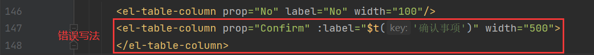

#### 命名规范

- views 文件名：小驼峰
- script 变量和方法名：小驼峰
- css 选择器：小驼峰
- 常量：全大写

#### 注释

- template 中代码注释

    

- script 中 import 语句注释


- script 中 const 属性注释

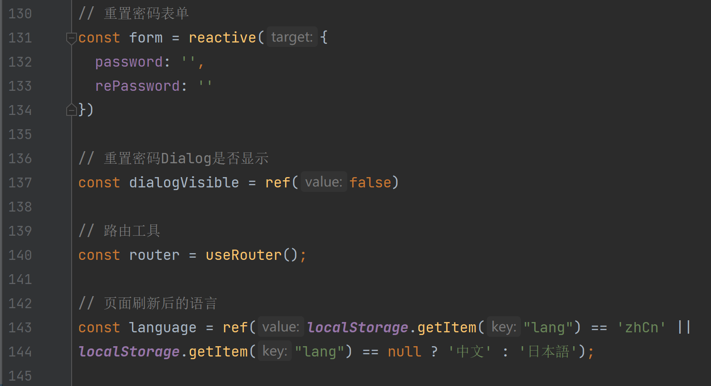

- script 中方法注释


- style 中注释：需标明生效位置


- `on-`、`before-` 开头的属性后对应的方法都叫做 `钩子方法`，`v-on`、`@` 开头的属性对应的方法叫做 `事件` 


#### 换行

- 分行书写标签属性时，`>` 或 `/>` 需单独一行

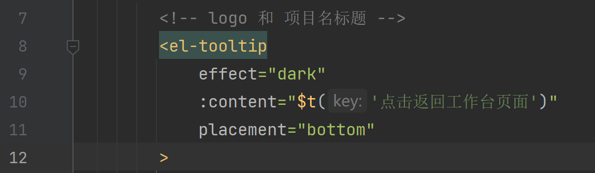

- template、script、style 标签之间空一行，代码文件最后一行空一行

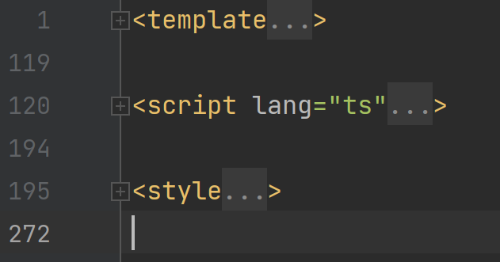

- 变量与变量之间、方法与方法之间、式样与式样之间，空一行


#### 分号

- script 中写的代码结尾都应添加分号，方法中的语句都应以分号结尾

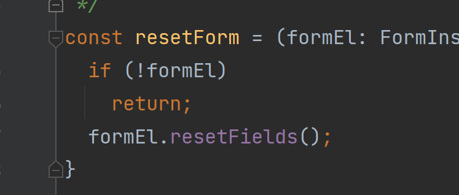

#### 其它

- 图标的用法

    - 禁止使用 `:icon` 属性指定图标
    - elementPlus 推荐使用 `el-icon` 标签指定图标，且不需要单独导入

    

- ts 说变量无法解析？

    - 因为这个变量没有显式定义在 resp 中

    

    - 可以使用 `data['variable']` 的方式取得

    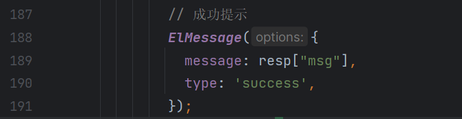


### 后端代码规范

- 后端写的代码中不要出现业务上的常量，如需获取要在 constValue.properties 文件中定义使用 @PropertySource 配合 @Value 获取


#### 命名规范

- Controller 及 Service 层接口及方法命名风格：add、remove、edit、get（getXxxxList、getXxxByXxx）
- Mapper 层方法命名风格：insert、delete、update、select（count）


- 类变量命名：类名小驼峰


- 功能性常量定义：全大写、`_` 分隔


#### 注释

- 每个类的 class 语句上方书写文档注释，并注明作者和创建时间


- 在控制层的每个方法上方书写文档注释，并注明接口作用、参数内容、返回值功能


- 在服务层接口的每个方法上方书写文档注释，并注明接口作用、参数内容、返回值功能

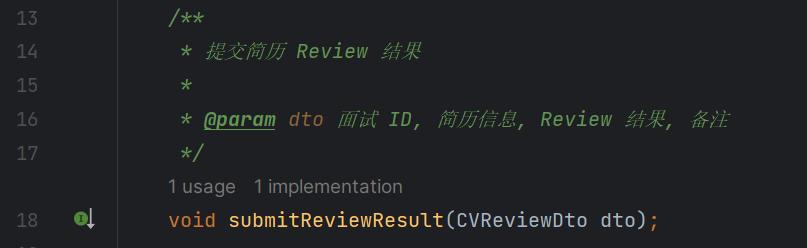

- 在数据访问层接口的每个方法上方书写文档注释，并注明接口作用、参数内容、返回值功能


- 在服务层实现类中书写单行注释，要求只看注释就能明白业务的执行流程


#### 换行

- 保证每一个类变量、方法前后都有一个空行

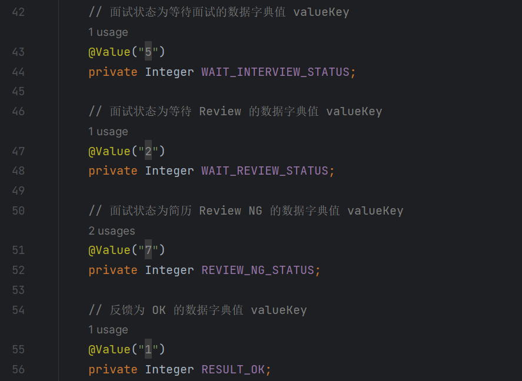

- 每个文件最后要有一个空行

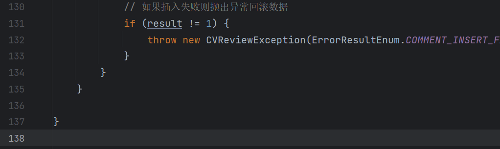

- 较长的业务可按照逻辑添加空行


### 式样书规范

- 各画面 ID
    - 登录画面：RMSL0101
    - 菜单画面：RMSM0101
    - 工作台画面：RMSW0101
    - 简历上传画面：RMSU0101
    - 面试一览画面：RMSV0101
    - 面试Review画面：RMSR0101
    - 面试反馈画面：RMSF0101
    - 历史面试画面：RMSH0101
    - 数据字典类型管理画面：RMSD0101
    - 数据字典值管理画面：RMSD0201
    - 用户管理画面：RMSU0201
    - 角色管理画面：RMSU0202
    - 权限管理画面：RMSU0203
    - 部门管理画面：RMSD0301


## 前端遇到的问题

### Vue3 如何打包成能直接运行的格式

1. 在 vite.config.js 中设置 base 为相对路径


2. 添加 plugin-legacy 插件生成传统浏览器的 chunk 及与其相对应 ES 语言特性方面的 polyfill

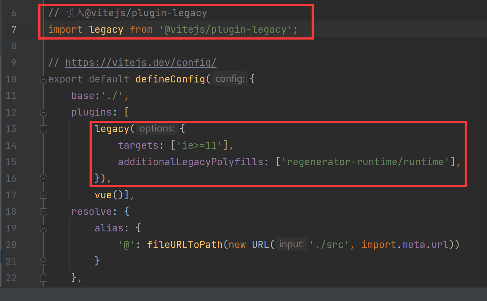

3. 将 router 文件配置为根据 hash 匹配路径


4. 执行打包命令

```bash
npm run build
```

5. 修改打包 dist 文件夹中的 index.html
    - 删除红框部分代码


### Vue 如何修改 Element-Plus 的底层样式

- 添加 `:deep()` 

```css
:deep(.el-scrollbar__bar.is-horizontal>div) {
  height: 10px;
  margin-top: -5px;
}
```


### Vue3 如何修改 reactive 数组做响应式处理

- 不使用数据接口的情况

    ```ts
    const xxxList = reactive({
    	arr: []
    })
    ```

    - 在 reactive 里面再封装一层，这样就可以直接 `xxxList.arr = xxx` 修改数组

- 使用数据接口的情况

    ```
    const xxxList = reactive<xxxInterface[]>([]);
    ```

    - 使用 push 方法将展开的数据传进数组中: `xxxList.push(...resp.data);` 

    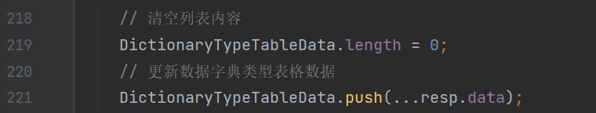


### Vue3 ref 和 reactive 的区别

- `ref` 是用来定义基本类型和数组类型和对象类型的，使用 ref 定义数组或对象类型时内部还是会调用 reactive 转为代理对象
- `reactive` 一般用来定义对象类型，它是通过使用 **Proxy（代理模式）** 来实现响应式, 并通过 **Reflect** 操作 **源对象** 内部的数据


### Vue @click 事件只点击一次却执行多次

- 在为 `v-for` 的标签添加 `@click` 事件之后，每次点击都会被执行多次，暂时不了解因为什么

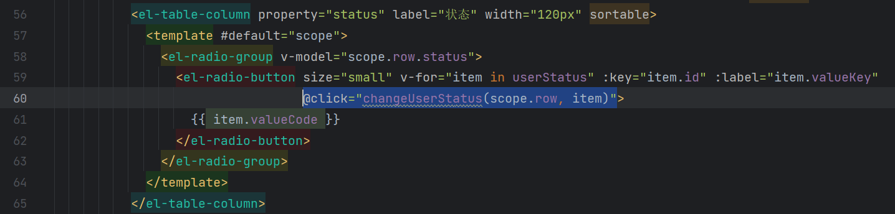

- 【解决】: 为事件添加 `$event` 参数，并执行方法即可解决

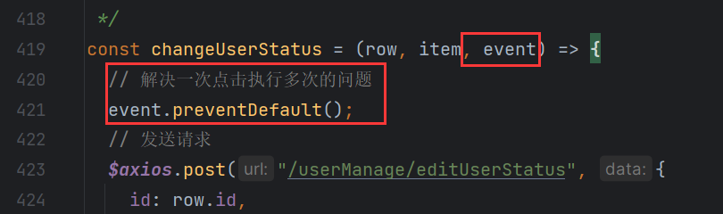


### npm install 下载缓慢

- 因为服务器在国外，大陆有时候连接不上
- 执行这条命令修改服务器为淘宝的就好了

```bash
npm config set registry https://registry.npm.taobao.org 
```


## 后端遇到的问题

### axios 传递的参数结尾多了一个等于号 '=' ?

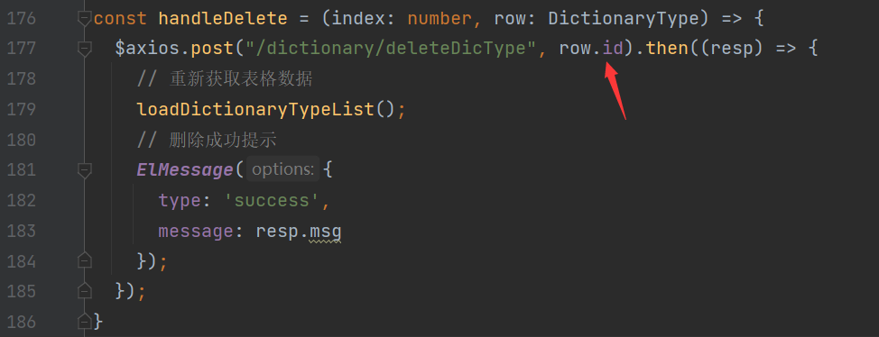

- 因为前端发送 axios 请求时，默认的请求头 headers 内部的 Content-Type 是 application/x-www-form-urlencoded;charset=UTF-8

- 这是一种键值对的数据结构，传输过程中把 json 当作 key，而 value 当作空值，所以传输到后端会多出等号

- 【解决】

    - 可以通过修改前端和后端的数据编码格式解决

    - 可以在前端用花括号包起来作为 json 传输，后端用 Map 接收

    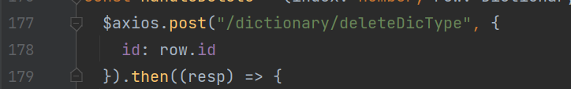

    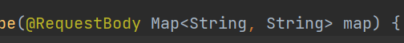


### mybatis 的 resultMap 映射问题

- 当我将 `id` 当作参数传给另一个查询的时候，这个主查询的 id 结果都为 null ？
    - 【解决】因为 mybatis 理解为这个属性应该被映射为别的值就没有给这个属性赋值，再次指定这个属性的映射即可

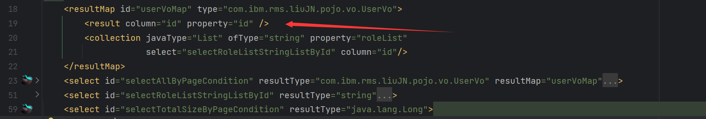


### 大写字母开头传值 springboot 为 null 

- 因为 springboot 默认按照小驼峰解析 json 的值

    - 【解决】将前端改为小驼峰即可，或使用 `@JsonProperty` 注明属性名

    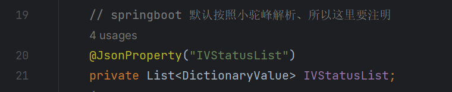


## 服务器部署遇到的问题

### vue 项目部署到 nginx 服务器后，除首页外刷新都跳转 404 页面

- 为 nginx 设置转发

```ini
try_files $uri $uri/ /index.html;
```


### 长时间不进行操作 redis 抛出异常

- 异常信息：

    ```bash
    org.springframework.data.redis.RedisSystemException: Redis exception; nested exception is io.lettuce.core.RedisException: java.io.IOException: 远程主机强迫关闭了一个现有的连接。
    ```

    - 似乎是因为 ssh 的连接超时造成的, 根据网上的方法设置了 ssh `超时时长` 和 `重试次数` 但似乎无效

    

- 2022-12-16 07:21:55 证实无效果，重试次数设置过高反而造成多次无响应之后才提示登录过期


## 项目特色

- 主要
    - 灵活性、可扩展性
    - docker 部署、域名解析
- 数据库
    - 标准的 RBAC 模型结构
    - MySQL8 的 UUID
    - 数据字典
    - 索引
- 前端
    - axios 的前后置拦截
    - 错误页面
    - Vue3 + Ts
    - transition 过度动画、v-loading
    - i18n
    - 组件化开发
    - 未使用任何前端模板
    - 实用的工作台画面
- 后端
    - [x] minio、kkfileview 简历预览
    - [x] springSecurity 安全框架、一用户可同时拥有多角色
    - [x] Redis 用户认证、令牌自动续约、数据字典缓存、缓存击穿的解决
    - [x] 实时的用户锁定
    - [x] 全局异常捕获、返回值枚举类、properties 配置文件
    - [x] 事务、乐观锁
    - [x] POI: easyExcel 数据导出
    - [x] RabbitMQ 邮件


