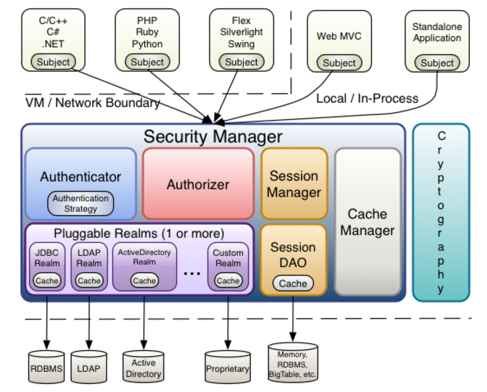
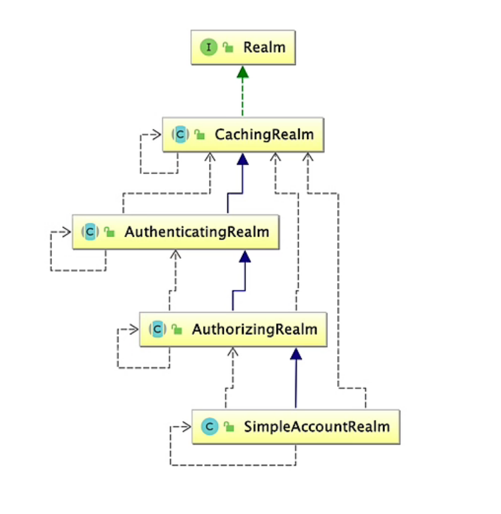
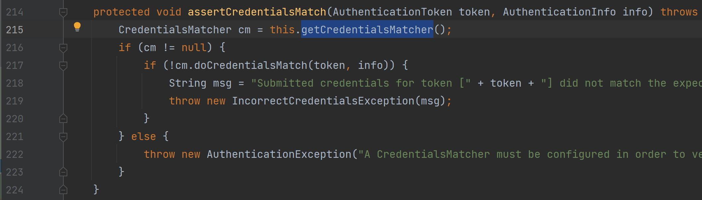
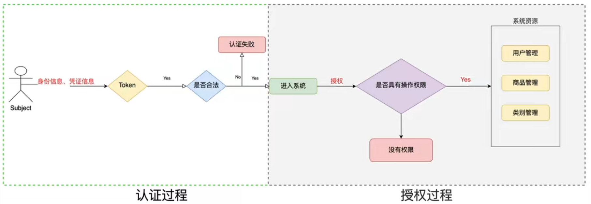

# Shiro自学笔记md版


# Shiro

> 大连交通大学 信息学院 刘嘉宁
>
> 笔记摘自 编程不良人 小陈


## 权限管理

- 权限管理属于系统安全的范畴，实现 **对用户访问系统的控制**
- 按照 **安全规则** 或 **安全策略** 控制用户只能访问自己被授权的资源

1. 身份认证：判断当前访问的用户是否具有访问系统的权限（用户名、口令）

2. 授权：判断通过认证的用户是否具有访问系统资源的权限（访问控制）


## Shiro

- 是一款 Java 权限管理框架，由 Apache 公司开发
- 相比 SpringSecurity 框架没有其功能强大，但相对简单、易用 

### Shiro 核心架构

- Security Manager：安全管理器
    - Autheniticator：认证器
    - Authorizer：授权器
    - Session Manager：会话管理器
    - Session Dao：会话 Dao（对会话数据进行增删改查持久化和内存的存储）
    - Cache Manager：缓存管理器（存储用户认证授权数据）
    - Pluggable Realms：可扩展的域（获取认证授权数据，完成认证授权操作）
- Cryptography：算法匹配器（提供一些常用算法、工具类）




## Shiro 认证

判断用户是否为系统的合法用户，判断用户的用户名和口令是否和系统中的一致

- Shiro 认证的关键对象

    1. Subject 主体：进行认证的都称为主体（用户、程序）
    2. Principal 身份信息：主体进行认证的标识，要具有唯一性，可以有多个身份但必须有一个主身份（用户名、ID 号等）
    3. Credential 凭证信息：只有主体知道的安全信息（密码、证书）

- 认证流程

    - 将用户的身份信息和凭证信息生成 Token 令牌，验证 Token 是否正确，做处理

    


## Shiro 使用


1. 导入依赖

```xml
<!-- https://mvnrepository.com/artifact/org.apache.shiro/shiro-core -->
<dependency>
  <groupId>org.apache.shiro</groupId>
  <artifactId>shiro-core</artifactId>
  <version>1.9.0</version>
</dependency>
```

2. 在 resources 目录下创建 Shiro 的配置文件 shiro.ini

```ini
[users]
xiaochen:123
zhangsan:123456
lisi:789
```

3. 创建测试类

```java
public static void main(String[] args) {
    //创建安全管理器对象
    DefaultSecurityManager securityManager = new DefaultSecurityManager();
    //为安全管理器设置 realm
    securityManager.setRealm(new IniRealm("classpath:shiro.ini"));
    //使用安全工具类设置安全管理器
    SecurityUtils.setSecurityManager(securityManager);
    //获得当前登录的主体对象
    Subject subject = SecurityUtils.getSubject();
    //创建用户名密码的令牌
    UsernamePasswordToken token = new UsernamePasswordToken("xiaochen", "123");

    try {
        //(boolean) 判断是否认证成功
        System.out.println(subject.isAuthenticated());
        //用户认证, 认证失败会抛出异常
        subject.login(token);
        System.out.println(subject.isAuthenticated());
    } catch (UnknownAccountException e) {
        System.out.println("未知的账号: 用户名不存在");
    } catch (IncorrectCredentialsException e) {
        System.out.println("无效的凭证信息: 密码错误");
    }
}
```

> 认证流程：
>
> 1. 进入 DelegatingSubject 验证是否有会话
> 2. 调用内部的 securityManager 的 login 方法
> 3. 进入 ModularRealmAuthenticator 的内部验证是否配了 Realm 验证是否支持 token 
> 4. 进入其内部代理的 AuthenticatingRealm 类的 doGetAuthenticationInfo 方法查看缓存中是否存在 token 
> 5. 调用子类 SimpleAccountRealm 类的 doGetAuthenticationInfo 方法开始校验
> 6. 调用 getUser 方法通过用户名查询账户（会抛出 UnknownAccountException 账户不存在异常）
> 7. doGetAuthenticationInfo 方法继续验证是否锁定，验证密码是否过期
> 8. 回到 AuthenticatingRealm 类的 assertCredentialsMatch 方法使用内部代理的 CredentialsMatch 验证密码是否匹配
>
> ---
>
> 1. 由 SimpleAccountRealm 类的 doGetAuthenticationInfo 方法完成对用户名的校验
> 2. 由 SimpleAccountRealm 的父类 AuthenticatingReam 类的 assertCredentialsMatch 方法完成对密码的校验
> 3. 由 SimpleAccountRealm 类的 doGetAuthorizationInfo 方法完成授权
>
> 


## 自定义 Realm 

- 自定义 Realm 类继承 AuthorizingRealm
- 授权是 每次查询权限 时调用，在授权方法中查询用户的权限信息
- 认证中的用户名由此类来判断，密码由 SimpleAuthenticationInfo 的父类判断、抛出异常

```java
public class CustomerRealm extends AuthorizingRealm {
    //授权
    @Override
    protected AuthorizationInfo doGetAuthorizationInfo(PrincipalCollection principals) {
        return null;
    }

    //认证
    @Override
    protected AuthenticationInfo doGetAuthenticationInfo(AuthenticationToken token)
            throws AuthenticationException {

        //获取token中的身份信息
        String principal = (String) token.getPrincipal();
        //从数据库中获取用户名密码信息做判断
        if ("xiaochen".equals(principal)){
                                                //用户名     密码    当前Realm名字
            return new SimpleAuthenticationInfo(principal, "123", this.getName());
        }
        return null;
    }
}
```


## Shiro 的加密算法

- MD5 算法

    - MD5 算法不可逆，一个明文对应一个密文( 16进制，32位长度的字符串 )
    - 一般用来加密、签名( 校验和 )
    - MD5 加盐：就是在明文加上随机的字符后再进行加密

    ```java
    //							   明文  +  盐  +  hash散列次数
    Md5Hash md5Hash = new Md5Hash("123", "X*1oq", 1024); //默认盐加在明文前
    System.out.println(md5Hash.toHex());
    ```

- Shiro 中的密码校验机制使用的是 AuthenticatingReam 类的 assertCredentialsMatch 方法的底层调用的是自身代理的 CredentialsMatcher 对象，所以在创建自定义的 Realm 类时，可以为其 set 一个 CredentialsMatcher ：HashedCredentialsMatcher



自定义 Realm 类

```java
public class CustomerRealm extends AuthorizingRealm {
    //授权
    @Override
    protected AuthorizationInfo doGetAuthorizationInfo(PrincipalCollection principalCollection) {
        return null;
    }

    //认证
    @Override
    protected AuthenticationInfo doGetAuthenticationInfo(AuthenticationToken token)
            throws AuthenticationException {

        //获取token中的用户名
        String principal = (String) token.getPrincipal();
        //从数据库中获取用户名密码信息做判断
        if ("xiaochen".equals(principal)){
                                                //用户名
            return new SimpleAuthenticationInfo(principal, 
                                                //加salt后的密码
                                                "1846940e9a8bf8560e2311ec98a55a43", 
                                                //账户对应的随机盐
                                                ByteSource.Util.bytes("X*1oq"), 
                                                //当前Realm名字
                                                this.getName());
        }
        return null;
    }
}
```

测试使用

```java
    DefaultSecurityManager securityManager = new DefaultSecurityManager();

    //创建自定义的 Realm 实例
    CustomerRealm realm = new CustomerRealm();
    //创建 Shiro 提供的 CredentialsMatcher
    HashedCredentialsMatcher hashedCredentialsMatcher = new HashedCredentialsMatcher();
    //设置其加密方式
    hashedCredentialsMatcher.setHashAlgorithmName("md5");
    //设置散列次数
    hashedCredentialsMatcher.setHashIterations(1024);
    //为自定义的 Realm 设置 CredentialsMatcher
    realm.setCredentialsMatcher(hashedCredentialsMatcher);

    securityManager.setRealm(realm);
    SecurityUtils.setSecurityManager(securityManager);
    Subject subject = SecurityUtils.getSubject();
    UsernamePasswordToken token = new UsernamePasswordToken("xiaochen", "123");
    try {
        subject.login(token);
        System.out.println("成功登录");
    } catch (AuthenticationException e) {
        e.printStackTrace();
    }
```


## Shiro 授权

判断用户是否为系统的合法用户，判断用户的用户名和口令是否和系统中的一致

- Shiro 授权的关键对象
    1. Subject 主体：主体要访问的系统中的资源（页面、图片）
    2. Resource 资源：资源类型（商品信息） 与 资源实例（编号为 001 的商品信息）
    3. Permission 权限/许可：主体对资源的操作权限，通过权限可知对哪些资源有哪些操作许可（查询权限、修改权限）
- 授权流程
    - 为用户授对应权限，当用户操作资源时，判断其是否有权限



- 授权方式：
    - 基于角色的访问控制：RBAC（Role-Based Access Control）以角色为中心进行访问控制
    - 基于资源的访问控制：RBAC（Resource-Based Access Control）已资源为中心进行访问控制
- 权限字符串：
    - `资源标识符 : 操作 : 资源实例标识符` 意思是对哪个资源的哪个实例具有什么操作
    - 用户创建：`user:create`
    - 用户修改实例 001 的权限：`user:update:001`
    - 用户对实例 001 的所有权限：`user:*:001`


## Shiro 授权的使用

- doGetAuthorizationInfo 授权方法在每次 查询权限信息时 被调用

```java
public class CustomerRealm extends AuthorizingRealm {
    //授权
    @Override
    protected AuthorizationInfo doGetAuthorizationInfo(PrincipalCollection principals) {
        //获取身份信息
        String primaryPrincipal = (String) principals.getPrimaryPrincipal();
        System.out.println(primaryPrincipal);

        //将数据库中查询出的角色信息赋给权限对象
        SimpleAuthorizationInfo simpleAuthorizationInfo = new SimpleAuthorizationInfo();
        simpleAuthorizationInfo.addRole("user");
        simpleAuthorizationInfo.addRole("admin");
        
        //将数据库中查询出的权限信息赋给权限对象
        simpleAuthorizationInfo.addStringPermission("user:*:01");
        simpleAuthorizationInfo.addStringPermission("order:create");
        
        return simpleAuthorizationInfo;
    }

    //认证
    @Override
    protected AuthenticationInfo doGetAuthenticationInfo(AuthenticationToken token)
            throws AuthenticationException {
        return null;
    }
}
```

测试使用

```java
    public static void main(String[] args) {
        DefaultSecurityManager securityManager = new DefaultSecurityManager();

        //创建自定义的 Realm 实例
        CustomerRealm realm = new CustomerRealm();
        //创建 Shiro 提供的 CredentialsMatcher
        HashedCredentialsMatcher hashedCredentialsMatcher = new HashedCredentialsMatcher();
        //设置其加密方式
        hashedCredentialsMatcher.setHashAlgorithmName("md5");
        //设置散列次数
        hashedCredentialsMatcher.setHashIterations(1024);
        //为自定义的 Realm 设置 CredentialsMatcher
        realm.setCredentialsMatcher(hashedCredentialsMatcher);

        securityManager.setRealm(realm);
        SecurityUtils.setSecurityManager(securityManager);
        Subject subject = SecurityUtils.getSubject();
        UsernamePasswordToken token = new UsernamePasswordToken("xiaochen", "123");
        try {
            subject.login(token);
            System.out.println("成功登录");
        } catch (AuthenticationException e) {
            e.printStackTrace();
        }

        //如果成功认证
        if (subject.isAuthenticated()){
            //该用户是否有 admin 的权限(boolean)
            System.out.println(subject.hasRole("admin"));
            //该用户是否分别有 列表中 的权限(boolean[])
            boolean[] booleans = subject.hasRoles(Arrays.asList("admin", "super"));
            for (boolean b : booleans) {
                System.out.print(b+" ");
            }
            //该用户是否有所有 列表中 的权限(boolean)
            System.out.println(subject.hasAllRoles(Arrays.asList("admin", "user")));
            System.out.println();
            
            System.out.println("=============================");
            
            //该用户是否有 字符串 中的权限
            System.out.println("所有权限"+subject.isPermitted("user:*:*"));
            System.out.println("创建01权限"+subject.isPermitted("user:create:01"));
            //该用户分别具有这些权限?
            boolean[] permitted = subject.isPermitted("user:*:02", "order:*:02", "order:update:01");
            for (boolean b : permitted) {
                System.out.print(b+" ");
            }
            System.out.println();
            //该用户是否同时具有这些权限?
            System.out.println(subject.isPermittedAll("user:create:01", "order:create:02"));
        }
    }
```


## 实战补充

> Shiro 提供了 ShiroFilter 过滤器，实现对每次请求的认证操作

1. 设置 SpringMVC 及 Shiro 的依赖

```xml
    <!-- https://mvnrepository.com/artifact/javax.servlet/javax.servlet-api -->
    <dependency>
        <groupId>javax.servlet</groupId>
        <artifactId>javax.servlet-api</artifactId>
        <version>4.0.1</version>
        <scope>provided</scope>
    </dependency>

    <!-- https://mvnrepository.com/artifact/org.springframework/spring-webmvc -->
    <dependency>
        <groupId>org.springframework</groupId>
        <artifactId>spring-webmvc</artifactId>
        <version>5.3.18</version>
    </dependency>

    <!-- https://mvnrepository.com/artifact/org.apache.shiro/shiro-spring -->
    <dependency>
        <groupId>org.apache.shiro</groupId>
        <artifactId>shiro-spring</artifactId>
        <version>1.9.0</version>
    </dependency>
```

2. 编写 web.xml 文件内容

```xml
    <!-- shiro过虑器，DelegatingFilterProxy通过代理模式 关联spring容器中的bean和filter -->
    <filter>
        <filter-name>shiroFilter</filter-name>
        <filter-class>org.springframework.web.filter.DelegatingFilterProxy</filter-class>
        <!-- 设置true由servlet容器控制filter的生命周期 -->
        <init-param>
            <param-name>targetFilterLifecycle</param-name>
            <param-value>true</param-value>
        </init-param>
        <!-- 设置spring容器filter的bean id，如果不设置则找与filter-name一致的bean-->
<!--    <init-param>-->
<!--      <param-name>targetBeanName</param-name>-->
<!--      <param-value>shiroFilter</param-value>-->
<!--    </init-param>-->
    </filter>
    <filter-mapping>
        <filter-name>shiroFilter</filter-name>
        <url-pattern>/*</url-pattern>
    </filter-mapping>    
```

3. 编写 Spring 配置文件内容

```xml
	<!-- 设置自动注入依赖   -->
    <context:component-scan base-package="com.test" />

	<!-- 设置视图解析器, 将默认前缀设为项目根目录, 默认后缀为 .html -->
    <bean class="org.springframework.web.servlet.view.InternalResourceViewResolver" >
        <property name="prefix" value="/" />
        <property name="suffix" value=".html" />
    </bean>
```

4. 编写 Shiro 的配置类

```java
@Configuration
public class ShiroConfig {

    //1.创建 ShiroFilter 负责拦截所有请求
        //将 name 设为与 web.xml 中 filter-name 一致, 让过滤器自动找到这个 bean
    @Bean(name = "shiroFilter")
    public ShiroFilterFactoryBean getShiroFilterFactoryBean(DefaultWebSecurityManager defaultWebSecurityManager){
        
        //创建过滤工厂实例, 设置默认安全管理器
        ShiroFilterFactoryBean shiroFilterFactoryBean = new ShiroFilterFactoryBean();
        shiroFilterFactoryBean.setSecurityManager(defaultWebSecurityManager);

        Map<String, String> map = new HashMap<>();
        
        //配置系统的受限资源: 所有请求
        map.put("/index.html", "authc"); // authc 代表资源需要认证和授权
        //配置系统的公共资源
		map.put("/user/login", "anon"); 
        
        shiroFilterFactoryBean.setFilterChainDefinitionMap(map);
            //设置被拦截时重定向的页面
        shiroFilterFactoryBean.setLoginUrl("/login.html");

        return shiroFilterFactoryBean;
    }

    //2.创建安全管理器
    @Bean
    public DefaultWebSecurityManager getDefaultWebSecurityManager(Realm realm){
        
        DefaultWebSecurityManager defaultWebSecurityManager = new DefaultWebSecurityManager();
        defaultWebSecurityManager.setRealm(realm);
        
        return defaultWebSecurityManager;
    }

    //3.创建自定义 Realm
    @Bean
    public Realm getRealm(){
        
        return new CustomerRealm();
    }
}
```

> 配置 受限、公共 资源时设置的简称（Shiro默认的过滤器）
>
> | 配置缩写          | 对应的过滤器                   | 功能                                                         |
> | ----------------- | ------------------------------ | ------------------------------------------------------------ |
> | anon              | AnonymousFilter                | 指定 url 可以未认证时访问                                    |
> | authc             | FormAuthenticationFilter       | 指定 url 需要认证 `username` `password` `rememberMe` 等参数。但一般不用这个，自定义逻辑可以更好的定制出错的返回信息 |
> | authcBasic        | BasicHttpAuthenticationFilter  | 指定 url 需要 basic 登录                                     |
> | logout            | LogoutFilter                   | 配置指定 url 即可, 退出, 登出过滤器                          |
> | noSessionCreation | NoSessionCreationFilter        | 禁止创建会话                                                 |
> | perms             | PermissionsAuthorizationFilter | 需要指定权限才能访问                                         |
> | port              | PortFilter                     | 需要指定端口才能访问                                         |
> | rest              | HttpMethodPermissionFilter     | 将 http 请求方法转化成相应的动词来构造一个权限字符串         |
> | roles             | RolesAuthorizationFilter       | 需要指定角才能访问                                           |
> | ssl               | SslFilter                      | 需要 https 请求才能访问                                      |
> | user              | UserFilter                     | 需要已登录或 '记住我' 的用户才能访问                         |

5. 编写认证授权的 Realm 类内容

```java
public class CustomerRealm extends AuthorizingRealm {
    @Override
    protected AuthorizationInfo doGetAuthorizationInfo(PrincipalCollection principalCollection) {
        return null;
    }

    @Override
    protected AuthenticationInfo doGetAuthenticationInfo(AuthenticationToken token)
            throws AuthenticationException {
        
        String username = (String) token.getPrincipal();
        if ("xiaochen".equals(username)) {
            return new SimpleAuthenticationInfo(username, "123", this.getName());
        }
        return null;
    }
}
```

6. 编写控制层内容

```java
@Controller
@RequestMapping("/test")
public class MainController {

    //http://localhost:8080/springMVCWithShiro/test/login.do
    @RequestMapping("/login.do")
    public User login(@RequestBody User user){
        System.out.println(user.getUsername()+"  ::  "+user.getPassword());
        Subject subject = SecurityUtils.getSubject();
        try {
            subject.login(new UsernamePasswordToken(user.getUsername(), user.getPassword()));
        }catch (UnknownAccountException e){
            System.out.println("用户名错误");
        }catch (IncorrectCredentialsException e){
            System.out.println("密码错误");
        }
        return user;
    }

}
```

> `@RequestBody` 注解：
>
> - 在使用 axios 的 post 请求时，向服务器传的是一个 JSON 字符串
>
> - 标注此注解由 jackson 解析
>
> - 同时要求实体类中必须要有无参构造方法, set / get 系列方法


