# SpringBoot自学笔记md版


# SpringBoot

> 大连交通大学 信息学院 刘嘉宁 2021-11-15
>
> 笔记摘自 bjpwernode 秦世国


- SpringBoot 框架，整合了 Spring + SpringMVC + MyBatis 框架，简化开发
- SpringBoot 抛弃了繁琐的 xml 配置过程，采用大量默认配置，简化开发

- 使用 SpringBoot 可以非常容易和快速的创建基于 Spring 框架的应用程序


## SpringBoot 的特性

1. 能够快速创建基于 Spring 的应用程序
2. 能够直接使用 java main 方法启动内嵌的 Tomcat 服务器运行 SpringBoot 程序，不需要外置 Tomcat 再部署 war 包文件
3. 提供约定的 starter POM（起步依赖）简化 Maven 配置，引入相关依赖包，消除版本冲突问题
4. 自动化配置，根据项目的 Maven 依赖配置，Spring boot 自动配置整合 ssm 
5. 提供了程序的健康检查等功能
6. 基本可以抛弃XML配置文件，采用注解配置


## SpringBoot 的四大核心

1. 起步依赖
    - 根据需要的功能自动配置 Maven 依赖
2. 自动配置
    - 根据起步依赖自动提供相关配置
3. Actuator
    - 健康检查机制，可以看到 SpringBoot 运行状态信息
4. 命令行界面
    - 主要针对 Groovy（一种基于 JVM 的敏捷开发语言）使用


## 搭建 SpringBoot 项目

- 在创建 SpringBoot 模块时确保电脑联网，确认 Server URL 为：`start.springboot.io`


- 选择起步依赖


- 项目结构


- 编写控制器
    - 因为这里控制器类使用的不是 `@Controller` 注解，所以其中方法返回值为页面的输出流信息，并不是对页面的请求转发
    - `@RestController` 是一个复合注解，相当于为所有方法加上了 `@ResponseBody`


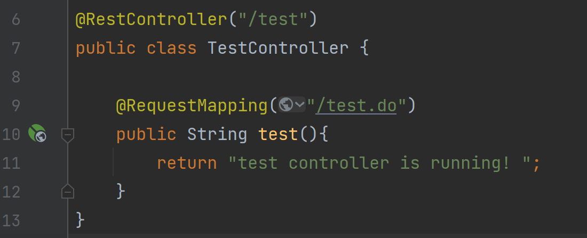

- 启动 SpringBoot 自带的 Tomcat 服务器


- 成果


### @SpringBootApplication 注解

- 该注解为 SpringBoot 的==核心注解==
- 该注解标注的类为 SpringBoot 的程序入口类
- SpringBoot 会扫描当前类 同级路径 以及 子孙路径 中所有标注了 SpringBoot 注解的类
- 主要作用是开启 SpringBoot 自动配置


### 分析 主方法内容 

`SpringApplication.run(SpringBootTestApplication.class, args);` : 启动 SpringBoot 应用

- 运行此 run 方法后，会返回 Spring 的应用上下文 ApplicationContext

- 由于启动的是 WEB 应用，因此启动时会同时启动内嵌的 Tomcat 服务器
- 默认端口号为 8080，默认应用上下文路径为 ' '（访问时无项目名）


### 分析 pom.xml 文件内容 

pom.xml 中的依赖：

```xml
<dependencies>
    <!--web项目环境的起步依赖-->
    <dependency>
        <groupId>org.springframework.boot</groupId>
        <artifactId>spring-boot-starter-web</artifactId>
    </dependency>
    <!--测试环境的起步依赖-->
    <dependency>
        <groupId>org.springframework.boot</groupId>
        <artifactId>spring-boot-starter-test</artifactId>
        <scope>test</scope>
    </dependency>
</dependencies>
```


在 ` <parent>` 标签中可以查看当前项目父项目 `spring-boot-starter-parent-2.5.6.pom` 的配置信息：

```xml
<properties>
    <!--指定项目JDK版本-->
    <java.version>1.8</java.version>
    <!--指定输入的字符集编码格式-->
    <project.build.sourceEncoding>UTF-8</project.build.sourceEncoding>
    <!--指定输出的字符集编码格式-->
    <project.reporting.outputEncoding>UTF-8</project.reporting.outputEncoding>
</properties>
```

```xml
<build>
    <!--资源文件的路径、命名规范格式-->
    <resources>
      <resource>
        <directory>${basedir}/src/main/resources</directory>
        <filtering>true</filtering>
        <includes>
          <include>**/application*.yml</include>
          <include>**/application*.yaml</include>
          <include>**/application*.properties</include>
        </includes>
      </resource>
      <resource>
        <directory>${basedir}/src/main/resources</directory>
        <excludes>
          <exclude>**/application*.yml</exclude>
          <exclude>**/application*.yaml</exclude>
          <exclude>**/application*.properties</exclude>
        </excludes>
      </resource>
    </resources>
</build>
```

在**父项目**的 `<parent>` 标签中可以查看父项目父项目 `spring-boot-dependencies-2.5.6.pom` 的配置信息：

```xml
<!--依赖的版本控制-->
<properties>
    <!--mysql数据库版本-->
  	<mysql.version>8.0.27</mysql.version>
    <!--Spring框架版本-->
    <spring-framework.version>5.3.12</spring-framework.version>
    .....
</properties>
```

- 这些都可以在当前项目的 pom.xml 中覆盖修改


## 属性配置文件

- 用于改变 SpringBoot 的默认运行行为
- 可以通过这个文件改变 SpringBoot 的默认行为，例如 Tomcat 的默认端口号、上下文访问路径

1. application.properties 

```properties
# 这里是 SpringBoot 的配置文件，可以通过这个文件改变 SpringBoot 的默认行为，例如 Tomcat 的默认端口号、上下文访问路径

# 设置 Tomcat 服务器端口号为 9100
server.port=9100
# 设置人下文访问路径(项目名)为 boot
server.servlet.context-path=/boot
```

2. application.yml

```yaml
# yml/yaml 和 properties 一样，也是 SpringBoot 的配置文件，不过 yml 文件更具层次感

server:
  port: 9100
  servlet:
    context-path: /boot
```

- properties 和 yml 文件同时存在时，properties 文件的优先级更高


### 多环境配置

```properties
# 激活配置文件，相当于把 dev 中的内容拷贝到这（多文件可以逗号分割）
spring.profiles.active=online
```

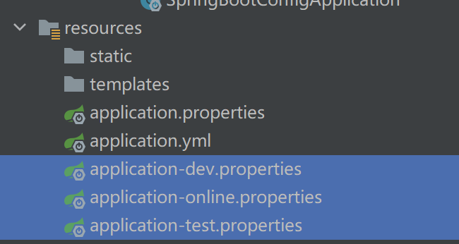


### 自定义属性 @Value

- 在 application 类可识别的任何类中都可以使用 `@Value(${属性名})` 为变量赋值

```properties
# 注意：不能使用中文，不能使用敏感词如 name...
stuName = zhangsan
stuAge = 24
```


### 为对象注入属性 @ConfigurationProperties

- 在类上方标注注解 `@ConfigurationProperties(prefix = "前缀")` 
- 此类必须有 get / set 方法，必须由 Spring 容器管理

```java
@ConfigurationProperties(prefix = "stu")
@Component
public class Student {
    private String name;
    private Integer age;

    public String getName() {
        return name;
    }

    public void setName(String name) {
        this.name = name;
    }

    public Integer getAge() {
        return age;
    }

    public void setAge(Integer age) {
        this.age = age;
    }
```

```properties
stu.name = zhangsan
stu.age = 24
```


### 中文乱码问题

- 当属性值为中文时会产生乱码问题，例：

```properties
stu.name = 张三
stu.age = 24
```

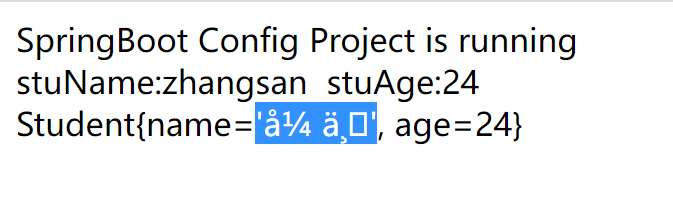

- 解决方案：使用unicode编码的中文：百度一下 "中文转unicode"

```properties
# 张三 => \u5f20\u4e09
stu.name = \u5f20\u4e09
stu.age = 24
```

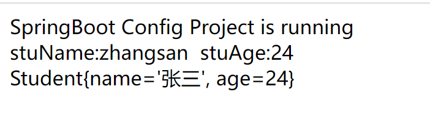

## SpringBoot 使用 JSP 文件

- SpringBoot 默认**不推荐 JSP**，想使用 JSP 需要在 pom.xml 手动导入相关依赖

```xml
<!--引入Spring Boot内嵌的Tomcat对JSP的解析包，不加解析不了jsp页面-->
<dependency>
   <groupId>org.apache.tomcat.embed</groupId>
   <artifactId>tomcat-embed-jasper</artifactId>
</dependency>
<!-- servlet依赖的jar包start ，可选-->
<dependency>
   <groupId>javax.servlet</groupId>
   <artifactId>javax.servlet-api</artifactId>
</dependency>
<!-- servlet依赖的jar包end -->

<!-- jsp依赖jar包start ，可选-->
<dependency>
   <groupId>javax.servlet.jsp</groupId>
   <artifactId>javax.servlet.jsp-api</artifactId>
   <version>2.3.1</version>
</dependency>
<!-- jsp依赖jar包end -->

<!--jstl标签依赖的jar包start ，可选-->
<dependency>
   <groupId>javax.servlet</groupId>
   <artifactId>jstl</artifactId>
</dependency>
<!--jstl标签依赖的jar包end -->
```

```xml
<resources>
    <resource>
        <!--源文件位置 -->
        <directory>src/main/webapp</directory>
        <!--编译到 META-INF/resourece 目录下不能随便写 这个路径表示编译后的根路径 -->
        <targetPath>META-INF/resources</targetPath>
        <includes>
            <!--要那些文件编译过去，**表示 webapp 目录下以及子孙目录，*.* 表示所有文件 -->
            <include>**/*.*</include>
        </includes>
    </resource>
</resources>
```

在 application.properties 文件中加入视图解析器

```properties
#视图解析器， / 相当于 src/main/webapp 目录
spring.mvc.view.prefix=/
spring.mvc.view.suffix=.jsp
```


## SpringBoot 整合 MyBatis

- 在创建项目时勾选 SQL  中的 MyBatis Framework 和 MySQL Driver，基础整合 SSM

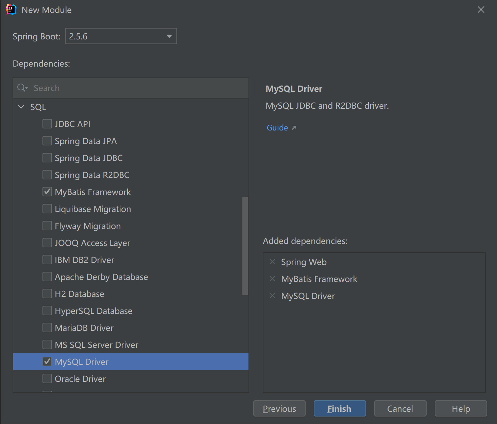

- 在 pom.xml 中修改 MySQL 版本

```xml
        <dependency>
            <groupId>mysql</groupId>
            <artifactId>mysql-connector-java</artifactId>
            <scope>runtime</scope>
            <!--指定MySQL驱动版本-->
            <version>8.0.27</version>
        </dependency>
```

- 添加 MyBatis 逆向工程插件

```xml
<plugin>
	<groupId>org.mybatis.generator</groupId>
	<artifactId>mybatis-generator-maven-plugin</artifactId>
	<version>1.3.6</version>
	<configuration>
		<!--配置文件的位置-->
		<configurationFile>GeneratorMapper.xml</configurationFile>
		<verbose>true</verbose>
		<overwrite>true</overwrite>
	</configuration>
</plugin>
```

- 在项目根目录下创建 `GeneratorMapper.xml` 逆向工程映射文件，并配置信息

```xml
<?xml version="1.0" encoding="UTF-8"?>
<!DOCTYPE generatorConfiguration
        PUBLIC "-//mybatis.org//DTD MyBatis Generator Configuration 1.0//EN"
        "http://mybatis.org/dtd/mybatis-generator-config_1_0.dtd">

<generatorConfiguration>

    <!-- 指定连接数据库的JDBC驱动包所在位置，指定到你本机的完整路径 -->
    <classPathEntry location="D:\Document\JDBC\mysql-connector-java-8.0.27.jar"/>

    <!-- 配置table表信息内容体，targetRuntime指定采用MyBatis3的版本 -->
    <context id="tables" targetRuntime="MyBatis3">

        <!-- 抑制生成注释，由于生成的注释都是英文的，可以不让它生成 -->
        <commentGenerator>
            <property name="suppressAllComments" value="true" />
        </commentGenerator>

        <!-- 配置数据库连接信息 -->
        <jdbcConnection driverClass="com.mysql.cj.jdbc.Driver"
                        connectionURL="jdbc:mysql://127.0.0.1:3306/springbootdb"
                        userId="root"
                        password="129807">
        </jdbcConnection>

        <!-- 生成model类，targetPackage指定model类的包名， targetProject指定生成的model放在eclipse的哪个工程下面-->
        <javaModelGenerator targetPackage="com.bjpn.springbootmybatis.model" targetProject="src/main/java">
            <property name="enableSubPackages" value="false" />
            <property name="trimStrings" value="false" />
        </javaModelGenerator>

        <!-- 生成MyBatis的Mapper.xml文件，targetPackage指定mapper.xml文件的包名， targetProject指定生成的mapper.xml放在eclipse的哪个工程下面 -->
        <sqlMapGenerator targetPackage="com.bjpn.springbootmybatis.mapper" targetProject="src/main/java">
            <property name="enableSubPackages" value="false" />
        </sqlMapGenerator>

        <!-- 生成MyBatis的Mapper接口类文件,targetPackage指定Mapper接口类的包名， targetProject指定生成的Mapper接口放在eclipse的哪个工程下面 -->
        <javaClientGenerator type="XMLMAPPER" targetPackage="com.bjpn.springbootmybatis.mapper" targetProject="src/main/java">
            <property name="enableSubPackages" value="false" />
        </javaClientGenerator>

        <!-- 数据库表名及对应的Java模型类名 -->
        <table tableName="t_user"
               domainObjectName="User"
               enableCountByExample="false"
               enableUpdateByExample="false"
               enableDeleteByExample="false"
               enableSelectByExample="false"
               selectByExampleQueryId="false"/>
    </context>

</generatorConfiguration>
```

- 在 application.properties 中配置数据库基本信息

```properties
# 指定 MySQL 驱动位置
spring.datasource.driver-class-name=com.mysql.cj.jdbc.Driver
spring.datasource.url=jdbc:mysql://127.0.0.1:3306/springbootdb?useUnicode=true&characterEncoding=utf8&useSSL=false
spring.datasource.username=root
spring.datasource.password=129807
```

- 双击 Maven 工具中的 mybatis-generator:generate


- 生成 mapper 包（mapper接口和mapper映射文件）及 model 包（实体类）

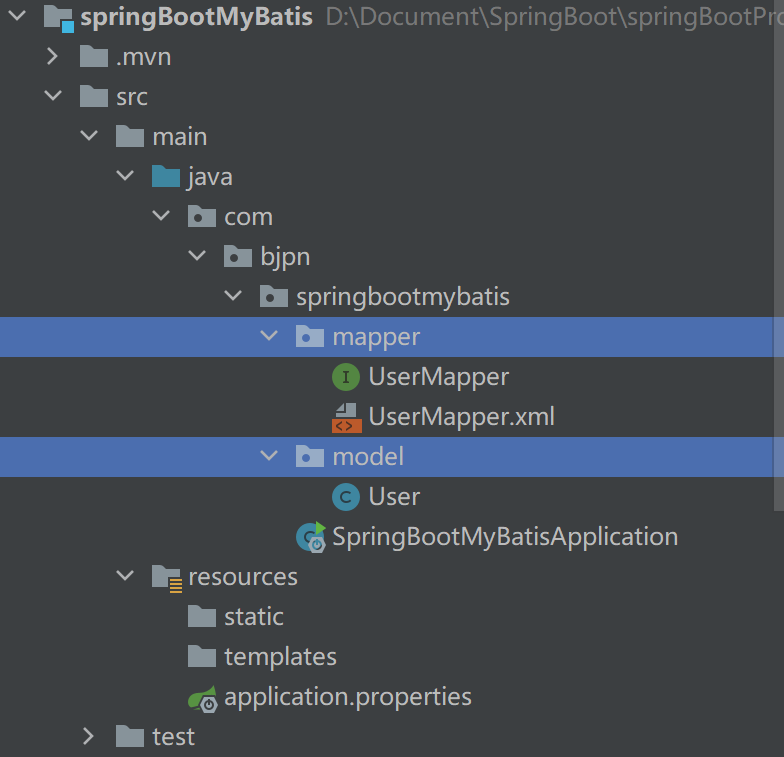

- 自动生成的默认 mapper 接口包含的功能
    - ==指定 MyBatis 的 mapper 映射文件位置==
        1. 在每一个 mapper 接口上标注 @Mapper 注解
        2. 在 SpringBoot 的主方法上标注 @MapperScan(basePackages = {"**mapper 包的 source root 路径**"}) 【推荐】
        3. 在 application.properties 中指定 Mybatis 映射文件的路径 `mybatis.mapper-locations=classpath:mapper/*.xml`


- 在 pom.xml 中添加指定资源路径，让java下所有 .xml 文件都参与编译

```xml
<resources>
  <resource>
    <directory>src/main/java</directory>
    <includes>
     <include>**/*.xml</include>
    </includes>
  </resource>
 </resources>
```


### 事务支持

- 在 SpringBoot 的主方法上标注注解 @EnableTransactionManagement 开启事务


- 在需要事务的 service 方法上标注注解 @Transactional
    - 在开启了事务的方法中抛出异常就会自动 rollback 回滚

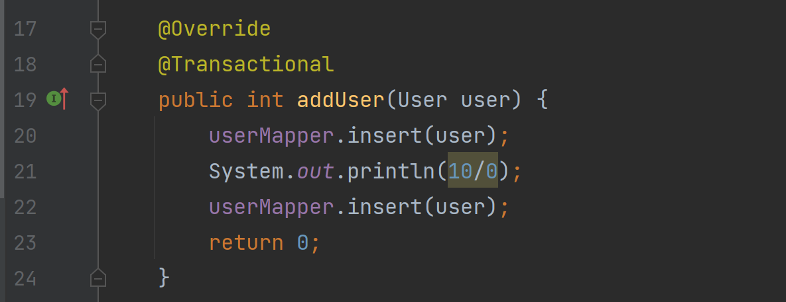


## SpringBoot 整合Redis

- 在创建项目时勾选 NoSQL  中的 Spring Data Redis

    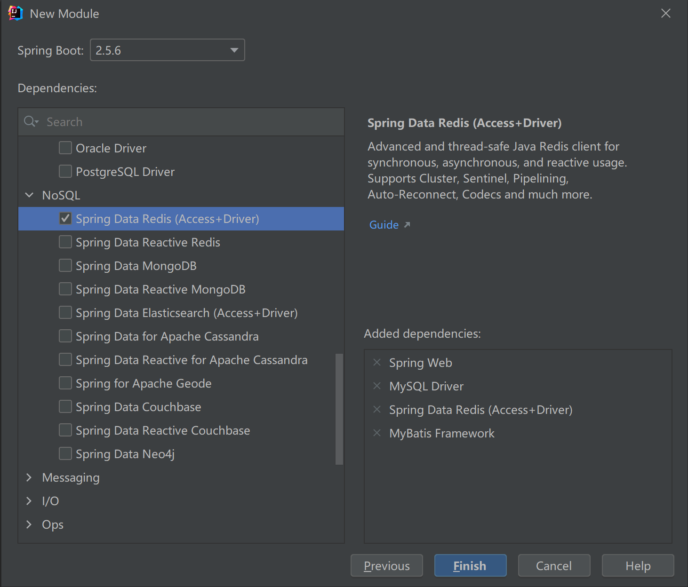

- 在 application.properties 中配置 Redis 连接基本信息

```properties
#配置redis连接信息
spring.redis.host=192.168.30.128
spring.redis.port=6379
spring.redis.password=129807
```

- 在业务层定义 RedisTemplate 类变量，让 Spring 容器自动导入

```java
@Resource
private RedisTemplate redisTemplate;
```

```java
redisTemplate.opsForValue().set("userAll", list);
redisTemplate.opsForValue().get("userAll");
```

 

### Redis 的缓存穿透问题

- Redis 作为数据库的缓存数据库时，多线程并发同时请求一条数据时，Redis 中并没有这条数据就会同时从数据库中读取数据。

**解决方案：**

1. 为业务方法添加 `synchronized` 锁，只有第一次访问数据库，第二次时 Redis 中已经有缓存，其余都访问 Redis
    - 会使并发失效，降低运行速度
2. 为业务代码块添加 `synchronized` 锁，在第一批次并发请求中，第一个请求到数据并存到缓存服务器后，第二个请求能直接读取到缓存数据


### Redis 集群、哨兵模式

- Redis 作为数据库的缓存数据库时，一旦宕机项目可能无法正常运行，这时就用到了集群
- 多台 Redis 数据库做集群时，通常由一台主服务器多台从服务器组成，当主节点数据改变时，从节点自动依照改变

**配置主从节点：**

- 主节点

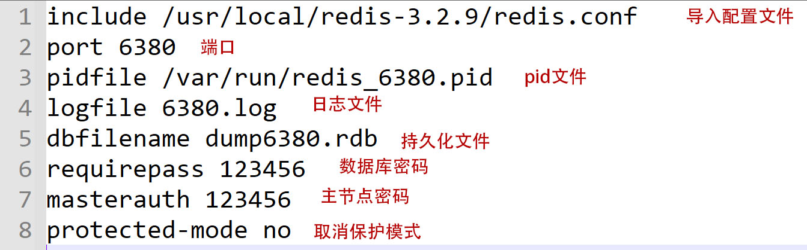

- 从节点

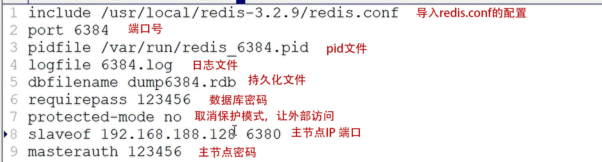

**配置哨兵节点：**

- 哨兵：类似于 Dubbo 的注册中心，Java 程序与哨兵交互，由哨兵管理节点的主从（依照宕机情况）。实现**高可用**
    - 和 Dubbo 的 Zookeeper 注册中心一样，并不是每次都访问哨兵，当主节点不可用时才会由哨兵管理


- `sentinel.conf` * 节点数量


- 启动哨兵 * 节点数量


- 配置 application.properties 配置

```properties
#配置redis哨兵连接信息：哨兵地址们，哨兵名称，密码
spring.redis.sentinel.nodes=192.168.235.128:26380,192.168.235.128:26382,192.168.235.128:26384
spring.redis.sentinel.master=mymaster
spring.redis.password=123456
```


## SpringBoot 热部署插件：

- 热部署插件可以在代码修改后自动重新加载修改内容，避免重启服务器反复编译未修改代码

- 在 pom.xml 中引入热部署插件依赖

```xml
<!--SpringBoot热部署插件-->
<dependency>
  <groupId>org.springframework.boot</groupId>
  <artifactId>spring-boot-devtools</artifactId>
  <optional>true</optional>
</dependency>
```

- Recompile 选中的文件，避免重新编译所有文件。


## SpringBoot 启动非 WEB 工程

- 在创建模块时，不勾选起步依赖

1. 在主入口 run 方法前接收返回值：Spring 容器，调用 getBean 获取实例对象

```java
@SpringBootApplication
public class SpringBootjavaApplication {
    public static void main(String[] args) {
        ApplicationContext context = SpringApplication.run(SpringBootjavaApplication.class, args);
        DoSomeService doSomeService = (DoSomeService) context.getBean("doSomeService");
        doSomeService.sayHello();
    }
}
```

2. 让主入口类实现 `CommandLineRunner` 接口，并重写 run 方法
    - 程序启动后会调用 run 方法，此时的 Spring 容器已经启动完成

```java
@SpringBootApplication
public class SpringBootjavaApplication implements CommandLineRunner {

    @Resource
    private DoSomeService doSomeService;

    public static void main(String[] args) {
        SpringApplication.run(SpringBootjavaApplication.class, args);
    }

    @Override
    public void run(String... args) throws Exception {
        doSomeService.sayHello();
    }
}
```


## SpringBoot 使用拦截器

1. 创建拦截器类

```java
@Component 	
public class MyInterceptor implements HandlerInterceptor {
    @Override
    public boolean preHandle(HttpServletRequest request, HttpServletResponse response, Object handler) throws Exception {
        System.out.println("拦截器成功拦截");
        return false;
    }
}
```

2. 创建配置类
    - `@Configuration` 注解为标记此类为 Spring 的配置类
    - 实现 WebMvcConfigurer 接口相当于将此类添加到 MVC 的命名空间中
    - 通过重写 addInterceptors 方法，添加自定义的拦截器类，配置拦截规则

```java
@Configuration
public class MyConfig implements WebMvcConfigurer {

    @Resource
    private MyInterceptor myInterceptor;

    /**
     * 注册拦截器，相当于 <mvc:interceptors></mvc:interceptors>
     * @param registry 拦截器的注册对象
     */
    @Override
    public void addInterceptors(InterceptorRegistry registry) {
        //添加拦截器
        InterceptorRegistration interceptorRegistration = registry.addInterceptor(myInterceptor);
        //配置拦截规则
        interceptorRegistration.addPathPatterns("/private/**");
        //配置请求忽略规则
        interceptorRegistration.excludePathPatterns("/private/test02");
    }
    
}
```

3. 使用拦截器，在访问 test01 时拦截，访问 test02 时忽略


## SpringBoot 字符编码

- 添加 application.properties 配置

```properties
# 指定编码格式
spring.http.encoding.charset=UTF-8
# 激活HttpSpringBoot编码
spring.http.encoding.enabled=true
# 强制Request和Response都是用这种编码格式
spring.http.encoding.force=true
```


## SpringBoot 打包 war 包

- 在创建模块时就选择 war，pom.xml 中默认打包方式就会变成 war 包，在打包时内嵌 Tomcat 不参与打包

- 点击 Maven 工具中的 package 即可在 target 目录中生成 war 包


## SpringBoot 打包 jar 包

- 打包 jar 包并上传至 linux 服务器，使用 `java -jar jar包文件名.jar` 启动 SpringBoot 内嵌Tomcat
- 封装 shell 脚本
    - touch 一个 run.sh 文件，在文件内写入 `java -jar jar包文件名.jar` 命令
    - chmod 777 run.sh 修改文件权限
    - ./run.sh 启动 Tomcat 服务器


## SpringBoot 使用 Servlet，Filter

**Servlet：【已被控制器替代，不必掌握】**

1. 在入口类上标注 `@ServletComponentScan(basePackage = "Servlet包路径")` 
    - 在 Servlet 类上方标注 `WebServlet("/项目名")` 注解，即可让 SpringBoot 扫描到
2. 通过 `@Configuration ` 配置类获取 Bean

```java
   /**
   	* @Bean标记当前方法是一个Spring的Bean配置方法
	* 方法名就是Bean的ID，返回值就是Bean的Class
    */
   @Bean
   public ServletRegistrationBean heServletRegistrationBean(TestServlet testServlet){
     //获取Servlet注册Bean
     ServletRegistrationBean servletRegistrationBean = new ServletRegistrationBean();
     //注册Servlet
     servletRegistrationBean.setServlet(testServlet);
     //返回class
     return servletRegistrationBean;
   }
```

**Filter：【已被拦截器替代，不必掌握】**

1. 在入口类上标注 `@ServletComponentScan(basePackage = "Filter包路径")` 
    - 在 Filter类上方标注 `@WebFilter(urlPatterns="/*")` 注解，即可让 SpringBoot 扫描到

2. 通过 `@Configuration ` 配置类获取 Bean

```java
    @Bean
    public FilterRegistrationBean heFilterRegistration(TestFilter testFilter) {
      //获取Filter注册Bean
      FilterRegistrationBean filterRegistration = new FilterRegistrationBean();
      //注册Filter
      filterRegistration.setFilter(testFilter);
      //设置过滤路径
      filterRegistration.addUrlPatterns("/*");
      //返回class
      return filterRegistration;
    }
```


## SprintBoot 健康检查机制

- 在创建模块时勾选 Ops 中的Spring Boot Actuator 【不必掌握】

| GET          | /env            | 查看所有环境变量                                             |
| ------------ | --------------- | ------------------------------------------------------------ |
| **HTTP方法** | **路径**        | **描述**                                                     |
| GET          | /configprops    | 查看配置属性，包括默认配置   http://www.haojson.com对json进行格式化 |
| GET          | /beans          | 查看Spring容器目前初始化的bean及其关系列表                   |
| GET          | /mappings       | 查看所有url映射                                              |
| GET          | /health         | 查看应用健康指标                                             |
| GET          | /info           | 查看应用信息                                                 |
| GET          | /metrics        | 查看应用基本指标                                             |
| GET          | /metrics/{name} | 查看具体指标                                                 |
| JMX          | /shutdown       | 关闭应用                                                     |


## SpringBoot 中的 Thymeleaf 模板

- Thymeleaf 是用来开发 Web 和独立环境项目的服务器端的 Java 模版引擎
- SpringBoot 并不支持 JSP 但完美整合了 Thymeleaf ，甚至集成了 Thymeleaf 的自动化配置、视图解析器


### Thymeleaf 的特点

- 动静结合：Thymeleaf 在有网络和无网络的环境下皆可运行，即能直接显示模板上的静态数据；也能像 Jsp 一样动态的从后台接收数据并替换掉模板上的静态数据。这是由于以 HTML 标签为载体，要寄托在 HTML 标签下实现。
- 开箱即用：它提供标准和 spring 标准两种方言，可以直接套用模板实现 JSTL、 OGNL 表达式效果，避免每天套模板、该jstl、改标签的困扰。同时开发人员也可以扩展和创建自定义的方言。
- 多方言支持：Thymeleaf 提供spring标准方言和一个与 SpringMVC 完美集成的可选模块，可以快速的实现表单绑定、属性编辑器、国际化等功能。


### 使用 Thymeleaf

- 创建项目时，勾选 Boot DevTools 热部署、Spring Web 后端、Thymeleaf 百里香叶 起步依赖。


- 在 application.properties 属性配置文件中，关闭 thymeleaf 的缓存，方便调试

```properties
#开发阶段，建议关闭thymeleaf的缓存，不然没有办法看到实时页面
spring.thymeleaf.cache=false
```

- 在 application.properties 属性配置文件中，配置 Thymeleaf 的视图解析器 ( 同指向 WEB-INF 中的 JSP 的视图解析器一样 )

```properties
#默认视图视图前缀
spring.thymeleaf.prefix=classpath:/templates/
#默认视图后缀
spring.thymeleaf.suffix=.html
```

- 在 templates 路径下创建 html 文件，在 html 标签中添加属性 `<html lang="en" xmlns:th="http://www.thymeleaf.org">`


- 使用、效果


### Thymeleaf 的变量表达式

1. `${变量名}` 获取变量值
2. `${变量名.属性名}` 获取对象中属性名
3. `${变量名.方法名()}` 获取对象方法的返回值


### Thymeleaf 的选择变量表达式

- 需配合 th:object 使用

1. `*{变量名}` 获取变量值
2. `*{变量名.属性名}` 获取对象中属性名
3. `*{变量名.方法名()}` 获取对象方法的返回值


### Thymeleaf 的 URL 表达式

- `@{路径}` 用于 script、link、a、form、img 标签的地址属性中获取动态数据

```html
    <!--互联网绝对路径-->
    <a th:href="@{'https://www.baidu.com/s?wd='+${user.name}}" target="_blank">百度</a><br/>
    <!--项目相对的路径-->
    <a th:href="@{/bb/test02}" target="_blank">test02</a><br/>
    <!--项目的相对路径【不推荐，当项目层次结构复杂时，有可能会丢失地址路径】-->
    <a th:href="@{bb/test02}" target="_blank">test02</a><br/>
```

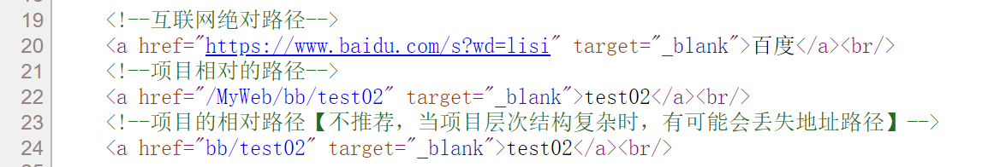


### Thymeleaf 的常见属性

1. `th:value = "${...}"` 将动态数据设置到表单元素的 value 属性中
2. `th:attr = "属性名=${...}"` 可以修改指定属性的值，可以自定义属性
3. `th:onclick = "js代码"` 可以实现事件处理，在 js 代码中可以拼接 Thymeleaf 的变量表达式（只支持数字和布尔类型）


### Thymeleaf 的 each 迭代 List 集合

- 用法 `th:each = "item,itemStat:${itemList}"` 

    - item：每次的迭代对象
    - itemStat：迭代对象的信息（省略时默认名为 item名+Stat）
        - itemStat.index：0开始下标
        - itemStat.count：1开始下标
        - itemStat.size：迭代对象的大小
        - itemStat.even / odd：当前迭代对象下标的奇偶，0开始
        - itemStat.first：是否是第一个
        - itemStat.last：是否是最后一个
        - itemStat.current：当前迭代对象，等价于 item
    - itemList：后台传过来的数据

    ```html
    <tr th:each="user,itemStat:${userList}">
        <td th:text="${itemStat.count}">序号</td>
        <td th:text="${user.name}">姓名</td>
        <td th:text="${user.sex}">性别</td>
        <td th:text="${user.age}">年龄</td>
        <td><a th:href="@{'/modify?id='+${user.id}+'xxxxx'}">修改</a></td>
        <td><a th:href="@{'/delete?id='+${user.id}}">删除</a></td>
    </tr>
    ```


### Thymeleaf 的 each 迭代 Map 集合

1. 直接对 Map 的 key，value 进行迭代

- 用法：`th:each = "node:${itemMap}"`
    - node：itemMap 每次的迭代对象
        - node.key：获取当前键值对中的 key
        - node.value：活动当前键值对中的 value

```html
<tr th:each="node:${userMap}">
    <td th:text="${nodeStat.count}">序号</td>
    <td th:text="${node.key}">key</td>
    <td th:text="${node.value}">value</td>
    <td th:text="${node.value.id}">id</td>
    <td th:text="${node.value.name}">姓名</td>
    <td th:text="${node.value.age}">年龄</td>
    <td th:text="${node.value.sex}">性别</td>
</tr>
```

2. 将 Map 转换成 keySet 后，通过遍历 key 获取 value 进行迭代

- 用法：`th:each = "key:${itemMap.keySet()}"`
    - key：每次迭代的 key 对象
        - itemMap.get(key)：取当前 key 对应的 value

```html
<tr th:each="key:${userMap.keySet()}">
    <td th:text="${keyStat.count}">序号</td>
    <td th:text="${key}">key</td>
    <td th:text="${userMap.get(key)}">value</td>
    <td th:text="${userMap.get(key).id}">id</td>
    <td th:text="${userMap.get(key).name}">姓名</td>
    <td th:text="${userMap.get(key).age}">年龄</td>
    <td th:text="${userMap.get(key).sex}">性别</td>
</tr>
```


### Thymeleaf 的 if、unless 表达式

- `th:if = "${表达式}"` 如果表达式为 false 则删除所在标签

```html
<td th:if="${user.sex == '1'}">男</td>
<td th:if="${user.sex == '0'}">女</td>
```

- `th:unless = "${表达式}"` 如果表达式为 true 则删除所在标签【不推荐使用】

```html
<td th:unless="${user.sex == '1'}">女</td>
<td th:unless="${user.sex == '0'}">男</td>
```


### Thymeleaf 的 switch case 表达式

- `th:case="*"` 当所有 case 都不匹配时执行

```html
<h3 th:switch="${week}">
    <span th:case="1">星期一</span>
    <span th:case="2">星期二</span>
    <span th:case="3">星期三</span>
    <span th:case="4">星期四</span>
    <span th:case="5">星期五</span>
    <span th:case="6">星期六</span>
    <span th:case="7">星期日</span>
    <span th:case="*">错误数据</span>
</h3>
```


### Thymeleaf 的内敛文本、内敛脚本

- 内敛：inline

- `[[${动态数据}]]` 将文本直接显示在页面中


- `[[${动态数据}]]` 将文本直接用在 js 代码中
    - 为父标签添加 `th:inline = "javascript"` 后，会自动为内嵌文本添加双引号。

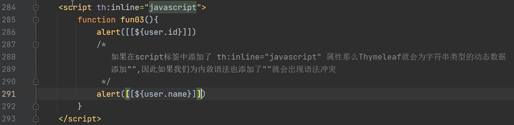


### Thymeleaf 的字符串拼接

- `|` `| `中写的文本和变量表达式会被 Thymeleaf 自动解析拼接（优雅，永不过时）

```html
<td><a th:href="@{|/modify?id=${user.id}&xx=xxx|}">修改</a></td>
<td><a th:href="@{'/delete?id='+${user.id}}">删除</a></td>
```


### Thymeleaf 的三元运算符

```html
男:<input type="radio" name="sex" th:checked="*{sex=='1'?true:false}">
女:<input type="radio" name="sex" th:checked="*{sex=='0'?true:false}">
```


### Thymeleaf 的表达式基本对象

- #request 对象、session 对象

```html
<p th:text="${#request.getSession().getAttribute('week')}"></p>
<p th:text="${#httpSession.getAttribute('week')}"></p>
<p th:text="${session.week}"></p>
```


## SpringBoot 的 REST 接口架构风格

- REST: 表述性状态传递，是一组客户端和服务器交互时架构理念和设计原则
- 架构风格：api 的组织方式
    - 传统：https://www.bilibili.com/video/BVxxx?p=57
    - RESTful 风格：https://www.bilibili.com/video/BVxxx/p/57

- REST 风格的增删改查

    - 查：GET
    - 增：POST
    - 删：DELETE
    - 改：PUT

    ```html
    <form action="xxx" method="post">
        姓名：<input type="text" name="username">
        密码：<input type="password" name="password">
        <input type="hidden" name="_method" value="PUT"> <!--真实的提交方式-->
    </form>
    ```

- 常用注解：

    - `@PathVariable`：路径变量，从 url 中获取数据

        

        当形参名和路径变量名相同时，value 可省略

        ```java
        @GetMapping("/test/{page}")
        public String test(@PathVariable Integer page){
            return "test/"+page;
        }
        ```

    - `@GetMapping`

        查询时用，相当于在 RequestMapping 基础上指定 method 参数必须为 get

        

    - `@PostMapping`

        添加时用

    - `@PutMapping`

        修改时用

    - `@DeleteMapping`

        删除时用

- 在 application.properties 启用对 put ，delete 请求方式的支持

```properties
# 启用 hiddenmethod 过滤器
spring.mvc.hiddenmethod.filter.enabled=true
```

