# SpringCloud自学笔记md版


# SpringCloud 自学笔记

> 大连交通大学 信息学院 刘嘉宁
>
> 笔记摘自 尚硅谷


## 什么是 SpringCloud

- 最早是由奶飞公司提出的分布式解决方案，后来被 Spring 公司抄了作业
- 所有请求都由 `服务网关` 通过 `服务注册和发现` 根据 `配置中心` 找到对应的 SpringBoot 服务模块进行协调和调度
- 如果有`容错` 和 `限流` 比如 `降级`、`熔断` 进行服务监控、健康检查和报警

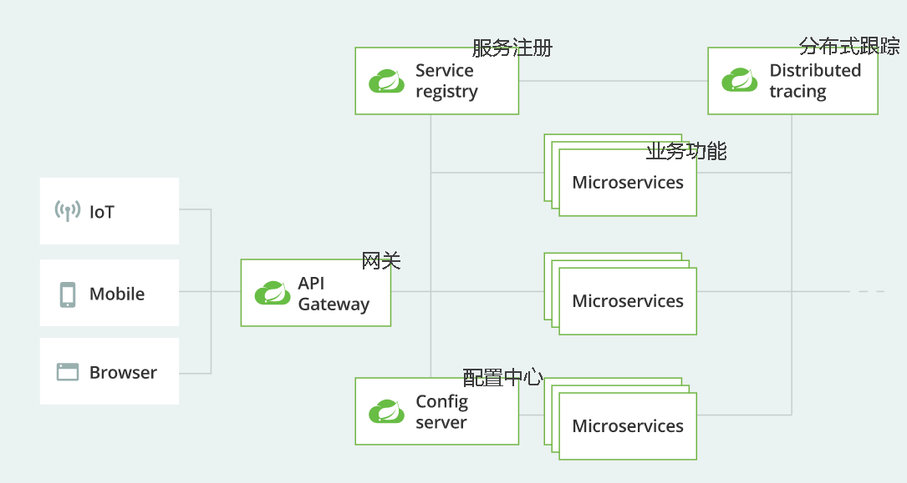

- 是分布式微服务架构的一站式解决方案
- 是多种微服务架构落地技术的集合体
- 是一系列技术的集合，俗称微服务全家桶


## 什么是分布式、什么是微服务

### 什么是分布式

- 分布式系统就是把所有的程序、功能拆分成不同的子系统，部署在多台不同的服务器上
- 这些子系统相互协作共同对外提供服务，而对用户而言他并不知道后台是多个子系统和多台服务器在提供服务，在使用上和集中式系统一样

### 什么是微服务

- 微服务是系统架构上的一种**设计风格**， 它的主旨是将一个原本独立的系统拆分成多个小型服务
- 这些小型服务都在各自独立的进程中运行，服务之间通过基于 HTTP 的 RESTful API 进行通信协作
- 被拆分后的每一个小型服务都围绕着系统中的某一项业务功能进行构建， 并且每个服务都是一个独立的项目，可以进行独立的测试、开发和部署等
- 由于各个独立的服务之间使用的是基于 HTTP 的作为数据通信协作的基础，所以这些微服务可以使用不同的语言来开发

### 两者的区别

- 分布式强调系统的拆分，微服务也是强调系统的拆分，**微服务架构属于分布式架构的范畴**


## 微服务架构的优缺点

优点：

- 将系统中的不同功能模块拆分成多个不同的服务，独立地开发和部署，都运行在自己的进程内，每个服务的更新**都不影响其他服务的运行**
- 由于是独立部署的，可以**更准确地监控**每个服务的资源消耗情况，进行性能容量的评估，通过压力测试，也很容易发现各个服务间的性能瓶颈所在
- 独立开发比较方便，减少代码的冲突、代码的重复，**逻辑更加清晰**，易于后续的维护与扩展
- 可以**使用不同的编程语言**进行开发

缺点：

- 微服务架构增加了系统维护、部署的难度，导致一些功能模块或代码无法复用
- 随着系统规模的日渐增长，微服务在一定程度上也会导致系统变得越来越复杂，增加了集成测试的复杂度
- 随着微服务的增多，数据的一致性问题，服务之间的通信成本等都凸显了出来


## Boot 和 Cloud 版本对应关系

- SpringCloud 使用伦敦地铁站命名其版本，Axxx ~ Zxxx (目前 Kilburn 3.0.x)
- 每当重大 BUG 被修复，就会发布一个 SR (Server Releases 版本) 2021年 Hoxton.SR12 第十二个版本

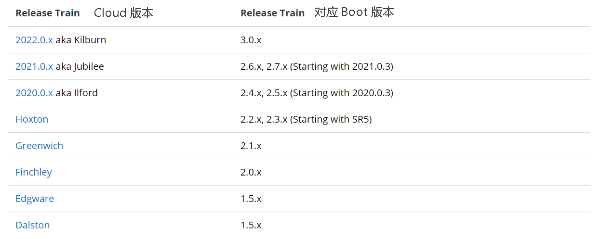

- 2020 年开始强烈推荐升级到 SpringCloud 2.0 以上版本
- SpringCloud 官网版本对应推荐 https://start.spring.io/actuator/info


- 在 SpringCloud 官网 LEARN 标签中查看推荐的对应 Boot 版本

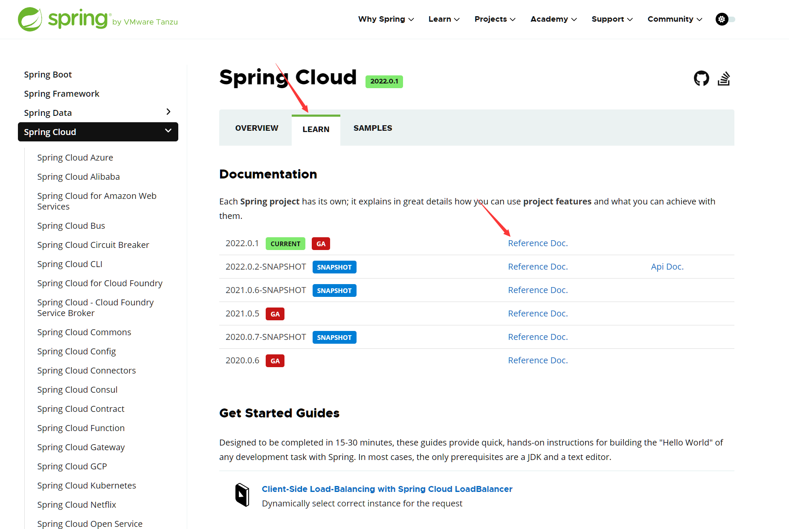


## SpringCloud 组件的变更


## 创建 SpringCloud 工程

- 编程风格：**约定 > 配置 > 编码**
- 创建详情见 angenin 的博客笔记 [SpringCloud(H版&Alibaba)技术（1-4基础入门，创建项目）CSDN博客](https://blog.csdn.net/qq_36903261/article/details/106507150)

### 什么是 RestTemplate

- RestTemplate 是一个同步的 web http 客户端请求模板工具
- 它封装了`http`连接, 可以向一个 REST 接口发送请求并获取响应

1. `postForObject` 请求地址，请求参数，返回的对象类型
2. `getForObject` 请求地址，返回的对象类型

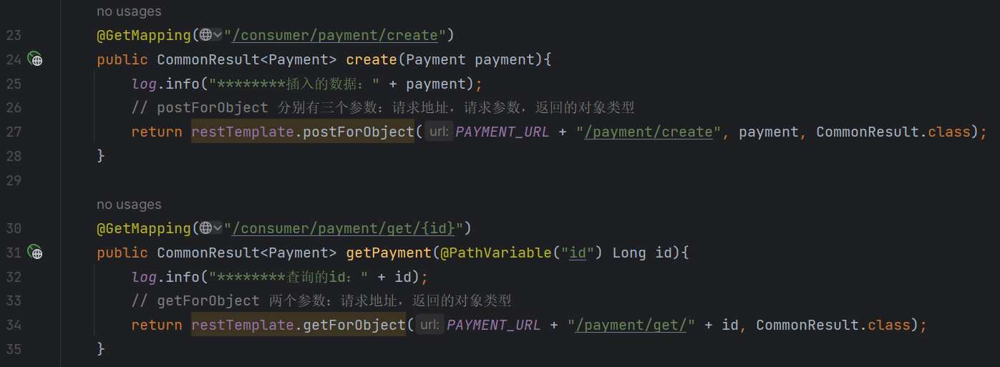

### 如何导入团队自己的工具包

- 在一个项目中创建多个模块，其中一个专门用来做工具包模块
- 将自己团队写的 commons 模块使用 maven install 到自己本地仓库中
- 在需要的模块的 pom 文件中导入工具模块的依赖，实现一处修改处处应用


### SpringBoot 一般通用配置 pom.xml

```xml
		<!-- 一般通用配置 -->
        <!-- SpringBoot WEB 启动依赖 -->
        <dependency>
            <groupId>org.springframework.boot</groupId>
            <artifactId>spring-boot-starter-web</artifactId>
        </dependency>
        <!-- SpringBoot 测试启动依赖 -->
        <dependency>
            <groupId>org.springframework.boot</groupId>
            <artifactId>spring-boot-starter-test</artifactId>
            <scope>test</scope>
        </dependency>
        <!-- SpringBoot 热部署依赖 -->
        <dependency>
            <groupId>org.springframework.boot</groupId>
            <artifactId>spring-boot-devtools</artifactId>
            <scope>runtime</scope>
            <optional>true</optional>
        </dependency>
        <!-- lombok 注解开发 -->
        <dependency>
            <groupId>org.projectlombok</groupId>
            <artifactId>lombok</artifactId>
            <optional>true</optional>
        </dependency>
```


## Eureka 服务注册与发现【维护】


### 什么是服务治理

- 在传统 RPC 远程调用框架中，管理每个服务与服务之间依赖关系比较复杂
- 服务治理就是实现服务调用、负载均衡、容错等，实现服务发现与注册


### 什么是服务发现与注册

- 在 RPC 远程调用框架核心设计思想在于**注册中心**, 使用注册中心 (存放服务地址相关信息 (接口地址) ) 管理每个服务与服务之间的一个依赖关系【服务治理】
- 当服务器启动的时候，会把当前自己服务器的信息 (服务地址、通信地址) 等以别名方式注册到注册中心上，消费者/服务提供者 以该别名的方式去注册中心上获取到实际的服务通信地址，然后再实现 RPC 调用

- Eureka 从用 C/S 的设计架构，Eureka Server 作为注册中心，其它微服务使用 Eureka 客户端连接到注册中心并维持心跳连接，维护人员通过 Eureka Server 来监控系统中各个微服务是否运行正常


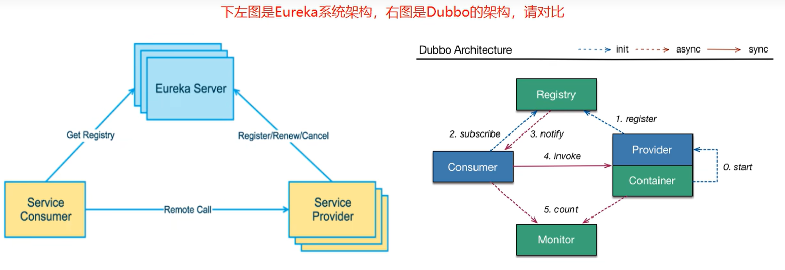


### 搭建 Eureka 工程

#### 创建 Eureka Server 工程步骤

1. 添加 pom 依赖

```xml
		<!-- eureka-server -->
        <dependency>
            <groupId>org.springframework.cloud</groupId>
            <artifactId>spring-cloud-starter-netflix-eureka-server</artifactId>
        </dependency>
        <!-- 监控 -->
        <dependency>
            <groupId>org.springframework.boot</groupId>
            <artifactId>spring-boot-starter-actuator</artifactId>
        </dependency>
        <!-- 引用自己定义的 api 通用包，可以使用 Payment 支付 Entity -->
        <dependency>
            <groupId>com.atguigu.springcloud</groupId>
            <artifactId>cloud-api-commons</artifactId>
            <version>${project.version}</version>
        </dependency>
        <!-- 一般通用配置 -->

```

2. 配置 application.yml

```yml
server:
  port: 7001

eureka:
  instance:
    hostname: localhost  # eureka服务端的实例名称
  client:
    # false 表示不向注册中心注册自己（想注册也可以，不过没必要）
    register-with-eureka: false
    # false 表示自己端就是注册中心，职责就是维护服务实例，并不需要去 检索服务
    fetch-registry: false
    service-url:
      # 设置与 eurekaServer 交互的地址查询服务和注册服务都需要依赖这个地址
      defaultZone: http://${eureka.instance.hostname}:${server.port}/eureka/

```

3. 在启动类上添加注解

```java
@SpringBootApplication
@EnableEurekaServer // 标识此工程是 Eureka Server 服务注册中心
public class EurekaMain7001 {
    public static void main(String[] args) {
        SpringApplication.run(EurekaMain7001.class, args);
    }
}

```

4. 访问 `localhost:7001` 
    - 看到 application 为空的，因为此时还没有其它项目注册进来

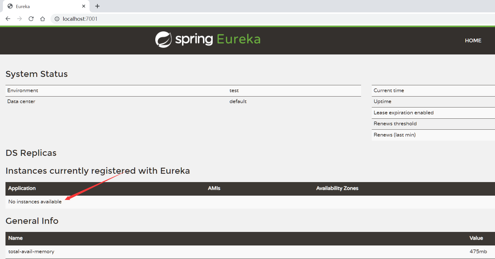


#### 修改 Eureka Client 工程步骤

1. 添加 Eureka Client 依赖

```xml
         <!-- eureka-client -->
         <dependency>
             <groupId>org.springframework.cloud</groupId>
             <artifactId>spring-cloud-starter-netflix-eureka-client</artifactId>
         </dependency>

```

2. 在 application.yml 中添加

```yml
# 此微服务项目的别名就是上面配置的 spring.application.name
eureka:
  client:
    # true 表示向注册中心注册自己，默认为 true
    register-with-eureka: true
    # 是否从 EurekaServer 抓取已有的注册信息，默认为 true。单节点无所谓，集群必须设置为 true 才能配合 ribbon 使用负载均衡
    fetch-registry: true
    service-url:
      defaultZone: http://localhost:7001/eureka
```

3. 在启动类上添加注解

```java
@EnableEurekaClient
```

4. 访问 `localhost:7001` 
    - 看到 application 已经有项目注册进来了**applicaiton 的项目名就是在 yml 中配置的 spring.application.name 名称**

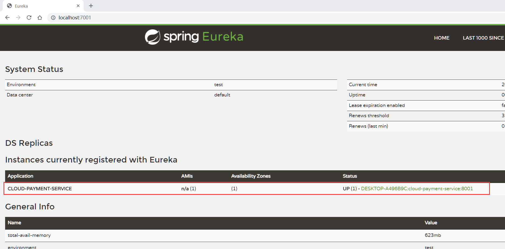


#### 搭建 Eureka 注册中心集群

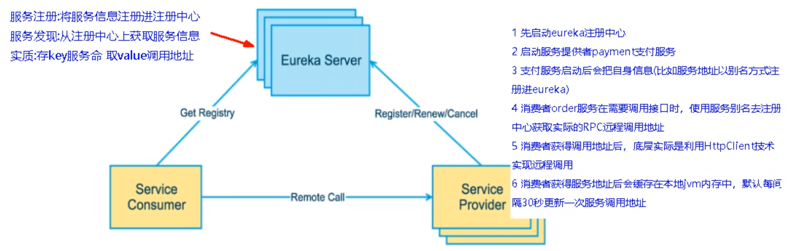

- 为避免单一注册中心突然宕机导致整体项目不可用，搭建注册中心集群实现 **负载均衡**、**故障容错**
- Eureka 注册中心集群：相互注册，相互守望

1. 修改 hosts 文件，添加

```
# 以下为 SpringCloud Eureka 注册中心集群配置
127.0.0.1       eureka7001.com
127.0.0.1       eureka7002.com
127.0.0.1		eureka7003.com

```

2. 修改两个注册中心的 yml 配置文件
    - hostname 和 defaultZone 首尾相连，7001 注册 7002，7002 注册 7001
    - 如果是三台互相映射，那么 defaultZone 应写两个地址中间逗号分隔

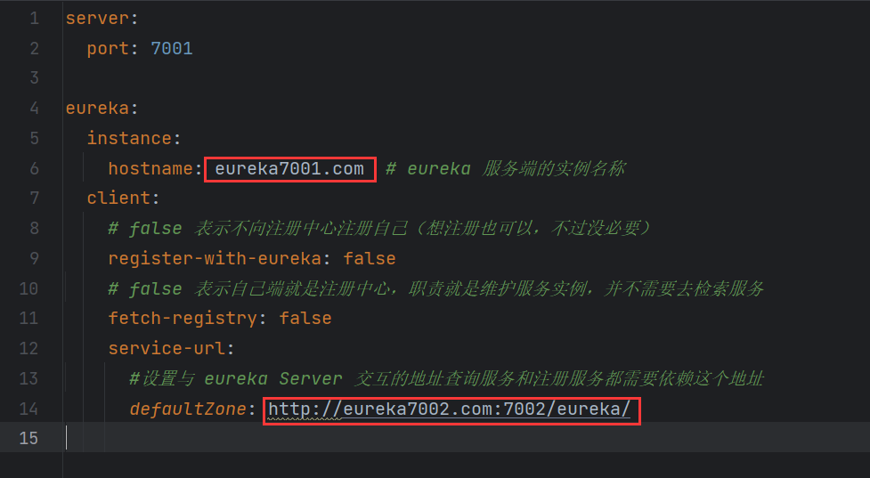

3. 访问测试


4. 修改生产者和消费者模块的 yml

```yml
      #集群版
      defaultZone: http://eureka7001:7001/eureka/,http://eureka7002:7002/eureka/
```

> 启动顺序
>
> 1. 先启动 Eureka 注册中心集群
> 2. 启动生产者服务
> 3. 启动消费者服务


#### 搭建 生产者 集群

- 根据原有生产者复制出一份
- 使用相同的微服务名，修改端口地址
- 可以看到注册中心中生产者有两个


- 修改 消费者 连接地址为 生产者服务名

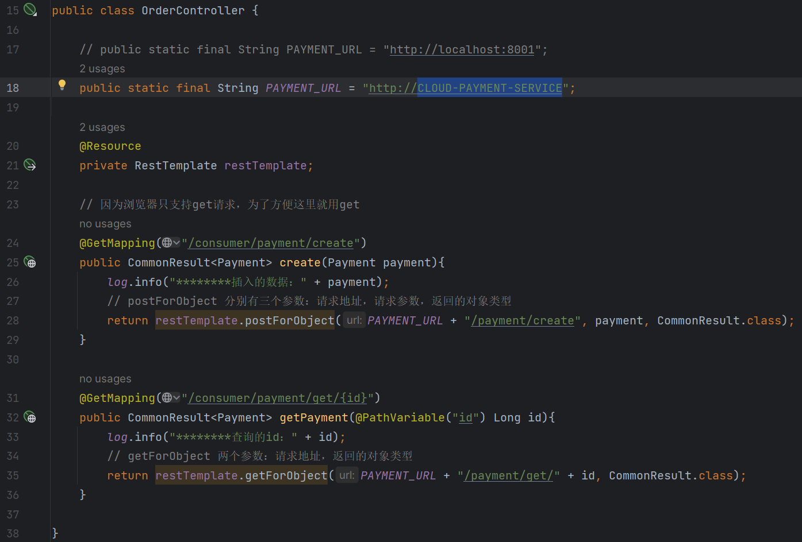

- 开启 RestTemplate 的负载均衡功能 <a id='RestTemplateConfig'></a>

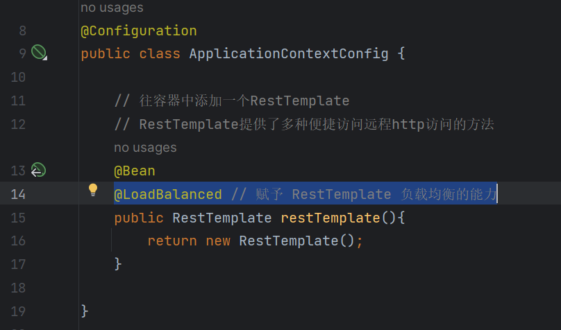

- Ribbon 默认为轮询的负载均衡策略，一次访问 8001 一次访问 8002


### 信息功能完善及修改

- 服务名称修改

    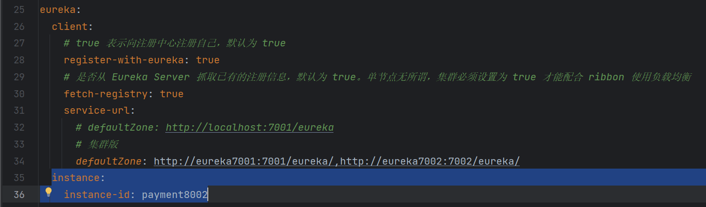

    - 为生产者添加 eureka.instance.instance-id 属性值

    

- 添加访问路径 IP 信息

    

    - 在生产者配置 yml 中添加 eureka.instance.prefer-ip-address 属性值为 true

    


### 服务发现 Discovery

- 通过 服务发现 来获取 Eureka 中现有微服务的信息

1. 为微服务注入 DiscoveryClient 

```java
	@Resource
    private DiscoveryClient discoveryClient;
```

2. 通过其 `getServices()`、`discoveryClient.getInstances("服务名")` 可以获取到对应服务的一些基本信息


### Eureka 的自我保护机制

- 在一组客户端与 eureka server 存在网络分区时会自动开启保护，会保护服务注册表中的信息，不会删除注册表中的信息，不会注销任何微服务
- 出现这一行红字就是保护模式，这属于 CAP 中的 AP 分支

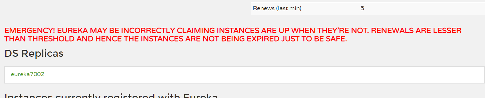

- 默认情况下 Eureka Server 在一定时间内没有收到某个微服务实例的心跳，将会注销该实例（默认 90 秒）
- 但是因为网络卡顿、延时、拥挤时，微服务还是健康的，此时并不应该删除该微服务【高可用，健壮性】
- 所以 Eureka 在短时间内丢失过多客户端时就会自动进入保护模式，宁可保留错误的信息也不盲目注销任何可能健康的服务实例

#### 如何关闭自我保护机制

- 配置 Eureka Server 注册中心配置


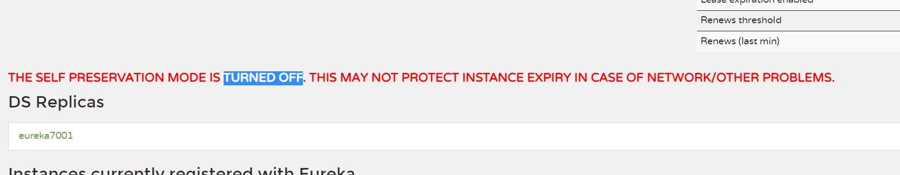

- 修改 eureka 客户端心跳间隔和直线上限时间


## Zookeeper 服务注册与发现

- Zookeeper 是一个分布式协调工具，可以实现注册中心功能


### 临时节点 or 持久节点

- Zookeeper 也是有心跳机制，在一定时间内如果一直没心跳返回，Zookeeper就会把服务节点剔除掉
- 在 Eureka 中如果没有心跳了还会再保护模式中继续服务，所以在 Zookeeper 上的服务节点是 **临时节点**


### 搭建 Zookeeper 工程

#### 创建 Zookeeper 生产者步骤

1. 在虚拟机中使用 docker 搭建 Zookeeper 服务
    - 略

2. 创建生产者工程，添加 pom 依赖

```xml
		<!-- Zookeeper -->
        <dependency>
            <groupId>org.springframework.cloud</groupId>
            <artifactId>spring-cloud-starter-zookeeper-discovery</artifactId>
        </dependency>
```

3. 配置 yml 文件

```yml
server:
  port: 8004

spring:
  # 服务别名
  application:
    name: cloud-provider-payment
  # 注册 Zookeeper 到注册中心名称
  cloud:
    zookeeper:
      connect-string: 192.168.30.129:2181

```

4. 在主启动类上添加注解

```java
@SpringBootApplication
@EnableDiscoveryClient // 该注解用于向使用 consul 或者 Zookeeper 作为注册中心时注册服务
public class PaymentMain8004 {
    public static void main(String[] args) {
        SpringApplication.run(PaymentMain8004.class, args);
    }

}

```

5. 进入 docker 中的 zookeeper 并查看当前服务
    - 在有服务连接到 zookeeper 之后 `ls /` 即可看到 services 目录
    - services 目录中可以看到在生产者中配置好的微服务别名, 其中可以看到服务流水号
    - 使用 `get` 命令获取某一服务中的某一注册相关信息 (JSON 格式)


#### 创建 Zookeeper 消费者步骤

1. 添加上方同一个依赖
2. 配置上方 yml 文件，注意修改 端口号 和 微服务别名
3. 在主启动类上添加注解

```java
@EnableDiscoveryClient
```

4. 编写配置类，注意添加 `@LoadBalanced` 为 RestTemplate 开启负载浚航，配置业务类
5. 开启服务即可在 Zookeeper 服务中看到消费者别名


#### Zookeeper 注册中心集群

- 在不同的服务器中创建多个 Zookeeper 服务
- 在 yml 配置类中 `connect-string: IP:端口, IP:端口` 即可


#### 遇到的问题：依赖冲突

- 由于服务器中 zookeeper 版本较低，而 SpringBoot 启动依赖中默认版本较高
- 在 POM 中排除自带的高版本 Zookeeper 依赖，自行引入对应版本的依赖即可

```xml
        <dependency>
            <groupId>org.springframework.cloud</groupId>
            <artifactId>spring-cloud-starter-zookeeper-discovery</artifactId>
        <exclusions>
            <!--先排除自带的zookeeper3.5.3-->
            <exclusion>
                <groupId>org.apache.zookeeper</groupId>
                <artifactId>zookeeper</artifactId>
            </exclusion>
        </exclusions>
        </dependency>

        <!--添加zookeeper3.4.9版本（引入对应版本的依赖）-->
        <dependency>
            <groupId>org.apache.zookeeper</groupId>
            <artifactId>zookeeper</artifactId>
            <version>3.4.9</version>
        </dependency>
```


## Consul 服务注册与发现

- 官网：https://www.consul.io/intro/index.html
- 是一套开源的，分布式服务发现 和 配置管理系统
- 由 HashiCorp 公司用 go 语言开发
- 主要特点
    - `服务发现`：Consul 的客户端可以注册服务，例如 api 或 mysql，其他客户端可以使用 Consul 来发现给定服务的提供者。使用 DNS 或 HTTP，应用程序可以轻松找到它们依赖的服务
    - `健康检测`：Consul 客户端可以提供任意数量的运行状况检查，这些检查可以与给定服务（“ Web服务器是否返回 200 OK”）或本地节点（“内存利用率低于90％”）相关。操作员可以使用此信息来监视群集的运行状况，服务发现组件可以使用此信息将流量从不正常的主机发送出去
    - `K-V存储`：应用程序可以将 Consul 的分层 键/值 存储用于多种目的，包括动态配置，功能标记，协调，领导者选举等。简单的 HTTP API 使其易于使用
    - `安全的服务通信`：Consul 可以为服务生成并分发 TLS 证书，以建立相互 TLS 连接。 意图可用于定义允许哪些服务进行通信。可以使用可以实时更改的意图轻松管理服务分段，而不必使用复杂的网络拓扑和静态防火墙规则
    - `多数据中心`：Consul 开箱即用地支持多个数据中心。这意味着 Consul 的用户不必担心会构建其他抽象层以扩展到多个区域


### 搭建 Consul 工程

- 在虚拟机中使用 docker 搭建 consul 服务
    - 成功后即可根据虚拟机 IP:8500 进入 consul 管理页面

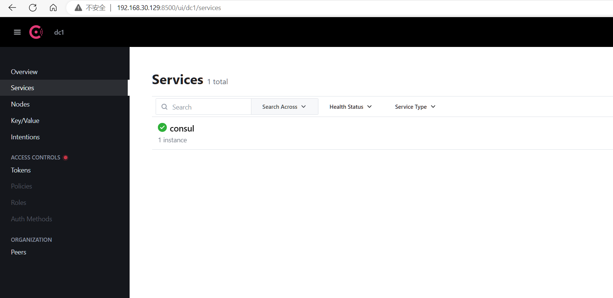


#### 创建 Consul 生产者步骤

1. 创建生产者工程，配置 POM 文件

```xml
        <!-- consul -->
        <dependency>
            <groupId>org.springframework.cloud</groupId>
            <artifactId>spring-cloud-starter-consul-discovery</artifactId>
        </dependency>
```

2. 编写 YML 配置文件

```yml
server:
  port: 8006

spring:
  # 服务别名
  application:
    name: cloud-provider-payment
  # 注册 Consul
  cloud:
    consul:
      host: 192.168.30.129
      port: 8500
      discovery:
        service-name: ${spring.application.name}
        # 添加下方配置解决 Consul 红叉问题
        heartbeat:
          enabled: true

```

3. 在主启动类上添加注解

```java
@EnableDiscoveryClient
```

- 在 Consul 的 UI 界面可以看到刚刚注册的生产者服务
    - 此处可以看到服务列表，点进去看到其中有哪些服务实例


#### 创建 Consul 消费者步骤

1. 添加上方同一个依赖
2. 配置上方 yml 文件，注意修改 端口号 和 微服务别名
3. 在主启动类上添加注解

```java
@EnableDiscoveryClient
```

4. 编写配置类，注意添加 `@LoadBalanced` 为 RestTemplate 开启负载浚航，配置业务类
5. 开启服务即可在 Consul UI 中看到消费者别名


## 服务注册与发现 三者的异同

| 组件名    | 语言 | CAP  | 服务健康检查 | 对外暴露接口 | SpringCloud 集成 |
| --------- | ---- | ---- | ------------ | ------------ | ---------------- |
| Eureka    | Java | AP   | 可配         | HTTP         | 已集成           |
| Zookeeper | Java | CP   | 支持         | 客户端       | 已集成           |
| Consul    | GO   | CP   | 支持         | HTPP / DNS   | 已集成           |


### 什么是 CAP

- C**（Consistency）**：一致性
- A**（Availability）**：可用性
- P**（Partition tolerance）**：分区容错性（微服务架构必须保证有P）


- CAP 理论关注数据是粒度，而不是整体系统设计的策略


- Eureka 保证了 AP：
    - 当网络分区出现后，为了保证可用性，系统 B 可以返回旧值，保证系统的可用性。
    - 结论：违背了 一致性 C 的要求，只满足可用性和分区容错，即 AP

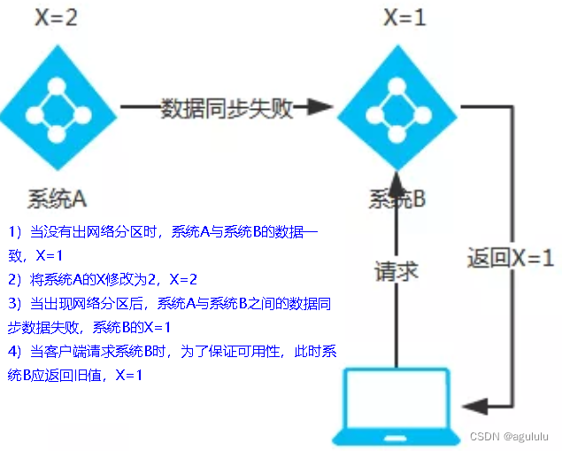

- Consul 和 zookeeper 保证了 CP：
    - 当网络分区出现后，为了保证一致性，就必须拒接请求，否则无法保证一致性
    - 结论：违背了 可用性 A 的要求，只满足一致性和分区容错，即 CP

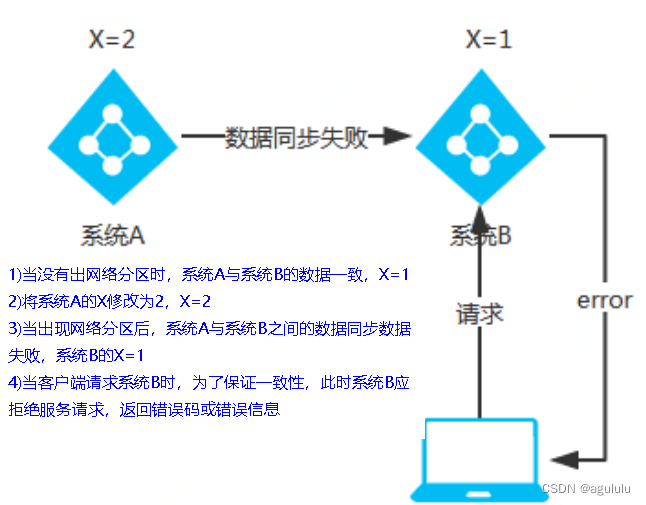


## Ribbon 负载均衡服务调用【维护】

- Ribbon 是 Netflix 实现的一套客户端
- 提供客户端的软件 **负载均衡** 算法和 **服务调用**，提供完善的配置项（连接超时、重试）
- Load Balancer（LB）的所有机器，Ribbon 会自动的根据负载均衡规则连接，并且可以很容易的自定义负载均衡算法

> 在 SpringBoot 提供的 Eureka Client 启动依赖中已经引入了 Ribbon


### 什么是负载均衡

- 就是将用户的请求平摊到多个服务上，从而达到系统的 HA（高可用）
- Nginx、LVS、硬件 F5 等


### Ribbon 与 Nginx 的区别

- Ribbon 是本地负载均衡客户端【进程内 LB】将注册中心的注册信息缓存到 JVM 中，从而在本地实现 RPC 远程服务调用
- Nginx 是服务端负载均衡【集中式 LB】客户端的所有请求都会交给 Nginx 实现请求转发，属于是看大门的服务端

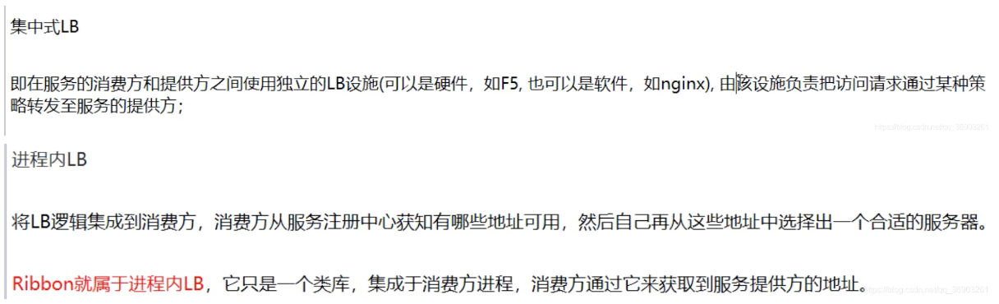


### Ribbon 的工作流程

- 选择同一区域内负载较少的注册中心 Server
- 根据用户指定的策略，在 Server 取到的服务注册列表中选择一个地址


### 重温 RestTemplate

- 官网：https://docs.spring.io/spring-framework/docs/5.2.2.RELEASE/javadoc-api/org/springframework/web/client/RestTemplate.html

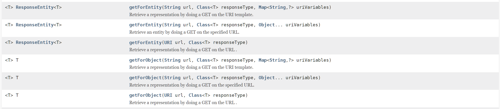

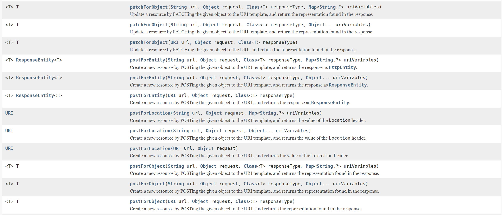

- `getForEntity()` 和 `getForObject()`
- `postForEntity()` 和 `postForObject()`


### Ribbon 提供的 IRule 接口

- 根据特定算法从服务列表中选取一个要访问的服务


- IRule 自带的实现类：*默认为 RoundRobinRule 轮询*


### 更换 Ribbon 负载均衡规则

> - Ribbon 的自定义配置类不可以放在 @ComponentScan 所扫描的当前包下以及子包下，否则这个自定义配置类就会被所有的 Ribbon 客户端共享，达不到为指定的 Ribbon 定制配置
> - 而 @SpringBootApplication 注解里就有 @ComponentScan 注解，所以不可以放在主启动类所在的包下。（因为 Ribbon 是客户端（消费者）这边的，所以 Ribbon 的自定义配置类是在客户端（消费者）添加，不需要在提供者或注册中心添加）

1. 在当前包外面新建 `com.atguigu.myrule` 包

```java
@Configuration
public class MySelfRule {

    @Bean
    public IRule myRule(){
        return new RandomRule();    //负载均衡机制改为随机
    }

}

```

2. 为启动类添加注解
    - name 为指定的服务名（服务名必须与注册中心显示的服务名大小写一致）
    - configuration 为指定服务使用自定义配置（自定义负载均衡机制）

```java
@RibbonClient(name = "CLOUD-PAYMENT-SERVICE", configuration = MySelfRule.class)
```

3. 重启此消费者工程，可以看到此时不再是轮询而是随机


### Ribbon 轮询负载均衡原理

- 轮询算法：当前请求计数 % 集群总数 = N 号服务
    - 1 % 2 = 1 号服务
    - 2 % 2 = 0 号服务
    - 3 % 2 = 1 号服务


- 由 RoundRobin 实现的 IRule 接口中 choose 方法

```java
public Server choose(ILoadBalancer lb, Object key) {
    // 判断负载均衡算法是否为 NULL 如果为 NULL 则返回空
    if (lb == null) {
        log.warn("no load balancer");
        return null;
    }

    Server server = null;
    int count = 0;
    while (server == null && count++ < 10) {、
        // 获取可达的服务
        List<Server> reachableServers = lb.getReachableServers();
        // 获得所有的服务
        List<Server> allServers = lb.getAllServers();
		// 获取可达的服务数量、所有的服务数量
        int upCount = reachableServers.size();
        int serverCount = allServers.size();
		
		// 判断可达的和所有的服务数量是否为 0, 如果为 0 则返回空
        if ((upCount == 0) || (serverCount == 0)) {
            log.warn("No up servers available from load balancer: " + lb);
            return null;
        }

		// 获取到当前轮到的服务下标
        int nextServerIndex = incrementAndGetModulo(serverCount);
		// 获取该下标的服务
        server = allServers.get(nextServerIndex);

		// 如果服务为 NULL 则返回空
        if (server == null) {
            /* Transient. */
            Thread.yield();
            continue;
        }

        if (server.isAlive() && (server.isReadyToServe())) {
            return (server);
        }

        // Next.
        server = null;
    }

    if (count >= 10) {
        log.warn("No available alive servers after 10 tries from load balancer: "
                + lb);
    }
    return server;
}
```

- 通过 CAS 自旋锁（比较并交换）如果当前值的内存地址和期望值相同则交换并返回 true 否则在此自旋

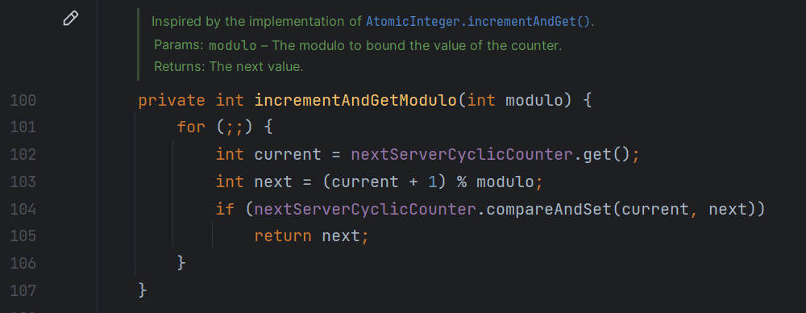

- 比较并交换: 
    - 将期望值 expect 与传入对象 this 在内存中的偏移量为 valueoffset 的值（旧值）作比较, 如果相等, 就把 update （新值）赋值给 valueoffset , 返回 true
    - 具体的操作是由类 sun.misc.Unsafe 来负责的，Unsafe 类提供了硬件级别的原子操作，使用 native 方法来间接访问操作系统底层（如系统硬件等)


### 手写轮询算法

1. 去除 `@LoadBalanced` 注解
2. 新建 lb 包，创建 ILoadBalancer 接口（面向接口编程）

```java
public interface ILoadBalancer {

    //传入具体实例的集合，返回选中的实例
    ServiceInstance instances(List<ServiceInstance> serviceInstance);

}
```

3. 创建实现类

```java
@Component  // 加入容器
public class MyLB implements ILoadBalancer {

    // 新建一个原子整形类
    private AtomicInteger atomicInteger = new AtomicInteger(0);

    // 获取当前访问计数
    public final int getAndIncrement() {
        int current;
        int next;
        do {
            current = this.atomicInteger.get();
            // 如果 current 是最大值，重新计算，否则加 1（防止越界）
            next = current >= Integer.MAX_VALUE ? 0 : current + 1;

            // 进行 CAS 判断，如果不为 true，进行自旋
        } while (!this.atomicInteger.compareAndSet(current, next));
        System.out.println("****第几次访问，次数next：" + next);

        return next;
    }

    @Override
    public ServiceInstance instances(List<ServiceInstance> serviceInstance) {
        // 非空判断
        if (serviceInstance.size() <= 0) {
            return null;
        }
        // 进行取余
        int index = getAndIncrement() % serviceInstance.size();
        // 返回选中的服务实例
        return serviceInstance.get(index);
    }

}
```

4.  在 Controller 中添加方法，使用自己轮询算法获取到的服务实例 URI 进行访问

```java
    // 注入自己写的负载均衡
    @Resource
    private ILoadBalancer iLoadBalancer;

    // 注入获取所有服务实例列表所需的
    @Resource
    private DiscoveryClient discoveryClient;

    @GetMapping("/consumer/payment/lb")
    public String getPaymentLB(){
        //获取 CLOUD-PAYMENT-SERVICE 服务的所有具体实例
        List<ServiceInstance> instances = discoveryClient.getInstances("CLOUD-PAYMENT-SERVICE");
        if(instances == null || instances.size() <= 0){
            return null;
        }

        // 调用自己写的负载均衡轮询
        ServiceInstance serviceInstance = iLoadBalancer.instances(instances);
        // 获取到当前轮到的 URI
        URI uri = serviceInstance.getUri();
        System.out.println(uri);

        // 使用轮询到的 URI 进行访问
        return restTemplate.getForObject(uri + "/payment/lb", String.class);
    }
```

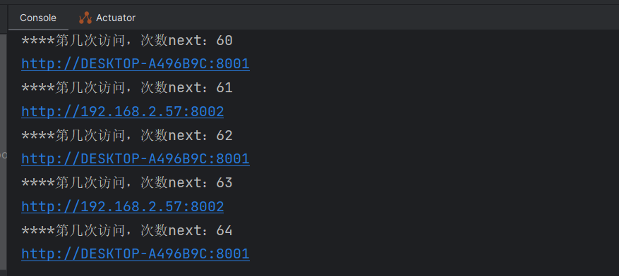


## OpenFeign 服务接口调用

- Feign 是一个声明式的 web 服务客户端，让编写 web 服务客户端变得非常容易，只需创建一个接口并在接口上添加注解即可
- 支持可拔插式的编码器和解码器，就是在参考 Ribbon 的基础上做的一套服务接口加注解方式调用的整合
- Feign 已经过时，OpenFeign 替代了它。官网：https://github.com/spring-cloud/spring-cloud-openfeign


### 什么是 Feign、OpenFeign

- Feign 旨让编写 Java HTTP 客户端更容易
- 在实际开发中，对于服务以来的调用可能远远不止一处，一个接口可能会被多处调用，所以通常需要对每个微服务进行封装一些客户端类来包装这些调用
- 使用 Feign 只需创建一个**接口**并使用注解的方式来配置它即可，完成服务提供方的接口绑定
- Feign 集成了 Ribbon（维护服务列表信息再通过轮询实现客户端负载均衡）Feign 只需要定义服务绑定接口并以声明式的方法，优雅而简单的实现了服务调用


### 搭建 OpenFeign 工程

1. 创建消费者工程，添加 POM 依赖

```xml
		<!-- openfeign -->
        <dependency>
            <groupId>org.springframework.cloud</groupId>
            <artifactId>spring-cloud-starter-openfeign</artifactId>
        </dependency>
```

2. 在启动类上添加注解，激活并开启 Feign

```java
@SpringBootApplication
@EnableFeignClients // 激活 Feign
public class OrderFeignMain80 {
    public static void main(String[] args) {
        SpringApplication.run(OrderFeignMain80.class, args);
    }

}
```

3. 在 service 包中创建 FeignService 接口并添加注解指定生产者微服务别名 <a id='OpenFeignService'> </a> 

```java
@FeignClient(value = "CLOUD-PAYMENT-SERVICE")
public interface PaymentFeignService {

    @GetMapping("/payment/get/{id}")
    public CommonResult<Payment> getPaymentById(@PathVariable("id") Long id);

}
```

4. 在控制层中注入 Feign 接口，调用其中方法就是调用生产者

```java
@RestController
@Slf4j
public class OrderFeignController {

    @Resource
    private PaymentFeignService paymentFeignService;

    @GetMapping("/consumer/payment/get/{id}")
    public CommonResult<Payment> getPaymentById(@PathVariable("id") Long id) {
        return paymentFeignService.getPaymentById(id);
    }

}
```

- 在启动类上标注激活 Feign 的注解 `@EnableFeignClients` 
- 创建 FeignClient 的接口（这里是 PaymentFeignService）标注 `@FeignClient()` 注解并指定生产者服务别名
- 在这个接口中定义的方法要和生产者中的方法一样（复制过来，包括注解），在业务层中即可注入这个接口调用其方法（也就是调用生产者）


### Feign 的超时控制

- 消费者的超时报错：生产者一个业务需要用 3 秒种才能处理完成，但是消费者只愿意等 1 秒钟，1 秒之后就报错
- 默认的超时策略遇到这种长流程调用、复杂业务就会出现报错（消费者默认等待 1 秒钟）此时我们需要配置 Feign 的超时策略

```yml
# 没提示不管它，可以设置 (或使用 feign.client.config.default.ConnectTimeOut)
ribbon:
  # 指的是建立连接后从服务器读取到可用资源所用的时间
  ReadTimeout: 5000
  # 指的是建立连接使用的时间，适用于网络状况正常的情况下，两端连接所用的时间
  ConnectTimeout: 5000

```


### Feign 的日志增强

- 通过调整日志级别来对 Feign 接口调用情况进行监控和输出

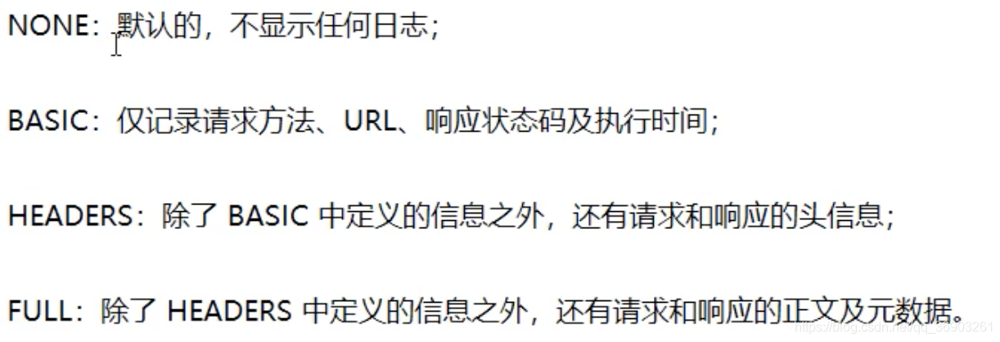

1. 在消费者 config.FeignConfig 类中进行配置

```java
import feign.Logger; // 不要导错包

@Configuration
public class FeignConfig {

    @Bean
    Logger.Level feignLoggerLevel(){
        //打印最详细的日志
        return Logger.Level.FULL;
    }

}
```

2. 在 YML 中添加配置

```yml
#开启日志的 feign 客户端
logging:
  level:
    # feign 日志以什么级别监控哪个接口
    com.atguigu.springcloud.service.PaymentFeignService: debug	# 写到 Feign 的服务接口

```


## Hystrix 断路器【维护】


### 服务降级 解决什么问题

- 在复杂的分布式体系结构中的应用程序有数十个依赖服务，每个依赖关系都不可避免出现失败
- 服务雪崩
    - 一个微服务调用 N 个微服务，这 N 个微服务又会调用 M 个微服务... 【**扇出**】
    - 如果扇出链路上某个微服务调用时间过长或不可用，对第一个服务的调用就会占用越来越多的系统资源
    - 为了解决这种雪崩（**级联故障**）问题，提出服务降级的概念（链路中断的解决方案）


### 什么是 Hystrix

- 是一种用于处理分布式的 **延迟**、**容错** 的开源库，保证在一个依赖出错的情况下，避免级联故障，以提高分布式系统的弹性
- `断路器` 当监控到某个服务故障后，向调用方法返回一个符合预期的、可处理的备选方案（FallBack），而不是长时间等待或异常
- **保证服务调用方的线程不会被长时间占用**，从而避免了故障在分布式系统中的蔓延，乃至雪崩

- 官网：https://github.com/Netflix/Hystrix/wiki/How-To-Use


### 服务降级 相关概念

- 服务降级（fallback）

    - 在服务出现问题的时候，提供一个备选处理方案（友好提示）
    - 触发降级：运行异常、服务超时、服务熔断、线程池 / 信号量 满

    > 提供者和消费者都可以进行服务降级。（一般都是放在客户端（消费者））

- 服务熔断（break）

    - 相当于保险丝达到最大访问量后，拒绝访问，跳闸停电
    - 调用服务降级的方案返回友好提示

- 服务限流（flowlimit）

    - 当出现高并发情况，一窝蜂的拥挤，此时服务限流让大家排队，每秒处理 N 个，有序进行


### 搭建 Hystrix 工程

1. 创建生产者工程，配置 POM 文件添加 Hystrix 启动依赖

```xml
		<!-- hystrix-->
        <dependency>
            <groupId>org.springframework.cloud</groupId>
            <artifactId>spring-cloud-starter-netflix-hystrix</artifactId>
        </dependency>
```

2. 编写 YML 配置文件，服务端口、微服务名、注册中心

```yml
server:
  port: 8001


spring:
  application:
    name: cloud-provider-hystrix-payment


eureka:
  client:
    register-with-eureka: true
    fetch-registry: true
    service-url:
      # 单机版
      defaultZone: http://localhost:7001/eureka
```

3. 编写启动类，开启 Eureka 配置中心

```java
@SpringBootApplication
@EnableEurekaClient
public class PaymentHystrixMain8001 {
    public static void main(String[] args) {
        SpringApplication.run(PaymentHystrixMain8001.class, args);
    }

}
```


#### 高并发测试

- 这里配置两个接口，一个正常接口立即返回内容，一个超时接口等待三秒再返回

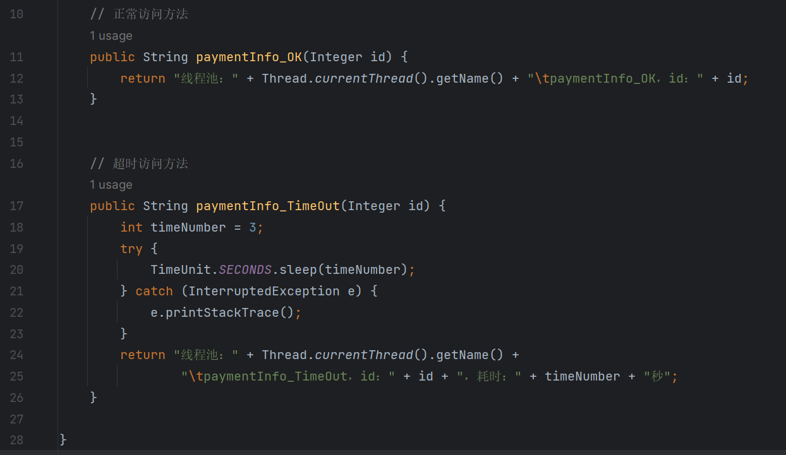

- 这时使用 JMeter 进行压力测试，开启线程组每秒 200 个线程，循环 100 次，向 超时接口 发送 HTTP 请求


- 此时发现问题：超时接口转圈卡顿，正常接口也发生转圈卡顿

- **Tomcat 线程池里面的工作线程已经被挤占完毕**，没有多余的线程来分解压力和处理。

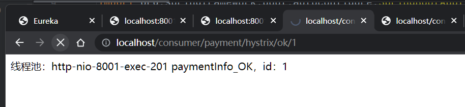

- 如果此时再加上消费者请求，还有可能造成 **消费端报超时错误**


### 服务降级 的情况

- 服务**提供者超时**了，消费者不能一直卡死等待，此时需要服务降级
- 服务**提供者宕机**了，消费者不能一直卡死等待，此时需要服务降级
- 服务**提供者没问题**，**消费者自己出故障、等待时间超了**，此时自己处理降级


### 在生产者端 服务降级配置

1. 为容易发生超时的方法上添加注解，指定超时的条件，超时的回调方法

```java
    @HystrixCommand(fallbackMethod = "paymentInfo_TimeOutHandler", commandProperties = {
            // 设置自身超时调用时间的峰值为 3 秒，峰值内可以正常运行，超过了需要有兜底的方法处理，服务降级 fallback
            @HystrixProperty(name = "execution.isolation.thread.timeoutInMilliseconds", value = "3000")
    })
    public String paymentInfo_TimeOut(Integer id) {
        int timeNumber = 5;
        try {
            TimeUnit.SECONDS.sleep(timeNumber);
        } catch (InterruptedException e) {
            e.printStackTrace();
        }
        return "线程池：" + Thread.currentThread().getName() +
                "\tpaymentInfo_TimeOut，id：" + id + "，耗时：" + timeNumber + "秒";
    }

    public String paymentInfo_TimeOutHandler(Integer id) {
        return "线程池：" + Thread.currentThread().getName() + "\tpaymentInfo_TimeOutHandler，id：" + id;
    }
```

2. 在启动类上添加注解

```java
@EnableCircuitBreaker // 启用断路器
```

- 此时调用接口访问此方法，在满足超时条件时，会自动调用其对应的 fallback 方法【**可以看到此处用的是 Hystrix 的线程池中的线程**】

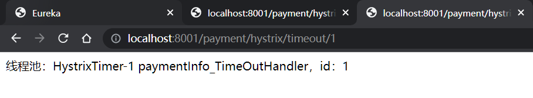

- 如果是运行时异常，也会自动调用其对应的 fallback 方法

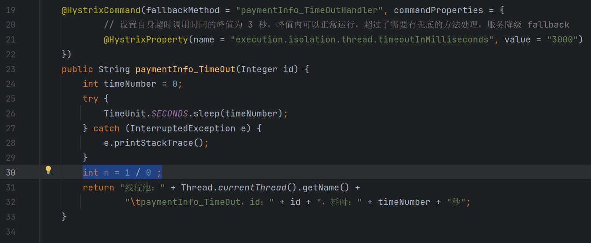


> SpringBoot 的热部署插件对 @HystrixCommand 内属性的修改不灵，建议手动重启


### 在消费者端 服务降级配置

1. 在消费者的 YML 配置文件中添加，开启 Feign 对 Hystrix 断路器的支持

```yml
feign:
  hystrix:
    enabled: true
```

2. 在启动类上添加注解开启 Hystrix 的支持

```java
@EnableHystrix // 其中包含了 @EnableCircuitBreaker
```

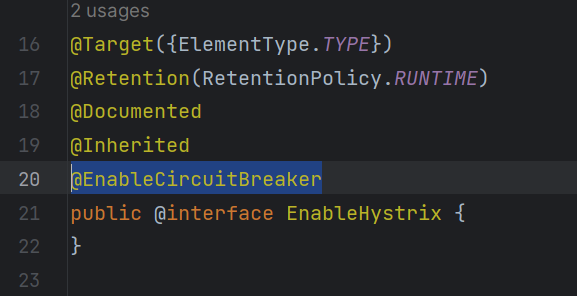

3. 和生产者一样配置断路的处理

```java
@HystrixCommand(fallbackMethod = "paymentTimeOutFallbackMethod", commandProperties = {
        @HystrixProperty(name = "execution.isolation.thread.timeoutInMilliseconds", value = "1500")
})
@GetMapping("/consumer/payment/hystrix/timeout/{id}")
public String paymentInfo_TimeOut(@PathVariable("id") Integer id){
    String result = paymentHystrixService.paymentInfo_TimeOut(id);
    return result;
}

public String paymentTimeOutFallbackMethod(@PathVariable("id") Integer id){
    return "消费者80，支付系统繁忙";
}
```

- 测试发现：
    - 如果是由于生产者的超时造成的服务降级，则优先进入 消费者 fallback
    - 如果是由于生产者的异常造成的服务降级，则优先进入 生产者 fallback
    - 如果是由于消费者等不及造成的服务降级，则优先进入 消费者 fallback


### 遇到的问题 <a id='HystrixProblem'> </a> 

- 每个业务方法都要配置一个兜底方法，导致代码膨胀

    - 除了个别业务有专属 fallback，其它普通业务可以配置全局统一兜底方法：为类添加注解并设置统一兜底方法，在业务方法上添加注解

        ```java
        @Slf4j
        @RestController
        @DefaultProperties(defaultFallback = "payment_Global_FallbackMethod")
        public class OrderHystrixController {
        
            @Resource
            private PaymentHystrixService paymentHystrixService;
        
        
            @HystrixCommand
            @GetMapping("/consumer/payment/hystrix/ok/{id}")
            public String paymentInfo_OK(@PathVariable("id") Integer id){
                String result = paymentHystrixService.paymentInfo_OK(id);
                return result;
            }
            
            // ...... 如果有需要独享兜底方法的业务方法也可以根据上方专属 fallback 配置来处理
        
            /**
             * 全局业务处理兜底 fallback 方法
             *
             * @return 提示
             */
            public String payment_Global_FallbackMethod(){
                return "消费者80，支付系统繁忙, 进入全局兜底方法";
            }
        
        }
        ```

- 兜底方法和业务逻辑混在一起，导致代码混乱，耦合度高

    1. 为 FeignClient 接口创建实现类，在实现类中重写所有接口方法，就是兜底方法

    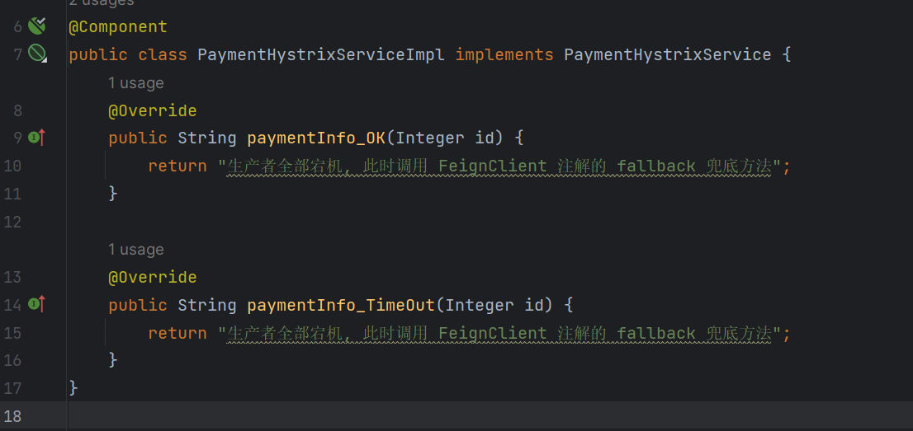

    2. 为接口 `@FeignClient` 注解添加 fallback 属性指定到这个实现类上 <a id='FeignClientFallback'> </a> 

    

    - 此时当所有生产者服务都宕机无法做出回应时，就会自动调用这里的兜底方法
    - 但是生产者还是可用状态只是无法在消费者接受的时间内响应的话，会调用消费者的全局兜底方法（有配置独享兜底方法除外）
    - 当生产者发生不是配置的超时问题时（运行时异常）则会调用生产者的兜底方法

- 此时服务端 provider 已经 down 了，但是我们做了服务降级处理，**让客户端在服务端不可用时也会获得提示信息而不会挂起耗死服务器**


### 服务熔断 的情况

- 服务调用失败会触发降级，降级会调用其 fallback 方法，无论如何降级的流程是先调用正常方法后调用 fallback 方法
- 服务熔断是指单位时间内失败的次数过多，也就是降级次数过多，则触发熔断 **跳过正常方法直接调用 fallback 方法** 
- `熔断后不可用` 就像是保险丝跳闸了，需要检测到节点调用响应正常后，恢复调用链路


### 在生产者端 服务熔断配置

- 在生产者 Service 中配置 `@HystrixCommand` 注解中配置开启断路器，设置在 10 秒时间内，总阈值为 10 次，如果错误率达到 60%（也就是 6 次），跳闸


- 添加对应控制层方法进行访问 
    - 在 10 秒内进行多次错误尝试，触发断路器服务熔断，此时如果再进行正确的访问依然进入 fallback 方法，10 秒后开启半开模式，直到正确的处理请求


### 服务限流 的情况

- 后面会在 SpringCloud  Alibaba 中的 Sentinel 说明


### 总结

> 如果请求次数的错误率超过指定值，开启熔断，经过一段时间后，变为半开模式然后放进一个请求进行处理，如果请求处理成功，关闭熔断；如果还是报错，继续进入熔断，再经过一段时间后，变为半开模式，再进行对下一个请求进行处理，一直在熔断，半开模式来回切换，直到请求成功，关闭熔断。


- 断路器在什么时候开始起作用

    

    - 快照时间窗：断路器确定是否打开 需要统计一些请求和错误数据，而统计的时间范围就是快照时间窗，默认为最近的 10 秒
    - 请求总数阈值：在快照时间窗内，必须满足请求总数阈值才有资格熔断。默认 20，意味着在 10 秒内，如果调用次数不足 20 次，即使所有的请求都超时或失败，断路器也不会打开
    - 错误百分比阈值：当请求总数在快照时间窗内超过了阈值，比如发生了 30 次调用，如果在这 30 次调用中，有 15 次发生了超时异常，也就是通过了 50% 的错误百分比（默认）这时候就会将断路器打开


### Hystrix 的 dashboard 仪表盘

- 如何搭建按照官网 WIKI：[Home · Netflix-Skunkworks/hystrix-dashboard Wiki (github.com)](https://github.com/Netflix-Skunkworks/hystrix-dashboard/wiki)


## Zuul 服务网关

- zuul 核心人员被挖走了三个、内部分歧，zuul2 的研发过久，spring  公司等不及，自己研发的 Gateway 网关
- Zuul 的官网 WIKI：[Home · Netflix/zuul Wiki (github.com)](https://github.com/Netflix/zuul/wiki)

> Zuul 1.x 是一个基于 Servlet 2.5 **阻塞 I/O** 的 API Gateway，每次 I/O 操作都是从工作线程中选择一个执行，请求线程被阻塞到工作完成完成
>
> Zuul 1.x 的设计模式和 Nginx 有点像，但是 Nginx 是用 C/C++ 实现的，Zuul 是用 Java 实现具有 JVM 首次加载较慢的特性，性能相对较差
>
> Zuul 2.x 是基于 Netty 非阻塞和支持长连接。SpringCloud 的 Gateway 是 Zuul 的 1.6 倍


### 什么是服务网关

- 统一的挡在前面进行日志、限流、权鉴、安全加固等


## Gateway 服务网关

- Gateway 提供一种简单有效的方式来对 API 进行路由
- 基于 Filter 链的方式提供网关的基本功能：安全、监控/指标、限流

- 为了提升性能 Gateway 是基于 WebFlux 框架实现的

> WebFlux 框架是 Spring5 提供的一种底层使用了高性能的 Reactor 模式通信框架 Netty，在高并发和非阻塞式通信场景下非常有优势
>
> > 阻塞式 I/O 模型中，例如 Servlet，当请求进入 servlet container 时，servlet container 就会为其绑定一个线程, 在并发不高的场景下这种模型是适用的。但是一旦高并发 (比如用 jemeter 压测) ，线程数量就会上涨，而线程资源代价是昂贵的 (上线文切换，内存消耗大) 严重影响请求的处理时间。在一些简单业务场景下, 不希望为每个 request 分配一个线程， 只需要 1 个或几个线程就能应对极大并发的请求，这种业务场景下 servlet 模型没有优势。
> >
> > 所以 Zuul 1.X 是基于 Servlet 之上的一个阻塞式处理模型, 即 spring 实现了处理所有 request 请求的一个 servlet (DispatcherServlet) 并由该 servlet 阻塞式处理处理。所以Springcloud Zuul无法摆脱 servlet 模型的弊端


### Gateway 的特性

1. 动态路由（Route）：能够匹配任何请求属性
2. 集成服务发现功能、Hystrix 的断路器功能
3. 拥有易于编写的 断言（Predicate）和过滤器（Filter）
4. 请求限流功能、支持路径重写


### Gateway 的核心概念

- 路由（Route）
    - 路由是构建网关的基本模块，它由ID，目标URI，一系列的断言和过滤器组成，如果断言为true则匹配该路由
- 断言（Predicate）
    - 参考的是 java8 的 java.util.function.Predicate 
    - 开发人员可以匹配 HTTP 请求中的所有内容（例如请求头或请求参数），如果请求与断言相匹配则进行路由
- 过滤（Filter）
    - 指的是Spring框架中GatewayFilter的实例，使用过滤器，可以在请求被路由前或者之后对请求进行修改。


### Gateway 工作流程

- 客户端向 Gateway 发出请求，然后在 Gateway handler Mapping 中**找到与请求相匹配的路由**【路由转发】
- 将其发送到 Gateway Web Handler 通过指定的**过滤链**来将请求发送到**实际的服务执行业务**逻辑【执行过滤链】
    - 在发送代理请求之前（pre）可以做参数校验、权限校验、流量监控、日志输出、协议转换等
    - 在处理完请求之后（post）可以做相应内容、响应头的修改、日志的输出、流量监控等


### 搭建 Gateway 工程

1. 添加 POM 依赖

```xml
	<!-- gateway -->
    <dependency>
        <groupId>org.springframework.cloud</groupId>
        <artifactId>spring-cloud-starter-gateway</artifactId>
    </dependency>
	<!-- eureka client(通过微服务名实现动态路由) -->
    <dependency>
        <groupId>org.springframework.cloud</groupId>
        <artifactId>spring-cloud-starter-netflix-eureka-client</artifactId>
    </dependency>
	<!-- 一般通用依赖 -->
	<!-- 此处不需要 spring-boot-starter-web 依赖，因为是网关，用的是 Webflux -->
```

2. 配置 YML 文件
    - 在配置了网关路由之后，想访问断言中的路径的话就会先经由此项目过滤

```yml
server:
  port: 9527

spring:
  application:
    name: cloud-gateway
  # 下方配置 Gateway
  cloud:
    gateway:
      routes:
        - id: payment_route # 路由的id, 没有规定规则但要求唯一, 建议配合服务名
          uri: http://localhost:8001 # 匹配后提供服务的路由地址
          predicates:
            - Path=/payment/get/** # 断言, 路径相匹配的进行路由

        - id: payment_route2 # 路由的id, 没有规定规则但要求唯一, 建议配合服务名
          uri: http://localhost:8001 # 匹配后提供服务的路由地址
          predicates:
            - Path=/payment/lb/** # 断言, 路径相匹配的进行路由

eureka:
  instance:
    hostname: cloud-gateway-service
  client:
    fetch-registry: true
    register-with-eureka: true
    service-url:
      defaultZone: http://eureka7001.com:7001/eureka/

```

3. 编写启动类

```java
@SpringBootApplication
@EnableEurekaClient
public class GatewayMain9527 {
    public static void main(String[] args) {
        SpringApplication.run(GatewayMain9527.class, args);
    }
}
```

4. 测试，此时通过 `http://localhost:8001/payment/get/1` 也可以访问


#### 第二种配置方式

- 使用注入 RouteLocator 的 Bean 的方式配置

1. 新建配置类 config.GatewayConfig

```java
@Configuration
public class GatewayConfig {

    @Bean
    public RouteLocator customRouteLocator(RouteLocatorBuilder routeLocatorBuilder) {
        RouteLocatorBuilder.Builder routes = routeLocatorBuilder.routes();

        routes.route("path_route_auguigu",  // id
                r -> r.path("/guonei")  // 访问 http://localhost:9527/guonei
                        .uri("https://news.baidu.com/"));  // 就会转发到 https://news.baidu.com

        routes.route("path_route_atguigu2",  // id
                r -> r.path("/guoji")  // 访问 http://localhost:9527/guoji
                        .uri("https://news.baidu.com/"));  // 就会转发到 https://news.baidu.com

        return routes.build();
    }

//    @Bean
//    public RouteLocator customRouteLocator2(RouteLocatorBuilder routeLocatorBuilder){
//        RouteLocatorBuilder.Builder routes = routeLocatorBuilder.routes();
//
//        routes.route("path_route_atguigu2",  //id
//                r -> r.path("/guoji")  //访问 http://localhost:9527/guoji
//                        .uri("https://news.baidu.com/"));  //就会转发到 https://news.baidu.com
//
//        return routes.build();
//    }

}

```


#### 实现动态路由

- 当前情况下路由地址是写死的，但是生产者往往都是集群，所以需要配置到生产者微服务别名，进行动态路由转发


1. 修改配置文件，开启动态路由功能，并修改提供服务的路由地址为生产者微服务别名

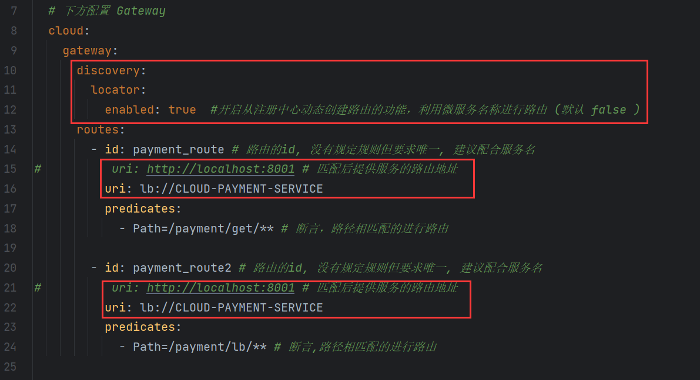


### 断言 Predicate 的使用

- 在项目启动时可以看到由断言工厂加载了很多 Predicate

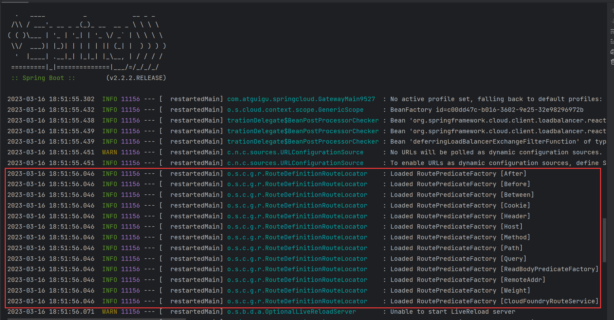


- 可以查看官网：[Spring Cloud Gateway](https://docs.spring.io/spring-cloud-gateway/docs/current/reference/html/#gateway-request-predicates-factories) 关于这部分的介绍

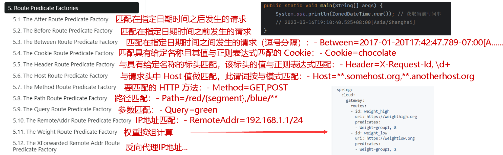

- 在原有 predicates 下方添加新的断言规则即可（这里 after 表示）

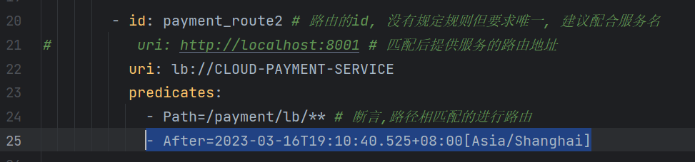

- 在添加了 cookie 断言时，使用 curl 命令测试

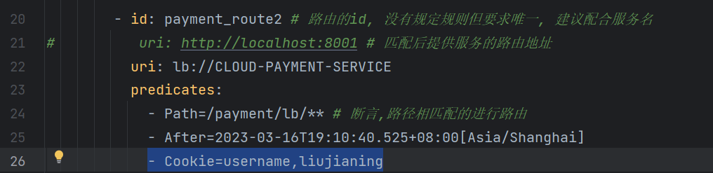

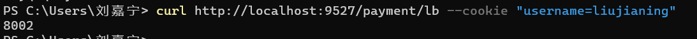

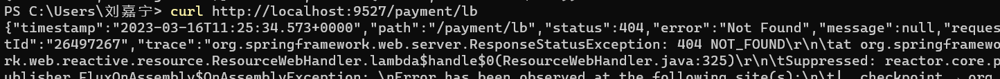

- 在添加了 Header 断言时，使用 curl 命令测试

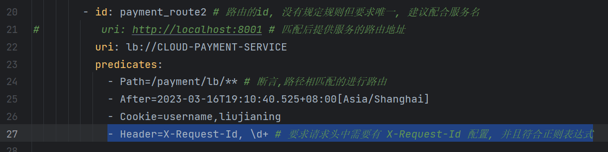


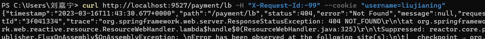


### 过滤器 Filter 的使用

- 按照生命周期划分
    - pre 前置过滤
    - post 后置过滤
- 按照种类划分
    - GatewayFilter 单一的（ 31 种）
    - GlobaFilter 全局的（ 10 种）

> 可以查看官网：[Spring Cloud Gateway](https://docs.spring.io/spring-cloud-gateway/docs/current/reference/html/#gatewayfilter-factories) 关于过滤器的使用

1. 在 Spring 可扫描包下创建 filter.MyLogGateWayFilter 实现 `GlobalFilter`  `Ordered` 接口
    - 在 filter 方法下写过滤条件
    - 在 getOrder 方法返回当前过滤器优先级，优先级越高越先过滤

```java
@Component
@Slf4j
public class MyLogGateWayFilter implements GlobalFilter, Ordered {


    @Override
    public Mono<Void> filter(ServerWebExchange exchange, GatewayFilterChain chain) {
        log.info("**************come in MyLogGateWayFilter：" + new Date());
        //获取request中的uname参数
        String uname = exchange.getRequest().getQueryParams().getFirst("uname");

        if(uname == null){
            log.info("*******用户名为null，非法用户！！");
            //设置响应，不被接受
            exchange.getResponse().setStatusCode(HttpStatus.NOT_ACCEPTABLE);

            return exchange.getResponse().setComplete();
        }

        //返回chain.filter(exchange)，放行
        return chain.filter(exchange);
    }

    @Override
    public int getOrder() {
        //返回值是过滤器的优先级，越小优先级越高（最小-2147483648，最大2147483648）
        return 0;
    }
}
```

2. 测试使用


## Config 分布式服务配置

- 由于微服务种单个服务的粒度相对较小，因此系统中会出现大量的服务。每套系统都需要必要的配置信息才能运行
- 所以一套集中的、动态的配置管理，为各个不同微服务应用的环境提供一种中心化的外部配置
- SpringCLoud Config 提供动态化的配置更新，不同环境不同配置。可以在运行期间动态调整配置，服务不需要重启便可感知到配置的变化并应用新的配置
- 官网：https://docs.spring.io/spring-cloud-config/docs/current/reference/html/


- 服务端：也称微服务配置中心，是一个独立的微服务应用，用来连接配置服务器并为客户端提供获取配置信息，加密/解密信息等访问接口
- 客户端：通过配置中心来获取配置内容管理应用资源


### 搭建服务端配置

1. 在 Github 中创建一个名为 springcloud-config 的工程，其中配置文件命名应符合 `{application}-{profile}.yml` 写法
2. 创建配置中心服务端，在 POM 中添加 config 依赖

```xml
    <!-- config server -->
    <dependency>
        <groupId>org.springframework.cloud</groupId>
        <artifactId>spring-cloud-config-server</artifactId>
    </dependency>
	<!-- 注册中心依赖、一般通用依赖 ... -->
```

3. 配置 YML 文件

```yml
server:
  port: 3344


spring:
  application:
    name: cloud-config-center # 注册进 Eureka 服务器的微服务名
  cloud:
    config:
      server:
        git:
          uri: https://github.com/LiuJJJJN/springcloud-config.git  # git 的仓库地址
          default-label: main # 读取的分支
#          search-paths:   # 搜索目录
#            - springcloud-config

eureka:
  client:
    service-url:
      defaultZone: http://localhost:7001/eureka   # 服务注册到的 eureka 地址

```

4. 配置主启动类，添加注解 `@EnableConfigServer`

```java
@EnableConfigServer
@SpringBootApplication
public class ConfigCenterMain3344 {
    
    public static void main(String[] args) {
        SpringApplication.run(ConfigCenterMain3344.class, args);
    }
    
}
```

5. 修改 Hosts 文件添加映射

```
127.0.0.1       config-3344
```

6. 此时访问 `config-3344:3344/分支名/文件名` 就可以看到 Github 仓库中对应文件的内容


### 配置读取规则


- `/分支名/XXX-XX.yml` 方式：推荐写法


- `/XXX-XX.yml` 方式：使用的配置中的分支，默认 master


- `/XXX-XX.yml/分支名` 方式：JSON 串


### 搭建客户端配置

1. 创建模块添加 POM 依赖

```xml
		<!-- config client -->
        <dependency>
            <groupId>org.springframework.cloud</groupId>
            <artifactId>spring-cloud-starter-config</artifactId>
        </dependency>
        <!-- 注册中心依赖、一般通用依赖 ... -->
```

2. 编写 bootstrap.yml配置文件
    - bootstrap.yml是系统级的有更高的优先级，优先被加载，不会被本地配置覆盖
    - SpringCloud 会创建一个 Bootstrap Context 作为 Spring 应用的 Application Context 的父上下文
    - 初始化的时候 Bootstrap Context 负责从外部源加载配置属性并解析配置，他俩共享一个外部获取的 Environment

```yml
server:
  port: 3355


spring:
  application:
    name: config-client
  cloud:
    config: # config 客户端配置
      label: main   # 分支名称
      name: config    # 配置文件名称       这三个综合 main 分支上的 config-dev.yml 的配置文件
      profile: dev    # 读取后缀名称       被读取到 http://config-3344:3344/main/config/dev
      uri: http://localhost:3344  # 配置中心地址


eureka:
  client:
    service-url:
      defaultZone: http://localhost:7001/eureka   #服务注册到的eureka地址

```

3. 主启动类

```java
@SpringBootApplication
@EnableEurekaClient
public class ConfigClientMain3355 {
    public static void main(String[] args) {
        SpringApplication.run(ConfigClientMain3355.class, args);
    }

}
```

4. 编写控制层，使用 `@Value` 注解可读取到 bootstrap.yml 配置中对应文件的 config.info 内容

```java
@RestController
public class ConfigClientController {

    @Value("${config.info}")   // 读取 yml 配置中对应文件的 config.info 内容
    private String configInfo;

    @GetMapping("/configInfo")
    public String getConfigInfo(){
        return configInfo;
    }

}
```

5. 测试，读取成功

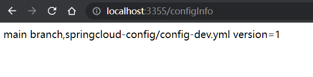


### 配置动态刷新问题

- 当 Github 上的配置文件内容修改之后，Config 服务端可以立即刷新获取到，但是 Config 客户端还是之前的配置，无法刷新到新配置（重启才能获得）

1. 为 Config 客户端添加 Spring 服务监控依赖【除了网关之外，都应添加此依赖】

```xml
		<dependency>
            <groupId>org.springframework.boot</groupId>
            <artifactId>spring-boot-starter-actuator</artifactId>
        </dependency>
```

2. 添加新的 YML 配置

```yml
# 暴露监控端点
management:
  endpoints:
    web:
      exposure:
        include: "*"

```

3. 为业务类添加 `@RefreshScope` 注解 **实现配置自动更新** 

```java
@RestController
@RefreshScope
public class ConfigClientController {

    @Value("${config.info}")	// 读取 yml 配置中对应文件的 config.info 内容
    private String configInfo;

    @GetMapping("/configInfo")
    public String getConfigInfo(){
        return configInfo;
    }

}
```

4. 测试，先启动 Config 客户端，再修改 Github 中文件内容，再刷新接口获取内容
    - 此时发现：还是无效啊？？？？？？


5. 此时需要运维人员使用 POST 方式向 `http://localhost:3355/actuator/refresh` 发送刷新请求

```bash
curl -X POST http://localhost:3355/actuator/refresh
```


6. 再刷新 Config 客户端接口，即可访问刷新后的内容


## Bus 消息总线

- 消息总线可以实现 **微服务配置中心** 的增强补充：批量刷新，广播、差异化、动态刷新

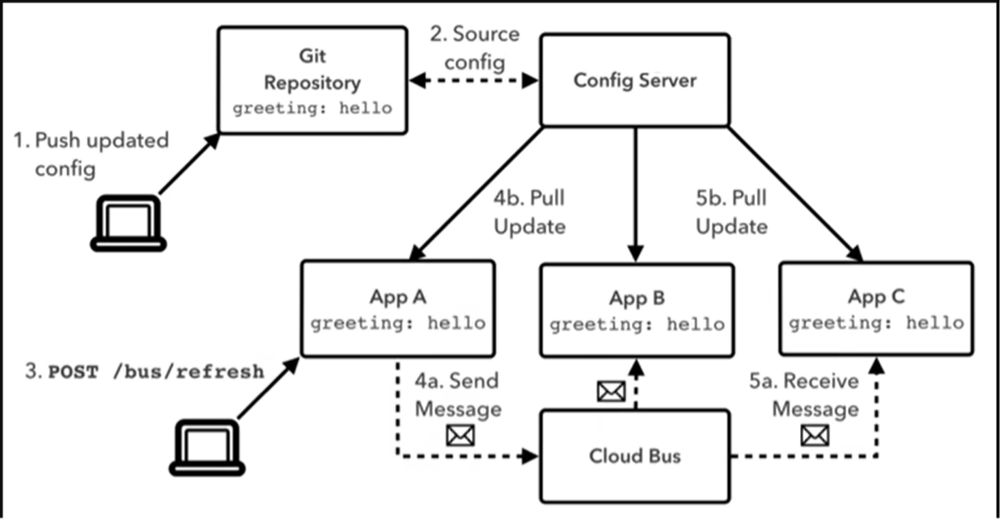

> 1. Bus 消息总线，可以触发一个客户端节点 /bus/refresh 端点，从而刷新所有的客户端配置
>
> 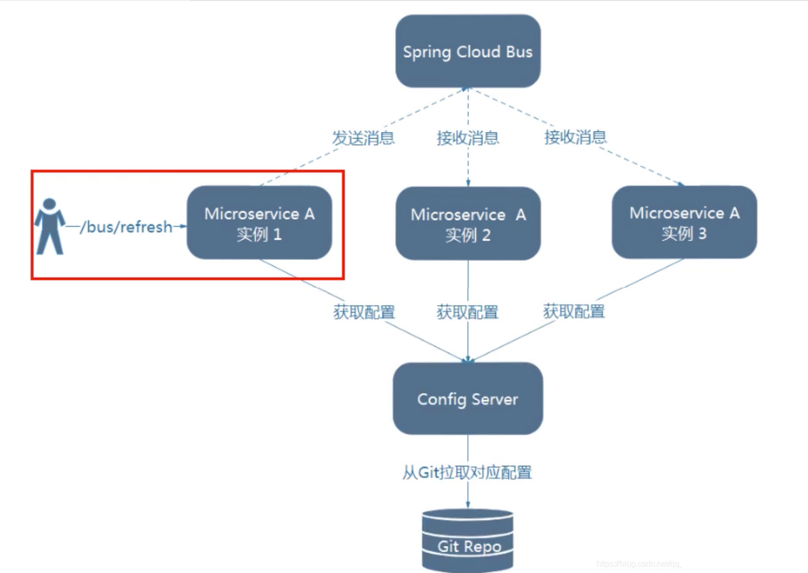
>
> 2. Bug 消息总线，可以触发一个配置中心服务端 /bus/refresh 端点，从而刷新所有客户端配置
>
> 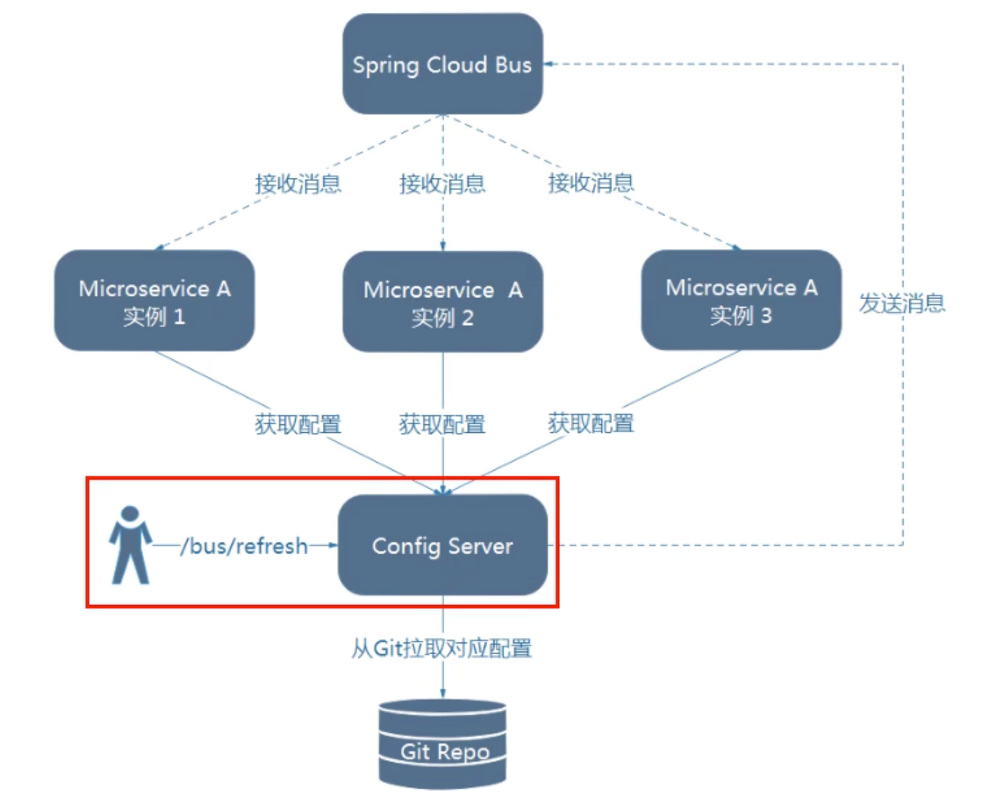

- Bus 就是将 **分布式系统的节点** 与 **轻量级消息系统** 链接起来的框架
- Bus 整合了 **Java 的事件处理机制** 和 **消息中间件** 功能
- SpringCloud Bus 支持两种消息代理：RabbitMQ 和 Kafka


### 什么是 总线

- 在微服务架构的系统中，通常会用轻量级的信息代理来构建一个**共用的消息主题**，让所有微服务实例连接到
- 由于该主题中**产生的信息会被所有实例监听和消费**，所以称它为**消息总线**，让连接在该主题的实例都收到通知


### 配置 Bus 工程实现全局广播

1. 搭建良好的 RabbitMQ 环境
2. 再创建一个配置中心客户端，以便演示广播效果（参照上方 cloud-config-client-3355 模块）
3. 为配置中心服务端添加信息总线
    - 这里使用 Bus 消息总线向配置中心 Center 发送刷新，为何？
        - 如果向客户端发送刷新任务，打破了微服务的职责单一性，业务模块不应该承担配置刷新职责
        - 如果向客户端发送刷新任务，破坏了微服务各个节点的对等性，业务模块集群应众生平等
        - 如果向客户端发送刷新任务，有一定的局限性，服务迁移时地址变化，此时刷新需做更多修改

4. 为配置中心服务端添加 POM 依赖

```xml
        <!-- 添加消息总线 RabbitMQ 的支持 -->
        <dependency>
         <groupId>org.springframework.cloud</groupId>
         <artifactId>spring-cloud-starter-bus-amqp</artifactId>
        </dependency>
```

5. 为配置中心服务端添加 YML 配置

```yml
spring:
  rabbitmq:
    host: 10.211.55.17
    port: 5672 # 客户端和 RabbitMQ 进行通信的端口
    username: guest
    password: guest
    
    
management:
  endpoints:  # 暴露 bus 刷新配置的监控端点
    web:
      exposure:
        include: 'bus-refresh'

```

6. 为配置中心客户端添加 POM 依赖 和 YML 配置

```xml
		<!-- 添加消息总线 RabbitMQ 的支持 -->
        <dependency>
            <groupId>org.springframework.cloud</groupId>
            <artifactId>spring-cloud-starter-bus-amqp</artifactId>
        </dependency>
```

```yml
spring:
 rabbitmq:
    host: 192.168.30.129
    port: 5672 # 客户端和 RabbitMQ 进行通信的端口
    username: guest
    password: guest
    
# 客户端原先已经暴露了 "*" 已经包含了 refresh 监控端点
```

7. 启动项目，可以发现此时配置中心刷新可以获得到最新版本，但是 ConfigClient 无法刷新到最新版本配置


8. 此时，再刷新客户端集群就都可以访问到最新配置版本了

```bash
curl -X POST http://localhost:3344/actuator/bus-refresh
```


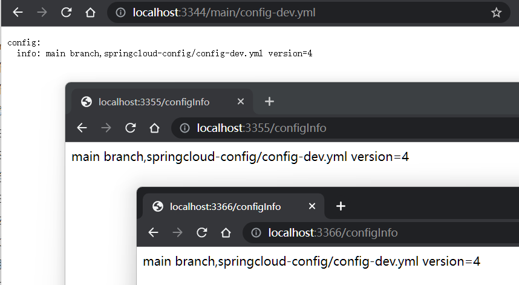


### 配置 Bus 工程实现定点通知

1. 向配置中心服务端发送刷新请求，并指定只刷新 3355 这个客户端

```bash
curl -X POST "http://localhost:3344/actuator/bus-refresh/config-client:3355"
```

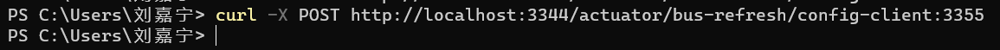

2. 查看效果

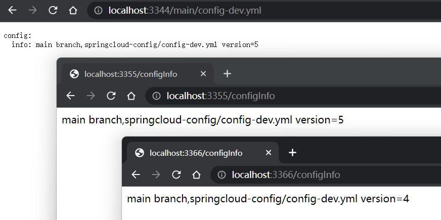


### 总结

- 在 Github 仓库更新之前，由配置中心服务端读取仓库中的配置内容，配置客户端订阅配置中心上的 Bus 消息总线消息队列
- 当 Github 仓库更新之后，配置中心即可通过 Webhook 获取到仓库中的配置内容，当程序员通过 actuator 发送刷新请求之后
- 客户端监听到消息队列中发布的刷新事件，向配置中心服务端获取配置信息


## Stream 消息驱动

- 是一个构建消息驱动微服务的框架，为一些消息中间件产品提供了个性化的自动化配置实现，引用了：发布-订阅、消费组、分区 三个核心概念


- 屏蔽底层消息中间件的差异，降低切换版本，统一消息的编程模型（通过使用 Spring Integration 来连接消息代理中间件以实现消息事件驱动）

> SpringCloud Stream 是用于构建与共享消息传递系统连接的高度可扩展的事件驱动微服务框架
>
> - 官网：[Spring Cloud Stream](https://spring.io/projects/spring-cloud-stream#overview)
> - API 手册：[Spring Cloud Stream Reference Documentation](https://docs.spring.io/spring-cloud-stream/docs/current/reference/html/)


### SpringCloud Stream 的设计思想

- 传统标准 MQ：

    

    - 生产者/消费者之间靠**消息**媒介传递消息内容：Message（约定好的格式：消息头、消息正文、消息附件属性）
    - 消息必须走特定的**通道**：消息通道 MessageChannel
    - 消息通道里的消息如何被消费（收发处理）：消息通道中的子接口 SubscribableChannel，由 MessageHandler 消息处理器**订阅**

- 引入 Stream 之后
    - RabbitMQ 和 Kafka 架构上的不同：RabbitMQ 有 exchange，Kafka 有 Topic 和 Partitions 分区
    - 通过**定义 binder 绑定器作为中间层**，实现了应用程序与消息中间件细节之间的**解耦**、**隔离**
    - 通过向应用程序**暴露统一的 Channel 通道**，使得应用程序不需要再考虑不同消息中间件落地实现

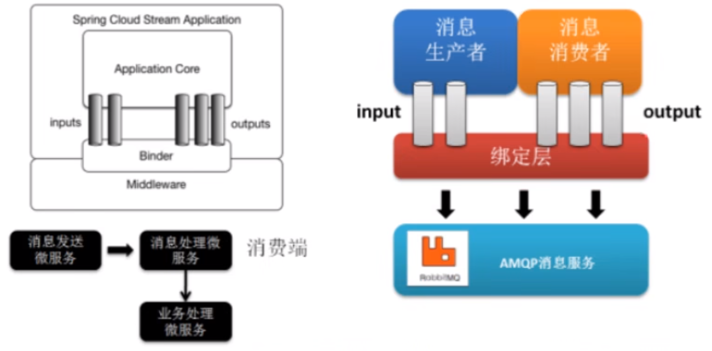

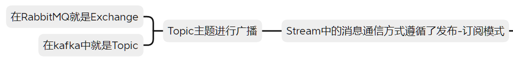

1. Binder：绑定器，可以很方便的连接中间件，屏蔽差异
2. Channel：通道，是队列 Queue 的一种抽象，在消息通讯系统中就是实现存储和转发的媒介，通过 Channel 对队列进行配置
3. Source / Sink：从 Stream 发布消息就是输出，接受消息就是输入。简单的理解就是生产者 / 消费者


- 常用 API 和注解

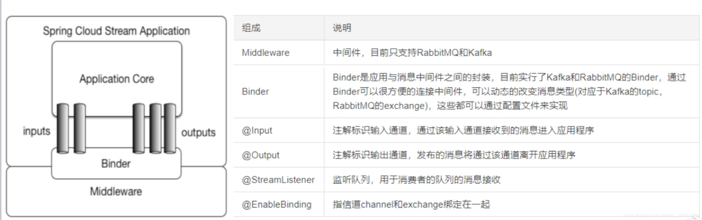


### 搭建 Stream 工程


#### 搭建消息生产者 8801 模块

1. 创建生产者模块 8801 

```xml
        <!-- stream rabbit -->
        <dependency>
            <groupId>org.springframework.cloud</groupId>
            <artifactId>spring-cloud-starter-stream-rabbit</artifactId>
        </dependency>
		<!-- 注册中心及一般通用依赖... -->
```

2. 配置 YML 文件

```yml
server:
  port: 8801

spring:
  application:
    name: cloud-stream-provider
  rabbitmq: # 由于 RabbitMQ 是配置在服务器上的, 为避免试图访问 localhost:5672 的第二次连接, 所以 rabbitmq 的相关环境配置在此配置
    host: 192.168.30.129
    port: 5672
    username: guest
    password: guest
  cloud:
    stream:
      binders: # 在此处配置要绑定的 rabbitmq 的服务信息
        defaultRabbit: # 表示定义的名称, 用于 binding 整合
          type: rabbit # 消息组件类型
#          environment: # 设置 rabbitmq 的相关环境配置
#            spring:
#              rabbitmq:
#                host: 192.168.30.129
#                port: 5672
#                username: guest
#                password: guest
      bindings: # 服务的整合处理
        output: # 这个名字是一个通道的名称, 表示这是一个生产者
          destination: studyExchange # 表示要使用的 Exchange 名称定义(会自动创建这个交换机)
          content-type: application/json # 设置消息类型，本次为 json，本文要设置为 “text/plain”
          binder: defaultRabbit # 设置要绑定的消息服务的具体设置（爆红不影响使用，位置没错）

eureka:
  client:
    service-url:
      defaultZone: http://localhost:7001/eureka
  instance:
    lease-renewal-interval-in-seconds: 2 # 设置心跳的时间间隔（默认是30S)
    lease-expiration-duration-in-seconds: 5 # 如果超过 5S 间隔就注销节点 默认是90s
    instance-id: send-8801.com # 在信息列表时显示主机名称
    prefer-ip-address: true # 访问的路径变为IP地址

```

3. 编写主启动类

```java
@SpringBootApplication
public class StreamMQMain8801 {
    public static void main(String[] args) {
        SpringApplication.run(StreamMQMain8801.class, args);

    }

}
```

4. 创建消息发布接口

```java
public interface IMessageProvider {
    public String send();
}
```

5. 实现接口，注入消息发送管道，向管道发送一条消息 UUID

```java
@EnableBinding(Source.class)    // 定义消息的推送管道(是生产者的输出管道)
public class IMessageProviderImpl implements IMessageProvider {

    @Resource
    private MessageChannel output;  // 消息发送管道

    @Override
    public String send() {
        String serial = UUID.randomUUID().toString();
        output.send(MessageBuilder.withPayload(serial).build());     // MessageBuilder 是 spring 的 integration.support.MessageBuilder
        System.out.println("*******serial: " + serial);
        return null;
    }

}
```

6. 编写控制层代码，调用消息发送功能

```java
@RestController
public class SendMessageController {

    @Resource
    private IMessageProvider iMessageProvider;

    @GetMapping("/sendMessage")
    public String sendMessage(){
        return iMessageProvider.send();
    }

}
```

7. 此时开启消息队列、注册中心服务、生产者服务，刷新 sendMessage 接口
    - 可以看到消息队列中有消息波峰流量

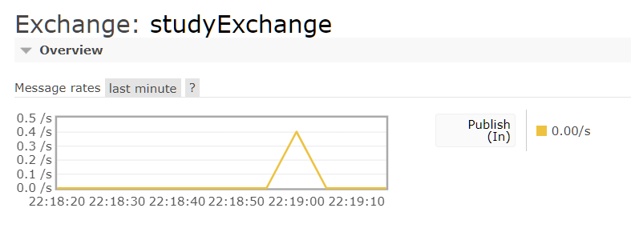


#### 搭建消息消费者 8802、8803 模块

1. 创建消费者 8802 工程
2. POM 文件同上方生产者
3. 配置 YML 

```yml
server:
  port: 8802

spring:
  application:
    name: cloud-stream-provider
  rabbitmq:
    host: 192.168.30.129
    port: 5672
    username: guest
    password: guest
  cloud:
    stream:
      binders: # 在此处配置要绑定的 rabbitmq 的服务信息
        defaultRabbit: # 表示定义的名称，用于 binding 整合
          type: rabbit # 消息组件类型
      bindings: # 服务的整合处理
        input: # 这个名字是一个通道的名称 **其它和生产者一样, 就是这里 output 变为 input**
          destination: studyExchange # 表示要使用的 Exchange 名称定义
          content-type: application/json # 设置消息类型, 本次为 json，本文要设置为 “text/plain”
          binder: defaultRabbit # 设置要绑定的消息服务的具体设置（爆红不影响使用，位置没错）

eureka:
  client:
    service-url:
      defaultZone: http://localhost:7001/eureka
  instance:
    lease-renewal-interval-in-seconds: 2 # 设置心跳的时间间隔（默认是30S)
    lease-expiration-duration-in-seconds: 5 # 如果超过 5S 间隔就注销节点 默认是 90s
    instance-id: receive-8802.com # 在信息列表时显示主机名称
    prefer-ip-address: true # 访问的路径变为 IP 地址

```

4. 配置主启动类同上方生产者

5. 编写消息监听控制层

```java
@EnableBinding(Sink.class) // 定义消息的接收管道(是消费者的输入管道)
@Controller
public class ReceiveMessageListenerController {

    @Value("${server.port}")
    private String serverPort;

    @StreamListener(Sink.INPUT) // 监听
    public void input(Message<String> message) {
        System.out.println("消费者1号------>收到的消息：" + message.getPayload() + "\t port：" + serverPort);
    }

}

```

6. 测试启动 8802 消费者，此时刷新 8801 的消息发布接口，可以看到 8802 消费者的控制台输出了对应内容，并且可以看到有服务绑定了队列交换机


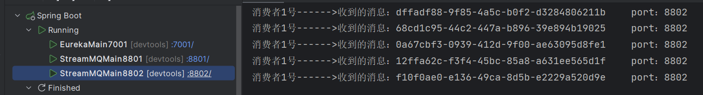


1. 根据上方步骤创建 8803 消费者模块，注意更改端口号、eureka 主机名避免重复
2. **重复消费问题**：当 8801 生产者刷新接口发布消息之后，8802、8803 都接收到了数据进行了消费


### 重复消费

- 如果是订单系统，有多个消费者都获取到了订单信息，造成重复消费查复扣款，问题严重
- 这种情况可以由 **消息分组** 解决：同一个组内会发生竞争关系，只能有一个消费者可以消费
- 主题会给每个队列发送消息，而每个队列只有一个消费者可以获得消息（同组广播，不同组轮询）

消费者 8002、8003 组流水号不一致，被认为不同组（这里的流水号就是组名，默认没设置就这样）

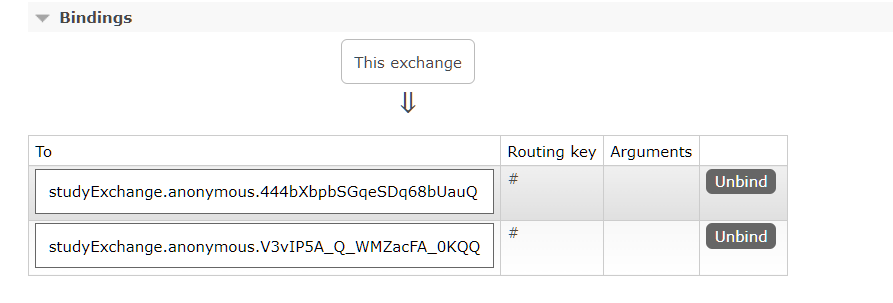

- 为两个消费者都设置 group 属性，并指定相同的 group 名即可解决

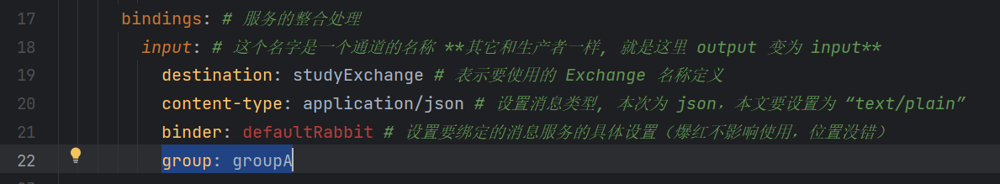

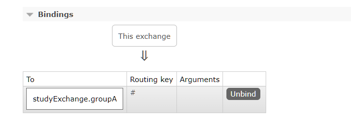

- 此时刷新两次发送消息接口，8802 和 8803 各接收到一条信息


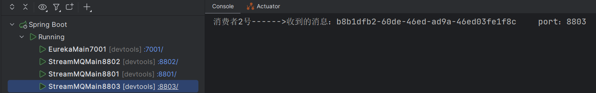


### 消息持久化

- 在停掉所有消费者的情况下发送消息、

    - 如果消费者 8802 去除了分组，则重启后无法获取消息
    - 如果消费者 8803 保留了分组，则重启后可以获取消息

    > 因为 8803 没删除 `group: groupA` ，groupA 队列是在 8801 发送消息前存在的，所以当 8803 停机后再启动，就可以获取到停机时 8801 发送的信息
    >
    > （ 如果此时同组（队列）里有别的消费者，那么消息会被别的消费者消费掉 ）


## Sleuth 分布式链路追踪

- 在微服务架构中，每个请求都要经过多个不同的服务节点协同调用才产生最后的请求结果，链路中任意一环出现高延时或错误都会引起整个请求的响应失败
- SpringCloud Sleuth 提供了一套完整的服务跟踪的解决方案，并且支持 zipkin
- 官网：[Spring Cloud Sleuth](https://spring.io/projects/spring-cloud-sleuth#overview) [spring-cloud/spring-cloud-sleuth: Distributed tracing for spring cloud (github.com)](https://github.com/spring-cloud/spring-cloud-sleuth)


### 如何使用

- 下载 zipkin 的 jar 包：[Central Repository: io/zipkin/zipkin-server (maven.org)](https://repo1.maven.org/maven2/io/zipkin/zipkin-server/)

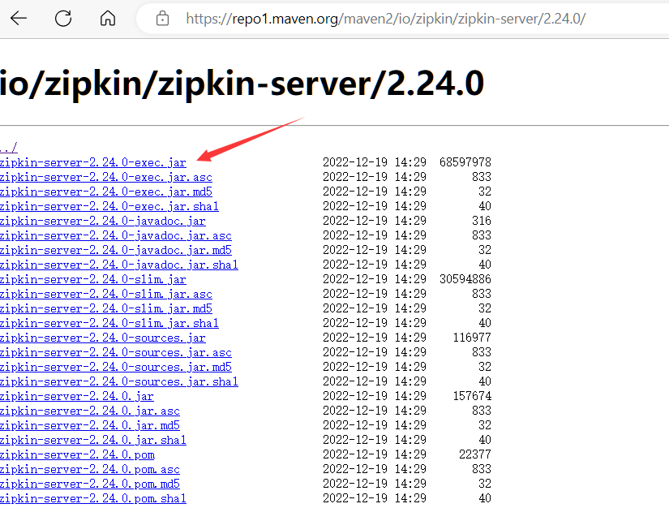

- 打开命令行使用 java -jar 命令运行 jar 包

```
java -jar .\zipkin-server-2.24.0-exec.jar
```

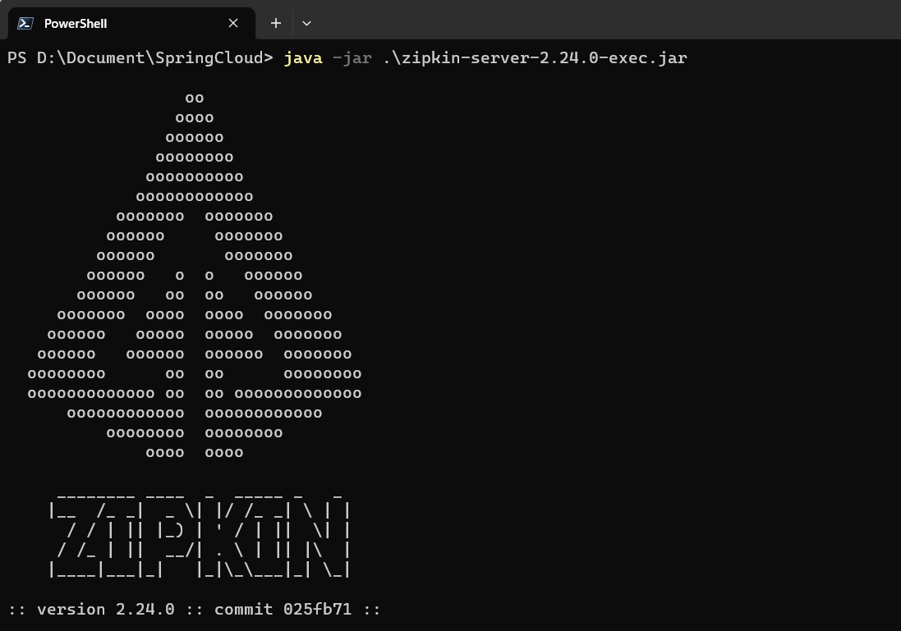

- 启动后访问 `http://localhost:9411/zipkin/` 


- 每条链路有一个 trace ID 唯一标识，span 标识发起的请求信息，各个 span 通过 trace ID 关联起来
    - Trace：类似于树结构的 Span 集合，表示一条调用链路存在的唯一标识
    - Span：标识每次调用链路来源，说白了 Span 就是一次请求信息

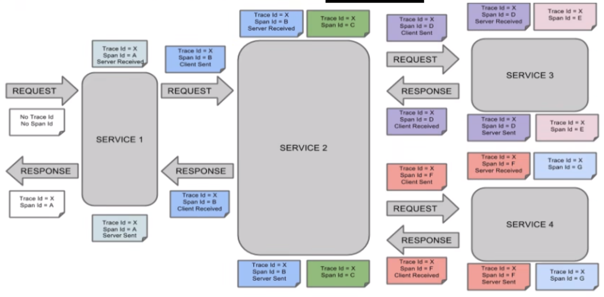


### 搭建链路追踪步骤

- 为服务生产者添加 POM 依赖

```xml
        <!-- 包含了 sleuth + zipkin -->
        <dependency>
           <groupId>org.springframework.cloud</groupId>
           <artifactId>spring-cloud-starter-zipkin</artifactId>
        </dependency>
```

- 为服务生产者添加 YML 配置

```yml
  zipkin:
    base-url: http://localhost:9411 # 将监控的数据打到这个地址
  sleuth:
    sampler:
      probability: 1  # 采样率值介于 0 到 1 之间, 1则表示全部采集（一般不为 1, 不然高并发性能会有影响）
```

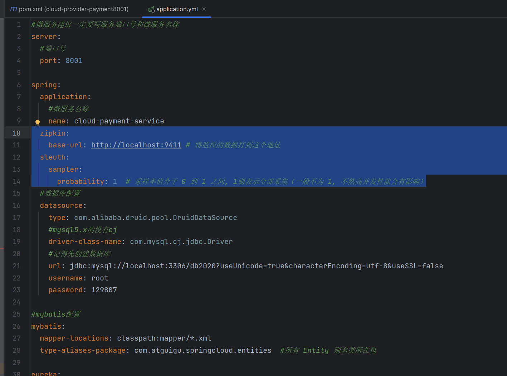

- 为服务消费者也添加同样的配置

- 启动注册中心、生产者、消费者服务，访问消费者接口调用生产者，刷新 zipkin 页面
    - 可以看到这次请求的请求路径、请求时间、花费时长


- 点击 show 按钮
    - 可以看到是哪个消费者接口调用的哪个生产者接口，各自的信息


- 点击依赖标签页，可以看到各个模块间的依赖关系图示

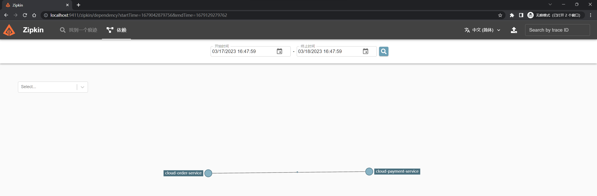


## SpringCloud Alibaba 部分

- 官网：https://github.com/alibaba/spring-cloud-alibaba/blob/master/README-zh.md

- 于 2018.10.31 在 Maven 中央仓库发布了第一个版本 0.2.0


### SpringCloud Alibaba 能干什么

- **服务限流降级**：默认支持 WebServlet、WebFlux、OpenFeign、RestTemplate、Spring Cloud Gateway、Zuul、Dubbo 和 RocketMQ 限流降级功能的接入，可以在运行时通过控制台实时修改限流降级规则，还支持查看限流降级 Metrics 监控。
- **服务注册与发现**：适配 Spring Cloud 服务注册与发现标准，默认集成了 Ribbon 的支持。
- **分布式配置管理**：支持分布式系统中的外部化配置，配置更改时自动刷新。
- **消息驱动能力**：基于 Spring Cloud Stream 为微服务应用构建消息驱动能力。
- **分布式事务**：使用 @GlobalTransactional 注解， 高效并且对业务零侵入地解决分布式事务问题。
- **阿里云对象存储**：阿里云提供的海量、安全、低成本、高可靠的云存储服务。支持在任何应用、任何时间、任何地点存储和访问任意类型的数据。
- **分布式任务调度**：提供秒级、精准、高可靠、高可用的定时（基于 Cron 表达式）任务调度服务。同时提供分布式的任务执行模型，如网格任务。网格任务支持海量子任务均匀分配到所有 Worker（schedulerx-client）上执行。
- **阿里云短信服务**：覆盖全球的短信服务，友好、高效、智能的互联化通讯能力，帮助企业迅速搭建客户触达通道。


### Nacos 作为服务注册

- Nacos：naming（na），Configuration（co），service（s）
- Dynamic Naming and Configuration Service：一个更易于构建云原生应用的动态服务发现，配置管理和服务管理平台
- Nacos 等价于：eureka + config + Bus
- 官网：[home (nacos.io)](https://nacos.io/zh-cn/)


#### 安装 Nacos

1. 获取 Nacos：[Releases · alibaba/nacos (github.com)](https://github.com/alibaba/nacos/releases)

2. 解压，打开 bin 目录
3. 运行 cmd `startup.cmd -m standalone` 


4. 访问 `http://localhost:8848/nacos/` 即可
   - 默认账号：nacos
   - 默认密码：nacos


#### 搭建 Nacos 工程

官网：[Spring Cloud Alibaba Reference Documentation (spring-cloud-alibaba-group.github.io)](https://spring-cloud-alibaba-group.github.io/github-pages/greenwich/spring-cloud-alibaba.html#_spring_cloud_alibaba_nacos_discovery)

##### 配置服务生产者

1. 新建工程 cloudalibaba-provider-payment9001
2. 添加 Nacos 的 discovery 依赖

```xml
		<!-- SpringCloud Alibaba nacos -->
        <dependency>
            <groupId>com.alibaba.cloud</groupId>
            <artifactId>spring-cloud-starter-alibaba-nacos-discovery</artifactId>
        </dependency>
```

3. 配置 YML 文件

```yml
server:
  port: 9001


spring:
  application:
    name: nacos-payment-provider
  cloud:
    nacos:
      discovery:
        server-addr: 127.0.0.1:8848  # 配置的 Nacos 地址


management:
  endpoints:
    web:
      exposure:
        include: '*'

```

4. 编写主启动类，添加 `@EnableDiscoveryClient` 注解

```java
@SpringBootApplication
@EnableDiscoveryClient
public class PaymentMain9001 {

    public static void main(String[] args) {
        SpringApplication.run(PaymentMain9001.class, args);
    }

}
```

5. 编写控制层 ...
6. 启动项目，在 nacos 浏览器界面 服务管理 > 服务列表 中即可看到


##### 配置服务生产者2

- 投机取巧，使用 IDEA 的 Copy 功能

1. 右键一个实例，选择 Copy Configuration


2. 设置名称、添加 VM Options 值 `-DServer.port=9011`


3. 此时在 nacos 的界面中即可看到实例数为 2


##### 配置服务消费者

1. 创建 cloudalibaba-consumer-nacos-order83
2. 添加 POM 依赖
3. 编写 YML 配置，注意配置生产者的微服务名称

```yml
server:
  port: 83


spring:
  application:
    name: nacos-order-consumer
  cloud:
    nacos:
      discovery:
        server-addr: 127.0.0.1:8848  # 配置的 Nacos 地址


# 消费者要访问的微服务名称（成功注册进 nacos 的服务提供者）
service-url:
  nacos-user-service: http://nacos-payment-provider
```

4. 编写主启动类
   - 如果使用 RestTemplate 则需要编写配置类将 Bean 注入到 Spring 容器中  <a href='#RestTemplateConfig'>配置方式</a>
   - 此时就可以用 `@Value` 读取 YML 中的服务提供者别名作为 serverURL
5. 编写控制层代码


- 此时可以看到 nacos 中注册进了新的服务


###### 使用 Feign

1. 加入 OpenFeign 依赖

```xml
    <!-- OpenFeign -->
    <dependency>
        <groupId>org.springframework.cloud</groupId>
        <artifactId>spring-cloud-starter-openfeign</artifactId>
    </dependency>
```

2. 在启动类上添加注解激活 Feign `@EnableFeignClients`
3. 取消配置类中的 RestTemplate 相关配置

4. 创建接口 `PaymentFeignService` 、使用 <a href='#OpenFeignService'>参照代码</a> 


#### AP or CP

- 前面有说 nacos 是支持 CAP 中的 AP，即 可用性 和 分区容错性


- 但是实际上 nacos 是可以根据业务选型切换 AP 和 CP 两种模式的，如下图所示，左侧即 AP 右侧即 CP


- 一般情况下只需保持心跳上报的项目默认就是 AP 模式，AP 模式为了服务的可用性减弱了一致性，因此在此模式下只支持注册临时实例
- 如果需要在服务级别编辑或存储配置信息，那么 CP 是必须。CP 模式下支持注册持久化实例（是以 Raft 协议为集群运行...）
- 切换模式：`curl -X PUT '$NACOS_SERVER:8848/nacos/v1/ns/operator/switches?entry=serverMode&value=CP'`


#### 与其他注册中心特性对比


### Nacos 作为配置中心

#### 搭建 Nacos 工程

1. 创建模块 cloudalibaba-config-nacos-client3377
2. 添加 Nacos 的 config 依赖 

```xml
		<!-- nacos config -->
        <dependency>
            <groupId>com.alibaba.cloud</groupId>
            <artifactId>spring-cloud-starter-alibaba-nacos-config</artifactId>
        </dependency>
        <!-- nacos discovery -->
        <dependency>
            <groupId>com.alibaba.cloud</groupId>
            <artifactId>spring-cloud-starter-alibaba-nacos-discovery</artifactId>
        </dependency>
```

3. 配置 bootstrap.yml 和 application.yml
   - bootstrap.yml 的优先级高于 application.yml，所以在项目初始化时保证先从配置中心拉去配置信息
   - 这里的意思就是 **从 `localhost:8848` 获取 yml 格式的 dev 环境的配置** 

- bootstrap.yml

```yml
server:
  port: 3377

spring:
  application:
    name: nacos-config-client
  cloud:
    nacos:
      discovery:
        server-addr: localhost:8848 # Nacos 服务注册中心地址
      config:
        server-addr: localhost:8848 # Nacos 作为配置中心地址
        file-extension: yml # 指定 yml 格式配置

```

- application.yml

```yml
spring:
  profiles:
    active: dev # 表示开发环境
```

4. 配置主启动类 NacosConfigClientMain3377

```java
@SpringBootApplication
@EnableDiscoveryClient
public class NacosConfigClientMain3377 {
    public static void main(String[] args) {
        SpringApplication.run(NacosConfigClientMain3377.class, args);
    }

}
```

5. 编写控制层代码，标注 @RefreshScope 让其支持配置自动更新

```java
@RefreshScope   // 支持 Nacos 的动态刷新功能
@RestController
public class ConfigClientController {

    @Value("${config.info}")
    private String configInfo;


    @GetMapping("/config/info")
    public String getConfigInfo(){
        return configInfo;
    }

}
```


#### 配置规则公式

- 见 Nacos 官网 https://nacos.io/zh-cn/docs/quick-start-spring-cloud.html


```bash
${prefix}-${spring.profiles.active}.${file-extension}
# 也就是
${spring.application.name}-${spring.profiles.active}.${spring.cloud.nacos.config.file-extension}
```

- 由此公式最终可以组成 `nacos-config-client-dev.yml` 


1. 点击加号添加一个配置


2. Data ID 就是 `nacos-config-client-dev.yml` 


3. 此时运行 3377 项目，访问控制层方法即可获取到在 nacos 中配置的内容


4.此时修改 nacos 中的配置信息，再次刷新控制层接口【**动态刷新**】不像 Config 需要手动刷新


#### 分类配置

- 通常在实际开发中会有多种环境

  - dev 开发环境、test 测试环境、prod 生产环境、预发环境、正式环境 ......
  - 此时就需要对不同的环境进行配置管理

  

- Namespace 命名空间 > Group 组 > Data ID 配置：三者的关系
  - 默认情况：Namespace=public、Group=DEFAULT_GROUP、Cluster=DEFAULT


- Namespace 实现隔离，不同的环境用不同的 Namespace
- Group 中可以包含多个微服务 Service
- Service 中包含多个 Cluster （集群，是对指定微服务的一个虚拟划分）
- Instance 就是微服务的实例


##### Data ID 方案

- 在默认 Namespace 默认 Group 下创建测试环境 Data ID


- 修改 application.yml 内容

```yml
spring:
  profiles:
    # active: dev # 表示开发环境
    active: test # 表示测试环境
```

- 就可以读取到对应配置

```bash
${spring.application.name}-${spring.profiles.active}.${spring.cloud.nacos.config.file-extension}
# 也就是 public > DEFAULT_GROUP > nacos-config-client-test.yml
```


##### Group 方案

- 在默认 Namespace 中创建不同的 Group 组，在组中创建相同的 Data ID 


- 修改 bootstrap.yml 中内容，添加 `spring.cloud.nacos.config.group` 配置 

```yml
server:
  port: 3377

spring:
  application:
    name: nacos-config-client
  cloud:
    nacos:
      discovery:
        server-addr: localhost:8848 # Nacos 服务注册中心地址
      config:
        server-addr: localhost:8848 # Nacos 作为配置中心地址
        file-extension: yml # 指定 yml 格式配置
        group: TEST_GROUP # 指定从 TEST_GROUP 中读取配置
```

- 修改 application.yml 内容

```yml
spring:
  profiles:
    # active: dev # 表示开发环境
    active: info
```

- 就可以读取到对应配置

```bash
${spring.application.name}-${spring.profiles.active}.${spring.cloud.nacos.config.file-extension}
# 也就是 public > DEFAULT_GROUP > nacos-config-client-info.yml
```


##### Namespace 方案

- 创建新的命名空间


- 在配置列表中即可看到新增的命名空间


- 修改 bootstrap.yml 中内容，添加 `spring.cloud.nacos.config.namespace` 配置为新命名空间 ID

```yml
server:
  port: 3377

spring:
  application:
    name: nacos-config-client
  cloud:
    nacos:
      discovery:
        server-addr: localhost:8848 # Nacos 服务注册中心地址
      config:
        server-addr: localhost:8848 # Nacos 作为配置中心地址
        file-extension: yml # 指定 yml 格式配置
        group: TEST_GROUP # 指定从 TEST_GROUP 中读取配置
        namespace: d18b3fba-17d6-4492-b9e5-00d0d72ba771 # 指定从此 ID 的 namespace 中读取配置
```

- 就可以读取到对应配置

```bash
${spring.application.name}-${spring.profiles.active}.${spring.cloud.nacos.config.file-extension}
# 也就是 DEV > TEST_GROUP > nacos-config-client-dev.yml
```


### Nacos 集群和持久化配置

- 下图的 SLB 在旧版图片中就是 VIP，官网：[集群部署说明 (nacos.io)](https://nacos.io/zh-cn/docs/cluster-mode-quick-start.html)


- Nacos 默认使用内嵌 Derby 数据库，但是在集群环境下，启动多个默认配置下的 nacos 节点，数据存储存在一致性问题。
- 因此需要使用集中存储的方式来支持集群化存储，需要 MySQL 数据库


#### 单机模式支持 MySQL

- 官网说明：[Nacos支持三种部署模式](https://nacos.io/zh-cn/docs/deployment.html)


1. 修改 conf 目录中 `application.properties` 配置文件 


2. 导入 conf 下 `nacos-mysql.sql` 文件到本地数据库


3. 此时开启服务即可发现，此前的配置全部消失了，因为此时用的是本机的 MySQL 数据库中没有数据


#### Linux 集群生产环境配置

- 由于我虚拟机 Linux 中运行 Docker 的 Nacos 一直自动结束运行，一时间没调好，很气，故此处略

- 大致步骤：

  - 安装 MySQL 创建数据库并 Source 进 Nacos 的 sql 文件
  - 修改 application.properties 配置数据库地址、用户名、密码等
  - 修改 nacos 的集群配置 cluster.conf

  

  - 通过编辑 nacos 的启动脚本startup.sh 使它能够使用不同的端口启动

  

  

  - 修改 nginx.conf 使其作为负载均衡器

  

  - 测试访问：http://IP:1111/nacos/#/login

  


### Sentinel 熔断与限流

- 中文文档：[introduction | Sentinel (sentinelguard.io)](https://sentinelguard.io/zh-cn/docs/introduction.html) 
- Github：[alibaba/Sentinel: 面向云原生微服务的高可用流控防护组件 (github.com)](https://github.com/alibaba/Sentinel)


- Sentinel 用来解决：服务雪崩、服务降级、服务熔断、服务限流
- Sentinel 分为两个部分
  - 核心库（ Java 客户端）不依赖任何框架 / 库，能够运行于所有 Java 运行时环境，同时对 Dubbo / Spring Cloud 等框架也有较好的支持
  - 控制台（ DashBoard ）基于 Spring Boot 开发，打包后可以直接运行，不需要额外的 Tomcat 等应用容器


#### 运行 Sentinel 

- 运行前提：Java 8 环境，8080 端口没有被占用

```bash
java -jar .\sentinel-dashboard-1.8.6.jar
```


- 访问 `http://localhost:8080/` 即可看到 Sentinel 界面
  - 用户：sentinel
  - 密码：sentinel


#### 搭建 Sentinel 工程

1. 创建模块 cloudalibaba-sentinel-service8401
2. 配置 POM 依赖

```xml
		<!-- SpringCloud alibaba nacos -->
        <dependency>
            <groupId>com.alibaba.cloud</groupId>
            <artifactId>spring-cloud-starter-alibaba-nacos-discovery</artifactId>
        </dependency>
        <!-- SpringCloud alibaba sentinel-datasource-nacos 持久化需要用到 -->
        <dependency>
            <groupId>com.alibaba.csp</groupId>
            <artifactId>sentinel-datasource-nacos</artifactId>
        </dependency>
        <!-- SpringCloud alibaba sentinel -->
        <dependency>
            <groupId>com.alibaba.cloud</groupId>
            <artifactId>spring-cloud-starter-alibaba-sentinel</artifactId>
        </dependency>
```

3. 配置 YML 文件

```yml
server:
  port: 8401

spring:
  application:
    name: cloudalibaba-sentinel-service
  cloud:
    nacos:
      discovery:
        # Nacos 服务注册中心地址
        server-addr: localhost:8848
    sentinel:
      transport:
        #配置 Sentinel dashboard 地址
        dashboard: localhost:8080
        # 默认 8719 端口，假如被占用了会自动从 8719 端口 +1 进行扫描，直到找到未被占用的端口【通信服务（后台监控服务）】
        port: 8719

management:
  endpoints:
    web:
      exposure:
        include: '*'

```

4. 编写主启动类

```java
@EnableDiscoveryClient
@SpringBootApplication
public class MainApp8401 {
    public static void main(String[] args) {
        SpringApplication.run(MainApp8401.class, args);
    }
    
}
```

5. 编写控制层


6. 由于 Sentinel 采用懒加载机制，需要调用一次接口才能显示


7. 在簇点链路中就可以看到接口之间的调用关系


#### 流控规则（流量控制规则）


##### 直接

- 可以在簇点链路界面中快速对一个接口添加流控


- 此时 一秒内 点击了多次就会显示 Sentinel 的提示【默认报错】


##### 关联

- 当关联的资源达到阈值时，就限流自己（例如当支付接口达到阈值时就限流下订单的接口）


- 当 /testB 达到阈值 QPS 1 时，/testA 限流
- 使用 postman 进行并发访问


- 此时 /testA 接口已经被限流


##### 链路

- 链路就是对一个指定资源进行限流，并且是某个接口调用的这个资源，对这个调用链路进行限流
- 此处没有测试出效果，略
- angenin 的笔记：[最新的SpringCloud(H版&Alibaba)技术（19高级部分，熔断与限流【Sentinel】）_angenin的博客-CSDN博客](https://blog.csdn.net/qq_36903261/article/details/106899215#链路)


##### 快速失败

- 在 com.alibaba.csp.sentinel.slots.block.flow.controller.DefaultController 类中处理，抛出异常


##### Warm Up（预热 / 冷启动）

- 官网解释


- 阙值除以 coldFactor（冷因子，默认值为3），经过预热时长后才会达到阙值

- 在 com.alibaba.csp.sentinel.slots.block.flow.controller.WarmUpController 中可以看到


- 默认冷加载因子为 3 ，前几秒 `预热时长` 内阈值限制在 `单机阈值 / 3` ，`预热时长` 后 阈值慢慢升高至 `单机阈值` 


##### 匀速排队


- 让请求以均匀的速度通过，阈值必须设为 QPS 


- 一秒内第二次请求就处于加载状态，点多了就会看到 直接失败 页面


#### 降级规则（熔断降级规则）

- Sentinel 是没有半开状态的，要么拉闸停用，要么关闭断路器恢复（貌似新版 1.8.0 之后 加入了 Half-Open 探测恢复状态）
- Sentinel 熔断降级会在调用链路中某个资源出现 **不稳定状态** 时（例如调用超市或异常比例升高）
  - 对这个资源的调用进行 **限制**。让请求快速失败，避免影响其他资源而导致级联错误（默认行为抛出 DegradeException）


##### RT 慢调用比例


- 添加 testD 方法，执行时间需要 1 秒


- Jmeter 设置为每秒 10 个请求，永远循环


- 当 JMeter 进行时无法访问
  - 这是因为在 1 秒内超过 5 个请求在 200 ms 内没有完成一次请求的处理，断路器打开，微服务不可用


##### 异常比例


- 修改 testD 方法，使其抛出异常


- 当每秒内请求大于 5 次其中有 1 次报错（0.2 >> 20%），则断路器打开
  - 当时间窗口结束，1秒后恢复正常


##### 异常数


- 当访问 testD 第三次及以上时，进入熔断状态 进入时间窗口期不处理请求 60秒


#### 热点规则（热点 Key 限流）

- 热点参数限流会统计传入参数中的**热点参数**，并根据配置的限流阈值与模式，对包含热点参数的资源调用进行限流


- 类似豪猪哥的 `@HystrixCommand` 注解，Sentinel 提供 `@SentinelResource` 实现兜底方法的设置等功能 <a id='SentinelResource'> </a>
  - value：资源名，和访问路径一致，去 / 
  - blockHandler：兜底方法名

```java
    @GetMapping("/testHotKey")
    @SentinelResource(value = "testHotKey", blockHandler = "deal_testHotKey")
    public String testHotKey(@RequestParam(value = "p1", required = false)String p1,
                             @RequestParam(value = "p2", required = false)String p2) {
        return "----testHotKey";
    }

    // 兜底方法                       兜底方法参数为 原方法的参数 + BlockException
    public String deal_testHotKey(String p1, String p2, BlockException exception) {
        // sentinel 的默认提示都是 Blocked by Sentinel (flow limiting)
        return "----deal_testHotKey, o(╥﹏╥)o";
    }
```

- 配置热点规则
  - 参数索引是参数下标，从 0 开始
  - 单机阈值是 QPS 的阈值，**1 秒内带有第 0 个参数（也就是 p1）的请求超过 1 次，则进入其对应的兜底方法**


- 如果没有配置 blockHandler 属性兜底方法，会直接将错误页面打到前端

```java
@SentinelResource(value = "testHotKey")
```


##### 参数例外项


- 当 p1 参数的值为 5 的时候，阈值变为 200
  - 此时就算手速再快也很难点出 200 QPS


##### 异常情况

- 如果业务方法中抛出了异常，这时候并不是限流规则中的问题，运行时出错 Sentinel 不管，照常抛出异常
- `@SentinelResource` 有 fallback 参数，后续说明


#### 系统规则

- 官网：https://github.com/alibaba/Sentinel/wiki/%E7%B3%BB%E7%BB%9F%E8%87%AA%E9%80%82%E5%BA%94%E9%99%90%E6%B5%81

> Sentinel 系统自适应限流从 **整体维度** 对应用入口流量进行控制，结合应用的 Load、CPU 使用率、总体平均 RT、入口 QPS 和并发线程数等几个维度的监控指标，通过自适应的流控策略，让系统的入口流量和系统的负载达到一个平衡，让系统尽可能跑在最大吞吐量的同时保证系统整体的稳定性。

- 应用整体维度的，而不是资源维度的，并且 **仅对入口流量生效**
  - **入口流量** 指的是进入应用的流量（`EntryType.IN`），比如 Web 服务或 Dubbo 服务端接收的请求，都属于入口流量。

- 系统规则支持以下的模式：
  - **Load 自适应**（仅对 Linux/Unix-like 机器生效）：系统的 load1 作为启发指标，进行自适应系统保护。当系统 load1 超过设定的启发值，且系统当前的并发线程数超过估算的系统容量时才会触发系统保护（BBR 阶段）。系统容量由系统的 `maxQps * minRt` 估算得出。设定参考值一般是 `CPU cores * 2.5`。
  - **CPU usage**（1.5.0+ 版本）：当系统 CPU 使用率超过阈值即触发系统保护（取值范围 0.0-1.0），比较灵敏。
  - **平均 RT**：当单台机器上所有入口流量的平均 RT 达到阈值即触发系统保护，单位是毫秒。
  - **并发线程数**：当单台机器上所有入口流量的并发线程数达到阈值即触发系统保护。
  - **入口 QPS**：当单台机器上所有入口流量的 QPS 达到阈值即触发系统保护。


##### 全局 QPS

- 添加系统规则


- 此时对 `/testA` 刷新次数过多，就会触发系统保护


- `/testB` 同理


#### @SentinelResource 注解

##### 按 资源名称 限流 + 后续处理

- 上面热点规则中就有用到 `@SentinelResource` 注解按 **资源名称** 限流，前往：<a href='#SentinelResource'>热点规则相关</a> 

1. 编写代码

```java
@RestController
public class RateLimitController {

    @GetMapping("/byResource") // 资源名                        兜底方法名
    @SentinelResource(value = "byResource", blockHandler = "handleException")
    public CommonResult byResource() {
        return new CommonResult(200, "按照资源名称限流测试", new Payment(2020L, "serial001"));
    }

    // 兜底方法
    public CommonResult handleException(BlockException exception) {
        return new CommonResult(444, exception.getClass().getCanonicalName() + "\t 服务不可用");
    }
    
}
```

2. 添加流控


3. 当出发流控规则后，进入兜底方法，此时抛出的异常为 `FlowException` 


##### 按照 URL 地址限流 + 后续处理

- 当使用 URL 地址限流，没有设置兜底方法，系统会使用默认的兜底方法

1. 在 RateLimitController 中添加方法

```java
	@GetMapping("/rateLimit/byUrl")
    @SentinelResource(value = "byUrl")    // 没有兜底方法，系统就用默认的
    public CommonResult byUrl() {
        return new CommonResult(200, "按照byUrl限流测试", new Payment(2020L, "serial002"));
    }
```

2. 为 URL 添加流控


3. 此时就算配置了 兜底方法 也不会进入，而是直接进入系统默认的兜底处理


##### 遇到问题

- 此时又遇到了 Hystrix 豪猪哥的问题：<a href='#HystrixProblem'>豪猪哥相关</a> 

  - 每个业务方法都要配置一个兜底方法，导致代码膨胀【类中统一的兜底方法】
  - 兜底方法和业务逻辑混在一起，导致代码混乱，耦合度高【全局的兜底方法】

  


##### 自定义限流处理逻辑

1. 在 myhandler 包下创建 CustomerBlockHandler 类，用于配置统一的兜底方法，其返回值类型必须和业务方法一致

```java
public class CustomerBlockHandler {
    public static CommonResult handlerException(BlockException exception) {
        return new CommonResult(444, "按照客户自定义限流测试，Glogal handlerException ---- 1");
    }

    public static CommonResult handlerException2(BlockException exception) {
        return new CommonResult(444, "按照客户自定义限流测试，Glogal handlerException ---- 2");
    }

}
```

2. 在需要用到这个统一的兜底方法的 @SentinelResource 注解中配置 **blockHandlerClass** 属性为上方类的 .class，并配置上方类中的 **对应兜底方法**

```java
@GetMapping("/rateLimit/customerBlockHandler")
    @SentinelResource(value = "customerBlockHandler", 
                      blockHandlerClass = CustomerBlockHandler.class, blockHandler = "handlerException2")
    public CommonResult customerBlockHandler() {
        return new CommonResult(200, "按照客户自定义限流测试", new Payment(2020L, "serial003"));
    }
```

- 此时如果出发了限流规则，就会自动进入这个统一的兜底方法


> **注解配置对应内容**
>
> 


##### @SentinelResource 注解其他属性

- 注解方式埋点不支持 private 方法


- 当然也可以手动配置逻辑


- Sentinal 主要有三个核心 API
  - SphU 定义资源
  - Tracer 定义统计
  - ContextUtil 定义了上下文


#### 服务熔断

- 此处部署操作查看：[最新的SpringCloud(H版&Alibaba)技术（19高级部分，熔断与限流【Sentinel】）_小楊同学（angenin）的博客-CSDN博客](https://blog.csdn.net/qq_36903261/article/details/106899215#服务熔断功能)


##### 使用 RestTemplate

1. 为 @SentinelResource 注解配置 **fallback** 属性，当抛出业务**异常**时调用对应兜底方法

2. 为 @SentinelResource 注解配置 **blockHandler** 属性，当**触发**控制台配置的**规则**时调用对应兜底方法

3. 如果 **两者都没有配置** 则直接将异常信息显示在前端 **或** 显示默认的兜底页面
4. 如果 **两者都配置了** 如果同时符合，优先执行 **blockHandler** 兜底方法

> - fallback 配合 exceptionToIgnore 实现指定异常不走兜底方法
>
> 


##### 使用 Feign

1. 注意如果使用 Feign 配合 Sentinel 的话需要开启 Sentinel 对 Feign 的支持

```yml
# 激活 Sentinel 对 Feign 的支持
feign:
  sentinel:
    enabled: true
```

2. 用法同上 <a href='#FeignClientFallback'>Feign 的 fallback 属性</a>


#### 常见熔断框架比较


#### 规则持久化

- Sentinel 官方推荐持久化进 nacos

1. 添加 POM 依赖

```xml
    <!-- SpringCloud ailibaba sentinel-datasource-nacos 持久化需要用到 -->
    <dependency>
        <groupId>com.alibaba.csp</groupId>
        <artifactId>sentinel-datasource-nacos</artifactId>
    </dependency>
```

2. 为模块配置持久化属性 application.yml 配置：datasource...


3. 在 nacos 控制台中添加配置


```json
[
    {
        "resource": "/rateLimit/byUrl",
        "limitApp": "default",
        "grade": 1,
        "count": 1,
        "strategy": 0,
        "controlBehavior": 0,
        "clusterMode": false
    }
]
```


4. 此时重启项目在流控规则中即可看到持久化的规则，并且是生效状态


### Seata 事务

- 在分布式系统中，往往不止一个数据库
- **一次业务操作需要跨多个数据源或需要跨多个系统进行远程调用，就会产生分布式事务问题**，Seate 就是来**保障全局数据一致性问题**
- 例如：商品售卖的业务逻辑被拆分成三个微服务提供支持，分配使用独立的数据库
  - 仓储服务：对给定的商品扣除仓储数量
  - 订单服务：根据采购需求创建订单
  - 账户服务：从用户账户中扣除余额


- Seata 官网：[Seata](https://seata.io/zh-cn/index.html)


#### Seata 术语

- **一加三概念组成**
  - 一 ID：
    - 全局唯一的事务 ID
  - 三 组件模型：
    - **TC** (Transaction Coordinator) - **事务协调者**
      - 维护全局和分支事务的状态，驱动全局事务提交或回滚。
    - **TM** (Transaction Manager) - **事务管理器**
      - 定义全局事务的范围：开始全局事务、提交或回滚全局事务。
    - **RM** (Resource Manager) - **资源管理器**
      - 管理分支事务处理的资源，与 TC 交谈以注册分支事务和报告分支事务的状态，并驱动分支事务提交或回滚。


- 处理过程
  1. TM 向 TC **申请**开启一个全局事务，全局事务**创建**成功并生成一个全局唯一的 XID
  2. XID 在微服务调用链路的上下文中传播
  3. RM 向 TC 注册分支事务，将其纳入 XID 对应全局事务的管辖
  4. TM 向 TC 发起针对 XID 的全局提交或回滚决议
  5. TC 调度 XID 下管辖的全部分支事务完成提交或回滚请求


#### Seata 的安装部署

1. 前往官网下载 Seata：[下载中心 (seata.io)](https://seata.io/zh-cn/blog/download.html)  这里按 0.9.0 版本为例


2. 修改 conf 目录下的 file.conf 文件

   - 修改测试事务组名称 `fsp_tx_group` 

   

   - 修改事务日志存储模式为 `db` 

   

   - `cj` 
   - `?useUnicode=true&characterEncoding=utf-8&useSSL=false` 

   

3. 创建数据库 `seata` 

   - 导入 conf 目录下的 db_store.sql

   

4. 修改 conf 目录下 registry.conf 注册配置文件

   - 指明注册中心为 nacos 并配置链接信息


5. 启动 nacos

6. 启动 seata 

   - 进入 bin 目录，执行命令 `.\seata-server.bat` 看到报错

   

   - 原因是没找到 MySQL 8 的驱动，可以手动下载驱动 jar 包放到 lib 目录下即可

   


#### 搭建 Seata 工程


- 创建三个数据库

  - seata_order: 存储订单的数据库

  

  - seata_storage: 存储库存的数据库

  

  - seata_account: 存储账户信息的数据库


- 创建对应业务表，并创建各自的 undo_log 表用于记录回滚日志【0.9.0 注意版本差异】

```sql
# 创建业务数据库和对应的业务表

# order
create database seata_order;

use seata_order;

CREATE TABLE t_order(
`id` BIGINT(11) NOT NULL AUTO_INCREMENT PRIMARY KEY,
`user_id` BIGINT(11) DEFAULT NULL COMMENT '用户id',
`product_id` BIGINT(11)DEFAULT NULL COMMENT '产品id',
`count` INT(11) DEFAULT NULL COMMENT '数量',
`money` DECIMAL(11,0) DEFAULT NULL COMMENT '金额',
`status` INT(1) DEFAULT NULL COMMENT '订单状态: 0:创建中; 1:已完结'
)ENGINE=INNODB AUTO_INCREMENT=7 DEFAULT CHARSET=utf8;

select * from t_order;

CREATE TABLE IF NOT EXISTS `undo_log`
(
    `branch_id`     BIGINT(20)   NOT NULL COMMENT 'branch transaction id',
    `xid`           VARCHAR(100) NOT NULL COMMENT 'global transaction id',
    `context`       VARCHAR(128) NOT NULL COMMENT 'undo_log context,such as serialization',
    `rollback_info` LONGBLOB     NOT NULL COMMENT 'rollback info',
    `log_status`    INT(11)      NOT NULL COMMENT '0:normal status,1:defense status',
    `log_created`   DATETIME(6)  NOT NULL COMMENT 'create datetime',
    `log_modified`  DATETIME(6)  NOT NULL COMMENT 'modify datetime',
    UNIQUE KEY `ux_undo_log` (`xid`, `branch_id`)
) ENGINE = InnoDB
  AUTO_INCREMENT = 1
  DEFAULT CHARSET = utf8 COMMENT ='AT transaction mode undo table';


# storage
create database seata_storage;

use seata_storage;

CREATE TABLE t_storage(
`id` BIGINT(11) NOT NULL AUTO_INCREMENT PRIMARY KEY,
`product_id` BIGINT(11) DEFAULT NULL COMMENT '产品id',
`total` INT(11) DEFAULT NULL COMMENT '总库存',
`used` INT(11) DEFAULT NULL COMMENT '已用库存',
`residue` INT(11) DEFAULT NULL COMMENT '剩余库存'
)ENGINE=INNODB AUTO_INCREMENT=2 DEFAULT CHARSET=utf8;

INSERT INTO t_storage(`id`,`product_id`,`total`,`used`,`residue`)VALUES('1','1','100','0','100');

SELECT * FROM t_storage;

CREATE TABLE IF NOT EXISTS `undo_log`
(
    `branch_id`     BIGINT(20)   NOT NULL COMMENT 'branch transaction id',
    `xid`           VARCHAR(100) NOT NULL COMMENT 'global transaction id',
    `context`       VARCHAR(128) NOT NULL COMMENT 'undo_log context,such as serialization',
    `rollback_info` LONGBLOB     NOT NULL COMMENT 'rollback info',
    `log_status`    INT(11)      NOT NULL COMMENT '0:normal status,1:defense status',
    `log_created`   DATETIME(6)  NOT NULL COMMENT 'create datetime',
    `log_modified`  DATETIME(6)  NOT NULL COMMENT 'modify datetime',
    UNIQUE KEY `ux_undo_log` (`xid`, `branch_id`)
) ENGINE = InnoDB
  AUTO_INCREMENT = 1
  DEFAULT CHARSET = utf8 COMMENT ='AT transaction mode undo table';


# account
create database seata_account;

use seata_account;

CREATE TABLE t_account(
`id` BIGINT(11) NOT NULL AUTO_INCREMENT PRIMARY KEY COMMENT 'id',
`user_id` BIGINT(11) DEFAULT NULL COMMENT '用户id',
`total` DECIMAL(10,0) DEFAULT NULL COMMENT '总额度',
`used` DECIMAL(10,0) DEFAULT NULL COMMENT '已用余额',
`residue` DECIMAL(10,0) DEFAULT '0' COMMENT '剩余可用额度'
)ENGINE=INNODB AUTO_INCREMENT=2 DEFAULT CHARSET=utf8;

INSERT INTO t_account(`id`,`user_id`,`total`,`used`,`residue`)VALUES('1','1','1000','0','1000');

SELECT * FROM t_account;

CREATE TABLE IF NOT EXISTS `undo_log`
(
    `branch_id`     BIGINT(20)   NOT NULL COMMENT 'branch transaction id',
    `xid`           VARCHAR(100) NOT NULL COMMENT 'global transaction id',
    `context`       VARCHAR(128) NOT NULL COMMENT 'undo_log context,such as serialization',
    `rollback_info` LONGBLOB     NOT NULL COMMENT 'rollback info',
    `log_status`    INT(11)      NOT NULL COMMENT '0:normal status,1:defense status',
    `log_created`   DATETIME(6)  NOT NULL COMMENT 'create datetime',
    `log_modified`  DATETIME(6)  NOT NULL COMMENT 'modify datetime',
    UNIQUE KEY `ux_undo_log` (`xid`, `branch_id`)
) ENGINE = InnoDB
  AUTO_INCREMENT = 1
  DEFAULT CHARSET = utf8 COMMENT ='AT transaction mode undo table';
```

1. 创建 订单 模块 seata-order-service2001
2. 添加 POM 依赖

```xml
<dependencies>
        <!-- Nacos -->
        <dependency>
            <groupId>com.alibaba.cloud</groupId>
            <artifactId>spring-cloud-starter-alibaba-nacos-discovery</artifactId>
        </dependency>
        <!-- Seata -->
        <dependency>
            <groupId>com.alibaba.cloud</groupId>
            <artifactId>spring-cloud-starter-alibaba-seata</artifactId>
            <exclusions>
                <exclusion>
                    <groupId>io.seata</groupId>
                    <artifactId>seata-all</artifactId>
                </exclusion>
            </exclusions>
        </dependency>
        <dependency>
            <groupId>io.seata</groupId>
            <artifactId>seata-all</artifactId>
            <version>0.9.0</version>
        </dependency>
        <!-- Feign -->
        <dependency>
            <groupId>org.springframework.cloud</groupId>
            <artifactId>spring-cloud-starter-openfeign</artifactId>
        </dependency>
        <!-- 一般通用配置 -->
        <!-- MySQL -->
        <dependency>
            <groupId>mysql</groupId>
            <artifactId>mysql-connector-java</artifactId>
        </dependency>
        <dependency>
            <groupId>com.alibaba</groupId>
            <artifactId>druid-spring-boot-starter</artifactId>
        </dependency>
        <dependency>
            <groupId>org.mybatis.spring.boot</groupId>
            <artifactId>mybatis-spring-boot-starter</artifactId>
        </dependency>
        <!-- SpringBoot WEB 启动依赖 -->
        <dependency>
            <groupId>org.springframework.boot</groupId>
            <artifactId>spring-boot-starter-web</artifactId>
        </dependency>
        <!-- SpringBoot 测试启动依赖 -->
        <dependency>
            <groupId>org.springframework.boot</groupId>
            <artifactId>spring-boot-starter-test</artifactId>
            <scope>test</scope>
        </dependency>
        <!-- SpringBoot 热部署依赖 -->
        <dependency>
            <groupId>org.springframework.boot</groupId>
            <artifactId>spring-boot-devtools</artifactId>
            <scope>runtime</scope>
            <optional>true</optional>
        </dependency>
        <!-- lombok 注解开发 -->
        <dependency>
            <groupId>org.projectlombok</groupId>
            <artifactId>lombok</artifactId>
            <optional>true</optional>
        </dependency>
    </dependencies>
```

3. 配置 YML 

```yml
server:
  port: 2001

spring:
  application:
    name: seata-order-service
  cloud:
    alibaba:
      seata:
        # 自定义事务组名称, 与 seata-server 中的对应
        tx-service-group: my_test_tx_group
      service:
        vgroupMapping:
          # 要和 tx-service-group 的值一致
          my_test_tx_group: default # 注意此处测试好多次似乎只有使用 default 才能连接成功，要保证 seata 和项目里的 file.conf 一致
        grouplist:
          # seata server 的 地址配置，此处可以集群配置是个数组
          default: 127.0.0.1:8091
    nacos:
      discovery:
        server-addr: 127.0.0.1:8848  # nacos 服务地址
  datasource:
    # mysql 配置
    driver-class-name: com.mysql.cj.jdbc.Driver
    url: jdbc:mysql://127.0.0.1:3306/seata?useUnicode=true&characterEncoding=UTF-8&useSSL=false&serverTimezone=GMT%2B8
    username: root
    password: 129807

feign:
  hystrix:
    enabled: false

logging:
  level:
    io:
      seata: info

mybatis:
  mapperLocations: classpath*:mapper/*.xml
```

4. 复制 file.conf 到 resources 目录下


5. 复制 registry.conf 到 resources 目录下


6. 创建 domain.CommonResult 统一返回格式类

```java
@Data
@AllArgsConstructor
@NoArgsConstructor
public class CommonResult<T> {
    private Integer code;
    private String message;
    private T data;

    public CommonResult(Integer code, String message) {
        this(code, message, null);
    }

}

```

7. 创建 domain.Order 订单实体类

```java
@Data
@AllArgsConstructor
@NoArgsConstructor
public class Order {

    private Long id;

    private Long userId;

    private Long productId;

    private Integer count;

    private BigDecimal money;

    private Integer status; // 订单状态 0：创建中 1：已完结

}
```

8. 创建 dao.OrderDao 订单 DAO 层接口

```java
@Mapper
public interface OrderDao {

    //1 新建订单
    int create(Order order);

    //2 修改订单状态, 从 0 改为 1
    int update(@Param("userId") Long userId, @Param("status") Integer status);

}
```

9. 创建对应 Mapper，在 resources/mapper 下创建 OrderMapper.xml

```xml
<?xml version="1.0" encoding="UTF-8" ?>
<!DOCTYPE mapper PUBLIC "-//mybatis.org//DTD Mapper 3.0//EN" "http://mybatis.org/dtd/mybatis-3-mapper.dtd">
<mapper namespace="com.atguigu.springcloud.dao.OrderDao">

    <resultMap id="BaseResultMap" type="com.atguigu.springcloud.domain.Order">
        <id column="id" property="id" jdbcType="BIGINT"/>
        <result column="user_id" property="userId" jdbcType="BIGINT"/>
        <result column="product_id" property="productId" jdbcType="BIGINT"/>
        <result column="count" property="count" jdbcType="INTEGER"/>
        <result column="money" property="money" jdbcType="DECIMAL"/>
        <result column="status" property="status" jdbcType="INTEGER"/>
    </resultMap>

    <insert id="create" parameterType="com.atguigu.springcloud.domain.Order" useGeneratedKeys="true" keyProperty="id">
        insert into t_order(`user_id`, `product_id`, `count`, `money`, `status`)
        values (#{userId}, #{productId}, #{count}, #{money}, 0);
    </insert>

    <update id="update" parameterType="com.atguigu.springcloud.domain.Order">
        update t_order
        set `status` = 1
        where `user_id` = #{userId}
          and `status` = #{status};
    </update>

</mapper>
```

10. 创建 service.OrderService 业务层接口

```java
public interface OrderService {

    void create(Order order);

}
```

11. 创建 service.impl.OrderServiceImpl 业务层实现类，实现下订单业务

```java
@Service
@Slf4j
public class OrderServiceImpl implements OrderService {

    @Resource
    private OrderDao orderDao;
    @Resource
    private StorageService storageService;
    @Resource
    private AccountService accountService;

    @Override
    public void create(Order order) {
        // 1 新建订单
        log.info("============================开始新建订单");
        orderDao.create(order);

        // 2 扣减库存
        log.info("============================订单微服务开始调用库存，做扣减");
        storageService.decrease(order.getProductId(), order.getCount());
        log.info("============================订单微服务开始调用库存，END");

        // 3 扣减余额
        log.info("============================订单微服务开始调用账户，做扣钱");
        accountService.decrease(order.getUserId(), order.getMoney());
        log.info("============================订单微服务开始调用账户，END");

        // 4 修改状态
        log.info("============================修改订单状态");
        orderDao.update(order.getUserId(), 0);
        log.info("============================修改订单状态，END");

        // 5 结束
        log.info("============================订单业务成功");
    }

}
```

12. 第 11 步骤用到了 StorageService、AccountService 接口，需要在 service 包中创建，它们负责 Feign 连接到其它微服务接口

```java
// =================================================== StorageService
@FeignClient(value = "seata-storage-service")
public interface StorageService {

    // 减库存
    @PostMapping(value = "/storage/decrease")
    CommonResult decrease(@RequestParam("productId") Long productId, @RequestParam("count") Integer count);

}

// =================================================== AccountService 
@FeignClient(value = "seata-account-service")
public interface AccountService {

    // 减余额
    @PostMapping(value = "/account/decrease")
    CommonResult decrease(@RequestParam("userId") Long userId, @RequestParam("money") BigDecimal money);

}
```

13. 创建 controller.OrderController 控制层

```java
@RestController
public class OrderController {

    @Resource
    private OrderService orderService;

    @GetMapping("/order/create")
    public CommonResult create(Order order) {
        orderService.create(order);
        return new CommonResult(200, "订单创建成功!");
    }

}
```

14. 创建 config.MybatisConfig 配置类，这里的目的就是声明 @MapperScan 注解，放到主启动类上同理

```java
@MapperScan("com.atguigu.springcloud.dao")
@Configuration
public class MybatisConfig {

}
```

15. 创建 config.DataSourceProxyConfig 配置类，使用 Seata 对数据源进行代理

```java
import com.alibaba.druid.pool.DruidDataSource;
import io.seata.rm.datasource.DataSourceProxy;
import org.apache.ibatis.session.SqlSessionFactory;
import org.mybatis.spring.SqlSessionFactoryBean;
import org.springframework.beans.factory.annotation.Value;
import org.springframework.boot.context.properties.ConfigurationProperties;
import org.springframework.context.annotation.Bean;
import org.springframework.context.annotation.Configuration;
import org.springframework.core.io.support.PathMatchingResourcePatternResolver;
import org.springframework.core.io.support.ResourcePatternResolver;

import javax.sql.DataSource;

// 使用 Seata 对数据源进行代理
@Configuration
public class DataSourceProxyConfig {

    @Value("${mybatis.mapperLocations}")
    private String mapperLocations;

    @Bean
    @ConfigurationProperties(prefix = "spring.datasource")
    public DataSource druidDataSource() {
        return new DruidDataSource();
    }

    @Bean
    public DataSourceProxy dataSourceProxy(DataSource druidDataSource) {
        return new DataSourceProxy(druidDataSource);
    }

    @Bean
    public SqlSessionFactory sqlSessionFactoryBean(DataSourceProxy dataSourceProxy) throws Exception {
        SqlSessionFactoryBean bean = new SqlSessionFactoryBean();
        bean.setDataSource(dataSourceProxy);
        ResourcePatternResolver resolver = new PathMatchingResourcePatternResolver();
        bean.setMapperLocations(resolver.getResources(mapperLocations));
        return bean.getObject();
    }

}
```

16. 配置主启动类 

```java
@SpringBootApplication(exclude = DataSourceAutoConfiguration.class) // 取消数据源的自动创建
@EnableDiscoveryClient
@EnableFeignClients
public class SeataOrderMain2001 {

    public static void main(String[] args) {
        SpringApplication.run(SeataOrderMain2001.class, args);
    }

}
```

17. 参照上方步骤创建 seata-storage-service2002 存储模块

    - 复制 resources 内所有内容

      - 修改 mapper 目录中文件名及内容
      - YML 配置中的端口、微服务名、数据库

    - 复制 java 包下所有内容

      - 修改控制层类名、内容为 12 步骤中的接口对应实现
      - 修改 dao 层接口内容及对应 mapper
      - 更改业务层类名、实现内容

      

      


18. 创建 seata-account-service2003 账户模块同理

    

    

    

    

- 最终在 nacos 中可以看到四个服务


#### 验证 Seata 工程

- 访问：`http://localhost:2001/order/create?userId=1&productId=1&count=10&money=10` 


- 可以看到数据库中数据变化


- 此时还没有启用事务，只是恰巧都执行成功了而已
- 修改 2003 的业务代码，添加 20 秒睡眠，Feign 默认超时时间是一秒钟，这里睡了 20 秒必然报超时异常

```java
    @Override
    public void decrease(Long userId, BigDecimal money) {
        log.info("---> AccountService中扣减账户余额");
        // 暂停 20 秒，模拟业务超时异常
        try {
            TimeUnit.SECONDS.sleep(20);
        } catch (InterruptedException e) {
            throw new RuntimeException(e);
        }
        accountDao.decrease(userId, money);
        log.info("---> AccountService中扣减账户余额完成");
    }
```

- 刷新接口查看效果


- 此时数据库中订单状态没有改变为 1 已支付状态，此时账户表余额还没有变化，但是超等一会儿 20 秒过后还是会减余额


- 过一了会儿，又多出来一条订单 ？？？，此时的库存表、账号表也都多出了下单这是因为【Feign 的超时重试策略】


- 为下订单业务添加 Seata 事务

```java
    @Override
    // name 随便命名，只要不重复即可
    // rollbackFor 表示哪些需要回滚
    // noRollbackFor 表示哪些不需要回滚
    @GlobalTransactional(name = "fsp-create-order", rollbackFor = Exception.class)
    public void create(Order order) {
        // 1 新建订单
        log.info("============================开始新建订单");
        orderDao.create(order);

        // 2 扣减库存
        log.info("============================订单微服务开始调用库存，做扣减");
        storageService.decrease(order.getProductId(), order.getCount());
        log.info("============================订单微服务开始调用库存，END");

        // 3 扣减余额
        log.info("============================订单微服务开始调用账户，做扣钱");
        accountService.decrease(order.getUserId(), order.getMoney());
        log.info("============================订单微服务开始调用账户，END");

        // 4 修改状态
        log.info("============================修改订单状态");
        orderDao.update(order.getUserId(), 0);
        log.info("============================修改订单状态，END");

        // 5 结束
        log.info("============================订单业务成功");
    }
```

- 此时依然抛出异常，但是数据库并没有变化，证明事务生效


#### Seata 原理简介

- Seata：Simple Extensible Autonomous Transaction Architecture 简单可扩展的自治事务框架
- 此时来看，TC、TM、RM 这都是什么东东


- 所谓 TC 就是 Seata 的服务，运行的 seata-server
- 所谓 TM 就是标识了 @GlobalTransitional 的服务，就是事务的发起方
- 所谓 RM 就是 TM 调用的各个服务以及 TM 自身，就是事务的参与方


- 事务是分两个阶段的

  - 一阶段：

    - 业务数据和回滚日志记录在同一个本地事务中提交，释放本地锁和连接资源。

    > Seata 会先拦截 “业务SQL” 将需要更新的业务数据保存成 `before image 前置镜像` （各自库的 undo_log 表中）
    >
    > 之后执行 “业务SQL” 更新业务数据之后 保存成 `after image 后置镜像` 然后生成 **行锁** （seata 库的 lock_table 表中）
    >
    > 

  - 二阶段：

    - **提交** 异步化，非常快速地完成

    > 当业务顺利执行提交的话，Seata 将一阶段保存的前后快照数据和行锁删掉【完成数据清理】
    >
    > 

    - **回滚** 通过一阶段的回滚日志进行反向补偿

    > 1. 校验是否存在脏写（看看有没有别人动过数据，如若出现脏写则需要转人工处理）
    >    - 这个校验就是比对 `after image 后置镜像` 和 当前业务相关数据 是否相同
    >
    > 2. 用 `before image 前置镜像` 逆向出 SQL 语句【还原业务数据】
    > 3. 删除中间数据：前后快照数据、行锁【完成数据清理】
    >
    > 

- Seata 支持的模式
  - AT 模式：无侵入自动补偿的事务模式【默认】
  - SAGA 模式：长事务的解决
  - TCC 模式：支持 TCC 模式并可与 AT 混用，灵活度更高...
  - XA 模式：为实现了 XA 接口的数据库设计的模式

> seata 库中 branch_table 存储各个 RM 的事务信息：各个分支 ID、XID（事务ID）、对应库、锁的 key、服务名 地址等
>
> seata 库中 global_table 存储 TM 的事务信息：XID（事务ID）、开启方微服务名、事务组等
>
> seata 库中 lock_table 存储各个 RM 的锁信息：锁的 key、各个分支的 XID（事务ID）、锁的库 锁的表 锁的行
>
> 
>
> 各个库中的 undo_log 表存储：分支 ID、XID（事务ID）、前后置镜像（rollback_info）、内容类型等


