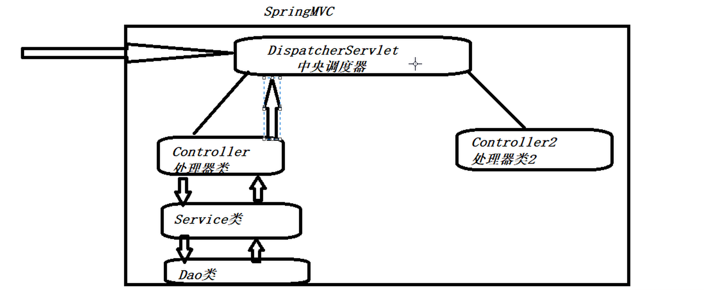
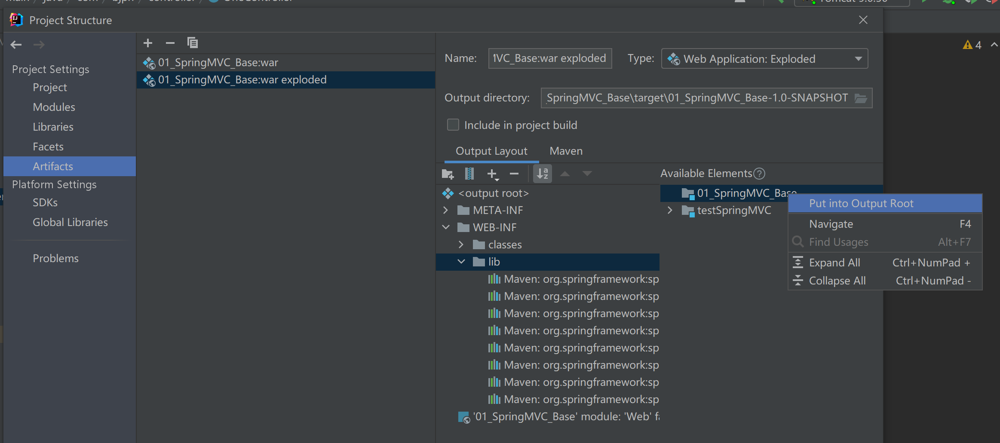

# SpringMVC自学笔记md版


# SpringMVC自学笔记

> 大连交通大学 信息学院 刘嘉宁 2021-9-23
>
> 笔记摘自：bjpowernode 杨震


## SpringMVC

- 是Spring框架的衍生版

- 简化了Servlet的使用


### 解决了Servlet规范的问题:

1. 存在大量的Servlet接口实现类
2. 需要手动写大量获取请求参数的代码
3. 需要手动获取输出流：PrintWriter out = response.getWriter( ) ...
4. 需要手动重定向和请求转发


## 使用SpringMVC框架

- SpringMVC认为：一个网站中有一个 Servlet（ DispatcherServlet中央调度器 ） 就够了
- 由这个 Servlet 调用多个处理器类（Controller控制器）
- 再由 Controller 处理器类调用 Service（ 调用DAO ... ）



1. 添加 spring-webmvc 的依赖

   ```xml
   <!-- servlet依赖-->
   <dependency>
     <groupId>javax.servlet</groupId>
     <artifactId>javax.servlet-api</artifactId>
     <version>4.0.1</version>
     <scope>provided</scope>
   </dependency>
   
   <!--spring-webmvc -->
   <dependency>
     <groupId>org.springframework</groupId>
     <artifactId>spring-webmvc</artifactId>
     <version>5.3.10</version>
   </dependency>
   ```

2.  配置web.xml

   - 让tomcat来创建DispatcherServlet的实例对象（Servlet规范：不能使用Spring创建Servlet对象）
   - DispatcherServlet会自动==创建spring容器对象并保存在服务器全局作用域对象中==
   - 使用`init-param`标签指定（ 创建spring容器对象需要用到的 ）spring.xml文件位置
   - 通知tomcat在启动时创建spring容器的实例对象

   ```xml
   <!--
         dispatcherServlet会自动创建spring容器对象，
         并调用spring容器中web-inf下的xxx-servlet.xml（key-servlet.xml）文件，
         并将spring容器对象保存到网站的全局作用域对象中
   -->
     <servlet>
       <servlet-name>key</servlet-name>
       <servlet-class>org.springframework.web.servlet.DispatcherServlet</servlet-class>
   
       <!--配置spring.xml文件路径，让DispatcherServlet按照这个文件创建spring容器对象-->
       <init-param>
         <param-name>contextConfigLocation</param-name>
         <param-value>classpath:spring.xml</param-value>
       </init-param>
   
       <!--通知tomcat在启动时创建spring容器的实例对象：非0整数即可-->
       <load-on-startup>1</load-on-startup>
     </servlet>
   
     <!--SpringMVC推荐所有请求以 .do 结尾，让所有 .do 结尾的请求由DispatcherServlet处理-->
     <servlet-mapping>
       <servlet-name>key</servlet-name>
       <url-pattern>*.do</url-pattern>
     </servlet-mapping>
   ```

3. 编写Controller类

   - `@Controller`声明让spring容器创建这个Controller类
     - @component 、@Service 、@Controller 均是让spring容器创建其声明的实例对象
   - `@RequestMapping(value = "/one")`设置 类 / 方法 的请求地址

   ```java
   /**
    * @component
    * @Service
    * @Controller
    *
    * 均是让spring容器创建实例对象
    * 按需使用
    *
    *
    * @RequestMapping(Value="") 设置处理器类的请求地址
    * 也可以放在方法上，设置方法的请求地址
    */
   @Controller
   @RequestMapping(value = "/one")
   public class OneController {
   
       //这个类的调用地址 http://locoalhost:8080/myWeb/one/method2.do
       @RequestMapping(value = "/method1.do")
       public String method1(){
   
           return "/info.jsp";
       }
   
   }
   ```


### 遇到的问题

> 报错：java.lang.ClassNotFoundException: org.springframework.web.context.ContextLoaderListener

- 似乎的IDEA/Tomcat没有将需要的jar包放到位

- 解决方式：

  - 在Artifacts中在使用的项目包上点击`Put into Output Root`，左侧lib文件夹出现内容则成功

  


## 处理器方法

#### 按照处理器方法的返回值学习：

1. ModelAndView
2. String
3. void
4. 自定义类型对象


##### 一、ModelAndView类型返回值：保存到请求作用域

- ModelAndView是SpringMVC提供一个工具类
- ModelAndView用于存储Controller类运行的结果
- ModelAndView存储需要申请 调用的资源文件 的地址

使用方式：

- 存储在ModelAndView中的内容会自动被DispatcherServlet保存到请求作用域中

```java
@RequestMapping(value = "/method3.do")
public ModelAndView method3() throws Exception{
    ModelAndView mv = new ModelAndView();
    //存储在ModelAndView中的内容会自动被DispatcherServlet保存到请求作用域中
    mv.addObject("tt", "这是我自己定的info信息");
    mv.setViewName("/jsp/test.jsp");
    return mv;
}
```

##### 二、String类型返回值：资源文件请求转发

- 其String类型返回值是一个资源文件请求地址
- 这个资源文件默认情况下将会交给DispatcherServlet通过**请求转发**来向Http服务器索要资源文件
- 这个资源文件可以是 jsp / html / 处理器其他方法

使用方式：

- 默认通过**请求转发**方式

```java
@RequestMapping(value = "/method1.do")
public String method1(){
    //使用请求转发打开“ ”中的网页
    return "/info.jsp";
}
```

- 调用处理器中其他方法

```java
@RequestMapping(value = "/method6.do")
public String method6(){
    
    return "method2.do";
}
```

- 调用其他处理器中方法

```java
@RequestMapping(value = "/method6.do")
public String method6(){
    
	return "/two/method1.do";
}
```

##### 三、void类型返回值：手写输出流

- 处理器方法在运行完毕后，是不需要将结果交给DispatcherServlet
- 处理器方法借助于响应对象，自行将结果写入到响应体
- 此时处理器方法在声明时，需要申请一个HttpServletResponse参数。这个参数由DispatcherServlet负责提供

使用方式：

```java
@RequestMapping(value = "/method2.do")
public void method2(HttpServletResponse response) throws Exception{
    PrintWriter out = response.getWriter();
    out.print("测试测试1111111111");
}
```

##### 四、自定义类型对象：使用Ajax时，自动解析成JSON返回

- 使用自定义类型对象：说明使用ajax技术发送请求
- 返回对象交给DispatcherServlet负责将返回的对象解析为JSON格式字符串写入到响应体

使用方式：

1. 添加依赖

```xml
    <!-- jackson-core -->
    <dependency>
      <groupId>com.fasterxml.jackson.core</groupId>
      <artifactId>jackson-core</artifactId>
      <version>2.13.0-rc2</version>
    </dependency>
    <!-- jackson-databind -->
    <dependency>
      <groupId>com.fasterxml.jackson.core</groupId>
      <artifactId>jackson-databind</artifactId>
      <version>2.13.0-rc2</version>
    </dependency>
```

1. 在spring.xml中注册MVC的注解驱动

```xml
    <!--注册MVC的注解驱动-->
    <mvc:annotation-driven />
```

2. 在处理器类方法上声明`@ResponseBody`注解，让此方法的返回值由DispatcherServlet扫描到并交给响应体中

```java
@RequestMapping(value = "/test1.do")
@ResponseBody
public Dept test1(){

    return new Dept("10", "王五", "东北");
}
```


#### 按照处理器方法的接收参数学习：

1. HttpServletRequest

2. HttpServletResponse

3. HttpSession

4. 自定义参数（基本类型/引用类型）

   ​      1）基本类型: 必须与浏览器发送的请求参数名相同
   ​      2）引用类型: 必须与浏览器发送的请求参数名相同

##### 一、HttpServletRequest类型参数：Request请求包

使用方式：

```java
@RequestMapping(value = "/method7.do")
public void method7(HttpServletRequest request){

    String name = request.getParameter("name");
    String age = request.getParameter("age");

    System.out.println("name = "+name+", age = "+age);
}
```

##### 二、HttpServletResponse类型参数：Response响应包

使用方式：

```java
@RequestMapping(value = "/method2.do")
public void method2(HttpServletResponse response) throws Exception{
    PrintWriter out = response.getWriter();
    out.print("测试测试使用相应对象的输出流向浏览器输出内容");
}
```

##### 三、HttpSession类型参数：Session作用域

使用方式：

```java
@RequestMapping(value = "/method8.do")
public String method8(HttpSession session){

    session.setAttribute("info", "测试使用SpringMVC的session作用域");

    return "/info.jsp";
}
```

##### 四、自定义参数类型：基本类型、引用类型

- 基本类型: 变量名    必须与浏览器发送的请求参数名相同
- 引用类型: 属性名    必须与浏览器发送的请求参数名相同

使用方式：

```java
@RequestMapping(value = "/method9.do")
public void method9(String deptNo, String dName, String loc){

    System.out.println("deptNo = " + deptNo);
    System.out.println("dName = " + dName);
    System.out.println("loc = " + loc);
}
```

```java
@RequestMapping(value = "/method10.do")
public void method10(Dept dept){

    System.out.println("deptNo = " + dept.getDeptNo());
    System.out.println("dName = " + dept.getDName());
    System.out.println("loc = " + dept.getLoc());
}
```


#### 按照处理器方法间调用方式学习：

##### 一、重定向

- 原地址格式：
  - 如果要求浏览器访问其他网站的地址，使用url
  - 如果要求浏览器访问当前网站的地址，使用 uri (/myWeb/one/method1.do)

- 现地址格式：
  - 简化版 uri 不写网站名 (/one/method1.do)

```java
@RequestMapping(value = "/method4.do")
public String method4() throws Exception{

    return "redirect:/one/method1.do";
}
```

##### 二、请求转发

- 地址格式：
  - 简化版 uri 不写网站名 (/one/method1.do)

```java
@RequestMapping(value = "/method5.do")
public String method5() throws Exception{

    return "forward:/one/method1.do";
}
```


## 视图解析器

- SpringMVC为避免资源路径的冗余，加入了视图解析器来自动补全拼接文件路径和文件扩展名

使用方式：

1. 在spring.xml中加入

```xml
<!--帮助处理文件的路径和扩展名，生成视图对象-->
<bean class="org.springframework.web.servlet.view.InternalResourceViewResolver">
    <property name="prefix" value="/jsp/" />
    <property name="suffix" value=".jsp" />
</bean>
```

2. 测试使用

```java
@RequestMapping(value = "/method12.do")
public ModelAndView method12(Dept dept){
    ModelAndView mv = new ModelAndView();
    
    mv.addObject("tt", "使用了视图解析器自动补全路径和后缀");
    //mv.setViewName("/jsp/test.jsp");
    mv.setViewName("test");
    
    return mv;
}
```


## 拦截器

**过滤器**：characterEncodingFilter......

- servlet规范中的一部分，任何java web工程都可以使用
- 在url-pattern中配置了/*之后，可以对所有要访问的资源进行拦截

**拦截器**：是AOP思想的具体应用

- 拦截器是SpringMVC框架自己的，只有使用了SpringMVC框架的工程才能使用
- 拦截器只会拦截访问的控制器方法， 如果访问的是.jsp/.html/.css/.image/.js是不会进行拦截的

使用方式：

1. 创建`HandlerInterceptor`的实现类`config.MyInterceptor`

```java
public class MyInterceptor implements HandlerInterceptor {
    @Override
    public boolean preHandle(HttpServletRequest request, HttpServletResponse response, Object handler) throws Exception {
        HttpSession session = request.getSession();

        //访问登陆页面，放行
        if (request.getRequestURL().toString().contains("login")){
            System.out.println(request.getRequestURL().toString()+"正在登录");
            return true;
        }
        
        //用户登录成功过，放行
        if (session.getAttribute("userLoginInfo") != null){
            System.out.println("登陆过，存在session");
            return true;
        }
        
        //不通过，重定向到初始页面
        response.sendRedirect("/myWeb/index.jsp");
        return false;
    }

    @Override
    public void postHandle(HttpServletRequest request, HttpServletResponse response, Object handler, ModelAndView modelAndView) throws Exception {
        System.out.println("处理后");
    }
    
    @Override
    public void afterCompletion(HttpServletRequest request, HttpServletResponse response, Object handler, Exception ex) throws Exception {
        System.out.println("清理");
    }
    
}
```

2. 在spring.xml中注册拦截器

```xml
<mvc:interceptors>
    <mvc:interceptor>
        <!-- /** 为拦截所有路径及其子路径 -->
        <mvc:mapping path="/**"/>
        <bean class="com.bjpn.config.MyInterceptor"/>
    </mvc:interceptor>
</mvc:interceptors>
```


## SpringMVC执行原理


## ✔✔ SSM项目用到的依赖汇总：

```xml
<dependency>
  <groupId>javax.servlet</groupId>
  <artifactId>javax.servlet-api</artifactId>
  <version>4.0.1</version>
  <scope>provided</scope>
</dependency>

<dependency>
  <groupId>org.springframework</groupId>
  <artifactId>spring-context</artifactId>
  <version>5.3.9</version>
</dependency>

<dependency>
  <groupId>org.springframework</groupId>
  <artifactId>spring-jdbc</artifactId>
  <version>4.3.16.RELEASE</version>
</dependency>

<dependency>
  <groupId>org.mybatis</groupId>
  <artifactId>mybatis</artifactId>
  <version>3.5.1</version>
</dependency>

<dependency>
  <groupId>org.mybatis</groupId>
  <artifactId>mybatis-spring</artifactId>
  <version>1.3.1</version>
</dependency>

<dependency>
  <groupId>mysql</groupId>
  <artifactId>mysql-connector-java</artifactId>
  <version>8.0.26</version>
</dependency>

<dependency>
  <groupId>com.alibaba</groupId>
  <artifactId>druid</artifactId>
  <version>1.1.12</version>
</dependency>

<dependency>
  <groupId>org.springframework</groupId>
  <artifactId>spring-aspects</artifactId>
  <version>4.3.16.RELEASE</version>
</dependency>

<dependency>
  <groupId>org.springframework</groupId>
  <artifactId>spring-web</artifactId>
  <version>5.3.9</version>
</dependency>

<dependency>
  <groupId>org.springframework</groupId>
  <artifactId>spring-webmvc</artifactId>
  <version>5.3.10</version>
  <scope>compile</scope>
</dependency>

<dependency>
    <groupId>com.fasterxml.jackson.core</groupId>
    <artifactId>jackson-core</artifactId>
    <version>2.13.0-rc2</version>
</dependency>

<dependency>
    <groupId>com.fasterxml.jackson.core</groupId>
    <artifactId>jackson-databind</artifactId>
    <version>2.13.0-rc2</version>
</dependency>
```


## 遇到问题

##### 1. 中文参数乱码问题

- 原因：post请求默认使用ISO-8859-01东欧字符集

  

- 解决：添加SpringMVC提供的过滤器接口实现类

  

  在web.xml中添加

  ```xml
  <!--添加过滤器-->
  <filter>
      <filter-name>characterEncodingFilter</filter-name>
      <filter-class>org.springframework.web.filter.CharacterEncodingFilter</filter-class>
  
      <!--设置字符集-->
      <init-param>
            <param-name>encoding</param-name>
            <param-value>utf-8</param-value>
  	</init-param>
  </filter>
  
  <filter-mapping>
  	<filter-name>characterEncodingFilter</filter-name>
  	<url-pattern>*.do</url-pattern>
  </filter-mapping>
  ```


