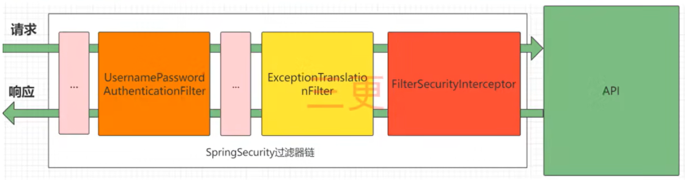
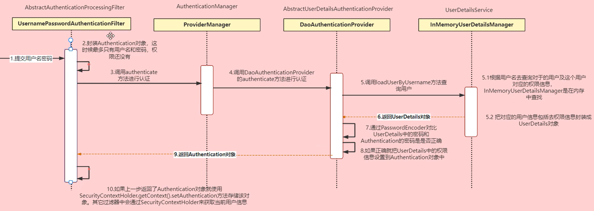
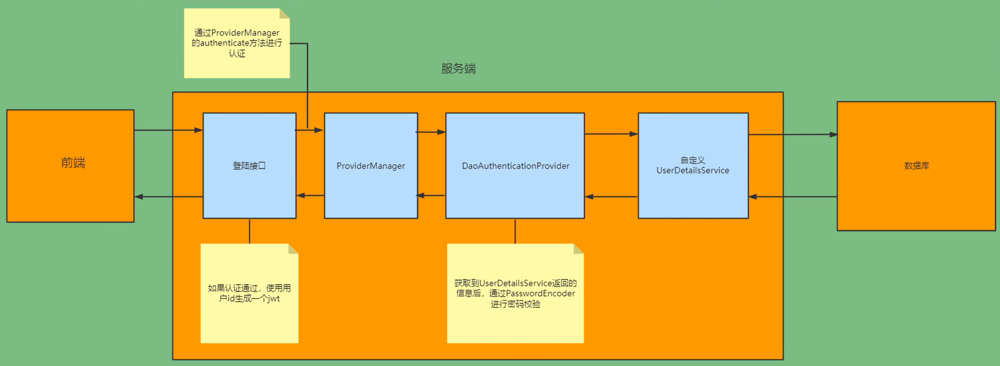
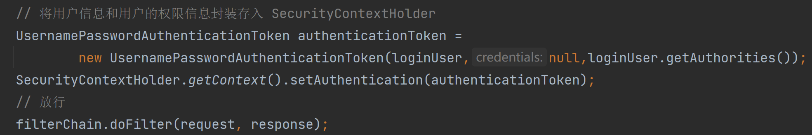

# Spring Security自学笔记md版


# Spring Security

> 大连交通大学 信息学院 刘嘉宁 2022-10-22
>
> 笔记摘自：bilibili 三更草堂


## Spring Security

- 是 Spring 家族的一个安全管理框架
- 相较于 Shiro 更适合大型项目、上手复杂一些、功能和社区资源更丰富


## 如何使用

1. 添加 Spring Security 依赖

```xml
<!-- Spring Security 的起步依赖 -->
<dependency>
    <groupId>org.springframework.boot</groupId>
    <artifactId>spring-boot-starter-security</artifactId>
</dependency>

<!-- Spring Security 测试环境的起步依赖 -->
<dependency>
    <groupId>org.springframework.security</groupId>
    <artifactId>spring-security-test</artifactId>
    <scope>test</scope>
</dependency>
```


## 粗略原理



- Spring Security 的本质就是一个过滤器链
    - 判断用户名密码是否正确【认证】
    - 处理过滤器链中发生的 AccessDeniedWException 和 AuthenticationException【异常处理】
    - 判断该用户是否有执行的权限【授权】

### 认证



- 大致流程：
    - `1 - 6` 在 UserDetailService 接口实现类中查找用户信息及对应权限在封装后返回
    - `7 - 9` 比对用户名及密码是否正确并设置权限信息到 Authentication 中
    - `10 - end` 将 Authentication 中的权限信息设置到一个共享作用域中方便后续认证环节使用

### 授权

- 候补


## 自定义认证



自定义 UserDetailService 接口实现类查询数据库 `把这个用户实体查出来` 

- 在 service.impl 中创建 UserDetailsService 的实现类

```java
@Service
public class UserDetailServiceImpl implements UserDetailsService {

    @Autowired
    private SysUserMapper sysUserMapper;

    @Override
    public UserDetails loadUserByUsername(String username) throws UsernameNotFoundException {
        /*********************** 认证 ***********************/
        // 查询有没有这个用户
        List<SysUser> userList = sysUserMapper.selectByUsername(username);
        //如果没有这个账户则抛出异常
        if (userList == null || userList.size() == 0) {
            throw new RuntimeException("用户名或密码错误");
        }
        /*********************** 授权 ***********************/
        //todo
        
        //把用户封装成 UserDetail 返回
        return new LoginUser(userList.get(0));
    }
}
```

- 在 domian 中创建 UserDetails 的实现类并代理用户实体

```java
@Data
@NoArgsConstructor
@AllArgsConstructor
public class LoginUser implements UserDetails {

    private SysUser sysUser;

    @Override
    public Collection<? extends GrantedAuthority> getAuthorities() {
        // 获取权限信息
        return null;
    }

    @Override
    public String getPassword() {
        return sysUser.getPassword();
    }

    @Override
    public String getUsername() {
        return sysUser.getUserName();
    }

    @Override
    public boolean isAccountNonExpired() {
        return true;
    }

    @Override
    public boolean isAccountNonLocked() {
        return true;
    }

    @Override
    public boolean isCredentialsNonExpired() {
        return true;
    }

    @Override
    public boolean isEnabled() {
        return true;
    }
}
```


### 配置密码加密策略

- 默认使用的 PasswordEncoder 要求数据库中的密码格式为：`{id}password` 它会根据 id 去判断密码的加密方式
- 一般情况下我们使用 SpringSecurity 提供的 BCryptPasswordEncoder 实现密码加密（加盐加密）

在 config 包下创建 SecurityConfig 配置类

```java

import org.springframework.context.annotation.Bean;
import org.springframework.context.annotation.Configuration;
import org.springframework.security.config.annotation.web.configuration.WebSecurityConfigurerAdapter;
import org.springframework.security.crypto.bcrypt.BCryptPasswordEncoder;
import org.springframework.security.crypto.password.PasswordEncoder;

@Configuration
public class SecurityConfig extends WebSecurityConfigurerAdapter {

    @Bean
    public PasswordEncoder passwordEncoder(){
        // 设置密码加密方式为 SpringSecurity 提供的 BCryptPasswordEncoder
        return new BCryptPasswordEncoder();
    }

}
```

> - BCryptPasswordEncoder 提供的功能：
>
> - ```java
>     BCryptPasswordEncoder b = new BCryptPasswordEncoder();
>     String b1 = b.encode("明文密码"); // 将明文密码加密为密文
>     String b2 = b.encode("明文密码"); // 自带加盐加密，每次的密文都不一致
>     boolean matches = b.matches("明文密码", "密文"); // 比对密文是否是明文密码加密而来的
>     ```


### 配置认证相关配置

在 SecurityConfig 配置类中添加内容

```java

@Configuration
public class SecurityConfig extends WebSecurityConfigurerAdapter {

    /**
     * 配置密码加密方式
     * @return
     */
    @Bean
    public PasswordEncoder passwordEncoder() {
        // 设置密码加密方式为 SpringSecurity 提供的 BCryptPasswordEncoder
        return new BCryptPasswordEncoder();
    }

    @Override
    protected void configure(HttpSecurity http) throws Exception {
        http
                // 关闭 csrf
                .csrf().disable()
                // 不通过 Session 获取 SecurityContext
                .sessionManagement().sessionCreationPolicy(SessionCreationPolicy.STATELESS)
                .and()
                .authorizeRequests()
                // 对于登录接口 允许匿名访问
                .antMatchers("/user/login").anonymous()
                // 除上面外的所有请求全部需要鉴权认证
                .anyRequest().authenticated();
    }

    /**
     * 暴露 AuthenticationManager 到 Spring 容器中以便 Service 层使用
     * @return
     * @throws Exception
     */
    @Bean
    @Override
    public AuthenticationManager authenticationManagerBean() throws Exception {
        return super.authenticationManagerBean();
    }

}
```


### 实现登录功能

- 编写登录接口的 Service 层方法

```java
	// 注入 AuthenticationManager 进行用户认证
	@Autowired
    private AuthenticationManager authenticationManager;
    @Autowired
    private RedisCacheUtil redisCacheUtil;

    @Override
    public ResponseResult login(SysUser user) {
        UsernamePasswordAuthenticationToken authenticationToken = new UsernamePasswordAuthenticationToken(user.getUserName(), user.getPassword());
        Authentication authenticate = authenticationManager.authenticate(authenticationToken);
        // 如果认证没通过则给出提示
        if (Objects.isNull(authenticate)) {
            throw new RuntimeException("用户名或密码错误");
        }
        // 认证通过后，使用 userid 生成 jwt
        LoginUser loginUser = (LoginUser) authenticate.getPrincipal();
        String userId = loginUser.getSysUser().getId().toString();
        String jwt = JwtUtil.createJWT(userId);
        // 把用户信息存入 redis
        redisCacheUtil.setCacheObject("login:" + userId, loginUser);
        // 把 jwt 响应给前端
        HashMap<String, String> map = new HashMap<>();
        map.put("token", jwt);
        return new ResponseResult(200, "登陆成功", map);
    }
```


### 配置认证过滤器

在 filter 包中创建 JwtAuthenticationTokenFilter 过滤器

```java

@Component
public class JwtAuthenticationTokenFilter extends OncePerRequestFilter {

    @Autowired
    private RedisCacheUtil redisCache;

    @Override
    protected void doFilterInternal(HttpServletRequest request, HttpServletResponse response, FilterChain filterChain) throws ServletException, IOException {
        // 获取请求头中的 token
        String token = request.getHeader("token");
        if (!StringUtils.hasText(token)) {
            //放行
            filterChain.doFilter(request, response);
            return;
        }
        // 解析 token 获取到用户 ID
        String userid;
        try {
            Claims claims = JwtUtil.parseJWT(token);
            userid = claims.getSubject();
        } catch (Exception e) {
            e.printStackTrace();
            throw new RuntimeException("token不合法");
        }
        // 使用用户 ID 从 redis 中获取用户信息
        String redisKey = "login:" + userid;
        LoginUser loginUser = redisCache.getCacheObject(redisKey);
        if(Objects.isNull(loginUser)){
            throw new RuntimeException("用户未登录");
        }
        // 存入 SecurityContextHolder
        //TODO 获取权限信息封装到 Authentication 中
        UsernamePasswordAuthenticationToken authenticationToken =
                new UsernamePasswordAuthenticationToken(loginUser,null,null);
        SecurityContextHolder.getContext().setAuthentication(authenticationToken);
        // 放行
        filterChain.doFilter(request, response);
    }

}
```

添加配置类

```java

@Configuration
public class SecurityConfig extends WebSecurityConfigurerAdapter {

    // 注入过滤器
    @Autowired
    JwtAuthenticationTokenFilter jwtAuthenticationTokenFilter;

    /**
     * 配置密码加密方式
     * @return
     */
    @Bean
    public PasswordEncoder passwordEncoder() {
        // 设置密码加密方式为 SpringSecurity 提供的 BCryptPasswordEncoder
        return new BCryptPasswordEncoder();
    }

    @Override
    protected void configure(HttpSecurity http) throws Exception {
        http
                //关闭csrf
                .csrf().disable()
                //不通过Session获取SecurityContext
                .sessionManagement().sessionCreationPolicy(SessionCreationPolicy.STATELESS)
                .and()
                .authorizeRequests()
                // 对于登录接口 允许匿名访问
                .antMatchers("/user/login").anonymous()
                // 除上面外的所有请求全部需要鉴权认证
                .anyRequest().authenticated();
        
        //把token校验过滤器添加到过滤器链中
        http.addFilterBefore(jwtAuthenticationTokenFilter, UsernamePasswordAuthenticationFilter.class);
    }

    /**
     * 暴露 AuthenticationManager 到 Spring 容器中以便 Service 层使用
     * @return
     * @throws Exception
     */
    @Bean
    @Override
    public AuthenticationManager authenticationManagerBean() throws Exception {
        return super.authenticationManagerBean();
    }

}
```


### 如何退出登录

- 将 Redis 中的用户信息删除即可


## 自定义授权

1. 在 UserDetailsService 类中查询用户对应的权限
2. 将用户的权限信息封装至 SecurityContextHandler
3. 在 LoginUser 类中实现获取权限信息的方法
4. 在需要权限的方法上方添加注解 `123` 

在 SecurityConfig 类上方添加注解，开启全局的注解授权方法

```java
@EnableGlobalMethodSecurity(prePostEnabled = true)
```

在需要鉴权才能访问的方法添加注解

```java
@PreAuthorize("hasAuthority('test')") //
```

在 UserDetailServiceImpl 类中获取用户对应的权限列表

```java
@Service
public class UserDetailServiceImpl implements UserDetailsService {

    @Autowired
    private SysUserMapper sysUserMapper;

    @Override
    public UserDetails loadUserByUsername(String username) throws UsernameNotFoundException {
        /*********************** 查询用户 ***********************/
        // 查询用户信息
        SysUser sysUser = sysUserMapper.selectOneByUsername(username);
        //如果没有这个账户则抛出异常
        if (sysUser == null) {
            throw new RuntimeException("用户名或密码错误");
        }
        /*********************** 查询权限信息 ***********************/
        List<String> permissionList = new ArrayList<>(Arrays.asList("test2"));
        //把用户封装成 UserDetail 返回
        return new LoginUser(sysUser, permissionList);
    }
}
```

为 LoginUser 类增加代理权限列表、实现 getAuthorities 方法

```java
// 这个类要保证有完整的构造器、get、set 方法以供 fastJson 序列化和反序列化
public class LoginUser implements UserDetails {

    // 代理用户实体
    private SysUser sysUser;
    // 代理用户对应的权限列表
    private List<String> permissions;
    //存储SpringSecurity所需要的权限信息的集合
    @JSONField(serialize = false)
    private List<GrantedAuthority> authorities;

    public LoginUser(SysUser sysUser, List<String> permissions) {
        this.sysUser = sysUser;
        this.permissions = permissions;
    }

    @Override
    public Collection<? extends GrantedAuthority> getAuthorities() {
        // 获取权限信息
        if (authorities != null) {
            return authorities;
        }
        //把 permissions 中字符串类型的权限信息转换成 GrantedAuthority 对象存入 authorities 中
        authorities = permissions.stream().
                map(SimpleGrantedAuthority::new)
                .collect(Collectors.toList());
        return authorities;
    }
```

在 JwtAuthenticationTokenFilter 传入权限信息




## 自定义异常处理器

- SpringSecurity 在认证和授权出现异常的时候会自动调用对应的异常处理器
    - 认证过程中出现的异常会封装成 AuthenticationException 调用 **AuthenticationEntryPoint** 进行异常处理
    - 授权过程中出现的异常会封装成 AccessDeniedException 调用 **AccessDeniedHandler** 进行异常处理

在 exceptionHandler 中创建对应的类

```java
@Component
public class AccessDeniedHandlerImpl implements AccessDeniedHandler {
    @Override
    public void handle(HttpServletRequest request, HttpServletResponse response, AccessDeniedException accessDeniedException) throws IOException, ServletException {
        ResponseResult result = new ResponseResult(HttpStatus.FORBIDDEN.value(), "权限不足");
        String json = JSON.toJSONString(result);
//        WebUtils.renderString(response,json);
        System.out.println(json);

    }
}
```

```java
@Component
public class AuthenticationEntryPointImpl implements AuthenticationEntryPoint {
    @Override
    public void commence(HttpServletRequest request, HttpServletResponse response, AuthenticationException authException) throws IOException, ServletException {
        ResponseResult result = new ResponseResult(HttpStatus.UNAUTHORIZED.value(), "认证失败请重新登录");
        String json = JSON.toJSONString(result);
//        WebUtils.renderString(response,json);
        System.out.println(json);
    }
}
```

在 SecurityConfig 中注入这两个实现类

```java
    @Autowired
    private AuthenticationEntryPoint authenticationEntryPoint;

    @Autowired
    private AccessDeniedHandler accessDeniedHandler;

/******************** 并配置到 http ************************/

    // 注册认证和授权异常的切入点
    http.exceptionHandling().authenticationEntryPoint(authenticationEntryPoint).
        accessDeniedHandler(accessDeniedHandler);
```


