# Spring自学笔记md版


# Spring框架自学笔记

> 大连交通大学 信息学院 刘嘉宁 2021-9-14
> 
> 笔记摘自：bjpowernode 杨震

## 框架：

1. 一组工具类

2. 框架是针对某一个技术进行封装，目的降低被封装的技术的使用难度

3. 框架这个工具类都是存储在jar包文件

## Spring框架(优点)：

> Spring：简化java开发，整合了现有的技术框架。是一个轻量级的控制反转和面向切面的框架。

- 开源的免费的容器（框架）
- 轻量级的，非入侵式的框架
- **控制反转（IOC），面向切面编程（AOP）**
- 支持事务处理，对框架整合的支持

## Spring的七大模块：

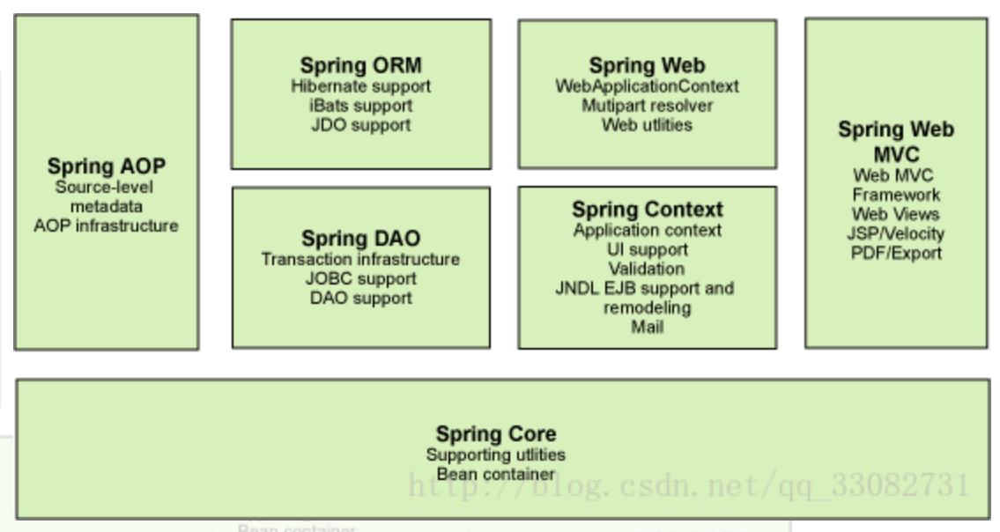

## Spring容器，使用：

- Spring容器对象（ApplicationContext）特点：
  
  - 由Spring容器管理的类需要提供一个无参数的构造方法
  - 一个bean标签描述的类在Spring容器对象只有一个对应实例对象
  - 如果某个类在Spring容器对象需要存在多个实例对象，可以借助于多个bean标签

- 使用Spring容器对象
  
  - 通过xml文件或注解 **创建并保存** 一个类
  
  - 开发人员可以直接向容器 **索要** 对象
  1. 创建maven项目，添加spring-context的依赖
     
     ```xml
     <!--
         这里添加的是spring-webmvc的依赖
         maven会自动导入spring用到的相关依赖
     -->
     <dependency>
       <groupId>org.springframework</groupId>
       <artifactId>spring-webmvc</artifactId>
       <version>5.3.10</version>
     </dependency>
     ```
  
  2. 在resources路径下创建spring.xml文件
     
     ```xml
     <?xml version="1.0" encoding="UTF-8"?>
     <beans xmlns="http://www.springframework.org/schema/beans"
            xmlns:xsi="http://www.w3.org/2001/XMLSchema-instance"
            xmlns:context="http://www.springframework.org/schema/context"
            xsi:schemaLocation="http://www.springframework.org/schema/beans http://www.springframework.org/schema/beans/spring-beans.xsd http://www.springframework.org/schema/context https://www.springframework.org/schema/context/spring-context.xsd">
     
         <!--通知spring容器，Student类需要由spring负责创建并在开发时对外提供-->
         <bean class="com.bjpn.Student" id="student"></bean>
     
     </beans>
     ```
     
     3. 在spring.xml文件内部声明bean标签
        
        - class：需要被spring容器创建的类的全限定名
        
        - id：bean标签的唯一标识
        
        - name：别名
          
          > Spring容器内部有一个Map<id, class>相等于：`map.put(id, new Student)`
     
     4. 测试使用Spring容器对象创建类
     
     ```java
     @Test
     public void appTest1() {
     
         /*
           context:Spring容器对象
           ApplicationContext的重要实现类：
             1. ClassPathXmlApplicationContext：相对路径获取配置文件
             2. FileSystemXmlApplicationContext：绝对路径获取配置文件
         */
         ApplicationContext context = new ClassPathXmlApplicationContext("spring.xml");
     
         //向容器索要对象
         Studnet stu = (Studnet) context.getBean("student");
         //通过反射声明类型就可以不用强转
         //Studnet stu = context.getBean("student", Studnet.class);
     
         //调用类中的方法测试
         stu.say();
     }
     ```

## 补: 使用JavaConfig实现配置

- 在Config类上声明`@Configuration`，它会被spring容器托管创建

- 在Config类上声明`@ComponentScan（xxx.xxxx）`，可以将包下所有有@Component声明的类绑定为Config类

- 在其方法上声明`@Bean`，它的方法名就是id属性、返回值就是class属性

- 使用`AnnotationConfigApplicationContext`获取上下文容器对象
  
  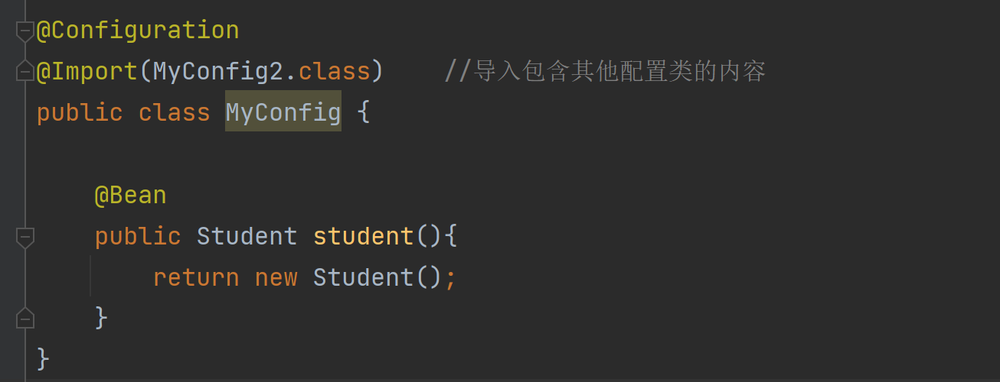

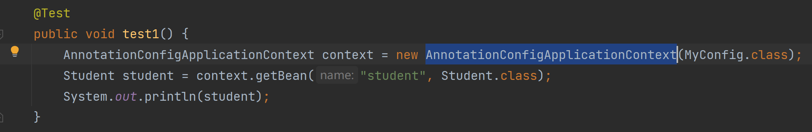

## Spring框架提供的服务：

1. IOC和DI服务：提供对象的创建
2. DI服务：提供对象的初始化
3. AOP服务：提供动态代理设计模式，简化其使用难度

### 1. IOC：控制反转服务

> IOC是一种控制反转的思想
> 
> 控制反转就是获得依赖对象的方式反转了：将所有会用到的对象统一保存在spring容器中，使用的时候调用需要的对象即可，避免有写死了依赖对象的代码，大大提高了解耦合性。

IOC的实现方式：

- 通过xml文件或注解 **创建并保存** 一个类
  
    一、通过xml文件描述：
  
  1. 在spring.xml文件中添加bean标签：
     
     ```xml
     <!--通知spring容器，Student类需要由spring负责创建并在开发时对外提供-->
     <bean class="com.bjpn.Student" id="student"></bean>
     ```
     
     2. 在spring.xml文件内部声明bean标签
        
        - class：需要被spring容器创建的类信息
        
        - id：bean标签的唯一标识
        
        - Spring容器内部有一个Map<id, class>相等于：`map.put(id, new Student)`
     
     3. 测试使用Spring容器对象创建类
     
     ```java
     @Test
     public void appTest1() {
       /*
         context:Spring容器对象
         ApplicationContext的重要实现类：
           1. ClassPathXmlApplicationContext：相对路径获取配置文件
           2. FileSystemXmlApplicationContext：绝对路径获取配置文件
       */
       ApplicationContext context = new ClassPathXmlApplicationContext("spring.xml");
     
       //向容器索要对象
       Studnet stu = (Studnet) context.getBean("student");
     
       //调用类中的方法测试
       stu.say();
     }
     ```
     
     二、通过Annotation注解描述：
     
     - @Component声明要被spring创建实例对象的类
     - ==必须存在无参构造方法==
  - 默认id：小驼峰类名
  
  - 手动设置id：`@Component(value="id名")`
  1. 在类上方声明@Component注解
     
     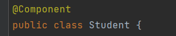
  
  2. 在spring配置文件中添加component-scan标签，并绑定到包
     
     ```xml
     <context:component-scan base-package="org.example"></context:component-scan>
     ```

### 2. DI：依赖注入服务

依赖注入服务：IOC的一个扩展，负责对象中属性的**初始化**

- 依赖：bean对象的创建依赖于容器
- 注入：bean对象中的所有属性由容器来注入

DI服务分类：

- 基本属性初始化
- 引用类型属性初始化
- 有参构造方法属性初始化

DI的实现方式：

- 通过xml文件或注解 **初始化** 一个类
  
  一、通过xml文件描述：
  
  1. 在spring.xml文件的bean标签中添加：
  - property标签：通过set方法为实例对象进行赋值
    - name：属性名
    - value：基本属性值
    - ref：引用类型属性的bean标签id
  
  ```xml
  <bean class="java.util.ArrayList" id="arrayList"></bean>
  <bean class="org.example.App" id="app2">
      <!--通过set方法为实例对象进行赋值-->
      <!--普通类型注入-->
      <property name="name" value="毛桑"></property>
      <!--引用类型注入-->
      <property name="list" ref="arrayList"></property>
      <!--数组的注入-->
      <property name="array">
          <array>
              <value>1</value>
              <value>2</value>
              <value>3</value>
              <value>4</value>
          </array>
      </property>
      <!--List集合的注入-->
      <property name="arraylist">
          <list>
              <value>听歌</value>
              <value>看电影</value>
              <value>吹牛逼</value>
          </list>
      </property>
      <!--Map集合的注入-->
      <property name="map">
          <map>
              <entry key="" value="">
              <entry key="" value="">
              <entry key="" value="">
          </map>
      </property>
      <!--Set集合的注入-->
      <property name="set">
          <set>
              <value>听歌</value>
              <value>看电影</value>
              <value>吹牛逼</value>
          </set>
      </property>
      <!--Null空值的注入-->
      <property name="nullValue">
          <null/>
      </property>
      <!--properties文件的注入-->
      <property>
          <props>
              <prop key="username">root</prop>
              <prop key="password">129807</prop>
          </props>
      </property>
  </bean>
  
  <!-- p 命名空间的使用-->
  <bean class="org.example.App" id="app4" p:name="毛嘉">
  ```
  
  - constructor-arg标签：通过有参构造方法为实例对象进行赋值
    - name：属性名
    - value：基本属性值
    - ref：引用类型属性的bean标签id
  
  ```xml
  <bean class="java.util.ArrayList" id="arrayList"></bean>
  <bean class="org.example.App" id="app3">
      <!--通过有参构造方法为实例对象进行赋值-->
      <!--通过形参名赋值-->
      <constructor-arg name="name" value="毛桑"></constructor-arg>
      <constructor-arg name="list" ref="arrayList"></constructor-arg>
      <!--通过下标赋值-->
      <constructor-arg index="0" value="毛桑"></constructor-arg>
      <constructor-arg index="1" ref="arrayList"></constructor-arg>
      <!--通过下标赋值（不建议使用，如果有相同类型的参数就GG）-->
      <constructor-arg type="java.lang.String" value="毛桑"></constructor-arg>
      <constructor-arg type="java.util.ArrayList" ref="arrayList"></constructor-arg>
  </bean>
  
  <!-- c 命名空间的使用-->
  <bean class="org.example.App" id="app4" c:name="毛嘉"></bean>
  ```
  
  - xml的自动装配
  - 必须保证容器中只有一个类型匹配的对象
    - byName：自动在容器上下文中找set方法对应的小驼峰bean id
    - bytype：自动在容器上下文中找类型匹配的bean
  
  ```xml
  <bean class="java.util.ArrayList" id="arrayList"></bean>
  <bean class="org.example.App" id="app6" autowire="byName">
      <!--通过有参构造方法为实例对象进行赋值-->
      <constructor-arg name="name" value="毛桑"></constructor-arg>
      <!--<constructor-arg name="list" ref="arrayList"></constructor-arg>-->
  </bean>
  ```
  
  二、通过Annotation注解描述：
  
  1. 使用`@Value`对基本属性进行初始化
  - 也可以声明在set方法上
  
  - ==出现@Value的类必须由spring容器对象创建==
    
    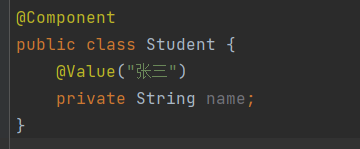
  2. 使用`@Autowired`对引用数据类型初始化（自动装配）
  - 要求spring容器提供类型匹配的对象初始化，**必须保证容器中只有一个类型匹配的对象**
  
  - 也可以声明在set方法上
  
  - ==出现@Autowired的类必须由spring容器对象创建==
    
    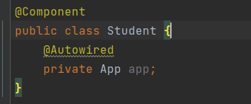
  3. 借助@Qualifier提供对象id指定初始化对象
     
     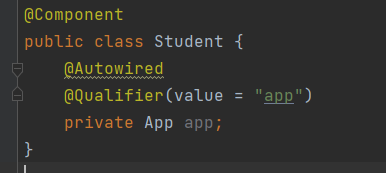

#### Bean的作用域：

- singleton单例模式（默认）
- prototype原型模式：每次从容器getBean时都会产生一个新的对象

```xml
<bean class="java.util.ArrayList" id="arrayList" scope="prototype"></bean>
```

### 3. AOP：面向切面

面向切面(aspect)：使用动态代理简化JDK**代理设计模式**开发难度

- 目标对象（target）：本次要帮助的某个接口下的某个实现类的实例对象, 目标对象并不会直接出现在程序。所有对于目标对象请求，都由其对应的代理对象进行接收。
- 切面（aspect）： 切面就是一个类。一个需要在某个接口下所有实现类中指定方法下**统一新增的方法**
- 连接点（joinPoint）：接口下需要与新增功能关联的方法。比如 service方法
- 切入点（pointCut）： 定位地址，用于指向连接点位置
- 通知（advice）：【切面】与【连接点】的调用顺序

AOP服务中通知分类：

1. 前置通知： 先执行[切面] 再执行[连接点] 【@Before】
2. 后置通知:  先执行[连接点] 再执行[切面] 【@AfterReturning】
3. 环绕通知： 先执行[切面]  再执行[连接点]  最后再执行[切面]【@Around】
4. 异常通知： 只有在[连接点]运行时抛出了异常，才会执行[切面]【@AfterThrowing】
5. 最终通知:  无论[连接点]是否执行成功，最终都要执行[切面] try{}finally{} 【@After】

在spring框架中使用动态代理：

一、 通过xml文件方式

- 添加spring动态代理aspects依赖
  
  ```xml
  <!-- spring-aspects -->
  <dependency>
      <groupId>org.springframework</groupId>
      <artifactId>spring-aspects</artifactId>
      <version>5.3.9</version>
  </dependency>
  ```
1. 创建目标接口、目标接口实现类

2. 创建切面类

3. 完成[切面]、[通知]
   
   - 创建目标对象接口、实现类、实现类功能
   
   - 创建切面类，写切面方法
     
     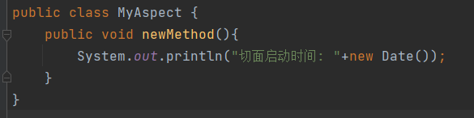

4. 在spring.xml中: 
   
   - 创建代理对象，切面对象
   - 配置aop
   
   ```xml
   <!--使用bean标签要求spring容器创建代理对象和切面对象-->
   <bean class="com.bjpn.serviceImpl.DeptServiceImpl" id="deptService"/>
   <bean class="com.bjpn.aspect.MyAspect" id="myAspect"/>
   
   <!--aop配置标签-->
   <aop:config>
       <!--声明切入点（pointCut），绑定连接点（joinPoint）的具体实现方法-->
       <aop:pointcut id="myPointCut" expression="execution(public void com.bjpn.service.BaseService.service())"/>
       <!--声明切面，绑定切面对象-->
       <aop:aspect ref="myAspect">
           <!--声明通知类型，绑定切面中的增强方法，绑定切入点-->
           <aop:before method="newMethod" pointcut-ref="myPointCut"/>
       </aop:aspect>
   </aop:config>
   ```

5. 测试使用
   
   - **问：为什么这里要上转型使用接口创建实例对象？**
   
   - 答：因为AOP动态代理默认使用的是JDK的动态代理，JDK的动态代理需要类有对应的接口，且必须使用接口上转型
   
   - 补：在IOC中使用spring容器创建实现了接口的对象时，也会自动使用JDK动态代理，需要上转型。如若是使用spring容器创建没有实现接口的对象时，使用的是cglib动态代理，不需要上转型使用。
   
   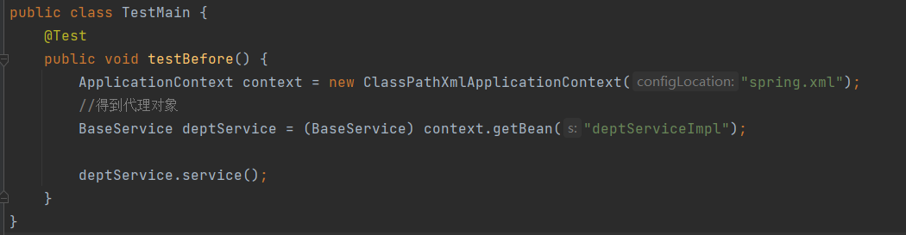

二、 通过注解方式

- 添加spring动态代理aspects依赖
  
  ```xml
  <!-- spring-aspects -->
  <dependency>
      <groupId>org.springframework</groupId>
      <artifactId>spring-aspects</artifactId>
      <version>5.3.9</version>
  </dependency>
  ```
1. 创建目标接口、目标接口实现类 ==使用Spring容器创建==

2. 创建切面类 ==使用Spring容器创建==

3. 完成[切面]、[通知]
   
   - 创建目标对象接口、实现类、实现类功能
   - 创建切面类，写切面方法`newMethod`，声明通知方式的注解`@Before`
   
   ```java
   /**
    * 加@Component，切面类需要由spring创建
    * 加@Aspect，表明此类为切面类（不用手动实现InvocationHandler接口）
    */
   @Component
   @Aspect
   //@EnableAspectJAutoProxy(proxyTargetClass = true) //加入这行可替代xml文件中的<aop:aspectj-autoproxy/>
   public class MyAspect {
       /**
        *  @ Before()，前置注解：先执行【切面】再执行【连接点】
        *                      设置pointCut，说明与哪些连接点关联
        */
       @Before(value = "execution(public void com.bjpn.service.BaseService.service())")
       public void newMethod(){
           System.out.println("service开始运行的时间: "+new Date());
       }
   
       @Around(value = "execution(* * com.bjpn.service.BaseService.*")
       public void newMethod2(ProceedingJoinPoint jp){
           System.out.println("service开始运行的时间: "+new Date());
           //执行方法
           jp.proceed();
           System.out.println("service结束运行的时间: "+new Date());
       }
   }
   ```

4. 在spring.xml中: 通知Spring容器对象在创建代理对象时关联切面类对象和代理对象
   
   ```xml
   <!--声明创建【目标对象】和【代理对象】-->
   <context:component-scan base-package="com.bjpn"/>
   <!--通知spring容器将切面类对象和代理对象关联-->
   <aop:aspectj-autoproxy />
   
   <!--可以手动设置为cglib代理模式，不需要接口上转型-->
   <!--<aop:aspectj-autoproxy proxy-target-class="true"/>-->
   ```

5. 测试使用


### 使用xml文件和注解的区别

1. 基于XML文件索要服务：
   
   - 会增加项目的容积
   
   - 相对灵活。可以要求Spring容器对象对某一个类进行多次对象创建

2. 基于Annotation注解索要服务：
   
   - 有效减少项目的容积
   - 由注解管理的类只能在Spring容器对象拥有一个实例对象

### 其他常用方法

1. 在spring.xml中可以导入包含其他spring.xml的内容：`import resource="ApplicationContexxt.xml"`

2. `context.getBeanDefinitionCount();`获取Spring容器中对象的数量

3. `context.getBeanDefinitionNames();`获取Spring容器中所有对象的id

4. 在AOP中 `String methodName = targetMethod.getSignature().getName();`获取当前关联方法的名称
   
   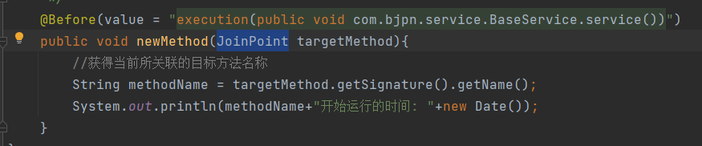

## Spring框架集成MyBatis

- MyBatis提供DAO代理服务
- Spring容器负责SqlSessionFactory、SqlSession对象、Dao代理对象的创建和初始化

在Spring中使用Mybatis开发：

一、

1. 添加依赖
   - mysql-jdbc的依赖，负责：Connection / PreparedStatement / ResultSet / Driver
   - mybatis的依赖，负责：SqlSessionFactoryBuilder / Configuration / SqlSessionFactory / SqlSession
   - mybatis-spring的依赖，负责：易于 Spring 创建 SqlSessionFactory 实现类 / SqlSession 实现类
   - druid的依赖，负责：Connection （优化数据库连接池使用，来自阿里巴巴）
   - spring-context的依赖，负责：ClassPathXmlApplication
   - spring-jdbc的依赖，负责：spring 和 jdbc 的协调管理

```xml
<dependency>
  <groupId>mysql</groupId>
  <artifactId>mysql-connector-java</artifactId>
  <version>8.0.26</version>
</dependency>

<dependency>
  <groupId>org.mybatis</groupId>
  <artifactId>mybatis</artifactId>
  <version>3.5.1</version>
</dependency>

<dependency>
  <groupId>org.mybatis</groupId>
  <artifactId>mybatis-spring</artifactId>
  <version>1.3.1</version>
</dependency>

<dependency>
  <groupId>com.alibaba</groupId>
  <artifactId>druid</artifactId>
  <version>1.1.12</version>
</dependency>

<dependency>
  <groupId>org.springframework</groupId>
  <artifactId>spring-context</artifactId>
  <version>5.3.9</version>
</dependency>

<dependency>
  <groupId>org.springframework</groupId>
  <artifactId>spring-jdbc</artifactId>
  <version>4.3.16.RELEASE</version>
</dependency>
```

2. 创建实体类、DAO接口、mapper文件、mybatis-config文件
   - 最好保证mapper文件名和DAO类名一样
   - 最好保证mapper文件和dao类在同一包下
   - mapper文件的namespace必须是对应DAO接口全限定名
   - mapper文件中SQL语句的ID必须对应DAO接口的方法名

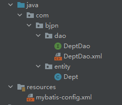

3. 在mybatis-config.xml只需设置别名和设置即可
4. 在spring.xml中: 
   - 使用Spring创建【DruidDataSource】数据库连接池管理对象
   - 使用Spring创建【SqlSessionFactory】对象，通过dataSource指定【Druid】对象
   - 使用Spring创建【MapperScannerConfigurer】对象，通过【SqlSessionFactory】对象创建【Sqlsession】对象，创建【DAO接口实现类】对象，使用时索要即可

```xml
<!-- 一、创建配置Druid对象-->
<bean class="com.alibaba.druid.pool.DruidDataSource" id="dataSource">
    <!--通过driverClassName指定驱动位置-->
    <property name="driverClassName" value="com.mysql.cj.jdbc.Driver"/>
    <!--配置数据库参数属性-->
    <property name="url" value="jdbc:mysql://localhost:3306/bjpowernode"/>
    <property name="username" value="root"/>
    <property name="password" value="129807"/>
</bean>

<!-- 二、创建SqlSessionFactory对象-->
<bean class="org.mybatis.spring.SqlSessionFactoryBean" id="sqlSessionFactory">
    <!--通过dataSource指定Druid对象-->
    <property name="dataSource" ref="dataSource"/>
    <!--通过configLocation指定mybatis配置文件位置-->
    <property name="configLocation" value="classpath:mybatis-config.xml"/>
</bean>

<!-- 三、创建MapperScannerConfigurer对象-->
<bean class="org.mybatis.spring.mapper.MapperScannerConfigurer">
    <!--生成SqlSession对象-->
    <property name="sqlSessionFactoryBeanName" value="sqlSessionFactory"/>
    <!--扫描包: 生成DAO接口实现类, 以id为小驼峰类名保存在spring容器中-->
    <property name="basePackage" value="com.bjpn.dao"/>
</bean>
```

4. 测试使用
   
   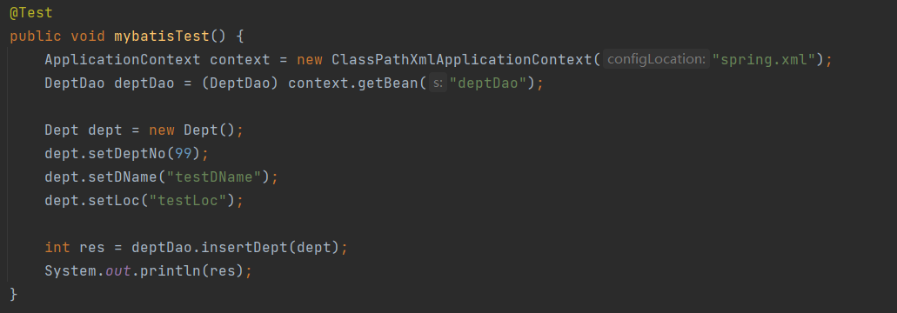

### 实现事务管理

- 使用TransactionManager事务管理类的实现类：DataSourceTransactionManager
- Spring容器使用AOP服务将TransactionManager作为切面类与连接点（service方法）进行绑定

在Spring中使用Mybatis实现事务管理：

一、通过XML方法：

1. 添加依赖
   
   ```xml
   <!--事务管理依赖-->
   <dependency>
       <groupId>org.springframework</groupId>
       <artifactId>spring-tx</artifactId>
       <version>4.3.16.RELEASE</version>
   </dependency>
   
   <!--动态代理的依赖-->
   <dependency>
       <groupId>org.springframework</groupId>
       <artifactId>spring-aspects</artifactId>
       <version>4.3.16.RELEASE</version>
   </dependency>
   ```

2. 创建mybatis运行环境，service接口，编写接口实现类
   
   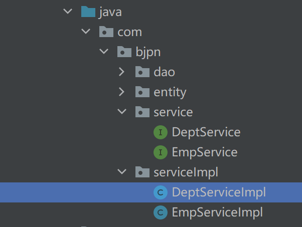
   
   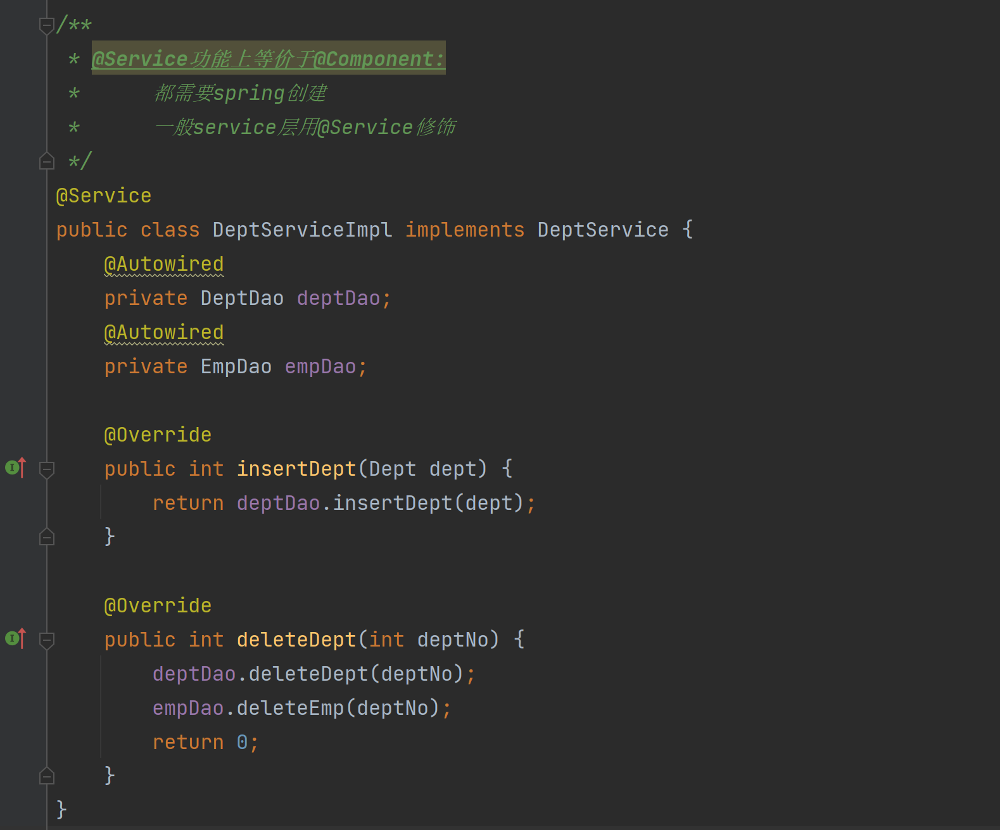

3. 在spring.xml中添加
   
   ```xml
   <!--声明事务管理器-->
   <bean class="org.springframework.jdbc.datasource.DataSourceTransactionManager" id="transactionManager">
       <!--指定数据库连接池-->
       <property name="dataSource" ref="dataSource"/>
   </bean>
   
   <!--通知spring容器对象哪个是提供事务服务的对象 事务管理器-->
   <tx:advice transaction-manager="transactionManager" id="transactionInterceptor">
       <tx:attributes>
           <!--指定方法的事务属性    name:方法名称  isolation：隔离级别  propagation：传播行为
                   rollback-for：回滚的异常类， 对于自定义的异常要使用全限定名称，系统的异常类可以名称
               -->
           <tx:method name="save*" isolation="DEFAULT" propagation="REQUIRED"
                      rollback-for="com.bjpn.crm.exception.AjaxRequestException,
                                    com.bjpn.crm.exception.TraditionRequestException" />
       </tx:attributes>
   </tx:advice>
   
   <!--通知spring容器对象, 目标方法，位置-->
   <aop:config>
       <!--绑定切入点：任意返回值类型，service包下所有接口下的所有类，所有有无参数的类-->
       <aop:pointcut id="myPointCut" expression="execution(* com.bjpn.service.*.*(..))"/>
       <!--绑定容器对象和切入点-->
       <aop:advisor advice-ref="transactionInterceptor" pointcut-ref="myPointCut"/>
   </aop:config>
   ```
   
4. 测试使用
   
   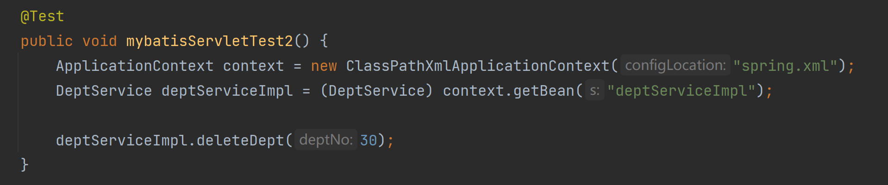

二、通过注解方式：

1. 添加依赖
   
   ```xml
   <!--springframework事务管理-->
   <dependency>
     <groupId>org.springframework</groupId>
     <artifactId>spring-tx</artifactId>
     <version>4.3.16.RELEASE</version>
   </dependency>
   ```

2. 在需要使用事务的连接点（service方法）上声明`@Transactional`注解
   
   - 注解向spring容器索要transactionalManager
   - 由transactionalManager扮演切面类，管理事务
   
   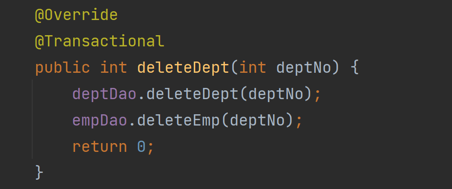

2. 在spring.xml中
   
   ```xml
       <!--声明事务管理器-->
       <bean class="org.springframework.jdbc.datasource.DataSourceTransactionManager" id="transactionManager">
           <!--指定上方声明好的数据库连接池-->
           <property name="dataSource" ref="dataSource"/>
       </bean>
       <!--注解驱动：为所有声明了@Transactional的方法绑定提供事务管理服务-->
       <tx:annotation-driven transaction-manager="transactionManager"/>
   ```

3. 测试使用
   
   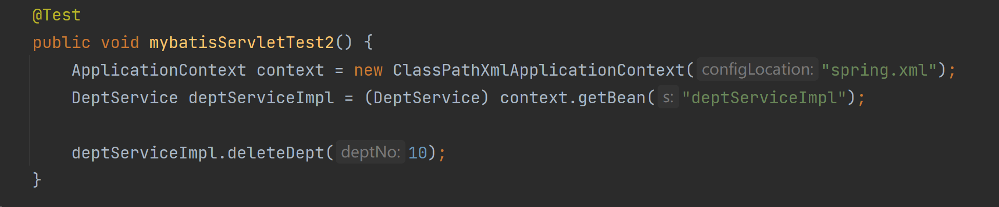

使用XMl文件与注解的区别

- 使用注解的方式需要在每一个业务方法上都添加注解（重复性开发）
- 推荐使用xml，一次编写让所有业务加上事务

## 在WEB项目中使用spring

- 不能用spring容器来创建servler对象

- 使用spring容器创建service对象
  
  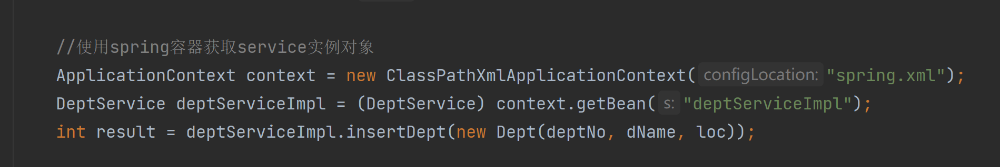

### 灵活运用监听器

- 在WEB项目中使用ContextLoaderListener监听器将spring容器对象存在全局作用域对象中
1. 添加依赖
   
   ```xml
   <!--spring-web spring提供的监听器依赖-->
   <dependency>
       <groupId>org.springframework</groupId>
       <artifactId>spring-web</artifactId>
       <version>5.3.9</version>
   </dependency>
   ```

2. 在web.xml中<servlet>标签中指定spring.xml的位置，ContextLoaderListener就按照这个文件创建spring容器
   
   ```xml
   <!--指定spring.xml文件位置，确保监听器读取的不是默认的web-inf下的applicationContext.xml文件-->
   <context-param>
    <param-name>contextConfigLocation</param-name>
    <param-value>classpath:spring.xml</param-value>
   </context-param>
   ```

3. 让监听器同时继承ContextLoaderListener类
   
   ```java
   public class LoaderListener extends ContextLoaderListener implements ServletContextListener{
       /**
        * initWebApplicationContext方法：如果全局作用域对象中不存在spring容器对象，那么就创建它
        */
       @Override
       public WebApplicationContext initWebApplicationContext(ServletContext servletContext) {
           return super.initWebApplicationContext(servletContext);
       }
   
       @Override
       public void contextInitialized(ServletContextEvent sce) {
           initWebApplicationContext(sce.getServletContext());
   
       }
   }
   ```

4. 在需要用到spring容器的位置（Servlet 控制器）通过全局作用域对象获取
   
   ```java
   ApplicationContext context = (ApplicationContext) req.getServletContext().getAttribute(WebApplicationContext.ROOT_WEB_APPLICATION_CONTEXT_ATTRIBUTE);
   ```

### 遇到的问题

1. 在jsp文件中无法使用el表达式
   
   - 在page指令中添加 `isELIgnored="false"` 
     
     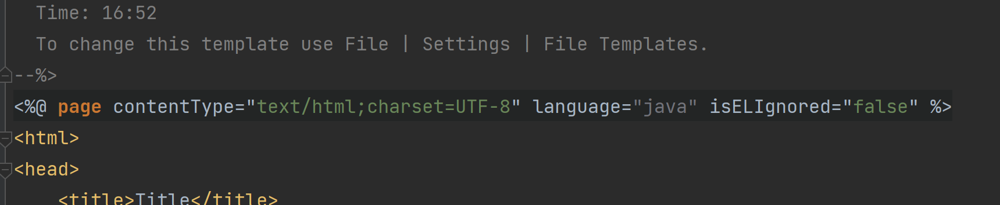

