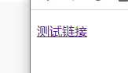
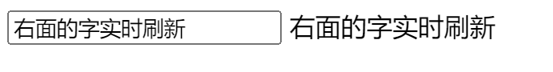

# VUE自学笔记


# Vue

- JavaScript框架
- 简化Dom操作
- 响应式数据驱动


## 使用Vue

1. 导入开发版本的Vue.js

```html
<script src="https://cdn.jsdelivr.net/npm/vue@2/dist/vue.js"></script>
```

2. 创建Vue实例对象，设置el属性和data属性
   - 将id为app的标签内的信息改为message对应的信息

```html
    <div id="app">
        {{message}}
    </div>

    <script>
        var app = new Vue({
            el:"#app", <!-- el 就是 element -->
            data:{
                message:"Hello Vue!"
            }
        })
    </script>
```


## el：挂载点

- 通过 css 选择器 设置 Vue 管理的元素
1. 在el命中的元素内部嵌套的标签也会被Vue所管理

```html
    <div id="app">
        {{message}} <!--支持表达式: {{ message + "123" }}-->
        <span>{{message}}</span>
    </div>
```

2. 也可以使用其他css选择器来设置Vue管理的元素，建议使用id选择器


3. 不能使用HTML或BODY的双标签


> el 挂载点的作用域：
>
> - el 命中的元素
> - el 命中的元素内部的元素
> - el 无法命中 html 和 body 标签


## data：数据对象

- 定义Vue用到的数据
1. data中可以写复杂类型的数据，使用时遵守js的语法即可

```html
    <div id="app" class="app">
        <h2>{{message}}</h2>
        <h2>{{people.name}}</h2>
        <h2>{{array[1]}}</h2>
    </div>

    <script>
        var app = new Vue({
            el:"#app",
            data:{
                message:"Hello Vue!",
                people:{
                    name:"唐僧"
                },
                array:[123, 12, 1]
            }
        })
    </script>
```


> data 数据对象的类型
>
> - 字符串：{{ 字符串名 }}
> - 对象：{{ 对象名 . 属性名 }}
> - 数组：{{ 数组名 [ 下标 ]  }}


## methods：方法

- 定义 Vue 用到的方法
    - 在 methods 中定义的方法中，可使用 this 获取到 data 中的数据

```html
    <div id="app">
        <button @click="sub">-</button>
        <span>{{num}}</span>
        <button @click="add">+</button>
    </div>
    <script>
        var app = new Vue({
            el:"#app",
            data:{
                num : 0
            },
            methods:{
                add:function(){
                    if(this.num < 10){
                        this.num++;
                    }else{
                        alert("满了，别点了")
                    }
                },
                sub:function(){
                    if(this.num > 0){
                        this.num--;
                    }else{
                        alert("无了，别点了")
                    }
                }
            }

        })
    </script>
```


## Vue指令

> - 不同于传统获 DOM 元素操作它们的形式，Vue 采用一系列 v- 开头的特殊语法来实现
> - Vue 的页面由数据生成，数据改变页面会同步跟着改变

### 1. 内容绑定、事件绑定

#### v-text：设置文本值

- 设置元素的 textContent

- 支持表达式：`<div v-text="message+'!'"> </div`
1. 使用 `v-text=""` 或 `{{}}` **插值表达式**

```html
    <div>
        <!-- {{xxx}} 插值表达式 -->
        <!-- {{xxx + “123”}} 插值表达式拼接字符串 -->
        <h2 v-text="message">{{"使用默认写法会替换掉全部内容"}}</h2>
        <h2 v-text="info"></h2>
        <h2 >{{message+"123"}}</h2>
    </div>
    <script>
        var app = new Vue({
            el:"div",
            data:{
                message:"Hello World!",
                info:"qwerdf"
            }
        })
    </script>
```


#### v-html：设置HTML

> 与 v-text 相同，不过可以解析 HTML 指令

- 设置元素的 innerHTML
1. 使用 `v-html=""` 解析html字符串

```html
    <div id="app">
        <p v-html="content"></p>
    </div>
    <script>
        var app = new Vue({
            el:"#app",
            data:{
                content:"<a href='#'>测试链接</a>"
            }
        })
    </script>
```



#### v-on：绑定事件

- 设置元素的绑定事件 onXXX

- 定义在 methods 属性中
1. 使用 `v-on:click` 或 `@click`
2. `v-on:keyup.enter` 限制触发的修饰符 enter 按回车时

> 方法内部可以通过 this 关键字访问 data 属性中的数据

```html
    <div id="app">
        <button v-on:click="doit">测试</button>
        <button @click="doit">{{content}}</button>
        <button @dblclick="doit">测试</button>
    </div>
    <script>
        var app = new Vue({
            el:"#app",
            data:{
                content:"<a href='#'>测试链接</a>"
            },
            methods:{
                doit:function(){
                    this.content = "testLink";
                    alert(this.content);
                }
            }
        })
    </script>
```


### 2. 显式切换、属性绑定

#### v-show：切换显示状态

- 切换元素的 `style="display:none"`
1. 使用 `v-show="true"` 布尔、引用、表达式，数据改变后显示状态会同步刷新

```html
    <div>
        
        <button @click="show">显示/隐藏</button>
    </div>
    <script>
        var app = new Vue({
            el:"div",
            data:{
                isShow : true
            },
            methods:{
                show:function(){
                    this.isShow = !this.isShow;
                }
            }
        })
    </script>
```


#### v-if：切换显示状态

- 操纵Dom树（对性能消耗较`v-show`大）
1. 使用`v-if="true"` 其他同v-show

```html
    <div>
        =18" src="/image.jpg" />
        <button @click="show">显示</button>
    </div>
    <script>
        var app = new Vue({
            el:"div",
            data:{
                isShow : 17
            },
            methods:{
                show:function(){
                    this.isShow++;
                }
            }
        })
    </script>
```


#### v-bind：设置元素属性

- 完整写法 `v-bind:属性名="值"`
1. 可简写 `:属性名`，使用三元表达式、`{active:isActive}` 根据 isActive 的值判断是否填入 "active"

```html
    <div>
        
        <br>
        
        <br>
        
        <br>
        
        <br>
    </div>

    <script>
        var app = new Vue({
            el:"div",
            data:{
                css:"border:1px solid red",
                imgSrc:"/image.jpg",
                isActive:false
            },
            methods:{
                toggleActive:function(){
                    this.isActive = !this.isActive;
                }
            }
        })
    </script>
```


### 3. 列表循环、表单元素绑定

#### v-for：列表循环

- 完整写法 `v-for="item in arr"` 、`v-for="(item,index) in arr"` 
- 循环的次数由数组的长度决定，可响应式同步更新数据

```html
    <div id="app">
        <ul>
            <li v-for="(item,index) in arr">
                {{index+1 + " -> " + item}}
            </li>
        </ul>
    </div>
    <script>
        new Vue({
            el:"#app",
            data:{
                arr:["a", 'b', 3, {
                    name:"mike",
                    tel:"12233334444"
                }]
            }
        })
    </script>
```


#### v-model：双向数据绑定

- 完整写法 `v-model="data中元素"` 
- 获取和设置表单元素的值，为表单元素设置默认 value 值为 data 中元素值，当表单中值改变时也会同步到 data 元素中

```html
    <div id="app">
        <input type="text" v-model="message" >
        {{message}}
    </div>
    <script>
        new Vue({
            el:"#app",
            data:{
                message:"刘嘉宁"
            }
        })
    </script>
```



## 网络应用

#### axios 网络请求库

- 内部封装了 Ajax，容量小，易与 Vue 结合

1. get

```js
axios.get("请求地址?k1=v1&k2=v2")
    .then(function(resp){
		//成功响应的回调方法
	},function(err){
		//报错之后的回调方法
	})
```

2. post

```js
axios.post("请求地址",{k1:v1,k2:v2})
    .then(function(resp){
		//成功响应的回调方法
	},function(err){
		//报错之后的回调方法
	})
```

vue 中的使用

```html
    <div id="app">
        <input type="button" value="getJoke" @click="getJoke">
        {{ joke }}
    </div>
    <script>
        new Vue({
            el:"#app",
            data:{
                joke:"这是一条笑话"
            },
            methods:{
                getJoke:function(){
                    //因为 ajax 是异步的, 在 ajax 代码中的 this 是 whindow 对象而不是 vue 对象
                    //所以要将当前 vue 对象存起来, 以便方法内 ajax 代码中进行调用
                    var that = this; 
                    axios.get("https://autumnfish.cn/api/joke")
                    .then(function(resp){
                        that.joke = resp.data;
                        console.log(this);
                    },function(err){
                        console.log(err);
                    })
                }
            }
        })
    </script>
```


## 跨域问题

- 浏览器的 **同源策略** 是由 NetScape 提出的一个著名的安全策略，是浏览器最核心最基本的安全功能。
- 同源就是指 协议、域名、端口都要相同
- 跨域的解决方案：
    - JSONP 由前端解决跨域问题，只能解决 GET 请求
    - CORS 是一个 W3C 标准，提供了 Web 服务从不同网域传来沙盒脚本的方法，避开浏览器的同源策略

- 后端解决方案

    > 在 类 / 方法 上加注解 
    >
    >  `@CrossOrigin(origins = "*")`
    >
    > 标识此 类 / 方法 接收所有域发来的请求

```java
@Controller
@RequestMapping("/user")
@CrossOrigin(origins = "*")
public class TestController {

    @RequestMapping("/get.do")
    @ResponseBody
    //@CrossOrigin(origins = "*")
    public User getUser(){
        return new User("mike", "123");
    }

}
```

也可以使用配置类实现

- 略

也可以使用 xml 配置解决

```xml
<mvc:cors>
    <mvc:mapping path="/**"/>
</mvc:cors>
```


