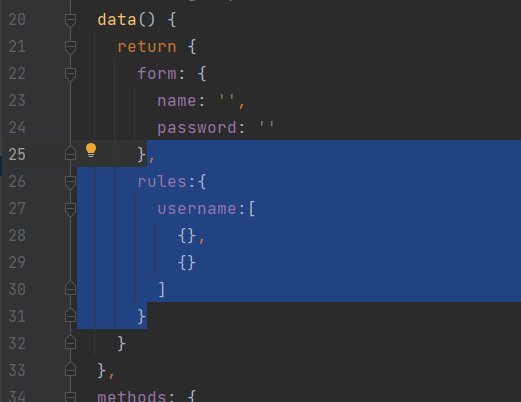

# 校园后勤管理系统项目笔记


# 校园智慧后勤管理系统

> 大连交通大学 信息学院 张箬晗、刘嘉宁
>
> 一个简易的校园后勤管理系统，学习、练习的项目笔记


## 项目技术栈

- 前端
    - Vue
    - Vue-router
    - Element-ui
    - axios
- 后端
    - SpringMVC
    - Mybatis
    - Shiro
    - 数据库：MySQL、Redis
    - 版本管理：git
    - 项目管理：Maven


## Vue 环境的配置

- 安装 Vue-cli 环境

    - 链接：[Vue 官网的 Vue Cli 安装教程](https://cli.vuejs.org/zh/guide/installation.html)

    1. 先安装 node.js 环境，在安装时会自动配置 node 和 npm 全局变量
        - 链接：[node.js 官网](https://nodejs.org/en/)

    

    2. 使用 `node -v` `npm -v` 命令查看是否安装成功
    
    
    
    3. 在文件夹下打开 cmd 命令行执行 `vue ui` 命令开始创建 vue 项目


## Vue 项目环境介绍

- 使用 idea 打开刚刚创建的 vue 项目

    1. node_modules：npm 加载的项目依赖模块， 存放项目的所有依赖

    2. public：一些公共的内容

    3. src：项目的源码，存放开发者写的代码
        1. assets：存放图片
        2. components：存放组件文件（一些可复用，非独立的页面）
        3. router： 存放了路由的 js 文件，index.js
        4. store：实现全局存储
        5. views：存放界面

        - App.vue：项目入口文件，是一个 Vue 组件，也是项目的第一个 Vue 组件
        - main.js：核心文件，相当于 Java中的 main 方法，是整个项目的入口 js

    - .xxxx：配置文件，包括git配置和语法配置等
    - package.json：项目配置文件，定义了项目的所有依赖，包括开发时依赖和发布时依赖
    - README.md：说明文档


- 在 idea 中添加 npm 的运行配置并设置 Script 为 serve 即可让 idea 一键启动 vue 项目


## element-ui 环境安装

- 在 vue 项目下 执行命令 `npm i element-ui -S` 


- 安装成功后在 package.json 中可以看到相应记录


- 在 main.js 中导入 elememt-ui

```js
import ElementUI from 'element-ui';
import 'element-ui/lib/theme-chalk/index.css';

Vue.use(ElementUI);
```


## axios 环境安装

- 在 vue 项目下 执行命令 `npm install axios -S`


- 安装成功后在 package.json 中可以看到相应记录


- 在 main.js 中导入 axios

```js
import axios from 'axios';

Vue.prototype.$axios = axios
```


## 后端 Vue 跨域问题解决

- 在 spring 的配置文件中添加

```xml
    <!-- 允许所有请求通过, 解决 vue 跨域问题   -->
    <mvc:cors>
        <mvc:mapping path="/**"
                     allowed-origin-patterns="*"
                     allowed-methods="POST,GET,OPTIONS,DELETE,PUT,PATCH"
                     allowed-headers="Content-Type,Access-Control-Allow-Headers,Authorization,X-Requested-With"
                     allow-credentials="true"/>
    </mvc:cors>
```

> 也可以使用精简写法
>
> ```xml
>     <mvc:cors>
>         <mvc:mapping path="/**" />
>     </mvc:cors>
> ```


## 后端 Shiro 配置

- 在 config 包下创建配置类 

```java
@Configuration
public class ShiroConfig {

    //1.创建 ShiroFilter 负责拦截所有请求
        //将 name 设为与 web.xml 中 filter-name 一致, 让过滤器自动找到这个 bean
    @Bean(name = "shiroFilter")
    public ShiroFilterFactoryBean getShiroFilterFactoryBean(DefaultWebSecurityManager defaultWebSecurityManager){

        //创建过滤工厂实例, 设置默认安全管理器
        ShiroFilterFactoryBean shiroFilterFactoryBean = new ShiroFilterFactoryBean();
        shiroFilterFactoryBean.setSecurityManager(defaultWebSecurityManager);

        Map<String, String> map = new HashMap<>();
        //配置系统的受限资源: 所有请求
        map.put("/test2.do", "authc"); // authc 代表资源需要认证和授权
        //配置系统的公共资源
        map.put("/test1.do", "anon");
        shiroFilterFactoryBean.setFilterChainDefinitionMap(map);
            //设置被拦截时跳转的地址
        shiroFilterFactoryBean.setLoginUrl("/login.do");

        return shiroFilterFactoryBean;
    }

    //2.创建安全管理器
    @Bean
    public DefaultWebSecurityManager getDefaultWebSecurityManager(Realm realm){
        DefaultWebSecurityManager defaultWebSecurityManager = new DefaultWebSecurityManager();
        defaultWebSecurityManager.setRealm(realm);
        return defaultWebSecurityManager;
    }

    //3.创建自定义 Realm
    @Bean
    public Realm getRealm(){
        return new CustomerRealm();
    }

}
```

- 在 shiro.realms 包下创建 Realm 实现类

```java
public class CustomerRealm extends AuthorizingRealm {
    
    //验证是否使用的是自定义 token
    @Override
    public boolean supports(AuthenticationToken token) {
        return token instanceof JwtToken;
    }
    
    //授权
    @Override
    protected AuthorizationInfo doGetAuthorizationInfo(PrincipalCollection principal) {
        return null;
    }

    //认证
    @Override
    protected AuthenticationInfo doGetAuthenticationInfo(AuthenticationToken token) 
        throws AuthenticationException {
        
        return null;
    }
}
```

- 在 web.xml 中配置启用 Shiro 过滤器

```xml
    <!-- shiro过虑器，DelegatingFilterProxy通过代理模式 关联spring容器中的bean和filter -->
    <filter>
        <filter-name>shiroFilter</filter-name>
        <filter-class>org.springframework.web.filter.DelegatingFilterProxy</filter-class>
        <!-- 设置true由servlet容器控制filter的生命周期 -->
        <init-param>
            <param-name>targetFilterLifecycle</param-name>
            <param-value>true</param-value>
        </init-param>
        <!-- 设置spring容器filter的bean id，如果不设置则找与filter-name一致的bean-->
        <!--    <init-param>-->
        <!--      <param-name>targetBeanName</param-name>-->
        <!--      <param-value>shiroFilter</param-value>-->
        <!--    </init-param>-->
    </filter>
    <filter-mapping>
        <filter-name>shiroFilter</filter-name>
        <url-pattern>/*</url-pattern>
    </filter-mapping>
```


### Shiro 认证配置

1. 接收 token
2. 解析 token
3. 验证用户名密码：详见 <a href="#后端 md5 配置">后端 md5 配置</a> 

```java
    @Override
    protected AuthenticationInfo doGetAuthenticationInfo(AuthenticationToken token)
            throws AuthenticationException {

        //向下转型 token 为自定义 token 类型
        JwtToken jwtToken = (JwtToken) token;
        //获取 token 实例中的 token 信息
        String jwt = (String) jwtToken.getPrincipal();
        //使用工具类解析 token
        Claims claims = JwtUtil.parseJWT(jwt);
        //获取解析后的用户名
        String username = claims.getId();

        User user = userService.getUserByUsername(username);
        if (user == null){
            return null;
        }
        return new SimpleAuthenticationInfo(
                username, //用户名
                user.getPassword(), //密码
                ByteSource.Util.bytes(user.getSalt()), //盐
                this.getName());
    }
```


### Shiro 授权配置

- 在 com.djtu.config 下的 ShiroConfig 配置类中添加注解驱动

```java
    // 开启 @RequiresRoles、@RequiresPermissions 注解代理
    @Bean
    public DefaultAdvisorAutoProxyCreator defaultAdvisorAutoProxyCreator() {
        DefaultAdvisorAutoProxyCreator app = new DefaultAdvisorAutoProxyCreator();
        app.setProxyTargetClass(true);
        return app;
    }
    @Bean
    public AuthorizationAttributeSourceAdvisor authorizationAttributeSourceAdvisor(SecurityManager securityManager) {
        AuthorizationAttributeSourceAdvisor authorizationAttributeSourceAdvisor = new AuthorizationAttributeSourceAdvisor();
        authorizationAttributeSourceAdvisor.setSecurityManager(securityManager);
        return authorizationAttributeSourceAdvisor;
    }
```

1. 获取当前用户角色信息
2. 获取当前用户权限信息
3. 设置授权信息

```java
    //授权
    @Override
    protected AuthorizationInfo doGetAuthorizationInfo(PrincipalCollection principal) {
        
        //这里只有在登录之后才会执行
        
        String username = (String) principal.iterator().next();
        Set<String> roles = roleService.getRoleByUsername(username);
        Set<String> permissions = permissionService.getPermissionByUsername(username);

        SimpleAuthorizationInfo info = new SimpleAuthorizationInfo();
        info.addRoles(roles);
        info.addStringPermissions(permissions);
        return info;
    }
```


### Shiro 授权无效问题

- 问题：
    - 在前后端分离场景下，产生跨域问题 cookie 无法存储到浏览器中，导致 Shiro 无法认定多次访问是否都是出自于同一个用户
    - 所以在有授权注解标注的方法运行时，抛出 UnauthenticatedException 未登录异常
- 解决：
    - 加入 Shiro 的 Session 管理器，并在每次请求时都带上一个识别身份信息的值：SessionId
    - 每次请求都会经过 Session 管理器并判断 SessionId 的值是否为已登录用户后，再进入授权验证方法执行授权

1. 在 com.djtu.shiro.session.ShiroSession 下创建 ShiroSession 类

```java

/**
 * 目的: shiro 的 session 管理
 *      自定义session规则，实现前后分离，在跨域等情况下使用token 方式进行登录验证才需要，否则没必须使用本类。
 *      shiro默认使用 ServletContainerSessionManager 来做 session 管理，它是依赖于浏览器的 cookie 来维护 session 的,
 *      调用 storeSessionId  方法保存sessionId 到 cookie中
 *      为了支持无状态会话，我们就需要继承 DefaultWebSessionManager
 *      自定义生成sessionId 则要实现 SessionIdGenerator
 *
 */
public class ShiroSession extends DefaultWebSessionManager {
    /**
     * 定义的请求头中使用的标记key，用来传递 token
     */
    private static final String AUTH_TOKEN = "authToken";
    private static final String REFERENCED_SESSION_ID_SOURCE = "Stateless request";

    public ShiroSession() {
        super();
        //设置 shiro session 失效时间，默认为30分钟，这里现在设置为15分钟
        setGlobalSessionTimeout(MILLIS_PER_MINUTE * 15);
    }

    /**
     * 获取sessionId，原本是根据sessionKey来获取一个sessionId
     * 重写的部分多了一个把获取到的token设置到request的部分。这是因为app调用登陆接口的时候，是没有token的，登陆成功后，产生了token,我们把它放到request中，返回结
     * 果给客户端的时候，把它从request中取出来，并且传递给客户端，客户端每次带着这个token过来，就相当于是浏览器的cookie的作用，也就能维护会话了
     * @param request ServletRequest
     * @param response ServletResponse
     * @return Serializable
     */
    @Override
    protected Serializable getSessionId(ServletRequest request, ServletResponse response) {
        //获取请求头中的 AUTH_TOKEN 的值，如果请求头中有 AUTH_TOKEN 则其值为sessionId。shiro就是通过sessionId 来控制的
        String sessionId = WebUtils.toHttp(request).getHeader(AUTH_TOKEN);

        if (StringUtils.isEmpty(sessionId)){
            //如果没有携带id参数则按照父类的方式在cookie进行获取sessionId
            return super.getSessionId(request, response);

        } else {
            //请求头中如果有 authToken, 则其值为sessionId
            request.setAttribute(ShiroHttpServletRequest.REFERENCED_SESSION_ID_SOURCE, REFERENCED_SESSION_ID_SOURCE);
            //sessionId
            request.setAttribute(ShiroHttpServletRequest.REFERENCED_SESSION_ID, sessionId);
            request.setAttribute(ShiroHttpServletRequest.REFERENCED_SESSION_ID_IS_VALID, Boolean.TRUE);
            return sessionId;
        }
    }

}
```

2. 在 Shiro 配置类中添加 SessionManager 的 Bean

```java
    // 必须使用session管理器，才能够解决前后端分离shiro的subject未认证的问题
    @Bean
    public SessionManager sessionManager(){
        //将我们继承后重写的shiro session 注册
        ShiroSession shiroSession = new ShiroSession();
        //如果后续考虑多tomcat部署应用，可以使用shiro-redis开源插件来做session 的控制，或者nginx 的负载均衡
        shiroSession.setSessionDAO(new EnterpriseCacheSessionDAO());
        return shiroSession;
    }
```

3. 在 SecurityManager 的 Bean 方法中为安全管理器添加 SessionManager

```java
	securityManager.setSessionManager(sessionManager);
```

4. 在控制层登录方法中获取当前认证用户 SessionId 并传给前端

```java
    String sessionId = (String) subject.getSession().getId();
    resultMap.put("sessionId", sessionId);
```

5. 在前端接收到 sessionId 后将其存储在 localStorage 中

```js
	localStorage.setItem("sessionId", resp.data.data.sessionId); //向全局存储中中存值
```

5. 在 Vue 的 axios.js 文件中添加 axios 的前置拦截，让除登录以外的请求在请求头上都加上 sessionId

```js
//前置拦截
axios.interceptors.request.use(
    config => {
        // 给每个请求都加上 authToken 请求头
        if (config.url !== '/user/login.do') {
            config.headers.authToken = localStorage.getItem('sessionId');
        }
        return config;
    },
    error => {
        return Promise.reject(error);
    }
);
```

> 解决加了 authToken 的请求头的请求出现的跨域问题
>
> - 在跨域配置文件中添加 authToken 到 allowed-headers
>
> ```xml
>     <!-- 允许所有请求通过, 解决 vue 跨域问题   -->
>     <mvc:cors>
>         <mvc:mapping path="/**"
>                      allowed-origin-patterns="*"
>                      allowed-methods="POST,GET,OPTIONS,DELETE,PUT,PATCH"
>                      allowed-headers="Content-Type,Access-Control-Allow-Headers,Authorization,X-Requested-With,authToken"
>                      allow-credentials="true"/>
>     </mvc:cors>
> ```


## 后端 JWT 配置

- 在 com.djtu.utils 下创建 JwtUtil 类，用于 jwt 加密、解密、验证 jwt 是否过期

```java
public class JwtUtil {

    //加密
    public static String createJWT(String username, String issuer, String subject, long ttlMillis) {

        //The JWT signature algorithm we will be using to sign the token
        SignatureAlgorithm signatureAlgorithm = SignatureAlgorithm.HS256;

        long nowMillis = System.currentTimeMillis();
        Date now = new Date(nowMillis);

        //We will sign our JWT with our ApiKey secret
        byte[] apiKeySecretBytes = DatatypeConverter.parseBase64Binary("1sf12sds21ie1inecs078j");
        Key signingKey = new SecretKeySpec(apiKeySecretBytes, signatureAlgorithm.getJcaName());

        //Let's set the JWT Claims
        JwtBuilder builder = Jwts.builder().setId(username)
                .setIssuedAt(now)
                .setSubject(subject)
                .setIssuer(issuer)
                .signWith(signatureAlgorithm, signingKey);

        //if it has been specified, let's add the expiration
        if (ttlMillis >= 0) {
            long expMillis = nowMillis + ttlMillis;
            Date exp = new Date(expMillis);
            builder.setExpiration(exp);
        }

        //Builds the JWT and serializes it to a compact, URL-safe string
        return builder.compact();
    }

    //解密
    public static Claims parseJWT(String jwt) {
        //This line will throw an exception if
        // it is not a signed JWS (as expected)
        try {


            Claims claims = Jwts.parser()
                    .setSigningKey(DatatypeConverter.parseBase64Binary("1sf12sds21ie1inecs078j"))
                    .parseClaimsJws(jwt)
                    .getBody();
            return claims;
        }catch (ExpiredJwtException e){
            return null;
        }
//        System.out.println("ID: " + claims.getId());
//        System.out.println("Subject: " + claims.getSubject());
//        System.out.println("Issuer: " + claims.getIssuer());
//        System.out.println("Expiration: " + claims.getExpiration());

    }

    // 判断是否过期
    public static boolean isTokenExpired(Date expiration) {
        return expiration.before(new Date());
    }

}
```

- 在 com.djtu.token 下创建 JwtToken 类，里面包装了加密后的 token 字符串、密码、等

```java
package com.djtu.token;

import com.djtu.utils.JwtUtil;
import lombok.Data;
import org.apache.shiro.authc.HostAuthenticationToken;
import org.apache.shiro.authc.RememberMeAuthenticationToken;
import org.springframework.stereotype.Component;

import java.util.Arrays;

/**
 * 自定义 token 类, 使用 jwt 传来的 token 进行身份验证
 * 具体实现仿照了 UsernamePasswordToken 类
 */
@Data
@Component
public class JwtToken implements HostAuthenticationToken, RememberMeAuthenticationToken {

    private String token;
    private char[] password;
    private boolean rememberMe;
    private String host;

    @Override
    public Object getPrincipal() {
        return token;
    }

    @Override
    public Object getCredentials() {
        return password;
    }

    public JwtToken() {
        this.rememberMe = false;
    }

    public JwtToken(String token) {
        this.token = token;
    }

    public JwtToken(String token, char[] password) {
        this(token, (char[])password, false, (String)null);
    }

    public JwtToken(String token, String password) {
        this(token, (char[])(password != null ? password.toCharArray() : null), false, (String)null);
    }

    public JwtToken(String token, char[] password, String host) {
        this(token, password, false, host);
    }

    public JwtToken(String token, String password, String host) {
        this(token, password != null ? password.toCharArray() : null, false, host);
    }

    public JwtToken(String token, char[] password, boolean rememberMe) {
        this(token, (char[])password, rememberMe, (String)null);
    }

    public JwtToken(String token, String password, boolean rememberMe) {
        this(token, (char[])(password != null ? password.toCharArray() : null), rememberMe, (String)null);
    }

    public JwtToken(String token, char[] password, boolean rememberMe, String host) {
        this.rememberMe = false;
        this.token = token;
        this.password = password;
        this.rememberMe = rememberMe;
        this.host = host;
    }

    public JwtToken(String username, String password, boolean rememberMe, String host) {
        this(username, password != null ? password.toCharArray() : null, rememberMe, host);
    }

//    @Override
//    public String toString() {
//        StringBuilder sb = new StringBuilder();
//        sb.append(this.getClass().getName());
//        sb.append(" - ");
//        sb.append(JwtUtil.parseJWT(this.token).getId());
//        sb.append(", rememberMe=").append(this.rememberMe);
//        if (this.host != null) {
//            sb.append(" (").append(this.host).append(")");
//        }
//        return sb.toString();
//    }


    @Override
    public String toString() {
        return "JwtToken{" +
                "token='" + token.substring(0, 5) + '\'' +
                ", password=" + Arrays.toString(password) +
                ", rememberMe=" + rememberMe +
                ", host='" + host + '\'' +
                '}';
    }
}
```

- 在 com.djtu.response 下创建 Result 类，封装了返回值类型

```java
@Data
@AllArgsConstructor
@NoArgsConstructor
@Accessors(chain = true) //可以链式操作
public class Result<T>{
    private int code;

    private String message;

    private T data;
}
```

- 在 com.djtu.shiro.filter 下创建 JwtFilter 类

```java
public class JwtFilter extends AuthenticatingFilter {

    /**
     * 创建 token 的方法
     * @param servletRequest req
     * @param servletResponse resp
     * @return 创建好的 token
     * @throws Exception
     */
    @Override
    protected AuthenticationToken createToken(ServletRequest servletRequest, ServletResponse servletResponse)
            throws Exception {

        HttpServletRequest request = (HttpServletRequest) servletRequest;
        //由前端在请求头中 Authorization 添加的 jwt
        String jwt = request.getHeader("Authorization");
        if(StringUtils.isEmpty(jwt)) {
            return null;
        }
        return new JwtToken(jwt);
    }

    /**
     * 拦截的主要方法
     * @param servletRequest req
     * @param servletResponse resp
     * @return 是否通过拦截
     * @throws Exception
     */
    @Override
    protected boolean onAccessDenied(ServletRequest servletRequest, ServletResponse servletResponse)
            throws Exception {

        HttpServletRequest request = (HttpServletRequest) servletRequest;
        //如果没有这个头, 就是第一次请求, 所以就通过
        String jwt = request.getHeader("Authorization");
        if(StringUtils.isEmpty(jwt)) {
            return true;
        } else {
            // 校验jwt
            Claims claim = JwtUtil.parseJWT(jwt);
            if(claim == null || JwtUtil.isTokenExpired(claim.getExpiration())) {
                HttpServletResponse response = (HttpServletResponse)servletResponse;
                response.setContentType("application/plain;charset=utf-8");
                PrintWriter writer = response.getWriter();
                writer.write(new ObjectMapper().writeValueAsString(new Result().setCode(401).setMessage("身份已过期，请重新登录")));
                return false;
//                throw new ExpiredCredentialsException("token已失效，请重新登录");
            }

            // 执行登录
            return executeLogin(servletRequest, servletResponse);
        }
    }

    /**
     * 登录失败时进行的操作
     * @param token token
     * @param e exception
     * @param request req
     * @param response resp
     * @return bool
     */
    @Override
    protected boolean onLoginFailure(AuthenticationToken token, AuthenticationException e, ServletRequest request, ServletResponse response) {

        HttpServletResponse httpServletResponse = (HttpServletResponse) response;

        Throwable throwable = e.getCause() == null ? e : e.getCause();

        Result result = new Result().setMessage(e.getMessage());
        String json = null;
        try {
            json = new ObjectMapper().writeValueAsString(result);
        } catch (JsonProcessingException ex) {
            throw new RuntimeException(ex);
        }

        try {
            httpServletResponse.getWriter().print(json);
        } catch (IOException ioException) {

        }
        return false;
    }

}
```

- 在 com.djtu.config 下的 ShiroConfig 配置类中添加 JwtFilter 过滤器，并配置过滤器的拦截路径，

```java
package com.djtu.config;

@Configuration
public class ShiroConfig {

    //1.创建 ShiroFilter 负责拦截所有请求
        //将 name 设为与 web.xml 中 filter-name 一致, 让过滤器自动找到这个 bean
    @Bean(name = "shiroFilter")
    public ShiroFilterFactoryBean getShiroFilterFactoryBean(DefaultWebSecurityManager defaultWebSecurityManager, JwtFilter jwtFilter){

        //创建过滤工厂实例, 设置默认安全管理器
        ShiroFilterFactoryBean shiroFilterFactoryBean = new ShiroFilterFactoryBean();
        shiroFilterFactoryBean.setSecurityManager(defaultWebSecurityManager);

        Map<String, Filter> filterMap = new HashMap<>();
        filterMap.put("jwt", jwtFilter);

        Map<String, String> map = new HashMap<>();
        /*
        //配置系统的受限资源
        map.put("/test2.do", "authc");
        //配置系统的公共资源
        map.put("/test1.do", "anon");
         */

        //让所有的请求进 jwt 拦截器
        map.put("/", "jwt");

        //添加过滤器
        shiroFilterFactoryBean.setFilters(filterMap);
        //添加过滤map
        shiroFilterFactoryBean.setFilterChainDefinitionMap(map);
            //设置被拦截时跳转的地址
        shiroFilterFactoryBean.setLoginUrl("/login.do");

        return shiroFilterFactoryBean;
    }

    //2.创建安全管理器
    //......

    //3.创建自定义 Realm
    //......

    @Bean
    public JwtFilter getJwtFilter(){
        return new JwtFilter();
    }

}
```

<a name="后端 md5 配置"> </a> 

## 后端 md5 配置

- 在 com.djtu.shiro.matchers 下创建 MyHashedCredentialsMatcher 类

```java
public class MyHashedCredentialsMatcher extends HashedCredentialsMatcher {

    @Override
    public boolean doCredentialsMatch(AuthenticationToken token, AuthenticationInfo info) {

        //如果没有 token , 那就是第一次访问或者访问的是登陆页面, 直接放行
        if (((JwtToken) token).getPassword() == null){
            return true;
        }

        //如果有 token 那就是有身份, 进行验证 md5 的密码...
        return super.doCredentialsMatch(token, info);
    }

}
```

- 在 com.djtu.config 下的 ShiroConfig 配置类中为 Realm 设置自定义的密码验证器，并指定加密方式散列次数

```java
@Configuration
public class ShiroConfig {

    //1.创建 ShiroFilter 负责拦截所有请求
        //将 name 设为与 web.xml 中 filter-name 一致, 让过滤器自动找到这个 bean
    //......

    //2.创建安全管理器
    @Bean
    public DefaultWebSecurityManager getDefaultWebSecurityManager(Realm realm){
        //向下转型 realm 这样才可以设置密码验证器
        CustomerRealm customerRealm = (CustomerRealm) realm;
        //设置密码验证器
        //1. 创建 Shiro 提供的 CredentialsMatcher 密码验证器
        MyHashedCredentialsMatcher matcher = new MyHashedCredentialsMatcher();
        //2. 设置其加密方式
        matcher.setHashAlgorithmName("md5");
        //3. 设置散列次数
        matcher.setHashIterations(1024);
        //4. 为自定义的 Realm 设置 CredentialsMatcher
        customerRealm.setCredentialsMatcher(matcher);

        DefaultWebSecurityManager defaultWebSecurityManager = new DefaultWebSecurityManager();
        defaultWebSecurityManager.setRealm(customerRealm);
        return defaultWebSecurityManager;
    }

    //3.创建自定义 Realm
    @Bean
    public Realm getRealm(){
        return new CustomerRealm();
    }

    @Bean
    public JwtFilter getJwtFilter(){
        return new JwtFilter();
    }

}
```


## 后端全局异常类

- `@RestControllerAdvice` 注解实现 **全局拦截异常** 并 **统一处理**
    - `@ExceptionHandler` 拦截异常进入指定方法

- 在 com.djtu.exception 下创建 GlobalException 类

```java
@Slf4j //lombok 提供的日志输出
@RestControllerAdvice
public class GlobalException {

    @ExceptionHandler(value = UnauthorizedException.class)
    public Result handler(UnauthorizedException e){
        log.error("运行时异常----------------{}" + e.getMessage());
        return new Result().setCode(401).setMessage("无权限访问");
    }

    @ExceptionHandler(value = ExpiredCredentialsException.class)
    public Result handler(ExpiredCredentialsException e) {
        log.error("运行时异常----------------{}", e.getMessage());
        return new Result().setCode(401).setMessage("登录已过期，请重新登录");
    }

    @ExceptionHandler(value = UnauthenticatedException.class)
    public Result handler(UnauthenticatedException e) {
        log.error("运行时异常----------------{}", e.getMessage());
        return new Result().setCode(401).setMessage("未登录");
    }

}
```


## Mybatis 的缓存问题

- 在 Mabitas 的配置文件中开启缓存

```xml
<setting name="cacheEnabled" value="true"/>
```

- 在每个 mapper 中都添加标签

```xml
<cache/>
```

- 此时出现问题：`Error serializing object. Cause: java.io.NotSerializableException: com.djtu.XXX......` 
    - 问题大意为 Mabatis 缓存的实体类不可序列化
        - 解决：为所有加了缓存的mapper对应的实体类都实现 Serializable 接口，实现可序列化
    - 为什么需要序列化？
        - 因为 `<cache/>` 默认 `readOnly = false` 
            1. 如果开启 readOnly 只读的缓存会给所有调用者返回缓存对象的相同实例。 因此这些对象不能被修改。这就提供了可观的性能提升。
            2. 而可读写的缓存会（通过序列化）返回缓存对象的拷贝。 速度上会慢一些，但是更安全。


## 开启 Shiro 缓存

- 由于用户的权限信息是一个经常读取但不经常修改的数据，在每次调用需要授权的方法时都要读一遍数据库，所以将这部分授权数据存储在内存或者缓存服务器中提升查询速度
- 导入依赖

```xml
        <!-- shiro-ehcache -->
        <dependency>
            <groupId>org.apache.shiro</groupId>
            <artifactId>shiro-ehcache</artifactId>
            <version>1.9.0</version>
        </dependency>
```

- 在 Shiro 配置类中添加

```java
        //4. 开启EH缓存
        realm.setCacheManager(new EhCacheManager());
        realm.setCachingEnabled(true);
        realm.setAuthenticationCachingEnabled(true);
        realm.setAuthenticationCacheName("authenticationCache");
        realm.setAuthorizationCachingEnabled(true);
        realm.setAuthorizationCacheName("authorizationCache");
```


## 后端文件接收

- 在接口的形参中添加 `MultipartFile file` 用于解析文件

```java
@RequestMapping("/uploadAvatar.do")
@ResponseBody
public Result uploadAvatar(MultipartFile file){
    System.out.println(file);
    return null;
}
```

- 在 web.xml 中为 servlet 标签添加 `multipart-config` 配置，否则报错 java.lang.IllegalStateException: 由于没有提供multi-part配置，无法处理parts

```xml
<multipart-config>
    <max-file-size>20848820</max-file-size>
    <max-request-size>418018841</max-request-size>
    <file-size-threshold>1048576</file-size-threshold>
</multipart-config>
```


## Tomcat 在 linux 中写入文件权限不足

- linux 上部署的 Tomcat 在写入文件时，默认权限是 640 只能让所有者读取和写入
- 修改 Tomcat 的 bin 中 catalina.sh 文件第 290 行左右 `#UMASK=“0027”`  改为 `#UMASK=“0000”` 即可解决


## 关于MySQL的GROUP BY报错解决方案

- 原因：MySQL5.7版本之后使用Group by语句时报错，group by 违背了sql_mode=only_full_group_by。因为mysql版本5.7之后默认的模式是ONLY_FULL_GROUP_BY。拒绝选择列表、HAVING 条件或 ORDER BY 列表引用非聚合列的查询，这些列既不在 GROUP BY 子句中命名，也不在功能上依赖于（唯一确定的）GROUP BY 列。

- 解决：

  - 1、先使用SQL查询sql_mode

    ```bash
    select @@global.sql_mode
    ```

    

  - 2、重新设置sql_mode，删除ONLY_FULL_GROUP_BY

    ```bask
    set @@global.sql_mode ='STRICT_TRANS_TABLES,NO_ZERO_IN_DATE,NO_ZERO_DATE,ERROR_FOR_DIVISION_BY_ZERO,NO_ENGINE_SUBSTITUTION'
    ```


## POI和easyExcel

<font style="font-size:13px">资料来源于：https://www.bilibili.com/video/BV1Ua4y1x7BK?spm_id_from=333.999.0.0</font>

<font style="font-size:13px">笔记记录者：@LittleHan：https://gitee.com/LittleHanQAQ</font>

### 一、常用场景

- 将用户信息导出为excel表格(导出数据...)
- 将Execl表中的信息录入到网站数据库

### 二、POI基本功能

- HSSF-提供读写Microsoft Execl格式档案的功能	03年版本的xls
- XSSF-提供读写Microsoft Execl OOXML格式档案的功能 07年以后版本地xlsx
- HWPF-提供读写Microsoft Word格式档案的功能
- HSLF-提供读写Microsoft PowerPoint格式档案的功能
- HDGF-提供读写Microsoft Visio格式档案的功能

### 三、JAVA解析Excel工具EasyExcel(阿里巴巴)

- easyExcel 官网网址：https://github.com/alibaba/easyexcel
- easyExcel 官方文档：https://www.yuque.com/easyexcel/doc/easyexecl
- Apache POI官网：https://poi.apache.org/

- java解析、生成Excel比较有名的框架有Apache poi、jxl，但他们都存在严重问题非常的消耗内存，EsayExcel

不会出现内存溢出，让使用者更加简单方便 。

- POI与easyExcel对比：


### 四、POI写入数据

- 导入相关依赖

```xml
<!--导入依赖-->
    <dependencies>
    <!--xLs(03)-->
    <dependency>
        <groupId>org.apache.poi</groupId>
        <artifactId>poi</artifactId>
        <version>3.9</version>
    </dependency>
    <!--xLsx(07)-->
    <dependency>
        <groupId>org.apache.poi</groupId>
        <artifactId>poi-ooxml</artifactId><version>3.9</version>
    </dependency>
    <!--日期格式化工具-->
    <dependency>
    <groupId>joda-time</groupId>
    	<artifactId>joda-time</artifactId>
        <version>2.10.1</version>
    </dependency>
```

- <font color="red">需要注意:2003版本和2007版本存在兼容性问题！03最多只用65535行！</font>
- Excel中的几个对象
  - 工作簿：
  - 工作表：
  - 行：
  - 列：

```java
 		//1.创建工作簿 Workbook为一个接口
        Workbook workbook=new HSSFWorkbook();
        //2.创建工作表
       Sheet sheet=workbook.createSheet("表名字");
       //3.创建一个行
        Row row1=sheet.createRow(0);
        //4.创建一个单元格
        Cell cell1=row1.createCell(0);
        cell1.setCellValue("姓名");

        Row row2=sheet.createRow(1);
        Cell cell2=row1.createCell(0);
        cell2.setCellValue("张三");
        //生成一张表（IO流）
        String path="E:\\";
        FileOutputStream fileOutputStream=new FileOutputStream(path+"学生表.xls");
        workbook.write(fileOutputStream);
        fileOutputStream.close();
```

### 五、大量数据的写入

- 大文件写HSSF

  - 缺点：最多只能处理65536行，否则回抛出异常。

  - ```java
    java.lang.IllegalArugmentException:Invalid row number(65536) outside allowable range(0..65535)
    ```

  - 优点：过程中写入缓存，不操作磁盘，最后一次性写入磁盘，速度快。 

- 大文件写XSSF

  - 缺点：写数据时速度非常 慢，非常耗内存，也会发生内存溢出，如100万条
  - 优点：可以写较大的数据量，如20万条

- 大文件写SXSSF

  - 优点：可以写非常大的数据量，如100万条甚至更多条，写数据速度快，占用更少的内存

  - 注意：

    - 过程中会产生临时文件，需要清理临时文件
    - 默认由100条记录被保存在内存中，如果超过这数量，则最前面的数据被写入临时文件
    - 如果向自定义内存中数据的数量，可以使用new SXXSSFWorkbook(数量)

  - 清除临时文件方法：

    ```java
    ((SXSSFWorkbook)workbook).dispose();
    ```

### 六、POI读取数据

- ```java
  	//1.获取文件流
    FileInputStream inputStream=new FileInputStream(path+"学生.xlsx");
    //2.创建工作簿
    Workbook workbook=new HSSFWorkbook(inputStream);
    //3.获取工作表
    Sheet sheet=workbook.getSheetAt(0);
    //获取行
    Row row=sheet.getRow(0);
    //获取列(结合行就是一个单元格[0,0])
    Cell cell=row.getCell(0);
    cell.getStringCellValue();
  ```

- <font color="red">注意：获取值的类型</font>

- Row类里的getPhysicalNunberOfCells()方法获取指定行有多少列

- Sheet类里的getPhysicalNumberOfRows()方法获取表里有多少行

### 七、Easy Excel的使用

- https://github.com/alibaba/easyexcel

- 导入依赖

  ```xml
  <dependency>
  	<groupId>com.alibaba</groupId>
      <artifactId>easyexcel</artifactId>
      <version>3.0.5</version>
  </dependency>	
  	
  ```

- <font color="red">注意：该依赖已经引用了xLs(03)和xLsx(07）,同时需要lombok依赖</font>

- 三步走：

  - 实体类

  ```java
  @Data
  public class DemoData{
      @ExcepProperty("字符串标题")
      private String str;
      
      /**
       * 忽略这个字段
       */
      @ExcelIgnore
      private String ignore;
  }
  ```

  - 如果查到的数据已经时list封装好了，可以省略此步骤

    ```java
    private List<DownloadData> data() {
            List<DownloadData> list = ListUtils.newArrayList();
            for (int i = 0; i < 10; i++) {
                DownloadData data = new DownloadData();
                data.setString("字符串" + 0);
                data.setDate(new Date());
                data.setDoubleData(0.56);
                list.add(data);
            }
            return list;
        }
    ```

  - 写Excel

    ```java
    String fileName = TestFileUtil.getPath() + "write" + System.currentTimeMillis() + ".xlsx";
            // 这里 需要指定写用哪个class去读，然后写到第一个sheet，名字为模板 然后文件流会自动关闭
            // 如果这里想使用03 则 传入excelType参数即可
            EasyExcel.write(fileName, DemoData.class).sheet("模板").doWrite(data());
    ```

### 八、遇到的问题以及解决方案

- <font color="red">遇到的问题1：在web中，我们前端通过ajax发送导出Excel请求，当响应到浏览器是二进制码，并不会触发下载excel。</font>
  - 
  - 解决方案：我们可以采用form表单方式/超链接方式，而不是ajax方式发起请求。
- <font color="red">遇到的问题2：根据row对象获取cell的值方法row.getCell( num)，返回值并不是String类型而是Cell类型，通过row.getCell( num).getStringCellValue()获取值</font>
- 


## 前端 Vue 中的 JWT 存储

- 在 src/store 下的 index.js 文件书写内容，在 state、 localStorage 中存储 token、userInfo 实现全局储存

```js
import Vue from 'vue'
import Vuex from 'vuex'

Vue.use(Vuex)

export default new Vuex.Store({
  state: {
    token:localStorage.getItem("token"), //将state中的token设为localStorage中的token值
    userInfo:JSON.parse(localStorage.getItem("userInfo")) //将state中的userInfo设为localStorage中的userInfo值
  },
  getters: {
    getUser: state => { //获取 state 中的 userInfo
      return state.userInfo;
    },
    getToken: state => { //获取 state 中的 token
      if (state.token == null) { //是第一次登录
        return '';
      }
      return state.token;
    }
  },
  mutations: {
    SET_TOKEN:(state, token)=>{ //设置 state 中的 token
      state.token = token;
      localStorage.setItem("token", token);
    },
    SET_USERINFO:(state, userInfo)=>{ //设置 state 中的 userInfo
      state.userInfo = userInfo;
      localStorage.setItem("userInfo", userInfo);
    },
    REMOVE_INFO:(state)=>{ //删除 state 和 localStorage 中的 token 和 userInfo
      state.token = '';
      state.userInfo = {};
      localStorage.setItem("token", '');
      localStorage.setItem("userInfo", JSON.stringify(''));
    }
  },
  actions: {
  },
  modules: {
  }

})
```


## 前端 Vue 创建新页面流程

1. 在 src/views 下创建 vue 页面文件, 并设置 name

```vue
<template>
	<!--拷贝 饿了么 中的 组件代码-->
</template>

<script>
export default {
  name: "login",
    <!--拷贝 饿了么 中的 data 和 methods-->
}
</script>

<style scoped>
	/*拷贝饿了么中的内容*/
</style>
```

2. 在 src/router 下的 index.js 中填写路由信息

```js
import Vue from 'vue'
import VueRouter from 'vue-router'

import test from "@/views/test";
import login from "@/views/login"; //导入 /views/ 下的对应文件

Vue.use(VueRouter)

const routes = [
  {
    path:"/",
    name:"test",
    component:test
  },
  { //添加一个新的路由地址
    path:"/login", //设置访问地址
    name:"login",
    component: login //在这里设置 import 导入的对应文件
  }
]
```

- 设置路由等等...略


## 前端 Vue 的请求拦截配置

- 配置基础链接 在 src 下创建 axios.js 

```js
import axios from "axios";

//配置 axios 每个链接的公共字符
axios.defaults.baseURL = "http://localhost:8080/logisticsProject";
```

- 在 main.js 中导入刚刚创建好的文件

```js
import "./axios"
```

- 在 src / axios.js  配置前置拦截和后置拦截，功能增强【没有过滤功能】

```js
//前置拦截
axios.interceptors.request.use(config => {
    return config; //不进行前置拦截
})

//后置拦截: 根据后端给前端的状态码进行拦截, 这样在其他页面就只需要处理 200 状态码的情况了
axios.interceptors.response.use(resp =>{
    let res = resp.data;
    if (res.code == 200){ // 200 成功 不拦截
        return resp;
    }else if(res.code == 401){ // 401 失败 显示失败信息, 跳转至 登录页面
        ElementUI.Message.error(res.message, {duration:3*1000});
        router.push("/login");
        return Promise.reject(res.message);
    }else { // 失败 显示失败信息
        ElementUI.Message.error(res.message, {duration:3*1000});
        return Promise.reject(res.message);
    }
})
```


## 前后端分离 cookie 问题

- 问题：前后端分离之后，后端的 cookie 无法存储到前端浏览器中

    - 这是一个跨域问题

    1. 在后端跨域配置中添加 mapping 属性，允许接受 cookie

    ```
    allow-credentials="true"
    ```

    2. 在前端 axios 的配置中添加默认配置，允许每次请求带上 cookie

    ```
    axios.defaults.withCredentials = true;
    ```

> 2022-04-30 ：这样并不能解决 Cookie 问题，Cookie 问题似乎不能轻易的解决，就算这么设置了也无法存储 Cookie


## 前后端传参思路

- 用户进入主页面时
    - 向后端发送请求，获取该用户拥有的功能列表（父菜单、子菜单），并将其遍历在功能菜单上
    - 向后端发送请求，获取该用户拥有的功能列表的目标地址（“/user/dorm”）绑定到按钮 ` :to="xxx"` 上，点击对应按钮 mian 栏就显示对应页面


## Vue el-dropdown-item 标签无法触发事件

- 使用 `@click.native` 替换 `@click` 即可


## Vue 如何跳转页面和刷新页面

- `this.$router.go(0)` 刷新页面
- `this.$router.replace("/login")` 跳转页面


## Vue 表单 data 的规则验证

- 什么是 rules ?
- 是对 data 数据的验证，name 与表单中 prop 的值对应？
    - **type**：类型
    - **required**：是否必选项（此栏是否为空）
    - **message**：报错信息
    - **trigger**：触发方式
        - **blur** ：失去焦点时进行验证（对 `input` 输入框的验证）
        - **change** ：当值发生变化时进行验证（下拉框`select`，日期选择框`date-picker`，复选框`checkbox`，单选框`radio`）

    - **min / max**：最小 / 最大 长度


```javascript
name:[
    {type: 'string', required: true, message: "名称必填", trigger: 'blur'},
	{min: 3, max: 30, message: "名称长度不能超过30位"}
]
```

- 在 form 标签中指定 :rules


- 在 data 中添加 rules




## Vue 如何动态生成表单 rules

- 起因：在 data 中写 this.xxx 无效
- 解决：在页面加载的回调方法 mounted / created 中加载 rules 中的内容

```js
    // 加载楼宇列表值
    this.$axios.post("/building/getDormBuildingValueList.do")
        .then(resp=>{
        // 设置楼宇 rules 验证枚举
        var rulesEnum = [];
        for (let temp in resp.data.data) {
            rulesEnum.push(resp.data.data[temp].value);
        }
        var t = {type:'enum', enum: rulesEnum, message: '楼宇必须为楼宇列表中的值'};
        this.rules.building.push(t);
    }, err=>{
        console.log(err);
    })
```


## Vue 的路由拦截

- 七天免登录的实现

1. 如果有七天免登录需求，后端在登录返回结果中他添加标记和时间戳

```java
    long timeStamp = System.currentTimeMillis()+1000*60*60*24*7; //设置过期时间为 7 天
    if (!rememberMe) {
        timeStamp = System.currentTimeMillis()+1000*60*30; //如果没选七天免登录的话, 过期时间为 30 分钟
    }
    resultMap.put("rememberMe", rememberMe); //传递是否七天免登录的标记
    resultMap.put("timestamp", timeStamp); //传递过期时间戳
```

2. 在前端的 main.js 中添加路由的 brforeEach 方法

```js
/**
 * 每次路由前都验证 localStorage 是否过期
 */
router.beforeEach((to, from, next)=> {
  var rememberMe = store.getters.getRememberMe;
  var timeStamp = store.getters.getTimeStamp;
  var nowTimeStamp = new Date().getTime();
  if (to.fullPath === '/login' || to.fullPath === '/register') { //如果访问的是 登录 / 注册 页面则 放行
    next();
  } else if (rememberMe == null) { // localStorage 为空
    ElementUI.Message.error('您已退出登录, 请重新登录', {duration:3*1000});
    next("/login");
  } else {
    var addTime = 0;
    if (rememberMe) { //勾选了 7 天免登录
      addTime = 1000 * 60 * 60 * 24 * 7;
    } else { //未勾选 7 天免登录时
      addTime = 1000 * 60 * 30;
    }
    if (nowTimeStamp < timeStamp) { // 未过期
      store.commit("SET_TIME_STAMP", nowTimeStamp + addTime);
      next();
    } else { //已过期
      store.commit("REMOVE_INFO");
      ElementUI.Message.error('免登录时间已过或长时间未操作, 请重新登录', {duration:3*1000});
      next("/login");
    }
  }
});
```

3. 为登录界面添加时间戳验证

```js
  created() {
    if (this.$store.getters.getTimeStamp > 0){ //页面打开时判断是否需要登录
      this.$router.replace("/index");
      this.$notify({
        title: '成功',
        message: '通过免登录验证, 进入主页',
        type: 'success'
      });
    }
  }
```


## Vue 打包发布

- 设置 Vue 的 base 路径（网站名），在 router 的 index.js 中修改 base 内容

```js
const router = new VueRouter({
  mode: 'history',
  // base: process.env.BASE_URL,
  base: 'DJTULogistics',
  routes
})
```

- `npm run build` 打包 Vue 项目到 dist 目录
- 复制到 nginx 或 tomcat 上部署


## Vue 的深浅拷贝

-  Vue 中默认的 `=` 赋值为浅拷贝，拷贝对象的内存地址
- 深拷贝方法：由 JSON 包装在解析

```js
深拷贝数据 = JSON.parse(JSON.stringify(原数据));
```


## Vue 不使用 axios 的时候如何修改 headers

- 问题来源：此项目是按照每次请求请求头中的自定义参数 `authToken` 来识别此次请求的用户是否有 session
- 当使用 axios 时，在 axios 的前置拦截中添加了 `authToken` 的 headers 请求头，但是在 Vue 其他 action 请求中无效
- 解决方法: 在 Vue 的 action 标签加上 `:headers="{authToken: this.$store.getters.getSessionId}"`


## Vue watch 的使用

- watch 可以做到在指定值发生改变后，执行回调方法
- watch 写在 data 同级

```js
  watch: {
    '$route.params.floor'(newValue, oldValue) {
      alert(newValue + ", " + oldValue);
    }
  }
```


## Gitee issues 的标签

- 标签解释：
    - Bug - 错误
    - Duplicate - 重复
    - Enhancement - 加强，改善
    - Feature - 功能
    - Invalid - 非法
    - Question - 问题
    - WontFix - 不能修复


## 秒杀相关知识

### validation

- 为提高程序安全性、健壮度，对 HTTP 请求数据的校验需要在服务端再次校验
- validation 实现用注解解决代码中大量数据校验而带来的冗余
- SpringMVC 使用的是 Hibernate Validator 实现的 JSR-303 校验规范

使用方式：

1. 导入依赖

```xml
    <dependency>
        <groupId>org.hibernate</groupId>
        <artifactId>hibernate-validator</artifactId>
        <version>5.4.3.Final</version>
    </dependency>
```

2. 在 Spring 配置文件中添加 数据校验器

```xml
	<!--校数校验-->
    <bean id="validator" class="org.springframework.validation.beanvalidation.LocalValidatorFactoryBean">
        <property name="providerClass" value="org.hibernate.validator.HibernateValidator"/>
        <!-- 如果不加默认到 使用classpath下的ValidationMessages.properties -->
        <property name="validationMessageSource" ref="messageSource"/>
    </bean>
    <!-- 国际化的消息资源文件（本系统中主要用于显示/错误消息定制） -->
    <bean id="messageSource" class="org.springframework.context.support.ReloadableResourceBundleMessageSource">
        <property name="basenames">
            <list>
                <!-- 在web环境中一定要定位到classpath 否则默认到当前web应用下找-->
                <value>classpath:messages</value>
            </list>
        </property>
        <property name="useCodeAsDefaultMessage" value="false"/>
        <property name="defaultEncoding" value="UTF-8"/>
        <property name="cacheSeconds" value="60"/>
    </bean>
    <!--添加数据校验器-->
    <mvc:annotation-driven validator="validator"/>
```

3. 在 resources 中创建 messages.properties, 配置错误消息提示

```properties
username.null=用户不能为空
password.illegal=密码必须为5到20之间的大小写字符
age.illegal=年龄必须在18到60之间。
```

#### 常用校验注解

>  @Null 被注释的元素必须为 null
>  @NotNull 被注释的元素必须不为 null
>  @AssertTrue 被注释的元素必须为 true
>  @AssertFalse 被注释的元素必须为 false
>  @Min(value) 被注释的元素必须是一个数字，其值必须大于等于指定的最小值
>  @Max(value) 被注释的元素必须是一个数字，其值必须小于等于指定的最大值
>  @DecimalMin(value) 被注释的元素必须是一个数字，其值必须大于等于指定的最小值
>  @DecimalMax(value) 被注释的元素必须是一个数字，其值必须小于等于指定的最大值
>  @Size(max=, min=) 被注释的元素的大小必须在指定的范围内
>  @Digits (integer, fraction) 被注释的元素必须是一个数字，其值必须在可接受的范围内
>  @Past 被注释的元素必须是一个过去的日期
>  @Future 被注释的元素必须是一个将来的日期
>  @Pattern(regex=,flag=) 被注释的元素必须符合指定的正则表达式
>
>  Hibernate Validator 附加的 constraint
>  @NotBlank(message =) 验证字符串非 null，且长度必须大于 0
>  @Email 被注释的元素必须是电子邮箱地址
>  @Length(min=,max=) 被注释的字符串的大小必须在指定的范围内
>  @NotEmpty 被注释的字符串的必须非空
>  @Range(min=,max=,message=) 被注释的元素必须在合适的范围内

1. 在需要用到的地方配置 @Valid 


2. 在 @Valid 修饰的类中添加相关注解


#### 自定义注解

- 在 validator 包下创建注解类，配置校验规则、自定义方法规则

```java
@Target({ElementType.METHOD, ElementType.FIELD, ElementType.ANNOTATION_TYPE, ElementType.CONSTRUCTOR, ElementType.PARAMETER})
@Retention(RetentionPolicy.RUNTIME)
@Documented
@Constraint(
        // 校验规则
        validatedBy = {IsIdentValidator.class}
)
public @interface IsIdent {

    // 自定义方法规则: 必填项
    boolean required() default true;

    // 错误提示信息
    String message() default "{javax.validation.constraints.NotNull.message}";

    Class<?>[] groups() default {};

    Class<? extends Payload>[] payload() default {};

}
```

- 在 validator 包下创建校验规则类，设置泛型为自定义的注解

```java
public class IsIdentValidator implements ConstraintValidator<IsIdent, String> {

    private boolean required = false;

    @Override
    public void initialize(IsIdent isIdent) {
        boolean required = isIdent.required();

    }

    @Override
    public boolean isValid(String s, ConstraintValidatorContext constraintValidatorContext) {
        if (required) {
            return ValidatorUtil.isIdent(s);
        }else {
            if (StringUtils.isEmpty(s)){
                return true;
            }else {
                return ValidatorUtil.isIdent(s);
            }
        }
    }

}
```

- 在 utils 包下创建 ValidatorUtil 工具类

```java
public class ValidatorUtil {

    private static final Pattern ident_pattern = Pattern.compile("学生|导员|管理员");

    public static boolean isIdent(String ident){
        if (StringUtils.isEmpty(ident)){
            return false;
        }
        Matcher matcher = ident_pattern.matcher(ident);
        return matcher.matches();
    }

}
```

#### 异常处理

- 异常处理类捕获 MethodArgumentNotValidException

- 获取定义的异常提示信息: `e.getBindingResult().getAllErrors().get(0).getDefaultMessage()`


### 分布式 Session 问题

- 使用 nginx 做负载均衡服务器时，若使用默认轮询机制用户每次访问的服务器不同，导致偶现的 Session 丢失
- 解决方案：
    1. Session 复制：通过修改 Tomcat 的配置，A 服务器中 Session 修改时同时复制到 B 服务器中
        - 优点：操作简单，只需修改 Tomcat 配置
        - 缺点：Session 同步会占用内网带宽、由于同步造成性能下降、占用内存无法有效水平扩展
    2. 前端存储：直接将 Session 存储在浏览器中
        - 优点：不占用服务器内存
        - 缺点：存在安全风险、占用外网带宽
    3. Session 粘滞：将同一用户请求都发往同一服务器
        - 优点：无需修改代码、服务器可以水平扩展
        - 缺点：添加新机器时、应用重启时 会重新 Hash 导致登录失效
    4. 后端集中存储：使用缓存服务器统一存储 Session 
        - 优点：安全、可以水平扩展
        - 缺点：增加复杂度、需要修改代码

#### SpringMVC 中 配置 Redis

1. 导入 redis jedis 依赖

```xml
        <!-- redis -->
        <dependency>
            <groupId>org.springframework.data</groupId>
            <artifactId>spring-data-redis</artifactId>
            <version>2.7.0</version>
        </dependency>
        <!-- jedis -->
        <dependency>
            <groupId>redis.clients</groupId>
            <artifactId>jedis</artifactId>
            <version>3.8.0</version>
        </dependency>
```

2. 在 resources 目录下创建 redis.properties 配置 redis 基础连接信息

```properties
# Redis Setting
# Redis默认有16个库，序号是0-15，默认是选中的是0号数据库
spring.redis.database=0
# Redis服务器地址
spring.redis.host=47.113.216.124
# Redis服务器连接端口，默认是6379
spring.redis.port=6380
# Redis服务器连接密码（默认为空）
spring.redis.password=redis
# 连接池最大阻塞等待时间（使用负值表示没有限制），根据实际情况修改
spring.redis.pool.maxWaitMillis=-1
# 连接池中的最大空闲连接，根据实际情况修改
spring.redis.pool.maxIdle=8
# 连接池中的最小空闲连接，根据实际情况修改
spring.redis.pool.minIdle=0
# 连接超时时间（毫秒），根据实际情况修改
spring.redis.timeout=2000
```

3. 在 resources 目录下创建 applicationContext-redis.xml 配置 redis

```xml
 	<!-- 载入redis.properties,这里要特别注意，如果有多个properties文件，必须用逗号分开，不能写成两个 <context:property-placeholder/> -->
    <context:property-placeholder location="classpath:redis.properties" />

    <!-- 配置JedisPoolConfig连接池-->
    <bean id="poolConfig" class="redis.clients.jedis.JedisPoolConfig">
        <property name="maxIdle" value="${spring.redis.pool.maxIdle}"></property>
        <property name="minIdle" value="${spring.redis.pool.minIdle}"></property>
        <property name="maxWaitMillis" value="${spring.redis.pool.maxWaitMillis}"></property>
    </bean>

    <!-- 配置jedis连接工厂 -->
    <bean id="connectionFactory"
          class="org.springframework.data.redis.connection.jedis.JedisConnectionFactory">
        <property name="poolConfig" ref="poolConfig"></property>
        <property name="hostName" value="${spring.redis.host}"></property>
        <property name="port" value="${spring.redis.port}"></property>
        <property name="password" value="${spring.redis.password}"></property>
        <property name="database" value="${spring.redis.database}"></property>
        <property name="timeout" value="${spring.redis.timeout}"></property>
    </bean>

    <!-- 配置RedisTemplate -->
    <bean id="stringRedisSerializer" class="org.springframework.data.redis.serializer.StringRedisSerializer" />
    <bean id="cacheRedisTemplate" class="org.springframework.data.redis.core.RedisTemplate" >
        <property name="connectionFactory" ref="connectionFactory" />
        <property name="keySerializer" ref="stringRedisSerializer" />
        <property name="hashKeySerializer" ref="stringRedisSerializer" />
        <property name="valueSerializer" ref="stringRedisSerializer" />
        <property name="hashValueSerializer" ref="stringRedisSerializer" />
    </bean>
```

4. 在主 spring 配置文件中引入 redis 配置文件

```xml
    <!--引入redis配置文件-->
    <import resource="applicationContext-redis.xml"/>
```

> 错误：Could not resolve placeholder 'spring.redis.pool.maxIdle' in value "${spring......
>
> - 错误大意为不能获取 properties 配置文件中定义的内容
> - 原因：Spring 容器默认使用单例模式反射获取 `<context:property-placeholder location="classpath:......" />` 中的内容，由于是单例模式，在多次使用此标签时只会解析一个
> - 解决：在每次使用 `context:property-placeholder` 标签中都添加 `ignore-unresolvable="true"` 

5. 封装 redisTemplate 在 redis 包下创建 RedisService 类

```java
@Component
public final class RedisService {

    // 锁名称
    public static final String LOCK_PREFIX = "redis_lock:";


    @Resource
    private RedisTemplate<String, String> redisTemplate;

    /**
     * ---------------------------------通用---------------------------------
     */
    public void expire(String key, long l, TimeUnit timeUnit) {
        redisTemplate.expire(key, l, timeUnit);
    }

    public Long getExpire(String key) {
        return redisTemplate.getExpire(key);
    }

    public Long getExpire(String key, TimeUnit timeUnit) {
        return redisTemplate.getExpire(key, timeUnit);
    }

    public Boolean delete(String key) {
        return redisTemplate.delete(key);
    }

    public DataType type(String key) {
        return redisTemplate.type(key);
    }

    public Long deletes(Collection<String> keys) {
        return redisTemplate.delete(keys);
    }

    public Boolean hasKey(String key) {
        return redisTemplate.hasKey(key);
    }

    public Set<String> keys(String pattern) {
        return redisTemplate.keys(pattern);
    }

    public <T> T execute(SessionCallback<T> session) {
        return redisTemplate.execute(session);
    }

    public <T> T execute(RedisCallback<T> action) {
        return redisTemplate.execute(action);
    }

    public boolean setNx(String key, long l, TimeUnit timeUnit) {
        String lockKey = LOCK_PREFIX + key;
        Boolean flag = redisTemplate.opsForValue().setIfAbsent(lockKey, "", l, timeUnit);
        return Boolean.TRUE.equals(flag);
    }

    public boolean delNx(String key) {
        String lockKey = LOCK_PREFIX + key;
        Boolean flag = redisTemplate.delete(lockKey);
        return Boolean.TRUE.equals(flag);
    }

    /**
     * ---------------------------------字符串---------------------------------
     */
    public void set(String key, String value) {
        redisTemplate.opsForValue().set(key, value);
    }

    public void set(String key, String value, long l, TimeUnit timeUnit) {
        redisTemplate.opsForValue().set(key, value, l, timeUnit);
    }

    public String get(String key) {
        return redisTemplate.opsForValue().get(key);
    }

    public Boolean setIfAbsent(String key, String value) {
        return redisTemplate.opsForValue().setIfAbsent(key, value);
    }

    public Boolean setIfAbsent(String key, String value, long l, TimeUnit timeUnit) {
        return redisTemplate.opsForValue().setIfAbsent(key, value, l, timeUnit);
    }

    public Boolean setIfPresent(String key, String value) {
        return redisTemplate.opsForValue().setIfPresent(key, value);
    }

    public Boolean setIfPresent(String key, String value, long l, TimeUnit timeUnit) {
        return redisTemplate.opsForValue().setIfPresent(key, value, l, timeUnit);
    }

    public void multiSet(Map<String, String> map) {
        redisTemplate.opsForValue().multiSet(map);
    }

    public Boolean multiSetIfAbsent(Map<String, String> map) {
        return redisTemplate.opsForValue().multiSetIfAbsent(map);
    }

    public String getAndSet(String key, String value) {
        return redisTemplate.opsForValue().getAndSet(key, value);
    }

    public List<String> multiGet(Collection<String> keys) {
        return redisTemplate.opsForValue().multiGet(keys);
    }

    public Long increment(String key) {
        return redisTemplate.opsForValue().increment(key);
    }

    public Long increment(String key, long number) {
        return redisTemplate.opsForValue().increment(key, number);
    }

    public Double increment(String key, double number) {
        return redisTemplate.opsForValue().increment(key, number);
    }

    public Long decrement(String key) {
        return redisTemplate.opsForValue().decrement(key);
    }

    public Long decrement(String key, long number) {
        return redisTemplate.opsForValue().decrement(key, number);
    }

    public Integer append(String key, String value) {
        return redisTemplate.opsForValue().append(key, value);
    }

    public Boolean setBit(String key, long offset, boolean value) {
        return redisTemplate.opsForValue().setBit(key, offset, value);
    }

    public Boolean getBit(String key, long offset) {
        return redisTemplate.opsForValue().getBit(key, offset);
    }

    /**
     * ---------------------------------list---------------------------------
     */
    public List<String> range(String key, long start, long end) {
        return redisTemplate.opsForList().range(key, start, end);
    }

    public Long size(String key) {
        return redisTemplate.opsForList().size(key);
    }

    public Long leftPush(String key, String value) {
        return redisTemplate.opsForList().leftPush(key, value);
    }

    public Long leftPushAll(String key, String... values) {
        return redisTemplate.opsForList().leftPushAll(key, values);
    }

    public Long leftPushAll(String key, Collection<String> values) {
        return redisTemplate.opsForList().leftPushAll(key, values);
    }

    public Long leftPushIfPresent(String key, String value) {
        return redisTemplate.opsForList().leftPushIfPresent(key, value);
    }

    public Long leftPush(String key, String pivot, String value) {
        return redisTemplate.opsForList().leftPush(key, pivot, value);
    }

    public Long rightPush(String key, String value) {
        return redisTemplate.opsForList().rightPush(key, value);
    }

    public Long rightPushAll(String key, String... values) {
        return redisTemplate.opsForList().rightPushAll(key, values);
    }

    public Long rightPushAll(String key, Collection<String> values) {
        return redisTemplate.opsForList().rightPushAll(key, values);
    }

    public Long rightPushIfPresent(String key, String value) {
        return redisTemplate.opsForList().rightPushIfPresent(key, value);
    }

    public Long rightPush(String key, String pivot, String value) {
        return redisTemplate.opsForList().rightPush(key, pivot, value);
    }

    public void set(String key, long index, String value) {
        redisTemplate.opsForList().set(key, index, value);
    }

    public Long remove(String key, long count, String value) {
        return redisTemplate.opsForList().remove(key, count, value);
    }

    public String index(String key, long index) {
        return redisTemplate.opsForList().index(key, index);
    }

    public Long indexOf(String key, String value) {
        return redisTemplate.opsForList().indexOf(key, value);
    }

    public Long lastIndexOf(String key, String value) {
        return redisTemplate.opsForList().lastIndexOf(key, value);
    }

    public String leftPop(String key) {
        return redisTemplate.opsForList().leftPop(key);
    }

    public String leftPop(String key, long timeout, TimeUnit unit) {
        return redisTemplate.opsForList().leftPop(key, timeout, unit);
    }

    public String rightPop(String key) {
        return redisTemplate.opsForList().rightPop(key);
    }

    public String rightPop(String key, long timeout, TimeUnit unit) {
        return redisTemplate.opsForList().rightPop(key, timeout, unit);
    }

    public String rightPopAndLeftPush(String sourceKey, String destinationKey) {
        return redisTemplate.opsForList().rightPopAndLeftPush(sourceKey, destinationKey);
    }

    public String rightPopAndLeftPush(String sourceKey, String destinationKey, long timeout, TimeUnit unit) {
        return redisTemplate.opsForList().rightPopAndLeftPush(sourceKey, destinationKey, timeout, unit);
    }

    /**
     * ---------------------------------set---------------------------------
     */
    public Long add(String key, String... values) {
        return redisTemplate.opsForSet().add(key, values);
    }

    public Long sRemove(String key, Object... values) {
        return redisTemplate.opsForSet().remove(key, values);
    }

    public String pop(String key) {
        return redisTemplate.opsForSet().pop(key);
    }

    public List<String> pop(String key, long count) {
        return redisTemplate.opsForSet().pop(key, count);
    }

    public Boolean move(String key, String value, String destKey) {
        return redisTemplate.opsForSet().move(key, value, destKey);
    }

    public Long sSize(String key) {
        return redisTemplate.opsForSet().size(key);
    }

    public Boolean isMember(String key, String o) {
        return redisTemplate.opsForSet().isMember(key, o);
    }

    public Set<String> intersect(String key, String otherKey) {
        return redisTemplate.opsForSet().intersect(key, otherKey);
    }

    public Set<String> intersect(String key, Collection<String> otherKeys) {
        return redisTemplate.opsForSet().intersect(key, otherKeys);
    }

    public Set<String> intersect(Collection<String> keys) {
        return redisTemplate.opsForSet().intersect(keys);
    }

    public Long sIntersectAndStore(String key, String otherKey, String destKey) {
        return redisTemplate.opsForSet().intersectAndStore(key, otherKey, destKey);
    }

    public Long sIntersectAndStore(String key, Collection<String> otherKeys, String destKey) {
        return redisTemplate.opsForSet().intersectAndStore(key, otherKeys, destKey);
    }

    public Long sIntersectAndStore(Collection<String> keys, String destKey) {
        return redisTemplate.opsForSet().intersectAndStore(keys, destKey);
    }

    public Set<String> union(String key, String otherKey) {
        return redisTemplate.opsForSet().union(key, otherKey);
    }

    public Set<String> union(String key, Collection<String> otherKeys) {
        return redisTemplate.opsForSet().union(key, otherKeys);
    }

    public Set<String> union(Collection<String> keys) {
        return redisTemplate.opsForSet().union(keys);
    }

    public Long sUnionAndStore(String key, String otherKey, String destKey) {
        return redisTemplate.opsForSet().unionAndStore(key, otherKey, destKey);
    }

    public Long sUnionAndStore(String key, Collection<String> otherKeys, String destKey) {
        return redisTemplate.opsForSet().unionAndStore(key, otherKeys, destKey);
    }

    public Long sUnionAndStore(Collection<String> keys, String destKey) {
        return redisTemplate.opsForSet().unionAndStore(keys, destKey);
    }

    public Set<String> difference(String key, String otherKey) {
        return redisTemplate.opsForSet().difference(key, otherKey);
    }

    public Set<String> difference(String key, Collection<String> otherKeys) {
        return redisTemplate.opsForSet().difference(key, otherKeys);
    }

    public Set<String> difference(Collection<String> keys) {
        return redisTemplate.opsForSet().difference(keys);
    }

    public Long differenceAndStore(String key, String otherKey, String destKey) {
        return redisTemplate.opsForSet().differenceAndStore(key, otherKey, destKey);
    }

    public Long differenceAndStore(String key, Collection<String> otherKeys, String destKey) {
        return redisTemplate.opsForSet().differenceAndStore(key, otherKeys, destKey);
    }

    public Long differenceAndStore(Collection<String> keys, String destKey) {
        return redisTemplate.opsForSet().differenceAndStore(keys, destKey);
    }

    public Set<String> members(String key) {
        return redisTemplate.opsForSet().members(key);
    }

    public String randomMember(String key) {
        return redisTemplate.opsForSet().randomMember(key);
    }

    public Set<String> distinctRandomMembers(String key, long count) {
        return redisTemplate.opsForSet().distinctRandomMembers(key, count);
    }

    public List<String> randomMembers(String key, long count) {
        return redisTemplate.opsForSet().randomMembers(key, count);
    }

    public Cursor<String> sScan(String key, ScanOptions options) {
        return redisTemplate.opsForSet().scan(key, options);
    }

    /**
     * ---------------------------------有序set---------------------------------
     */
    public Boolean add(String key, String value, double score) {
        return redisTemplate.opsForZSet().add(key, value, score);
    }

    public Long add(String key, Set<ZSetOperations.TypedTuple<String>> set) {
        return redisTemplate.opsForZSet().add(key, set);
    }

    public Long remove(String key, Object... values) {
        return redisTemplate.opsForZSet().remove(key, values);
    }

    public Double incrementScore(String key, String value, double delta) {
        return redisTemplate.opsForZSet().incrementScore(key, value, delta);
    }

    public Long rank(String key, Object o) {
        return redisTemplate.opsForZSet().rank(key, o);
    }

    public Long reverseRank(String key, Object o) {
        return redisTemplate.opsForZSet().reverseRank(key, o);
    }

    public Set<String> ranges(String key, long start, long end) {
        return redisTemplate.opsForZSet().range(key, start, end);
    }

    public Set<ZSetOperations.TypedTuple<String>> rangeWithScores(String key, long start, long end) {
        return redisTemplate.opsForZSet().rangeWithScores(key, start, end);
    }

    public Set<String> rangeByScore(String key, double min, double max) {
        return redisTemplate.opsForZSet().rangeByScore(key, min, max);
    }

    public Set<ZSetOperations.TypedTuple<String>> rangeByScoreWithScores(String key, double min, double max) {
        return redisTemplate.opsForZSet().rangeByScoreWithScores(key, min, max);
    }

    public Set<String> rangeByScore(String key, double min, double max, long offset, long count) {
        return redisTemplate.opsForZSet().rangeByScore(key, min, max, offset, count);
    }

    public Set<ZSetOperations.TypedTuple<String>> rangeByScoreWithScores(String key, double min, double max, long offset, long count) {
        return redisTemplate.opsForZSet().rangeByScoreWithScores(key, min, max, offset, count);
    }

    public Set<String> reverseRange(String key, long start, long end) {
        return redisTemplate.opsForZSet().reverseRange(key, start, end);
    }

    public Set<ZSetOperations.TypedTuple<String>> reverseRangeWithScores(String key, long start, long end) {
        return redisTemplate.opsForZSet().reverseRangeWithScores(key, start, end);
    }

    public Set<String> reverseRangeByScore(String key, double min, double max) {
        return redisTemplate.opsForZSet().reverseRangeByScore(key, min, max);
    }

    public Set<ZSetOperations.TypedTuple<String>> reverseRangeByScoreWithScores(String key, double min, double max) {
        return redisTemplate.opsForZSet().reverseRangeByScoreWithScores(key, min, max);
    }

    public Set<String> reverseRangeByScore(String key, double min, double max, long offset, long count) {
        return redisTemplate.opsForZSet().reverseRangeByScore(key, min, max, offset, count);
    }

    public Set<ZSetOperations.TypedTuple<String>> reverseRangeByScoreWithScores(String key, double min, double max, long offset, long count) {
        return redisTemplate.opsForZSet().reverseRangeByScoreWithScores(key, min, max, offset, count);
    }

    public Long count(String key, double min, double max) {
        return redisTemplate.opsForZSet().count(key, min, max);
    }

    public Long lexCount(String key, RedisZSetCommands.Range range) {
        return redisTemplate.opsForZSet().lexCount(key, range);
    }

    public Long zSize(String key) {
        return redisTemplate.opsForZSet().size(key);
    }

    public Long zCard(String key) {
        return redisTemplate.opsForZSet().zCard(key);
    }

    public Double score(String key, Object o) {
        return redisTemplate.opsForZSet().score(key, o);
    }

    public Long removeRange(String key, long start, long end) {
        return redisTemplate.opsForZSet().removeRange(key, start, end);
    }

    public Long removeRangeByScore(String key, double min, double max) {
        return redisTemplate.opsForZSet().removeRangeByScore(key, min, max);
    }

    public Long unionAndStore(String key, String otherKey, String destKey) {
        return redisTemplate.opsForZSet().unionAndStore(key, otherKey, destKey);
    }

    public Long unionAndStore(String key, Collection<String> otherKeys, String destKey) {
        return redisTemplate.opsForZSet().unionAndStore(key, otherKeys, destKey);
    }

    public Long unionAndStore(String key, Collection<String> otherKeys, String destKey, RedisZSetCommands.Aggregate aggregate, RedisZSetCommands.Weights weights) {
        return redisTemplate.opsForZSet().unionAndStore(key, otherKeys, destKey, aggregate, weights);
    }

    public Long intersectAndStore(String key, String otherKey, String destKey) {
        return redisTemplate.opsForZSet().intersectAndStore(key, otherKey, destKey);
    }

    public Long intersectAndStore(String key, Collection<String> otherKeys, String destKey) {
        return redisTemplate.opsForZSet().intersectAndStore(key, otherKeys, destKey);
    }

    public Long intersectAndStore(String key, Collection<String> otherKeys, String destKey, RedisZSetCommands.Aggregate aggregate, RedisZSetCommands.Weights weights) {
        return redisTemplate.opsForZSet().intersectAndStore(key, otherKeys, destKey, aggregate, weights);
    }

    public Cursor<ZSetOperations.TypedTuple<String>> zScan(String key, ScanOptions options) {
        return redisTemplate.opsForZSet().scan(key, options);
    }

    public Set<String> rangeByLex(String key, RedisZSetCommands.Range range, RedisZSetCommands.Limit limit) {
        return redisTemplate.opsForZSet().rangeByLex(key, range, limit);
    }

    public Set<String> reverseRangeByLex(String key, RedisZSetCommands.Range range, RedisZSetCommands.Limit limit) {
        return redisTemplate.opsForZSet().reverseRangeByLex(key, range, limit);
    }

    public Long unionAndStore(String key, Collection<String> otherKeys, String destKey, RedisZSetCommands.Aggregate aggregate) {
        return redisTemplate.opsForZSet().unionAndStore(key, otherKeys, destKey, aggregate);
    }

    public Long intersectAndStore(String key, Collection<String> otherKeys, String destKey, RedisZSetCommands.Aggregate aggregate) {
        return redisTemplate.opsForZSet().intersectAndStore(key, otherKeys, destKey, aggregate);
    }

    public Set<String> rangeByLex(String key, RedisZSetCommands.Range range) {
        return redisTemplate.opsForZSet().rangeByLex(key, range);
    }

    public Set<String> reverseRangeByLex(String key, RedisZSetCommands.Range range) {
        return redisTemplate.opsForZSet().reverseRangeByLex(key, range);
    }

    /**
     * ---------------------------------hash---------------------------------
     */
    public Long delete(String key, Object... hashKeys) {
        return redisTemplate.opsForHash().delete(key, hashKeys);
    }

    public Boolean hasKey(String key, Object hashKey) {
        return redisTemplate.opsForHash().hasKey(key, hashKey);
    }

    public Object get(String key, Object hashKey) {
        return redisTemplate.opsForHash().get(key, hashKey);
    }

    public List<String> multiGet(String key, Collection<String> hashKeys) {
        HashOperations<String, String, String> hashOperations = redisTemplate.opsForHash();
        return hashOperations.multiGet(key, hashKeys);
    }

    public Long increment(String key, String hashKey, long delta) {
        return redisTemplate.opsForHash().increment(key, hashKey, delta);
    }

    public Double increment(String key, String hashKey, double delta) {
        return redisTemplate.opsForHash().increment(key, hashKey, delta);
    }

    public Set<String> hKeys(String key) {
        HashOperations<String, String, String> hashOperations = redisTemplate.opsForHash();
        return hashOperations.keys(key);
    }

    public Long lengthOfValue(String key, String hashKey) {
        return redisTemplate.opsForHash().lengthOfValue(key, hashKey);
    }

    public Long hSize(String key) {
        return redisTemplate.opsForHash().size(key);
    }

    public void putAll(String key, Map<String, String> m) {
        redisTemplate.opsForHash().putAll(key, m);
    }

    public void put(String key, String hashKey, String value) {
        redisTemplate.opsForHash().put(key, hashKey, value);
    }

    public Boolean putIfAbsent(String key, String hashKey, String value) {
        return redisTemplate.opsForHash().putIfAbsent(key, hashKey, value);
    }

    public List<String> values(String key) {
        HashOperations<String, String, String> hashOperations = redisTemplate.opsForHash();
        return hashOperations.values(key);
    }

    public Map<String, String> entries(String key) {
        HashOperations<String, String, String> hashOperations = redisTemplate.opsForHash();
        return hashOperations.entries(key);
    }

    public Cursor<Map.Entry<String, String>> scan(String key, ScanOptions options) {
        HashOperations<String, String, String> hashOperations = redisTemplate.opsForHash();
        return hashOperations.scan(key, options);
    }
}
```

6. 使用
    - 在需要使用的类中注入 RedisService 即可使用其中的方法对 redis 数据库进行操作

#### Shiro 中使用 Redis 存储 Session

1. 添加 shiro-redis 依赖

```xml
    <!-- shiro-redis -->
    <dependency>
        <groupId>org.crazycake</groupId>
        <artifactId>shiro-redis</artifactId>
        <version>3.3.1</version>
    </dependency>
```

2. 在 Shiro 的配置类中配置 SessionDao

```java
    // 必须使用 session 管理器，才能够解决前后端分离 shiro 的 subject 未认证的问题
    @Bean
    public SessionManager sessionManager(RedisSessionDAO redisSessionDAO) {
        //将我们继承后重写的shiro session 注册
        ShiroSession shiroSession = new ShiroSession();
        //如果后续考虑多tomcat部署应用，可以使用shiro-redis开源插件来做session 的控制，或者 nginx 的负载均衡
//        shiroSession.setSessionDAO(new EnterpriseCacheSessionDAO());
        shiroSession.setSessionDAO(redisSessionDAO); // 为 ShiroSession 设置下方创建的 RedisSessionDao
        return shiroSession;
    }

    @Bean
    public RedisSessionDAO redisSessionDAO(RedisManager redisManager) {
        RedisSessionDAO sessionDAO = new RedisSessionDAO();
        sessionDAO.setRedisManager(redisManager); // 为 RedisSessionDao 设置下方创建的 RedisManager
        return sessionDAO;
    }

    @Bean
    public RedisManager redisManager(JedisPoolConfig poolConfig) {
        RedisManager redisManager = new RedisManager();
        redisManager.setJedisPoolConfig(poolConfig); // 使用 spring 配置文件中定义的池配置信息
        redisManager.setHost(REDIS_HOST + ":" + REDIS_PORT); // 从 redis 配置文件中获取 IP:端口
        redisManager.setPassword(REDIS_PASSWORD); // 从 redis 配置文件中获取密码
        redisManager.setDatabase(REDIS_DATABASE); // 从 redis 配置文件中获取库
        redisManager.setTimeout(REDIS_TIMEOUT); // 从 redis 配置文件中获取超时时间
        return redisManager;
    }
```

3. 在需要处使用，获取 Shiro 管理的 Redis 中的 Session 

```java
SecurityUtils.getSubject().getSession();
```


### 秒杀思路


