# 日常笔记


# MySQL

## 窗口函数

### 查询所有批次信息对应的最新一条工器具归还单

```sql
select *
from (select row_number() over(partition by brii.batch_id order by brih.id desc) as row_num,
             brii.id,
             brii.batch_id,
             brii.head_id,
             brih.input_user_id
      from SDNPC_DEV.biz_receipt_input_item brii
               inner join SDNPC_DEV.biz_receipt_input_head brih
                          ON
                              brih.id = brii.head_id
      where brih.receipt_type = 217 -- 工器具归还
        and brih.receipt_status = 90) as t
where t.row_num = 1
```


## 函数

### concat( )

```sql
concat() -- 在 Oracle 中只能对两个字符串进行拼接
```

```sql
concat_ws(separator, str1, str2, ...) -- 指定分隔符，分隔符不能为null，否则返回结果为null
```

```sql
group_concat([distinct] 要连接的字段 [order by 排序字段 asc/desc ] [separator]) -- 将group by产生的同一个分组中的值连接起来，默认逗号分隔
wm_concat([distinct] 要连接的字段) -- 达梦，逗号分隔
```


## 间隙锁

> 参考：[MySQL间隙锁死锁问题_间隙锁导致死锁_ikyrxbxfas的博客-CSDN博客](https://blog.csdn.net/java_beautiful/article/details/125572280) 
>
> 行锁的分类：[MySQL自学笔记进阶md版 - LiuJN 的个人博客 (liujjjjn.github.io)](https://liujjjjn.github.io/mysql自学笔记进阶md版/#行锁)  

### 什么是间隙锁

- 间隙锁是MySQL行锁的一种，间隙锁可能锁定的是一行数据，也可能锁住一个间隙（一个范围）

  > 当修改的数据存在时，间隙锁只会锁定当前行。
  >
  > 当修改的数据不存在时，间隙锁会向左找第一个比当前索引值小的值，向右找第一个比当前索引值大 的值（没有则为正无穷），将此区间锁住，从而阻止其他事务在此区间插入数据。

- 间隙锁的出现是为了在 innodb 的 `可重复读隔离级别（PR）` 下，与行锁组合成 `Next-key lock（临键锁）`，一起工作避免 `幻读问题` （例如乐观锁高级实现，MVCC）

### 间隙锁导致死锁

```sql
mysql> select * from t_gap_lock;
+----+--------+------+
| id | name   | age  |
+----+--------+------+
|  1 | 张一    |   21 |
|  5 | 李五    |   25 |
|  6 | 赵六    |   26 |
|  9 | 王九    |   29 |
| 12 | 十二    |   12 |
+----+--------+------+
```

1. 首先事务A开启事务后，更新 id=3 的数据，此数据不存在，所以事务一会锁住 1-5 这个间隙，即为 1-5 这个间隙添加间隙锁，同理，事务B会为 6-9 这个间隙添加间隙锁

2. 然后我们让事务A在 6-9 这个间隙插入数据，因为事务B已经加了间隙锁，所以事务A需要等待事务B释放间 隙锁才能进行插入操作，此时事务A等待事务B释放间隙锁

3. 同理，事务B在 1-5 间隙插入时需要等待事务A释放间隙锁，两个事务相互等待，死锁产生

```java
/**
 * <p>
 * 根据updateWrapper尝试更新，否继续执行saveOrUpdate(T)方法
 * 此次修改主要是减少了此项业务代码的代码量（存在性验证之后的saveOrUpdate操作）
 * </p>
 *
 * @param entity 实体对象
 */
default boolean saveOrUpdate(T entity, Wrapper<T> updateWrapper) {
    return update(entity, updateWrapper) || saveOrUpdate(entity);
}
```

- 由此可见 MyBatis 提供的 `saveOrUpdate` 方法或产生死锁，该方法会先执行更新语句当更新失败时执行新增语句
- 当线上存在两个并发事务，然后更新的时候都没有更新到，此时都在自己的间隙加了间隙锁，然后再到彼此的区间进行数据插入，此时就会造成两个事务互相等待对方的释放间隙锁，从而导致死锁

> 加锁规则：
>
> - 唯一索引 只有锁住多条记录或者一条不存在的记录的时候，才会产生间隙锁，指定给某条存在的记录加锁的时候，只会加记录锁，不会产生间隙锁；
> - 普通索引 不管是锁住单条，还是多条记录，都会产生间隙锁；
>
> > 对于 唯一索引 这条有疑虑：
> >
> > 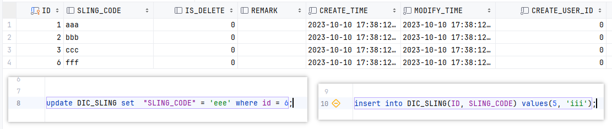
> >
> > 当我为主键字段 ID = 6 添加了锁（记录？间隙？），但与此同时无法向 ID = 5 添加数据，似乎产生了间隙锁
> >
> > 参考：[MySQL自学笔记进阶md版 - LiuJN 的个人博客 (liujjjjn.github.io)](https://liujjjjn.github.io/mysql自学笔记进阶md版/#间歇锁gap-locks) 


# MyBatis

## 动态 SQL

### 模糊查询

```sql
user_name like CONCAT('%',#{param.userName},'%')
```

- 在 Oracle 中，`concat()` 只能对两个字符串进行拼接 (字符串多的话需嵌套使用) 

```sql
company like '%' #{company} '%'
```

```sql
student_name like '%'||#{studentName}||'%'
```

- 双竖线 `||` 在 Oracle、达梦 里的意思是连接多个字符，而在 MySQL 和 Maria 中是 “或” 的意思

```xml
<if test="email != null">
	<bind name="var"value="'%' + email + '%'"/>
	and email like #{var}
</if>
```

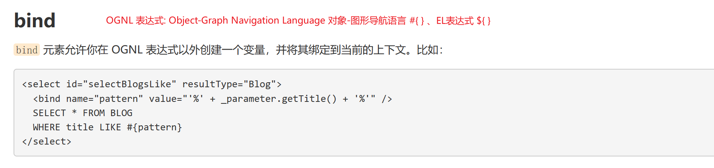

## 标签

### `<if>` 单双引号

引用：[mybatis ＜if ＞标签源码探究_mybatis if 标签 原理-CSDN博客](https://blog.csdn.net/weixin_46046749/article/details/123579518)

```xml
<if test='po.matDes != null and po.matDes == "1"'> <!-- 双引号在内 -->
    AND bbi.MAT_DES = '1'
</if>
<!------------------------------------------------------------------------------------->
<if test="po.matDes != null and po.matDes == '1'"> <!-- 单引号在内【错误写法】 -->
    AND bbi.MAT_DES = '1'
</if>
```

- MyBatis 底层会先映射出变量类型，使用 `equal()` 进行比较
- 会将 “1” 解析成 String 类型，‘1’ 解析成 char 类型，1 解析成 Integer 类型，1.5 解析成 Double 类型
- 不同类型之间进行比较，会返回 false 不进行 SQL 的拼接

```xml
<if test="isFixed != null and isFixed != ''">
    AND dm.is_fixed = #{isFixed}
</if>
```

- 【错误写法】isFixed 为数值类型，此判断失效


### `<WHERE>` 第一个 AND OR

```xml
<where>
    <if test="po.matCode != null and po.matCode != ''">
        AND t.mat_code = #{po.matCode}
    </if>
</where>
<!----------------------------------------------- 【两种写法均正确】 -------->
<where>
    <if test="po.matCode != null and po.matCode != ''">
        t.mat_code = #{po.matCode}
    </if>
</where>
```

- 若子句的开头为 “AND” 或 “OR”，*where* 元素会将它们去除


### 奇怪的知识


# Spring

## 依赖注入

### 自我注入(Self-Injection) 循环引用(circular dependency)

- 在 Spring 4.3 对应 Boot版本 1.4.0 之前，自己注入自己会引发循环注入问题
- 在 Spring 4.3 对应 Boot版本 1.4.0 之后解决此问题，**前提是单例的情况下的、非构造方法注入的情况下** 

```java
/**
 * Find bean instances that match the required type.
 * Called during autowiring for the specified bean.
 * @param beanName the name of the bean that is about to be wired
 * @param requiredType the actual type of bean to look for
 * (may be an array component type or collection element type)
 * @param descriptor the descriptor of the dependency to resolve
 * @return a Map of candidate names and candidate instances that match
 * the required type (never {@code null})
 * @throws BeansException in case of errors
 * @see #autowireByType
 * @see #autowireConstructor
 */
protected Map<String, Object> findAutowireCandidates(
        @Nullable String beanName, Class<?> requiredType, DependencyDescriptor descriptor) {

    String[] candidateNames = BeanFactoryUtils.beanNamesForTypeIncludingAncestors(
            this, requiredType, true, descriptor.isEager());
    Map<String, Object> result = CollectionUtils.newLinkedHashMap(candidateNames.length);
    for (Map.Entry<Class<?>, Object> classObjectEntry : this.resolvableDependencies.entrySet()) {
        Class<?> autowiringType = classObjectEntry.getKey();
        if (autowiringType.isAssignableFrom(requiredType)) {
            Object autowiringValue = classObjectEntry.getValue();
            autowiringValue = AutowireUtils.resolveAutowiringValue(autowiringValue, requiredType);
            if (requiredType.isInstance(autowiringValue)) {
                result.put(ObjectUtils.identityToString(autowiringValue), autowiringValue);
                break;
            }
        }
    }
    for (String candidate : candidateNames) {
        if (!isSelfReference(beanName, candidate) && isAutowireCandidate(candidate, descriptor)) {
            addCandidateEntry(result, candidate, descriptor, requiredType);
        }
    }
    if (result.isEmpty()) {
        boolean multiple = indicatesMultipleBeans(requiredType);
        // Consider fallback matches if the first pass failed to find anything...
        DependencyDescriptor fallbackDescriptor = descriptor.forFallbackMatch();
        for (String candidate : candidateNames) {
            if (!isSelfReference(beanName, candidate) && isAutowireCandidate(candidate, fallbackDescriptor) &&
                    (!multiple || getAutowireCandidateResolver().hasQualifier(descriptor))) {
                addCandidateEntry(result, candidate, descriptor, requiredType);
            }
        }
        if (result.isEmpty() && !multiple) {
            // Consider self references as a final pass...
            // but in the case of a dependency collection, not the very same bean itself.
            for (String candidate : candidateNames) {
                if (isSelfReference(beanName, candidate) &&
                        (!(descriptor instanceof MultiElementDescriptor) || !beanName.equals(candidate)) &&
                        isAutowireCandidate(candidate, fallbackDescriptor)) {
                    addCandidateEntry(result, candidate, descriptor, requiredType);
                }
            }
        }
    }
    return result;
}

/**
 * Determine whether the given beanName/candidateName pair indicates a self reference,
 * i.e. whether the candidate points back to the original bean or to a factory method
 * on the original bean.
 */
private boolean isSelfReference(@Nullable String beanName, @Nullable String candidateName) {
    return (beanName != null && candidateName != null &&
            (beanName.equals(candidateName) || (containsBeanDefinition(candidateName) &&
                    beanName.equals(getMergedLocalBeanDefinition(candidateName).getFactoryBeanName()))));
}

/**
 * Add an entry to the candidate map: a bean instance if available or just the resolved
 * type, preventing early bean initialization ahead of primary candidate selection.
 */
private void addCandidateEntry(Map<String, Object> candidates, String candidateName,
        DependencyDescriptor descriptor, Class<?> requiredType) {

    if (descriptor instanceof MultiElementDescriptor) {
        Object beanInstance = descriptor.resolveCandidate(candidateName, requiredType, this);
        if (!(beanInstance instanceof NullBean)) {
            candidates.put(candidateName, beanInstance);
        }
    }
    else if (containsSingleton(candidateName) || (descriptor instanceof StreamDependencyDescriptor &&
            ((StreamDependencyDescriptor) descriptor).isOrdered())) {
        Object beanInstance = descriptor.resolveCandidate(candidateName, requiredType, this);
        candidates.put(candidateName, (beanInstance instanceof NullBean ? null : beanInstance));
    }
    else {
        candidates.put(candidateName, getType(candidateName));
    }
}

// descriptor.resolveCandidate() 方法即使用工厂创建 bean 对象
```

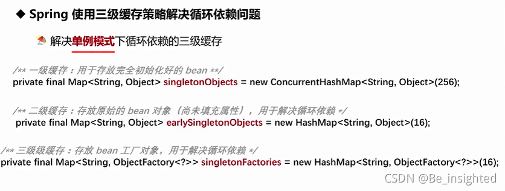

**A.class与B.class相互依赖，形成循环依赖** 

1. A实例化自己的时候发现自己依赖B，会先将自己放入三级缓存，先去实例化B
1. B实例化的时候发现发现自己依赖A，先去查一级缓存，没有，接着去二级缓存查，还没有，再去查三级缓存，找到。然后将三级缓存中的A放入二级缓存，并删掉三级缓存中的A。此时B完成自己的实例化。然后把自己放入一级缓存中，同时删除二级缓存中的自己。
1. 再去实例化A，A再去查一级缓存，完成自己的实例化，然后把自己放入一级缓存中，同时删除三级缓存中的自己。
1. 完成1、2、3后完成各自的实例化。

- 引出问题：[java - Spring源码问题：findAutowireCandidates这个if的意义是什么？ - SegmentFault 思否](https://segmentfault.com/q/1010000040994980)


## Token 过长

- jwt 生成的 Token 携带的角色、配置信息过长，导致超过 4016k，报错 400 Bad Request

```yml
server:
  port: 8086
  max-http-header-size: 102400
```


# 事务

## 事务的调用失效场景

### this 调用

- 没开启事务的方法使用 this 关键字调用开启了事务的方法，被调用方法抛出异常之后【事务失效】未回滚

- 原因：[Transactions, Caching and AOP: understanding proxy usage in Spring](https://spring.io/blog/2012/05/23/transactions-caching-and-aop-understanding-proxy-usage-in-spring) 

  > 在启动时，使用 AOP 特性，通过 **反射** 生成一个代理类负责添加事务。因此无法通过 `this.method()` 的方式开启事务
  >
  > 事务注解生效的前提是 事务方法被当前类以外的代码调用 才得以被事务拦截器拦截
  >
  > 在默认的代理模式下，只有目标方法由外部调用，才能被 Spring 的事务拦截器拦截。在同一个类中的两个方法直接调用，是不会被 Spring 的事务拦截器拦截，可以使用 AspectJ 取代 Spring AOP 代理来解决这个问题...


- 解决方式：

  1. 使用 AopContext 去获取当前的代理对象，再通过这个代理对象调用对应方法

  ```java
  StudentService studentService = (StudentService) AopContext.currentProxy();
  studentService.test2(ctx);
  ```

  2. 在本类中注入自己，通过注入的这个实例来调用

  ```java
  @Service
  public class StudentService {
  
      @Autowired
      private StudentService studentService;
      
      // studentService.otherMethod();
  ```

  

### 事务注解中的 propagation 属性

- `REQUIRED`：如果当前没有事务，就新建一个事务，如果已经存在一个事务中，加入到这个事务中。【默认】
- `SUPPORTS`：持当前事务，如果当前有事务，就以事务方式执行；如果当前没有事务，就以非事务方式执行
- `MANDATORY`：使用当前的事务，且必须在一个已有的事务中执行，如果当前不存在事务，否则抛出异常
- `REQUIRES_NEW`：不管是否存在事务，都创建一个新的事务，原来的挂起，新的执行完毕，继续执行老的事务
- `NOT_SUPPORTED`：以非事务方式执行，如果当前存在事务，就把当前事务挂起
- `NEVER`：以非事务方式执行，且必须在一个没有的事务中执行，如果当前存在事务，则抛出异常【与Propagation.MANDATORY相反】
- `NESTED`：如果当前存在事务，则在嵌套事务内执行；如果当前没有事务，则执行与【Propagation.REQUIRED 】类似的操作

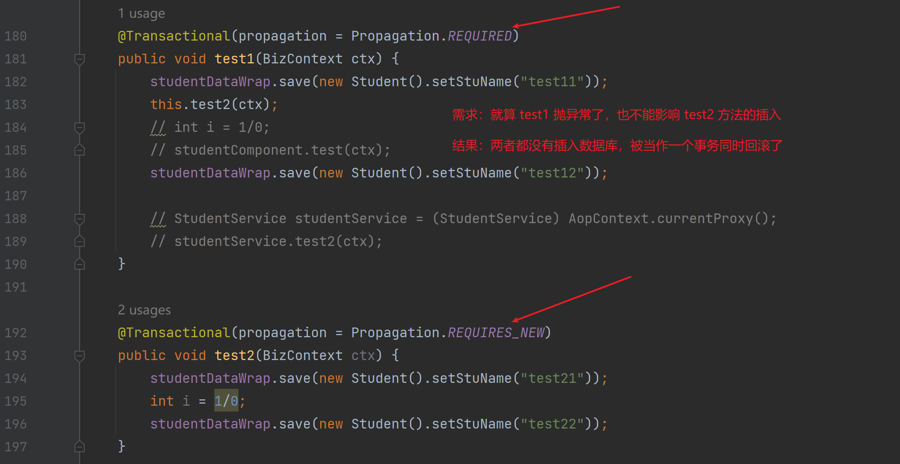


# Java

## Stream 流

### 常见操作

```java
List<Student> studentList = Arrays.asList(
        new Student(1L, "刘嘉宁", "男", 23, 85.5),
        new Student(2L, "王晓彤", "男", 23, 99.5),
        new Student(3L, "张钰曼", "女", 22, 98.5),
        new Student(4L, "张四四", "男", 23, 85.5),
        new Student(5L, "李五五", "女", 18, 65.5),
        new Student(6L, "王六六", "女", 19, 59.0),
        new Student(7L, "赵七七", "男", 17, 45.5),
        new Student(8L, "于八八", "男", 23, 85.5),
        new Student(9L, "付九九", "女", 23, 87.0),
        new Student(10L, "智十十", "男", 23, 73.5)
);
```

#### filter 过滤

```java
// filter 过滤出成绩大于 60 的学生
List<Student> filterList = studentList.stream().filter(item -> item.getScore() > 60).collect(Collectors.toList());
filterList.forEach(System.out::println);
```

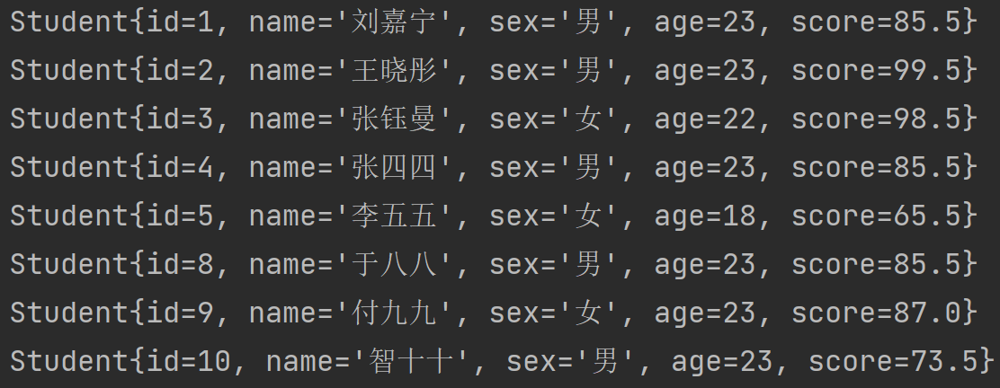

#### map 映射

```java
// map 映射出列表中的姓名字段
List<String> nameList = studentList.stream().map(item -> item.getName()).collect(Collectors.toList());
nameList.forEach(System.out::println);

studentList.stream().map(item -> item.getName())
// 也可以这么写
studentList.stream().map(Student::getName)
```

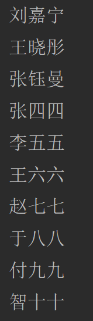

#### distinct 去重

```java
// dist 去重，将所有性别字段列表去重
List<String> distinctNameList = studentList.stream().map(Student::getSex).distinct().collect(Collectors.toList());
distinctNameList.forEach(System.out::println);
```

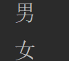

#### sorted 排序

- `Comparator.comparing()` 排序的比对方法

```java
// sorted 排序, 按照年龄逆序排序
List<Student> students = studentList.stream().sorted(Comparator.comparing(Student::getAge).reversed()).collect(Collectors.toList());
students.forEach(System.out::println);
```


#### skip 跳过前 n 个元素、limit 取前 n 个元素

```java
// skip limit 分页, 跳过前5条取2条
List<Student> top5 = studentList.stream().skip(5).limit(2).collect(Collectors.toList());
top5.forEach(System.out::println);
```

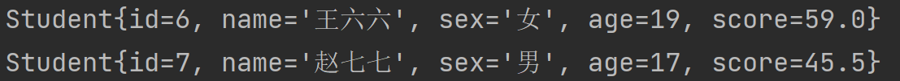

#### flatMap 将数据拆分扁平化成一个流

```java
// flatMap 将姓名拆分, 将每个人的姓名列表扁平化成一个大列表
List<String> list = studentList.stream().flatMap(item -> Arrays.stream(item.getName().split(""))).collect(Collectors.toList());
list.forEach(System.out::println);
```

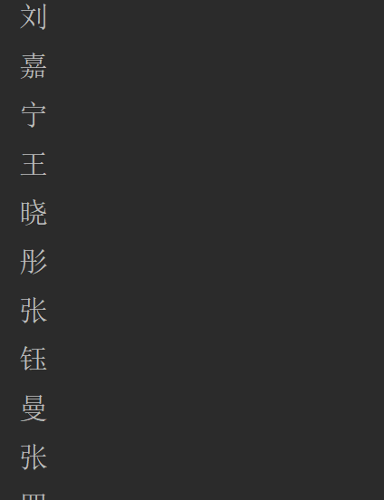

#### peek 对元素遍历处理

> 在此处发现加了 `collect()` 方法之后会改变原始数据，不加则不会改变 ？？？

```java
// peek 对元素遍历处理，将每个学生的年龄 +1
studentList.stream().peek(stu -> stu.setAge(stu.getAge() + 1)).collect(Collectors.toList());
studentList.forEach(System.out::println);
```

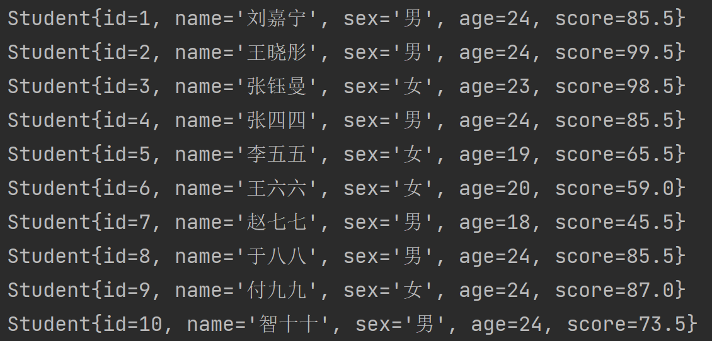

#### collect 收集器：将流转换为其他形式

###### `Collectors.toList()` 转成 list

###### `Collectors.toSet()` 转成 set

###### `Collectors.toMap(key,value)` 转成 map

```java
// collect, list 转 map
Map<Long, Student> studentMap = studentList.stream().collect(Collectors.toMap(Student::getId, item -> item));
studentMap.forEach((k, v) -> {
    System.out.println(k + " : " + v);
});
```


###### `Collectors.counting()` 返回总数，和 `count()` 一样

```java
long count = studentList.stream().count();
System.out.println(count);

count = studentList.stream().collect(Collectors.counting());
System.out.println(count);
```


###### `Collectors.joining("")` 连接到一起

```java
String collect = studentList.stream().map(Student::getName).collect(Collectors.joining("||"));
System.out.println(collect);
```


###### `Collectors.groupingBy()` 分组

```java
// 以学生性别分组，Map 的 key 为 sex 的类型，value 为 List<Student> 类型
Map<String, List<Student>> collect = studentList.stream().collect(Collectors.groupingBy(Student::getSex));
System.out.println(collect);

// 同时按照 学生性别 和 学生年龄 分组，组名为 学生性别_学生年龄
Map<String, List<Student>> collect1 = studentList.stream().collect(Collectors.groupingBy(stu -> stu.getSex() + "_" + stu.getAge()));
System.out.println(collect1);

// 按照学生是否及格分组
Map<String, List<Student>> collect2 = studentList.stream().collect(Collectors.groupingBy(stu -> {
    if (stu.getScore() > 60) {
        return "及格学生";
    } else {
        return "不及格学生";
    }
}));
System.out.println(collect2);
```

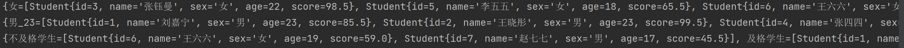

###### 使用分组实现 toMap 操作

```java
// 1ms【数据量小的情况下】 209ms【数据量 > 3W 的情况下(数据量越大越慢)】
Map<Long, Student> studentMap2 = studentList.stream().collect(Collectors.groupingBy(Student::getId, Collectors.collectingAndThen(Collectors.toList(), items -> items.get(0))));

// 替代

// 40ms【数据量小的情况下】 156ms【数据量 > 3W 的情况下】
Map<Long, Student> studentMap1 = studentList.stream().collect(Collectors.toMap(Student::getId, item -> item));

// 替代

// 0ms【数据量小的情况下】 78ms【数据量 > 3W 的情况下】
Map<Long, Student> studentMap11 = new HashMap<>();
for (int j = 0; j < studentList.size(); j++) {
    studentMap11.put(studentList.get(j).getId(), studentList.get(j));
}
```

#### findFirst 返回第一个元素、findAny 返回任意一个元素

> findAny 需要在并行流中才会生效，否则和 findFirst 结果一致
>
> - parallelStream 在并发量不大的情况下不建议使用，因为底层使用多线程 Fork/Join 实现，在创建销毁多线程时有资源消耗

```java
// findFirst 返回第一个元素
Student student = studentList.stream().findFirst().get();
System.out.println(student);

// findAny 获取任意一个元素
for (int i = 0; i < 10; i++) {
    Student student1 = studentList.parallelStream().findAny().get();
    System.out.println(student1);
}
```


#### count 总数、sum 总和、max 最大、min 最小

```java
// 返回分数小于 60 的学生总数
long count = studentList.stream().filter(item -> item.getScore() < 60).count();
System.out.println(count);

// 返回学生分数的总和，mapToDouble().sum()
double sum = studentList.stream().mapToDouble(Student::getScore).sum();
System.out.println(sum);

// 获取分数最高的学生
Student student1 = studentList.stream().max(Comparator.comparingDouble(Student::getScore)).get();
System.out.println(student1);

// 获取分数最低的学生
Student student2 = studentList.stream().min(Comparator.comparingDouble(Student::getScore)).get();
System.out.println(student2);
```


#### anyMatch 是否至少匹配一个，allMatch 是否全部匹配、noneMatch 是否全不匹配

```java
boolean match1 = studentList.stream().anyMatch(stu -> "女".equals(stu.getSex()));
System.out.println(match1);

boolean match2 = studentList.stream().allMatch(stu -> "女".equals(stu.getSex()));
System.out.println(match2);

boolean match3 = studentList.stream().noneMatch(stu -> "人妖".equals(stu.getSex()));
System.out.println(match3);
```

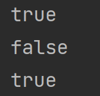

#### reduce 将流中元素反复结合起来，得到一个值

```java
// 让每个学生的成绩等于他与前一个学生的成绩和，最后一个学生的成绩就是成绩总和
Student student = studentList.stream().reduce((thisStu, nextStu) -> {
    System.out.println(thisStu);
    System.out.println(nextStu);
    System.out.println();
    nextStu.setScore(thisStu.getScore() + nextStu.getScore());
    return nextStu;
}).get();
System.out.println(student);
```


## 集合

### `{{ }}` 语法糖

```java
new ArrayList<String>(){{
	add("item1");
    add("item2");
}}
```

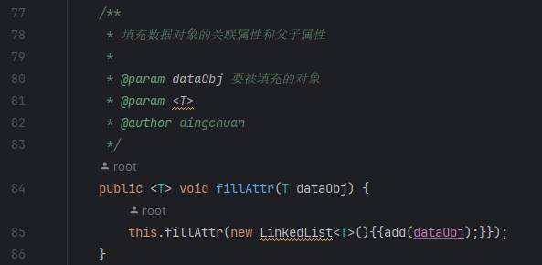

- 真正的写法

```java
new ArrayList<String>(){
    {
        add("item1");
        add("item2");
    }
}
```

- 外侧花括号为创建一个继承当前对象的匿名内部类，花括号内就是这个内部类的内容
- 内测花括号为创建一个代码块，代码块中的内容会在每次创建类的实例时被执行
- 最后 new 出的对象为 匿名内部类 向上转型到当前对象的引用
- 因此：每次执行这段代码都会创建一个 .class 文件。这个匿名内部类会持有外部对象的引用，会将外部对象暴露出去，造成内存泄漏


### `Arrays.asList()` 创建的集合调用 `add()` 异常

- `Arrays.asList()` 创建的是其内部类 ArrayList 实例，并非 `java.util.ArrayList` 
- 这个类继承自 AbstractCollection 其中的 add 方法抛出异常


